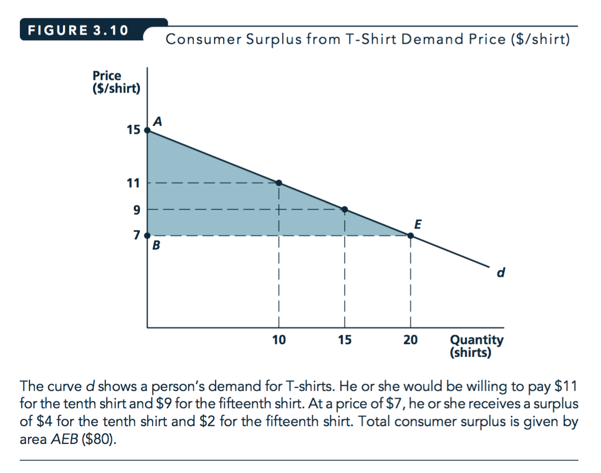

# The Demand function (L3) {#demand}

Closely follows many parts of NS chapter 3.

## Coverage outline

`r format_with_col("In lecture at this point I give you an example of a very surprising case that nonetheless may occur, at least in theory.","gray")`

\

**Key goals of these lectures (and accompanying self-study)**

*First part*

1. How do you derive an *individual's* demand curve from her utility function?^[Answer: practice, practice, practice. :)]
  - What causes shifts in either?
1. What properties do demand curves have?
1. Understand the following concepts and outcomes (and/or how to derive them):
    - Substitution and income effects (of a price change)
    - Goods that are 'substitutes' or 'complements'^[remember, this is not the same as 'perfect substitutes/complements']
    - Consumer surplus (from a transaction)
    - The lump-sum principle (and the distortion of taxation)
1. What is a *market* demand curve, and how do we derive it?
1. Understand the concepts:
    - Price elasticity (of market demand for a product), and what it means to firms' pricing strategy
    - Income elasticity (...)
    - Cross-price elasticity (between two products)
1. Be able to discuss real world examples and applications of the above


\

*[Second part](recap)*


**Understand real-world issues:**

1. A 'Fixed-basket' consumer price index (CPI) may overstate inflation

2. The lump-sum principle,  the distortion of taxation


**Fundamental concepts, useful for business \& policy:**

1. Goods may be 'substitutes' or 'complements' for one another (not the same as 'perfect' substitutes/complements!)

2. How can we consider/compute the  *Consumer surplus* from a transaction?


<br> <br> \bigskip


- `r format_with_col("Third problem set... coming soon: Preferences, Utility, Consumer optimization, individual and market demand","blue")`


## Demand functions

Previously, we considered how consumption choices determined by utility functions/indifference curves and budget constraints.  We can now consider how an individual's choice of a good varies with each element of her budget constraint:  for income and the price of each good.

We will refer to her 'quantity demanded of good X' function (or more simply, her 'demand function') as follows:


<br> <br> \bigskip

$$Quantity \: of \: X \: demanded = d_x(P_X, P_Y, I; preferences)$$

\

## Homogeneity

Homogenous (of degree zero) (demand) function
:      A function whose outcome value does not change when *all* arguments are changed *proportionally* is *homogenous of degree zero*


<br> <br> \bigskip

$d_X(P_X,P_Y,I)$ is homogenous of degree zero in its arguments.


<br> <br> \bigskip


```{block2,  type='technote'}


Let $f$ be a function of $n$ variables defined on a set $S$ for which ... [the following will always be within its domain].

Then $f$ is homogeneous of degree $k$ if

$f(tx_1, ..., tx_n) = t^k f(x_1, ..., x_n)$ for all $(x_1, ..., x_n) \in S$ and all $t > 0$

.^[Source: Martin Osborne: https://mjo.osborne.economics.utoronto.ca/index.php/tutorial/index/1/hom/t]
```

Multiply all prices and income by the same amount, and the *budget constraint is unchanged.*  Thus ( as preferences have not changed) consumption choices should not change either.

-  E.g., the budget constraint $P_X X + P_Y Y = I$ is the same as the budget constraint $2P_X X + 2P_Y Y = 2I$


*Intuition for this:* Graphically, the budget line and indifference curves are unchanged, so her optimization problem  is identical to the optimization problem before. The point of tangency between  an indifference curve and her budget line is the same as before.

Consider, if your income, as well as prices, were stated in pennies rather than pounds (e.g., 5 million pennies rather than £50,000), would your choices change?^[Of course not!  At least they 'should' not change;  your optimal choices would not change.  Perhaps in some specific context the way the problem is framed may affect people's choices, but that is  not what is being asked here.  Furthermore, we are considering 'normative' economics in the sense of 'what would rational optimizing agents do'?]

This relates to the puzzle of 'why should monetary policy and inflation have any real effect?'


## Response to income changes

`r format_with_col("Q: What happens to the quantity purchased of some good as an individual's income increases?","blue")`

\

*A: Depends on whether the good is normal or inferior.*

\

Whether it is normal or inferior (over a particular range) depends on preferences and on the change in the slope of the indifference curves with higher income/utility, as we see below.


<br> <br> \bigskip

### Defining a normal and inferior good {-}

Normal good
:     A good that is bought in *greater* quantities as income increases.

Inferior good
:     A good that is bought in *smaller* quantities as income increases.

\

```{r  fig.cap = '', out.width='70%', fig.asp=.4, fig.align='center',  echo = FALSE}
 knitr::include_graphics("picsfigs/normalgood.png")
```


`r format_with_col("In lecture we will move to PPT slides to illustrate this, beginning with 'Changes in Income: A Normal Good'. You may find these helpful (download and use 'presentation mode'.) See","gray")` [here](https://www.dropbox.com/s/qhsl6qey0wjcfe5/utility_demand_supplement.pptx?dl=0)


```{r  fig.cap = '', out.width='70%', fig.asp=.4, fig.align='center',  echo = FALSE}
 knitr::include_graphics("picsfigs/inferiorgood.png")
```


*Consider:* Here we see more income $\rightarrow$ less expenditure on Z! (Not just 'a lesser share' but actually *less*.)

This is because the *shape* of the indifference curves changes at higher incomes in this example.
When people have a lot to spend, they want to spend it on Y and not on Z. (Again *in this example*, not in general.)

Consider, if you won the lottery how much pot noodle would you buy? Pot noodle may be like good Z  in this example.

<br> <br> \bigskip

Thinking in 3d: 'as you walk up this hill, its ridge gradually moves to the west'.

```{block2,  type='note'}
To be precise, this is *not* about wealthy people being different than poor people
nor that their taste 'changes' when they become wealthy.
We are considering the same person with higher income,
and thus the potential to choose a different bundle of goods.
Empirically, these are hard to distinguish, however.

```


\

`r format_with_col("Enrichment question:","RawSienna")`

`r format_with_col("Consider: all goods cannot be inferior. Why not?","blue")`^[ There are 'adding up' conditions.
You always spend all of your income. Thus, if as your income increases, you spend less on some subset of goods,
you *must* spend more on the remaining goods.]

## Substitution and income effects from a fall (or rise) in *price*

`r format_with_col("What happens to the quantity purchased of some good when the price of the good falls or rises?", "blue")

\

*This changes both an intercept and a slope.*\

The new utility-maximizing choice is on *another* indifference curve and it is a point on that curve with a different MRS.

\

Substitution effect ('Hicksian')
:     The effect on consumption due to a change in price 'holding real income or utility constant.'


```{block2,  type='technote'}
More precisely, this is defined as the effect on the lowest-cost consumption bundle yielding this utility.

\

This may be a difficult concept to wrap your head around; take some time. This is based on a 'minimisation problem' that is 'dual' to the utility-maximisation problem from the last chunk.

This latter topic is more nuanced and complicated than we will cover in the main content of this module. \

To fully cover this, we would have to consider the theoretical concept of a 'compensated' aka 'Hicksian' demand curve,
where income is adjusted to hold utility constant while price ratios change.
This also allows us to consider 'net versus gross' substitution, and 'equivalent vs compensating variation'.

More advanced economics modules will cover this extensively and rigorously.

```

\

Income effect (of a price change)
:     The remaining effect on consumption; due to the change in purchasing power and achievable utility caused by a change in price.

Note that this is largely *conceptual*: we never *actually* observe either of these effects alone; we always observe the net effect of both.^[Although econometricians attempt to estimate each separately, through independent variation in income and prices.]


`r format_with_col("Advanced footnote","RawSienna")`^[Advanced point: the standard definition of the 'income effect' of a price change actually combines two effects that we saw when looking at the impact of an income change on consumption of X.
More consumption of each good is possible, but the MRS may differ at this higher consumption and utility level.]


\

```{r  fig.cap = '', out.width='65%', fig.asp=.4, fig.align='center',  echo = FALSE}
 knitr::include_graphics("picsfigs/incomeandsubstfx.png")
```

\

```{block2,  type='tip'}
In the lecture we move to the aforementioned [PPT slides](https://www.dropbox.com/s/qhsl6qey0wjcfe5/utility_demand_supplement.pptx?dl=0) to illustrate this, beginning with 'Change in A Good’s Price'. You may find this depiction helpful.

I also presented the answer to a problem set question on this on YouTube:
[Problem set 2: substitution and income effects of price change](https://youtu.be/D5mqyOnYaAU)

There are plenty  of other YouTube videos covering this online, with better production value than my videos, e.g.,

[Indifference Curves - Income and Substitution Effects for Inferior Goods](https://www.youtube.com/watch?v=vQsDCo-xVZY)

and

[Indifference Curves - Income and Substitution Effects for Normal Goods](https://www.youtube.com/watch?v=vQsDCo-xVZY&pbjreload=10)

```


```{block2,  type='tip'}

Some things to remember and 'remember why':

- The SUBSTITUTION EFFECT *always* goes in the opposite direction as the price change

- The INCOME EFFECT goes in the opposite direction as the price change for a normal good

- ... But the income effect goes in the *same* direction as the price change for an inferior good

    - Thus the substitution and income effects go in the same direction for a normal good,

    - ... and they go in different directions for an inferior good.

    - For an inferior good the net effect is unknown, but usually the substitution effect dominates (but see Giffen goods below)

```

***

**Read on your own (from NS), know:**

- Numerical example of the response to a price change
- The relative importance of substitution effects for most goods
- Substitution and income effects for inferior goods

\

## Different substitution effects of a price change

The substitution effect of a price change will depend on the utility function, i.e., on the curvature of the indifference curves at the relevant point.


- Perfect complements: There is no substitution effect, only an income effect of a price change. There is only a *single* cost-minimizing bundle of goods that achieves a particular level of utility (including the *original level, before the price change, of course*).

- Perfect substitutes: There may be a large substitution effect -- a price change may cause a complete switch from one good (or set of goods) to another. On the other hand there may be no substitution effect for a 'small' change in price... see examples.

- In-between utility functions: here the substitution effect of a price change depends on curvature of indifference curve at the relevant point.

<!---
Todo: give more explanation here
-->

```{r  fig.cap = '', out.width='70%', fig.asp=.4, fig.align='center',  echo = FALSE}
 knitr::include_graphics("picsfigs/substfxperfect_trim.png")
```

*Above*: We see

- (Left) when goods are **perfect complements**,^[Note, there was previously a typo, this had read 'substitutes' and the one below 'complements'] there is no Substitution effect of a price change. For prices $l$ and $l'$, the minimum-cost consumption that attains $U_1$ is the same point (A,B)

- (Right) When goods are **perfect substitutes**, if the price changes, to attain $U_1$ at the lowest cost we must either
  - See a complete shift to the other good, as above, if the 'better-bang-for-the-buck' product switches
  - or see no change in the consumption, if the same product remains the better 'bang for the buck'


```{block2,  type='note'}
Note that, for the above cases, if we consider the *combined* substitution and income effects of a price decrease in one good we will also see

- Perfect complements: some increase in the number of combinations of each good consumed, and thus greater utility

- Perfect substitutes: some increase in the amount of the original good consumed (or, if there is a switch, a larger amount of the other good than was initially affordable), and thus greater utility.
```


## The (legendary?) Giffen good


```{r  fig.cap = '', out.width='55%', fig.asp=.4, fig.align='center',  echo = FALSE}
 knitr::include_graphics("picsfigs/griffin.jpg")
```

- If the price of a good increases, can quantity demanded actually *INCREASE*?!
    - Yes, if the good is *very* inferior,  not very substitutable,  and is a large portion of income.
    We call this case a *Giffen good*.
    - It has never been seen and documented in the wild \

- See Powerpoint

- Practice question: try to draw indifference curves and budget constraints illustrating this effect for a Giffen good


## Quick recap {-#recap}


*Util-max s.t. constraints* $\rightarrow$

$$Quantity \: of \: X \: demanded = d_x(P_x, P_y, I; preferences)$$

<br> <br> \bigskip

Previous bit: What the constrained utility-maximization implied for demand...

- "Homogeneity of degree zero" of  $d_x(P_x, P_y, I)$

- How $d_x$ responds to $I$ `r format_with_col("(Rem: Inferior and normal goods)","gray")`


- How $d_x$ responds to $P_x$ `r format_with_col("(Rem: Normal or Giffen)","gray")`

    - Substitution and income effects


<!---
Todo: Motivate this more
-->


## NS App 3.2: The CPI and its biases {#cpi}

The government (and many others) want to know 'how much less (or more) is  a pound this year than a pound in the past?'
One of the most prominent measures of this is the "consumer price index (CPI)." This a *very* important number: It is used for monetary policy ('inflation targeting') and for targeting many salaries and benefits. For example, my union is always raising the complaint that salaries have not risen in line with inflation. (But don't worry, student fees have done.)

Getting this number substantially and consistently wrong can lead to huge problems;  people may be let into poverty or the government may be led into default. However, it is hard to get this measure right. Using the classical economics framework, we can consider what this means.

The UK uses a similar CPI measure to the USA.^[a change from the 'RPI' in 2003, although RPI is still used for some things] The Bank of England targets a 2\% increase in the CPI per year.^[Something to know: what has been the  inflation rate in recent years? This is an example of 'market and industry knowledge'  that employers value. True, you can look this stuff up, but having a general sense of these things rolling around in your brain will  ground your thinking.  As an analogy, suppose you were a mariner navigating the seven seas and you had to go online every time to remember which direction was North or South.]

\

*But does the CPI overstate the rate of inflation?*

It is based on a 'typical market basket' (UK: of 700 different goods and services, excluding housing, updated yearly).

\

**1982 vs 2019 two-good example**

We can consider this with a minimal example, using only our two favourite goods, the scrumptious and nutritious delicacies x and y.

Suppose in 1982 the "average household" consumed $x_{82}$  units of good x and $y_{82}$ units of good y.
The  prices were $p^x_{82}$ and $p^y_{82}$ for each of these, respectively.

Now in 2019 the average household consume $x_{19}$  units of good x and $y_{19}$ units of good y.
The prices are $p^x_{19}$ and $p^y_{18}$ for each of these, respectively.


The expenditure (in pounds) in 1982 was thus $b_{82}$:

$$b_{82}=p^x_{82}x_{82}+p^y_{82}y_{82}$$

\

How much would it cost to consume the "average 1982" basket today (2019),  with today's prices? ... This is defined as $b_{19}$:

$$b_{19}=p^x_{19}x_{82}+p^y_{19}y_{82}$$

\

The "regular" CPI  will simply take the ratio  of these two numbers:

$$cpi_{19}=\frac{b_{19}}{b_{82}}$$

\

An unadjusted (Fixed-basket) CPI 'claims' you need $I'$ to be as well off in 2019. I.e., to buy *the exact same basket*, including vinyl records.

However, as seen in the figure below, by *substituting* you could be as well off with the lower level of income $I''$. (And income $I'$ would actually make you *better* off).

```{r  fig.cap = '', out.width='65%', fig.asp=.4, fig.align='center',  echo = FALSE}
 knitr::include_graphics("picsfigs/cpi_bias.png")
```

<br> <br> \bigskip

In fact, in setting policy, the basket *is* adjusted yearly, based on a survey of consumers' spending.\ But even this is not necessarily the *right* adjustment,\ as consumers may be attaining higher or lower utility from these changes.\ The right adjustment depends on the consumers' utility functions, which are unobservable.


`r format_with_col("I asked a multi-part question on this on the 2016 Final exam; have a look, these are all on the ELE under 'Relevant previous year's assessments, with suggested answer guidelines'","gray")`

<!--
[2016 exam link](https://www.dropbox.com/s/ppbb89yflsey7n7/be2024fix_wans_2016.pdf?dl=0)
-->


\


## The Lump-Sum Principle

**Have you seen this?**


```{r  fig.cap = '', out.width='65%', fig.asp=.4, fig.align='center',  echo = FALSE}
 knitr::include_graphics("picsfigs/ukwindows.jpg")
```

`r format_with_col("1696: An Act for granting to His Majesty several Rates or Duties upon Houses for making good the Deficiency of the clipped Money...
Properties with between ten and twenty windows paid an extra four shillings (£24.79 in 2016), and those above twenty windows paid an extra eight shillings (£49.57 in 2016).} [Wikipedia: window tax](https://en.wikipedia.org/wiki/Window_tax)", "gray")`

\

Consider the 'least efficient tax': Suppose the UK government imposes a tax on all windows above 4 per house.

*Suppose all UK residents put bricks over their excess windows.* The government raises no revenue but people are certainly worse off.

\

<center> **And What's going on here?** </center>

```{r  fig.cap = '', out.width='65%', fig.asp=.4, fig.align='center',  echo = FALSE}
 knitr::include_graphics("picsfigs/tudoroverhang.jpg")
```

^[Note: 'Taxes based on ground-floor area' are mentioned throughout the web, but I couldn't find an authoritative reference to this. If anyone finds one, please let me know!]

\

**The social cost (deadweight loss, i.e., 'DWL') of taxation is greater the more taxes change 'compensated' behaviour (via the substitution effect).**^[Why 'compensated' behavior?  Essentially, because taxes in general will always leave people with less effective income, causing them to change their consumption choices to reflect the new, lower indifference curves. What matters for the deadweight loss is how the taxes change their behavior at this new lower-income state. This is a fundamental issue in Public Finance/taxation.]

The most efficient tax:

- raises the most revenue for a given utility loss

- reduces utility the least for a given revenue

- ... is a 'lump-sum tax': same tax no matter what you do (including work/leisure!)

This is a rationale for the poll tax, the proposed tax that brought down Margaret Thatcher's government

\


*A common measure of the burden:* 'amount a person would be willing to pay to avoid tax', for a given revenue raised

\


```{r  fig.cap = '', out.width='75%', fig.asp=.4, fig.align='center',  echo = FALSE}
 knitr::include_graphics("picsfigs/lumpsum1.png")
```


<!---

Todo: explain this here

-->

*A step-by-step illustration of this is given in the [PowerPoint file](https://www.dropbox.com/s/qhsl6qey0wjcfe5/utility_demand_supplement.pptx?dl=0) under 'Lump sum principle'.

The key to *fully* understanding the illustration of the dwl of the commodity-tax: how do we see that the blue and red dot both *raise the same revenue*? Although you could compute these tax revenues algebraically and see they are the same (see footnote in NS textbook), but it is better to gain intuitive insight.

The revenue can be seen as the distance on the vertical axis, representing the value in terms of Y at the pre-tax price ratio.

- This holds whether we measure it in terms of either commodity -- you just have to pick one.

The tax revenue is the difference between the individual's income and the amount he consumes; both measured in terms of one commodity only, according to the *actual opportunity cost* of that commodity, not measured with the 'after tax price'. Note...^[This illustration is a single example; to see that this holds generally, take Public Economics. There are some interesting and surprising results. A caveat: If you *can't* tax one good (e.g., leisure)\
 you *don't* want to tax all other goods equally.\
 In general, you want to tax goods that distort behaviour less overall.]


\

**Read on your own, know:**

The potential inefficiency of in-kind programmes and subsidies (App 3.3)^[In the UK, the 'welfare wall' is usually referred to as the 'benefits trap' or 'unemployment trap'. This is something successive UK governments have tried to remedy, recently, with the controversial 'Universal Credit'.]


`r format_with_col("Potential 'expansive' exam question: 'Consider the benefits of in-kind programmes rather than cash transfers. Specifically, explain why...'","blue")`


\

## Changes in the Price of Another Good;'complements' or 'substitutes'

```{block2,  type='note'}
In the previous 2-good diagrams the impact of the change in $P_X$ on $Y$ was mechanical.
With a new budget constraint and a new $X$ $\rightarrow$, the individual needed to spend the remainder on $Y$. If expenditure on one good went up, expenditure on the other good must have gone down, and vice/versa.  With 3 or more goods, this need not hold.
```
\

Complements
:     If a rise in $P_X$ leads the quantity demanded of Y, $d_Y$, to decrease (and vice-versa), then goods Y and X are (gross) *complements* to one another.

*How to remember:* 'complements' go together, so the quantity-demanded response to a price change is the same for both goods
 -- the opposite direction as the price change (unless Giffen).

<br> <br> \bigskip

Substitutes
:     If a rise in $P_X$ leads $d_Y$ to increase (and vice versa), then goods Y and X are (gross) *substitutes* to one another.

\

```{block2,  type='tip'}
A tip on how to remember 'complements' vs 'substitutes':

'Substitutes' are competing to meet the same desires, so when you buy more of one, you tend to buy less of the other.\
Thus the quantity demanded response to a price change go in opposite directions for the two goods\
Thus, as quantity-demanded for good A typically goes in the *opposite* direction as the price of A\
... quantity demanded for a substitute good B will go in the *same* direction as the price of A.^[`r format_with_col("Adv:","RawSienna")` These 'cross-price effects' include both *substitution* and *income* effects. (See NS micro quiz 3.3).]

```


## Individual demand curves

- Quantity of X demanded

<br> \bigskip

$$d_X(P_X,P_Y,I; \: preferences)$$

<br> \bigskip

- 'Individual demand curve': depicts how the amount of a good an *individual* buys responds to that good's price

How do we derive this (graphically)?


We can 'map it out' by increasing $P_X$ $\rightarrow$ budget constraint shifts in $\rightarrow$.
In each case we find new point of tangency with indifference curve. We plot this in the example below (better illustrated in the PowerPoint, perhaps.)

\

```{r  fig.cap = '', out.width='70%', fig.asp=.4, fig.align='center',  echo = FALSE}
 knitr::include_graphics("picsfigs/dmd1.png")
```


```{r  fig.cap = '', out.width='70%', fig.asp=.4, fig.align='center',  echo = FALSE}
 knitr::include_graphics("picsfigs/dmd2.png")
```

```{r  fig.cap = '', out.width='70%', fig.asp=.4, fig.align='center',  echo = FALSE}
 knitr::include_graphics("picsfigs/dmd3.png")
```


```{r  fig.cap = '', out.width='70%', fig.asp=.4, fig.align='center',  echo = FALSE}
 knitr::include_graphics("picsfigs/dmd4.png")
```


## Shifts in an individual's demand curve

`r format_with_col("Q:  What might cause the (individual's) demand curve for a product to shift (inward or outward)?","blue")`


*Not:*

- *Not* 'a change in the price of that good'.
- *Not* a shift in the supply curve.

*Yes:*

- Change in price of complements or substitutes for that good
- Change in income
- Perhaps: Change in consumer's information, preferences,^[Note: Economists disagree as to how to consider or model changes in preferences] or other factors (weather, etc).

`r format_with_col(" I'm sure you can see how I could write a multiple-choice question about this.","gray")`

```{block2,  type='warning'}

Be sure you understand shifts vs movements along, and 'demand' vs 'quantity demanded'.

Know the difference between shifts in a shift in a demand (or supply) curve and movements along a demand curve, and the terminology.\
This will almost surely be on one of the exams in some form, see e.g., NS micro quiz 3.4.

- Hint: I suggest you avoid referring to 'supply and demand'; refer to either 'supply and demand *curves*' or 'quantity demanded or supplied'.


```


## Consumer surplus

Consumer surplus
:     The extra value individuals receive from consuming a good over what they pay for it.

<br> \bigskip

- What people would be willing to pay for the *right* to consume a good *at its current price* rather than not being able to buy it at all.^[In other words, if you said to a consumer 'this product will stop being produced/offered  unless you pay us enough money',  this is the maximum amount the consumer would be will be willing to pay to keep the product on the market,  at its current price.]

- The area between the demand curve and the market price

- A measure of consumer welfare, useful for policy analysis


```{r  fig.cap = '', out.width='70%', fig.asp=.4, fig.align='center',  echo = FALSE}
 
```

```{block2,  type='technote'}

*Advanced math-y:*: With a linear demand curve this is a triangle, which has an area that is easy to compute. More generally, this is a `definite integral'.


```  

This can be applied to the individual or market demand curve to obtain individual or total consumer surplus (although there are some technical issues with the latter).

Also, 'introducing a new good...'^[This concept can also be applied to measuring the value added by the introduction of a new good (see Application 3.4). This is useful to know for policy, particular in formulating subsidies for R\&D and in adjusting the CPI. It also could be used to compute damages in court cases where a firm is accused of stifling innovation.]

`r format_with_col("Note: We may skip section 'consumer surplus and utility' in lecture, but please read over it for understanding","gray")`

<br> \bigskip

## Market demand (function) {#mktdemand}

Market demand (or better, 'market quantity demanded')
:     The total quantity of a good or service demanded by all potential buyers

- This just sums the individual quantities demanded (at a given price)


<br> \bigskip


Market demand curve
:     Relationship between total quantity demanded of a good and its price, ceteris paribus

- Sum the individual demand curves ('horizontally' ... quantities demanded at each price)


```{r  fig.cap = '', out.width='70%', fig.asp=.4, fig.align='center',  echo = FALSE}
 knitr::include_graphics("picsfigs/summarketdemandcurve.png")
```

`r format_with_col("Numerical examples of this may be covered in tutorial, and on an exam/assessment","gray")`

<!--
LC: Illustrate 'sums horizontally' on visualiser if possible*
-->


Some of our previous results about individual demand also hold for market demand, while others do not, or only if we make restrictive assumptions

## Shifts in the Market Demand Curve


Shifts in the market demand curve are caused by similar things that cause individual demand curve shifts

- Increases in overall income (for normal goods)
- Reduced prices of complements, increased price of substitute
- Change in tastes

```{block2,  type='technote'}
However, the aggregate income does not have a single effect; it cannot be easily reduced to a single variable here. You can only express the demand curve as a function of aggregate income under restrictive assumptions. In general, it depends *who* gets this income. (See 'aggregation issues').
```

(In addition, the market demand curve could shift out if more consumers enter the market, e.g., because of demographic change.)

\

**A random example:**

- 2008: 'Gas prices forcing demand for SUVs to plummet' [LINK](http://www.thehour.com/wilton/article/Gas-prices-forcing-demand-for-SUVs-to-plummet-8257785.php)

- 2015: 'Economy, gas prices drive demand for SUVs, high-end cars' [LINK](http://www.sj-r.com/article/20150809/NEWS/150809569)


## Elasticities

`r format_with_col(" This is a fundamental mathematics concept that comes from Physics;  it's not just for Economics.","gray")`

How do we measure and compare the extent to which one thing responds to another? E.g., which is 'larger'?:

- the change in quantity demanded of oranges when the price of oranges rises or
- the change in quantity demanded of apple juice when the price of apple juice rises?

`r format_with_col("(Or the response to changes in the price of a related good, or to income.)","gray")`

Difficulty: These things are measured in different *units* and the prices have different starting values.

<br> \bigskip

**Elasticity:** the measure of the \% change in one variable brought about by a 1\% change in another variable.

- a *unitless* measure; will be the same no matter how these variables are measured.

`r format_with_col("Think of *responsiveness* when talking about elasticity. Actually it's a measure from physics having to do with rubber bands, they tell me.","gray")`

`r format_with_col("Advanced footnote","RawSienna")`^[Strictly speaking we are talking about the limit of these responses, i.e., derivatives.
  The elasticity is basically the derivative of $ln(y)$ with respect to $ln(x)$; useful to know if you want to run a regression computing an elasticity, or if you want to interpret such a regression.]

<br> \bigskip

If a 5\% fall in the price of oranges typically results in a 10\% increase in quantity bought...

- we say that each percent fall in the price of oranges leads to an increase in sales of about 2 percent.

- I.e., the ‘‘elasticity’’ of orange sales with respect to price is about 2,

\

*Note that elasticities may not be constant*; they may depend on the starting point;  e.g., linear demand implies a different price elasticity at each point.

\


## Price elasticity of demand

**Price elasticity of demand:**

$$e_{Q_{d}, p} = \frac{percent \ change \ in \ Q_d}{percent \ change \ in \ p} $$
$$  = \frac{\Delta Q_d}{Q_d}/\frac{\Delta p}{p}$$

\

This should always be negative (except for Giffen goods).

It is a *unitless measure* related to the slope of the demand curve.

It is *very* important for price-setting firms (more on this later).

\

## Examples from the headlines {-}

[India’s Hike Messenger takes aim at WhatsApp](https://www.ft.com/content/2665c794-76a0-11e6-b60a-de4532d5ea35)

> “Reliance ended up showing that there is elasticity in the market. If you drop prices, people will come on board,” he said.

\

['Next' to add more space despite retail sales ‘moving backwards’](https://www.ft.com/content/932927d8-266c-3559-b87a-8d3efb07d5e1)


> The retailer does not expect any impact from the drop in sterling since the Brexit vote to kick in until at least the Spring of 2017, as it had hedged some of its foreign-currency exposures in advance. Still, it expects expenses to rise by up to 5 per cent next year.

> 'The last time we had to increase prices (which was in 2010 when cotton prices soared) we estimated that price elasticity was around 1.1. If that remains the case today, a retail selling price increase of 5% would result in a fall in unit sales of -5.5% and a fall in like for like sales value of between -0.5% to -1.0%. In the scheme of things, we think that this drag on sales is manageable and less damaging than taking a significant hit to margin.'


\

## Properties of price elasticity of demand

- Goods with many close substitutes at a similar price will be highly elastic
-  with few substitutes ...  inelastic
- Typically: more elastic in the *long run* than the short run. `r format_with_col("Q : why?","blue")`^[Ans: Over time, consumers can adjust to price changes by changing their consumption patterns. E.g., if petrol gets more expensive I can switch to a hybrid or electric car, or a bicycle.]


<br> <br> \bigskip


<!---
Todo: give more explanation here
-->

We refer to price elasticities with the following terminology:

$e_{Q,p}$ | $abs(e_{Q,p})$ | Term         |
|-----------|-------------|--------------|
| $< -1$    | $>1$        | Elastic      |
| $= -1$    | $=1$        | Unit Elastic |
| $> -1$    | $<1$        | Inelastic    |

`r format_with_col("Note that sometimes elasticities are expressed in absolute value terms (a positive number). It should be clear from the context.","gray")`


\

**Consider an individual's expenditure on a product.**

The total expenditure (the firm's revenue from this): price $\times$ quantity

By taking the *total differential* of this (you don't need to), and recalling the 'multiplication rule' of derivatives...

\

We have that for *small changes* in price, the percent *change* in total expenditure is:

<center> **percent change in price + percent change in quantity** </center>

\

Try it out (for small changes) and you see this will hold approximately.

\

As $e_{Q,P}$ tells you the percent change in quantity for each (small) percentage change in price, we can use this to determine the change in expenditure for a small change in price.

\

**Considering very small increases in a good's price:**

-   If the (individual's) demand is *price-elastic*,  quantity will decrease by a *larger* percentage than price increased.  Thus her expenditure (on this good) will *decline*.

-   If the (individual's) demand is *price-inelastic*,  quantity will decrease by a *smaller* percentage than price increased.  Thus her expenditure (on this good) will *increase *.

-   If the (individual's) demand is *unit-elastic* (with respect to price),  quantity will decrease by a *the same* percentage as price increased.  Thus her expenditure (on this good) will *be unchanged*.

<br> <br> \bigskip


```{block2,  type='technote'}
Example and (slightly more advanced) algebra...

If price rises by 20\% and quantity demanded falls by 20\% what happens to revenue?

\

Suppose p=10 and q=10 so TR=100. Then when p=12 and q=8 TR=96. Huh? Price increased by 20\% and quantity decreased by 20\% so shouldn't TR be unchanged?  No! This only works for small changes.

\

TR is unchanged when p $\times$ q stays the same. With a change in each $\delta p$ and $\delta q$, the new revenue is

$(p+\delta p)(q+\delta q) = pq+\delta p q + \delta q p + \delta p \delta q$.

This is the same as before if $pq=pq+\delta p q + \delta q p + \delta p \delta q$, i.e., if

$\delta p q + \delta q p + \delta p \delta q=0$, i.e., if

$\delta p q + \delta p \delta q =-\delta q p$, i.e., if

$\delta p q/p + \delta p \delta q/p =-\delta q$, i.e., if

$\delta p/ \delta q (q/p) + \delta p /p =-1$, i.e., if

$-e_p +  \delta p /p = -1$

In the limit, as  $\delta p$ goes to zero, this gives us that 'unit elasticity means a small change in quantity leads to no change in revenue.'

```

\

**Important question/result**

`r format_with_col("Q: Suppose a firm is setting its price and selling to only one individual , and facing no  competitors. It should basically never want to set its price at a point where demand is inelastic. Why not?","blue")`^[Ans: If it were at such a point, it could raise its price and its revenue would increase and costs would decline \
 (because it would be selling fewer products but for greater total revenue.) \
 A caveat is that it might do this for a long term strategic advantage; e.g., to gain customer loyalty and market share, intending to take its profits later.  we come back to a related point later in the context of monopoly pricing.]


\

 \


### Price elasticity of demand: also read/consider {-}

- Numerical example (may be covered in tutorial)
- Skip: Unit Elastic Curve
- Read on your own: Application 3.7: An Experiment in Health Insurance

\


## Income elasticity of demand; Normal, luxury, and inferior goods {#income-elast}

Income elasticity of demand
:      \% change in quantity demanded of a good in response to 1\% change in income (approximately).


$$e_{Q_d,I} = \frac{percent \ change \ in \ Q_d}{percent \ change \ in \ I} $$
$$  = \frac{\Delta Q_d}{Q_d}/\frac{\Delta I}{I}$$
\


<br> \bigskip

**Normal goods:** $e_{Q,I} > 0$

\


**Inferior goods:** $e_{Q,I} < 0$

\


**Luxury goods:** $e_{Q,I} > 1$


\


E.g., cocaine is a luxury good, if, when I win £1000 in the lottery, I will increase my consumption of cocaine by *more* than £1000 ...
 (assuming, as in classical models, that I treat all sources of income the same

`r format_with_col("Q: Is a luxury good a normal good?","blue")`^[Ans: Yes (do you know why?)]


<br> <br> \bigskip


\textcolor{blue}{Q:  (micro quiz): Why is it that not every good can have an income elasticity of demand greater than 1?
 Can every good have an income elasticity of demand less than 1?}


### Some real-world discussion of this {-}

<!---
Todo: give more explanation here
-->

[Prof. Muellbauer letter to FT](https://www.ft.com/content/4ea79d96-a4d6-11e5-a91e-162b86790c58)

> Sir, Professor Gordon Gemmill (Letters, December 14), surprisingly for a trained economist, assumes an income elasticity of demand of zero for housing: that is, that people do not demand more and better housing as they become richer. Nowhere in the world is this the case! My own empirical work demonstrates that around two-thirds of the rise in UK house prices, corrected for general inflation, since 1980 is because supply is not keeping up with income and population growth. Other drivers do exist ... The price effects of extra supply take time to build up. I agree on that. But just imagine what would happen if we did nothing more than we are now doing: population and income growth would drive prices even higher even though we already hold the record for rises in house prices since 1970 among the group of seven leading high-income countries. We need to build far more housing, in the right locations. And we need to start now.
> -  Prof John Muellbauer Nuffield College, Oxford, UK


\

## Further material to study

Please read the rest of NS chapter 3, including

- Some elasticity estimates (note these are a bit dated)

\

Problem set on this material will be included soon.

<!---

## Going forward: examples of things you should already have some memory of from previous modules (BEE1029 etc)
- Producer (and consumer) surplus
- Deadweight loss (basics)
- Possible impacts of income taxes on labour (broadly)
- Impact of import quota on consumer surplus
- Externalities, social versus private costs (general principles)
- Public goods (definition, basic principles of provision)
- Firms entering and exiting the market (zero profit condition)
- General efficiency of perfectly competitive equilibrium (very basic)
- MC, ATC, AVC (basics)
- Perfect competition, price-taking
- Firm cost-minimisation, marginal productivity (RTS) price-ratio condition (basics)
- MR=MC optimization (broadly)

-->


