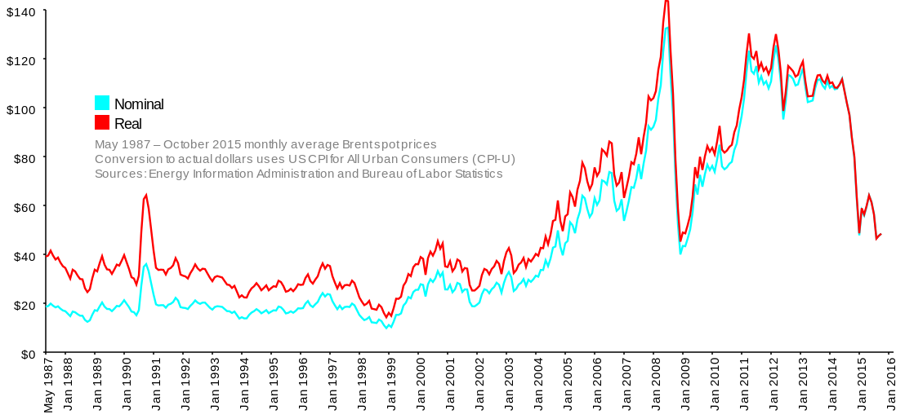

# Math tools and empirical analysis - -- coverage outline {#math-tools}


*Note:* We are not doing the Math Tools as a  separate lecture: this is required *self-study*. We will briefly cover the idea of *empirical work*.

We will come back to revise this somewhat (in lecture and tutorials) as we *apply* these maths concepts.

*Goals of this material:*


- (Re)-aquaint you with some of maths tools we will use
    - without scaring you


- Give a flavour of what *empirical* microeconomics is
    - and you a sense of some of the key issues in empirical work

<br> \bigskip

*Covers:*

- NS Chapter 1a: Mathematics used in Microeconomics

- Similar coverage in other (free and online) texts


- I give a 'calculus for dummies' below to make this clearer

- The math is here to help you, don't let it scare you, and don't worry if you don't understand everything; we will cover it again in context.

*Do: Understand what the math is \underline{about} and how to use it. Don't worry about memorizing 'cookbook rules' that can be easily looked up.*


<br> \bigskip

## Other maths resources

I am 'curating' some materials to help you revise the maths if you are having some difficulties there.

Firstly, note that the Nicholson and Snyder text has a very relevant and useful appendix 2 chapter 1 specifically covering the most important maths; I have also echoed these in the handout. I covered it in some previous years (can you view the recap HERE? I covered it from minute 31, about), but it didn't seem so helpful to try to cram all of this into a lecture, so I stopped doing it.


<br> \bigskip

Warwick maths notes

The University of Warwick put up some decent 'refresher notes' for incoming economic students. I've re-hosted these on my Dropbox, with some comments on which parts are more relevant. (And remember, with a free dropbox account you can add comments and questions directly on these files which I will try to respond to).

<p><a href="https://www.dropbox.com/s/99ugisobfvuc15e/Warwick_maths-revision-notes-1_drcomments.pdf?dl=0">WW notes 1</a>?</p>
<p><a href="https://www.dropbox.com/s/93xw3hwv9oqlymn/WW_maths-revision-notes-2_drcomments.pdf?dl=0">WW notes?2</a></p>
<p><a href="https://www.dropbox.com/s/93xw3hwv9oqlymn/WW_maths-revision-notes-2_drcomments.pdf?dl=0">WW notes 3</a></p>
<p>(<a href="https://www.dropbox.com/s/0ppmpw5t5anfpd8/WW_maths-revision-notes-4_Drcomments_slightlylessrelevant.pdf?dl=0">Less relevant: WW notes 4?</a>)</p>
<p><a href="https://www.dropbox.com/s/0ppmpw5t5anfpd8/WW_maths-revision-notes-4_Drcomments_slightlylessrelevant.pdf?dl=0">WW notes 5: the "inequalities" stuff is relevant?</a></p>

[WW notes 1](https://www.dropbox.com/s/99ugisobfvuc15e/Warwick_maths-revision-notes-1_drcomments.pdf?dl=0">WW notes 1)
[WW notes 2](href="https://www.dropbox.com/s/93xw3hwv9oqlymn/WW_maths-revision-notes-2_drcomments.pdf?dl=0">WW notes?2)
[WW notes 3](https://www.dropbox.com/s/93xw3hwv9oqlymn/WW_maths-revision-notes-2_drcomments.pdf?dl=0)
[Less relevant: WW notes 4](https://www.dropbox.com/s/0ppmpw5t5anfpd8/WW_maths-revision-notes-4_Drcomments_slightlylessrelevant.pdf?dl=0)
[WW notes 5: the "inequalities" stuff is relevant](https://www.dropbox.com/s/0ppmpw5t5anfpd8/WW_maths-revision-notes-4_Drcomments_slightlylessrelevant.pdf?dl=0)

**Khan** A *very* good resource for maths learning/revision:

The Khan academy has really great well-designed course materials including videos and all sorts of interactive resources.really, I think this is the best place to learn this stuff!

Khan academy: \url{https://www.khanacademy.org/math/},  e.g., see their introduction to differential calculus.

Some Khan courses/sections I would recommend in particular


- Pre-algebra (you should know all of this)

- Algebra basics (all of this)

- Algebra I (nearly all of this is relevant, accepting a few things like irrational numbers)

- Algebra II  ('Functions' and possibly a few other parts)

-  Statistics (mainly just 'discrete random variables'; especially the 'mean')

- Helpful: Calculus as 'rates of change'; just the basic concept of a derivative

[comment]: <> (2024EE)

## Simple stuff

`r format_with_col("Please note: if this depiction is too abbreviated, please consult the NS text, or the Khan academy and Warwick resources mentioned above!","brown")`

[comment]: <> (2024BB)

`r format_with_col("I expect to cover this in the second lecture","gray")`

[comment]: <> (2024EE)

(Univariate) Function
:     A 'map' from one or more *variables* ($x$) (or 'variables') to an outcome ($y=f(x)$)

- for each value of $x$ the function tells you a single value of $f(x)$; typically we assign $y=f(x)$


Note: 'Variables' are more formally called the 'arguments' of a function


<br> \bigskip

Linear function
:     A function of the form $y=a+bX$; e.g., $y = f(x) = -10 + 3x$

- Plotted as a straight line; intercept $a$, constant slope $b$

(Technically this is an 'affine' function; a linear function doesn't have an intercept)

Adv, Maths: For strictly linear functions (not including functions with constants)

$f(a X_1 + b X_2) = a f(X_1) + b f(X_2)$

for any values of $a$, $b$, $X_1$ and $X_2$

In particular 'the function of the average is the average of the functions' (this also holds for affine functions).
This does *not* hold in general for nonlinear functions.

<br> \bigskip

Slope of $y = f(x)$
:      The change in y for a given change in x.  'Rise over run'.

- Arc slope: slope over a range

- Point slope: slope of the tangent to a curve at a point

***

Nonlinear (univariate) function
            : A function $f(x)$ of a form other than $f(x) = y=a+bX$;

- E.g., a quadratic function $y = f(x) = a + bx + cx^2$
    - E,g, $y = f(x) = 10 - 2x + 3x^2$
- Or a logarithmic $y=ln(x)$ or exponential function $y = exp(x)$


*Note:* I will try to limit things to linear and quadratic functions, and possibly exponential and log functions.
I will remind you of the rules for dealing with these whenever it is necessary.


<br> \bigskip


For linear functions the slope is the same at any point. For nonlinear functions it may differ at each point.

```{r  fig.cap = '', out.width='50%', fig.asp=.4, fig.align='center',  echo = FALSE}

knitr::include_graphics("picsfigs/linearslope.jpg")
```

```{r  fig.cap = '', out.width='50%', fig.asp=.4, fig.align='center',  echo = FALSE}
 knitr::include_graphics("picsfigs/nonlinearslope.jpg")
```


Think of the slope of a mountain versus the slope of a wheelchair ramp.

***

```{r  fig.cap = '', out.width='90%', fig.asp=.4, fig.align='center',  echo = FALSE}
x <- c(-3,-2,-1,0,1,2,3)
y <- 2+2*x
yq <- -x^2 +10*x

linq_hux <- hux(data.frame(x,y,yq)) %>%
  rename("y=f(x)"= y, "y=g(x)"=yq) %>%
  huxtable::add_colnames() %>%
    rbind(c("","A linear function: 2+2x", "A quadratic function: -x^2+10x"),.) %>%
  theme_plain


#knitr::include_graphics("picsfigs/linearquadratic.png")
```

Consider the original values of $x$ `r x`


Now consider the linear function $y = f(x) = 3+2x$. Applying this function to these values yields `r  3+2*x`.

Now consider the quadratic function $y = g(x) = -x^2+15x$. Applying this function to these values yields `r -x^2 +15*x`.

Putting this all together:

`r linq_hux`

The point here is that increasing X by 1 has the same effect on Y wherever you start, for a linear function
but a different effect depending on where you start for a nonlinear function

***

```{r  fig.cap = '', out.width='70%', fig.asp=.4, fig.align='center',  echo = FALSE}
 knitr::include_graphics("picsfigs/concaveconvexquadratics.jpg")
```

Instantaneous rate of change (instantaneous slope)
:    The slope of the line *tangent* to the curve at a single point


`r format_with_col("Adv, Math: This is the limit of the 'rise over run' as the run goes to zero","RawSienna")`

- Convex function: Slope everywhere increasing, unique minimum where slope $=0$

- Concave function: Slope everywhere decreasing, unique maximum where slope $=0$

`r format_with_col("Note: we are referring to the signed value of the slope here, not the absolute value. E.g., for the convex case depicted, it goes from a negative slope to a zero slope to a positive slope","gray")`

<br> \bigskip

For *these* functions the slope is different at each point.

Note: We will mainly deal with functions like these,  with a single minimum or maximum that occurs at the unique point with slope zero.

Quadratic function are convex if the $x^2$ term has a positive sign and concave if it has a negative sign.
That's because at extreme values of x the term with the largest exponent will dominate all other terms.

Example of a convex function: Tiger's golf earnings per game as function of hours of golf retraining... he had to get worse before he could get better, they say.

Or cost per smoothie as function of employees behind smoothie counter.

One example of a concave function: how funny I am as function of beers I drink (on the other hand, how funny I *think* I am may be an everywhere increasing function.

***

Derivative of a function
:     A *derivative* of a function $f(x)$ is another function called $f'(x)$. $f'(x)$ tells us the *slope* of the function $f(x)$ at any point $x$.

- For example, the derivative of the function $f(x) = 2x + 3$ is $f'(x) = 2$
    - For this linear function the slope is a constant, 2

***


`r format_with_col("We will come back to the following examples later.","gray")`


- E.g., the derivative of the quadratic function $f(x) = x^2 -4x + 1$ is $f'(x) = 2x - 4$

<br> \bigskip

```{r  fig.cap = '', out.width='50%', fig.asp=.4, fig.align='center',  echo = FALSE}
 knitr::include_graphics("picsfigs/plotaquadfncnR.png")
```

***

- derivative of the quadratic function $f(x) = x^2 -4x + 1$ is $f'(x) = 2x - 4$


```{r  fig.cap = '', out.width='50%', fig.asp=.4, fig.align='center',  echo = FALSE}
 knitr::include_graphics("picsfigs/plotaquadfncn_andderiv.png")
```


- E.g., the slope at $x=1$ is $f'(x;x=1) = 2\times 1 - 4 = -2$

- The slope is zero where $f'(x)=2x-4=0$, or where $x=2$

    - *Is $x=2$ at a min, a max, or neither? How do we know?*


## Minimum, maximum, or neither?

- $f'(x)$ is a function that tells us the slope of $f(x)$, or how $f(x)$ changes in $x$ at any point $x$
- In turn, the derivative of $f'(x)$ is called $f''(x)$. This tells us how the *slope* changes as $x$ increases


<br> \bigskip

Oversimplifying a bit:

`r format_with_col("(Adv, Math: Essentially, for a class of functions where the domain is not bounded)","RawSienna")`

- if the slope is always increasing, i.e., if $f''(x)>0$ everywhere, the function is *convex* (u-shaped), and has a single minimum where $f'(x)=0$
- if the slope is always decreasing, i.e., if $f''(x)<0$ everywhere, the function is *concave* (inverse-u-shaped), and has a single maximum where $f'(x)=0$

## Functions of two or more variables (multivariate functions) {#multivar-functions}
Utility, profit, cost, production, returns, etc.

- May depend on multiple variables/inputs
- Need to illustrate tradeoffs between these


$$y=f(x,z)$$

- $y$ may increase and/or decrease in $x$ and in $z$

- The rate of increase of y in $x$ may depend on the values of $x$ and $z$
     - Similar for the rate of increase of y in z


<br> \bigskip

E.g., $$y=\sqrt(xz) = x^{1/2}z^{1/2}, x \geq 0, z \geq 0$$


\

Note the outcome will increase in each argument at a decreasing rate.

What does it look like? 3d: project up to y from a "map" of x and z coordinates on the desk.

This is hard to picture; 'contour lines' can help.

***

Projecting a function up from X,Y space into the Z axis:


```{r  fig.cap = '', out.width='75%', fig.asp=.4, fig.align='center',  echo = FALSE}
 knitr::include_graphics("picsfigs/doubledip.jpg")
```

## Contour lines (we will come back to this later) {#contourlines_math}

Contour lines
:     Level sets - depict combinations of variables that hold the function constant at a particular value
:     f(x,z) = A for some value $A$

Level sets: *E.g., indifference curves*, *isoquants* and *isocost* curves.


`r format_with_col("Don't worry if you find this discussion of level sets confusing. We will come back to it later in the module for a more specific case.","gray")`

***

```{r  fig.cap = '', out.width='75%', fig.asp=.4, fig.align='center',  echo = FALSE}
 knitr::include_graphics("picsfigs/contourlines.jpeg")
```


Note: It is difficult to depict more than 2 dimensions on a piece of paper.  So we find the values for the 2 variables that give us a particular value for the third ... which tells us how these trade off.


<br>\bigskip

***

Consider a production function:

$$Y = f(K,L) = \sqrt(KL)$$

<br> \bigskip

Setting this equal to 1 we can map out 'all combinations of K and L that produce output $Y=1$'.

We do this by solving for the amount of K needed to produce 1 as a function of L
and then plotting this against a range of L

<br> \bigskip

$$  Y = \sqrt(KL) = 1 \rightarrow KL = 1 $$

<br> \bigskip

$$ \rightarrow K = 1/L $$

<br> \bigskip

Setting this at Y = 2

$$  Y = \sqrt(KL) = 2 \rightarrow KL = 4 $$
$$ \rightarrow K = 4/L $$


***

Let's see the value of this function for some random combinations of K and L:

```{r  fig.cap = '', out.width='75%', fig.asp=.4, fig.align='center',  echo = TRUE}

K <- rep(c(1,2,3,4), each = 4)
L <- rep(c(1,2,3,4), times=4)
y <- sqrt(K*L)

contour_ex <- hux(data.frame(K,L,y)) %>%
  huxtable::add_colnames() %>%
  theme_plain


 #knitr::include_graphics("contourcombos.png")
```

For values of K `r K`
and L `r L`
we have the values of $y=\sqrt(K\times L)$:

`r contour_ex`

Note that different combinations of K and L yield the same Y. E.g., in the above table we see three distinct pairs of K and L yielding Y=2. We can consider 'what combinations of values of this function yield a particular value?

Connect values of K and L that lead to the same value of y yields 'level sets' or 'contour lines'.

Below, we plot all combinations of X and Z that satisfy $Y = \sqrt(XZ)$, for three values of Y: Y=1, Y=2, and Y=3.

```{r, fig.cap='contour lines for Y = sqrt(XZ)'}

eq = function(x){1/x}
eq2 = function(x){2/x}
eq3 = function(x){3/x}

ggplot(data.frame(x=c(0, 3)), aes(x=x)) + stat_function(fun=eq, geom="line", aes(colour = "Y=1")) + stat_function(fun=eq2, geom="line", aes(colour = "Y=2")) +  stat_function(fun=eq3, geom="line", aes(colour = "Y=3")) + xlab("X") + ylab("Z") + coord_cartesian(ylim = c(0,3))


```


***

## Simultaneous equations

```{r  fig.cap = '', out.width='55%', fig.asp=.4, fig.align='center',  echo = FALSE}
 knitr::include_graphics("picsfigs/simeqn_1.gif")
```

As shown above, the pair of equations

$$ y =-x+7 $$
$$ y=2x+1 $$

holds only where $x=2$ and $y=5$.^[Above example, diagram, from [mathbits](https://mathbitsnotebook.com/Algebra1/Systems/SYlinearGraphic.html); see also [Khan academy, systems of equations](https://www.khanacademy.org/math/algebra/x2f8bb11595b61c86:systems-of-equations#x2f8bb11595b61c86:introduction-to-systems-of-equations).]


***

Another example

$$ X + Y = 3 $$
$$ X - Y = 1 $$

\

Holds only where $X=2, Y=1$, the 'unique solution'


*Note*: Be sure you know how to solve the above.


`r format_with_col("Adv math: Note, in general, we need as many equations as unknowns (above 2 of each) to *possibly* be able to find a solution.  However, some sets of equations have *no* solution, and some may have *multiple* solutions.  Consider plotting overlapping lines, or parrallel lines, and looking for the point(s) of intersection.","RawSienna")`

\


<br> \bigskip


\

It is meaningless to ask 'how does a change in X affect Y?' in the above context.
Equally meaningless: 'how does the price affect the quantity exchanged?' in a demand-supply Marshallian cross.

## Empirical microeconomics/econometrics {#empirical}

Empirical research

:     Uses evidence from the *real world*, i.e., observation, to answer questions (rather than introspection and theory)


<br> \bigskip

Econometrics
:     The 'science' of using data to answer economic questions
:     Uses statistical tools and often economic theory


<br> \bigskip

Micro-data
:     Data where the unit of observation is an individual, household, firm, etc.
:     `r format_with_col("(Contrasts from macro-data, data on aggregates like GDP, inflation, etc.)","gray")`

See, e.g.,

- [Euro-stat microdata](https://www.eui.eu/Research/Library/ResearchGuides/Economics/Statistics/DataPortal/EurostatPublicUse)

- [Data on individual donations (at the donor level) from a large scale field experiment (Karlan and List) downloadable HERE](https://dataverse.harvard.edu/dataset.xhtml?persistentId=doi%3A10.7910/DVN/27853)

- [Price and product data on gluten-free bread at the supermarket level](https://dataverse.harvard.edu/dataset.xhtml?persistentId=doi%3A10.7910/DVN/27853s)

\

'Macro-data'

This is contrasted from 'Macro-data' which is aggregated/averaged in some way (e.g., at the country-level or industry-level)

E.g.,

- [Computer penetration and income by year and Chinese province](https://figshare.com/articles/Data_for_Does_Computer_Penetration_Increase_Rural_Residents_Income_An_Empirical_Study_from_China/8963063)

- [Suicide, mental health, and GDP by country and year](https://figshare.com/articles/Suicide_mental_health_economic_statistics/7239857)


`r format_with_col("Adv: Econometrics often has a different focus and different methodology than 'regular statistics'. Econometrics has taken on a larger role in economics over the past 40 years, because of greater data availability and computing power.  Most published papers in economics now involve some econometric analysis.","RawSienna")`

***

## Empirical meta-example

`r format_with_col("(A bit advanced)","gray")`


Suppose we are trying to estimate the market demand curve; suppose we hypothesize that this demand curve is a linear function.
(I.e., suppose we assume that quantity demanded is a linear function of price).

$$Q_d = a-bp$$

Suppose we know that price is changing because of cost changes, shifts in supply curve, or the firm experimenting

`r format_with_col("Adv: Otherwise the problem is poorly identified, as demand and supply will jointly determine price","RawSienna")`

We observe price and quantity data for a period where *ceteris paribus* is reasonable, such as the data below^[From https://medium.com/teconomics-blog/how-to-get-the-price-right-9fda84a33fe5; see article for explanation on why this is 'residual' price and quantity, if you are interested.]

```{r  fig.cap = '', out.width='70%', fig.asp=.4, fig.align='center',  echo = FALSE}
 knitr::include_graphics("picsfigs/demanddata.png")
```

We try to fit the 'best' line through these points (minimizing the distances between the line and the points, or minimizing the 'error' of this predicted quantity)

We estimate the demand curve's slope and intercept.
We can use this to make inferences.

This line will never fit exactly, because of unobserved differences, nonlinear demand, measurement error, randomness in behaviour.

But this fitted line is *only* meaningful if we are observing shifts in the *supply curve and not the demand curve*! `r format_with_col("(Can you explain why?)","blue")`

***

### Ceteris paribus {-}

> All [most] economic theories employ the assumption that 'other things are held constant.'

- In above data/figure, demand may differ between weeks/stores, weather may change, etc.
- 'the points may lie on several different demand curves, and attempting to force them into a single curve would be a mistake.'
    - $\rightarrow$ We would like to carefully 'control' for other observable factors

 `r format_with_col("Adv: May also use flexible functions permitting heterogeneity -- differing *slopes*.","RawSienna")`

We can never control for everything or know 'true' functional forms. Sadly, all *empirical* work involves imperfect compromises.

But happily there are ways to test and validate the estimates, e.g., see how well they predict future outcomes.


## Changing world oil prices

NS application 1A.3 in NS, also discussed in [PRUM](https://open.umn.edu/opentextbooks/textbooks/principles-of-economics) section 4.1.

`r format_with_col("This will be probably skipped in lecture, but please read it. This may be referred to in problem sets/tutorials.","brown")`

This is a great example from perhaps the most important unified global market, with tremendous fluctuations that have huge impacts.
 It shows the power of empirical microeconomics. (Note edition 12 updates.)

```{r  fig.cap = '', out.width='75%', fig.asp=.4, fig.align='center',  echo = FALSE}
 
```


***

```{r  fig.cap = '', out.width='20%', fig.asp=.4, fig.align='left',  echo = FALSE}
 knitr::include_graphics("picsfigs/glasses.png")
```

Henceforth we will refer to:
gg
- the *market demand* curve, as a function of price (P) and other things,  as $Q_D(P,...)$ and
- the *market supply* curve, as a function of price (P) and other things,  as $Q_S(P,...)$.

The quantity (units of a good) that firms in the market are willing to supply is a function of the price and other 'background' things. The total quantity that consumers in the market or willing to demand is a different function of the price of other things. We typically  these 'supply curve', and 'demand curve',  respectively, but I want to to think of these as functions that can shift. I don't want you to write 'demand went down'; that is ambiguous.

The price where these quantities are equal is the 'prevailing price in the market'. We  build this up throughout the next sections in more detail.


Getting  back to the example...

Empirical work has estimated the equations below, the estimated supply and demand curves expressed in dollars and millions of *barrels*, from an earlier period:


$$ Q_D = 85 - 0.4P \: (D) $$
$$ Q_S = 55 + 0.6P \: (S) $$

Setting $Q_S=Q_D$ and solving this yields: $85 - 0.4P=55+0.6P \rightarrow P = 30, Q = 73$

`r format_with_col("Note: This is the sort of simultaneous equation you should be able to solve.","gray")`


This approximates the 2000-2002 price

<br> \bigskip

*So what accounted for price rise in 2008 to about US\$130, and then fall to US\$50 by March 2009?*

\

- China and India's economy grew, implying a growth in the world economy by 3-4\% per year

- Various calculations imply that this represents a shifting out in the Demand curve from $Q_D = 85 - 0.4P$ to:

$$Q_D = 112 - 0.4P$$

```{block2,  type='note'}

Side note: I think the 'new demand' curve comes from an approximation:  if the world economy grew at 4\% per year over seven years, each year it was 1.05 times it's previous size. ... thus the growth is $1.047^7=1.316$.
They assume oil's demand curve would shift out proportionally but have the same slope. 1.316*85 is about 112.
Note that the text has a typo: equation 3 on page 40, the new demand, should read $Q=112-0.4P$.

```

With the same supply curve and the new demand curve we have

$$Q_D = 112 - 0.4P$$
$$Q_S = 55 + 0.6P$$

This $\rightarrow$ solves to $P=57, Q=87$

Furthermore, overall price inflation, US\$ devaluation $\rightarrow$ accounts for about a price of US\$94

<br> \bigskip

So why was did the price move to \$130?

Other changes included: Speculation, other disruptions.  *Supply* may have also shifted (political turmoil, new sources of energy, etc.)

<br> \bigskip

`r format_with_col("Do you know the current price of oil per barrel in USD and GBP?","blue")`


## Data and economic analysis (Curtis and Irvine)

Please read from  [Microeconomics - markets, methods and models by Curtis and Irvine](https://open.umn.edu/opentextbooks/textbooks/microeconomics-markets-methods-and-models)

- sections 2.2 (you can skip 'index numbers' for now if you like)
- section 2.3


<!--
I.  Plotting supply and demand 'for orange juice', solving, for equilibrium price, excess demand/supply at non-equilibrium prices
*Note:* `r format_with_col("In the real world, you might collect data like this and want to 'fit a line' to it. But it will never such a precise fit (you will fit a 'regression line' to minimise the deviations), and the 'all else equal' assumption is always an issue.","gray")`
II.  Impact of shift in demand (for milk) on equilibrium, depending on slope of supply curve, explain
III. Example of some (tricky) MCQs from previous exams
IV. Discussion questions: practice writing concise essays and bullet points

Also: Some maths concepts.

-->


## Between first and second week; priority home-study

Make sure you are following along.

Can you answer the questions mentioned above and in the lecture?

- E.g., can you explain why (supply) demand curves slope (upwards) downwards?

- Can you solve a system of two equations (supply, demand) for an equilibrium price and quantity?

- What causes shifts versus movements along the demand curve?

- Do you know what 'micro-data is'? Would you be able to identify it if you saw it?

<!--
 Can you explain 'how economists use models and why'?
-->


At this point, you should be able to do [problem set 1](ps1). Please do at least get a start on it.

After week 1, before week 2 lectures, be sure you have read/understood all of the 'handout' and corresponding material up to this point.

To prepare for the week 2 lectures, you should look ahead at the readings and handout material (below).

- In particular, read and consider the material on 'preference axioms', 'utility functions', and how the latter are depicted using indifference curves. These are difficult and somewhat abstract concepts; try to test your understanding and bring questions (or ask these on the VLE or in this text with hypothes.is)!

- If you have time, please also start considering the budget constraints and conditions for consumer optimisation. In particular, the 'bang for the buck' condition is something you will want to look at closely to get your head around it.


