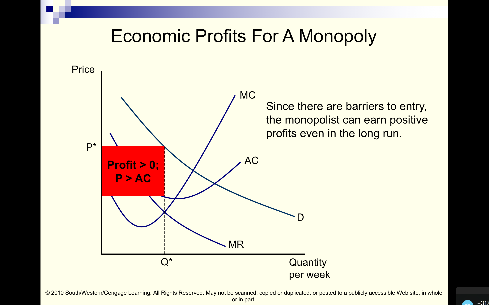

```{r somefunctions, echo=FALSE, results='hide'}

#possibly move these to a separate file

#multi-output text color
#https://dr-harper.github.io/rmarkdown-cookbook/changing-font-colour.html#multi-output-text-colour
#We can then use the code as an inline R expression format_with_col("my text", "red")

format_with_col = function(x, color){
  if(knitr::is_latex_output())
    paste("\\textcolor{",color,"}{",x,"}",sep="")
  else if(knitr::is_html_output())
    paste("<font color='",color,"'>",x,"</font>",sep="")
  else
    x
}
```

# Midterm performance and congratulations


```{r  fig.cap = '', out.width='90%', fig.asp=.4, fig.align='center',  echo = FALSE}
knitr::include_graphics("picsfigs/samuelson_2019_winners.png")

```

## Midterm success (preliminary statistics)

With adjustments and considerate marking (preliminary, needs careful doublechecking)...


**Mean**:	67.35

**Median**:	68.50

| Mark | Share | Cumulative |
| ------------- |:-------------:| :-----:|
| Firsts | 	45.7% ||
| Attila | 	26.9% |	72.6% |


# Monopolies and price discrimination (L9)


```{r  fig.cap = '', out.width='70%', fig.asp=.4, fig.align='center',  echo = FALSE}
 knitr::include_graphics("picsfigs/exetermonopoly.jpg")
```


## Coverage and key readings

Reading:

- NS text : 11.2-11.4

- additional material in handout on *price discrimination*
    - And... Essay: 'The Government may want to encourage price discrimination by income' [linked here](https://davidreinstein.wordpress.com/research-and-publications/)
    - or The Conversation article mentioned below, plus links

<br> \bigskip

----

Topics:

- causes of monopoly (brief)

- profit maximization

- What's wrong with monopoly?

- Price discrimination: first coverage; types of pd

----

Should we help companies tailor prices to your wage packet? (The Conversation, 2015)


- Article: [Should we help companies tailor prices to your wage packet?](https://theconversation.com/should-we-help-companies-tailor-prices-to-your-wage-packet-47719)

- With accompanying [worked examples](https://docs.google.com/document/d/16jos_PT9w1wGpyD5A8ZiWJ9HW6kaLOJH6EWc_AYWnkk/pub)


- ... see also Examples in links, like \href{https://docs.google.com/document/d/16jos_PT9w1wGpyD5A8ZiWJ9HW6kaLOJH6EWc_AYWnkk/pub}{HERE}

<br> \bigskip


. . .


Somewhat more formal writeup:

The Government May Want to Encourage Price-Discrimination by Income, University of Essex Discussion Paper

- linked \href{https://ideas.repec.org/p/esx/essedp/15616.html}{HERE}


## Learning goals

(Topics in more detail)

1. What are monopolies and what are barriers to entry?

2. How do monopolies choose prices and quantities?

3. What are the social (welfare) consequences of monopoly?

\

4. What is 'price discrimination'?

5. What forms can price discrimination take, and how does it increase a monopoly's profits?

6. How does price discrimination affect social welfare, and whom does it help or hurt?

7. (Very briefly: other forms of imperfect competition)

\

# The basic idea

## The basic idea

*Recall*: under perfect competition

- free entry and exit
    - $\rightarrow$ zero long-run economic profit

- many many tiny firms
    - $\rightarrow$ firms are price takers

- $\rightarrow$ p=mc
    - And in the long run $p=ATC$ and firms produce at $min(AC)$

\

*these are extreme assumptions; theoretical ideal*

\


----


(Firms with market power might set $p>mc$)

Opposite extreme: *monopoly*

- A single firm

. . .

\


- Barriers to entry $\rightarrow$ No threat of entry


. . .


\

- Can choose price, which becomes the 'market price'


. . .


Still, the more it charges the fewer units demanded. $\rightarrow$ Chooses a price (or quantity) where MR=MC (like all firms do)


. . .


$\rightarrow$ Produces 'less than socially optimal quantity' in order to charge a high price and increase its profit!

## Barriers to entry

```{r  fig.cap = '', out.width='75%', fig.asp=.4, fig.align='center',  echo = FALSE}
 knitr::include_graphics("picsfigs/midvale.png")
```

----


### Technical barriers to entry

- IRS/ Diminishing average cost over a broad range of output

    - $\rightarrow$ 'a natural monopoly'

    - (Here multiple firms producing separately are *less efficient producers*, cannot produce at the lowest cost)

. . .

<small> Debatable: Special knowledge of a low-cost method of production, or key resource </small>

----

### Legal barriers to entry.

- Patents and copyrights

- Exclusive franchise or license (granted by government, by another firm, by a university)

- Government support for a dominant firm, discouraging/forbidding others

----

From the 2016 Massachusetts ballot initiative?


```{r  fig.cap = '', out.width='50%', fig.asp=.4, fig.align='center',  echo = FALSE}
 knitr::include_graphics("picsfigs/gaming_open.png")
```

# Monopoly profit-maximisation

## Monopoly profit-maximisation

- As always, set Q to maximize $QP(Q)-C(Q)$


<br> \bigskip

. . .


$\rightarrow$ optimization where $MR(Q) = MC(Q)$ (assuming $P>AC$)


. . .

<br> \bigskip

- Remember, the 'volume' benefit of increasing Q is countered by
    - Greater cost (producing more always costs more)
    - The need to reduce price (on all units) to get people to buy it

----

### Graphically: Monopoly profit-max


```{r  fig.cap = '', out.width='60%', fig.asp=.4, fig.align='center',  echo = FALSE}
 knitr::include_graphics("picsfigs/monopprofit1.png")
```

----

```{r  fig.cap = '', out.width='60%', fig.asp=.4, fig.align='center',  echo = FALSE}
 knitr::include_graphics("picsfigs/monopprofit2.png")
```

. . .

<center> `r format_with_col("Warning:","red")` price is on the *demand* curve </center>


<aside class="notes"><small>Rem: Firm's revenue is Price*Quantity.
Rectangle for a specific point on demand curve.
Firm's *profit* is this less average cost.
MR tells you how the 'revenue rectangle' will increase (or decrease) with another unit.
MC tells you the *cost* of this additional unit.
Where MR>MC, increasing quantity a little bit increases revenue more than costs, thus increasing profit.
</small>
</aside>

----

```{r  fig.cap = '', out.width='80%', fig.asp=.4, fig.align='center',  echo = FALSE}
 knitr::include_graphics("picsfigs/monopprofit3.png")
```

<aside class="notes">Be careful here:
The price the monopoly can get at quantity $Q^*$ is $P^*$
... project up to the *demand* curve NOT the MR curve.</aside>

----

```{r  fig.cap = '', out.width='60%', fig.asp=.4, fig.align='center',  echo = FALSE}
 
```

<aside class="notes">Again, remember that revenue is $P^*Q^*$ but costs at $Q^*$ are $Q^* \times AC$
 so profit is $(P^*-AC)Q^*$.
By the way, the AC adds up the MC and the FC and divides by the quantity.</aside>

----


```{r  fig.cap = '', out.width='50%', fig.asp=.6, fig.align='center',  echo = FALSE}
 knitr::include_graphics("picsfigs/monopprofitmax.png")
```


## The deadweight loss of monopoly


*Criticisms of monopoly:*

1. Monopolies produce too little output: allocatively (top-level) inefficient.

- Less output, higher price than perfect competition $\rightarrow$ deadweight loss


. . .


\


2. Redistribution from consumers to owners?

<aside class="notes">
<small> the standard 'deadweight loss triangle'
leads to *allocative inefficiency*
(i.e., top-level inefficiency, i.e., the wrong mix of goods is being produced;
too little of the monopolized good and too much of other goods).
Redistribution of wealth from consumers to owners... could be counterbalanced by government redistribution.
</small>
</aside>

----

```{r  fig.cap = '', out.width='85%', fig.asp=.4, fig.align='center',  echo = FALSE}
 knitr::include_graphics("picsfigs/dwl1.png")
```


<aside class="notes">Note the difference in monopoly vs perfect competitive quantity
... difference in price
... difference in consumer surplus
... difference in firm profit
</aside>

----

```{r  fig.cap = '', out.width='85%', fig.asp=.4, fig.align='center',  echo = FALSE}
 knitr::include_graphics("picsfigs/dwl2.png")
```


<aside class="notes">The differences (costs, transfers) refer to the monopoly outcomes *relative to perfect competition*.
</aside>


----

```{r  fig.cap = '', out.width='90%', fig.asp=.4, fig.align='center',  echo = FALSE}
 knitr::include_graphics("picsfigs/dwl3.png")
```

----

*Other criticisms:* Some argue the DWL above *understates* the true harm of monopoly

`r format_with_col("'Secure' monopolies don't innovate as much, and spend wastefully?","gray")`

. . .


\


`r format_with_col("Monopolies expend wasteful resources (lobbying, threats, lawsuits...) to preserve barriers to entry?","gray")` $\rightarrow$ `r format_with_col("further deadweight losses", "gray")`

. . .


\

`r format_with_col("Counters: Monopolies are SR only? Disciplined by *potential* entry, & have *greater* incentives to innovate?","gray")`


. . .


\


`r format_with_col("Estimates of social cost of monopoly ... range from 0.5% to 5% of GDP","gray")`


# Price discrimination (introduction)

## Preamble


<iframe width="800" height="500" src="https://www.youtube.com/embed/tXpx21Uf7hs?start=12" frameborder="0" allow="accelerometer; autoplay; encrypted-media; gyroscope; picture-in-picture" allowfullscreen></iframe>

---

<iframe width="900" height="600" src="https://www.youtube.com/embed/3BAjYreCko8?start=42" frameborder="0" allow="accelerometer; autoplay; encrypted-media; gyroscope; picture-in-picture" allowfullscreen></iframe>

---

### Price discrimination: 15 Sept 2013, Co-op press release


<big>Ground-breaking supermarket discount for students</big>


> Co-operative Food and NUS ... announced a ground-breaking deal that will see students ... receive a 10% discount on all groceries,
> at more than 3600 participating Co-operative food stores across the UK.


----

**CJ Antal-Smith, Head of Commercial - Grocery at The Co-operative Food:**


\


'Students are facing increasing financial pressures while studying, and are becoming more savvy when it comes to food shopping.

\

We wanted to help students, many of whom are living away from home for the first time, to live and cook on a budget."


. . .


\


`r format_with_col("Why would they do this?","blue")`

----


Exeter Picturehouse:


```{r  fig.cap = '', out.width='75%', fig.asp=.4, fig.align='center',  echo = FALSE}
 knitr::include_graphics("picsfigs/exeter_picturehouse.png")
```

. . .


<br> \bigskip

\Large


`r format_with_col("Why such a complicated price list?","blue")`

----


- What is 'price discrimination'?


. . .


<br> \bigskip

- What forms can price discrimination take, and how does it increase a monopoly's profits?

. . .


<br> \bigskip

-  How does price discrimination affect social welfare, and whom does it help or hurt?


<br> \bigskip


<aside class="notes">You should care because this is both an important business practice,

increasingly relevant and interesting with online tracking/big data

it affects you as a consumer, and it's an important policy issue</aside>

## Price discrimination

Price Discrimination

:      The practice of firms offering different prices to different consumers for the same product,


. . .


<br> \bigskip

- or different prices for slightly different *products* or quantities,
    - where the price difference *doesn't* merely reflect a production cost difference,
    - aiming to distinguish consumers' *willingness to pay* (WTP).

<aside class="notes">This includes 'volume discounts', or offering an 'all you can eat' plan alongside a per-unit plan;

 it may also include time-of-day pricing and couponing.</aside>


## Why do firms price discriminate?


. . .


- To increase profit
    - by 'extracting more surplus' from consumers


. . .


<br> \bigskip

**In general...**


for a monopoly firm, the ability to identify consumers based on their WTP and charge distinct prices *will* increase profit.


. . .


<br> \bigskip


... but it may increase or decrease *social* (consumer+producer) surplus

<br> \bigskip

Consumer surplus itself may increase or decrease.


## The alternative to price discrimination (previous analysis)

'Uniform pricing': Offering a single price for a good for all consumers.

- This does not deal with differences amongst consumers.

- 'Forces you' to target a particular group (e.g., the wealthy) reducing total sales.

- Under monopoly, this leads to a deadweight loss

. . .


```{r  fig.cap = '', out.width='50%', fig.asp=.4, fig.align='center',  echo = FALSE}
 knitr::include_graphics("picsfigs/dwl3.png")
```

----


```{r  fig.cap = '', out.width='60%', fig.asp=.4, fig.align='center',  echo = FALSE}
 knitr::include_graphics("picsfigs/ppd1.png")
```

----

```{r  fig.cap = '', out.width='60%', fig.asp=.4, fig.align='center',  echo = FALSE}
 knitr::include_graphics("picsfigs/ppd2.png")
```

----

Price discrimination may seem counter-intuitive: 'how can offering some consumers lower prices increase profit?'


. . .


\

Higher prices $\rightarrow$ greater profit per unit; but also higher price $\rightarrow$ sell fewer units.

The more you charge the less you sell.


. . .


\

- Groups of 'less keen' consumers are very sensitive to price; would buy little at high price $\rightarrow$ lower price more profitable here.

- Identifiable 'keen' consumers buy a lot even at a high price. 'Less price-sensitive':  higher price more profitable here.

# The three types of price discrimination

## The three types of price discrimination

1. Individual-based (First degree; at best 'perfect')

\

. . .


2. Self-selection (Second degree)

\


. . .


3. Group-based (Third degree; 'market separation')


<aside class="notes">
<small>
1d-perfect: Target a price at each consumer... 'Perfect'= seller exactly predicts and charges each consumer her valuation.
2dpd: Here the firm doesn't know each consumer's valuations, or is not allowed to 'discriminate' by charging different prices to different people. Instead, it sells different bundles, quantities, or qualities of products to get high and low-value consumers to separate themselves E.g., first-class seats.
3dpd: Here the firm finds something identifiable and inherent about the consumer
 that is indicative of her likely valuations (and price-sensitivity).
It might be her age, nationality, student-status, or even perhaps her income.
</small>
</aside>


## First-degree and/or 'perfect' price discrimination

The firm can offer each individual a different price for each unit they purchase.


. . .


<br> \bigskip


Assuming you know what the consumer is willing to pay, you can make the *highest possible profit*; that is called 'perfect' price discrimination.


----

Perfect price discrimination
:     Charging each consumer (for each unit) the *maximum* he/she would be willing to pay, i.e., her valuation


. . .


- Here, monopolist extracts *all available surplus*; no consumer surplus remains


. . .


<br> \bigskip

- Because monopolists extract *all* the possible surplus, this is efficient
    - Because max(total value of good - cost) $\rightarrow$ max(CS+PS)


`r format_with_col("Is this easy to do?","blue")`


----

```{r  fig.cap = '', out.width='90%', fig.asp=.4, fig.align='center',  echo = FALSE}
 knitr::include_graphics("picsfigs/mindreadcustomers.jpg")
```

----


<br> \bigskip

Perfect PD is a rare/impossible extreme: requires mind reading

- Close example: Website targets individualised price to each consumer, using clues like time-of-day, web clicks, cookie data, IP location.


<br> \bigskip

`r format_with_col("Is this 'perfect' PD?","blue")`

<br> \bigskip


. . .


- No, it isn't (see note).

<aside class="notes">
<small>Web cookies etc: Here, the seller does not really know exactly what the consumer is willing to pay; he is using broad clues.
 Also, the ability to 'browse incognito' severely limits this
 See Shiller, B. R. (2013, or updated version).
 First degree price discrimination using big data.
 </small>
 </aside>

----


```{r  fig.cap = '', out.width='80%', fig.asp=.4, fig.align='center',  echo = FALSE}
 knitr::include_graphics("picsfigs/ppd3.png")
```

----


```{r  fig.cap = '', out.width='80%', fig.asp=.4, fig.align='center',  echo = FALSE}
 knitr::include_graphics("picsfigs/ppd4.png")
```

----


```{r  fig.cap = '', out.width='80%', fig.asp=.4, fig.align='center',  echo = FALSE}
 knitr::include_graphics("picsfigs/ppd5.png")
```


# Second-degree price discrimination (self-selection)
## Second-degree price discrimination (self-selection)

Firm cannot differentiate between consumers , uses quality/quantity so consumers self-select.

\

. . .

- Quality- Transport- Different classes, Supermarkets- budget products

- Quantity- Supermarkets- Larger quantities at lower prices per unit; i.e., 'nonlinear pricing'


. . .

\


- 8 oz coffee for £ 1.60 vs. 16 oz. for £ 2.00

- 20 p per oz vs. 12.5p per oz.

<small> With linear pricing there would be the same price of 15p/oz. </small>

Result: with 2 prices monopoly can get 'high value' consumers to buy/get more in total without losing 'low-value' consumers


----

- Similar with quality: Don't know who high-valuation flyers are (wtp for travel *itself* varies)

. . .


\

But may know on *average* that flyers with higher wtp for travel *also* value comfort more... thus:

- Make second-class seats very uncomfortable, first-class luxurious, and charge more for first-class seats

- Can get consumers with higher values for travel *and* comfort to pay more, without losing lower-valuing customers


<aside class="notes">I am not going to cover the algebra nor graphical analysis of second-degree PD, nonlinear pricing, or two-part pricing</aside>


##  The 'self-selection' problem

Train companies must price first and second class such that consumers will self-select.

- If first class is too expensive then the high valuing group will not choose first class


. . .

<br> \bigskip

- If second-class is too cheap, both the high and low groups will choose second class


. . .


<br> \bigskip

- But if second class is too expensive, the low groups will not buy a ticket.

----

```{r  fig.cap = '', out.width='90%', fig.asp=.4, fig.align='center',  echo = FALSE}
 knitr::include_graphics("picsfigs/thirdclasscarriage.jpg")
```


<aside class="notes">The Third-Class Carriage is a c. 1862-1864 oil on canvas painting by Honore Daumier
<small> " It is not because of the few thousand francs which have to be spent to put a roof over the third-class carriages or to upholster the third class seats that some company or other has open carriages with wooden benches.
What the company is trying to do is to prevent the passengers who pay the second class fare from traveling third class;
it hits the poor, not because it wants to hurt them, but to frighten the rich." - Jules Dupuit
</small>
</aside>

----


```{r  fig.cap = '', out.width='90%', fig.asp=.4, fig.align='center',  echo = FALSE}
 knitr::include_graphics("picsfigs/voyagetrain.jpg")
```


# Third-degree price discrimination (3dpd)/ Group based/ Market separation

## Third-degree price discrimination (3dpd)/ Group based/ Market separation

Third-degree (group-based) price discrimination
:    The practice of charging different prices to different groups that can be identified by the seller

. . .


\


The firm can differentiate *groups of consumers* or 'local markets', not individuals.

Each group has a different willingness to pay *on average*

. . .

\

$\rightarrow$ Offer lower prices to lower-valuing groups, higher prices to higher-valuing groups


 <aside class="notes">
Example: Students face lower prices for transport, food and other goods as they have a lower willingness to pay
Remember: this is *not* done out of charity but to boost profits
	</aside>


## Pricing under 3dpd/market separation

Each group or market has it's own demand $\rightarrow$ marginal revenue curve

$\rightarrow$ So set an optimising price quantity *separately* for each group

\

. . .

E.g., a discount for the elderly, higher price for the middle-aged

Or a lower price in Portugal than in Germany

```{r  fig.cap = '', out.width='50%', fig.asp=.4, fig.align='center',  echo = FALSE}
 knitr::include_graphics("picsfigs/discounts.png")
```

----

```{r  fig.cap = '', out.width='90%', fig.asp=.4, fig.align='center',  echo = FALSE}
 knitr::include_graphics("picsfigs/3dpd.png")
```

<aside class="notes">Decent numerical example, slides 6-8 Here: http://people.hss.caltech.edu/~mshum/ec105/matt9.pdf</aside>

----

Another depiction, adding demand curves ('average revenue'):


```{r  fig.cap = '', out.width='90%', fig.asp=.4, fig.align='center',  echo = FALSE}
 knitr::include_graphics("picsfigs/Price-discrimination-SNP2.png")
```


# Who benefits from 3DPD?

## Who benefits from 3DPD?

- Consumers *in identifiable group* with lower wtp face lower prices, thus they benefit


. . .


- Consumers *in identifiable group* with higher wtp face higher prices, thus they lose


. . .

<br> \bigskip


- Firms can charge higher prices to high-wtp group without losing low-wtp group $\rightarrow$ increase profit


. . .

\

Net welfare result: theoretically uncertain


----

For consumers:

```{r  fig.cap = '', out.width='90%', fig.asp=.4, fig.align='center',  echo = FALSE}
 knitr::include_graphics("picsfigs/pdwelfare.png")
```

----

```{r  fig.cap = '', out.width='85%', fig.asp=.4, fig.align='center',  echo = FALSE}
 knitr::include_graphics("picsfigs/pdwelfareoverall.png")
```


----


### Why is the benefit uncertain? {-}

Two factors (may) trade off... Exchange and Top-level efficiency ... who eats the quiche vs amount of quiche baked

\

**Exchange efficiency**

When 'low and high valuation' groups can be identified

- high-valuation groups charged more, thus consume less (vs uniform price)

- low-valuation groups get charged less $\rightarrow$ consume more

. . .

- $\rightarrow$ Who eats it?:  *Given what is produced*, PD causes it to be consumed by people who value it relatively less!


<br> \bigskip

*This is bad, it reduces "exchange efficiency" but...*


----


**Production and allocative efficiency**: On the other hand PD can lead more to be produced/consumed

<br> \bigskip


. . .


E.g., suppose that with a 'uniform price' only the wealthy went to a restaurant...

. . .

\

after PD (early-bird, OAP, benefits discounts) the low-income may also dine in the restaurant

$\rightarrow$ more value is produced

<aside class="notes">In this example it comes closer to perfect PD</aside>

----

Two effects trade off: negative 'exchange efficiency' impact, potentially positive impact on production

...of the otherwise underproduced good (rem DWL of monopoly)i

. . .

$\rightarrow$ top-level efficiency may increase (or decrease)


. . .


Bc  'exchange efficiency effect' is negative, 3DPD can *only* be beneficial if quantity increases (necessary but not sufficient condition)


# But 'arbitrage' can foil price discrimination (see readings)

## But 'arbitrage' can foil price discrimination (see readings)


`r format_with_col("If, e.g., elderly who get discounts could sell products to middle-aged, can OAP discounts work?...","blue")`

. . .


-  Middle-aged would ask them to do this, never pay high price

- Firm could no longer profit from this

<small> Similar issues with quantity discounts, or 'web cookie' personalised pricing </small>


. . .


So PD only 'works' for hard-to-trade goods like haircuts,
or where purchases are frequent & low-value, resale markets difficult

<aside class="notes">The above issues are sometimes referred to as 'transactions costs'. We don't see people trading jars of mayonaise outside Tescos.
Also note-- arbitrage makes PD *undesirable for firms*... not socially inefficient</aside>


----

## David's old 'new' policy idea:

- People with low-incomes tend to have lower-wtp for most goods

- Government can typically identify and verify incomes


. . .


- Governments could allow and encourage low-income consumers to get an ID indicating this

- Governments could allow and encourage firms to use this for price-discrimination


. . .

\


- Firms would increase profit

- Low-income households would benefit, reducing inequality

<br> \bigskip


. . .


- Net impact on efficiency uncertain; worth investigating?


# Natural monopolies and regulation (very brief or skip)

## Natural monopolies and regulation (very brief or skip)

- Where an industry involves a 'natural monopoly' (IRS) the most efficient production is a unified production process . . .
    - But if a monopoly reigns it overcharges and underprovides

. . .

<br> \bigskip

$\rightarrow$  Government may want to allow/enforce monopoly privileges but *regulate* price it can charge


- Difficulty: Government wants to regulate $p=AC$, but it doesn't know firms' actual cost function (asymmetric information)

   - Firm wants government to think it is high cost

<aside class="notes">
This yields another mechanism design 'hidden information' 'principal-agent problem
'</aside>


## TIL

Basic ideas about:

- ...what 'price discrimination' is and why firms use it

- ...what the forms of price discrimination are (1st-3rd degree; perfect, self-selection, market-separation)


. . .


- ...how firms choose prices for separated markets

. . .


- ...what limits price discrimination


. . .


- ...(when) price discrimination helps/hurts social welfare


#(We may skip): IMPERFECT COMPETITION
##(We may skip): IMPERFECT COMPETITION

## Brief notes on imperfect competition


With multiple firms in the same market but not complete 'free entry', theory predicts a range of possible outcomes.

1. collusion: 'patient' firms may collude to establish monopoly price, or any price above competitive price

\


<aside class="notes">recall the indefinitely-repeated prisoner's dillemma here</aside>


. . .

2. 'Cournot' competition, firms choose quantities: predicts intermediate price, between competitive & monopoly prices


<aside class="notes">Some cool Cournot results like markups equal the inverse elasticity of demand divided by the number of firms</aside>

<aside class="notes">the related 'Stackleberg' model lets one firm choose first -- it will have a 'first-mover advantage' but still prices are intermediate</aside>

\


. . .


3. 'Bertrand' competition in prices: predicts firms compete price down to the competitive (mc) level

\


. . .


4. Product differentiation, monopolistic competition: may lead to zero long-run profits, with $p=AC>MC>$ for each firm.


<aside class="notes">When firms can differentiate their products from one another this may reduce competition.
 each firm acts as a 'local' monopoly over it's own unique product. with free entry, however, firms introduce new products which shift the demand curves inwards for the other products (substitutes), until no firm is making long run profits.</aside>


