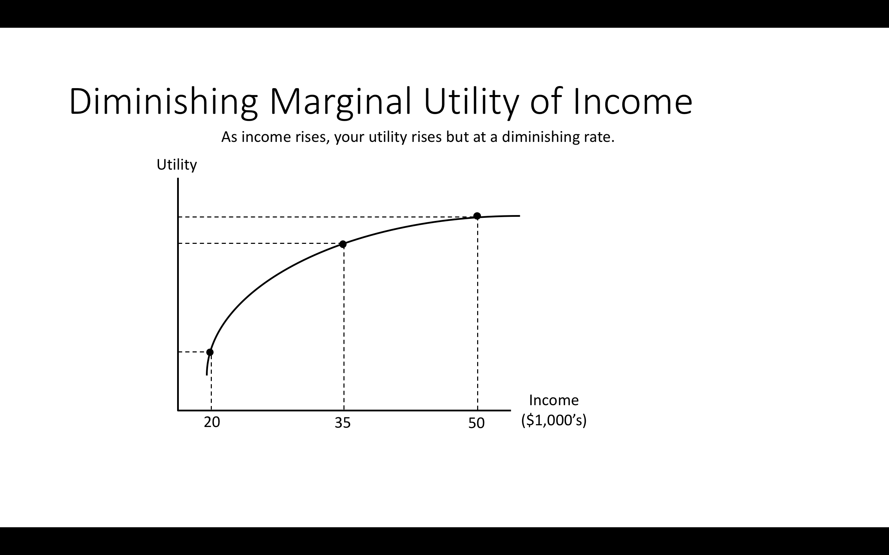
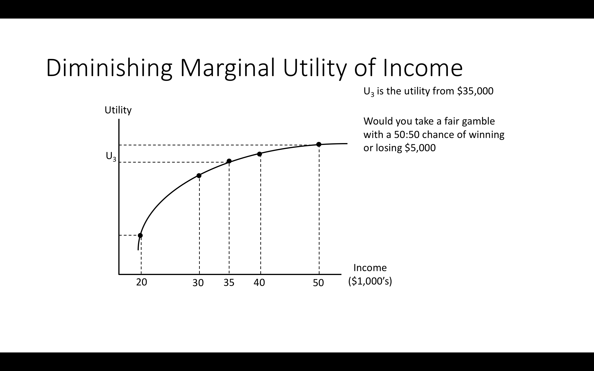
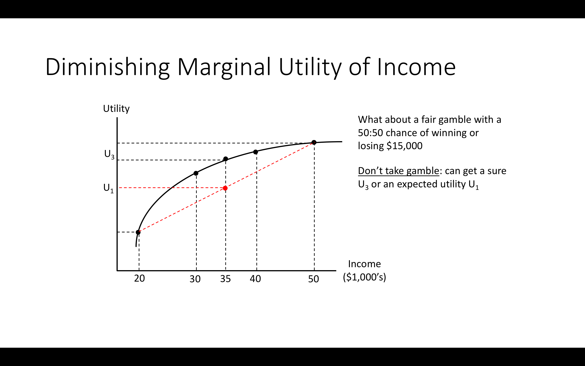

```{r somefunctions, echo=FALSE, results='hide'}

#possibly move these to a separate file

#multi-output text color
#https://dr-harper.github.io/rmarkdown-cookbook/changing-font-colour.html#multi-output-text-colour
#We can then use the code as an inline R expression format_with_col("my text", "red")

format_with_col = function(x, color){
  if(knitr::is_latex_output())
    paste("\\textcolor{",color,"}{",x,"}",sep="")
  else if(knitr::is_html_output())
    paste("<font color='",color,"'>",x,"</font>",sep="")
  else
    x
}
```

# Uncertainty (with a bit of finance) (L10)


## Intro

```{r  fig.cap = '', out.width='75%', fig.asp=.4, fig.align='center',  echo = FALSE}
 knitr::include_graphics("picsfigs/graduateplastics.jpg")
```


'So, you are studying Economics. Tell me something: ...'


----


## Coverage

- NS: Ch 4 (not including 4a)


- 4.1 Probability and expected value (revision)
- Expected utility; additional discussion

. . .


- 4.2 Risk Aversion
- Insurance

- Diversification


- Flexibility and options


- Information (read alone)
- Pricing of risk in financial assets

<aside class="notes">We will not cover the 2 state model, although you may find it helpful in understanding the concepts from another perspective</aside>

----

- Supplementary reading (optional, post-graduate level):
    - Holt, C., and S. Laury (2002), Risk Aversion and Incentive Effects, American Economic Review, v. 92 (5): 1644-1655.

<br> <br> \bigskip

- For a popular audience (may be good revision/understanding):
    - Reinstein (2016) 'Should you hedge your bets on a Brexit?' [LINK](https://davidreinstein.wordpress.com/2016/06/19/should-you-hedge-your-bets-on-a-brexit/)


----


*Key goals of these lectures (and accompanying self-study)...*

- Revise the concepts of probability and expected value

. . .

<br> <br> \bigskip

-  Learn how economists consider choices involving uncertain outcomes


-  ... how to compute an 'expected utility' and what it means

    - in particular, how it differs from 'expected monetary value'

----

*...Key goals*

-  ... how to define 'risk aversion' and how it is modeled using expected utility


. . .


-  ... why buying insurance, diversifying investments, and buying 'options' may improve welfare for risk-averse individuals

    - and the implication of this for the pricing of financial assets!


    - including a glance at the Black-Scholes model of options pricing


# What's up with uncertainty?
## What's up with uncertainty?


\

Previous discussion: Consumers make choices with *known* consequences


<aside class="notes">But in the real world many important economic decisions involve risk.</aside>

\

<br> <br> \bigskip

. . .


Here: Choices with *unknown* consequences (but known *probabilities* of each outcome)

<aside class="notes">Adv: In the real world, people may also make choices in contexts with unknown probabilities; this is called 'ambiguity' or 'Knightian uncertainty'.

This is out of the scope of this module.</aside>

- How to consider this in the utility-max framework?
    - Standard framework: maximize 'expected utility'

`r format_with_col("Warning:","red")` 'expected utility' vs 'expected monetary value'!

<aside class="notes">Making choices to maximise expected utility is *not* the same as making choices to maximise expected monetary outcomes. This is one of the main points here. A good share of students get this mixed up!</aside>

## Probability concepts: a quick review
\

Probability
:     The relative frequency with which an event occurs, or can be expected to occur.


\

- Always between 0 and 1

<aside class="notes">Adv: There are some debates, e.g., between 'Bayesians' and 'Frequentists' over the meaning of probability.</aside>
<aside class="notes">Q: If $p$ is the probability an event occurs, what is the probability this event does *not* occur?</aside>
<aside class="notes">Ans: $1-p$</aside>

----


Expected value (EV)
:     The 'average outcome' of an uncertain variable (general definition)


. . .


The average monetary (or goods) payoff from an uncertain gamble


\

. . .


The sum of the value at each possible outcome, weighted by the probability that outcome will occur


<aside class="notes">Adv, maths: When outcomes are in a continuous space, e.g., the returns to a stock can take any of an infinite number of possible values,
  the expected value becomes a definite integral rather than a sum.</aside>


. . .


\

*Not* the same as expected utility (coming up)! People need not choose the investment with the highest expected value.


----

Consider: would you prefer...

a. \pounds100,000 with certainty or
b. A 1 in 10 chance of \pounds1,000,001 (and otherwise you get nothing)?

. . .

- Which has a higher expected monetary value?

<aside class="notes">Ans: $EV(b)=100,000.1>EV(a)=100,000$</aside>


. . .

- Which gives you greater expected utility?


. . .

\

Most people would choose certain 100k, although it has a lower *expected monetary* value. `r format_with_col("Why?","blue")`


\

. . .


Because they are *risk-averse*.


----


**Definitions (loose):**

1. *Risk-neutral* people always choose the option with a highest expected monetary value

\


. . .


2. *Risk-averse* people always choose a sure thing over a gamble with same expected monetary value


. . .


- Always prefer gambles with less risk, holding the expected value constant

- Always reject 'fair gambles' (see below) and prefer certainties

\


. . .


- To accept a (fair) gamble, must expect a 'risk-premium'


----


```{r  fig.cap = '', out.width='70%', fig.asp=.4, fig.align='center',  echo = FALSE}
 knitr::include_graphics("picsfigs/weirdalscissors.jpg")
```


. . .


3. A *Risk-lover* will always choose fair gambles over certainties, and will sometimes choose a gamble that is unfair against her


----

**Example: two possible outcomes**


<aside class="notes">Q: example of such an investment with only two outcomes?</aside>
<aside class="notes">Ans: perhaps making a loan to someone to start a business; they will either pay back the loan with a high interest, or go bankrupt and pay none of it back.</aside>

A simple investment, which either pays a low (or 0 or - amount) or a high amount


. . .


It pays X where either $X =x_1$ or $X=x_2$, where $x_1< x_2$

- Specifically, pays \pounds1020 w/ prob. 1\% & pays \pounds10 w/ prob. 99\%


. . .


Probability it pays $x_2$ is $p$; thus probability it pays $x_1$ is?

. . .


$Pr(X=x_1)= 1-p$


. . .


The *expected (monetary) value* sums the values weighted by the probabilities, i.e., $EV(X)=(1-p) x_1 + p  x_2$

\medskip

Thus $EV(X) = 0.01 \times 1020 + 0.99 \times 10 = 10.20 + 9.90 = 20.10$


<aside class="notes">Consider: would you prefer this investment over one that paid \pounds20 with certainty? Would everyone prefer it? If not, why not?</aside>

----

```{r  fig.cap = '', out.width='90%', fig.asp=.4, fig.align='center',  echo = FALSE}
 knitr::include_graphics("picsfigs/powerball.png")
```

*Interesting example: computing expected value of recent US 'Powerball' lottery [Link HERE](http://uk.businessinsider.com/powerball-lottery-expected-value-jan-9-draw-2016-1?r=US&IR=T)*


<aside class="notes">This is the *net* expected value of buying a \$2 ticket. By this calculation each \$2 ticket is worth \$3.06 in expected value terms;

  however, with  the adjustments further down in the article, we see this drops considerably and becomes negative in net after taxes.</aside>


----

Fair gamble
:     A bet with an expected (monetary) value of zero is a 'fair gamble'

\


. . .


Actuarially fair
:     An investment whose cost is its expected value is 'actuarially fair'


----

```{r  fig.cap = '', out.width='80%', fig.asp=.4, fig.align='center',  echo = FALSE}
 knitr::include_graphics("picsfigs/roulette_european-vs-american-wheel.jpg")
```


*Is it actuarially fair?*

----

- Which of the following are fair gambles?

    - A. 'Double or nothing' bets with a fair coin

    - B. Roulette in a casino

    - C. A gamble where you win \pounds10 with probability 1/2 and lose \pounds5 with probability 1/2

    - D. A gamble where you win \pounds10 with probability 1/4, lose \pounds5 with probability 1/2, and neither lose nor win with the remaining probability?

    - E. A stock option (without any transactions fees)

<aside class="notes">Ans: A and D; E is uncertain, but it is probably a fair gamble</aside>


# Example: experimental measures of risk attitudes (time permitting)
## Example: experimental measures of risk attitudes (time permitting)

- Economists try to measure people's level of risk aversion in various ways
    - Revealed preference from real-world choices
    - Experimental measures, with real or hypothetical payoffs


----


One technique is the Holt and Laury (2002) risk elicitation task:

```{r  fig.cap = '', out.width='70%', fig.asp=.4, fig.align='center',  echo = FALSE}
 knitr::include_graphics("picsfigs/holtlaurie.png")
```


<small> Consider, when would you choose A and when would you choose B? </small>

<aside class="notes">Asked to choose one in each row (A or B)</aside>

----

```{r  fig.cap = '', out.width='90%', fig.asp=.4, fig.align='center',  echo = FALSE}
 knitr::include_graphics("picsfigs/holtlauriedetail.png")
```

- At what point do people switch from choosing the safe to choosing the risky lottery?


. . .


- This is a measure of their risk-aversion
    - A risk-neutral person would switch to B on the fifth choice
    - The later you switch, the more risk averse

----

```{r  fig.cap = '', out.width='50%', fig.asp=.4, fig.align='center',  echo = FALSE}
 knitr::include_graphics("picsfigs/holtlauryresults.png")
```

<center> Results for different 'stake sizes' </center>

- Most people are risk-averse
- People switch to the risky option later when stakes are higher


# Expected utility
## Expected utility

**Note: this concept is only covered *indirectly*  in the NS text**

Previous utility functions: predict choices under certainty

- No predictions for choices with uncertain probabilistic outcomes!

. . .

\

- People don't maximise expected monetary value; tend to be risk-averse

----

An *Expected Utility* (EU) framework allows for risk-aversion!

\

. . .


Assume each individual has a single function $u(Y)$ expressing their preferences over outcomes} Y `r format_with_col("called 'Von-Neumann Morgenstern' utility (VNM)","gray")`

\

Similar to 'regular' utility, but here 'curvature matters'


----

When making choices involving uncertainty, she does **not** (necessarily) maximise expected monetary value.
\

Instead, she maximises 'Expected Utility' (EU): the sum of her (VNM) valuations '$u(\cdot)$' under each outcome weighted by the *probability* of each outcome


\


. . .


Risk-loving, -neutral, & -averse individuals all max EU.  By varying the $u(\cdot)$ function we vary the implied risk preference.

----

Consider the choice between two gambles and one 'certainty':

1. Earn \pounds1,000,000 with probability 0.1 & zero with prob. 0.9

2. Earn \pounds100,000 with probability 1/2 & \pounds50,000 with prob. 1/2

3. Earn \pounds75,000 for certain


----

Imagine $u(y)$ arises from the *consumption chosen with* income $y$ `r format_with_col("(i.e., 'Indirect Utility')","gray")`

- Should be increasing `r format_with_col("(bc of nonsatiation)","gray")`, thus $u^\prime (y)>0$

. . .


- But may increase at a *decreasing* rate $\rightarrow$  $u^{\prime \prime}(y)<0$

. . .

This second assumption, called *diminishing marginal utility*, implies risk aversion!

\

. . .


Or, if you are risk-neutral, it must be linear $\rightarrow$  $u(y) = a + by$, thus $u^{\prime \prime}(y)=0$

<aside class="notes">Adv: Note that when we were choosing between two goods under certainty, her *level* of total utility didn't really matter, only the relative utilities.

Now that we are considering gambles, the overall utility level matters, because we need to consider the tradeoff between 'rich and poor' states.</aside>

----

Back to the choice between two gambles and one 'certainty':

1. $Y_1$: \pounds1,000,000 with probability 0.1 and zero with prob. 0.9
2. $Y_2$: \pounds100,000 with probability 0.5 and \pounds50,000 with prob. 0.5
3. $Y_3$: \pounds75,000 for certain

. . .


\


Considering each *outcome* from any of these,

we know $u(1,000,000) > u(100,000) > u(75,000)> u(50,000) > u(0)$


. . .


 ... but now the *size of the difference* in $u(y)$ matters for your decision!

<aside class="notes">Y1 vs Y3: Is 1 million 'more than ten times as good (utility-wise) as 75k?'

Y2 v Y3: Relative to 75k, does an additional 25k yield a utility gain worth the (equiprobable) loss of 25k?</aside>


----

*Example*: Suppose there is open-enrollment in Oxford, Bristol, Plymouth.


. . .


- I only need to know the *ranking* of utilities of each to know your choices.

- If you choose Oxford over Bristol, even though Oxford costs more, I can infer that for you $U(Oxford)>U(Bristol)$

----

Now suppose the policy is (you are only admitted to a single uni)

> A. Rank Oxford over Bristol and you have a 25\% chance of getting into either, and (the remaining) 50\% chance of Plymouth.

> B. Rank Bristol highest and you have a 100\% chance of getting into Bristol.


. . .


Now even if you rank Oxford $\succ$ Bristol $\succ$ Plymouth, I don't know if you will choose A or B; I would need to know the *strength* of your preferences.


. . .


If I observe you choose A I learn *more* about your utility. Your preference for Oxford over Bristol is  "stronger" than your preference for Bristol over Plymouth


----

EU framework predicts she chooses the option that maximizes the sum of probabilities $\times$ utilities of each outcome. For a two-outcome case:


. . .

$$EU = (1-p) u(Y_\ell) + p u(Y_h)$$

... where $p$ is the probability of the higher income $Y_h$ and $Y_\ell$ is the lower income


<aside class="notes">This is justified by certain 'reasonable axioms' we might expect choices under uncertainty to follow

although these are perhaps not as readily acceptable as the main axioms of regular utility theory (like transitivity)

... e.g., it converges to the choices made under certainty as probabilities tend to 1.

 It yields nice consistent behavior and can be reconciled with general equilibrium theory, preserving the basic welfare theorems</aside>


----


G1: \pounds 1,000,000 with probability 0.1 and 0 with prob. 0.9

G2: \pounds 100,000 with probability 0.5 & \pounds 50,000 with prob. 0.5

G3: \pounds 75,000 for certain

\

. . .


$EU(G_1)=0.1 \times u(1,000,000) + 0.9 \times u(0)$

. . .

$EU(G_2)= 0.5 \times u(100,000) + 0.5 \times u(50,000)$

. . .

$EU(G_3)= u(75,000)$


. . .


`r format_with_col("What","blue")` would a risk neutral or a risk averse person choose?


. . .


Risk neutral $\rightarrow$ chooses G1 `r format_with_col("(why?)","blue")`

<aside class="notes">Ans1: It has the highest expected monetary value, \pounds100,000</aside>

\

Risk averse $\rightarrow  G3 \succ G2$ `r format_with_col("(why?)","blue")`

<aside class="notes">Ans2: Same expected monetary value, /pounds75,000, but less risk (no risk)</aside>

. . .


Risk averse $\rightarrow$  *maybe* $G2 \succ G1$, but depends *how* risk averse she is

# Risk aversion: graphical depiction
## Risk aversion: graphical depiction

She values gamble X less than 'gaining its EV for certain':


. . .


*Draw diminishing MU VnM utility function*


\

. . .

Expected **monetary** value of gamble $X$ is $E(X)=(1-px_{l} + px_{h})$. However...

. . .


$$EU(X)=(1-p)u(x_{l} + pu(x_{h})< u(E(X))= u((1-p)x_{l}+px_{h})$$


. . .


<small>

Depict $E(X)$ on x-axis, project up to $u(E(X))$

Diagonal line btwn $u(x_{low})$ & $u(x_{high})$; EU in-btwn these.

Horizontal distance $p$ of the way btwn $x_{low}$ & $x_{high}$ $\rightarrow$ $E(X)$

Project up to diagonal for average of functions (EU).

</small>

<aside class="notes">This is a mathematical/graphical property; a special case of Jensen's inequality.
Intuition: slope of line tells me 'rise for a given run',
The EV calc is a linear function, so the slope is constant
and the 'share of the rise' simply projects up from the 'share of the run'</aside>


----

```{r  fig.cap = '', out.height='85%', fig.asp=.4, fig.align='center',  echo = FALSE}
 
```

<aside class="notes">You start with \$35k</aside>

----


```{r  fig.cap = '', out.height='85%', fig.asp=.4, fig.align='center',  echo = FALSE}
 
```

----


```{r  fig.cap = '', out.height='85%', fig.asp=.4, fig.align='center',  echo = FALSE}
 knitr::include_graphics("picsfigs/riskaversion3.png")
```

----


```{r  fig.cap = '', out.height='85%', fig.asp=.4, fig.align='center',  echo = FALSE}
 
```

----


```{r  fig.cap = '', out.height='85%', fig.asp=.4, fig.align='center',  echo = FALSE}
 knitr::include_graphics("picsfigs/riskaversion5a.png")
```

----


## Ways of reducing risk: Insurance

```{r  fig.cap = '', out.width='75%', fig.asp=.4, fig.align='center',  echo = FALSE}
 knitr::include_graphics("picsfigs/insurancereducesrisk.png")
```

Fair insurance
:     ... premium equals expected (money) value of loss

<aside class="notes">Adv: We might think that such insurance is provided at its true marginal cost;

 however there are various reasons why the cost to firms may be above this, including transactions cost, moral hazard, and adverse selection</aside>

----

Read and know (basic understanding):


- Uninsurable (difficult to insure) risks

- Adverse selection

- Moral hazard

- The rationale for insurance 'deductibles'


## Ways of reducing risk: Diversification

- Diversification: Buying multiple assets

    - With risks that are not perfectly correlated with one another


. . .


<br> <br> \bigskip


Putting your eggs in multiple baskets: tends to reduce risk, for a given expected value of profit (or loss)

----

### Illustration: Binomial distribution


Suppose I've \pounds 1000, and can bet on fair coin flips $\rightarrow$ My returns have a 'binomial distribution'.


. . .


A. Bet all \pounds 1000 on single flip $\rightarrow$ 50\% chance I lose (or double) entire investment.


. . .


B. Bet \pounds 500 on 2 flips $\rightarrow$ 25% chance I'll lose (or double) investment.  `r format_with_col("Better?","blue")`


. . .


$EV(A)=EV(B)=1000$ but B is "less risky" $\rightarrow$ $B \succ A$ if you're risk averse


<aside class="notes">Less risky: B and A overlap with 0.5 probability; remaining 50\% of time A's outcomes are more extreme</aside>


. . .


C. \pounds100 each in 10 flips,  there's a 38\% chance that I'll lose 20\% or more of my investment.

D. \pounds1 each on on 1000 flips $\rightarrow$ 6\% chance I lose 5% of my investment or more; 1/10th of 1\% chance I'll lose 10\%+.


. . .

*Result*: More 'diversification' $\rightarrow$  less risk, for same EV.

----


*Result*: The more I can do this 'diversification', the less risk I face.


*Note*: For simplicity, above examples have a 'fair coin flip', zero expected-return investment.


<br> <br> \bigskip


. . .


But: 'why invest at all? Because this principle also applies to 'unfair coin flips'.


. . .


E.g., investments in the stock market are more profitable on average than money under the mattress.

<aside class="notes">Each \pounds1 invested in shares has a higher expected return, but also a higher risk.

 However by spreading across *many different* assets we can reduce this risk, as seen above</aside>


----

### Example

You've \pounds35k, must invest \pounds15k in an Oil or Transportation firm. A share in either costs \pounds1 (alt: costs \pounds0.9).

<aside class="notes">Alt: suppose it costs \pounds0.9, so on average it is profitable</aside>


. . .


By EOY, 50\% chance price $\uparrow$ to \pounds2, 50\% chance $\downarrow$ to \pounds0.


1. Put it all in one firm $\rightarrow$ 50\% chance you'll end up with \pounds20k, 50% chance of \pounds50k. EV = \pounds35k.


. . .


2.  If you put half in each you've a 25\% chance of each of ...:


```{r  fig.cap = '', out.width='70%', fig.asp=.4, fig.align='center',  echo = FALSE}
 knitr::include_graphics("picsfigs/oiltransitperformance.png")
```

Same expected value, but it's 'better'

<aside class="notes">Draw histograms on the board</aside>

----

*Why better* (for a risk-averse person)?

\medskip

*Less risk, same EV*: 50\% of the time (when oil & transit move opposite) you've less gain/loss than if undiversified.


. . .


I.e., comparing distribution of returns vs. undiversified investment:

- 25\% of time, gain 0 vs. \pounds15K (leaving you \pounds35k vs. \pounds50k)

- 25\% of time, gain 0 vs. lose \pounds15K (leaves \pounds35k vs. \pounds20k)


. . .


- Remaining 50\% of time (both rise/both fall) ... same as remaining 50\% of the time under undiversified investment


\


. . .


*See the benefit graphically (next slide)*

----


```{r  fig.cap = '', out.width='90%', fig.asp=.4, fig.align='center',  echo = FALSE}
 knitr::include_graphics("picsfigs/diverselessrisk.png")
```

`r format_with_col("Takes some time to interpret; see text","brown")`

<aside class="notes">This depicts the average of 2 EUs (when B does poorly, when B does well)

each of which average the utility over 2 outcomes (A does poorly, A does well).

The average of the average of these exceeds the average of the utility of 2 extreme outcomes.</aside>


## Flexibility and options contracts


`r format_with_col("2018: Read at home; less coverage in assesment than in prior years","green")`


`r format_with_col("Keep your options open' (simple idea)","gray")`

`r format_with_col("'Real option': an option outside the financial world","gray")`

. . .

Option contract

:     Financial contract offering the right (but not the obligation) to buy or sell an asset over a specified period (at a certain price).


. . .

Attributes of options:

1. Specification of transaction}: what is bought/sold, how many units maximum, at what price, etc
2. Period} the option may be exercised (from when until when)
3. Price} of the option

----

### Price of options determined by

1. EV of underlying transaction

. . .


2. Variability of the value of the transaction


. . .


Ex: Option G ('call option'): Right to buy Google share at \pounds500 (\pounds500 'strike price') between Jan. 2018 and Dec. 2020


. . .


- Worth more the higher the current share price

- If $P_{google}< £ 500$ currently, then option G is worth more the higher the expected *variability* in $P_{google}$. `r format_with_col("Why?","blue")`


. . .


Bc variability can only help option-holder: price $\uparrow$ $\rightarrow$ profit, but if price falls below \pounds500, she doesn't need to exercise option

----

Price of options determined by 1. EV of underlying transaction, 2. Variability of this value, and...


3. Duration: the longer the better. `r format_with_col("(Why?)","blue")`


. . .


- Greater chance the price will rise above strike price (\pounds500)


<aside class="notes">Results for 'right to sell = call options' are similar, just replace the words 'buy' with 'sell' and reverse the directions ('rise' with 'fall), etc.</aside>

----

Options can be used for *hedging risk* ... that was their original purpose. `r format_with_col("How","blue")`?

<aside class="notes">Q1 How might an airline buy options to counter its risk from rising petrol prices?

Q2. How could an airline pilot buy options to counter her risk of being fired in case her airline goes out of business?

But always priced at least as high as intrinsic value, because you *can* cash it in now.</aside>

<aside class="notes">Ans: 1. The airline could buy call options (rights to buy at a price) for oil and gas company shares, or for oil and gas commodity units.

2. The pilot could buy put options (rights to sell at a price) in the airline she works for; if the airline shares become worthless these put options will be very valuable.

Classic economist's argument: you should 'bet against yourself' to minimise risk; but this might give you bad incentives to perform.

See column about this [HERE](http://www.marketplace.org/2008/08/11/business/hedging-your-bets-hard-times "Hedging your bets in hard times")
</aside>

<aside class="notes">This sort of thing could be asked as an exam question, perhaps multiple choice</aside>


----

### Black-Scholes (and Merton) model of options value


```{r  fig.cap = '', out.width='75%', fig.asp=.4, fig.align='center',  echo = FALSE}
 knitr::include_graphics("picsfigs/optionsvalue_blackscholes.png")
```

<aside class="notes">Above is for option that can be executed from now indefinitely into the future.

Not of infinite value because future payoffs are discounted at risk-free rate.

Blue is value that can be 'cashed in', red is Black-Scholes calculation.

Red always above the blue because 'asset's price may increase'.

At very low asset price it is unlikely the price will rise above \$100 in forseeable future, so not valuable.

At prices higher and higher above strike price of \$100 the red and blue come closer together, because it's unlikely

the asset price goes below \$100 any time soon, so option is almost the same as an actual share.

But always priced at least as high as intrinsic value, because you *can* cash it in now.</aside>


- \footnotesize{Insightful; once developed, traders *used it* to price options}
- \footnotesize{Problem: It's just a model, makes fairly strong assumptions (normal distribution of returns, etc.)}

<aside class="notes">Unlike, e.g., value of continuously compounded interest, we still don't *know* true value of options</aside>


----


## Value and cost of information

*This section is fairly straightforward: please read it on your own (and post any questions you may have)*


# Pricing of risk (and assets) in financial markets
## Pricing of risk (and assets) in financial markets

```{r  fig.cap = '', out.width='55%', fig.asp=.4, fig.align='center',  echo = FALSE}
 knitr::include_graphics("picsfigs/marketriskline.png")
```


Market line
:     ... relationship between risk & return an investor can achieve by mixing assets

<!--
Typo: "risk assets" should be "risky"
-->


<aside class="notes">
With efficient markets, this line depicts the 'best mix':
proportional to the total 'market basket', plus borrowing/lending at the 'risk-free rate'
</aside>

----

```{r  fig.cap = '', out.width='80%', fig.asp=.4, fig.align='center',  echo = FALSE}
 knitr::include_graphics("picsfigs/investorchoices.png")
```

<small>
Different preferences for risk versus expected} (average) return. 'Risk' is the overall variance around the average. Assumes 'optimal diversification': no one chooses points *below* market line.
</small>

----

**Extension: 'Capital asset pricing model' (CAPM)**

CAPM: Leading 'baseline' model in finance,  assumes investors optimally diversify


. . .


Thus assets are priced based only on 'risk that cannot be diversified away from' ('market risk')


. . .


- Holding EV of dividends constant, assets with higher *market risk* are less desirable, thus priced lower, and get higher returns

- The trade-off between this risk and return has a linear relationship with slope 'Beta'


----


Typical economist's investment advice: diversify to mimic the 'market basket', choose funds with low fees

<aside class="notes">This Doesn't make you a hit at parties</aside>

```{r  fig.cap = '', out.width='50%', fig.asp=.4, fig.align='center',  echo = FALSE}
 knitr::include_graphics("picsfigs/graduateplastics.jpg")
```

----

## Not covered: two state model

- You may find it helpful in understanding
    - But you may be confused by it, so read it at your own peril!

## Suggested practice problems: see problem set

<!---
from Nicholson and Snyder Chapter 4 (12th ed)
"Problems"
- 4.1, 4.3, 4.5, 4.6, 4.7 (challenging)
Also see problem on next slide
- ... Please let us know your preferences over what is covered
-->

----

Suppose there is a 50-50 chance that a risk averse individual with a current wealth of \pounds20,000 will contract a debilitating disease and suffer a loss of \pounds10,000.

a) Calculate the cost of actuarially fair insurance in this situation and use a utility-of-income graph to show that the individual will prefer fair insurance against this loss to accepting the gamble uninsured.

...

b) Suppose two types of insurance policies were available: 1. A fair policy covering the complete loss and 2. A fair policy covering only half of any loss incurred.

\

Calculate the cost of the second type of policy and show that the individual will generally regard it as inferior to the first.
\

<!---
c) Suppose individuals who purchase cost-sharing policies of the second type take better care of their health, thereby reducing the loss suffered when ill to only \pounds7,000. In this situation, what will be the cost of a cost-sharing policy? Show that some individuals may now prefer this type of policy. (This is an example of the moral hazard problem in insurance theory.)
-->


