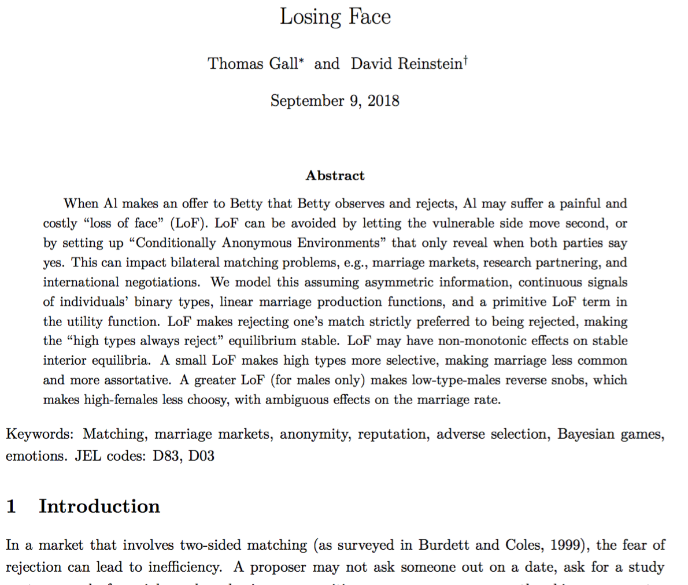
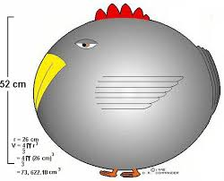
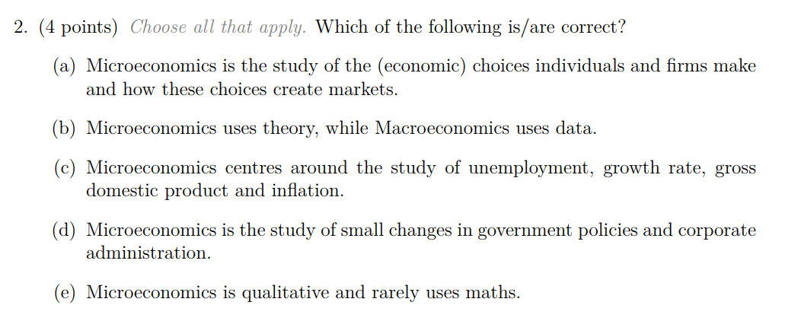

```{r somefunctions, echo=FALSE, results='hide'}

#possibly move these to a separate file

#multi-output text color
#https://dr-harper.github.io/rmarkdown-cookbook/changing-font-colour.html#multi-output-text-colour
#We can then use the code as an inline R expression format_with_col("my text", "red")

format_with_col = function(x, color){
  if(knitr::is_latex_output())
    paste("\\textcolor{",color,"}{",x,"}",sep="")
  else if(knitr::is_html_output())
    paste("<font color='",color,"'>",x,"</font>",sep="")
  else
    x
}


#do the same for centering etc

```


<!---
Note: I'm re-tooling slides from previous year
1. Separating BEE2038, now BEE2038 and BEEM101
2. Cutting much stuff that is in the web book (formerly 'handout')... just focusing on 'core presentation'
3. Re-tooling to fit the new web book format
4. Make it reveal.js as possible; web host?
5. Possibly split into several files
-->

# BEE2038: Intermediate Micro; introduction and 'models'

<!---
\newbool{extrastuff}
\ifbool{extrastuff}{extra stuff}{minimal stuff}
-->


<!---
bash "$HOME/Google Drive/exeter_teaching/BEE2038/ compileslidesnotes_fuller.sh"
-->

<!---
See also:
general_notes_text_handout.md
tutorials_all.md
BEE2038_lecturesupplements_quizes [Autosaved].pptx
compileslidesnotes.sh
examwork/BEE2038_mockexam.tex
-->


<!--
See discussion/work in Google Doc: <https://docs.google.com/document/d/10IrcCbnr7z_OdXVSptXfFNMx5uYoV7wzZEdkhKm4UW4/edit#heading=h.vo6qktxc1rvp>
-->

**Planned syllabus, coverage: see [web book](https://vle.exeter.ac.uk/pluginfile.php/1435123/mod_resource/content/1/_book/note.html) 'handout'**


# Lecture 1 "intro" coverage (1 hour)

<aside class="notes">Largely based on Nicholson/Snyder Chapter 1: Economic Models</aside>

*Key goals of this lecture (and accompanying self-study)...*


0. Get excited

<!-- . . . -->

1. What's this module's purpose and *story arc*? How to get the most out of it.


<!-- . . . -->


2. What's Microeconomics? Why is it useful? Why use 'models'? Some *applications* of models


<!-- . . . -->


3.  `r format_with_col("Recap microeconomics examples, get econ brain flowing","gray")`


<!---
`r format_with_col("Some material from PowerPoint Slide Presentation:  Philip Heap, James Madison University ","gray")`
-->

#  About Me

```{r  fig.cap = '', out.width='25%', fig.asp=.4, fig.align='center',  echo = FALSE}
 
```


<center> Dr. David Reinstein, davidreinstein.wordpress.com

</center>

<small>
**Office hours:** Tuesday and Thursday 11am-noon during Spring term (just come by); Streatham Court 1.39 unless otherwise mentioned.
or by appointment calendly.com/daaronr/20min/.
 </small>


- My research interests

- My teaching and projects


<!-- *My research interests:* Applied microeconomics and behavioral economics, impact on policy and business innovation

- Charitable giving, other-regarding behaviour

- Price discrimination by income

- Impact of HE institution on income and life outcomes

- Communicating with policymakers, managers, entrepreneurs; *Impact*

<!-- \pause -->


<aside class="notes">Will incorporate research/impact in the module; ways you can get involved;

You should do an UG dissertation if you are thinking about going on to postgraduate work</aside>

#  This module: BEE2038: Intermediate Microeconomics (Applied)


```{r  fig.cap = '', out.width='30%',   fig.align='center',  echo = FALSE}
 knitr::include_graphics("carrots.jpeg")
```

 <font face = "Lucida Calligraphy" size = "5" color = "#DDA0DD"> A farm-to-table artisinal more-ish curation of ... Microeconomics: essentials, tools, and applications to business, policy, and life.</font>

<!-- \pause -->

- For 'not straight Econ students': a broad church; I'm sympathetic

- Maths?

> - Yep, some

----

Lectures: 2x per week, interactive, won't cover *everything*. Self-study required (see web-book etc.)

<br>

Readings and coverage: see Web-book (aka handout). The HANDOUT is king.

----


```{r  fig.cap = '', out.width='90%',  fig.align='center',  echo = FALSE}
 knitr::include_graphics("kinghandout.jpg")
```


----

- Roughly 8 problem sets-- about 1/week on each chunk of material; (unassessed); `r format_with_col("questions come from exams or build exam skills","blue")`

- Support classes/tutorials about each fortnight, covering key material from recent problem sets

- Extensive additional material (formative assesments, mock exams, tutorial videos, forums etc) to help you prepare for asessment, and for your interest

<aside class="notes">these are for your own benefit and not to be turned in.  I will try to make this material both interesting and highly relevant for assessment. The material will come from exams or will focus on building exam skills.</aside>

# Marks
- 'Midterm' examination (Asking for week 6/7), multiple choice; 30 marks

- Final examination, 120 minutes, MCQ, solved problems, short essays: 70 marks

<aside class="notes">MCQs are not necessary easy and may require maths and subtlety.
 Final exam 'essays' test your deep understanding and ability to explain concepts</aside>

<br>


$\leftarrow$

---

```{r  fig.cap = '', out.height='80%', fig.asp=.4, fig.align='center',  echo = FALSE}
 knitr::include_graphics("toughmcq.png")

```

\

 <small> $\leftarrow$ Five competencies...</small>

## Five essential competencies of an Economist (Algood and Bayer, 2017)

`r format_with_col("1. Apply the scientific process to economic phenomena","gray")`

2. **Analyse and evaluate behaviors and outcomes using economic concepts and models**

`r format_with_col("3. Use quantitative approaches in Economics","gray")`

`r format_with_col("4. Think critically about economic methods and their applications","gray")`

5. **Communicate economic ideas in diverse collaborations**

<aside class="notes">Algood and Bayer, 2017 AER-PP, "Learning outcomes for economists"</aside>

## Skills demanded by employers

```{r  fig.cap = '', out.width='90%', fig.asp=.4, fig.align='center',  echo = FALSE}
 knitr::include_graphics("skillschart.png")
```

<aside class="notes">Also highly relevant to employers!</aside>

<!---
```{r  fig.cap = '', out.width='90%', fig.asp=.4, fig.align='center',  echo = FALSE}
 knitr::include_graphics("skillsbar.png")
```
-->


# Text(s)

**Recommended:** "Intermediate Microeconomics and Its Application" <small> (11-12th ed. preferred; recent OK); £50 Waterstones, also at the library; **get access** </small>

\

`r format_with_col("Note:","red")` *Handout* explains the coverage; *not always sequential!*  And some material is in the handout *only* (clearly stated).


<!--
    - Available at the University bookstore for around \pounds50, with access to online materials (some free, some cost a bit more)

    - Other recent editions OK, but watch for numbering changes
    - Other online resources (see handout)
-->

\

Lots of other free online texts, resources, esp.:

- [Microeconomics - markets, methods and models by Curtis and Irvine](https://open.umn.edu/opentextbooks/textbooks/microeconomics-markets-methods-and-models)

- [Principles of Economics - unnamed authors](https://open.umn.edu/opentextbooks/textbooks/principles-of-economics)


<aside class="notes">Any intermediate micro text covers most of the same stuff. Handout uses and refers to all of these. I'm trying to save you money and give you stuff you can access and interact with on your laptop, tablet etc.; in future I'll rely on open-access only and build a self-contained web text.</aside>


#  The story of this module

```{r  fig.cap = '', out.width='90%', fig.asp=.4, fig.align='center',  echo = FALSE}
 knitr::include_graphics("neverendingstory.gif")
```

<aside class="notes">You will have seen many of these concepts before.

But do you really understand them well enough to *explain* them to a non-economicst

and to *apply* them to a new real-world situation?

And do you understand the *limits and critiques* of these,

 and how economists try to *measure and test* them?</aside>

----

**1. Economic basics (weeks 1-2)**

- Economic models, maths tools, introduction (NS ch. 1)

- Utility, preferences, indifference curves, budget constraints (NS 2)

----


> we build it up and then burn it down...

**2. Build the model, put it together, examine it (weeks 3-5)**

The Demand side:

<small> Demand curves: Individual and market demand (NS ch. 3) </small>

<br> \bigskip

<!-- \pause -->

The supply side:

<small> (Abbreviated: Production, costs, returns to scale, choice of inputs) </small>

<!-- \pause -->

<small> Profit maximisation and supply, perfect competition in a single market </small>


<small> Supply curves, entry/exit, Consumer and Producer Surplus, general equilibrium and welfare (brief) </small>

----

**3. How the market can go wrong (and how to maybe fix it) (weeks 6-7)**

- Market failures -- Public goods

- Monopolies; price discrimination as an imperfect remedy


----


**4. Extensions to the model and applications (weeks 8-11)**

- Uncertainty (basic concepts, EU, risk aversion, investment choices)

- Game theory; experimental evidence

- 'Behavioural': Limits to cognition, willpower, self-interest; applications and evidence


# The big (small) question

\


> What's gonna be on the exam??

<!-- \pause -->

<br> \bigskip

> - Everything


<br> \bigskip
<!-- \pause -->

<aside class="notes">You are responsible for *all* material on syllabus + assigned readings + materials covered in lecture and tutorials</aside>

<aside class="notes">E.g., exam may cover material only briefly mentioned in lecture, and will expect knowledge from prerequisites</aside>

> - I reward broad understanding; `r format_with_col("'can YOU explain it?'","blue")`

----

Examples of exam material:

- Practice problems in lectures and at the end

- Problem sets, mock and sample question on the VLE

- Previous exams (esp since 2015-16)

  - With suggested answers, explanations, and 'common mistakes'


<aside class="notes"> Guided Independent Study per half: 143 hours to be divided between background reading (e.g. 40 hrs), solving/reviewing problem sets (e.g. 40 hrs) and exam revision (e.g. 43 hrs) </aside>

#  Real big question: why are you here?

```{r  fig.cap = '', out.width='90%', fig.asp=.4, fig.align='center',  echo = FALSE}
 knitr::include_graphics("universe.gif")
```


$\leftarrow$

## Haha

**Why are you here (in this lecture theatre)?**

To learn.


<!-- \pause -->

- Because you think it's interesting

    - to ponder big questions about individuals, markets, society

    - to understand how people have tried to bring order to difficult questions

    - because you want to contribute something to the world


<!-- \pause -->

----

- Because this stuff is actually useful in the real world

    - For your professional and/or academic career

    - For your life


<!---
Some people and organisations seem to value this information:
[2017 Government Economic Fast Stream Scheme](https://www.gov.uk/government/publications/2017-government-economic-fast-stream-scheme)
-->


<aside class="notes">Don't waste this experience fretting about marks</aside>


<!---
```{r  fig.cap = '', out.width='50%', fig.asp=.4, fig.align='center',  echo = FALSE}
 knitr::include_graphics("cargo-cults-336x175.png")
```
https://www.youtube.com/watch?v=yvfAtIJbatg
-->


## But anything I say you can find online, or in a book, so why are you here?

<!-- \pause -->

To interact

<br> \bigskip

`r format_with_col("Not to hear what the *lecturer* has to say, but for the lecturer to respond to what *you*","brown")` say.

<aside class="notes">Because you can interact with me, ask me questions, come up with ideas, work with other students

 Impress me and get a good letter of reference.

 I advise everyone to come to my OH at least once</aside>


#  Resources

**The VLE and other resources**

- VLE [let's see it](https://vle.exeter.ac.uk/course/view.php?id=7890#section-1)

- Ask questions and make comments on the forum [LINK](http://vle.exeter.ac.uk/mod/forum/view.php?id=487174 "forum"), I will monitor it


<aside class="notes">Or, for anonymity, just complain on social media and I'll probably see it.</aside>


- Practice questions and formative assessments

## The 'HANDOUT' file/web-book

<small> For now, available to you exclusively on the [VLE](https://vle.exeter.ac.uk/pluginfile.php/1435123/mod_resource/content/1/_book/note.html) </small>

<aside class="notes">In future: fully public, open source etc</aside>

<br> \bigskip


<aside class="notes">I'll add more material to this as we progress (and demarcate where we are up to); you can read ahead but I improve it  1 week in advance...</aside>

<!-- \pause -->


<!-- Handouts on VLE link: Big pdf with table of contents, or pdfs week-by-week) of individual 'chunks'
-->

Contains all the lecture slide material *and more*, html links, etc.

- As we progress...
    -  Read the introduction: Key information to understand how it works (abbreviations etc)
    -  Leave comments/question *directly* on file via hypothes.is; it will be a conversation!


<!-- . . . -->
\


<center>  `r format_with_col("The future is here!","magenta")` </center>

<center> `r format_with_col("(Made with r-markdown and bookdown)","Turquoise")` </center>

<aside class="notes">Occasionally I'll show you some r-code to produce diagrams, computations etc.

Contact me if you wanna geek-out. </aside>


## Possible in-lecture interaction


- Responseware, questions, polls and 'chat'; 'Kahoot'

- In-lecture experiments and games

- Ask me questions, especially at beginning and end

  - Raise a white handkerchief if you are lost

<!-- \pause -->

- Draw-along and solve-along

# Fortune Cookie Wisdom

\

$\leftarrow$

----

## Heavies

> Economists do not know everything (but we have thought through many arguments)}

<aside class="notes">It may *seem* like we have the answers, but this is only where we have asked the questions very carefully </aside>

----

> Most non-economists do not fully understand these arguments, and they make mistakes, and they worry.

> -  But sometimes ignorance is bliss.

<aside class="notes">Sunk cost fallacy, gains to trade/comparative advantage, opportunity cost,

free-riding/prisoners' dilemma, double-marginalization, 'raise price to raise profit', etc.</aside>

<!-- \pause -->

> - `r format_with_col("... more deep truths to follow, enough for now","gray")`


# A BIG THEME

Markets work well but not perfectly.

<small> Imperfections in existing markets $\rightarrow$ opportunities. </small>


```{r  fig.cap = '', out.width='25%', fig.asp=.4, fig.align='center',  echo = FALSE}
 knitr::include_graphics("hamdogger.PNG")
```

---


<center> *Imperfection:* Inefficient markups for information goods with per-unit pricing </center>

```{r  fig.cap = '', out.width='55%', fig.asp=.4, fig.align='center',  echo = FALSE}
 knitr::include_graphics("price_comparison_album_list.jpg")

```


<!-- . . . -->


> - $\rightarrow$ 'All you can eat'  $\rightarrow$ `r format_with_col("Spotify, Netflix, Kindle Unlimited","blue")` \
\

<!---
----
Free-riding on public goods (fireworks) \
$\rightarrow$ `r format_with_col("Disneyworld, resorts","blue")` \
<br> \bigskip
```{r  fig.cap = '', out.height='2in', fig.asp=.4, fig.align='center',  echo = FALSE}
 knitr::include_graphics("disneyfireworks.jpg")
```
----
-->

----

<center> *Imperfection:* Lack of information about 'experience goods', lack of trust in one-shot-interactions </center>

\

```{r  fig.cap = '', out.width='65%', fig.asp=.4, fig.align='center',  echo = FALSE}
 knitr::include_graphics("statue.gif")

```

$\rightarrow$ `r format_with_col("??","blue")`

---


```{r  fig.cap = '', out.width='100%', fig.asp=.4, fig.align='center',  echo = FALSE}
 knitr::include_graphics("uglyroom.jpg")

```

$\rightarrow$ `r format_with_col("??","blue")`

---


$\rightarrow$ `r format_with_col("Uber, AirBnb, 'bilateral reputation systems'","blue")` \


```{r  fig.cap = '', out.width='50%', fig.asp=.4, fig.align='center',  echo = FALSE}
 knitr::include_graphics("airbnbalbertareview.png")
```

----

Shyness and fear of 'losing face' \

```{r  fig.cap = '', out.width='100%', fig.asp=.4, fig.align='center',  echo = FALSE}
 knitr::include_graphics("littleredhairedgirl.gif")
```

<!-- . . . -->

> - $\rightarrow$ `r format_with_col("Tinder, Squad, etc.","blue")`

----

```{r  fig.cap = '', out.height='100%', fig.asp=.4, fig.align='center',  echo = FALSE}
 knitr::include_graphics("squad.png")
```

----

Ties in to my research ...

```{r  fig.cap = '', out.width='80%',  fig.align='center',  echo = FALSE}
 
```

<!---
Asymmetric information, adverse selection  \
$\rightarrow$ `r format_with_col("NHS, Obamacare","blue")`
-->


#  Economics and Economic Models (See esp. NS1)

\

```{r  fig.cap = '', out.width='45%', fig.asp=.4, fig.align='center',  echo = FALSE}
 

```


### What is Economics?

\

\note{DR: It has changed. There are different views.}

> 'Economics is the study of the allocation of scarce resources among alternative uses.'

\

<!-- \pause -->

> 'Economics is the study of mankind in the ordinary business of life.' Alfred Marshall

<aside class="notes">The first quote suggests an *approach*, the second suggests a *domain*.</aside>
<aside class="notes">'Economics never tells a man how he should act; it merely shows how a man must act if he wants to attain definite ends.' Ludwig von Mises</aside>
 <aside class="notes">Asked two economists and will probably get at least three answers</aside>

----

### What is Microeconomics?


\


The study of the (economic) choices individuals and firms make and how these choices create markets.

<!-- . . . -->


\

<br> \bigskip

> - Largely, using theoretical and mathematical 'models' that depend on strong assumptions.


<aside class="notes">Give some examples of economic choices: Consumer purchases, investments, life and family choices, taking a job,

starting a firm, entering a market, producing a product (type, quality, inputs), pricing it...</aside>

----

<center>
<big> Models are general, and can be applied to many contexts; deep meanings </big> </center>

----


<center>
<big> Humans are not like billiard balls,
universal rules are hard to come by
</big> </center>


<!---
\
-->


```{r  fig.cap = '', out.width='60%', fig.asp=.4, fig.align='center',  echo = FALSE}
 knitr::include_graphics("karl_pilkington_by_kevandre-d8z0zzh.png")
```

<aside class="notes">Are models 'fully realistic'? No. They are models, i.e., simplifications.

 A huge body of work has gone into making these models more complex and 'general';

 some of the conclusions are preserved, others are weakened or reversed.

 But even these more general models are simplifications</aside>


#  So why learn these models?

**The tortoise and the hare**


```{r  fig.cap = '', out.width='60%', fig.asp=.4, fig.align='center',  echo = FALSE}
 knitr::include_graphics("tortoisehare.jpg")
```

<!-- . . . -->
<center>
<small>
Can hares really speak?
Is this a rabbit or a hare?
What other animals were racing?
</small>
</center>

<aside class="notes">'Ceteris Paribus' helps us understand why these fables can be helpful</aside>

----


What do models give us?

<br> \bigskip

*`r format_with_col("There are different views of this","blue")`*

<br> \bigskip

<!-- . . . -->


Assumptions $\rightarrow$ Results \


<!-- . . . -->

and sometimes $\rightarrow$ testable predictions (if the assumptions hold)

<br> \bigskip

<aside class="notes">Adv: You can critique only the assumptions;

the results are logically/mathematically proven

  although when the results contradict real-world evidence this hints that the assumptions may be substantially wrong.

Do these simplified models yield conclusions that are relevant to the more complicated real world?

Maybe, and sometimes. We will consider the evidence </aside>


----


**So why learn these models?**

- A starting point

- (Sometimes) make testable concrete predictions

- Building insight, clear arguments, a way of thinking


<!-- \pause -->

- Discussion is framed around them; seen as a 'baseline'

- Understand to be able to critique/extend


<aside class="notes">Some critics of 'neoliberal economics' can be misinformed about what it is.

Their criticism sounds to us like someone who says 'cars are dangerous and should be banned

 because they go too fast and have no mechanism for stopping'</aside>


# Example: The PPF (with certain properties)

<aside class="notes">Models: Simple theoretical descriptions that capture the essentials of how the economy works.</aside>

<aside class="notes">LC: You already know these: Just to get your brain flowing again after all the surfing and barbecues.</aside>


## The PPF: a 'model' and a way of seeing things

<aside class="notes">Adv: Draw it; consider its slope and what it means
See fig 1.1
Consider: what assumptions does the PPF (implicitly) make?
</aside>


```{r  fig.cap = '', out.width='90%', fig.asp=.4, fig.align='center',  echo = FALSE}
 knitr::include_graphics("PPF_text.png")
```

----

```{r  fig.cap = '', out.width='50%', fig.asp=.4, fig.align='center',  echo = FALSE}
 knitr::include_graphics("PPF_text.png")
```

- Principle 1: Scarce Resources

- Principle 2: Scarcity involves opportunity cost. \


<aside class="notes">The opportunity cost of a good is measured by the alternative uses that are foregone producing it.</aside>
<aside class="notes">The opportunity cost of a choice is the foregone 'next best' opportunity from a choice.</aside>
<aside class="notes">Comprehension question, adv: Think of an example that illustrates the distinction between what is commonly thought of as the  'cost' and the economists' definition of an 'opportunity cost'</aside>

<aside class="notes">I may just call this 'cost'</aside>

<small>`r format_with_col("Above PPF: opportunity cost of more clothing is less food.","gray")` </small>

----

```{r  fig.cap = '', out.width='50%', fig.asp=.4, fig.align='center',  echo = FALSE}
 knitr::include_graphics("PPF_text.png")
```

Principle 3: Opportunity costs are (often) increasing


<aside class="notes">As you produce more of one good, its OC (in terms of the other good foregone) increases. To produce more and more clothing you would have to give up increasing amounts of food.</aside>

-  'Law' of diminishing marginal returns

<aside class="notes">I'm somewhat sceptical of the 'law' of dmr; there are certainly increasing returns in certain regions</aside>

# What's going on?

<iframe src="https://player.vimeo.com/video/32390934" width="640" height="360" frameborder="0" allow="autoplay; fullscreen" allowfullscreen></iframe>


# Application 1.1: Economics in the Natural world

<aside class="notes">You should read and consider these applications on your own.

They will show how the economic principles and theory can be applied to the real-world

 and test and improve your understanding of the theory.</aside>

 \

##

 \

>Studies of honeybees have found that they generally do not gather all of the nectar in a particular flower before moving on.

`r format_with_col("Why not?","brown")`

<aside class="notes">Adv: What key features do modern human economies have that 'animal economies' don't have?

 Largely: trade, prices, specialisation, free choice vs instinct </aside>

----

```{r  fig.cap = '', out.width='100%', fig.asp=.4, fig.align='center',  echo = FALSE}
 knitr::include_graphics("bumblebeearticle.png")
```


 \

<aside class="notes">LC, Adv: Ant-aphid symbiosis, a form of mutualism. Relevant to the 'conditions necessary for trade to occur'?

The ants 'farm' the aphids, who secrete sweet substances. In return the ants protect the aphids and only sometimes eat them. </aside>

----

<iframe src="https://player.vimeo.com/video/168280851" width="640" height="360" frameborder="0" allow="autoplay; fullscreen" allowfullscreen></iframe>


# Is It Worth Your Time to Be Here?

<small> Application 1.2 in NS text. Handout: some articles discussing this. Read at home, discuss </small>


```{r  fig.cap = '<center>Most prominent cynic: Bryan Caplan</center>', out.width='75%', fig.asp=.4, fig.align='center',  echo = FALSE}
 knitr::include_graphics("bryan_caplan.jpg")
```


$\leftarrow$

##

- Consider the same for the UK/Exeter; give your best estimate

<br>

- How does the analysis differ from the one your uncle would do?


<aside class="notes">Adv:
- What are the limitations to the analysis as discussed in the NS text?

    - How would you estimate the 'return'; who to compare?

    - What years of data are these based on -- does it tell us about *future* returns?

        </aside>
<aside class="notes">
- Should the government subsidise it?
    - Won't people get the optimal education without subsidies?
    - Social vs private returns
    - Case for market failure?

</aside>


#  Rise and Fall of Blockbuster

Application 1.3 in NS text - (read at home, discuss)

*Critical contemporary business challenges*

<aside class="notes">Selling *information goods*, marginal (distribution) cost = 0
 Competing with online merchants</aside>

<!---
> In a turnabout in policy, Blockbuster agreed to give the studios a substantial share (as much as 40 percent) of the revenues from its movie rentals in exchange for price reductions of up to 90 percent.
<aside class="notes">Note edition 12 updates, Netflix, etc</aside>
- (Why) was this a good business move? Was it efficient from a social point of view?
-->

# Long standing question ...

<big>Hey, ma and pa, what determines the price of a bread and the amount that gets sold?</big>

#  Basic Supply-Demand Model

*Handout says: you can skip historical background, go straight to Marshall's model*

... Describes how a good's **price** and the **quantity exchanged** are determined

- Determined by the preferences/behaviour/costs of potential buyers and sellers

----

*I want you to be able to answer...*

Marshall's Model of Supply and Demand:

<br>

- `r format_with_col("Why 'demand curves slope down'?","blue")`


<!-- \pause -->

> - `r format_with_col("Why 'Just like neither scis cuts alone, neither the supply nor the demand curve determines the equilibrium price and quantity in isolation'?","blue")`

<!-- . . . -->

----


```{r  fig.cap = '', out.width='80%', fig.asp=.4, fig.align='center',  echo = FALSE}
 knitr::include_graphics("scis.png")
```

<br>


<small>`r format_with_col("More challenging questions: see handout","gray")`</small>


<aside class="notes">We will also return to these questions in more depth as we build up the demand and supply curves</aside>

<aside class="notes">LC: Ask students to draw for themselves, then draw standard supply and demand curves on the board here

 to jog their memory.</aside>

----


```{r  fig.cap = '', out.height='50%', fig.asp=.4, fig.align='center',  echo = FALSE}
 knitr::include_graphics("ialac.jpg")
```

*To respect yourself in the morning, know*

- Which factors cause the supply and demand curves to shift?

- What causes 'movements along' the supply or demand curve?


<aside class="notes">Caveat, to avoid later confusion:

These models assume 'price-taking'; neither buyers nor sellers consider the impact of their choices on prices</aside>


#  Do US, EU, & Japanese farm subsidies help or hurt Africans in net?

- See NS APPLICATION 1.4: Economics According to Bono, discussion and references in handout

- Consider the effects on African *farmers* and African *producers*. How could we consider the 'net effect'?

<!---
    - *Note*: Fig. 1 in text depicts *African* supply/demand mapped against *world* price
-->

#  How Economists 'Verify' (or Assess) Theoretical Models

Read about this...

Testing assumptions vs testing predictions

#  Positive and normative statements

Read about this

#  Review (revision) questions and problems from NS Chapter 1 and on 'models'

<small> (See 'problem set' to be linked in handout shortly -- I'll announce it)... </small>

---

Discussion question 6 from NS

> Gasoline sells for \$4.00 per *gallon* this year, and it sold for \$3.00 per gallon last year.
> But consumers bought more gasoline this year than they did last year. This is clear proof that the economic theory that people buy less when the price rises is incorrect.

> Do you agree? Explain.

---

**2018 Midterm question  (slightly changed)**

```{r  fig.cap = '', out.width='70%', fig.asp=.4, fig.align='center',  echo = FALSE}
 knitr::include_graphics("ppf_midterm_q_adj.png")
```

<aside class="notes">Solution: a combination of outputs such that no more food could be produced per
week without reducing the production of clothing per week. (However it is not the
’unique’ outcome where this is the case, anywhere on the PPF satisfies this)
AND  a combination of outputs that might or might not be socially optimal, depending on preferences.
</aside>

---

**2018 Midterm question - again, slightly adjusted**


```{r  fig.cap = '', out.width='90%', fig.asp=.4, fig.align='center',  echo = FALSE}
 
```

<aside class="notes">
Solution: (A)  Microeconomics is the study of the (economic) choices individuals and firms make and how these choices create markets.

Note that there *may* be only one correct answer

</aside>

## Next lecture:

- Math tools (some of these, will cover others 'as we go')

- Empirical analysis

- Introduction to Utility and choice (Time-permitting)

<!-- Last year first tutorial did 1.1-1.3, 1.7-1.8

<aside class="notes">Also recommended: Problems 1.5 and 1.9 with video accompaniment, for review</aside>

-->

<!---

#  For next week's tutorial
- The tutors are myself and (TBD)
- Also do the problem posted below

- Also consider 'review questions' 6 and 8 from the NS text

-  will go over the key parts of these problems, and you can ask questions
-->


