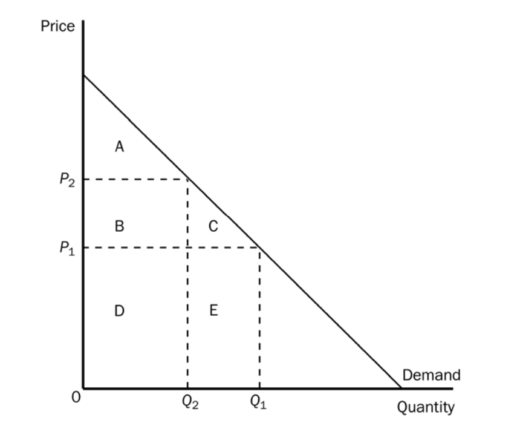

```{r somefunctions, echo=FALSE, results='hide'}

#possibly move these to a separate file

#multi-output text color
#https://dr-harper.github.io/rmarkdown-cookbook/changing-font-colour.html#multi-output-text-colour
#We can then use the code as an inline R expression format_with_col("my text", "red")

format_with_col = function(x, color){
  if(knitr::is_latex_output())
    paste("\\textcolor{",color,"}{",x,"}",sep="")
  else if(knitr::is_html_output())
    paste("<font color='",color,"'>",x,"</font>",sep="")
  else
    x
}


#do the same for centering etc

```

# Production (L4) {#production}

Main source: NS Ch 6 (parts)

## Coverage


- NS: Ch 6: Production


- Production function (at least the basic idea)

- Returns to scale (!)

- Basic cost concepts (!)

- 'Cost minimising input choice' (understand key principle of 'bang-for-the-buck' equalisation)

- Cost curves (!)


... to help understand the key concepts in following chunks

***

----

*Key goals of this chunk*

1. Understand how economists consider a firm
1. ... and depict a firm's *production function*
1. ... and how a firm can 'trade off one input for another' in producing a particular output
1. ... and why the production function may have *increasing returns to scale* or *diminishing returns to scale*

`r format_with_col("Think about: How does the firm's production choice differ from a consumer's consumption choice?","gray")`

----

**Who cares about the firm's/firms'/national/global production function?**


<iframe width="700" height="400" src="https://www.youtube.com/embed/hS9wOdenEys?start=8" frameborder="0" allow="accelerometer; autoplay; encrypted-media; gyroscope; picture-in-picture" allowfullscreen></iframe>

<aside class="notes">
<small> How will you earn a living in the future?
Production may be a function of capital (esp 'high-tech'), materials, and various types/skill-levels of labour. We'll note that in a competitive market each input, including workers, is paid based on their marginal contribution to output, given the firms' optimising choice of inputs.
If production functions (or costs of various inputs) change 'your kind of labour' may become less productive (per hour) as part of this process, meaning wages must fall. If they fall low enough people may not want to work.  If these are 'sticky' or legally prevented from falling firms may reduce employment of 'your kind of labour.'
2020 US presidential candidate Andrew Yang is making this sort of argument, and he claims the best response is a tax-funded 'universal basic income'. Do you think he is correct?
</small>


	</aside>


----


**Urgent question: Brexit**

. . .

Trade with Europe may default to WTO terms

. . .

$\rightarrow$ Very large tariffs on some goods, 'non-tariff barriers' on others


. . .


UK (and EU) firms: Unknown impact on input prices (as well as demand curves, competition, etc.)


- How will this affect the production process?

$\rightarrow$ Consumer prices? Wages? Investment returns?

- Can 'GE models' help firms plan and reoptimise?

----

<iframe width="800" height="500" src="https://www.youtube.com/embed/dX1IFPz2nFo" frameborder="0" allow="accelerometer; autoplay; encrypted-media; gyroscope; picture-in-picture" allowfullscreen></iframe>


#  The firm and the production function

- How do we define it? What does it do?

- What's its goal?

<aside class="notes">
In standard neo-classical economics the firm (each firm)  is treated as a unified decisionmaker whose goal is to maximise profits.

... this profit-maximization assumption 'leads to predictions of firm behaviour which are time and again bourne out by the evidence'

</aside>


## The Firm's Production function

**Production function:**  mathematical relationship between inputs and outputs.


. . .


$$q = f( K, L, M, ...)$$


$$q = f(K, L)$$

e.g., $q =2L^{1/3}K^{2/3}$

. . .

\

Given choice of 'amount to produce', firm tries to produce it at minimum cost

<small> (like consumer maximizing utility st budget constraints) </small>

<aside class="notes">A major difference: firm *also* chooses the level of output... later chapters

Also, output is *observable and measurable</aside>


## Marginal product

Marginal product
:     Additional output from adding +1 unit of an input, holding other inputs constant.

. . .


>  Marginal Product of Labour---$MP_L$: Slope of production function in units of labour (holding capital etc constant)


. . .

$$MP_L=\frac{\partial}{\partial L}f(K,L)$$


\

Similarly for **Marginal Product of Capital** ($MP_K$)


- *A standard assumption: diminishing MP of each input*


## Output, marginal & average product (curves)

<aside class="notes">LC: diagrams here, key points; draw it in with mouse</aside>


```{r  fig.cap = '', out.height='90%', fig.asp=.4, fig.align='center',  echo = FALSE}
 knitr::include_graphics("picsfigs/outputMP1.png")
```


----

```{r  fig.cap = '', out.height='90%', fig.asp=.4, fig.align='center',  echo = FALSE}
 knitr::include_graphics("picsfigs/outputMP2.png")
```


----

```{r  fig.cap = '', out.height='90%', fig.asp=.4, fig.align='center',  echo = FALSE}
 knitr::include_graphics("picsfigs/outputMP3.png")
```


# Isoquant maps, rate of technical substitution (RTS)

## Isoquant maps, rate of technical substitution (RTS)


```{r  fig.cap = '', out.height='90%', fig.asp=.4, fig.align='center',  echo = FALSE}
 knitr::include_graphics("picsfigs/prod_isoquant1.png")
```


`r format_with_col("Similar to consumer's indifference curves, but quantity is *observable*","gray")`

<aside class="notes">
Draw or put this up on the visualiser or white board
	</aside>

----

```{r  fig.cap = '', out.height='90%', fig.asp=.4, fig.align='center',  echo = FALSE}
 knitr::include_graphics("picsfigs/prod_isoquant2.png")
```

<aside class="notes">Q: How do these isoquants display 'diminishing marginal product' of each input?</aside>

<aside class="notes">Ans: Slope gets steeper as we move towards more capital, less labour

Implying with more K we need to add more and more K to make up for a loss of a small amount of L.

 Slope shallower with more L, less K ... similar point</aside>

<aside class="notes">'Iso' probably means 'the same' in some language.

So 'isoquants' connect all points, all combinations of output that produce the same 'quant'(ity.)</aside>

<aside class="notes">The slope of these is called the 'Rate of Technical Substitution,' to be defined shortly</aside>


----


```{r  fig.cap = '', out.height='90%', fig.asp=.4, fig.align='center',  echo = FALSE}
 knitr::include_graphics("picsfigs/prod_isoquant3.png")
```

----

Marginal rate of technical substitution (RTS)
:     Amount one input can be reduced when +1 unit of another input is added, holding output constant

. . .


RTS = - slope of the isoquant


. . .


|(change in capital) / (change in labor)|


----

$$RTS = MP_L/MP_K$$

- RTS is the ratio of marginal products

<aside class="notes">This is fundamentally similar to the reason why the MRS was the ratio of marginal utilities!</aside>


. . .

Makes sense:

- If MPL large I can give up much K, bc gaining L adds a lot of production

- If MPK large I can't give up much K to get more L, bc reducing K reduces output a lot

- *Diminishing* RTS


# Cost minimizing input choice

## Cost minimizing input choice

<div id="left">

```{r  fig.cap = '', out.width='100%', fig.asp=.4, fig.align='center',  echo = FALSE}
 knitr::include_graphics("picsfigs/dhaka_photo-1551160227.jpeg")
```


</div>

<div id="right">

```{r  fig.cap = '', out.width='100%', fig.asp=.4, fig.align='center',  echo = FALSE}
 knitr::include_graphics("picsfigs/sweater_machines.jpg")
```
</div>

<center> <small> A particular quantity $q$ can typically be produced with a variety of different input combinations </small> </center>

<aside class="notes">
Typically, a particular quantity ($q$) could be produced with several different combinations of inputs. E.g., smoothies are produced with labour (employees), technology (blenders, robots perhaps, refrigerators), and raw materials (fruit, ice, yoghurt etc).
	</aside>


##  {data-background="picsfigs/rebecca_inputs.jpg"}


----


*Which combination will the firm choose?*


$$q = f(K,L,...)$$

\

. . .

**Main point**: Whatever q it wants to produce,  firm uses the *minimum cost combination of inputs*!

\

. . .

...chooses inputs to get the best 'bang for the buck';


$\rightarrow$ where input mix optimal, each input yields same *marginal product per £*

<aside class="notes">
<small> very similar to the consumer optimization we discussed. For a given total input cost, the firm wants to produce as much as possible. A better way of thinking about this is that for a given production, the firm wants to incur as low a cost as possible. However, there is no 'hard budget constraint' as in the consumer optimisation case. The firm's output choice will be chosen to maximise it's profit, with no constraints other than 'non-negativity'. </small>
	</aside>


----


Consider a combo of K and L, and the output this yields.

\

. . .

From here, firm can 'substitute capital for labour' at rate $RTS(K,L)= MP_L/MP_K$
 (& hold production constant)

\

. . .


If firm uses both K & L and chooses optimally $\rightarrow$

Set $RTS(K,L)$ equal to the input price ratio of these inputs ($w/r$)

. . .

\


$\rightarrow$ 'Same bang for the buck at optimal choices $K^*$ and $L^*$' i.e.,

\

$$\frac{MP_K(K^*,L^*)}{r}= \frac{MP_L(K^*,L^*)}{w}$$

<aside class="notes">
Intuition:  At optimum, \pounds1 more spent on labour must produce as much as \pounds 1 more on capital. Otherwise I'm not optimising, and I should reallocate.
	</aside>

----

*Aside, for intuition and story-telling*


\

If markets for labour and capital are *(perfectly) competitive* prices of inputs & outputs adjust so that:

-  'bang for the buck' (in revenue) is *the same for all inputs and for all production processes*

- Inputs (workers, owners of capital) in *every industry* will be paid based on their (marginal) productivity ...

<aside class="notes">
E.g, if workers were being paid less than their marginal productivity, they would be 'hired away' by another producer, ultimately raising wages until these equal the marginal productivity, the marginal contribution to revenue
	</aside>

<!--
```{block2,  type='note'}

2019: I will not really ask specific questions about this on the assessment, but you should know it, to help you understand how the model fits together, and the results on the efficiency of the market economy.
```
-->

<br> <br> \bigskip


\


<!---
Todo: give more explanation here
-->

## Advanced question

Back to our 'replaced by AI' motivation, a simple model. Suppose:

\

One product in the economy with 'constant returns to scale Cobb-Douglas production function:'

$$q = L^{a}K^{1-a}$$

\

<small> This implies 'optimising firms will spend a share $\alpha$ on labour'. </small>

. . .

\


<center> <small> `r format_with_col("Now suppose technological changes imply $a$ decreases.  What do you think will happen to wage rates, presuming a 'fixed supply of labour'?", "blue")` </small>  <center>

## Summing up

**Summing up**: Optimisation (given a production function and input prices)...

yields a (minimum) cost for every output $q$ a firm chooses to produce.

\

<center> $\rightarrow$ We will be able to construct a *cost function* </center>


# Returns to scale

## Returns to scale

*Are bigger firms always more efficient? Do things get cheaper to produce the more we produce?*

<aside class="notes">If so, what limits the size of firms? I.e., why don't we see only one firm in each industry?</aside>

. . .

Returns to scale
:     The rate at which output increases in response to a proportional increase in *all* inputs.


----

Constant returns to scale (CRS)
:     If inputs increase by a factor of X, output increases by a factor equal to X.

<small> E.g., doubling all inputs (labor, capital, land, etc) means exactly doubling all outputs </small>


. . .


\

\medskip

Increasing returns to scale (IRS)
:     If inputs increase by a factor of X, output increases by a factor greater than X.


. . .

\


Decreasing returns to scale (DRS)
:     If inputs increase by a factor of X, output increases by a factor less than X.


----


### Arguments/reasons for scale (dis)economies

**IRS**

- Fixed costs (incorporation, buildings, management, planning, R&D) spread over more units

- Should always be able to at least 'double everything' and produce twice as much? (so at least CRS)

- Scale allows specialisation

. . .

\
<br> \bigskip

----


**Arguments for DRS**

- Limited resources in (relevant) economy; costs begin to rise

- Managerial issues and coordination problems, bigger 'centre' to lobby for favours.  `r format_with_col("See 'theories of the firm'","gray")`

- Harder to give incentives to top manager/CEO?

<aside class="notes">Adv: I think the first point is valid,

 but it doesn't suggest that 2 firms would be more efficient than 1;

these DRS would set in as a function of  *total* output, not a single firm's output.

 The second and third arguments are complicated and perhaps harder to justify.

 The case for DRS is unproven, IMHO</aside>

----

### Interesting case: 'Minimum efficient scale' (MES) production


<center> <small> E.g., rental costs/maintenance of 3D printer: \pounds10,000 per year (no matter how much is printed)
Each printer can print up to 100 artificial heads per year
If produce $<$ 100 heads/year, cost/head not minimised. </small>
</center>

\

. . .

Here MES is 100 $\rightarrow$  You should produce in multiples of 100, but could be CRS for each multiple of 100

```{r  fig.cap = '', out.width='40%', fig.asp=.4, fig.align='center',  echo = FALSE}
 knitr::include_graphics("picsfigs/3dhead.jpg")
```


<aside class="notes">Rem: in a perfectly competitive market, firms must produce as cheaply as all other firms, or exit</aside>

##

**Computing...** *If you know the production function, how do you know if the 'returns to scale' are increasing or decreasing?*


> Slide in a constant $\alpha>1$ next to each input, simplify, and compare to the original production


. . .

E.g.:

$$Q(L,K) = L^{1/4}K^{1/2}$$

. . .

$$Q(\alpha L, \alpha K) = (\alpha L)^{1/4}(\alpha K)^{1/2}$$
$$=\alpha^{1/4}\alpha^{1/2}L^{1/4}K^{1/2}=\alpha^{3/4}L^{1/4}K^{1/2}=\alpha^{3/4}Q(L,K)$$

\

<small> $\rightarrow$  So if we increase inputs by $\alpha$ here, we increase output by $\alpha^{3/4}<\alpha$, so DRS *everywhere* for this production function. </small>

<aside class="notes">
Note that this case was easy;  returns to scale may not be constant: there can be IRS at one point and CRS or DRS at another.
You can always just try doubling everything and see if output doubles but this will only tell you the returns to scale in this particular range.
	</aside>


# Costs {#costs}

Main source: NS Ch 7 (just a few parts)


*Key goals of this chunk*

1. Characterise and contrast different types of costs; how they should enter into firms' decisions (and life decisions!)

1. Continue to depict a firm's *cost-minimising input choice*
- and its expansion path


## Types of costs ('Basic cost concepts')

**Fixed costs (FC):** Costs that must be regularly incurred to *remain* in business (i.e., for any level of output), but that do not vary with the level of output

\

**Variable costs (VC):** Costs that increase with the quantity produced.

\

. . .


**Sunk costs**:     Costs that have been incurred in the past that can never be recovered.

<center> <small> Sunk costs should not enter into *any* economic decisions. </small> </center>

\


<small> *FC from previous years are sunk costs; FC for future years are not.* </small>

<aside class="notes">
As Steven covey says: be Proactive not reactive
	</aside> 


# Again: Economic profits and cost minimisation; 2-input model

## Again: Economic profits and cost minimisation; 2-input model

- Labour costs - wage rates $w$
- Capital costs - rental rate $v$


. . .

Total costs $= TC = wL + vK$

. . .


Economic profit = $\pi$ = Total Revenues - Total Costs

. . .


$$\pi = Pq-wL-vK = P\times f(K,L)-wL-vK$$

(P: price of good)


##  Cost minimizing input choice, expansion path, ratio condition

Choose point where RTS = ratio of input prices

- RTS = (wage rate/rental rate) = w/v
- Same ratio of 'marginal productivity/price' for each input used

<aside class="notes">Again, this is very much like the consumer case. Recall the consumer set the MRS equal to the price ratio

The 'benefit tradeoff' must equal the 'price tradeoff' in both cases, otherwise we are not optimizing.</aside>


. . .


```{r  fig.cap = '', out.width='50%', fig.asp=.4, fig.align='center',  echo = FALSE}
 knitr::include_graphics("picsfigs/costmin2.png")
```

----

```{r  fig.cap = '', out.height='80%', fig.asp=.4, fig.align='center',  echo = FALSE}
 knitr::include_graphics("picsfigs/costmin1.png")
```

<small> `r format_with_col("Which point on this curve will minimize cost?","blue")`
. . .
The one on the lowest 'isocost line' ... similar to budget line for consumers </small>

----

```{r  fig.cap = '', out.height='80%', fig.asp=.4, fig.align='center',  echo = FALSE}
 knitr::include_graphics("picsfigs/costmin2.png")
```

<aside class="notes">All points on this line TC1 cost the same amount

This holds  $= TC = wL + vK$ constant.

The slope is the price ratio $w/v$

The point on this line that produces the most is the one *tangent* to an isoquant</aside>


----

```{r  fig.cap = '', out.height='80%', fig.asp=.4, fig.align='center',  echo = FALSE}
 knitr::include_graphics("picsfigs/costmin3.png")
```

<aside class="notes">The same $q$ can be produced by combinations other than $K^*, L*$, but these will *cost more*.

The combination that produces q at the lowest cost is at the point tangent to the isocost line</aside>


----

*Intuition*

$$RTS = MP_L/MP_K = w/v$$

. . .


----

Cost-minimisation for *each* level of output $\rightarrow$ firm's *expansion path*

- *Total cost curve*: from cost of inputs along expansion path


```{r  fig.cap = '', out.width='70%', fig.asp=.4, fig.align='center',  echo = FALSE}
 knitr::include_graphics("picsfigs/expansionpath.png")
```


# Average and marginal cost curves 

## Read at home:

- Average and marginal cost curves

- ... with differing returns to scale: Increasing, decreasing, constant, optimal scale


. . .

<small> Note: [Khan academy short run production costs](https://www.khanacademy.org/economics-finance-domain/ap-microeconomics/production-cost-and-the-perfect-competition-model-temporary/short-run-production-costs/v/fixed-variable-and-marginal-cost) covers this well  </small>

<br> \bigskip

Skip: "Short and long run" costs for the firm


----

**Total cost (TC):**  $c(q)$

<small> Sums fixed and variable costs </small>

<small> E.g., $c(q)= 100 + 2q + 3q^2$ </small>

\

. . .

**Marginal cost (MC):** $mc(q) = c'(q)$

<small> Incremental cost of last unit produced; I.e., additional cost of producing one more unit of output; slope of (optimising) TC curve at a point </small>

. . .

\

**Average cost**: $AC(q)=c(q)/q$

<small>  Cost per unit of output </small>

<small> AC: 'average marginal cost' + FC/q </small>

<center> <small> TC = 'summed' marginal costs and fixed costs </small> </center>

<aside class="notes">The total 'rise over run' for the TC curve at a given quantity as the firm optimally chooses its inputs along the expansion path. Note that the 'summed' marginal costs are really an integral</aside>


----

Shape of marginal cost curve depends on production function

- Constant returns to scale: constant MC (and no FC)

- Decreasing returns to scale: increasing MC

- Increasing returns to scale: decreasing MC (and/or constant FC)


----

```{r  fig.cap = '', out.height='80%', fig.asp=.4, fig.align='center',  echo = FALSE}
 knitr::include_graphics("picsfigs/crsTCcurve.png")
```

----

```{r  fig.cap = '', out.height='80%', fig.asp=.4, fig.align='center',  echo = FALSE}
 knitr::include_graphics("picsfigs/crscostcurves.png")
```

----


```{r  fig.cap = '', out.height='80%', fig.asp=.4, fig.align='center',  echo = FALSE}
 knitr::include_graphics("picsfigs/drsTCcurve.png")
```

----

```{r  fig.cap = '', out.height='80%', fig.asp=.4, fig.align='center',  echo = FALSE}
 knitr::include_graphics("picsfigs/drscostcurves.png")
```

----

```{r  fig.cap = '', out.height='80%', fig.asp=.4, fig.align='center',  echo = FALSE}
 knitr::include_graphics("picsfigs/irsTCcurve.png")
```

----

```{r  fig.cap = '', out.height='180%', fig.asp=.4, fig.align='center',  echo = FALSE}
 knitr::include_graphics("picsfigs/irscosts_fix.png")
```


----

```{r  fig.cap = '', out.height='80%', fig.asp=.4, fig.align='center',  echo = FALSE}
 knitr::include_graphics("picsfigs/mesTCcurve.png")
```

----

```{r  fig.cap = '', out.height='80%', fig.asp=.4, fig.align='center',  echo = FALSE}
 knitr::include_graphics("picsfigs/mescostcurves.png")
```


----

<center> Know things like: </center>


`r format_with_col("Where does the MC curve intersect the AC curve?", "blue")`

\

. . .


`r format_with_col("Total costs are the some of which cost terms?", "blue")`

\

. . .


`r format_with_col("If MC increases in quantity everywhere and there are no FC, what does the AC curve look like?", "blue")`

<aside class="notes">
Skip next two slides.... go right
	</aside> 
----


## On estimating cost/production functions

- Want to estimate product, firm, and industry production functions
   
-  Government (regulators etc), forecasters, strategists

\

<small> Anti-trust, regulating natural monopolies, macro-growth issues and aggregate production, importance of human-K, impact of trade deals (winners/losers), impact of min. wage and labour laws, business strategy and competition, reacting to anticipated market changes... </small>

<aside class="notes"><small>Antitrust authorities want to know if firms are colluding to 'overcharge' regulation, what price to ask natural monopoly to charge.
Macro/growth  aggregate production functions, importance of inputs e.g., human-K
Impact of trade deals on the economy; who wins/loses?
Effect of min wages and labour laws on prices/competitiveness?
Business strategy: know  own, competitors', supplier's production functions to compete/react to/anticipate changes market</small> </aside>


----

Production functions $\Leftrightarrow$ cost functions

- Amount that can be produced with any set of inputs $\Leftrightarrow$ (Minimum) cost of producing any output

\

. . .

- Difficult to estimate these:  Lack of publicly available data, lack of exogenous variation in input choices


<aside class="notes">Some (IO) economists try to 'back out' cost functions from estimated demand functions and pricing</aside>


<!---
```{r  fig.cap = '', out.width='70%', fig.asp=.4, fig.align='center',  echo = FALSE}
 
```
**Refer to the graph above.  When the price is P1, consumer surplus is** \
- a. A \
- b. A + B \
- c. A + B + D \
- d. A + B + C
<aside class="notes">Note, on exam I could ask you to 'select all areas that constitute the consumer surplus'</aside>
-->
<!---
**If I am investing \pounds100 and I earn \pounds20 per year from this, but I could otherwise earn \pounds2 per year from a similarly risky investment, \
  my economic profit is:**
- a. The same as my accounting profit \
- b. Zero \
- c. \pounds20 \
- d. \pounds18 \
- e. More than \pounds18 but less than \pounds20 \
**For a firm that is producing at minimum cost, the Rate of Technical Substitution between any two inputs must equal**
- a. The price ratio of all inputs, even those that it does not use \
- b. The price ratio of all inputs that it uses a positive amount of, assuming there is a diminishing marginal rate of technical substitution everywhere \
- c. The price ratio of all inputs that it uses a positive amount of, assuming there is an increasing marginal rate of technical substitution everywhere \
- d. The price ratio of all inputs, assuming the firm is not under perfect competition \
- e. The price ratio of all inputs, even those that it does not use, assuming that all inputs have the same price
<aside class="notes">Answer: b</aside>
-->

<!---
**The following will imply that a firm definitely has a decreasing average cost curve along the entire range of its outputs** (choose all that apply) \
- A. It's marginal costs are constant and there are fixed costs \
- B. The firm is in an 'optimal scale' or 'minimum efficient scale' industry \
- C. There are constant returns to scale and no fixed costs, but it must pay more per input as it uses more inputs \
- D. It's total cost curve is upward sloping \
- E. Along its expansion path, a doubling of quantity always implies that the total cost less than doubles
<aside class="notes">Answer: a and e</aside>
-->

<!---
Suppose the production function for good q is given by $q = 3K + 2L$ where K and L are capital and labour inputs.
Consider three statements about this function:
I. The function exhibits constant returns to scale. \
II. The function exhibits diminishing marginal productivities to all inputs.
\
Which of these statements are true? \
- a. All of them \
- b. None of them \
- c.  I and II but not III   \
- d. I and III but not II \
- e. only I \
`r format_with_col("This question relates to NS textbook application 7.3","gray")`
-->

<!---
**The government antitrust Competition Commission is considering blocking the merger of two trucking firms.
The factor or factors likely to favour BLOCKING the merger include:**
- a. The merger is likely to reduce consumer surplus \
- b. Both firms are currently producing at a quantity below the minimum efficient scale for this industry \
- c. The merger of the two firms is likely to reduce the price of trucking for consumers \
- d. Trucking has been found to be an industry with increasing returns to scale
<aside class="notes">Ans: a</aside>
<aside class="notes">On exam, I could ask 'choose all factors likely to favour ALLOWING the merger</aside>
-->

