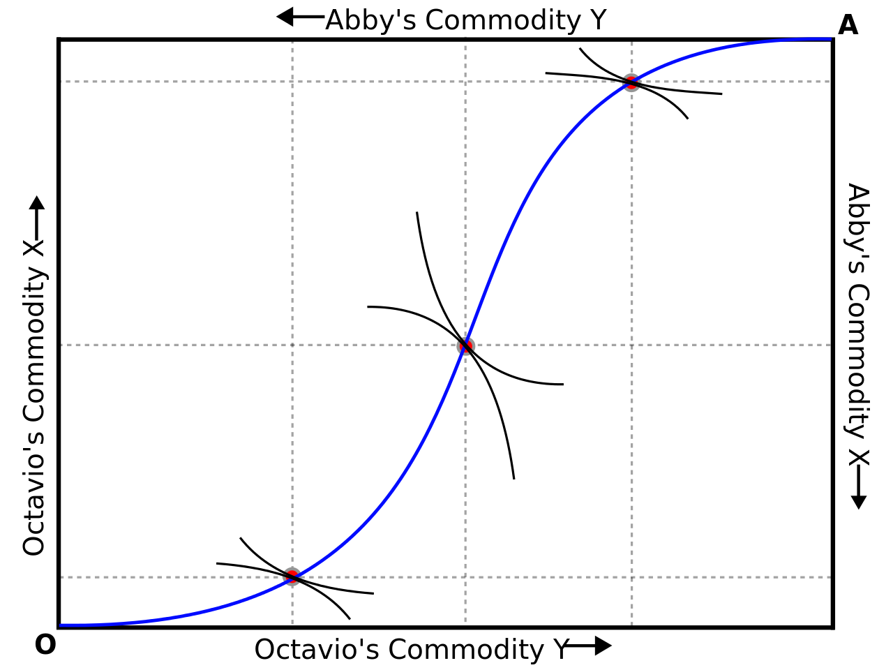

```{r somefunctions, echo=FALSE, results='hide'}

#possibly move these to a separate file

#multi-output text color
#https://dr-harper.github.io/rmarkdown-cookbook/changing-font-colour.html#multi-output-text-colour
#We can then use the code as an inline R expression format_with_col("my text", "red")

format_with_col = function(x, color){
  if(knitr::is_latex_output())
    paste("\\textcolor{",color,"}{",x,"}",sep="")
  else if(knitr::is_html_output())
    paste("<font color='",color,"'>",x,"</font>",sep="")
  else
    x
}

```


#  Profit maximisation and supply (L6) {#profitmax}

Main source:  NS ch 8


- 8.2 Profit maximisation
- 8.3 Marginal revenue
<aside class="notes">includes trivial perfect competition case and 'monopoly' case</aside>
- 8.4 Marginal revenue curve
- 8.5 Supply decisions of a price-taking firm

# Practical questions
## Practical questions


<big>What makes sense?</big>


> We should set the price that maximises our revenue

----

> We are at the point where if we raise our price by 10\% sales will fall by 5\%, so we better not do it!

\

`r format_with_col("???","blue")`

----

> We reduced our price to £1000 this year and we were able to sell 10 units more this year than last year. These only cost us £500 to make, so we are better off.

\

`r format_with_col("???","blue")`


----

> We should stop producing immediately, because the market price has fallen below our average costs, if we take into account our yearly license fee

\

`r format_with_col("???","blue")`


# Key goals of this chunk
## Key goals of this chunk


-  What is 'marginal revenue', why is
    - $MR\leq p$ for firm facing downward sloping demand?
    - but  $MR= p$ for a price-taking firm

. . .

\


- Price and output choice (condition) for a price-taking firm
    - firm's shut-down/entry decision
    - what *is* a 'price-taking firm'?


----


**Context**


- We considered production functions
- ... cost and cost minimization
    - ... expansion paths

. . .


Production functions, prices $\rightarrow$ cost of production ...


*Now:* "what **output** to set to max profits?"

. . .

`r format_with_col("Next: consequences for the market","gray")`


# Marginal revenue
## Marginal revenue


Marginal revenue
:     The additional gross income a firm gains from increasing the quantity it supplies by one unit


<aside class="notes">Remember, given its production the firm always chooses highest p at which

 it can sell all the units it produced</aside>

`r format_with_col("Q: Impact of increasing quantity?","blue")`


. . .


<br> \bigskip


- It can sell an additional unit at some price

<br> \bigskip


. . .


- But it may have to reduce prices on *all* units to do this (more on this later)


<!---
## Profit-maximisation

- If operating, set optimal output q*
-->

<!---
- Under standard assumed conditions
-->

## MR for firm facing 'downward-sloping demand'

<aside class="notes">See example in table 1 in text</aside>

- Single price $\rightarrow$ sell more only by reducing price on *all units*
    - E.g., sell 51 units rather than 50 by reducing price from \pounds1 to \pounds0.99


. . .


- MR $<$ market price here *because*

- Get (new) market price for additional unit $\rightarrow$ + \pounds0.99


. . .


- But lose \pounds0.01 on all previous 50 units $\rightarrow$ - \pounds0.50

- So MR is \pounds0.49

----

```{r  fig.cap = '', out.width='80%', fig.asp=.4, fig.align='center',  echo = FALSE}
 knitr::include_graphics("picsfigs/Mrillustrated.png")
```

----

**MR curves be like:**

```{r  fig.cap = '', out.height='80%', fig.asp=.4, fig.align='center',  echo = FALSE}
 knitr::include_graphics("picsfigs/mrcurve.png")
```


<aside class="notes">Q: Why might MR curves typically decrease in Q?</aside>

<aside class="notes">Ans: Demand curves slope down, so less revenue for each additional unit.

 Also, the *impact* of the reduced price is greater because the more we sell the more units this affects</aside>


----

### Price-taker

```{r  fig.cap = '', out.width='80%', fig.asp=.4, fig.align='center',  echo = FALSE}
 knitr::include_graphics("picsfigs/tunaauction.png")
```

<aside class="notes">Price-taker: produces a good that is the *same* in every way, to the consumer, as other's goods,

and everyone knows this, and everyone knows all the prices. And there are lots of small producers.

With 'differentiated products' we may have 'monopolistic competition'</aside>


----

### MR for a price-taking firm

A price-taking firm (perfect competition):

. . .


- gets market price P for each additional unit


. . .


- the firm is small, so its output has (virtually) no impact on P

<!---
    - (More on this later)
-->

<aside class="notes">the NS text gives a good illustration and examples of why it is fine to assume that

 a small producer's output has no impact on price</aside>


. . .

*Thus its marginal revenue is constant at $P$*

<aside class="notes">Total revenue curve will be a straight line ... double quantity, double revenue</aside>


# Profit-maximisation

## Profit-maximisation

- Operating? $\rightarrow$ Set optimal output $q^*$

<aside class="notes">Conditions for a 'unique maximum', e.g. everywhere decreasing MR and

 increasing or nondecreasing marginal costs</aside>

- ...  profit-maximising output: at the (unique) $q^*$ such that $MR=MC$


`r format_with_col("...if this exists","gray")`


. . .

<br> \bigskip

### Holds for all firms

- Market power ('price-setters'): MR declining (down-sloping 'demand')


. . .


\

- Price-takers: setting $MR(q)=MC(q)$ means setting $P=MC(q)$,  bc $P=MR(q)$

<aside class="notes">Q:  Why? Suppose actual output was < or > than q*.

 Explain what is true about marginal profits as output increases or decreases.</aside>

<aside class="notes">Ans: if q>q*, MR, which is decreasing in q, will be below MC.

 Firm can do better if it reduces q somewhat-- cost decrease will be larger than revenue decrease.

 If q<q*, MR<MC -- better to increase q and revenue increases more than costs</aside>


## For a firm with market power:


```{r  fig.cap = '', out.height='100%', fig.asp=.4, fig.align='center',  echo = FALSE}
 knitr::include_graphics("picsfigs/fig8-1.png")
```

<aside class="notes">Firm wants to make the vertical distance between the revenue and cost curves as large as possible. </aside>

----


**For a firm with market power:**

```{r  fig.cap = '', out.width='50%', fig.asp=.4, fig.align='center',  echo = FALSE}
 knitr::include_graphics("picsfigs/monoptctr.png")
```


```{r  fig.cap = '', out.width='50%', fig.asp=.4, fig.align='center',  echo = FALSE}
 knitr::include_graphics("picsfigs/monopmcmr.png")
```


<aside class="notes">Firm wants to make the vertical distance between the revenue and cost curves as large as possible.

If the curves had differing slopes, profits could be increased by adjusting output in the direction in which the curves diverged.</aside>


<!---
## MR=mc condition for price-taking firm
$$MR(q) = P$$
```{r  fig.cap = '', out.width='5.5cm', fig.asp=.4, fig.align='center',  echo = FALSE}
 knitr::include_graphics("picsfigs/mcmr_tc_tr.png")
```

-->


## Supply decisions of a price-taking firm

**Price-taking firms: what price?**

Can sell all output at market price P*. Will price at P*.

\


. . .


Set P<P* $\rightarrow$?


. . .

- Sell same amount, earn less.  ... Not smart!

\

. . .

Set P>P*?

----

```{r  fig.cap = '', out.width='90%', fig.asp=.4, fig.align='center',  echo = FALSE}
 knitr::include_graphics("picsfigs/fonz.jpeg")
```


<center> Sell no units. Smooth move, hotshot! </center>

<aside class="notes">
Good textbook discussion of 'why and when price-taking'?
	</aside> 
	
----

**Price-taking firms: How much to produce?**

`r format_with_col("(Draw)","gray")`

- Standard assumption: $MC(0)<P^*$,  $MC(q)$ increasing in q `r format_with_col("... or at least there's some region for which AVC< $P^*$","gray")`

. . .


<br> \bigskip


- Thus choose q for which $MC(q) = P^*$ $\rightarrow$ 'Perfectly competitive firms price at marginal cost'

<br> \bigskip

But...


----


But if P* below your average cost for *any possible* output q $\rightarrow$ shut down!


. . .

<br> \bigskip

`r format_with_col("If P* below '(SR) average variable costs'","gray")` $\rightarrow$ `r format_with_col("shut down immediately.","gray")`

`r format_with_col("If","gray")` P* $<$ LRAC $\rightarrow$ `r format_with_col("shut down before incurring further FC.","gray")`

<aside class="notes">I am not focusing on distinction between short and long run cost curves in this module</aside>


# Some revision questions


`r format_with_col("From 2017 final exam","gray")`

<br> \bigskip


A firm that sought to maximize revenue (rather than profit) would choose to produce an output level for which marginal revenue was equal to


- a. marginal cost
- b. average cost.
- c. price.
- d. zero.
- e. as high as possible.


----

Choose all that apply: If the demand faced by a firm is elastic (but not perfectly elastic), selling one less unit of output will

- a.  decrease revenue.
- b.  keep revenues constant.
- c.  require a decreased price.
- d.  increase revenue.
- e.  allow an increased price.


# Perfect competition in a single market (L7) {#perfectcomp}

- Main source: NS Ch 9


## Key goals of this chunk

- How firms' supply curves aggregate to the *market* supply curve

- What is a 'perfectly competitive market'?

----

Motivating questions:

- With many 'price taking firms', how does *aggregate* supply respond to changes in demand?
- Can such firms make a profit in the short run? In the long run?

. . .

- Importance of entry /& exit, implications for short & long run:

- *LR market supply curve*: what it looks like & why


----

...

- *Consumer surplus*,  *producer surplus*,  implications for welfare analysis
- Pareto Optimality

. . .


- Basic argument: why perfectly competitive market $\rightarrow$ Pareto Optimal outcome (under certain conditions)

- Critiques of this, idea of 'market failure'

<aside class="notes">
2019: skip right here
</aside>


<!---
### Motivating questions
- If demand for a good increases (demand curve shifts out), because preferences change, or population increase
    - ... should we expect the price of the good to rise in the short or long run?
-->

----

`r format_with_col("Consider:","blue")` Should price-taking firms and perfect competition be our 'baseline' dominant model?

`r format_with_col("Reasonable to assume?","blue")`

- Free entry of firms/no 'barriers'?

- Homogenous products?

- Decreasing returns to scale at some point?


<aside class="notes">These conditions will indeed lead to $\rightarrow$ perfect competition/MC pricing.

But many markets have large entry costs, first-mover advantages, and perhaps continuously increase returns to scale $\rightarrow$ monop/oligopoly

Most products are also 'differentiated'; with free entry  $\rightarrow$ 'monopolistic competition', another candidate for bring the dominant model</aside>


<br> \bigskip


----

**Deep political/philosophical question:**

Should we expect 'chaotic competition' to lead to the most efficient outcomes, and if so, when and under what conditions?


. . .


- Better to restrict the entry of firms `r format_with_col("(single firm with a guaranteed monopoly?)","gray")`

- Better to regulate prices?

<aside class="notes">Questions are at the core of political and economic debates

throughout the 19th and 20th century. Mercantilists vs physiocrats (classical liberals),

Socialists vs laissez-faire; debates over 'industrial policy' and 'trust-busting', etc

 Keynes vs Hayek...</aside>

----

**Urgent question: Brexit**

. . .

Trade with Europe may default to WTO terms

. . .

$\rightarrow$ Very large tariffs on some goods, 'non-tariff barriers' on others


. . .


UK (and EU) firms: Unknown impact on input prices, demand curves, competition, etc.

- Can 'GE models' help predict these and help firms plan and reoptimise?

- How long will it take to return to some 'equilibrium'?


----


- Fewer firms in UK markets $\rightarrow$ less competition $\rightarrow$ loss of consumer surplus?

<br> \bigskip


. .  .


Also, ... many new regulations bundled with new trade deals:

- Which are 'pro-competitive' or redress market failures and which restrain trade?

----

## SKIP: Pricing in the very short run

# SR supply

## SR supply


For a further revision, 'firms in competitive markets' is well mapped out in a step-by step Powerpoint you can download:

<br> \bigskip

<http://web.mnstate.edu/stutes/notes/mankiwjustpp/firms_competitive.ppt>


<br> \bigskip

(start from beginning, this is specifically referred to beginning on slide 17; use 'presentation mode')

----

`r format_with_col("We will quickly outline:","gray")`


SR: Number of firms in the market is fixed: no entry/exit


. . .


\

- Demand shifts $\rightarrow$ prices change $\rightarrow$ existing firms adjust quantities supplied


. . .


\

- Market supply curve: sum each firm's supply curve


----

Recall: Under perfect competition each firm

- charges market price $P^*$

- produces q at a point where $mc(q)=p^*$

    - as long as there's some output q where $AC \leq P*$

\


. . .


Thus, for every price $P^{*}$, it produces $q$ where $mc(q)=P^{*}$.

\


. . .


$\rightarrow$ its mc curve *is* its supply curve!

\


`r format_with_col("Except where","grey")` $AC(q)>p^*$ `r format_with_col("for all","gray")` q $\rightarrow$ `r format_with_col("it produces zero","gray")`

<aside class="notes"><small> We can (usually) 'invert' the marginal cost function $mc(q)$ to get, for every marginal cost,
'the quantity that yields this marginal cost.'
If we replace this mc with P*, we get the firm's supply curve, i.e., 'the quantity produced at P*.'
Where the minimum AC exceeds p*, the firm has no way to produce profitably, so it will produce nothing.</small> </aside>

----

Sum each firm's supply curve  *horizontally*

```{r  fig.cap = '', out.width='90%', fig.asp=.4, fig.align='center',  echo = FALSE}
 knitr::include_graphics("picsfigs/srsupply.png")
```


# SR Price determination
## SR Price determination

(Read at home: handout, text)


----

Sum across firms (mc curve where $>$ AC curves) $\rightarrow$ *market* supply curve

\

Sum individual demand curves $\rightarrow$ *market* demand curve

\

. . .

Where do these intersect?

- At this price $P^*$ we have $Q_d(P^*)=Q_s(P^*)$ $\rightarrow$ the 'short run *equilibrium* price'


\


. . .


$P^* > AC$ possible in the short run

$\rightarrow$ can make SR *economic* profits!

<aside class="notes">Rem: firms produce where their MC=P*

MC(q) are often assumed *increasing* in q --> only the cost of *last* unit produced equals P*.

Previous units had MC<p*, so A(V)C  may be below p*</aside>

## Illustration of SR price determination

```{r  fig.cap = '', out.width='90%', fig.asp=.4, fig.align='center',  echo = FALSE}
 knitr::include_graphics("picsfigs/srpd1.png")
```

----

```{r  fig.cap = '', out.width='90%', fig.asp=.4, fig.align='center',  echo = FALSE}
 knitr::include_graphics("picsfigs/srpd2.png")
```

----

```{r  fig.cap = '', out.width='90%', fig.asp=.4, fig.align='center',  echo = FALSE}
 knitr::include_graphics("picsfigs/srpd3.png")
```

----

```{r  fig.cap = '', out.width='90%', fig.asp=.4, fig.align='center',  echo = FALSE}
 knitr::include_graphics("picsfigs/srpd4.png")
```

----

```{r  fig.cap = '', out.width='90%', fig.asp=.4, fig.align='center',  echo = FALSE}
 knitr::include_graphics("picsfigs/srpd5.png")
```

----

```{r  fig.cap = '', out.width='90%', fig.asp=.4, fig.align='center',  echo = FALSE}
 knitr::include_graphics("picsfigs/srpd6.png")
```

----

```{r  fig.cap = '', out.width='50%', fig.asp=.4, fig.align='center',  echo = FALSE}
 knitr::include_graphics("picsfigs/srpd6.png")
```

`r format_with_col("Avoid confusion:","red")` The *market* demand curve is downward sloping. The demand curve for an individual firm under perfect competition is effectively horizontal.

----

### Price acts as a signal, leading to efficient choices:

- to firms, telling them 'how much to produce'

<aside class="notes">Don't produce past where your MC exceeds the p you can get in the market; at p where market 'clears' i.e., $Q_d=Q_s$ .</aside>

---- 

### Price signal, leading to efficient choices:

- to consumers, how much to purchase

. . .

- and 'which consumers should obtain the units produced'?

<aside class="notes"><small>By the def of market-clearing price P*, consumers can buy all they desire at P*,
i.e., until last unit gives them a MU of P*.
Adv, foreshadowing equilibrium efficiency: Thus every consumer values last unit they consume the same
--> we *never* have the 'wrong' consumer obtains the good; --> no further gains from 'exchange among consumers'.
If prices were too low (e.g., because of a price ceiling), $Q_d>Q_s$

 demand would have to be rationed, and consumers who valued the product more than other consumers might not get as much. </small> </aside>

## Read on your own: shifts in S and D curves

<aside class="notes">Basically this should all be revision, but read it anyway. You are required to know this material.</aside>


# The Long run 


```{r  fig.cap = '', out.width='90%', fig.asp=.4, fig.align='center',  echo = FALSE}
 knitr::include_graphics("picsfigs/lr_constant_cost.png")
```


\


<center><small> Draw it: Long run equilibrium response to a demand shift, constant-cost case (ignore SMC) </center></small>

## The Long run

In LR 'free entry and exit' of firms, many firms have access to  same production process

. . .


<br> \bigskip

Suppose *positive economic profits* in industry (for efficient producers)

I.e., $P^*>AC(q)$ for some q

. . .


$\rightarrow$ Firms enter  $\rightarrow$ Supply curve shifts out

\

. . .

$\rightarrow$ equilibrium price declines  $\rightarrow$ profits decline


. . .


Repeat until economic profit falls to zero,  i.e., until $P^*=AC(q)$ for the minimum AC q

<aside class="notes">Positive economic profits are sometimes called 'supernormal profits.'

Rem: economic profits are *after* subtracting the (opportunity) cost of capital, management, and other inputs.

Note the powerpoint depicts this better
</aside>

----

Now suppose *negative economic profits* in industry (for efficient producers)

- I.e., $P^*<AC(q)$ for any q


. . .

$\rightarrow$ Firms exit $\rightarrow$ Supply curve shifts inwards


\

. . .

$\rightarrow$ equilibrium price rises  $\rightarrow$ profits rise

Repeat until economic profit rises to zero; i.e., until $P^*=AC(q)$ for the minimum AC q

----

**Long Run Equilibrium**

Firms choose output to max profit

<br> \bigskip

Profit max: $P^* = MC(q)$


. . .

<br> \bigskip
<br> \bigskip


No firms *in* the market want to exit, no firms *outside* want to enter

<br> \bigskip


Zero economic profits:

$P^* = AC(q)$


----

*Also, with free entry/exit...*

<aside class="notes">(and with no production limits)...</aside>


<br> \bigskip

. . .

all firms (in) produce $q$ that *minimizes* their AC,  and all *same* average cost

<br> \bigskip

. . .


- I.e., $P^\ast = min[AC(q)] = MC(q)$ for any firm in the market

- I.e., MC curve intersects AC curve at its minimum.

    - and it's the *same* AC for all firms

. . .


`r format_with_col("Why?","blue")`


----

`r format_with_col("Why $P* = min [ac(q)] = mc(q)$?","blue")`

<br> \bigskip

No profit in equilibrium and firms choose q so that $P^\ast=mc(q)$


. . .

$\rightarrow$ $P^\ast = AC(q) = MC(q)$  for all firms  (in the market)

<br> \bigskip


. . .

Suppose a firm produced at a point *above* it's minimum AC,

- i.e., if $AC(q)> min [AC(q)]$


. . .

<br> \bigskip

$\rightarrow$ it could profit by producing at the q that *minimised* its AC (contradicting above)

- ... so would other firms, who'd be induced to enter; so that couldn't have been an equilibrium

<aside class="notes">We assume a large number of firms have access to this efficient technology.

As previously mentioned, entry shifts the supply curve out, equilibrium price falls,

 until the point where $P^*=AC(q)$ for firms producing at this lowest AC point.</aside>

## Long Run (LR) Supply

<small> `r format_with_col("2019: This curve itself is not covered on the midterm, so we may skip it for now", "red")` </small>

- We have the SR supply curve (upward sloping)

- But we know that in the LR this will shift out in response to a price change

. . .


<br> \bigskip

$\rightarrow$ Taking this shift into account gives us the *Long Run Supply Curve*

<aside class="notes">Avoid confusion:

In the SR there are movements *along* this curve in response to price changes.

In the longer run, it does shift in response to price changes, as firms enter.

The LR supply curve, which we will now define, does *not* shift in response to price changes

But other things may cause it to shift, like changes in input costs</aside>

----

**LR supply curve looks like?**

- Demand curve shifts out $\rightarrow$ price rise $\rightarrow$ firms enter

- ... do firms produce at the *same* minimum AC as before?

. . .


<br> \bigskip

*Depends:*

- Does entry/higher production *change* cost function?

<!-- \pause -->

- So *input costs* rise?


. . .

- 'Externalities' between firms, consumers' `r format_with_col("(e.g., network externalities)","gray")`

<aside class="notes">increased demand for scarce inputs, skilled workers & public resources</aside>
<aside class="notes">DR opinion: We shouldn't always expect the LR curve to be upward sloping.

 might also be flat or downward sloping. Thus, if the demand curve for, e.g., microchips or personalised software

 shifts out, we may see that equilibrium price *declines* in the long run.</aside>


----


<big>Long run population and economic growth $\rightarrow$ ?</big>


<br> \bigskip

`r format_with_col("As the economy grows, which items will get relatively more expensive?","blue")`

<aside class="notes">Economic,  population growth leads to increased demand for most products

(esp. natural resources and primary products). The shape of the LR supply curve tells us

whether real resource prices will increase rapidly over time.

Relative slope for different products tells us which prices will rise *relative* to other goods.

 E.g., will housing become relatively more or less expensive?</aside>

----

### LR Supply: Constant cost case

```{r  fig.cap = '', out.width='80%', fig.asp=.4, fig.align='center',  echo = FALSE}
 knitr::include_graphics("picsfigs/LR_constantcost.png")
```

<aside class="notes">Practice drawing this for the SR and then the LR, and observe SR and LR prices, profits</aside>


----


### LR Supply: Increasing cost case

```{r  fig.cap = '', out.height='80%', fig.asp=.4, fig.align='center',  echo = FALSE}
 knitr::include_graphics("picsfigs/incrcosts_lrsupply.png")
```


<aside class="notes">Initial market equilibrium: P1, Q1

Increase in demand to D' $\rightarrow$ price to P2 in SR $\rightarrow$ firms produce at q2, profit $\rightarrow$

Profit attracts new firms. $\rightarrow$ costs rise to the levels shown in (b). $\rightarrow$

New equilibrium at P3, Q3.</aside>

----

*Long-run elasticity of supply:* \% change in LR $Q^s$ / \% change P


```{r  fig.cap = '', out.width='90%', fig.asp=.4, fig.align='center',  echo = FALSE}
 knitr::include_graphics("picsfigs/lr_supplyelast_ests.png")
```

<small>(Various estimates over the years, see NS text) </small>


# Consumer and producer surplus, efficiency

## Consumer and producer surplus, efficiency

Consumer surplus (reprise)

:      Extra value ... from consuming good over its price. WTP for right to consume a good at its current price.

- Area between the demand curve and the market price

----

Producer surplus

:     Value producers get for a good less the opportunity costs they incur by producing it. What producers would pay for right to sell good at current market price. (Essentially profits not counting FC.)

. . .

\


- Area between supply curve and market price

<aside class="notes">Basically producer surplus is profit + unavoidable costs.

In the SR you cannot shut down and avoid the fixed costs, whether or not you sell any units.

Since you are already incurring these, they don't count against the benefit you would get from selling at the market price.</aside>

. . .

\


- In LR, zero-profits, all costs are variable $\rightarrow$ producer surplus is zero


<aside class="notes">Adv: When a firm owns a unique resource it can arguably make a LR profit called a 'Ricardian rent'.

However this could be seen as the return to an asset which should be 'charged against' these profits.</aside>

----

```{r  fig.cap = '', out.height='80%', fig.asp=.4, fig.align='center',  echo = FALSE}
 knitr::include_graphics("picsfigs/prodsurp1.png")
```

<aside class="notes">
Revenue: price times quantity 
	</aside> 
	
----


```{r  fig.cap = '', out.height='80%', fig.asp=.4, fig.align='center',  echo = FALSE}
 knitr::include_graphics("picsfigs/prodsurp2.png")
```

<aside class="notes">
Firm/firms were willing to produce each incremental unit at the price corresponding to that point on the supply curve.
	</aside> 
----


```{r  fig.cap = '', out.height='80%', fig.asp=.4, fig.align='center',  echo = FALSE}
 knitr::include_graphics("picsfigs/prodsurp3.png")
```

<aside class="notes">
They 'got the rectangle', 'would have produced each unit' for the yellow shape, the green difference is their surplus.
	</aside> 
----


### In what sense is a competitive market 'efficient'? 

<small> Roughly; single-market depiction </small>

\

<center> Allocation of resources maximizes total surplus </center>

<br> \bigskip

Total surplus $=$ consumer $+$ producer surplus

\

<small> At market equilibrium: no more mutually-beneficial exchanges can be made</small>

----

'A *competitive* market *in equilibrium* will max total surplus'


```{r  fig.cap = '', out.width='50%', fig.asp=.4, fig.align='center',  echo = FALSE}
 knitr::include_graphics("picsfigs/consumerprodrsurplusmax.png")
```

<aside class="notes">Q* maximizes the sum of consumer and producer surplus.

Any other quantity yields a lower sum. E.g., at Q1 we 'lose' the triangle FEG

 ... this is called a 'deadweight loss' as it is a loss to society, it just disappears.</aside>


<aside class="notes">Note this doesn't tell us that the supply curve reflects efficient production, nor that the 'right' consumers get the good</aside>

----

*We can use these models/concepts to consider...*


- 'Who suffers from a tax' in the LR and SR?

. . .


\


- Who gains from technological innovation?


. . .

\


- Who gains and who is harmed by trade restrictions, and do the costs outweigh the benefits?

<aside class="notes">Simplest models of 'tax incidence': tax drives a wedge btwn price consumer pays and the price the firm gets;

can be depicted as a inward shift in supply curve; rem not to count government revenue as a 'loss'

Also note that tech innovation reduces (long run, average ) costs</aside>

<aside class="notes">
2019: jump right here
	</aside> 


<!---
Additional potential applications: rail regulation, music copyright
-->


## Suggested practice problems from Nicholson and Snyder Chapter 9 (12th ed)

'Micro-quizes'

9.2, 9.3, 9.4,

'Problems':

- 9.3a and b

- 9.5?

- 9.9 a-d?


----

### Revision questions


Under perfect competition, if an industry is characterized by positive economic profits in the short run

<br> \bigskip

- a. firms will leave the market in the long run and the short-run supply curve will shift outward.
- b. firms will enter the market in the long run and the short-run supply curve will shift outward.
- c. firms will enter the market in the long run and the short-run supply curve will shift inward.
- d. firms will leave the market in the long run and the short-run supply curve will shift inward.

----

If the market for coconut water is characterized by a very elastic supply curve and a very inelastic demand curve, an outward shift in the supply curve would be reflected primarily in the form of


<br> \bigskip

- a. higher prices
- b. higher output
- c. lower prices
- d. lower output


----


Under perfect competition, if an industry is characterized by positive economic profits in the short run

<br> \bigskip

- a. firms will leave the market in the long run and the short-run supply curve will shift outward.
- b. firms will enter the market in the long run and the short-run supply curve will shift outward.
- c. firms will enter the market in the long run and the short-run supply curve will shift inward.
- d. firms will leave the market in the long run and the short-run supply curve will shift inward.


# Today's goals (28 Oct 2019)

<!-- 1. Recap 'in what sense is a competitive market efficient' (single product, consumer and producer surplus)
-->


1. General equilibrium and efficiency -- key principles and arguments

- What is 'Pareto efficiency?'
- What conditions must hold for an economy to achieve this? 
- Basic story for why efficiency *should* attain
- First and second welfare theorems
- Market failures

\


2. Market failure: one case - Public goods
- How do we define a 'public good'... what are some examples?
- Basic argument for market failure here

\

3. Second annual pre-midterm championship (revision)


# Additional material on efficiency: key principles

## General equilibrium and efficiency: Coverage

<small> This is a very brief excerpt and summary of the material in NS chapter 10, with some additional motivation. If you understand these slides/notes you don't have to read chapter 10. </small>

## Key principles: efficiency \& 'general' equilibrium

*Under certain conditions* competitive markets are efficient in equilibrium

<br> \bigskip

. . .


But:

- Some markets may not reach equilibrium 'quickly'

. . .

\

- These conditions may not hold $\rightarrow$ *market failure*


. . .

\

- Efficiency itself doesn't imply preferred outcomes: can involve a great deal of inequality

----

*General Equilibrium* (GE) analysis: entire economy as a system of interacting, interdependent markets

\

**GE:** Set of prices s.t. $Q_s(P)=Q_d(P)$ in *all* markets, including input markets

<aside class="notes">E.g., government push for tomato consumption shifts tomato demand out, prices up

this lead to LR shift out in tomato supply curves (firms enter)

increases demand for *inputs* like farm labour, raises cost of production of other veg, etc

Will we return to equilibrium, and with what prices and quantities?

Stay tuned true believers! (and take more Econ, because we won't cover it here) </aside>

----

Overall Pareto efficiency: no one can be made better off without making someone else worse off

\

`r format_with_col("Why is this how we define efficiency?","blue")`


. . .

\


Because if we *could* do so, we would not be at an efficient point


<aside class="notes">Pareto efficiency is hard to disagree with, as a policy goal;

if we could move to a situation where some were better off and none made worse off, we should do it.</aside>


----

Overall efficiency requires three conditions:


Efficiency in production (being on the PPF)
:     No way to reallocate inputs to increase production of one good without reducing production of another


<br> \bigskip


Given society's resources, we are producing 'as much as possible'


----

```{r  fig.cap = '', out.width='90%', fig.asp=.4, fig.align='center',  echo = FALSE}
 knitr::include_graphics("picsfigs/hightower_cartoon1.png")
```

Efficiency in production?

----


```{r  fig.cap = '', out.width='90%', fig.asp=.4, fig.align='center',  echo = FALSE}
 knitr::include_graphics("picsfigs/self-checkout.jpg")
```

Efficiency in production?


----

### Formal argument: efficiency in production


Specifically, economy produces on the PPF: given available inputs, we produce 'as much as possible'

. . .


- I.e., we can't produce more of any good without producing less of some other good


<br> \bigskip


. . .


$\leftarrow$ Ensured by 'efficient use of inputs' (same 'bang for the buck' per input for all firms and products)


. . .


$\leftarrow$ Ensured by 'competitive market for inputs' (all firms face the same prices, prices set to equalise demand and supply for inputs)


<aside class="notes"><small>Basic argument: firms hire more of each input until its 'bang for buck' is the same as all other inputs,

a single market price for the input will ensure this is the same across firms.

This 'equilibrium' input price must reflect its marginal productivity in producing the 'last unit' for *each and every firm and product*

MRTS(k,l) must be equal across all firms/products, otherwise they would 'trade'


... Can also be seen as ensured through 'exchange between firms' (production Edgeworth box) </small>
</aside>

----


Efficiency in consumption (exchange efficiency)
:     No way to reallocate output amongst consumers to make them all better off


. . .


<br> \bigskip


Given what we're producing, it is going to the 'right consumers'.


<aside class="notes">Basic argument for exchange efficiency of competitive equilibrium:

If, given the 'endowments', one person values A in units B more than someone else,

an equilibrium price ensures that they will trade these amongst one another until each has the same MRS

The 'Edgeworth box' offers a graphical demonstration that this yields a Pareto optimum (given the amounts produced).</aside>

<aside class="notes">More prosaically, a single price for each good ensures that everyone who buys the good

 values their last unit of it the same amount (its price)</aside>

----

```{r  fig.cap = '', out.height='100%', fig.asp=.4, fig.align='center',  echo = FALSE}
 

```


----


## Edgeworth box scavenger hunt

```{r  fig.cap = '', out.height='70%', fig.asp=.4, fig.align='center',  echo = FALSE}
 
```

<br> \bigskip

*Does this look familiar? Where can you find it at Exeter? What does it mean?*

<aside class="notes">Basic argument for exchange efficiency of competitive equilibrium:

An equilibrium price ensures that they will trade these amongst one another until each has the same MRS

The 'Edgeworth box' offers a graphical demonstration that this yields a Pareto optimum (given the amounts produced).</aside>

----


### Formal conditions and argument for efficiency in consumption (Exchange efficiency)

Specifically: No way to reallocate output amongst consumers to make them all better off


. . .


<br> \bigskip

With DMRS, this is equivalent to 'for the last (positive) unit of X purchased by each consumer, they are all willing to give up the same amount of X to get another Y'


. . .


I.e., their marginal rates of substitution for the last unit they buy are all the same: equal to the price ratio.


<br> \bigskip

. . .


$\leftarrow$ basically ensured by the $MRS(x,y)=p_x/p_y$ 'bang for the buck' condition.

<aside class="notes"> <small> All purchase a good up to the point in which their willingness to trade it off for another good equals the price ratio; thus all have the same relative valuation (MRS) for the 'last unit' of each good. </small>

<small> Edgeworth box shows how this could occur more directly through exchange
the price that leads one guy to want to 'sell A units of X and buy B units of Y',
 and also leads the other guy to want to 'buy A units of X and sell B units of X'
 leads them to both have the same MRS at this 'equilibrium bundle </small></aside>

----

Given our inputs, we can produce 'efficiently', i.e, along the PPF,

<br> \bigskip

and given the amounts of each good produced, it is 'consumed by the right people' (no more room for trade) ...

<br> \bigskip


yet we may still not be at efficiency? `r format_with_col("Why not?","blue")`

----

##  {data-background="picsfigs/soviet_store.jpg"}

----

```{r  fig.cap = '', out.height='80%', fig.asp=.4, fig.align='center',  echo = FALSE}
 knitr::include_graphics("picsfigs/toplevelefficiency.png")
```


----

We need to produce the right *combination* of goods.

<br> \bigskip
<br> \bigskip

Efficient allocation of resources ('top-level' condition)
:     No way to produce more of one good and less of another to make all consumers better off

<aside class="notes">Basic argument for top-level efficiency of competitive equilibrium:

Equilibrium prices from exchange reflect each consumer's marginal rates of substitution for their last unit

This signals to firms the rate at which *all* consumers would be willing to trade off A for B at the margin

In equilibrium firms produce at a point where the cost tradeoffs between A and B (slope of PPF) reflects these prices.</aside>

----

### Formal conditions/argument for top-level cond.

Efficiency $\leftarrow$ (Along PPF), can't adjust **product mix** to make any consumers better off without making some worse off

. . .

*Formally:*

DMRT on x PPF & DMRS for consumers <small> (rem: all have same MRS) </small>...

$\leftrightarrow MRS(x,y)=MRT(x,y)$ 
is necessary/sufficient for top-level efficiency 


. . .


<small> I.e., marginal tradeoff in production = marginal tradeoff in consumption, i.e., Slope of PPF at chosen point = slope of everyone's indifference curve at their chosen point </small>

. . .


----

Need $$MRS(x,y)=MRT(x,y)$$ for top-level efficiency.

`r format_with_col("Why should the free-market lead to this?", "blue")`

\

Optimizing consumers, free exchange $\rightarrow$ MRS reflects relative prices

. . .

competitive firms choose q's s.t. $mc(q_x)=p_x$ $\forall$ firms, goods

$\rightarrow$ ratios are equal; consumers' value tradeoff equals production tradeoff :) 

<aside class="notes">through free exchange, price signals, competition</aside>


----

First fundamental theorem of welfare economics
:     A general competitive equilibrium is Pareto efficient, under standard assumptions


<br> \bigskip


- Intuition: free exchange leaves no room for mutually-beneficial improvements, and firms and consumers optimise

----


Second fundamental theorem
:     Under some fancy assumptions, any Pareto efficient outcome is a competitive equilibrium for *some* pattern of initial endowments


. . .

<br> \bigskip

So if we could costlessly redistribute *endowments*, we could attain any socially-desirable outcome by doing so, and then relying on the free market.

----

First fundamental theorem of welfare economics
:     A general competitive equilibrium is Pareto efficient, under standard assumptions.

. . .

\

**But these assumptions may not hold $\rightarrow$ 'market failures'**

1. Imperfect Competition

- Markets not competitive, because of barriers to entry or increasing returns to scale

- $\rightarrow$ Prices won't reflect marginal costs $\rightarrow$ 'deadweight losses'


----

2. Externalities, public goods, altruism

Assumptions: 'anything someone values' is bought & sold in the market on their own behalf


. . .

<br> \bigskip

But:

- Externalities: All costs (& benefits) may not be priced; e.g., pollution

- Public goods (and bads): Many benefit from the same good (e.g., fireworks)


. . .


- <small> Also: Altruism/interdependent utilities: People care about *others'* consumption </small>


----

3. Asymmetric information: People have different information about the state of the world (costs, risks, a good's quality...)


<br> \bigskip


. . .


4. Bounded rationality: people may not choose in their own best interests


----

**Second Welfare theorem**

If we could costlessly redistribute *endowments*, we could attain any socially-desirable outcome

by redistributing and then relying on the free market

<br> \bigskip


But:


. . .


- Redistribution via 'optimal lump-sum' taxes isn't easy, as endowments may be unobservable


- and redistribution based on things you can affect, e.g. income, may distort incentives.


## Practice question on  GE/efficiency

 *Choose one or all that are correct.*
**The following situation(s) or condition(s) imply the economy has NOT attained a Pareto efficient outcome.**

**A.** We can produce more toothbrushes w/o producing less toothpaste, but this requires us to produce less food; all 3 goods are valued by consumers.


**B.** The economy is not producing any liverwurst; however, liverwurst does not enter into any consumer's utility function. \

**C.** At the current levels of consumption, older people are willing to give up 2 toothbrushes for 1 toothpaste, while younger people are willing to trade these off 1-for-1; both groups have a positive amount of each. \

**D.** At current production, the PPF implies we could produce one fewer tube of toothpaste and thus produce two more toothbrushes; however, all consumers have a MRS of 1 between these two goods, and are consuming a positive amount of both.

<aside class="notes">Ans: c and d</aside>


----

## Some key things for midterm (recap)

- How do economists measure and test models,
    - techniques and terms used
    - thoughts on estimating demand and supply curves

. . .


<br> \bigskip

<!---
- Note that economists define 'surplus' as excess supply at the prevailing (or enforced) price and 'shortage' as excess demand at the prevailing (or enforced) price
-->


<br> \bigskip

- The 'axioms' over preferences, the justification for these, and what they imply for utility functions


----

- Understand indifference curves and budget constraints well


. . .


- Conditions for consumer optimisation (obviously this is important) including for when a consumer will choose to consume none of a good


<br> \bigskip


. . .

- Definitions of 'types of goods' as implied by characteristics of the demand function

- Impacts of price changes (own good, other good) and income on an individual's consumption, and what goes into this and how to depict it.


- (Producer and) consumer surplus.


. . .

<br> \bigskip

- 'Applications', especially those discussed both in the assigned text and in the lectures.

----


- Firm's conditions for optimisation in input choice.


- Firm's conditions for 'what quantity to choose' under different market conditions (price-taking, non-price-taking)


. . .

<br> \bigskip

- Perfect competition in the LR and the SR, what profits look like, how prices move.


. . .


- Very basic idea of the efficiency of general equilibrium under perfect competition
    - When it yields a Pareto-efficient outcome,

    - very basically what the first and second welfare theorems mean.

-  Components of efficiency (top-level, exchange, productive) and what these mean


# Market failure (One case: Public goods) (L8)

##  Consider... {data-background="picsfigs/pubgoodspic.png"}

<aside class="notes"> 
Given what we have learned, (how) will the market provide the goods in this picture? </center>
	</aside> 


## Market failures - public goods, coverage

- NS: Ch 16 -- public goods section only <small> (skip Lindahl equiliibrium, median voter, single-peaked preferences optional) </small>

*Goals of this introduction*

-  How do economists define a public good? What fits into this category?

-  Better understand 'market failures'


## Market failures

... Occur when prices don't fully reflect the marginal social benefits or costs

- May provide scope for political intervention

- How does this happen?


. . .


- One potential source of market failure: Public Goods

## Public Goods (attributes, categories)

What are the characteristics of a public good?


----

*Def* -- A **Pure Public Good** is a good that is both


. . .


1. *Non-excludable*: Once the good is provided, it is impossible/costly to prevent any individual from using/benefiting from it.

<aside class="notes">Even individuals who have not paid for it</aside>

<aside class="notes">Opposite: Exclusive goods*: ... if it is relatively easy to bar people from benefitting from it once it has been produced</aside>


. . .

2. *Non-rival:* One person's consumption doesn't reduce the quantity available for others.


. . .


- The fact that some people use the good doesn't prevent others from using the *same* good.

- There is no 'crowding.'

- Provision/consumption to additional users at zero marginal (social) cost.


<aside class="notes">Q: think of some examples.</aside>

<aside class="notes">
<small> In market economies, private suppliers provide the majority of goods and services to consumers. However, certain goods are publicly provided. These include for example defense, education, and health. Why does the government instead of the market provide these goods?  Which characteristics differentiate goods that are privately provided from goods that are publicly provided? How do we define public goods? The terminology might induce the conclusion that '----public goods are good that are publicly provided as opposed to private goods which are privately provided.' This conclusion is simply WRONG! The public or private nature of the good is an intrinsic characteristic of goods that is not related to the provider of the good
Hence, it may well be that the state provides a private good or that
the market provides a public good. </small> </aside>


## In between's (self-study)

```{r  fig.cap = '', out.height='90%', fig.asp=.4, fig.align='center',  echo = FALSE}
 knitr::include_graphics("picsfigs/rivalexcludabletable.png")
```

----


Excludable and rival (depleatable)? $\rightarrow$ *Private good*

. . .

\

*'Club goods':* excludable but non-rivalrous (at least up to a congestion point).

\


. . .

*"Common property"*: Nonexcludable but rivalrous


. . .


<br> \bigskip
`r format_with_col("'Somewhat' nonexcludable and/or 'somewhat' nonrival:  $\rightarrow$  'impure public goods.'","gray")`


----

```{r  fig.cap = '', out.height='90%', fig.asp=.4, fig.align='center',  echo = FALSE}
 knitr::include_graphics("picsfigs/rivalexcludabletable1.png")
```

----


**What about?**

- Recorded music
- 'Information' goods (e.g., software)
- A national park
- A theatre performance
- Roads
- Clean air
- Education
- Aid to the needy

----

**What about?**

- Loud music coming from my window
- Disease control
- Economic research
- The justice system
- Fireworks in Disney World
- The 2012 Olympics in London

----

**The basic ideas**

If a good is *non-rival* then additional provision (of the units produced, to more consumers) is costless.

. . .

Thus,

- if exclusion is possible, and *any* positive price is charged, some are deterred from consuming it


<!-- \pause -->


- this is inefficient: people who could benefit from the good, at no cost to others, will not consume it :(


And...

----

(If non-rival)

Even if each person provided it for their *own* benefit (on the assumption that no one else would), they would typically choose *too little* from a social POV...


<br> \bigskip

Considering their own marginal benefits (and MRS) versus the price or cost, not the *social* marginal benefit (an 'externality' to them)


----

If a good is *non-excludable* it will be difficult to charge people for it

- many will prefer to wait for *others* to buy it, and then they enjoy it anyways (free-ride) `r format_with_col("(that's a 'coordination problem')","gray")`

. . .

But if firms cannot charge for its full value, they might not pay the fixed costs to develop/build/provide it

. . .

Who would pay to produce a film that is freely pirated/distributed?
Who would pay to develop a drug that must be priced at its marginal cost?
Why contribute to police protection for your village, if your neighbours will pay for it anyways?

<aside class="notes">Loosely, 'rivalryness' basically relates to whether market provision will be *efficient*,

 while 'excludability' tells you whether firms can make *significant amounts of revenue* from providing it, selling (access to) the same produced good to more than one person</aside>

----

### Motivation

**Policy:** 'Public goods argument' - justifies many government programmes (military, environmental cleanup, research, etc)


<br> \bigskip


. . .


**Management:** Companies/individuals can only profit (or even cover costs) from providing a public good through `r format_with_col("???","blue")`


----

```{r  fig.cap = '', out.width='70%', fig.asp=.4, fig.align='center',  echo = FALSE}
 knitr::include_graphics("picsfigs/envservice.png")
```

...gaining subsidies, helping others avoid enforcement (fines) `r format_with_col("or ???","blue")`


----

```{r  fig.cap = '', out.width='100%', fig.asp=.4, fig.align='center',  echo = FALSE}
 
```


gaining voluntary support ... `r format_with_col("or ??","blue")`


----

```{r  fig.cap = '', out.width='55%', fig.asp=.4, fig.align='center',  echo = FALSE}
 knitr::include_graphics("picsfigs/disneyfireworks.jpg")
```

by turning it into a private (or excludable) good.


