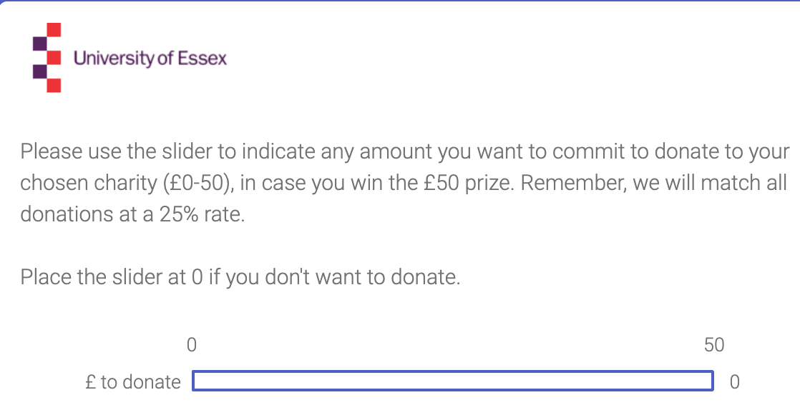

## Sections

0. [Definition of 'effective giving' for our purposes, motivation](#intro)

1. [Barriers to effectiveness in giving (very brief taxonomy/outline)](#barriers)

2. [Focus: 'Processing of effectiveness information' & dual-system](#effect-info-dual)
<small> [(Concepts/theory)](#concepts) </small>

3. [Prior evidence and gaps](#prior-evidence), [Reinstein et al team empirical approach](#empirical-approach)

Our approach?: Naturalistic settings, robustness across setups/frames, honestly presentation of evidence, allow integration

4. [DonorsVoice mailing experiment](#dv-experiment) <small> (many co-authors)  i) Setup  ii) Results iii) Proposed follow-up  </small>

5. [Bergh project (Mturk)](#bergh-mturk-experiment) <small> Setups, Results </small>

6. [Bergh/Reinstein (Essex piggyback)](#essex-piggyback) <small> Setups, [Results](#bergh-results) </small>

7. [Preliminary conclusions, proposed future directions](#conclusion) (time permitting)


## The puzzle

`r format_with_col("There is a puzzle:","blue")` inefficient giving/little to highest-impact causes
\

1. “Why don’t we give more to the most effective charities and to those most in need?”,


<center> *and* </center>


2. “Why are we not more efficient with our giving choices?”


\


Ben Grodeck:

> ... although people have their pet charity causes (e.g. blindness), even if you buy an argument of incommensurability between causes (which we shouldn’t imo), there are more effective charities within these subsets.


```{block2,  type='note'}

*From a recent grant application ...*


When confronted with a "[girl drowning in a pond](https://www.thelifeyoucansave.org/videos#pondvideo)" most people are willing to sacrifice substantial wealth to save her life. However, [most people ](https://givingusa.org/giving-usa-2017-total-charitable-donations-rise-to-new-high-of-390-05-billion/)*[don’*t](https://givingusa.org/giving-usa-2017-total-charitable-donations-rise-to-new-high-of-390-05-billion/)[ make large donations to the very poor](https://givingusa.org/giving-usa-2017-total-charitable-donations-rise-to-new-high-of-390-05-billion/), in spite of evidence suggesting that lives can be saved [for less than $10,000](https://www.givewell.org/how-we-work/our-criteria/cost-effectiveness). There is a [strong case](https://www.theguardian.com/books/2015/aug/20/doing-good-better-william-macaskill-review) that most donations go to charities that improve well-being far less per-dollar than others. Even within the same category, more can be achieved for less: e.g., while it costs about[ $40,000](https://www.researchgate.net/publication/5421378_The_Economic_Costs_and_Benefits_of_Dog_Guides_for_the_Blind) to provide a blind person a guide dog, [each $100](https://www.givewell.org/international/charities/The-Carter-Center/River-Blindness) given for mass-distribution of ivermectin may *prevent* 10-50 years of river-blindness. This raises two related questions: 1. “Why don’t we give more to the most effective charities and to those most in need?”, and 2. “Why are we not more efficient with our giving choices?” To address this, we must understand what drives giving choices, and how people react to the presentation of charity-effectiveness information. (NOTE: Singer, Peter. "The Singer solution to world poverty." The New York Times Magazine 5.September (1999): 60-63.)

While social science, biology and philosophy suggest a range of explanations for ineffective giving– invoking values, preferences, and biases–the discussion and evidence is scattered. There have been no systematic reviews or large projects targeting this, and limited communication across disciplines. Loewenstein and Small (2007) offer a theoretical framework, focusing on the interplay between the mental processes of "deliberation" and “sympathy”. Other (largely unpublished or non-academic) merely “lists” the evidence, typically citing a single paper for each potential channel, without evaluation.^[See: Loewenstein and Small 2007); (Berman et al. 2018) (introduction).  (Baron and Szymanska, 2011). Unpublished or non-academic:  ‘Ideas42, 2016; Gertler, 2015; Yoeli]
```

### What are these ' barriers' to effective giving?


If people are motivated by 'the extent that they can help others, and reason in a maximizing way', the above is a puzzle. What 'barriers' and 'biases' might explain it?
\

Some of the following mechanisms may drive giving behavior" in ways that depart from "maximizing one's impact" (for a given contribution), and might deter giving to the most effective causes.  These may lead some causes to be 'neglected', i.e., underfunded. If we imagine a diminishing marginal impact of giving to each cause or recipient, the causes that are neglected, receiving less support, will be left with a greater marginal impact per dollar.

\

**Barriers: a workable categorization**


{width=25%}

0. No moral-utilitarian concerns: people may simply not be 'moral utilitarians'; they may give for other reasons (e.g., reputation; although this kicks the problem up a level; why should one's reputation and standing be tied to charitable giving... and shouldn't the effectiveness of such giving matter to this?)
\


**Psychological distance,' (lack of) awareness and consideration psychological distance/emotional arousal:** Whether a cause/charity is something people are aware of, feel is important/salient, and feel close to.
\

{width=55%}

\


Key examples:

- Spatial/Physical distance, cultural distance; parochial altruism and ingroup bias may lead some causes to be *neglected*.

-  Temporal (future problems and people) may not be as salient as current problems

- Other sorts of distance: Lower-probability events, Emotional/Affective distance (Small), experiential

 - Consistent problems aren't as noticeable (reflected in media also)

- availability heuristic

\

**Identity and self-perception:** Things that run against one's self-perception and how one believes others will will see you.


```{r measuringpov, out.width='33%', fig.align='center', fig.cap='2. Identity & self-perception;      3. Inertia and systemic factors;     4. Quantitative biases', echo=FALSE, fig.show='hold'}
knitr::include_graphics(rep(c('rather-fight-than-switch.jpg','fb_supoprtmydaughter.jpg')))
```


- Avoiding cognitive dissonance; people don't want to admit that their previous choices were sub-optimal

- 'The volunteer experience unlocks emotion and giving'; but to local causes only?

- Social perceptions and signaling empathy vs effectiveness;
    - Related: difficulty of coordinated signaling with a hard-to-coordinate measure such as 'effectiveness'
\

\

**Aversion to DOING evaluations:**  Things that make people reluctant to evaluate and consider the effectiveness of charities, and ways that doing these evaluations reduce generosity.

<center>
{width=35%} {width=35%}
</center>

- "Taboo Trade-Offs (c.f., Protected Values)"

- Market & Social Norms may clash

-Cost-benefit analysis (CBA) aversion/disinterest (or simply finding it less appropriate/normal/virtuous in the charity context)

- Cost effectiveness information may turn off System-1 and reduce giving; statistics diminish impact of 'identifiable victim'

    - I.e., the evaluation process itself may switch off empathy; see 'dual system' models of fast/slow thinking

\

**Quantitative biases:**  Problems dealing with numbers and making logical evaluations involving numbers, values and amounts. Common cognitive errors *or* intuitive and emotional reactions triggered in these contexts.

{width=20%}

These may lead people to not reason well and make less efficient charitable choices. Some of these biases may *particularly* affect the more effective and neglected charities.

- Altruistic opportunity cost neglect

- Statistical/identifiable victim effect

- Availability heuristic (in probabilities?)

- Misunderstanding need (and misunderstanding marginality/tractability/sunk costs?)

- Proportional dominance effect/drop in bucket/psychosocial numbing/psychophysical numbing

- Scope insensitivity/embedding effect/part-whole effec

- Overhead aversion

\
Inertia and systemic/institutional factors: Factors limiting individual and social *change* in behavior

- Social norms and difficult-to-ignore requests to donate to local charities
\

## Defining 'per dollar impact' of a donation

```{block2,  type='note'}

(Total or marginal) impact per dollar = output per dollar $\times$ impact per output

```

\

*Impact* of a donation:

$B'(G_i)$ for the marginal donor

- GiveWell, ImpactMatters, and others attempt to measure this

<br>

<center>

*We know:*

$B'(G_i)$  is much larger for the most *impactful* relative to the most *popular* charities.

</center>


<!-- Add statistics ... Trust me on this, or at least accept that this seems likely in many cases. -->


(Steinberg & Morris, 2010 wrote about marginal vs average effectiveness.)


# Barriers to effectiveness in giving (very brief taxonomy/outline) {#barriers}

<br>

# Prior evidence and gaps {#prior-evidence}

## Evidence brief: key findings

- **Small, Lowenstein, Slovic, '07** (Lab char'l giving), prime analytic (vs emotion):  `r format_with_col("NEGATIVE","blue")`

```{block2,  type='note'}
S3: Identifiable victim $>$ donation stats, S4: Priming analytic (maths) vs. priming feelings ('impressions') $\rightarrow$ less giving to identifiable victims
	```


- **Karlan \& Wood, '17**, field mailing, scientific impact info: NULL, tight-ish bounds; (`r format_with_col("+","red")`/`r format_with_col("-","blue")` for 'prior large/small donors'

- **Parson, '07**, field mailing, numeric overhead info:  `r format_with_col("POSITIVE","red")` effect for previous donor subset

- Mixed/null/positive evidence of 'real-world ratings' <small> (Yoruk '16; Brown ea '17; Gordon 'ea '19) </small>

- Mixed evidence (lab; charity/non) of 'excuse-driven information seeking' <small> (Exley '16b; Fong & O, '10; Metzger & G '19) </small>


```{block2,  type='note'}
Karlan & W bounds, table 2: column 1 incidence near-0, se under 1\%, baseline incidence 14\%
Amount donated +2.35, se 1.98, mean 14.17; windsorised -0.074, se 0.82, mean 11.30
	```


<!-- Add work on framing of market and social in economics experiments (e.g., Public goods)
Incorporate Sandra Goff's work ... field experiment in Maine)
'Market framing e.g., Cohn ea 2014
Market interactions erode moral values Falk and Sczech '13 .. Mouse study
-->

## Identifiable victims effect/ deservingness vs deliberation

<br>

Claim: Better to portray an individual (child) than convey the total affected <small> Small & Loewenstein (03); Small et al (07); Kogut & R (05) </small>

- Driven by System-1 empathy, switched off by analytic thinking

\

**Small, Lowenstein, Slovic (2007):**

<br>

[Study 3] "individuals who faced an identifiable victim donated more..."

<br>

> - "...than those who faced victim statistics, p < .01,"

<br>

> - ..."than those who faced [both] an identifiable victim [and] statistics, p < .05.""

\

**Small et al, '07, Study 4**

<br>

> Priming analytic thinking reduced donations to an identifiable victim relative to a feeling-based thinking prime.

<br>

> Yet, the primes had no distinct effect on donations to statistical victims, which is symptomatic of the difficulty in generating feelings for these victims.

<br>

<center> <small> `r format_with_col("*Tightly bounded null, but ... nonlinearity?*","blue")` </small> </center>

```{block2,  type='note'}

Note, the latter non-effect appears tightly bounded; but this could simply be driven by nonlinearity. If people gave little to statistical victims, there is less room for this to decrease further. A classic problem when considering interactions.

```

\


**Verkaik (2016)**

<br>

> While previous studies have convincingly shown that providing output information, informing donors of how their donation is used, increases generosity <small> (Cryder & L, '10; Cryder ea '13; Aknin ea '13) </small>

```{block2,  type='note'}
Robin: I personally wouldn't count the Cryder studies as examples of studies demonstrating that effectiveness has a positive effect on giving. There's a fundamental difference between psychological perceptions of impact (and "tweaks" of info to make it seem more impactful to donate) versus evaluating actual evidence of effectiveness. For instance, the fact that donors are more willing to donate when a fundraiser is close to reaching a goal tells us something about how people feel about donating, but it tells us absolutely nothing about the actual effectiveness of a charity and how people process such information. Effectiveness is an attribute of the charity, not a perception of making a difference (if we reduce effectiveness to a subjective impact belief then guide dogs could also argued to be highly effective).

DR: True;  But I wouldn't say it is completely unrelated. For actual cost-effectiveness/impact information to be used to increase/improve giving we presumably need both

1. Individuals care about their own impact per \$, as they perceive it (Cryder speaks to this),2. Individuals can reasonably draw conclusions about effectiveness per \$ from the information properly presented, and 3. The presentation of this information does not itself substantially reduce the actualized motivation to give,
```

<br>

> ...the evidence on the effects of impact information are more mixed, with mainly null effects  <small> (Metzger & G '15; Karlan & W, '14; Baron & S, '10; Caviola ea '14, Berman ea '15) </small>


<!-- Check more closely
See also Frumkin & Kim, 2001
[MORE on how this is claimed to be via system 1/2]
Some limitations/caveats: (Ein-Gar and L, '12;  Kogut and R '07)
-->

## Ratings and information in general: mixed evidence

- Yörük (2016, JEMS): RD w/ Charity Navigator; significant for 'small' charities only

  - See also Brown ea (2017), Gordon ea (2009)

```{block2,  type='note'}
- Charity Navigator stars based on continuous score across categories (not EA criteria)
- Identification via RD: Impact of crossing a 'star' threshold on amounts raised
*Results:*  Significant impact for small charities only: finds a nearly 20\% effect of a one star increase
```

## "Effectiveness" info

**Karlan and Wood (2017)**

Add scientific impact text to appeal (& remove emotional text):

$\rightarrow$ little net effect

$\rightarrow$ reduced (increased) giving among small (large) prior donors `r format_with_col("(not a preregistered hypothesis)","grey") `

<br>

`r format_with_col("*Potential confounds, specificity*","blue")`

```{block2,  type='note'}
- Yale/institution effect (seemed negative)
- Nature of 'impact' information (not exactly quantitative)
- ex-post splitting
- two things changed at once (impact in, emotional out)
```


\

**Details of Karlan first wave: SCIENCE vs EMOTION**


> According to studies on our programs in Peru that used rigorous scientific methodologies, women who have received both loans and business education saw their profits grow, even when compared to women who just received loans for their businesses. But the real difference comes when times are slow. The study showed that women in Freedom from Hunger's Credit with Education program kept their profits strong–ensuring that their families would not suffer, but thrive.

<br>

> Because of caring people like you, Freedom from Hunger was able to offer Sebastiana a self-help path toward achieving her dream of getting “a little land to farm” and pass down to her children. As Sebastiana's young son, Aurelio, runs up to hug her, she says, “I do whatever I can for my children.”


\

**Parsons (2007)**

2 x 2 mailing appeal for People with Aids Coalition-Houston,

- Add "Service efforts and accomplishment info"(SEA)
- Add favorable "FINANCIAL" spending/overhead ratio info

FINANCIAL (alone) $\rightarrow$ 180\% increase in odds of donating *among prior donors* ($p<0.05$)

(Other effects mainly insignificant, underpowered)

```{block2,  type='note'}
Unsure if it's a logit or LPM -- confusing writing
Not effect-coded; no measure of *overall* impact of FINANCIAL across both SEA treatments
Probably not preregistered
I'd like to see CI's
```

\

<small> Details from Parsons </small>

```{r parsons, out.width='40%', fig.align='center', echo=FALSE}

knitr::include_graphics(c('parsons_fin_treat.png'))

```

```{r parsons_logit, out.width='40%', fig.align='center', echo=FALSE}

knitr::include_graphics(c('parsons_logit.png'))

```

## Information as an 'excuse' not to give; allows motivated reasoning

**Exley, 2016b:** Greater discounting of 'less-efficient' charity in charity-charity decision-making than in charity-self d-m

<br>

**Fong & O, '10:**

> "Dictators [charitable giving] who acquire information mostly use it to withhold resources from less-preferred types, leading to a drastic decline in aggregate transfers"

`r format_with_col("But...","blue")`

<br>

```{block2,  type='note'}
Exley issues: Experimenter demand (M-turk focus), not really 'impact' information
Fong: Selection effects. In their tables, exogenous provision of information seems to *increase* donations overall.
Also ... it's evidence on the deservingness of the recipients, not on impact of a charity itself.
```

<br>

\

**Metzger & G, '19 **

Lab donations to high/low-performing NGO

- More purchasing of 'recipient type' than 'impact' info

- Mixed & weak evidence on excuse-driven information-seeking

<br>

<center>`r format_with_col("Caveats...","blue")` </center>

```{block2,  type='note'}

Opportunity to buy info on 'recipient type' increased giving, on 'admin costs' decreased giving (marginal significance for both), no effect of 'aid impact' but wide CI

'Free info' on each of these had insignificant effects (underpowered!)

Lots of caveats; e.g., recipient type (artists vs children) may have been seen as a proxy for impact

```

<!--
In a laboratory experiment, we analyze individuals’ demand for information about a donation’s welfare impact, and compare it with demand for information on recipient types and administrative costs. We find the least demand for information about aid impact, indicating that individuals either do not understand, do not trust, or do not care about the specific information we provide. Average donations increase in response to information about the recipient type and decrease in response to information about administrative costs. Information about aid impact does not significantly change average donations: donors who demand information respond positively to high impact projects and negatively to low impact projects, resulting in a zero net effect on donation levels. Our results further show that information has the same effect on donation behavior regardless of whether it is provided for free or at a cost.
-->

<!-- "Making an impact? The relevance of information on aid effectiveness for charitable giving. A laboratory experiment.":

>...the demand for information about aid impact is lowest, and it is highest for information about the recipient type.

> ... exact information about aid impact did not lead to a significant change in average donation levels, while information about the exact recipient type and administrative costs led to a significant change in donation levels.

> In the recipient type group, informed participants donated significantly more than uninformed participants because they "rewarded" the preferred recipient with higher-than-average transfers. In the administration costs group, informed participants donated significantly less than uninformed participants because they used the information to "punish" NGOs with high administration costs.

DR: It is not clear to me when they are reporting on the self-selected groups and when they report on the sample overall, or in a way that deals with the self-selection.

Looking at their one clearer result, we see a lack of power.

Average don:    2.45 CHF

Aid impact group coef: -.231 (.45)

This looks like an underpowered study. They can perhaps rule out an effect greater than around half of the average donation, but no more precisely.
-->

## Our empirical approach {#empirical-approach}


- Naturalistic environments

- Robustness across setups/frames

- Honest presentation of evidence, allowing integration

```{block2,  type='note'}
This is a project and not just a (set of) papers.
The general project is a practical one (although Bergh's project aims to explore into specific mechanisms).
By measuring the impact of several types of efficiency information, across several contexts, we aim to produce a fairly robust picture. We expect heterogeneity and sensitivity to frames; thus results may vary, and we will carefully examine the overall picture as well as  this variation in a 'mini-meta-analysis'.
To limit various types of experimenter demand and arbitrary coherence, these experiments are *between* participant, and (largely) run in contexts where the donation is not the focus of the interaction.
We have preregistered our studies, hypotheses and analyses.
We will share all of our data to enable future reanalyses.
```


# DonorsVoice mailing experiment  {#dv-experiment}

<small>
Co-authors:  David Reinstein, Elizabeth Keenan, Ayelet Gneezy, Hengchen Dai, Enrico Rubaltelli, Stephan Dickert, Kiki Koutmeridou, and Peter Ayton
</small>

## Plans from preregistration [OSF---link](https://osf.io/ucwm3):

```{block2,  type='note'}

"Preregistration" of one's experimental design, and plan to analyse the data   serves several goals in promoting credible "Open Science."
\


It reduces the potential for manipulating the results to seem more dramatic or significant than they truly are, e.g., through 'researcher degrees of freedom', 'specification-fishing', and 'p-hacking', and by testing multiple hypotheses and only reporting one of these without correcting the statistics for this

\

It also helps to ameliorate the 'file-drawer' problem. Findings that are not striking or significant tend to be less likely to be published, and less likely to be discovered and reported in the media. Thus the scientific consensus may be biased in favor of 'publishable' findings. By preserving a record of all experiments planned and run, and by sharing this data, pre-registration may help to reduce this bias. (E.g., pre-registered 'null' findings may be reported in later literature reviews and meta-analyses.)


```  

> What is the impact of including 'information about the per-dollar impact'  of a charity (in terms of services provided) on the average donation (equivalently, total amount raised) and the donation incidence rate?

\

> We are running this subject to the final say of the charity. We have proposed that the Treatment emails (but not the control emails) will include a sentence/fragment such as the following in both a captioned photo in the email, and the email text:

> "Last year, we were able to provide [general provision of an outcome here relevant to the charity] to a [recipient unit] with just $[small amount of money]."

\

<center> (from prereg) </center>

> We plan to perform standard nonparametric statistical tests of the effect of this treatment on

- Average gift amount (including zeroes)
- Incidence/number of people making a gift, [and]
- Incidence of gifts of exactly $10.

>  In particular, we will focus on Fisher's exact test (for incidence) and the standard rank sum and t-tests for the donation amounts.

\

**Power calculations**

> Response rates in previous such emails were extremely low: approximately 1 per 3,000 emails. Our power calculations suggest that we have .29 power to detect a 50% effect, and 0.90 power to detect approximately a 100% (doubling) on incidence...

> Because of this limited power, we will ask the charity to run this trial a second time with an equivalent-sized sample.

\

**Stopping rule**

> We aim to continue this treatment in future charity appeals until we can statistically bound (with 95% confidence) the impact of the treatment on both incidence and average donation within a margin of 1/3 of the incidence and average donation in the control condition.

\

## Context

*Charity:* A large US religiously-associated international poverty relief charity

*Timing:* All emails sent out at the same time, 21-Nov-2018 'Thanksgiving email'

Sample size and composition:

- Charity's standard email list (previous donors with emails)
- Approx 182,600 emails sent out, 91.3k in each condition


\
<center>

{width=1000px}

</center>

-->

## Setup


<div id="left">

``` {r crs_ctrl_top, out.width='140%', echo=FALSE}

knitr::include_graphics(file.path('picsfigs','crs_ctrl_top.png'))

```


</div>

<div id="right">

``` {r crs_test_top, out.width='140%', echo=FALSE}

knitr::include_graphics(file.path('picsfigs','crs_test_top.png'))

```

</div>


\

<div id="left">
```{r crs_ctrl_bottom, out.width='140%', echo=FALSE}

knitr::include_graphics(file.path('picsfigs','crs_ctrl_bottom.png'))

```

</div>

<div id="right">
```{r crs_test_bottom, out.width='140%', echo=FALSE}

knitr::include_graphics(file.path('picsfigs','crs_test_bottom.png'))

```
</div>

## Results

```{block2,  type='note'}
At this point in the File that produces these notes, I'm importing some data and running some analysis *within the file itself*. This is a form of a'dynamic document'.

```

<!-- summarised data input
-->

```{r dv-input-cross, echo=FALSE, results='hide'}

#input donation crosstabs (summary data we can analyse)

dv_cross <- read_excel("../dualprocess/other_experimental_data/DV_work/Stats-for-DV-Formula_TYVid_dr_editing.xlsx",range="moved_from...!R11:V41") %>%
  mutate(
    range = ordered(range, levels = c("<$50", "$50-$99", "$100-$499","$500-$999", "$1000+")),
    mode = ordered(mode, levels = c("email-link", "not-email","any" ))
  )

```

```{r dv-input-ranks, echo=FALSE, results='hide'}

#input rank data and add zeroes

dv_ranks <- read_excel("../dualprocess/other_experimental_data/DV_work/Stats-for-DV-Formula_TYVid_dr_editing.xlsx",sheet="ty_video_ranks")

dv_ranks_pos <- dv_ranks %>%
  mutate(
    treatment=as.factor(Treatment),
    rev_rank = rank(-Rank)
  ) %>%
  rename(rank=Rank) %>%
  select(-Treatment)

#Add 91298-27 zeroes for control, add 91296-71 zeroes for treatment

zcontrol <- as_tibble(dv_ranks_pos[1,]) %>%
  mutate(
    rank=max(dv_ranks_pos$rank)+1,
    rev_rank=min(dv_ranks_pos$rev_rank)-1,
    treatment=as.factor("Control")
  ) %>%
  slice(rep(1:n(), each = 91298-27))

ztreat <- as_tibble(dv_ranks_pos[1,]) %>%
  mutate(
    rank=max(dv_ranks_pos$rank)+1,
    rev_rank=min(dv_ranks_pos$rev_rank)-1,
    treatment=as.factor("Test")
  ) %>%
  slice(rep(1:n(), each = 91296-71))

dv_ranks_all_em <- as_tibble(bind_rows(dv_ranks_pos,zcontrol,ztreat))

```

```{r fisher-dv, echo=FALSE, results='hide'}

#Fisher tests (could adjust to integrate input data i.e. softcode)

fisherme <- function(g1=91298, g1pos = 16816, g2 = 91296, g2pos= 16105) {
  mat <- matrix(c(g1-g1pos, g1pos, g2-g2pos, g2pos),
       nrow = 2,
       dimnames = list(control = c("no", "yes"), treat = c("no", "yes")))
  fisher.test(mat, or=1, alternative="t", conf.int)
}

dv_d_don_gte_100 <-
matrix(c(91298-241-72-63, 241-72-63, 91296-267-69-67, 267-69-67),
       nrow = 2, dimnames = list(control = c("no", "yes"), treat = c("no", "yes")))

dv_d_don_open_gte_100 <-
matrix(c(16816-241-72-63, 241-72-63, 16105-267-69-67, 267-69-67),
       nrow = 2, dimnames = list(control = c("no", "yes"), treat = c("no", "yes")))

(ft_dv_d_open <- fisherme())
(ft_dv_d_click <- fisherme(16816,412,16105,371))
(ft_dv_d_don_all <- fisherme(91298,26,91296,71))
(ft_dv_d_don_open <-  fisherme(16816,26,16105,71))
(ft_dv_d_don_7day <- fisherme(91298,241,91296,267))
(ft_dv_d_don_open_7day <- fisherme(16816,241,16105,267))

(ft_dv_don_gte100 <- fisherme(91298,241-72-63,91296,267-69-67))
(ft_dv_don_open_gte100 <- fisherme(16816,241-72-63,16105,267-69-67))

```

```{r input-dv-ranks, echo=FALSE, results='hide'}
dv_ranks_all_em %>% group_by(treatment) %>% summarise(mn = mean(rank))
dv_ranks_pos %>% group_by(treatment) %>% summarise(mn = mean(rank))


#dv_ranks %>
#liftedWilcox(rev_rank,treatment)

#Ranksum test - CoP
(dv_ranksum <- wilcox.test(rev_rank ~ treatment, data = dv_ranks_pos, exact = FALSE, conf.int=TRUE))

#Ranksum test - include zeroes

(dv_ranks_all_em_t <- wilcox.test(rev_rank ~ treatment, data = dv_ranks_all_em, exact = FALSE, conf.int=TRUE))
```


**Cost (Impact/\$) information treatment $\rightarrow$**

1. Slightly lower rate of opened emails:

- 16816/91298  (18.4%) in control vs 16105/91296 in treatment (17.6%)
- Highly significant in Fisher's exact test ($p<0.001$)

<br>

2. Slightly (insignificantly) lower rate of click-through after opening

- 2.3% vs 2.5% (95% OR: 0.81, 1.08)


```{block2,  type='digression'}

Headers were identical but people may 'peek' at content in some email systems, I believe.
Spam filtering may have also been affected by the different messages.
See 'https://www.hipb2b.com/blog/email-opens-measuring-actually' for the issue of how email opens are tracked.
```


\

... Cost info $\rightarrow$


**3. Greater donation incidence:**


*Via email click-through:* **66 > 25**

- Highly significant in Fisher's exact test ($p<0.001$, 95% CI OR: (1.7, 4.5); (1.8,4.5) conditional on opening email)


<br>

*Next 7 days, all channels, for email-openers:* **267 > 241 **

- "Marginally insignificant" in Fisher's exact ($p=0.1$, 95\% CI OR: (0.97,1.39))

<!--
Some intertemporal substitution?
But I'm not sure yet whether the latter is 'all modes' or 'modes other than the original email'.
-->


\

```{r dv-histo, echo=FALSE, results='hide'}

smalltext <- element_text(size = 7)

dv_hist_email <- dv_cross %>%
  dplyr::arrange(desc(mode)) %>%
  ggplot() + geom_col(aes(x=range, y=gifts, fill=treatment), position = position_dodge(width=.5), width=.5) + facet_grid(mode ~ .)  + theme(axis.text.x = smalltext)

dv_hist_email_stack <- dv_cross %>%
  filter(mode!="any") %>%
  dplyr::arrange(desc(mode)) %>%
  ggplot() +  geom_col(aes(x=range, y=gifts, fill=mode), position = position_stack(reverse = TRUE))  + facet_grid(. ~ treatment)

```

4. **Mixed results on avg. donation (overall & 'Conditional on Positive'), amount raised**


<center> **Average revenue/email** <center>

*A. Via email clickthrough:*

- Trtmt \$0.07 per email; Ctrl \$0.16	per email (\$90.46 vs \$536.89 CoP)

- Ranksum: insignificant overall, strongly significant (but probably misleading) for CoP <small> (mean ranks for latter: 30.3 vs 47.0) </small>

```{block2,  type='note'}
The difference appears driven by a single donation outlier in the control group
```

<!--
Todo:  t-test, incidence of highest contributions, distribution shift?
-->

<br>

*B. Next 7 days (among email openers)*

- Treatment \$0.48 per email vs Control \$0.34
- Ranksum: marginally insignificant <small> overall (p=0.10) and for CoP </small>
- T-test: marginally insignificant <small> in levels (p= 0.10, CI [-1.84, 0.161]), windsorised at 1000 (p= 0.17, CI [-1.054, 0.182]) </small>
- Difference seems driven by largest donations

<!--
dv_ttest_all$p.value
dv_ttest_all$conf.int[1:2]]
dv_ttest_all_w1000$p.value
dv_ttest_all_w1000$conf.int[1:2]`
-->

```{block2,  type='note'}

For inverse hyperbolic sign: this blows up 0's ... so what did Karlan and Wood do?

7 days \$43,448 raised (treatment)  vs \$30,931 (control), divided by number of emails *sent*

Which tests to use... noting mostly zeroes, great skew? Zero-inflated negative binomial?? Problem: no access to raw data, need to request.

```

\

<center> Don. freq., range-coded; by trtmt/rsps-mode </center>

```{r dv_hist_email, out.width='80%', fig.align='center',  echo=FALSE}

dv_hist_email

```

<small>
Fisher: 95\% CI OR 'donations over \$100 within 7 days (opened emails)' =  [0.992 1.688]
</small>

\

<center> Donn. freq., range-coded; by trtmt/rsps-mode </center>

<!-- Which tests to use... noting mostly zeroes, great skew?
- Rank sum?
- regression with transformed outcome? (e.g., Windsorised outliers, inverse hyperbolic sine cf Karlan and W)
- zero-inflated Poisson or ZI Negative Binomial? (probably this is best)
- "Zero-Inflated Rank Test"
-->

```{r dv_hist_email_stack, out.width='80%', fig.align='center',  echo=FALSE}

dv_hist_email_stack

```


<!--
Karlan Because there are outliers in the dependent variable, we use four methods to examine robustness to different functional forms: simple amount donated, amount donated winsorized at $1000 (which constitutes the 99.8th percentile), and the inverse hyperbolic sine of the amount donated (because log of amount donated would drop those who did not donate).
Note: if we can get 'last amount donated' this would be good.
-->


```{block2,  type='note'}
The charity partner did not share individual donation amounts with us, only the 'sufficient statistics' used to construct all of the above.
Such rules and sensitivities are common in these contexts.
```


\

5. Lack of power to detect relative rate of donations at/under \$10 (email responses)

<br>

2/91298 in control

5/91296 in treatment


```{r dv_don_ranges_fisher, results='hide', echo=FALSE}

dv_10don <-
matrix(c(100-2, 2, 91296-5, 5),
       nrow = 2, dimnames = list(control = c("no", "yes"), treat = c("no", "yes")))

(ft_dv_10don <- fisher.test(dv_10don, or=1, alternative="t", conf.int))


```

## Proposed follow-up

- More realistic impact information.

- Pre-register an analysis technique designed to accomodate rare events.

  \


## Bergh project (Mturk) {#bergh-mturk-experiment}

Robin Bergh ran a series of experiments mostly on Amazon's M-Turk.
I worked with Robin to run a further 'field' experiment at the university of Essex, further described below. We put these results together into a paper that is now  forthcoming at Social Psychology and Personality Science, which is suggested reading.

\


```{r bergh_syria_examples.png, out.width='100%', fig.align='center', echo=FALSE}

knitr::include_graphics(file.path("picsfigs","bergh_syria_examples.png"))
```

\
**Context**

Participants on M-turk, US Americans, 'hit approval rating' 98%+, 100 hits or less

 <small> $\rightarrow$ final sample sizes: 398, 614, 611, 608, and 433 in Studies 1-5 respectively (variation tracking design complexity)
</small>


*Details*: Some observations were excluded based on 'attention check' questions. The percentage of women varied between 57 and 60%, the median age across all studies was 29-30 years (SDs from 9.55 to 10.64)


\

**Payments**

For studies 1-5 (S1-S5)

- \$1.50 (\$2 in S4)  baseline

- Bonuses: \$3 in S1-S2, \$5 in S5

- Raffle: \$50 (1:25 odds) in S3-S4


<br>

**Donation asks (from bonus) \& treatments**

- 1 charity (or 2 within the same category); Syria relief, Polio

- (Between-subject) Image \&/or information

- Commit (\& choose), select amount; vary ordering

(Baseline pay was  $2 in study 4 because it took longer to complete.)

\

<center>
Bergh setups
</center>

```{r bergh-s1-s6, out.width='84%', fig.align='center', echo=FALSE}

knitr::include_graphics(file.path("picsfigs","dp_studies_matrix.png"))

```

\

<center> Studies 1-3: </center>

```{r bergh-s1-3-designmatrix, out.width='80%', fig.align='center', echo=FALSE}

knitr::include_graphics(file.path("picsfigs","bergh-s1-3-designmatrix.png"))

```

\
<center> Study 4: </center>


```{r bergh-s1-3-timings, out.width='95%', fig.align='center', echo=FALSE}

knitr::include_graphics(file.path("picsfigs","bergh-s1-3-timings.png"))

```

\

<center> Study 4 </center>

```{r bergh-s4.png, out.width='85%', fig.align='center', echo=FALSE}

knitr::include_graphics(file.path("picsfigs","bergh-s4.png"))

```


## Bergh/Reinstein Results {#bergh-results}

```{r fig.cap='', out.width='80%', fig.asp=.5, fig.align='center', echo = FALSE}

knitr::include_graphics(file.path("picsfigs","bergh_bars.png"))

```

\

**Overall:**

<br>cc\

Strong positive effect of *images* on donation incidence, amounts

\


Little impact of effectiveness information on donation incidence, amounts.

\


An *insignificant* result is not necessary a credible finding that 'the impact is small or nonexistent.'  If I have very few observations and a lot of 'statistical noise' than I will not be able to detect an impact even if there is truly a strong impact. Suh a design would be 'underpowered'.

\
However, here, looking at confidence intervals, I believe we have a "fairly tightly-bounded null". We can, in some sense, statistically rule out the existence of a very large effect. I.e., a very large effect seems unlikely, given this data. 

\

```{r bergh-anova, out.width='90%', fig.align='center', echo=FALSE}

knitr::include_graphics(file.path("picsfigs","bergh_anova.png"))

```

```{block2,  type='note'}

Strong impact of image (at extensive and intensive margin; see regressions--- OR CI [1.14, 1.60])

Meta-analysis is simple pooling (fixed effects)

```

## Bergh/Reinstein (Essex piggyback) {#essex-piggyback}

### Setup

- Connected to EssexLab 2019 Omnibus online survey
  - $\approx$ 20 minutes, many psycho/demog/polit/econ questions, mostly unrelated to charity

- Completion $\rightarrow$ raffle for 1 of 20 Amazon vouchers worth £50 each

- Given information about blindness in general

- (Conditional) donation part

```{block2,  type='note'}

Advantages over S1-5 (Mturk): Not a 'donation experiment,' real impact measures, distinct emotional simuli, choose between distinct *causes*, larger amounts, tied to rich Omnibus survey data

Note these are the later/non-British-nationality participants in the Omnibus.

The chances of winning are unknown to participants but could be inferred to be of magnitude of between 1/10 and 1/300. Ex post about 1/20.

```

\

**The 'last' Omnibus questions just before this**


```{r last-omni-qs, out.width='50%', fig.align='center', echo=FALSE}

knitr::include_graphics(c('q_born_uk.png', 'q_oth_ctrys.png','q_birth_ctry.png','q_fluent_eng.png','q_other_langs.png'))

```

```{block2,  type='note'}
Some of these questions are conditionally included based on the earlier ones, for obvious reasons.
```

\

**2 $\times$ 2, balanced blocked randomisation, between-subject: **

> 1. Analytic information about 'cost per outcome' & 'cost per impact'

<br>

> 2. Empathy-inducing image: picture of blind girl (Yes/No)

```{block2,  type='note'}

We also block-randomize the order the charities are presented/
  
And blocking balances especially across previous unrelated variation (Pat's treatment).
```


\

### Introduction screen (all)

```{r intro-all, out.width='90%', fig.align='center', echo=FALSE}

knitr::include_graphics(file.path('picsfigs','intro_prize_blind.png'))

```

\

### Image treatment (Half of participants)

```{r imagetreat-png, out.width='75%', fig.align='center', echo=FALSE}

knitr::include_graphics(file.path('picsfigs','blind_image.png'))

```

\

**Control: description, choice**  (1/2 of subjects)

```{r control-png, out.width='60%', fig.align='center', echo=FALSE}

knitr::include_graphics(file.path('picsfigs','info_no_eff.png'))
knitr::include_graphics(file.path('picsfigs','char_chc.png'))

```

```{block2,  type='note'}
Remember, 1/2 of these have charity order reversed
	```

\

**Info-treatment: description, choice**  (1/2 of subjects)

```{r info-png, out.width='55%', fig.align='center', echo=FALSE}

knitr::include_graphics(file.path('picsfigs','descr_chars_eff_inf.png'))
knitr::include_graphics(file.path('picsfigs','char_chc.png'))

```

```{block2,  type='note'}
Remember, 1/2 of these have charity order reversed
```


\

### Donation amount choices

<center>
{width='80%'}
</center>

\

<center>
{width='80%'}
</center>


## Results

`r fwc("Limited power to  detect differences in amounts donated or incidence by treatment","grey")`

<br>

. . .

Image *reduced* donation (incidence and amounts) to Guide Dogs (fairly strong and significant effect)


`r fwc("And 'increased' donations to River Blindness, but not statistically significantly)","grey")`


\

### Attention and manipulation checks

<center>

```{r attncheck-png, out.width='65%', fig.align='center',  echo=FALSE}

knitr::include_graphics(c('attn_geog_qn.png','reaction-qn.png'))

```

</center>

## Results (connected to pre-registered PaP) {#essex_results}

\

### Donation incidence

```{r ft_overall_di,  echo=FALSE}

don_inc
```

Fisher tests: *some* donation

```{r ft_overall,  echo=FALSE}

FT


```

\

<small> Donation incidence </small>

```{r ft_chars_di,  echo=FALSE, warning=FALSE}

don_inc
```


```{r ft_chars,  echo=FALSE, warning=FALSE}

FT_chars

```

<small> Fisher tests: donated to Guide dogs/River blindness </small>

\

### Levels

<center> Histogram: by image treatment </center>

```{r hist_by_image_don, out.width='75%', fig.align='center', echo=FALSE, warning=FALSE}

plot_multi_histogram(sx_dp, "donation", "treat_image")

```

\

<center> Histogram: by information treatment </center>

```{r sx_dp_hist, out.width='65%', fig.align='center',  echo=FALSE}

plot_multi_histogram(sx_dp, "donation", "treat_eff_info")

```

\

### Simple tests

```{r BoxPlots_dp_image, out.width='65%', fig.align='center', echo=FALSE}

BoxPlots_dp_image

```


\

```{r BoxPlots_dp_info,  out.width='65%', fig.align='center', echo=FALSE }

BoxPlots_dp_info

```


\

### By treatment combination

```{r BoxPlots_dp, include=TRUE, echo=FALSE, warning=FALSE }

BoxPlots_dp

```

\

### By charity, by treatment (combination)

<center> <small> Donations to Guide Dogs by treatment combination </small> </center>

```{r boxplotsgd_p, include=TRUE, warning=FALSE, echo=FALSE}

BoxPlots_dp_gd

```

\

<center> Donations to River Blindness by treatment combination </center>

```{r boxplotsrb_p, include=TRUE, warning=FALSE, echo=FALSE  }

BoxPlots_dp_rb

```


# Preliminary conclusions, future directions (time permitting) {#conclusion}

## Preliminary take-aways: Don't fear the info

1. "Images work"

<small> Image treatments can be effective at motivating giving, including *impactful, efficient* giving </small>

<br>

2. "Info doesn't hurt, may help":

<small> Analytic information about impact:

Does not seem to (strongly) decrease donations

May increase donations in some cases (Donor's voice mailing; other authors' work)

Mixed evidence on 'efficiency info dampening the impact of identified victim images'

$\rightarrow$ this may not be a 'major barrier' to promoting effective giving

Caveats: More power needed, cannot rule out substantial effects </small>


<center> Larger-scale field trials examining responses to real impact-per-\$ information, in various presentations  </center>

