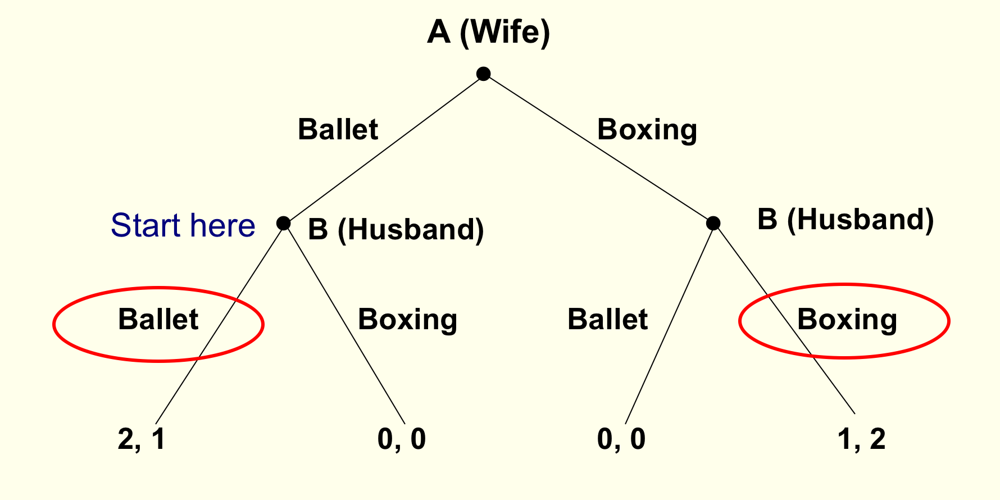

```{r somefunctions, echo=FALSE, results='hide'}

#possibly move these to a separate file

#multi-output text color
#https://dr-harper.github.io/rmarkdown-cookbook/changing-font-colour.html#multi-output-text-colour
#We can then use the code as an inline R expression format_with_col("my text", "red")

format_with_col = function(x, color){
  if(knitr::is_latex_output())
    paste("\\textcolor{",color,"}{",x,"}",sep="")
  else if(knitr::is_html_output())
    paste("<font color='",color,"'>",x,"</font>",sep="")
  else
    x
}
```

# Game Theory
## Game Theory - coverage

NS: chapter 5 (nearly all of it, see web book)


- `r format_with_col("Additional to text: Dominance, rationalizability","gray")`

- Experimental evidence (and evidence from the real world); supplemental readings


... Problem set coming, heavy coverage of game theory!


----

*Module context*

1. Basic tools, the economic approach

2. The simple classical model, welfare results


. . .


3. Market failures (Monopoly, Public Goods)


. . .


4. Extensions of simple model: 'Die roll' Uncertainty


$\rightarrow$  and now *Strategic* uncertainty $\rightarrow$ **Game Theory**

<aside class="notes">Finally, behavioural economics</aside>


----

**Today:**

1. How economists consider strategic interaction. What's game theory and who cares?

<br> \bigskip

2.  How to illustrate games; 'Notation \& grammar'

. . .


<br> \bigskip

3. `r format_with_col("Prisoners' Dilemma","purple")` example

<br> \bigskip


. . .


4. Some key concepts, predictions:  Common Knowledge, Dominant/dominated strategies, ISD/Rationalisability...


*Please have Turningpoint/Responseware available over next lectures*

----


## Basic concepts (strategic interaction, elements of a game)

`r format_with_col("Previously","brown")`: Each individual (consumer, firm... ) takes others' choices as *given*

- market price, demand curve, etc.


. . .


\

`r format_with_col("Now:","brown")` Consider *strategic interaction*


. . .


My best choice may *depend* on your choice,  \& vice versa


. . .

\


- Sequential games: My earlier choices may change your later choices

----

**One minute exercise**

<br> \bigskip

*Find a situation*---in business, government, fiction, history or your own life---

... where one party's optimal choice depends on what *another* party does.


. . .


<br> \bigskip

*Write it down*, `r format_with_col("give 1-sentence explanation of why it involves 'strategic dependence'","gray")`


----

**Some possible examples:**


- Ask out your crush or not?


. . .


- Country makes war or peace? Soldiers fight or run away?

\

- Run for office or not? Party contests a seat? If so, how much to spend on campaign?


. . .


\

- Amount to bid at a first-price auction?

- Whether Robotic Chef opens a new branch in Exeter, and where?

- How hard to work towards a promotion at your job?


<aside class="notes">Very interesting problems, does Econ have the solution?

 You know I am careful and not one to oversell things</aside>

----


##Some examples


`r format_with_col("Is it better to get lunch at Comida or Pret?","blue")`


<br> \bigskip


What if your friends are going to Comida?


<br> \bigskip


What if everyone and her cousin are going to Comida, so the queue is miles long?


----

```{r  fig.cap = '', out.width='90%', fig.asp=.4, fig.align='center',  echo = FALSE}
 knitr::include_graphics("picsfigs/iphonex.jpg")
```

`r format_with_col("What should Tim Cook charge for his new Iphone?","blue")`


<!-- \pause -->

<br> \bigskip


Does it depend on whether Samsung and LG...


... Sell their phones for £200, or £1000, or go out of business?


----


### What game theory can do (wet blanket)


```{r  fig.cap = '', out.width='30%', fig.asp=.4, fig.align='center',  echo = FALSE}
 knitr::include_graphics("picsfigs/Eeyore_Pink.jpg")
```

A language \& framework for analyzing strategic situations


. . .

\

- *Solution concepts* make predictions under given assumptions


- *Equilibrium* defined as a baseline


<aside class="notes">   David: Overrated as a tool to predict how people/firms will  behave; see notes

<small>
Often makes multiple predictions, or predicts 'mixed strategies' (randomisation).

Real-world \& experimental choices often predicted poorly by classical GT.

E.g., stdd game theory says chess is boring, has a pre-determined outcome.

Adv: But note complicating issues make it difficult to asses predictions of GT

...  monetary payoff may not be the same as utility payoffs; makes prediction unclear

Esp. with social/fairness preferences or fairness preferences.

We also see failures to coordinate, failure to take higher-order cognitive steps

And preferences over the *manner decisions are made*.
</small>
</aside>


#  Four elements describe a game

##  Four elements describe a game

1. Players

2. Strategies

3. Payoffs

4. Information


----


```{r  fig.cap = '', out.width='50%', fig.asp=.4, fig.align='center',  echo = FALSE}
 knitr::include_graphics("picsfigs/chicken.png")
```

----


<iframe width="800" height="600" src="https://www.youtube.com/embed/u7hZ9jKrwvo" frameborder="0" allow="accelerometer; autoplay; encrypted-media; gyroscope; picture-in-picture" allowfullscreen></iframe>

----


**Players**

:     the decision makers `r format_with_col("in the game","gray")`

\


. . .


$2, 3, . . . ,  N$ players


\

`r format_with_col("Who are the players in the game 'Chicken?'","blue")`


<aside class="notes"> The north-facing car 'North' and the south-facing car 'South'</aside>


----

Strategies
:      a player's choices  `r format_with_col("at each 'decision node' of the game","gray")`


. . .


Simple games: same as actions


<aside class="notes">More complex games: 'plan *contingent on* what other player did', and/or may involve randomisation

\
Strategies/actions in Chicken? For both N and S, two actions -- Pull-off, Straight.
</aside>

----

Payoffs

:     Each player's *utility* from the combination of each player's strategies (and chance) `r format_with_col("in the game","gray")`


. . .


- May include 'money earned' + other considerations; all summarised in the payoff numbers

- Each player's goal: maximise her payoff `r format_with_col("(not just to 'win')","gray")`

<aside class="notes">E.g., each player prefers to get 2 in *utility* and have the other player get 8 than for both to get 1.

Don't complain 'I don't think players will max payoffs, bc they also care about how others do, etc.'

Whatever it is they care about can be expressed in the theoretical payoffs.

<small> However, these concerns are relevant to experiments that may incorrectly assume participants are maximising only their monetary payoffs.

Adv: There are also certain kinds of 'psychological' motivations that cannot be modeled in a straightforward way by payoffs. (see 'psychological games').</small> </aside>

----

```{r  fig.cap = '', out.width='30%', fig.asp=.4, fig.align='center',  echo = FALSE}

 knitr::include_graphics("picsfigs/chicken-gamecrash.jpg")

```

<center> Payoffs in chicken? </center>


. . .


- Both pull-off $\rightarrow$  Tie


. . .


- N Straight, S pulls off $\rightarrow$ N 'wins', S 'loses'

- N pulls off, S straight $\rightarrow$ N 'loses', S 'wins'


. . .


- Both straight $\rightarrow$ crash


. . .


*To convey this game* payoffs must follow: Win $\succ$ tie  $\succ$ lose $\succ$ crash

----


Example of payoffs in Chicken (as matrix)

```{r  fig.cap = '', out.width='70%', fig.asp=.4, fig.align='center',  echo = FALSE}
 knitr::include_graphics("picsfigs/chicken-matrix.png")
```


----

Information

:     what each player knows, at a particular point in the game, about payoffs and previous actions


. . .


For *sequential* games, players may or may not know other players' previous actions

<aside class="notes">But for this module we will have complete and perfect information in all such games</aside>


----

`r format_with_col(" Consider... for the game you imagined earlier...","blue")`


<br> \bigskip

- Who are the *players*

- What are the actions/strategies

- What are the payoffs?

- Is it simultaneous or sequential?

<aside class="notes"> What information does each player have when making her decision? </aside>

# Illustrating Games


## The Prisoners' dilemma


```{r  fig.cap = '', out.width='100%', fig.asp=.4, fig.align='center',  echo = FALSE}
 knitr::include_graphics("picsfigs/pd-movies.png")
```


<aside class="notes"><small>Two individuals are arrested for a crime. They don't care about each other.
They both know that they can only be convicted for a lesser crime, for which they get 2 years in jail.
Chief Crown Prosecutor puts them in separate rooms and offers each the same deal.
If you confess and your partner stays quiet you will only get 1 year in jail and he will get 10 years.
If you both confess you will each get 3 years.
</small>

</aside>


----

### The Prisoners' Dilemma: Normal form


```{r  fig.cap = '', out.width='80%', fig.asp=.4, fig.align='center',  echo = FALSE}
 knitr::include_graphics("picsfigs/pd_normal.png")
```

`r format_with_col("Vote:","blue")` A - confess, B - Silent

<aside class="notes">Normal-form payoff matrix (also called 'matrix form')

 Payoff convention: (row, column)</aside>


----

```{r  fig.cap = '', out.width='50%', fig.asp=.4, fig.align='center',  echo = FALSE}
 knitr::include_graphics("picsfigs/pd_normal.png")
```

`r format_with_col("Vote:","blue")` A - confess, B - Silent

Q1: What would you do?


. . .


Q2: What do you think game theory predicts people will do?

<aside class="notes">What do you think most people would do?</aside>

----


```{r  fig.cap = '', out.width='30%', fig.asp=.4, fig.align='center',  echo = FALSE}
 knitr::include_graphics("picsfigs/pd_normal.png")
```


`r format_with_col("Q4:","blue")` Which *outcome* is *definitely NOT* Pareto-optimal (for the prisoners)?

\

- A. Both players confess \

- B. Both players are silent \

- C. A confesses and B is silent \

- D. B confesses and A is silent \

- E. All outcomes may be Pareto-optimal

 <aside class="notes">
 REMEMBER to mention the payoff convention ... row's payoff first
	</aside>

----

**A Prisoner's Dilemma be like**


<br> \bigskip

Two Players: (A and B, row and column, whatever)

\


Strategies (Actions): 'Cooperate' `r format_with_col("with other prisoner","gray")` (C) or defect (D) `r format_with_col("and confess","gray")`

\


. . .


In normal form:


```{r  fig.cap = '', out.width='40%', fig.asp=.4, fig.align='center',  echo = FALSE}
 knitr::include_graphics("picsfigs/normal_pd_general.png")
```


<aside class="notes">Note 'cooperate' is like 'silent' and 'defect' is like 'confess',
 and we switched the ordering of this in the matrix; none of this matters, so get used to seeing it with either ordering</aside>


----


In normal form:


```{r  fig.cap = '', out.width='70%', fig.asp=.4, fig.align='center',  echo = FALSE}
 knitr::include_graphics("picsfigs/normal_pd_general.png")
```

. . .

\


To be a prisoner's dilemma, payoffs must satisfy $T > R > P > S$


- Temptation $>$ Reward $>$ Punishment $>$ Sucker


<!--
**(Another) playable example**

\begin{center}
\begin{tabular}{llcc}
                              & \multicolumn{3}{l}{Player 2}                                                                  \\ \cline{2-4}
\multicolumn{1}{l|}{}         & \multicolumn{1}{l|}{}          & \multicolumn{1}{l|}{Cooperate} & \multicolumn{1}{l|}{Defect} \\ \cline{2-4}
\multicolumn{1}{l|}{Player 1} & \multicolumn{1}{l|}{Cooperate} & \multicolumn{1}{c|}{2,2}       & \multicolumn{1}{c|}{0,3}    \\ \cline{2-4}
\multicolumn{1}{l|}{}         & \multicolumn{1}{l|}{Defect}    & \multicolumn{1}{c|}{3,0}       & \multicolumn{1}{c|}{1,1}    \\ \cline{2-4}
\end{tabular}
\end{center}
-->


----


```{r  fig.cap = '', out.height='50%', fig.asp=.4, fig.align='center',  echo = FALSE}
 knitr::include_graphics("picsfigs/PD_japan.png")
```

<aside class="notes">Read PD in Extensive form; we'll come back to this later</aside>


----

**Common knowledge**

- What all players know, and

. . .

- all players know that all other players know,

. . .

- and all players know that all other players know that all other players know,

. . .

- and all players know that all other players know that all other players know that all other players know,

. . .

- and all players know that all other players know that all other players know that all other players know that all other players know,

. . .

- and all players know that all other players know that all other players know that all other players know that all other players know that all other players know,

----

- and all players know that all other players know that all other players know that all other players know that all other players know that all other players know that all other players know,

. . .


- and all players know that all other players know that all other players know that all other players know that all other players know that all other players know that all other players know that all other players know,

. . .

- and all players know that all other players know that all other players know that all other players know that all other players know that all other players know that all other players know that all other players know that all other players know,

. . .

- and all players know that all other players know that all other players know that all other players know that all other players know that all other players know that all other players know that all other players know that all other players know that all other players know,

. . .

- etc.


<aside class="notes">By the way, we always assume that the rules of the game are common knowledge.</aside>


----

**Why is common knowledge important?**


. . .


You may be stuck on an island with 100 blue-eyed people and  900 brown-eyed people

`r format_with_col("(Links to video and cartoon versions in handout)","gray")`

<!---
[XKCD_link](https://xkcd.com/blue_eyes.html "puzzle"), [XKCD solution link](https://xkcd.com/solution.html "solution" ,  [Rob Heaton version, more violent](http://robertheaton.com/2014/01/06/how-to-win-at-dinner-party-the-blue-eyed-islanders/ "puzzle and solution"),  [Ted-ed video](http://ed.ted.com/lessons/the-famously-difficult-green-eyed-logic-puzzle-alex-gendler)
-->

- `r format_with_col("Warning:","red")` puzzle will do your head in

```{r  fig.cap = '', out.width='50%', fig.asp=.4, fig.align='center',  echo = FALSE}
 knitr::include_graphics("picsfigs/blue-eyed.png")
```

----

Island with 1000 people. 100 w/ blue eyes, 900 brown eyes. No reflective surfaces.


. . .


By strict custom: \textrm{He who knows own eye colour must commit suicide the next day in the town square, and no one can discuss another's eye colour.}


. . .


`r format_with_col("American tourist says","red")` 'It's so nice to see one or more people with blue eyes in this part of the world'.


. . .


<br> \bigskip

`r format_with_col("Q: What effect, if any, does this faux pas have on the island?","blue")`


. . .


*GT predicts:* Statement made **common knowledge** $\rightarrow$ all 100 blue-eyed suicides 100 days later

<aside class="notes">SKIP if time is short</aside>


----

A's *Best Response* (BR) to strategy *S*:

:     a strategy for player A that gives him the highest payoff of all his possible strategies, given that the other player(s) play *S*

<aside class="notes">The BR is a function of the others' strategies *S*; it may take a different value for each strategy the others play.</aside>

# Dominant, dominated strategies and rationalizability

Dominant strategy
:     A single strategy that is a best response to *any* of the other player's strategies.

<small> Simple prediction: a 'rational' player will play a dominant strategy if she has one. </small>


. . .

\


Dominated strategy
:     Strategy A is dominated by strategy B if B yields higher payoffs for *any* of the other player's strategies

<small> A simple prediction: a rational player will *never* play a dominated strategy </small>

<aside class="notes">Dominated strategy, ISD  not in text!</aside>

----

Prediction of 'players play **dominant** strategies'

<br> \bigskip
`r format_with_col("...in Prisoner's dilemma?","blue")`

```{r  fig.cap = '', out.width='60%', fig.asp=.4, fig.align='center',  echo = FALSE}
 knitr::include_graphics("picsfigs/pd_normal.png")
```

. . .


*But in other cases, this may have no clear prediction*

----

```{r  fig.cap = '', out.height='90%', fig.asp=.4, fig.align='center',  echo = FALSE}
 knitr::include_graphics("picsfigs/matrixforISD.png")
```

<aside class="notes">What does 'players play dominant strategies' predict above?

What about 'players never play dominated strategies'?</aside>

----


### Rationalisability/ Iterated strict dominance


Extending this ...


\

Rationality assumption: the players are rational


. . .

- We know rational players won't play dominated strategies


. . .


- The players *themselves* know this


----


*Common Knowledge of Rationality assumption:*

Players know all other players are rational. They know all players know all players are rational.  They know...  (all players know ... ad infinitum) ... all are rational.


. . .


<br> \bigskip


Thus they know other players will never play a dominated strategy, and eliminate these from consideration.


. . .


Thus they won't play a strategy if another strategy is always better against this reduced set of possibilities.

...Etc.


. . .


<br> \bigskip

... the process of '*Iterated Strict Dominance*' (ISD).
$\rightarrow$ Strategies that survive ISD: **'rationalizable'**

<aside class="notes">Adv: There are differences between 'rationalizable' and 'survives ISD' but for our purposes these are the same</aside>


----

ISD example; may yield a unique prediction


```{r  fig.cap = '', out.height='80%', fig.asp=.4, fig.align='center',  echo = FALSE}
 knitr::include_graphics("picsfigs/matrixforISD.png")
```

----


```{r  fig.cap = '', out.height='80%', fig.asp=.4, fig.align='center',  echo = FALSE}
 knitr::include_graphics("picsfigs/isd1.png")
```

----

```{r  fig.cap = '', out.height='80%', fig.asp=.4, fig.align='center',  echo = FALSE}
 knitr::include_graphics("picsfigs/isd2.png")
```


----

```{r  fig.cap = '', out.height='80%', fig.asp=.4, fig.align='center',  echo = FALSE}
 knitr::include_graphics("picsfigs/isd3.png")
```


----

But there may be *no* dominated strategies, or ISD may leave many possibilities

. . .


```{r  fig.cap = '', out.width='50%', fig.asp=.4, fig.align='center',  echo = FALSE}
 knitr::include_graphics("picsfigs/bossmall.png")
```

----

```{r  fig.cap = '', out.width='50%', fig.asp=.4, fig.align='center',  echo = FALSE}


 knitr::include_graphics("picsfigs/chicken-matrix.png")
```

----

### TIL

1. How economists consider strategic interaction


2. Basic notation \& grammar of game theory


. . .


<br> \bigskip

3.  What defines a "Prisoners' Dilemma"

<br> \bigskip


. . .

4.  Key concept: Common Knowledge

5.  Predictions:  Dominant/dominated strategies, ISD/Rationalisability


. . .


<!--
`r format_with_col("Next lecture: the famous '(Nash) Equilibrium'... definition, how to solve for these, what it means and should we expect 'Nash equilibrium play'?","gray")`
-->


# Second game theory chunk: coverage
## Second game theory chunk: coverage


```{r  fig.cap = '', out.width='50%', fig.asp=.4, fig.align='center',  echo = FALSE}
 knitr::include_graphics("picsfigs/john-nash-alicia.jpg")
```

1. Equilibrium and Nash Equilibrium: definition, finding NE in matrix games (some examples)


[comment]: <> (101BB)

\


2. Pure and Mixed strategies <small>(Mixed strategies: get the basic concept, no need to *compute* these)</small>


[comment]: <> (101EE)


----

...

3. Multiple equilibria and refinements

<br> \bigskip

4. Sequential Games (and extensive form)

<br> \bigskip


5. Repeated games: definite time horizon; indefinite/infinite

6. Repeated games:  indefinite/infinite


<br> \bigskip


6. Continuous Action games

7. Experimental evidence: What is a laboratory experiment in Economics?


----


# Equilibrium
## Equilibrium

`r format_with_col("Market equilibrium (recapping): given the equilibrium price & quantity, no market participant has an incentive to change her behaviour.","gray")`


. . .


<br> \bigskip

\

Similar concept for strategic settings:

Nash equilibrium (NE)
:     A set (i.e., 'profile') of *strategies*, one for each player, that are best responses against one another


----

Nash equilibrium (NE)
:     A set ('profile') of *strategies*, one for each player, that are best responses against one another


If I play my BR to your chosen strategy and you're playing your BR to mine, neither of us has an incentive to deviate --- an equilibrium.


. . .


All games have at least one Nash equilibrium

- But it may be an equilibrium in 'mixed strategies' (involving randomisation)


. . .


Caveat: we might not expect such play to actually occur (particularly not in one-shot games)


<aside class="notes">In fact, 2-player games will have an *odd* number of equilibria; you can see this by looking at the crosses of the BR functions</aside>

## Two ways to find the Nash equilibrium (NE)

```{r  fig.cap = '', out.width='80%', fig.asp=.4, fig.align='center',  echo = FALSE}
 knitr::include_graphics("picsfigs/pd_normal.png")
```

*First method: Inspection*

Check each outcome.


. . .

<br> \bigskip


Either player has incentive to *unilaterally* deviate?


. . .


<br> \bigskip

If not $\rightarrow$ it's (outcome of) a NE.


----


```{r  fig.cap = '', out.width='60%', fig.asp=.4, fig.align='center',  echo = FALSE}
 knitr::include_graphics("picsfigs/pd_normal.png")
```

*Second method to find NE --  Underlining*

. . .

<br> \bigskip

Underline payoffs for BR's of each player.


. . .

<br> \bigskip

Outcome with 2 underlines $\rightarrow$ `r format_with_col("outcome of","gray")` a NE (strat. profile).


<aside class="notes">Caveat: works in a game with a countable set of actions ... a 'matrix' game

If the actions are a continuous variable (e.g., price, quantity) you must solve for point(s) where these functions meet</aside>

----


Find equilibrium via each method:


```{r  fig.cap = '', out.width='90%', fig.asp=.4, fig.align='center',  echo = FALSE}
 knitr::include_graphics("picsfigs/pd_normal.png")
```


<aside class="notes">Note this is the same 'prediction' as dominant strategies, but the interpretations are different;

This is not by accident, there is a general result...</aside>

<aside class="notes">Recall again that the NE, and the prediction of 'players play dominant strategies' (also 'rationalisability')

yields the single outcome that is clearly NOT pareto optimal. Lesson  group and individual interests don't always align</aside>


## Relationship between dominant strategies, rationalisability, and Nash equilibrium

If eliminating dominated strategies yields a single prediction for each player, these form a NE (profile).


. . .

<br> \bigskip


Same for ISD (rationalizability) ...
if it leads to a unique prediction, it's a NE.


. . .


<br> \bigskip

HOWEVER: not every NE involves dominant strategies


<!---
## Efficiency and the PD
*Lesson: group and individual interests don't always align*
- If the players could communicate what would seem to be the best outcome?
. . .
- Both cooperating (silent) better for both than the outcome in NE: 2 yrs vs. 3 yrs (R vs P)
    - But binding agreements not allowed, and communication shouldn't help
-->


## Coordination and anti-coordination games

**In-class experiment: BOS & coordination; need 2 volunteers**

```{r  fig.cap = '', out.width='75%', fig.asp=.4, fig.align='center',  echo = FALSE}
 knitr::include_graphics("picsfigs/bos_inlecture_swan.png")
```

<aside class="notes">LC: One is assigned the Kangaroo role, the other the Swan role. Each to write down their move in private.

Rest of students to consider how they would play, and what they expect each to do.

 Instructor opens papers and pays each their assigned amount.</aside>

### Coordination: Battle of the sexes (BOS)

```{r  fig.cap = '', out.height='80%', fig.asp=.4, fig.align='center',  echo = FALSE}
 knitr::include_graphics("picsfigs/bosmatrix.png")
```


<aside class="notes">to make it more PC, assume it is a very violent ballet and a very gentle boxing match</aside>

<aside class="notes">LC: Underline best responses, find pure strategy NE here</aside>

----


### Anti-coordination: Matching pennies (odds/evens)

```{r  fig.cap = '', out.width='90%', fig.asp=.4, fig.align='center',  echo = FALSE}
 knitr::include_graphics("picsfigs/matchpennies.png")
```

  
<aside class="notes">LC: Underline best responses, show no pure strategy NE here</aside>


# Mixed strategies
## Mixed strategies


Pure strategy
:     Consists of a single action played with certainty

. . .

Mixed strategy
:     Assigns a probability to each possible action

. . .

*Remember: there is always at least one NE. If there is no pure strategy NE, there will be a NE in mixed strategies.*

----

### Matching pennies: mixed strategies

**Intuition**

- If you choose heads/tails half the time then I'm indifferent between heads or tails
    - choosing heads half the time is *among* my best responses

. . .


- If I choose heads half the time then you're indifferent between heads/tails
    - choosing heads half the time is *among* your best responses


. . .


- So, technically, each of us choosing heads half the time is a NE

<aside class="notes">But it is called a 'weak' NE because either of us would do no *worse* if he deviated alone
</aside>


----

### Battle of sexes: mixed strategies


```{r  fig.cap = '', out.width='75%', fig.asp=.4, fig.align='center',  echo = FALSE}
 knitr::include_graphics("picsfigs/bosmatrix.png")
```

<aside class="notes">Wife wants to end up at the same place as her husband but doesn't know where he is going.

- If she believes that he will always go to the ballet she should always go to the ballet.

- If she believes he will always go boxing, she should go boxing.

- What other beliefs may she have?
</aside>


Want to derive the best response functions, find intersections.


. . .


Let $h$: probability husband chooses Ballet, $w$: probability wife chooses Ballet


[comment]: <> (101BB)

----

```{r  fig.cap = '', out.width='50%', fig.asp=.4, fig.align='center',  echo = FALSE}
 knitr::include_graphics("picsfigs/bosmatrix.png")
```

**Wife's BR:**

- Wife chooses Ballet iff her Expected payoff of Ballet > Expected payoff of Boxing

. . .


I.e., $2h > 1- h$, i.e, $h > 1/3$

- Thus, wife goes Ballet if she believes husband goes Ballet more than 1/3 of the time
    - If she thinks he goes below 1/3 of the time she goes Boxing
    - If she thinks he goes *exactly* 1/3 of the time she is indifferent


----

```{r  fig.cap = '', out.height='5in', fig.asp=.4, fig.align='center',  echo = FALSE}
 knitr::include_graphics("bosbr1.png")
```

<aside class="notes">This plots the value of w that best responds to h;

 the probability the wife goes Ballet given the probability the husband goes Boxing.</aside>

----

Let w: probability wife chooses Ballet

**Husband's BR:**


. . .


Husband chooses Ballet iff his Expected payoff of Ballet > Expected payoff of Boxing

<br> \bigskip

$1w > 2- 2w$

$\rightarrow w > 2/3$


. . .


Thus, husband goes ballet if he believes wife goes Ballet more than 2/3 of the time

- If he thinks she goes less than 2/3 of the time he goes Boxing

- If she thinks he goes *exactly* 2/3 of the time he is indifferent


----

```{r  fig.cap = '', out.height='5in', fig.asp=.4, fig.align='center',  echo = FALSE}
 knitr::include_graphics("picsfigs/bosbr2.png")
```

----


```{r  fig.cap = '', out.height='80%S', fig.asp=.4, fig.align='center',  echo = FALSE}
 knitr::include_graphics("picsfigs/bosbr3.png")
```

----

Shortcut:  only someone who is indifferent will randomise...

Wife goes Ballet if thinks husband goes Ballet $>$ 1/3 of time

<small> If she thinks he goes below 1/3 of the time she goes Boxing</small>


----

### What's all this rot?


. . .


Mixed strategies are not about 'being unpredictable'; these are one shot games

<aside class="notes">
Adv: Some texts and authors make this point about 'unpredictability' but others disagree (including myself).
Making sure that it is impossible to predict your later play from your previous is only important if you are playing the same game repeatedly, and being observed.
</aside>

. . .


It makes a bit more sense if we think about 'populations'

. . .


- Suppose in a population 1/3 of men go to Ballet and 2/3 of women go to Ballet:
- ... these ratios are 'stable'; no reason for systematic changes.


. . .


- On the other hand, if men always went to boxing and women to ballet this is not stable
- A husband would be better off going to ballet ... so the ratios should change over time.


----

###Computing payoffs with mixing

Formally NE specifies *strategies* (strategy 'profiles') not payoffs

\


. . .


\


In the BOS the pure strategy equilibria were

- i. Husband: Boxing, Wife: Boxing
- ii. Husband: Ballet, Wife: Ballet

. . .

\


The mixed-strategy NE was:

- iii. Husband: go Ballet with probability h=1/3, Wife: Go Ballet with prob w=2/3.


. . .

\


The *payoffs* to these were, respectively

- i. Husband: 2, Wife: 1
- ii. Husband: 1, Wife: 2
- iii. ...

----

Payoff to the mixed strategy: simple EU computations, see handout (work on your own)

<!---
- Payoffs are utilities, sum utility of each outcome $\times$ probability of that outcome
    - Prob(Both go Ballet) = $w \times h = \frac{2}{3} \times \frac{1}{3} = \frac{2}{9}$
    - Prob(Both go Boxing) = $(1-w)(1-h) = \frac{1}{3} \times \frac{2}{3} = \frac{2}{9}$
    - Prob(Wife Ballet, Husband Boxing) = $w(1-h) = \frac{2}{3} \times \frac{2}{3} = \frac{4}{9}$
    - Prob(Wife Boxing, Husband Ballet) = $(1-w)(h) = \frac{1}{3} \times \frac{1}{3} = \frac{1}{9}$
    -->


<!---
Thus, under the mixed strategy NE play:
$$U_{husb} =  \frac{2}{9} \times 1 +  \frac{2}{9} \times 2 +  \frac{4}{9} \times 0 + \frac{1}{9} \times 0 = \frac{6}{9} = \frac{2}{3}$$
$$U_{wife} = \frac{2}{3}$$
<br> \bigskip
`r format_with_col("Wife's payoff inferred from symmetry of problem or similarly calculated","gray")`
-->

It turns out:

$$U_{husb} =  \frac{2}{9} \times 1 +  \frac{2}{9} \times 2 +  \frac{4}{9} \times 0 + \frac{1}{9} \times 0 = \frac{6}{9} = \frac{2}{3}$$

and same for the Wife's payoffs.


----

```{r  fig.cap = '', out.height='5in', fig.asp=.4, fig.align='center',  echo = FALSE}
 knitr::include_graphics("bosbr3.png")
```

Three equilibria: both Boxing, both  Ballet,  mixed strategy;  are any more reasonable as predicted outcomes?


----

### How do you solve a problem like multiple-equilibria? (WIP)


[LINK](https://youtu.be/OvsNgQS_Qa8?t=40)

There's always one or more they say but sometimes it is mixed \
you find one where the best responses meet at some point fixed \
you only know you won't regret the strategies it 'picksed' \
I hear that it's prediction power is shabby

\

It might not yield the best outcome and might not yield the worst \
In prisoner's dillemas a confession is coerced, \
I hate to have to say it, but I very firmly feel Nash Equilibrium's not an asset to the abbey \

I have to say a word on its behalf: multiple-equilibria make me laugh

## So,

How do you solve a problem like multiple-equilibria?

- How do you catch a cloud and pin it down?
    - How do choose among the multiple-equilibria?
    - A flibbertjibbet! A will-o'-the wisp! A clown!


Many a thing you'd like old Nash to tell you \
Many a thing you thought you'd understand \
But how do you find a way to predict equilibrium play? \
How do you keep a wave upon the sand?

Oh, how do you solve a problem like multiple-equilibria? \
*How do you hold a moonbeam in your hand?*


----

### In-class experiment: BOS & coordination; need 2 volunteers

```{r  fig.cap = '', out.height='4in', fig.asp=.4, fig.align='center',  echo = FALSE}
 knitr::include_graphics("picsfigs/BOS_inlecture.png")
```


<aside class="notes">LC: One is assigned the Husband role, the other the Wife role. Each to write down their move in private.

Rest of students to consider how they would play, and what they expect each to do.

 Instructor opens papers and pays each their assigned amount.</aside>


----


'The Big Game'


```{r  fig.cap = '', out.width='90%', fig.asp=.4, fig.align='center',  echo = FALSE}
 knitr::include_graphics("picsfigs/coordgame_inlecture_mod.png")
```

<aside class="notes">

LC: Get 2 more volunteers, same drill (row/column are the same, so it doesn't matter)

Rest of students choose 1-5 on clickers, no communication.

 Consider: assuming random matching, what would be the average and range of payoffs?

 </aside>

----

**A previous year's results (2016, with slightly different payoffs)**


|         | Share chose | .. squared | Pay if match | E(Pay) |
|:-------:|:-----------:|:----------:|:------------:|:------:|
|    1    |     0.26    |    .068    |       2      |  0.52  |
|    2    |     0.21    |    .044    |       2      |   .42  |
|    3    |     0.11    |    .012    |       1      |   .11  |
|    4    |     0.16    |    .026    |       2      |   .32  |
|    5    |     0.26    |    .068    |       2      |   .52  |
| Wtd avg |     0.22    |    0.05    |              |  0.42  |


# Multiple equilibrium and refinements

## Multiple equilibrium and refinements

We refer to *refinement criteria* and *focal points*

- Equilibrium with the highest payoffs for both?
    - In BOS this rules out mixing (payoffs 2/3, 2/3 for h,w respectively)
    - But doesn't say whether it's Box, Box (payoffs 2,1) or Ballet, Ballet (payoffs 1,2)

. . .


- Choose the 'symmetric equilibrium?' ... here, mixing


. . .


- Choose the one that seems like a 'focal point'? (rem, the 'big game')


----


### Is there a focal point?

A year after graduating you come back for Alumni Weekend.  You are supposed to meet the veterans of this module for a night of festivities but can't remember where or when.

. . .


The internet does not exist.


. . .


Where do you go? Write it down on a piece of paper


. . .


- Now type what you wrote in to the chat window


----

What if you are meeting for a reunion in London, and no one has internet or phone access?

- Where do you go?

- Write it down

. . .


- Type it into the chat window.

----

*Refinements are real-*

. . .

\

*(ly) important to some academic referees:*

```{r  fig.cap = '', out.width='90%', fig.asp=.4, fig.align='center',  echo = FALSE}
 knitr::include_graphics("picfigs/ref_refinement.png")
```


----

```{r  fig.cap = '', out.width='90%', fig.asp=.4, fig.align='center',  echo = FALSE}
 knitr::include_graphics("picsfigs/staghunt.png")
```

<aside class="notes"> Stag,Stag and Hare,Hare are NE;
the former is 'payoff-dominant' but the latter is 'risk-dominant'
</aside>


# Sequential Games (and extensive form)
## Sequential Games (and extensive form)

<aside class="notes">Note: don't worry about the 'normal form' of sequential games;
we will only use the extensive form for these
LC: describe this notation again: decision nodes, etc
</aside>

<small>Consider Battle of Sexes, but now Wife chooses first, Husband observes this and then chooses.
What do you think will happen? Vote:</small>

<small>A. Wife: Ballet, Husband: Box</small>


<small>B. Wife: Ballet, Husband: Ballet</small>

<small>C. Wife: Box, Husband: Ballet</small>

<small>D. Wife: Box, Husband: Box</small>


```{r  fig.cap = '', out.width='50%', fig.asp=.4, fig.align='center',  echo = FALSE}
 knitr::include_graphics("picsfigs/BOS_sequential.png")
```

<aside class="notes">
Remember, it's a one-shot game ... unrealistic within a marriage of course
</aside>


----

```{r  fig.cap = '', out.width='80%', fig.asp=.4, fig.align='center',  echo = FALSE}
 knitr::include_graphics("picsfigs/BOS_sequential.png")
```

- The wife has two strategies: Ballet or Boxing

. . .


- The husband has four contingent strategies, but we focus on what he will do in each of his two possible 'decision nodes'

<aside class="notes">
Here we see there is a 'first-mover advantage'.

We see a very similar strategic advantage in other contexts, including 'which firm enters a market first'
</aside>

----


```{r  fig.cap = '', out.width='50%', fig.asp=.4, fig.align='center',  echo = FALSE}
 knitr::include_graphics("picsfigs/BOS_sequential.png")
```

Proper subgame
:     Part of the game tree including an initial decision not connected to another (oval or dashed lines) and everything branching out below it.

- I.e., each 'game' starting from a point where a player knows where she is (knows previous choices)

<aside class="notes">SPNE via backwards induction -- essentially requires that each player would act optimally at each of these points</aside>

----

Subgame-Perfect Nash Equilibrium (SPNE)
:     Strategies that form a Nash equilibrium on every proper subgame.

. . .


You can solve for this with 'backwards induction' (BWI)

. . .


- Solve for best move for last decision node (proper subgame)
    - Given these, solve for best response for previous decision node
    - Etc.

- State the *complete contingent strategies* suggested by this

<aside class="notes">
Technically, the strategies where the 'continuation strategies' form a NE...
</aside>


----


Example: BWI for BOS


```{r  fig.cap = '', out.width='50%', fig.asp=.4, fig.align='center',  echo = FALSE}
 
```

. . .


```{r  fig.cap = '', out.width='50%', fig.asp=.4, fig.align='center',  echo = FALSE}
 knitr::include_graphics("picsfigs/bosbwi2.png")
```


<aside class="notes">Note that the SPNE in a sequential game basically always involves 'best responses'.

  I think this makes SPNE more credible as a prediction in sequential games than NE in simultaneous games.
  </aside>


----

```{r  fig.cap = '', out.height='1in', fig.asp=.4, fig.align='center',  echo = FALSE}
 
```

*Formally specify (SP)NE strategies for above game:*

a NE, not SP: \{Wife: Boxing; Husband: Boxing, Boxing\}

SPNE:  \{Wife: Ballet; Husband: Ballet, Boxing\}


*(reading Husband's decision nodes left to right; please specify this)*


----

**It can get fancier**

```{r  fig.cap = '', out.width='90%', fig.asp=.4, fig.align='center',  echo = FALSE}
 knitr::include_graphics("picsfigs/longgamework_randompayoffs_noul.png")
```

----

```{r  fig.cap = '', out.width='90%', fig.asp=.4, fig.align='center',  echo = FALSE}
 knitr::include_graphics("picsfigs/longgamework_randompayoffs_ul.png")
```

----

In 'normal' (matrix form), stating complete contingent strategies:

```{r  fig.cap = '', out.width='80%', fig.asp=.4, fig.align='center',  echo = FALSE}
 knitr::include_graphics("picsfigs/longgame_matrix_full.png")
```

----


```{r  fig.cap = '', out.width='90%', fig.asp=.4, fig.align='center',  echo = FALSE}
 knitr::include_graphics("picsfigs/longgame_matrix_abbrev.png")
```


----

```{r  fig.cap = '', out.width='50%', fig.asp=.4, fig.align='center',  echo = FALSE}
 knitr::include_graphics("picsfigs/longgamework_randompayoffs_ul.png")
```

The SPNE; 'state the complete contingent strategies'

A: S1, N3, N5

B: s2, n4, n6

<aside class="notes">
Where actions are stated in the order of the decision nodes for each player
</aside>

# Repeated games: definite time horizon
## Repeated games: definite time horizon


A 'stage game' is a simple (matrix) game that may be played repeatedly


. . .


- Definite horizon: play stage game a *known* and finite number of times

`r format_with_col("Note:","red")` In repeated (as in sequential) games, a strategy is a 'complete contingent plan'; specifies what the player will choose at *every* decision node

## A general rule for (finitely) repeated games


Whenever the stage-game is repeated, repeated play of the stage-game equilibrium is an equilibrium of this repeated game


. . .


- In a *finitely-repeated* Prisoner's dilemma this is the *only* equilibrium

<aside class="notes">This is the case for any stage game with only a single equilibrium

 For games with multiple stage-game equilibria there may be repeated game equilibria involving different play in some stages; not discussed here.</aside>

----


```{r  fig.cap = '', out.width='70%', fig.asp=.4, fig.align='center',  echo = FALSE}
 knitr::include_graphics("pd_normal.png")
```

Is there a way in which we can sustain cooperation in a finitely repeated Prisoners' Dilemma?


. . .


<br> \bigskip


No.

<aside class="notes">PUT THE PAYOFFS on the board</aside>


----

Suppose we repeat the Prisoners' Dilemma a finite (T) number of times, e.g., 10 times.

. . .


What is the subgame perfect equilibrium?


. . .


\


**Backwards induction:**

- In period 10 (period T) both confess as it's the dominant strategy

. . .


- In period 9 (period T-1)
    - Knowing period 10 (period T) decision is unaffected by earlier moves, players confess in period 9 (their dominant strategy)


. . .


- ... etc, all the way back to period 1


. . .


Thus each Confesses in every period $\rightarrow$ Can't sustain cooperation.


# Repeated Games: Indefinite or infinite time horizon (mathematically equivalent)

- Game played repeatedly for potentially infinite number of periods


. . .


- But there is a 'discount factor' $g$


. . .


- $g$ may instead represent 'probability the game is repeated another time'

<aside class="notes">With an infinitely-repeated game with no discounting, payoffs would be potentially infinite, making it hard to decipher.

 It's realistic to imagine people discount the future, and we don't know how long these repeated interactions last; people die, move away, etc.</aside>

----

### Trigger strategies

Trigger strategy
:     Strategy in a repeated game where one player stops cooperating in order to punish another player for not cooperating.


. . .


<br> \bigskip


Grim trigger strategy
:     If other player fails to cooperate in one period, play the (undominated) strategy that makes the other player worst off in all later periods

----


**Indefinitely repeated Prisoners' Dilemma**

Consider the following trigger strategy (for both players):

- Stay silent as long as the other player stays silent.
- If one player confesses, both players will confess from them on.


. . .


Is this a SPNE?


. . .


- In each subgame after someone confesses, we play confess in all stage games (forever on), which we know is a NE

. . .


- What about periods where no one has confessed (yet)?

<aside class="notes">How do we know both players playing 'confess forever' is a SPNE?

Starting in any subgame,  knowing the other player will confess, I will want to confess (for that period's payoffs).

I also know that given his strategy, playing 'silent' in  this period will not have any impact on my later payoffs.</aside>


<aside class="notes">Know the principle as well as  the computation if possible.

 **geometric discounting** is super-relevant for finance and cost-benefit analysis

and it also will come up in behavioral economics.</aside>


----


The payoff from staying Silent (cooperating) each period is:

$$-2 \times (1 + g + g^2 + g^3 + . . . )$$

. . .


The payoff from Confessing right away (after which both players Confess always) is:

$$ -1 + -3 \times (g + g^2 + g^3 + . . . ) $$

. . .

Formula for a geometric series (where $0<g<1$): $g + g^2 +  g^3 + g^4 ... = g/(1-g)$


<aside class="notes">Maths: The standard derivation of this, which is pretty neat, is in the NS text.

This formula is an important one in economics (and beyond),

 particularly for discounting a constant stream of payoffs, e.g., stock dividends</aside>

----

Thus cooperation in a single period is 'weakly preferred' (at least as good) if


$$(-2) \times (1 + g + g^2 + g^3 + . . . ) \geq (-1) + -3 \times (g + g^2 + g^3 + . . .)$$

. . .

$$g + g^2 + g^3 + . . . \geq 1$$

<aside class="notes">Intuition for the second formula: left side is loss of future payoffs (-3 vs -2 forever from next period).

 Right side is gain in that period (get -1 rather than -2))</aside>

. . .

$$g/(1-g) \geq 1$$

. . .

$$g \geq \frac{1}{2}$$


. . .


$\rightarrow$  cooperation can be sustained if the 'probability of play continuing' (or 'patience')  is high enough; here, above 1/2.

<aside class="notes">Just because it can be sustained doesn't mean it will; there are other Subgame-Perfect Nash equilibria, including 'always confess'.</aside>

<aside class="notes">This setup is directly applied to the case of 'a cartel' of firms tacitly or overtly colluding to sustain high prices!</aside>

[comment]: <> (pre2018BB)

# Continuous Actions

GT for cases where people choose 'continuous' actions, e.g.:

. . .


- Firms choose product price or quantity, or a level of R&D, etc.

[comment]: <> (101BB)

E.g., $q_i \in [0,\infty]$ for $i=1,...n$ firms

[comment]: <> (101EE)


. . .


- Households voluntarily contribute to local public good (e.g., neighborhood watch)
     - or choose how many fish to catch from the shared pond


. . .


- Nations: How large an army to build

<aside class="notes">As you can see from mock exams etc., GT with continuous actions IS something I may test you on!</aside>


----

`r format_with_col("With continuous actions...","gray")`

<br> \bigskip

$\rightarrow$ Payoff functions, continuous 'best response functions'; rather than a payoff matrix

. . .


- Nash equilibrium: Again, choices that are best responses to one another


. . .


- Dominant strategies: Again, a strategy that is preferred against *any* other player(s)' strategies

<aside class="notes">Here the iterated dominance or 'rationalizability' is harder to compute; we won't cover this</aside>


----


Continuous games with differentiable payoffs, finding NE:

1. Write down payoff functions. (Differentiable?)

2. Max each player’s payoff wrt own strategy; other player's payoff as a 'parameter' $\rightarrow$ Players' best-response functions.

3. Look for intersection(s) $\rightarrow$ Nash equilibrium/equilibria

<aside class="notes">Source: https://www3.nd.edu/~tjohns20/gametheory_SP13/slides3.pdf</aside>

<br> \bigskip

<!-- \pause -->

[comment]: <> (101BB)

With two players:

$$s_i^\ast=B_i(B_-i(s_i^\ast))$$

[comment]: <> (101EE)

### Tragedy of the Commons

Shepherds A & B graze $s_A$ & $s_B$ sheep, respectively, in same meadow


. . .


More sheep graze $\rightarrow$ less grass for each $\rightarrow$ less wool/milk/meat per sheep


. . .


Benefit per sheep raised: $120-s_A-s_B$


. . .


<br> \bigskip


*Total* benefit from raising $s_A$ and $s_B$ sheep:

- Shepherd A: $s_A(120-s_A-s_B)$
- Shepherd B: $s_B(120-s_A-s_B)$

. . .


\


*Marginal* benefit of 'me adding' another sheep:

- Shepherd A: $120-2s_A-s_B$
- Shepherd B: $120-s_A-2s_B$


<aside class="notes">BEEM101: covered in tutorial</aside>


----

For simplicity, assume zero marginal cost

\

Set MB=MC (here MC=0)

- Shepherd A: $120-2s_A-s_B = 0$
- Shepherd B: $120-s_A-2s_B = 0$


. . .


<br> \bigskip


Rearrange above to solve for BRFs:

- Shepherd A:  $s_A = 60-\frac{1}{2} s_B$
- Shepherd B:  $s_B = 60-\frac{1}{2} s_A$

----

Solve for Nash equilibrium:


$$s_A = 60-\frac{1}{2} s_B$$


. . .


Plug this value of $s_A$ into the BRF for B, solve for $s_B$, then for $s_A$

$$s_B = 60-\frac{1}{2} s_A = 60 - \frac{1}{2}(60-\frac{1}{2} s_B)$$


. . .


$s_A* = s_B* = 40$


----

```{r  fig.cap = '', out.height='40%', fig.asp=.4, fig.align='center',  echo = FALSE}
 knitr::include_graphics("picsfigs/brsheep.png")
```

Shepherd A:  $s_A = 60-\frac{1}{2} s_B$

\

Shepherd B: $s_B = 60-\frac{1}{2} s_A$


. . .


\

$\rightarrow s_A* = s_B* = 40$


----

**Why the 'Tragedy' of the Commons?**


. . .


<small>Each grazes until his *private* marginal benefit equals his cost (0):</small>

- $120-2s_A-s_B = 0$


. . .


<small>Does not consider the harm he imposes on the other guy</small>


. . .


Above, $s_A* = s_B* = 40$. Each get payoff $40 \times (120 - 40 - 40) = 40 \times 40 = 1600$
 \

. . .

<small>To max *total* payoffs, set</small> $S=s_A+s_B$ <small> to max </small>
$$S\times(120-S)$$


. . .

<small>Concave problem, set first-derivative to zero:</small>
$$120 - 2S = 0 \rightarrow S^*=60$$


. . .

<small>Leading to total payoff $60 \times (120 - 60) = 3600$. If split evenly (each graze 30), get 1800 each.</small>


<aside class="notes">This is the 'continuous action' analogue of the Prisoner's dilemma</aside>


<aside class="notes">Both the PD and the above 'tragedy of the commons' game illustrate a similar point:

 Individuals acting in their own private interest may end up each doing worse off than if they could cooperate or collude.</aside>

----

**Sadly, this problem (literally!) is still relevant**


- See, e.g., ["Morocco: Managing the 'commons' Livestock and Pasture Development Project in the Eastern Region"](http://www.ifad.org/evaluation/public_html/eksyst/doc/profile/pn/morocco.htm)


```{r  fig.cap = '', out.width='70%', fig.asp=.4, fig.align='center',  echo = FALSE}
 knitr::include_graphics("picsfigs/moroccansheep.jpg")
```

----


... Continuous Action games

- `Comparative statics analysis': Allow us to see how the equilibrium shifts as we change one 'parameter'
    - E.g., increase A's benefit per sheep

<aside class="notes">See example in text</aside>

----


# Experimental evidence: What is a laboratory experiment in Economics?
## Experimental evidence: What is a laboratory experiment in Economics?

E.g., FEELE lab at Exeter

- Real incentives (typically small)
- Typically student subject pool
- No deception protocol

----

```{r  fig.cap = '', out.height='80%', fig.asp=.4, fig.align='center',  echo = FALSE}
 knitr::include_graphics("picsfigs/expeconlab.jpg")
```

----

```{r  fig.cap = '', out.height='80%', fig.asp=.4, fig.align='center',  echo = FALSE}
 knitr::include_graphics("picsfigs/ztreePD.png")
```

----

### Various experimental goals

- Measure preferences (risk, time, social preferences...)

. . .


- Asses theoretical predictions (classical and behavioural), including game theory
    - Also see 'likely' outcomes where theory has no prediction or predicts multiple equilibria
    - *Critical* to assert 'control' over payoffs for this

. . .


- Understand cognitive processes in economic realm


. . .


- 'Test' institutions and mechanisms (e.g., auctions, markets)

## Laboratory evidence 1: Prisoners' dilemmas

Cooper et al (1996)

<small>Cooperation even in anonymous '1-shot' games (different opponents each time)</small>


. . .


<small>Cooperation declines somewhat over time, but not to zero</small>

. . .


<small>Mix of other-regarding and selfish types</small>

<aside class="notes">Results are similar for experiments involving contributions to public goods.

-   some cooperation, declining over time but not to zero, and a mix of players who never contribute and many 'reciprocal' types. We may return to this later in the module.</aside>

```{r  fig.cap = '', out.width='50%', fig.asp=.4, fig.align='center',  echo = FALSE}
 knitr::include_graphics("picsfigs/cooperPD.png")
```

## Laboratory evidence 2: Ultimatum game

Proposer goes first, proposes split of the 'pie', anything between 0\%-100\% and 100\%-0\% inclusive.

<br> \bigskip


. . .


Responder can accept, or reject and get nothing

<aside class="notes">Q: What does SPNE predict (use backwards induction)?</aside>

<aside class="notes">Ans: It predicts the proposal offers the lowest (positive) amount and the responder accepts</aside>


. . .


What happens in experiments?


. . .


- Most common offer: 50-50 split
- Responders: Often reject offers of less than 30\% (even when it's a lot of money)


. . .


Potential explanations

- Fairness concerns; monetary payoffs may not be *actual* payoffs

. . .

- Proposers may anticipate this


## Issues in lab experiments

### What is being measured?

PD: Does money measure the true payoffs? Do we have the 'control' to test the model?

. . .


- Other-regarding preferences; may be unobservable.
- 'Experimenter demand': desire to please experimenter, aware of study goals?


## Issues in lab experiments: External generalisability

1. Relevance of subject-pool (participants)

- Do they resemble the 'real world' group of interest? (e.g., firms, countries, taxpayers, voters, home-buyers)

- Right preferences and experience?


. . .


2. Relevance of environment

- Are the (small) stakes relevant?

- Are the right 'environmental characteristics' present?


. . .


- Does the 'imposed model' apply?

- Observed self-conscious environment, perhaps made aware of contrasts

<aside class="notes">Adv: a recommended 'advanced' reading: 'Ten Little Treasures of Game Theory and Ten Intuitive Contradictions' Goeree and Holt, 2001</aside>


## Suggested practice problems: see VLE

<!---
from Nicholson and Snyder Chapter 5 (12th ed)
- 5.1, 5.5, 5.6, 5.7, 5.10
- Also see next slides
----
**Additional tutorial problem I (Game theory)**
```{r  fig.cap = '', out.width='90%', fig.asp=.4, fig.align='center',  echo = FALSE}
 knitr::include_graphics("picsfigs/teenchoices.png")
```
<small>Teens A and B are smitten with each other but neither knows of the other's feelings. Suppose the teachers at their school organize a dance.  The 'payoff' is based on whether their advances are rebuffed or accepted.  If they both Declare,  they get positive utility but if they are Rebuffed they face humiliation (significantly negative payoff).  Rebuffing an advance slightly elevates the teen's standing with peers.</small>

- What is a teen's dominant strategy, or is there no dominant strategy?
- Find the pure-strategy Nash equilibrium or equilibria
- Find the mixed strategy equilibrium
**Additional tutorial problem II (Game theory)**
```{r  fig.cap = '', out.width='90%', fig.asp=.4, fig.align='center',  echo = FALSE}
 knitr::include_graphics("picsfigs/isd4by3game.png")
```
- Apply 'Iterated strict dominance' to the above game, showing your steps
- State the pure strategies that are rationalizable.
** Additional tutorial problem III (Game theory)**
```{r  fig.cap = '', out.width='90%', fig.asp=.4, fig.align='center',  echo = FALSE}
 knitr::include_graphics("picsfigs/entrygame.png")
```
- Use backwards-induction to find the subgame-perfect Nash equilibrium strategies, outcomes, and payoffs, of the above game.
-->


