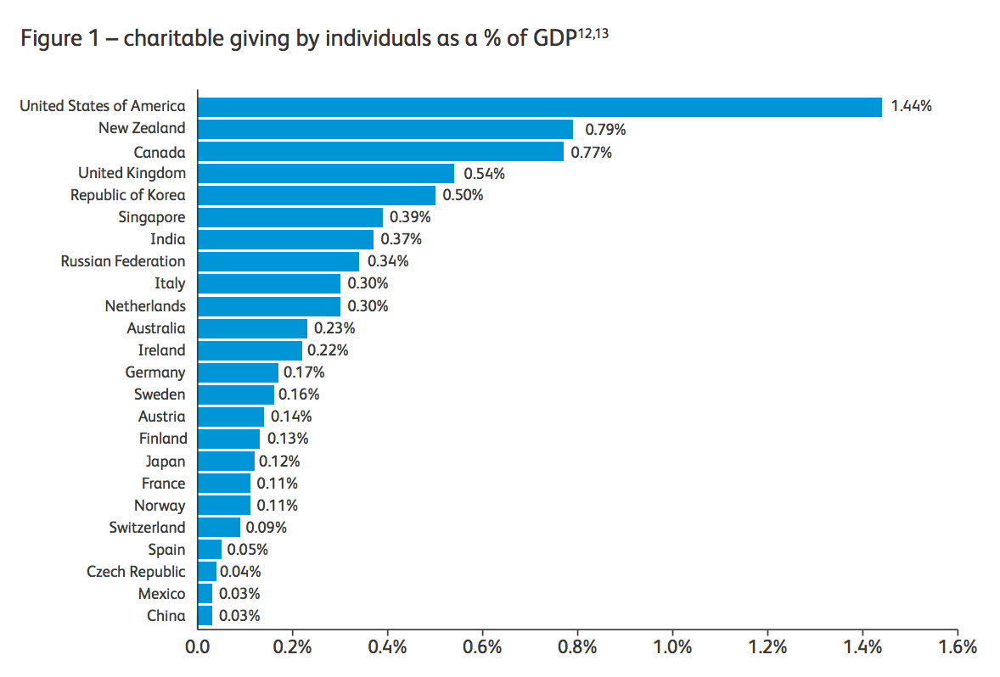
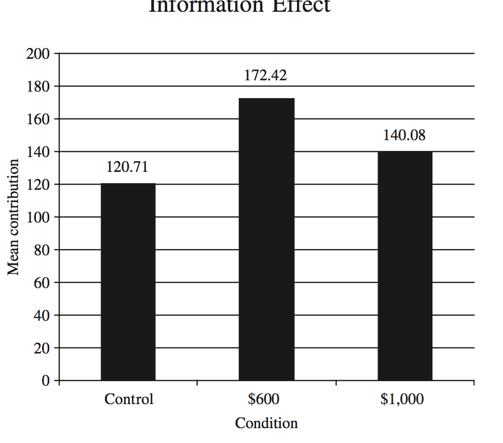

# Supplement: Charitable giving, volunteering, and other pro-social behavior -- the basics

## Outline

- Magnitude, statistics (cross-country, etc)

- Institutions, incentives, (history), descriptives

- Key issues, basic evidence

- Price and income elasticity

- Government crowding out (and vice-versa)

- Expenditure substitution

- Fundraising techniques; evidence on 'what works' (first-pass)

\


Introduction

### Why do we care about Charitable Giving?

1. Direct interest


Charitable giving constitutes 1-2\% of GDP in many countries, with strong variations between groups in prevalence, amounts, and to which charities

Furthermore, charities vary greatly in their *impact*

\

Charity addresses needs that the government and the market cannot or will not address (why? political sensitivities? public choice issues?)


\

We want to understand donation behavior (whether, how much, to which charity)

\

2. Charitable giving is one possible  measure of prosocial preferences and behavior

Fundamentally,  we care about 'Are people really good at heart, and if so, why and how?'

...and what motivates us as humans, and whom do we care about (more), etc

\

```{block2,  type='note'}

From its lowly beginnings in some primordial soup through slime mold to and to antlered deer to inquisitive monkey, the story of the search for goodness climbs all the way from the oceans
and the jungles to titanic twentieth-century battles between systems of government and economics. From the promise of democracy and the free market to communism
and the hope of equality, and from the liberations and perils of individualism to the inebriation of nationalism and unity, the quest to crack the altruism code traces an epic voyage
From baboons fighting in trees, to the Russian Revolution, to Nazi Germany, to the atom bomb, to twenty-first-century neurogenetics and brain imaging today, it is
mankind's soaring, Sisyphean journey to return to the paradise of the Garden of Eden"

- from The Price of Altruism, George Price and the Search for the Origins of Kindness, by Oren Harman

```
\


We also care about this for *instrumental* reasons: Motivations and influences on charitable giving are likely to be similar to prosocial acts in other spheres

- Voting/politics

- Personal relationships, Business

- International relations

- etc.

\

3. Looking under the lamp: We can run field experiments in fundraising "for free"

\

## Modeling and measuring other-regarding behavior


I mainly want to focus on practical issues. I particularly want to focus on the factors that directly affect real-world giving and other regarding choices that  fundraisers, governments and others can manipulate. (see innovationsinfundraising.org)

\


However, some conceptual background is helpful:

- to organize the our thinking and discussion and generate ideas

- to get a sense of which fields and methods to consult for answers

- and to understand what sort of things we *can* know about this.

\


## The big question

In these discussions and literature you will often hear a big, broad, and perhaps poorly defined question:

>  why do people give to charity?

or more generally

>  why do people help others/do good (when it does not directly increase their own consumption)?


This seems like a very important philosophical, psychological, and social-science question for understanding the nature of humanity.
It also  seems like a very practical question; if we know why people do good we may know the factors that may cause them to more or less good,
and we could structure society (especially public policy and fundraising) to maximize this.

On the other hand, an overbroad question, or a question that expects a single universal answer to a multi-faceted diverse phenomenon may prove to be *useless*
(see 'the answer to Life, the Universe and Everything').

\

## Economics and other-regarding behavior; a useful undertaking?

Economics, as it is traditionally defined, may not be well-suited to answering the question "why do people give?" any better than it can answer
 the question "why do some people like strawberry ice cream more than chocolate ice cream?" De Gustabus something in latin here.

Economics typically takes people's tastes as a given (the 'preference relations' or 'arguments to a utility function') and then uses math and logic to answer:

- What sort of preferences are internally consistent,  and how can we describe these preferences precisely?
- For any given preferences, how will people make choices (earning, learning, spending, etc)  to maximize their own well-being,  as measured by their own preference?
-  what aggregate patterns will these choices yield, particularly in market settings?

Thus, if people donate and help others  with no direct personal material return, Economics  most naturally explains this as:
'Al gives to Betty because Al has a taste for Betty's well-being.'

or

'Al gives to Betty (or to the World Wildlife Fund) because he enjoys the feeling he gets from doing this'

\


The question of 'why' Al  may have these tastes, and get  a positive feeling from giving (or from helping others,  or from seeing the impact of his actions, etc.)
cannot  really be explained by Economics, almost by definition. This question might be better answered by Psychology, Biology, and related fields.
(We will return to models and evidence from these fields later,  if time permits.)

\


However, concerning 'why people give', Economics *can*:

**1.  Bring structure to this question, and propose explicit defined mathematical models of certain preferences (or behavioral rules) involving giving.**

This structure also allows us to derive logical implications of the literally-interpreted models:^[I will use 'models' and 'theories' as basically interchangeable terms]
Remember, *given* a set of preferences, Economics makes predictions about choices and aggregate patterns.]

\


- E.g., 'Suppose people gain utility (value)  only from the act of sacrifice, and this utility increases only in the *amount* they sacrifice,

a. they will be equally willing to give to efficient and completely wasteful charities and
b. they will give up the same amount of their income with or without a tax-incentive for donating

\


[Aside: The above represents an extreme interpretation of the simplest Warm Glow model (Andreoni, ref).]

If these implications seem obviously unreasonable (a) or can be rejected empirically (with clear real-world evidence),
this suggests  we may want to reject or revise the model. Or, at least we may not want to use this model universally,
and we should look for other (and perhaps multiple) explanations, particularly in domains where the implications seem obviously unrealistic.
Thus, having given structure to the model and derived implications also allows us to make conclusions about the *reasonableness* and *usefllness* of the model

\


**2. Empirical tools, techniques, and approaches used in Economics can provide valuable evidence**

- About who donates, and when?
- About what incentives, environments, and types of appeals *lead* to more or less giving?

Both academic and practical economists have long become intimately involved with interpreting and large-scale data on individual consumption behavior as well as aggregate accounts.
This includes data on charitable giving (from tax and administrative records, from recall surveys, and from required statements of firms and nonprofits).

The field of Econometrics is largely concerned with 'how to estimate *causal* relationships from naturally occurring data.'

<!-- [Give some examples here; we will come back to this; link material below] -->

In the past 50 or so years, Economists have also increasingly *manipulated*  the real world through "field experiments" and policy trials.
We have also experimentally manipulated incentives and environments in "Lab experiments". Lab experiments are run in environments designed to mimic crucial features of the real world closely enough that we might expect participant's responses to resemble the responses in relevant real-world situations.
Lab and field experiments involving charitable giving and other-regarding behavior have proven particularly popular in Economics.


```{block2,  type='note'}

**Charity field experiments**

This is perhaps because it is comparatively easy to run experiments in charitable contexts, where neither a company's profit, nor an individual's salary is at stake.]

Furthermore,  charities typically allow anyone to fundraise on their behalf, and amateur personal fundraisers are prevalent.
Finally, the act of 'making a small donation to charity' in the lab (or in a small fundraiser set up by an economist)  is arguably very similar, and affected by similar motivations, as  the choices of small real-world donors. (In contrast, it is potentially harder to mimic 'hiring someone for a full time job', or 'buying a car' in a lab setting or in a field experiment that an economist could easily put together.)

```

\


**3. If and when giving involves (direct or indirect) private material rewards, we can use standard tools of Economics**

- Giving to public goods (that you benefit from directly, in a known way)

Many causes that people give to (and recipients of ORB) involve Public Goods: goods and services from which everyone (or many people) benefit (equally),
for which no one's use diminishes another's benefit
and from which no one can be excluded (or exclusion is costly).

Some things typically seen as public goods: Clean air, military and police protection, public radio, medical knowledge.

A beer is *not* a public good: if I drink a pint of beer, you cannot drink the same pint.

A local park may also be seen as a public good, at least for the village it surrounds; excluding people may be costly, or socially unacceptable,
and if it doesn't typically get crowded, each person using it doesn't harm the pleasure others get from it, nor does it increase costs.

Economic models help us understand the *optimal* provision of these PG (which government 'should' provide, but their are obstacles to this.)
Economic models also make predictions about how much people will *privately* choose to contribute to such goods, even if they *only care about their own consumption*;
and how these contributions vary in different incentive environments.

This is most easily applicable where private  benefits of public goods are measureable.

\

*Charitable giving*

- Tax benefits (when, if ever, could these induce a selfish person to donate?)
- Reputation and signaling models

**4. Whether giving involves material rewards or not, we can use models and evidence from Behavioral Economics (which draws heavily from Psychology)**

\


## Facts and figures on giving

^[largely from Andreoni and Payne (2013)... should be updated]

- International variations in rates of giving and propensity to give/volunteer

```{r  fig.cap = '', out.width='60%', fig.asp=.4, fig.align='center',  echo = FALSE}
 
```

^[Source: Charities Aid Foundation, "Gross Domestic Philanthropy, 2006", various data sources. Note these are very hard to compare.
The data sources are different, and much/most giving is domestic or local, or represents religious organisation dues.]


\


### Which charities? {-}


From Reinstein, 2012, using PSID/COPPS data:

```{r  fig.cap = '', out.width='60%', fig.asp=.4, fig.align='center',  echo = FALSE}
 knitr::include_graphics("picsfigs/howmanycategories_reinstein.png")
```

\


```{r  fig.cap = '', out.width='60%', fig.asp=.4, fig.align='center',  echo = FALSE}
 knitr::include_graphics("picsfigs/meangiving_reinsteinPSID.png")
```

\

```{r  fig.cap = '', out.width='60%', fig.asp=.4, fig.align='center',  echo = FALSE}
 knitr::include_graphics("picsfigs/whichcharity_reinstein.png")
```


\

### Difficulties with international comparisons {-}

International comparisons are not as informative as their media coverage suggests.

\

In considering these, first ask: what is the *purpose* of this comparison? Are we trying to make some judgement about 'which country is full of more moral and other-regarding people?'

There are important caveats

- Data sources differ (tax, survey self-reports, charity reports)

- Which forms of giving to report:
    - family, local beggars?
    - Giving clothing to Oxfam?

- Much giving is domestic/local, and local needs differ

- Governments services differ by country, contributions to international aid differ

- Religious giving (to churches) is often counted (about 1/3 of US giving), and this is often a fee-for-service

[Commitment to development index](https://www.cgdev.org/commitment-development-index)

\

- Variations in (US) giving over time: fluctuates somewhat

- US:  most giving is by private donors; 'many  people give a small amount and a few people give a large amount' [evidence?];  increasing concentration of giving among the wealthy

- US:  religious giving is the largest component (35%)

    -   Is this all really voluntary giving or is some of it dues-paying for a service?

\


## Models of giving and other-regarding-behavior (ORB)


<!---
 (summarised succinctly by Andreoni, 2006) is the Hochman and Rodgers (1969) argument that  "charitable giving, motivated out of altruism, creates a public good out of the charity."
-->


*Some examples of models of utility from charitable giving:*


Note:

- $x_{i}$ : Individual $i$'s 'private' consumption
- $g_{i}$: $i$'s giving
- $G=\sum_{i=1}^{N}g_{i}+t$: total giving or total supply of the public good
- $G_{-i}=G-g_{i}$: : Giving by individuals other than $i$


<br> \bigskip

. . .


All models include some form of the following 'standard' budget constraint:

$$x_{i}+p_{i}g_{i}-m_{i}=0\text{ ; }g_{i}\geq 0,x_{i}\geq 0$$

\


### Nested utility functions and externalities, Public goods {-}

- Linked utility: (Boulding, 1962; Vickrey): $u_{i}=U(u_{1},...u_{n})$

- Rawlsian: $\tilde{U}_{i}=\min_{j=1..n}[U_{j}(x_{j}(G,g_{j}))]$

- Pure Public Goods (Becker, 1974) : $u(x,G)$  increasing and strictly quasi-concave


\


But there is an industry of alternate models and theoretical and empirical work "refuting" the Pure Public Goods (AKA pure altruism) model

\


- Pure Warm Glow, (Andreoni, 2004) :  $u(x,g)$

- Mixed warm glow (Becker, 1974} : $u(x,G_{-i},g)$

- Mixed warm glow (Andreoni} : $u(x,G,g)$
    - $G$ assumed 'Normal' and x 'strictly normal'

\


### The strong case against a pure public goods model {-}

**1. It predicts "perfect crowding out" of government expenditure (or others' expenditure on the charity)**

- There is strong evidence against this, and charities generally lobby for government spending

- 'Very sensitive to others' gifts' (give less as they give more) in proximity of equilibrium, and not at all sensitive if the PG were at some other level


```{block2,  type='note'}
Crowding out of government expenditure has been  estimated to be much lower than what the model would predict,
and in some cases zero or positive (''crowding in'') ( Clotfelter (1985)
Bergstrom et al (1986)). True, the public goods model does not predict perfect crowding out of government funding if
some individuals are not givers. However, given the proportion of individuals who are non-givers it still predicts too high a level of crowding out to be realistic.]
```
\

**2. Under plausible conditions, this model predicts "very little giving" to a general-benefit charity in a large economy**


```{block2,  type='note'}
Andreoni (1988) presented a fairly general model in which as the economy gets larger the proportion of people giving shrinks to zero,
contradicting the observation that a large number of people are givers.
Similarly, with a mixed model, the giving is mostly driven by WG in a large population
```

How can giving \$500 to a global cause satisfy the marginal utility condition?

- The cause (e.g., cancer research) spends billions each year ^[Eckhouse et al, 2008: "We have estimated that in 2004/2005 the global spend on cancer research was 14,030 million euros"]

- This would require: At \$14 billion my marginal benefit from cancer research exceeds my benefit from another beer, but at \$14 billion and \$500 my utility from cider exceeds that from cancer research.

- This requires sharply-declining marginal utility in a very ad-hoc way!

\

**3. Too high income elasticities**

```{block2,  type='note'}

Sugden: PG model embodies 'Nash conjectures', Utility-maximisation, and Publicness

Sugden (1982) -- the high income elasticities predicted by the PG model do not match the real world.


Sugden 1982: Given reasonable values of parameters such as income elasticity of giving, and many large charities (in number of givers and in total contributions relative to the median gift) the model predicts giving should be extremely sensitive to other's gifts in the proximity of equilibrium, but then no longer be sensitive at all if the public good were at some other level -- a condition that is hard to explain or justify.

```

\

**4. Hard to justify 'giving to multiple categories'**

Maximization: I give to the category that yields the greatest marginal benefit.

But once again, how is it possible that MU(Cancer)$>$MU(Poverty) only until I donate \$500 to Cancer?

\


### Why does PG predict 'perfect crowding out' {-}

Essentially, a donor's problem (letting price of giving=1) can be written as:

<br> \bigskip

Choose the *total* contribution $G$ to maximize my $U(x,G)$

<br> \bigskip

s.t. $x_i + G - (G_{-i}+y_i) \geq 0$

- Where $x_i$ is i's own consumption, $y_i$ her income, G the total amount of the PG,
- $G_{-i}$ others' contributions to the PG (including government)


...

\


($G_{-i}+y_i$) has the same effect as 'income' on my 'choice' of x and G; a few steps and assumptions yield:


$\frac{\partial g_i}{\partial G_{-i}} = \frac{\partial g_i}{\partial y{i}} -1$


\


**Let's see those steps:**

If both giving and consumption are normal goods, this implies that in the relevant range:

$\frac{\partial g_i}{\partial y_i}>0$ and $\frac{\partial x_i}{\partial y_i}>0$

\


As the term $(G_{-i}+y_i)$ is like income in the typical budget constraint, we have, for those consuming both goods,
$\frac{\partial x_i}{\partial G_{-i}}=\frac{\partial x_i}{\partial y_i}$


\


<br> \bigskip

Note $\frac{\partial g_i}{\partial y_i}=1-\frac{\partial x_i}{\partial y_i}$ as all income will be spent on one of the two things


- and $\frac{\partial g_i}{\partial G_{-i}}=-\frac{\partial x_i}{\partial G_{-i}}$. Note numerator is 1 less than for previous.


. . .


If others spend more on charity I can hold $G$ constant by reducing $g_i$ by that amount and can increase $x_i$ by that amount.
Relative to that, any other changes in $x_i$ must be exactly compensated by changes in $g_i$.


. . .

<br> \bigskip

Combining these:


$\frac{\partial g}{\partial G_{-i}} = \frac{\partial g}{\partial y_{-i}} -1$


\


$\frac{\partial g}{\partial G_{-i}} = \frac{\partial g}{\partial y_{-i}} -1$

If both the public good and consumption are 'Normal', then $\frac{\partial g}{\partial G_{-i}}$ is positive but less than one.

- So the net term is equal to the 'share of marginal income going to charity' minus 1 ... or close to $-1$

    - Nearly full crowding out of others' donations or government spending!

    - Someone who give \$5 to a Cancer research  must surely end his donation if the government increases funding by \$100

    - And must at least double his donation if the government reduces funding by \$100

\

### A more formal argument for why the PG model struggles to predict small donations
 Suppose median income elasticity of giving is less than 0.5 (which it surely must be)

\
Consider $g_i(G_{-i})$, my 'best response' to others giving.

- If people do not give away their entire income, this is maximized at $g_i(0)<y_i$

- As $g_{-i}$ increases towards its equilibrium,  $g_i(G_{-i})$ decreases continuously.

   - At equilibrium ($G_{-i}^{\ast}$) the median derivative of this must be less than $-\frac{1}{2}$ (from above equations)

   - But for the vast majority of donors $G_{-i}^{\ast}$ is vastly greater than $y_i$

    - So  $g_i'(G_{-i})$ must be close to zero over the vast range $[0,G_{-i}^{\ast}]$ and then suddenly much more negatively sloped in the region surrounding $G_{-i}^{\ast}$


\

### Dominance of Warm Glow

General result (Ribar and Wilhelm, 2002): If people value both their own contribution and the total contribution, under standard assumptions only the former 'warm glow' will drive giving in large populations.

\

Andreoni: "giving \$100 to an organization that collects millions is motivated more by an admiration for the organization then for any measurable effect of the marginal donation.”


. . .


$u(x,g_i+(n-1)g_{-i},g_i)$: ... with many givers (large n), at everyones optimal choice ...

- ... the marginal utility of the *second argument* (total donation) is much much lower than that of the first and third argument

\


*This is easily shown in the Cobb-Douglas case:*


```{r  fig.cap = '', out.width='60%', fig.asp=.4, fig.align='center',  echo = FALSE}
 knitr::include_graphics("picsfigs/cobbdoug_mixedWG.png")
```

\

```{r  fig.cap = '', out.width='60%', fig.asp=.4, fig.align='center',  echo = FALSE}
 knitr::include_graphics("picsfigs/cobbdoug2.png")
```

\

```{r  fig.cap = '', out.width='70%', fig.asp=.4, fig.align='center',  echo = FALSE}
 knitr::include_graphics("picsfigs/cobbdougmixedWG_3.png")
```


\

```{r  fig.cap = '', out.width='50%', fig.asp=.4, fig.align='center',  echo = FALSE}
 knitr::include_graphics("picsfigs/cobbdougmixedWG4.png")
```

\


### But what's wrong with (mixed) "warm glow"? {-}

Mixed warm glow (Andreoni} : $u(x,G,g)$ incorporates both the public goods 'pure altruism' and the 'warm glow' term. Is this then the perfect model for all situations and uses? Some brief critiques...

<br> \bigskip

1.  This is a Black Box: why and when should a donor feel a warm glow?  Which charities lead to warm glow?

2. The model is imprecise, and it allows multiple (often implausible) contradictory interpretations

- Any charity, even a garbage one leads to WG?

- Do I *really* get WG if I know my contribution is fully causing someone else to reduce hers? (E.g., if a Communist publicly supports a charity, than anti-communists may shun it.)

- Is reputation part of the WG or distinct?

- It offers no  strong reason to give to multiple charities, or way to model how these substitute/complement for one another

\


### Other models (Utility-based) {-}

There are other important models that are still within the utility-maximization framework. In particular:

\


**The Impact/identification model**

- Duncan: Utility depends on the difference in some outcome with versus without my gift


- Atkinson: I identify with a particular recipient or set of recipients, and internalise their utility changes through my gift

These models deserve more discussion and treatment, especially when we are considering issues surrounding 'effective altruism.' I hope to return to this here.

\

**Reputation models (see e.g., Harbaugh)**

\


### Other models (Rule-based) {-}

- Tithing: $g_{i}=\tau m_{i}$

- Reciprocity (Sugden, 1984): 'you must not take a free ride'; if everyone in your group is contributing $\zeta$ to a good you benefit from, and your preferred world has everyone contributing $\zeta$ or more, you are obliged to contribute at least $\zeta$


```{block2,  type='technote'}

"Let G be any group of people of which i is a member. Suppose that every member of G except i is making an effort of at least $\zeta$ in the production of some public good. Then let i choose the level of effort that he would most prefer that every member of G should make. If this most preferred level of effort is not less than $\zeta$, then i is under an obligation to the members of G to make an effort of at least $\zeta$. I shall call this the principle of reciprocity."
```

- Rule-utilitarian: $g_{i}=F(m_{i},\theta_{i})$ s.t. $W(F(m_{1},\theta_{1}),...,F(m_{n},\theta_{n}))$ maximized.
    - Where $F$ is some decision rule and $W$ is the social welfare function.

- Kantian: $i$ chooses $x_i$ $g_i$ to max $u_{i}(x_{i},ng_{i})$ s.t. budget constraint
    - but gets actual utility $u_{i}(x_{i},G)$

\

All of the models above are extremely interesting, but I don't know if they are *useful*. They need to be interpreted carefully.

Should they conform to our standard moral intuition?

Can any utility maximization model predict behaviour corresponding to the intuition from 'Experimental Moral Philosophy'

\


> Bob is close to retirement. He has invested most of his savings in a very rare and valuable old car, a Bugatti, which he has not been able to insure. The Bugatti is his pride and joy. Not only does Bob get pleasure from driving and caring for his car, he also knows that its rising market value means that he will be able to sell it and live comfortably after retirement. One day when Bob is out for a drive, he parks the Bugatti near the end of a railway siding and goes for a walk up the track. As he does so, he sees that a runaway train, with no one aboard, is rolling down the railway track. Looking farther down the track, he sees the small figure of a child who appears to be absorbed in playing on the tracks. Oblivious to the runaway train, the child is in great danger. Bob can’t stop the train, and the child is too far away to hear his warning shout, but Bob can throw a switch that will divert the train down the siding where his Bugatti is parked. If he does so, nobody will be killed, but the train will crash through the decaying barrier at the end of the siding and destroy his Bugatti. Thinking of his joy in owning the car and the financial security it represents, Bob decides not to throw the switch.

- From 'The life you can save' by Peter Singer

\


> According to UNICEF, nearly 10 million children under five years old die each year from causes related to poverty. Here is just one case, described by a man in Ghana to a researcher from the World Bank: Take the death of this small boy this morning, for example. The boy died of measles. We all know he could have been cured at the hospital. But the parents had no money and so the boy died a slow and painful death, not of measles but out of poverty.
> ... If the relief organizations had more money, they could do more, and more lives would be saved.
> ... But we all spend money on things we don’t really need, whether on drinks, meals out, clothing, movies, concerts, vacations, new cars, or house renovation. Is it possible that by choosing to spend your money on such things rather than contributing to an aid agency, you are leaving a child to die, a child you could have saved? Giving to strangers, especially those beyond one’s community, may be good, but we don’t think of it as something we have to do.

- Singer [Video making similar argument here](http://www.npr.org/2017/05/26/529958027/peter-singer-how-can-we-be-more-effective-altruists)


Teaching: we can include the 'trolley survey' here.

<!--
Take the **Trolley survey** please

[Link](https://goo.gl/forms/4ZMZKEFshOejiQGk2)

<br> \bigskip

Answer each question separately, do not change your first answer after looking at the second one please.

-->


- Drowning child example
    - Yet, "don't give" to someone whom others could also help?

- Railway track example
    - Switch the track, but don't push the obese man in front?

\

## Empirically-motivated arguments for WG and against PG, experimental evidence

## Sources of evidence on charitable giving

    - Surveys and tax data
    - Aggregated data
    - Field experiments
    - Lab experiments

# Supplement:  What *causes* people to donate (more) to charity


### Defining the question {-}

Define a question so it will be *useful*

- For 'basic science', understanding fundamentals
    - Genetic determinants of generosity?
    - Social environment and peer networks

```{block2,  type='note'}
These may not translate easily into policy, but it can be helpful in getting understanding of 'what makes people tick',
what we might predict in response to (e.g. demographic) trends; and we may think of a policy tool down the road
```


\

For practice and policy:

- Tools fundraisers can use (promotions, incentives, social pressure...)

- Tools charities can use (choice of programs, publicity, cost structure, donor recognition, give donors actual influence)

- Tools government can use (tax incentives, legal regimes)

\

*Flavors of this question:*

- Does X cause people to donate more on average?

- Does X cause *more people* to donate?

<br> \bigskip


. . .

**These questions are both relevant, but for *different* purposes.**


\

- Does treatment X cause people to donate more to the *specific charity* that uses this treatment?


- Does treatment X cause people to donate more to charities *overall*?


. . .


- In the short run?

- Over the relevant lifetime?


\


### Compare: SPI 'open questions' {-}

[Link](http://spihub.org/research/current)

**The Supply Side and Human Behavior**

- What are the motivations, distinguishing theories, what factors 'attenuate'

- How do preferences and beliefs translate into behavior

- Relationships to :
    - Culture? Suggest cross-cultural experiments.
    - Life cycle
    - Nature/nurture

\


SPI open questions ...

**The Demand Side and Solicitation Mechanisms**

- How should charities use 'upfront money' to attract more?

- Social distance of donors (and fundraisers or recipients or the charity)

- Tools to encourage continuing contributions vs initial ones

Why do some charities succeed but others fail, and how do solicitation mechanisms or social distance of donors play a role?
What causes donors to remain committed to the cause, what are the best solicitation mechanisms to encourage continuing donations, and do these differ from mechanisms aimed to prompt initial donations?

(Note: It is not clear which is the supply side and which the demand side in this 'market')

\

SPI open questions ...

**The Market for Charity Contributions and Public Policy Implications**

- Crowding out of government grants
    - they believe it exists, seek the 'mechanism': donors' or fundraisers' change behavior
    - crowdout of other donors/foundations

- Do mechanisms like charitable lotteries crowd out other giving?


<!---
What is the underlying reason for the crowding out effect of government grants? Is it that donors reduce/reallocate contributions when learning that a charity has received a grant, or is it that charities reallocate fund-raising efforts after receiving grants?
Do similar patterns of crowding out arise if the source of funds is a private donor or foundation?
What are the efficiency gains and losses associated with competition amongst charities?
What is the effect of charitable lotteries and other solicitation mechanisms – does using incentives crowd in new donors, or lead to reallocation of donors across charities?
What is the effect of cause-related marketing on individual donations in the short and long run? Do such campaigns provide the donor moral cover to avoid future acts of charity and therefore crowd-out future philanthropic activities?
-->

\

## Andreoni and Payne - Major approaches to researching giving:

1.  an individual economic decision

2.  a strategic interaction (between  donors, charities, governments, foundations)

3. a 'social exchange': (reputation, more than this?)

- ' a charitable donation is rarely made in the absence of an overt request to give' [DR: this is too strong a statement; undoubtedly many people give as a habit or motivated by something they see in the news etc.]

4.'empathic, moral, and cultural urges' ( Empathy, justice, leaving moral impressions on others))

^[Andreoni and Payne  (2013). Chapter 1 “Charitable Giving” in Auerbach, Alan J., et al., eds. Handbook of public economics. Vol. 5. Newnes, 2013]

\


### Sources of evidence {-}

There is  much evidence on *correlates* of giving (who gives?), noted above

However,  *Causal* evidence is harder to come by

- Observed correlations (with careful controls) are informative and may be convincing about causality, but be cautious in making inferences

- E.g., if religious people give more (widely observed), does it mean religion *makes them* more generous?

- `r format_with_col("But in some cases, a practitioner will not care about causality, only, e.g., 'whom should I target?'","gray")`

\
I will focus on experimental and 'experiment-like' evidence

- Particularly in real-world-(like) environments

- Particularly evidence that has been *replicated*

\

## Categories of 'tools' to increase giving (effectiveness)

**1. Social**

- Visibility: do others see my donation/non-donation?

    - Mandated/automatic recognition vs voluntary (see [Larry David, anonymous donor](https://www.youtube.com/watch?v=JqrJ4wGid4Y)

    - Donation 'registries' and 'pledges'

    - Signaling (to romantic partner, others)

- Influence of learning previous donations

- Social connections between donor, fundraiser, recipient

\

**2. Information and communications**

- Highlight an individual beneficiary or a large group? (Identifiable victims effect)

- Depict poverty/sadness (-) or positive outcomes?

- Emphasize religious norms

- Information about recipients' deservingness

- Charity effectiveness; charity 'quality ratings', Overhead (aversion)

- Personalisation (personalised message)

\

**3. Incentives/gifts**

- Unconditional gift (Gift exchange)
- Conditional gift (for donors only)

- Matching donations (at what rate? capped or uncapped? reveal identity of matcher?)
    - ‘Framing’ of match (match versus rebate)
    - Threshold/provision point for match

- Refund if project goal not reached

- Seed donations

- Auctions and lotteries, various designs

- Other charities/incentives. competition, crowding out

\

**4. Timing/conditionality**

- Give more tomorrow

- Give if you win

- Pre-commit to give or increase giving

- Mood (ask a happy or a sad person?)

\

**5.  Size/nature of ask, choice architecture**

- Low-ball, 'Legitimation of paltry donation' (LPD)

- Default enrollment/Mandated choice

- (Default) automatic escalation/inflation-adjustments

**6. Income source**

-  Ask from less-tangible income

**7. Donor_choices**

- Donor can target project

\

## Investigation: timing and conditionality of donation commitment

- Give full presentation, linked [HERE](https://drive.google.com/file/d/0B2PGCZaK3KI4T2plRXBfTjRPQUk/view?usp=sharing)

- Further promotion and discussion at 'giveifyouwin.org'

\

## Investigation: 'Social giving'

- Do people give more when others see their donation?
    - Is it because of reputation concern or a desire to influence?
    - Do they respond to previous donations?

[Charitable Giving: Reputation, Influence](https://www.dropbox.com/s/liz5cpydww4vwbj/PresBristol_final.pdf?dl=0)

<!--
[comment]: <> (PRESBB)
**Lecturer notes**
### Papers to survey (DR: todo) {-}
- SPI working papers: http://spihub.org/research/workingpapers

- My papers (start with their lit surveys and update these)

- Surveys by Andreoni; Andreoni and Payne; Bekker and Wiepking; that other one (Sargent?); avoid clutter, only consider significant evidence

- Spreadsheet on charitable giving experiments (update)

[comment]: <> (PRESEE)

***

### Evidence chart (with references) {-}


[comment]: <> (PRESBB)
**Lecturer notes**
Theory or tool | Economic theory | Psychological theory | Lab support | Field experiment evidence | Replication | Demonstrated use cases
Visibility: Make (non)donations public

See: [Charitable_giving_tools_evidence sheet](https://docs.google.com/spreadsheets/d/1BpmV3s7ny2Ud1yJaNIQtlrX4sKcGYjH15RTN_vAK3mQ/edit#gid=1)

[comment]: <> (PRESEE)

***

[comment]: <> (PRESBB)
**Lecturer notes**
Check, SPI:

Avoiding Overhead Aversion in Charity (Pub)

How do Suggested Donations Affect Charitable Gifts? Evidence from a Field Experiment in Public Broadcasting
Do Beliefs About Peers Matter for Donation Matching? Experiments in the Field and Laboratory
Once and Done: Leveraging Behavioural Economics to increase Charitable Giving Contributions
Transaction Costs, the Opportunity Cost of Time and Procrastination in Charitable Giving (Pub)
"Feel the Warmth" Glow: A Field Experiment on Manipulating the Act of Giving (Pub)


Introduction to field experiments in economics with applications to the economics of charity (Pub)
Matching and Challenge Gifts to Charity: Evidence from Laboratory and Natural Field Experiments	(Pub)
Testing for Altruism and Social Pressure in Charitable Giving (Pub)
The Effects of Seed Money and Refunds on Charitable Giving: Experimental Evidence from a University Capital Campaign (Pub)
The impact of challenge gifts on charitable giving: an experimental investigation   (Pub)
The Role of Social Connections in Charitable Fundraising: Evidence from a Natural Field Experiment (Pub)
Toward an Understanding of the Economics of Charity: Evidence from a Field Experiment (Pub)
Toward an Understanding of why Suggestions Work in Charitable Fundraising: Theory and Evidence from a Natural Field Experiment (Pub)

[comment]: <> (PRESEE)


-->\


## Investigation: 'Social giving'

```{r  fig.cap = '', out.width='80%', fig.asp=.4, fig.align='center',  echo = FALSE}
 knitr::include_graphics("picsfigs/skkudonationboard.png")
```

- Do people give more when others see their donation?
    - Is it because of reputation concern or a desire to influence?
    - Do they respond to previous donations?

\

**Alpizar et al, 2008**

> “We have interviewed tourists from many different countries and one of the most common donations has been 2/5/10 US dollars.” [Or no statement]

*Impact of 'previous' primed contribution:*

- \$2 prime: most likely to donate, significant
- \$10 prime: largest contribution, conditional on contributing
    - Net effect is not clearly statistically significant


\

```{r  fig.cap = '', out.width='60%', fig.asp=.4, fig.align='center',  echo = FALSE}
 knitr::include_graphics("picsfigs/martinrandal.png")
```

“How is donation behaviour affected by the donations of others?”, Martin and Randal, 2008, JEBO


\


**Shang & Croson: Field Experiments in Charitable Contribution: The Impact of Social Influence on the Voluntary Provision of PG's**

<br> \bigskip

Radio fund-drive


<br> \bigskip

> “We had another member, they contributed \$75 [\$180 or \$300]. How much would you like to pledge today?”

^[In particular, after answering the phone with the station's identifier: “Hello, STATION_NAME member line,” experimenters asked: “Are you a new member or a renewing member of STATION-NAME?” This experiment was run only on renewing members. For callers who responded that they were a renewing member, experimenters read (or did not read in the control condition) the following sentence:]


\


```{r  fig.cap = '', out.width='80%', fig.asp=.4, fig.align='center',  echo = FALSE}
 knitr::include_graphics("picsfigs/shangcrosonmainresult.png")
```

^[Also: Driven by new callers, insignificant for renewers.
 Note \$75 was the median donation in the previous drive}


\


Other results:

- Renewal rates higher

<br> \bigskip


- In a followup (simultaneous?) experiment, they did the same thing for renewing callers, but using \$600 and \$1000 prompts

    - What do you think the results were?

***

```{r  fig.cap = '', out.width='60%', fig.asp=.4, fig.align='center',  echo = FALSE}
 
```

^[Cialdini theory:  in order for social information to influence behav- ior, the information must be judged relevant by the donor (Cialdini 1998)]


\

[Charitable Giving: Reputation, Influence](https://www.dropbox.com/s/liz5cpydww4vwbj/PresBristol_final.pdf?dl=0)

\

**"Hey look at me: The effect of giving circles on giving" (Karlan and McConnell, 2014)**

- Control: We are hoping you will continue your support to Dwight Hall with a gift of \$100.

- 100 circle: ... +  With a donation of at least \$100, you will become a member of our Friend donor circle. Friends will be listed by name in the Dwight Hall Fall 2008 newsletter.

- 500 circle:... +  With a donation of at least \$500, ... Benefactor donor circle. Benefactors will be listed by name...

- 100 circle and 500 circle: ...


\

```{r  fig.cap = '', out.width='70%', fig.asp=.4, fig.align='center',  echo = FALSE}
 knitr::include_graphics("picsfigs/karlan_randomizationcheck.png")
```


- `r format_with_col("Comprehension question: why do they show us the above table?","blue")`

\

**Results**

- Overall: 13\% (of 4168) donated, average conditional gift \$186. Usually round-number amounts

- Mention of recognition $\rightarrow$:
    - +2.7 percentage point increase in prob(give)
    - + 1.8 pp in prob(gift $\geq$ \$100), by +0.5pp gift $\geq$ \$500 percentage points
    - Average gift size +14 pp percentage points
    - responses increasing in average prior gifts

- Relatively few exactly at strategic cutoffs $\rightarrow$
    - Less value of recognition?
    - Poorly chosen cutoffs?

\


### Does giving depend on social pressure, which people try to avoid? {-}

```{r  fig.cap = '', out.width='60%', fig.asp=.4, fig.align='center',  echo = FALSE}
 knitr::include_graphics("picsfigs/charitypestering.png")
```

- If solicitations lead people to feel compelled to donate, is their utility decreased?

- Practical: does this 'social pressure' work?

"First, do people avoid fundraisers, yet give because of some social pressure? Second, what is the social cost of fundraising, including the cost of social pressure?"

\

**People avoid the ask/pressure, avoid information about social consequences of own actions**

- Lab: " Dana, Cain, and Dawes (2006) showed that, rather than enter a \$10 dictator game with an anonymous partner, many people would accept \$9 and be allowed to leave with the potential recipient not being made aware of the choice to exit."

- Dana,Weber, and Kuang (2007) ... many avoided free information on the consequence of their actions for partner

<br> \bigskip

- Fong and Oberholzer-Gee (2010): 1/3 of dictators (lab) paid to learn more about (the deservingness of) their (real world, poor) recipient.
    - Mostly use the information it to withhold resources from less- 28 preferred types, leading to a drastic decline in aggregate transfers.

^[They learn whether a low-income public housing resident is not working because of drug use or because of a physical disability]

\

Issue: should WG (and cold prickle/guilt) be part of the social calculus?


\


<br> \bigskip

**Social Costs of Social Pressure**

$$U = w_i - g_{ij} + a_{ij} ln (\Lambda_j + g_{ij}) - S_j I(g_{ij} < 10)$$

- DellaVigna et al. (2012), door-to-door fundraising experiment
    - cold call / flier in advance specifying time / flier with opt-out box
    - also run paid surveys, announced and unannounced, to measure the cost of (not) being at home

\

*Results:*

- People 10\% less likely to open door with flier in advance

- About half opt out, 30\% less giving in the opt-out treatment, driven by donations under \$10

- Estimate a cost of social pressure around \$4, exceeding the estimated warm glow benefit to donors


\


## Price of giving: see [Price, impact, and effectiveness](#price-impact)


## Other influencers

- Mood

- Nature of appeal, subtle cues

## Fundraising: other tricks and puzzles (to add)

### Size of the 'ask' and contribution options (to add)  {-}

