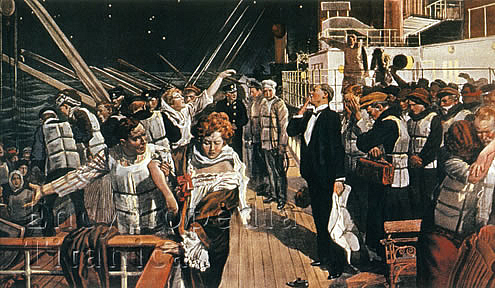
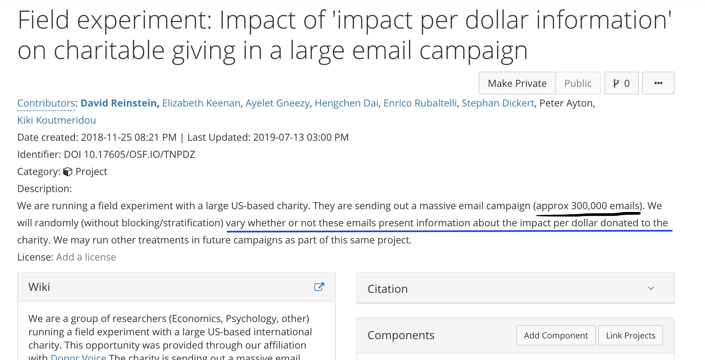
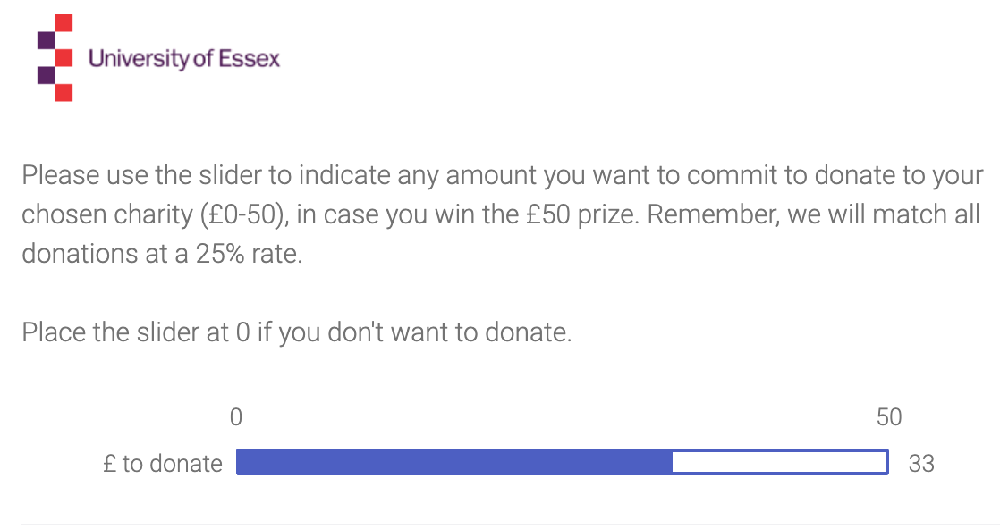

# Supplement: Charitable giving -- Donors response to 'prices' and (information about) impact and effectiveness   {#price-impact}

With most goods we naturally assume that consumer choice is deeply influenced by the 'price per unit', which determines the consumer's budget constraint. We have considered price-elasticity, income and substitution effects, the impact of price on revenue (expenditure), etc.

\

With charitable donations this is not so clear cut: What is the 'price' and what is the 'output consumed'? This depends on what benefits the potential donors gain from giving, and how they perceive this. As charity is largely a *creedence good*, donors may not get direct and accurate feedback between the activities (outputs) and achievements (outcomes) of the these.

\

This chapter deals with several aspects of price and effectiveness:


- Prices expressed [matches](#price-match) and rebates to donors/gifts

- [Charity ratings](#ratings) that do not directly measure per-dollar impact (but overall governance)

- Responses to ['Overhead'](#overhead) information, a common measure that does *not* do a good job of explaining a donor's marginal impact on outcomes

\

- [Impact on (outputs and) *outcomes* per dollar; responses to scientific analytical information](#realimpact)

The latter is arguably the most important measure for donors who are striving to 'do the most good' with their donations.

\


## Price of giving: Impact of matches {#price-match}

To justify a tax break, a price elasticity of 1 or greater (more elastic) is considered the 'gold standard'.

Otherwise this policy leads the government to forgo more in taxes than it raises in terms of charitable contributions.

\

There are many 'observational data' papers on how charitable giving responds to changes in the 'tax price'

- The results vary greatly across studies, although there is a very weak consensus around unit elasticity

- But these are arguably 'poorly identified': income and tax rates tend to move together

- And the effect of private 'matches' may be different

- So we might turn to field experiments

\


### Karlan and List: "Does Price Matter in charitable giving..." (2007, AER) {-}

<!--^[Summary in Andreoni] -->

> Issue:  Marginal illusion; Match comes with a Maximum.  What if it is met?  In practice....it is often met by definition

\


```{r  fig.cap = '', out.width='70%', fig.asp=.4, fig.align='center',  echo = FALSE}
 knitr::include_graphics(file.path("picsfigs","karlanmailing.png"))
```


Returns from 50,000 mailings

- 2\% response rate
- 300 controls (1.8\% response)
- 735 treatments:  about 245 of each (2.2\% response)

\

- Finding 1: Extensive effect -  The existence of a match increased propensity to give by 22%

- Finding 2: Extensive effect: Match alone increased donation from \$0.81 to \$0.97 per mailing.  Increase of 19\%

- Finding 3: No intensive margin effect of the match on d, out-of-pocket donation, (but g, charity receipt per mailing, rose a lot with match, all the way to \$3.75 per mailing.)

- Finding 5:  No effect of limits; Marginal illusion or not?

<!-- ^[To do: flesh out the argument about marginal illusion] -->

- “Match ratios have no additional impact”

\

### Huck and Rasul “Matched fundraising: Evidence from a natural field experiment,” J Public Econ 2011, Andreoni summary {-}

- Huck and Rasul (2011; Bavarian State Opera, program to benefit local disadvantaged). 60k leadership gift:

    - Announced

    - 0.5-1 match (60k match cap; truthful, real differences, or misleading information?)

    - 1-1 match

\

*Conditions:*

C:  Control, No mention of leadership gift
L:  Leadership gift mentioned, but not match
M1:    L + a 0.5 to 1 match is stated
M2:   L + a  1 to 1 match is stated

\


- C vs L isolate the effect of a leadership gift

- L vs M1 and M2 isolate the effect of match

\

*Findings: All the increase is due to the Leadership gift*

- Matches actually have a dominating income effect.

- Higher matches lower d (amount sacrificed). That is, g (amount received) is inelastic wrt p.

- Charities would be better off just announcing the lead gift and having no match.

\

So, it seems the 'price of giving' doesn't matter in a conventional way in 'matching contributions'

- Caveats to both studies: special samples; self selection of "who opens envelope")

    -  but this should resemble selection for real interventions in similar contexts

\

## Framing of match: match versus rebate

- Eckel and Grossman, 2008 (ExpEcon), how do theoretically equivalent rebates and matching grants affect donations?


\

<small> "A rebate subsidy of $s_r$ and a matching subsidy of rate $s_m$ = $s_r/(1 - s_r)$ present a donor with the same net cost of giving to the charity and therefore should result in the same level of giving" </small>


\


REBATE: pledge \$1 to Minnesota Public Radio, later receive a partial refund (e.g., \$0.20) from the authors of the study.

MATCHING:  \$1.00 matched by an additional donation (e.g. \$0.25) to MPR by the researchers.

- Random allocation: (1) No subsidy, (2) Match 25\%, (3) Match 1/3, (4) Rebate 20\%, (5) Rebate 25\%


<!---
summarized in  List (2008, ExpEcon)
-->

- Matching grants raise more than equivalent rebates in this study (echoes previous lab results)

- Price elasticities are roughly one and one-half to three times as large as for the rebate subsidy

## Info/comms: Does information (about recipients/charity...) help? {#info-recip}

**Fong, C., Oberholzer-Gee, F., Truth in giving: Experimental evidence on the welfare effects of informed giving to the poor, J. Public Econ. (2010)**

- dictators from the university community [Carnegie-Mellon]

- Real-life welfare recipients living in 178 public housing in Pittsburgh

- Choice treatment: Can choose to pay \$1 to learn about subject’s drug/disability

- Exogenous: this information is provided freely. (Also tested with comparable \$9 endowment)

\

```{r  fig.cap = '', out.width='4.3in', fig.asp=.4, fig.align='center',  echo = FALSE}
 knitr::include_graphics(file.path("picsfigs","fongtreatments.png"))
```

\

<!---
Our dictators can purchase signals 26 about why the recipients are poor. We find that a third of the dictators are willing to pay money to learn more 27 about their recipient. Dictators who acquire information mostly use it to withhold resources from less- 28 preferred types, leading to a drastic decline in aggregate transfers. With endogenous information about 29 recipients, we find that all types of poor recipients are worse off. Subjects play a \$10 dictatorgame not knowing whether they are paired with a disabled recipient or with a drug user.
-->


```{r  fig.cap = '', out.width='60%', fig.asp=.4, fig.align='center',  echo = FALSE}
 knitr::include_graphics(file.path("picsfigs","fonggraph.png"))
```

\

"both types of recipients are worse off when dictators can choose to learn"
... [but] dictators are weakly better off by construction


<br> \bigskip

"In the endogenous information treatment, we not only ask dictators how much they want to give to a poor person, we also encourage them to think about why the recipients are poor, possibly highlighting reasons not to give"

\


<br> \bigskip

"a third of subjects are willing to sacrifice resources to obtain additional information


\

```{r  fig.cap = '', out.width='60%', fig.asp=.4, fig.align='center',  echo = FALSE}
 knitr::include_graphics(file.path("picsfigs","fong_key_results.png"))
```

- But it's not a fair comparison: those who decide *not* to buy information appear less generous than the average


\

```{r  fig.cap = '', out.width='4.3in', fig.asp=.4, fig.align='center',  echo = FALSE}
 knitr::include_graphics(file.path("picsfigs","fong_adjustedresults.png"))
```


^[Todo: How should we interpret these estimates?]

\

Eyeballing their results on *exogenous* information (e.g., regression table 4)

- It increases transfers to the disabled by about \$1-\$3 (statistically significant) but decreases transfers to drug-abusers a small amount (insignificant)
    - Seems to increase transfers on average

\


## Charity ratings, overhead {#ratings}

There are a few organisations that rate charities on the basis of their transparency, governance and overhead ratios. As we have argued these are not great metrics for the per-dollar *impact* of a gift. Nonetheless, we might consider Whether donors are more likely to give/give more to charities that are highly rated. This would provide evidence against the most extreme warm glow model, where donors do not care at all about how their funds are used. It's also important to understand the workings of this 'industry'.  There are several papers providing evidence on this.

\

**Yörük, Barış K. "Charity ratings." Journal of Economics & Management Strategy 25.1 (2016): 195-219.**

- We have data on charity ratings (here, from 'Charity Navigator') and on amounts each charity raises per year (public reporting)
    - Does a regression of amounts raised on the rating tell us the *impact* of the rating?
    - No! Better charities may get higher ratings and more donations because of their *quality*, not because of the rating.
    - Response: Look at *changes* in ratings/donation (fixed effect modeling)
    - But: "time-variant unobservable charity characteristics that are correlated with charitable contributions may also be correlated with the third party ratings"

- But note that the 'Charity Navigator' gives discrete 'star ratings' based on a continuous score
    - Class: Any idea how this can help?

\

"Regression discontinuity": If we robustly control for the *score*, we can look at the effect of *crossing a star threshold*

- Being 'just above' or 'just below' a threshold can be seen as random

- But donors may react to the *stars* and not see the score itself; so crossing the threshold may have a large effect

\

```{r  fig.cap = '', out.width='60%', fig.asp=.4, fig.align='center',  echo = FALSE}
 knitr::include_graphics(file.path("picsfigs","yorukRDcutoffspooled.png"))
```

^[This is for small charities]

\

```{r  fig.cap = '', out.width='60%', fig.asp=.4, fig.align='center',  echo = FALSE}
 knitr::include_graphics(file.path("picsfigs","yorukRD4star.png"))
```


```{r  fig.cap = '', out.width='60%', fig.asp=.4, fig.align='center',  echo = FALSE}
 knitr::include_graphics(file.path("picsfigs","yoruk_regsmall.png"))
```

\

*Results*:

- No significant overall effect (contradicts previous literature)

- Significant impact for small charities only: finds a nearly 20\% effect of a one star increase
    - Argument: These charities are less well-known, so people rely more on this information

\

**Other work:**  [Brown ea (2017)](https://www.sciencedirect.com/science/article/abs/pii/S2214804316300209), [Gordon ea (2009)](https://doi.org/10.1016%2Fj.jaccpubpol.2009.08.001); they tend to find positive effects of good ratings, but the former is a lab experiment, and the latter doesn't clearly identify causality (imho).

\

### Financial measures in a mailing experiment (Parsons, 2007) {#parsons}

2 x 2 mailing appeal for People with Aids Coalition-Houston,

- Add "Service efforts and accomplishment info"(SEA)
- Add favorable "FINANCIAL" spending/overhead ratio info

FINANCIAL (alone) $\rightarrow$ 180\% increase in odds of donating *among prior donors* ($p<0.05$)

(Other effects mainly insignificant, underpowered)

```{block2,  type='note'}
Unsure if it's a logit or LPM -- confusing writing
Not effect-coded; no measure of *overall* impact of FINANCIAL across both SEA treatments
Probably not preregistered
I'd like to see CI's
```

\

<small> Details from Parsons </small>

```{r parsons0, out.width='70%', fig.align='center', echo=FALSE}

knitr::include_graphics(file.path("picsfigs","parsons_fin_treat.png"))

```

```{r parsons_logit, out.width='70%', fig.align='center', echo=FALSE}

knitr::include_graphics(file.path("picsfigs","parsons_logit.png"))

```


## Overhead and fundraising expense ratios {#overhead}

### Gneezy, Uri, Elizabeth A. Keenan, and Ayelet Gneezy. "Avoiding overhead aversion in charity." Science 346.6209 (2014): 632-635. [download LINK](https://rady.ucsd.edu/docs/Science-2014-Gneezy-632-5.pdf) {-}

@Gneezy2014b

"We test whether designating early large gifts to cover overhead costs increases donors’ willingness to contribute to a charity"

This intervention "should not matter" (as the money is essentially fungible ... so the impact of an individual's donation on outcomes is the same under either policy.)

\

*However*,  people might see it as a sign of efficiency and honesty, or it might give them a greater feeling of impact

```{block2,  type='note'}

*From a recent grant application:*
  
From an economic perspective, designating initial large gifts as seed money or using them to cover overhead costs is the same. Charities are interested in maximizing the total funds raised and are agnostic about whether overhead costs are covered by initial donations or are shared by all donors. Consumers, however, seem to have clear, strong preferences: They want their donations to be put to “good” use—in other words, for direct program costs.

(Although as noted above , the actual impact is equivalent.)
```

\

1. Lab experiment: two charities: (i) Kids Korps USA,  and (ii) charity: water;

- each participant could choose which got \$100 *if their decision was randomly chosen*

    - They varied how much of the \$100 went to the charity, and whether this 'overhead' was covered by a third party

*DR:  I don't agree that their lab experiment represents the sort of 'overhead aversion' we care about.*

\

2. Field experiment, education charity, request letter to 40,000 US households, wants to fund as many 20k usd  projects as possible (in USA). Asked to give  20/50/100 US dollars.

Treatments:

- SEED: "A private donor who believes in the importance of the project has given this campaign seed money in the amount of \$10,000."

- MATCH: "... The matching grant will match every dollar given by donors like you with a dollar, up to a total of \$20,000

- OVERHEAD: " ... \$10,000 to cover all the overhead costs associated with raising the needed donations..."

\

*Results*

```{r  fig.cap = '', out.width='70%', fig.asp=.4, fig.align='center',  echo = FALSE}
 knitr::include_graphics(file.path("picsfigs","overheadgraph.png"))
```

Which of the above differences are statistically significant?

Below, our usual notation for 'significant differences' using stars: ("***")  implies a p-value value of .01 or lower  for the statistical test of the relevant comparison.

\


- Share donating: Overhead (8.5\%) $>$ \*\*\* Seed $\geq$ Match $>$ Control (3.4\%)

- Amount raised: Overhead (2.31) $>$ \*\*\* Seed, Match $>$ \*\*\* Control  (0.80 USD)

(Extensive margin: Seed $>$\*\*\* Control)


These results have been replicated in other trials [ref].

\

## Impact on (outputs and) *outcomes* per dollar; responses to scientific analytical information {#realimpact}


<!--

0. [Definition of 'effective giving' for our purposes, motivation](#intro)

1. [Barriers to effectiveness in giving (very brief taxonomy/outline)](#barriers)

2. [Focus: 'Processing of effectiveness information' & dual-system](#effect-info-dual)
<small> [(Concepts/theory)](#concepts) </small>

3. [Prior evidence and gaps](#prior-evidence), [Reinstein et al team empirical approach](#empirical-approach)

Our approach?: Naturalistic settings, robustness across setups/frames, honestly presentation of evidence, allow integration

4. [DonorsVoice mailing experiment](#dv-experiment) <small> (many co-authors)  i) Setup  ii) Results iii) Proposed follow-up  </small>

5. [Bergh project (Mturk)](#bergh-mturk-experiment) <small> Setups, Results </small>

6. [Bergh/Reinstein (Essex piggyback)](#essex-piggyback) <small> Setups, [Results](#bergh-results) </small>

7. [Preliminary conclusions, proposed future directions](#conclusion) (time permitting)


-->


### The puzzle

`r format_with_col("There is a puzzle:","blue")` inefficient giving/little to highest-impact causes
\

1. “Why don’t we give more to the most effective charities and to those most in need?”,


<center> *and* </center>


2. “Why are we not more efficient with our giving choices?”


\


Ben Grodeck:

> ... although people have their pet charity causes (e.g. blindness), even if you buy an argument of incommensurability between causes (which we shouldn’t imo), there are more effective charities within these subsets.


```{block2,  type='note'}

*From a recent grant application ...*


When confronted with a "[girl drowning in a pond](https://www.thelifeyoucansave.org/videos#pondvideo)" most people are willing to sacrifice substantial wealth to save her life. However, [most people ](https://givingusa.org/giving-usa-2017-total-charitable-donations-rise-to-new-high-of-390-05-billion/)  [don’t](https://givingusa.org/giving-usa-2017-total-charitable-donations-rise-to-new-high-of-390-05-billion/) ... [ake large donations to the very poor, in spite of evidence suggesting that lives can be saved [for less than $10,000](https://www.givewell.org/how-we-work/our-criteria/cost-effectiveness).
 \ There is a [strong case](https://www.theguardian.com/books/2015/aug/20/doing-good-better-william-macaskill-review) that most donations go to charities that improve well-being far less per-dollar than others. Even within the same category, more can be achieved for less: e.g., while it costs about[ $40,000](https://www.researchgate.net/publication/5421378_The_Economic_Costs_and_Benefits_of_Dog_Guides_for_the_Blind) to provide a blind person a guide dog, [each $100](https://www.givewell.org/international/charities/The-Carter-Center/River-Blindness) given for mass-distribution of ivermectin may *prevent* 10-50 years of river-blindness.  
 \
 
 This raises two related questions: 1. “Why don’t we give more to the most effective charities and to those most in need?”, and 2. “Why are we not more efficient with our giving choices?” To address this, we must understand what drives giving choices, and how people react to the presentation of charity-effectiveness information. (See: Singer, Peter. "The Singer solution to world poverty." The New York Times Magazine 5.September (1999): 60-63.)

While social science, biology and philosophy suggest a range of explanations for ineffective giving– invoking values, preferences, and biases–the discussion and evidence is scattered. There have been no systematic reviews or large projects targeting this, and limited communication across disciplines. Loewenstein and Small @Loewenstein2007 offer a theoretical framework, focusing on the interplay between the mental processes of "deliberation" and “sympathy”. Other (largely unpublished or non-academic) merely “lists” the evidence, typically citing a single paper for each potential channel, without evaluation.^[See: @Loewenstein2007 ; @Berman2018 (introduction).  @baron2011heuristics Unpublished or non-academic:  ‘Ideas42, 2016; Gertler, 2015; Yoeli]
```

\

### What are these ' barriers' to effective giving?


If people are motivated by 'the extent that they can help others, and reason in a maximizing way', the above is a puzzle. What 'barriers' and 'biases' might explain it?
\

Some of the following mechanisms may drive giving behavior" in ways that depart from "maximizing one's impact" (for a given contribution), and might deter giving to the most effective causes.  These may lead some causes to be 'neglected', i.e., underfunded. If we imagine a diminishing marginal impact of giving to each cause or recipient, the causes that are neglected, receiving less support, will be left with a greater marginal impact per dollar.

\

**Barriers: a workable categorization**


{width=25%}

0. No moral-utilitarian concerns: people may simply not be 'moral utilitarians'; they may give for other reasons (e.g., reputation; although this kicks the problem up a level; why should one's reputation and standing be tied to charitable giving... and shouldn't the effectiveness of such giving matter to this?)
\


**Psychological distance,' (lack of) awareness and consideration psychological distance/emotional arousal:** Whether a cause/charity is something people are aware of, feel is important/salient, and feel close to.
\

{width=55%}

\


Key examples:

- Spatial/Physical distance, cultural distance; parochial altruism and ingroup bias may lead some causes to be *neglected*.

-  Temporal (future problems and people) may not be as salient as current problems

- Other sorts of distance: Lower-probability events, Emotional/Affective distance (Small), experiential

 - Consistent problems aren't as noticeable (reflected in media also)

- availability heuristic

\

**Identity and self-perception:** Things that run against one's self-perception and how one believes others will will see you.


```{r measuringpov, out.width='33%', fig.align='center', echo=FALSE}
knitr::include_graphics(c(file.path('picsfigs','rather-fight-than-switch.jpg'),file.path('picsfigs','fb_supoprtmydaughter.jpg')))
```


- Avoiding cognitive dissonance; people don't want to admit that their previous choices were sub-optimal

- 'The volunteer experience unlocks emotion and giving'; but to local causes only?

- Social perceptions and signaling empathy vs effectiveness;
    - Related: difficulty of coordinated signaling with a hard-to-coordinate measure such as 'effectiveness'
\

\

**Quantitative biases:**  Problems dealing with numbers and making logical evaluations involving numbers, values and amounts. Common cognitive errors *or* intuitive and emotional reactions triggered in these contexts.

<center> {width=40%} </center>

These may lead people to not reason well and make less efficient charitable choices. Some of these biases may *particularly* affect the more effective and neglected charities.

- Altruistic opportunity cost neglect

- Statistical/identifiable victim effect

- Availability heuristic (in probabilities?)

- Misunderstanding need (and misunderstanding marginality/tractability/sunk costs?)

- Proportional dominance effect/drop in bucket/psychosocial numbing/psychophysical numbing

- Scope insensitivity/embedding effect/part-whole effect

- Overhead aversion

\
Inertia and systemic/institutional factors: Factors limiting individual and social *change* in behavior

- Social norms and difficult-to-ignore requests to donate to local charities
\


**Aversion to DOING evaluations:**  Things that make people reluctant to evaluate and consider the effectiveness of charities, and ways that doing these evaluations reduce generosity.


<center>
{width=45%} {width=45%}
</center>

- "Taboo Trade-Offs (c.f., Protected Values)"

- Market & Social Norms may clash

-Cost-benefit analysis (CBA) aversion/disinterest (or simply finding it less appropriate/normal/virtuous in the charity context)

- Cost effectiveness information may turn off System-1 and reduce giving; statistics diminish impact of 'identifiable victim'

    - I.e., the evaluation process itself may switch off empathy; see 'dual system' models of fast/slow thinking

\

`r format_with_col("NOTE: I mainly focus on this latter channel below", "green")`


### Defining 'per dollar impact' of a donation {#def-impact}

```{block2,  type='note'}

(Total or marginal) impact per dollar = output per dollar $\times$ impact per output

```

\

*Impact* of a donation:

$B'(G_i)$ for the marginal donor

- GiveWell, ImpactMatters, and others attempt to measure this

<br>

<center>

*We know:*

$B'(G_i)$  is much larger for the most *impactful* relative to the most *popular* charities.

</center>


<!-- Add statistics ... Trust me on this, or at least accept that this seems likely in many cases. -->


\

(See @steinberg2010ratio, for a discussion of marginal vs average effectiveness in this context.)

\

## How do donations respond to (analytical) effectiveness and impact information? The evidence. {#prior-evidence}

### Evidence brief: key findings

- **Small, Lowenstein, Slovic, '07** (Lab char'l giving), prime analytic (vs emotion):  `r format_with_col("NEGATIVE","blue")`

Study 3: Identifiable victim $>$ donation stats,

Study : Priming analytic (maths) vs. priming feelings ('impressions') $\rightarrow$ less giving to identifiable victims

\


- **Karlan \& Wood, '17**, field mailing, scientific impact info: NULL, tight-ish bounds; (`r format_with_col("+","red")`/`r format_with_col("-","blue")` for 'prior large/small donors'
\

```{block2,  type='technote'}
Karlan & W bounds, table 2: column 1 incidence near-0, se under 1\%, baseline incidence 14\%
Amount donated +2.35, se 1.98, mean 14.17; windsorised -0.074, se 0.82, mean 11.30
```

- **Parson, '07**, field mailing, numeric overhead info:  `r format_with_col("POSITIVE","red")` effect for previous donor subset (but not really 'impact' information)

- Mixed/null/positive evidence of 'real-world ratings' <small> (Yoruk '16; Brown ea '17; Gordon 'ea '19) </small>

- Mixed evidence (lab; charity/non) of 'excuse-driven information seeking' <small> (@Exley2016b, @Fong2011a; @Metzger2019) </small>

- [Bergh and Reinstein 2019 (SPPS)](https://www.researchgate.net/publication/337060647_Empathic_and_Numerate_Giving_The_Joint_Effects_of_Images_and_Charity_Evaluations): Analytical efficiency information has a fairly effect overall (somewhat underpowered); emotional information has a stronger effect, and it *can* drive people to choose the more efficient charity

- Reinstein et al, further experiments: 'per-dollar-impact' (unrealistically high) seems to drive an increased  contribution rate


See also: Sandra Goff; Cohn et al '14; Dalk and Schzech '13

<!-- Add work on framing of market and social in economics experiments (e.g., Public goods)
Incorporate Sandra Goff's work ... field experiment in Maine)
'Market framing e.g., Cohn ea 2014
Market interactions erode moral values Falk and Sczech '13 .. Mouse study
-->

\

### Identifiable victims effect/ deservingness vs deliberation; initial evidence that giving is emotional only?


Claim: Better to portray an individual (child) than convey the total affected <small> Small & Loewenstein (03); Small et al (07); Kogut & R (05) </small>


- Driven by System-1 empathy, switched off by analytic thinking

\

**Small, Lowenstein, Slovic (2007):**

<br>

[Study 3] "individuals who faced an identifiable victim donated more..."

<br>

> - "...than those who faced victim statistics, p < .01,"

<br>

> - ..."than those who faced [both] an identifiable victim [and] statistics, p < .05.""

\

**Small et al, '07, Study 4**

<br>

> Priming analytic thinking reduced donations to an identifiable victim relative to a feeling-based thinking prime.

<br>

> Yet, the primes had no distinct effect on donations to statistical victims, which is symptomatic of the difficulty in generating feelings for these victims.

<br>

<center> <small> `r format_with_col("*Tightly bounded null, but ... nonlinearity?*","blue")` </small> </center>


```{block2,  type='note'}
 the latter non-effect appears tightly bounded; but this could simply be driven by nonlinearity. If people gave little to statistical victims, there is less room for this to decrease further. A classic problem when considering interactions.
```

\

*DR comment*: The 'identifiable victim effect' appears strong and has been replicated. However, the Small et al papers is at best weak evidence on the impact of providing *analytical* information on giving.

\


*Verkaik (2016) notes:*


> While previous studies have convincingly shown that providing output information, informing donors of how their donation is used, increases generosity <small> (Cryder & L, '10; Cryder ea '13; Aknin ea '13) </small>

^[ Robin: I personally wouldn't count the Cryder studies as examples of studies demonstrating that effectiveness has a positive effect on giving. There's a fundamental difference between psychological perceptions of impact (and "tweaks" of info to make it seem more impactful to donate) versus evaluating actual evidence of effectiveness. For instance, the fact that donors are more willing to donate when a fundraiser is close to reaching a goal tells us something about how people feel about donating, but it tells us absolutely nothing about the actual effectiveness of a charity and how people process such information. Effectiveness is an attribute of the charity, not a perception of making a difference (if we reduce effectiveness to a subjective impact belief then guide dogs could also argued to be highly effective).
DR: True;  But I wouldn't say it is completely unrelated. For actual cost-effectiveness/impact information to be used to increase/improve giving we presumably need both
1. Individuals care about their own impact per \$, as they perceive it (Cryder speaks to this),2. Individuals can reasonably draw conclusions about effectiveness per \$ from the information properly presented, and 3. The presentation of this information does not itself substantially reduce the actualized motivation to give]


> ...the evidence on the effects of impact information are more mixed, with mainly null effects  <small> (Metzger & G '15; Karlan & W, '14; Baron & S, '10; Caviola ea '14, Berman ea '15) </small>


<!-- Check more closely
See also Frumkin & Kim, 2001
[MORE on how this is claimed to be via system 1/2]
Some limitations/caveats: (Ein-Gar and L, '12;  Kogut and R '07)
-->

\


### Ratings and information in general: mixed evidence (recapping)

Above (see [Charity ratings, overhead](#ratings)) we have already discussed the (mixed) evidence suggesting that

- People seem to respond somewhat to general [charity ratings](#ratings) as well as to [specific positive financial information presented in charity appeals](#parsons)

- People are averse to what is referred to as ['overhead'](#overhead)

- People may react to evidence about the perceived ['deservingness' of recipients](#info-recip)

However, none of these are reliable measures of the per-dollar impact on outcomes [defined above](#def-impact).

\


### "Effectiveness" info

So, how do donations respond to (analytical) effectiveness and impact information?


One of the strongest pieces of evidence is provided by:


**Karlan and Wood (2017)**

Add scientific impact text to appeal (& remove emotional text):

$\rightarrow$ little net effect

$\rightarrow$ reduced (increased) giving among small (large) prior donors `r format_with_col("(not a preregistered hypothesis)","grey") `

<br>

`r format_with_col("*Potential confounds, specificity*","blue")`

```{block2,  type='note'}
Some skeptical notes:

- Yale/institution effect (seemed negative)
- Nature of 'impact' information (not exactly quantitative)
- ex-post splitting
- two things changed at once (impact in, emotional out)
```


\

**Details of Karlan first wave: SCIENCE vs EMOTION**


> According to studies on our programs in Peru that used rigorous scientific methodologies, women who have received both loans and business education saw their profits grow, even when compared to women who just received loans for their businesses. But the real difference comes when times are slow. The study showed that women in Freedom from Hunger's Credit with Education program kept their profits strong–ensuring that their families would not suffer, but thrive.

<br>

> Because of caring people like you, Freedom from Hunger was able to offer Sebastiana a self-help path toward achieving her dream of getting “a little land to farm” and pass down to her children. As Sebastiana's young son, Aurelio, runs up to hug her, she says, “I do whatever I can for my children.”


\

### Information as an 'excuse' not to give; allows motivated reasoning {#excuse}


Do people selectively seek information on charities to *avoid* giving? Do they interpret such evidence with 'motivated reasoning' in order to feel good about *not donating*?

\


@Exley2018: Greater discounting of 'less-efficient' charity in charity-self decision-making than in charity-self decision-making, when the former can be used as a justification for not giving


Abstract: 

> ... In two studies, participants evaluate giving options to charities differentiated by their performance metrics. When participants decide how to allocate money between different charities, they give less to charities with lower metrics. When participants decide how to allocate money between themselves and charities, the reduced giving in response to lower metrics is more severe. This finding is consistent with participants overweighting their dislike of lower charity performance metrics as an excuse not to give.

\

@Exley2016b:  ... similar to the above, but for 'risk of nothing being transferred'. 

Abstract: 
> Decisions involving charitable giving often occur under the shadow of risk. A common finding is that potential donors give less when there is greater risk that their donation will have less impact. While this behavior could be fully rationalized by standard economic models, this paper shows that an additional mechanism is relevant: the use of risk as an excuse not to give. In a laboratory study, participants evaluate risky payoffs for themselves and risky payoffs for a charity. When their decisions do not involve tradeoffs between money for themselves and the charity, they respond very similarly to self risk and charity risk. By contrast, when their decisions force tradeoffs between money for themselves and the charity, participants act more averse to charity risk and less averse to self risk. These altered responses to risk bias participants towards choosing payoffs for themselves more often, consistent with excuse-driven responses to risk. Additional results support the existence of excuse-driven types.

<br>
\


**@Fong2011a**

> "Dictators [charitable giving] who acquire information mostly use it to withhold resources from less-preferred types, leading to a drastic decline in aggregate transfers"

`r format_with_col("But...","blue")`

<br>

```{block2,  type='note'}
Some comments on  the above papers and their potential limitations:
  
**Exley**
  
- Experimenter demand: these m-Turk trials focus attention on charitable giving and  comparisons in ways they might not be present in the real-world. 

- She is not really using 'impact' information in the Givewell sense

\
**Fong:** 
  
  Selection effects. In their tables, exogenous provision of information seems to *increase* donations overall.

Also ... it's evidence on the deservingness of the recipients, not on impact of a charity itself.

```

<br>

\

**Metzger & Gunther, '19 **

Lab donations to high/low-performing NGO

- More purchasing of 'recipient type' than 'impact' info

- Mixed & weak evidence on excuse-driven information-seeking

<br>

<center>`r format_with_col("Caveats...","blue")` </center>

```{block2,  type='note'}

Opportunity to buy info on 'recipient type' increased giving, on 'admin costs' decreased giving (marginal significance for both), no effect of 'aid impact' but wide CI

\

'Free info' on each of these had insignificant effects (underpowered!)

Lots of caveats; e.g., recipient type (artists vs children) may have been seen as a proxy for impact

```

<!--
In a laboratory experiment, we analyze individuals’ demand for information about a donation’s welfare impact, and compare it with demand for information on recipient types and administrative costs. We find the least demand for information about aid impact, indicating that individuals either do not understand, do not trust, or do not care about the specific information we provide. Average donations increase in response to information about the recipient type and decrease in response to information about administrative costs. Information about aid impact does not significantly change average donations: donors who demand information respond positively to high impact projects and negatively to low impact projects, resulting in a zero net effect on donation levels. Our results further show that information has the same effect on donation behavior regardless of whether it is provided for free or at a cost.
-->

<!-- "Making an impact? The relevance of information on aid effectiveness for charitable giving. A laboratory experiment.":

>...the demand for information about aid impact is lowest, and it is highest for information about the recipient type.

> ... exact information about aid impact did not lead to a significant change in average donation levels, while information about the exact recipient type and administrative costs led to a significant change in donation levels.

> In the recipient type group, informed participants donated significantly more than uninformed participants because they "rewarded" the preferred recipient with higher-than-average transfers. In the administration costs group, informed participants donated significantly less than uninformed participants because they used the information to "punish" NGOs with high administration costs.

DR: It is not clear to me when they are reporting on the self-selected groups and when they report on the sample overall, or in a way that deals with the self-selection.

Looking at their one clearer result, we see a lack of power.

Average don:    2.45 CHF

Aid impact group coef: -.231 (.45)

This looks like an underpowered study. They can perhaps rule out an effect greater than around half of the average donation, but no more precisely.
-->

## Reinstein 'Our empirical approach' {#empirical-approach}


- Naturalistic environments

- Robustness across setups/frames

- Honest presentation of evidence, allowing integration

```{block2,  type='note'}
The general project is a practical one (although Bergh's project aims to explore into specific mechanisms).
By measuring the impact of several types of efficiency information, across several contexts, we aim to produce a fairly robust picture. We expect heterogeneity and sensitivity to frames; thus results may vary, and we will carefully examine the overall picture as well as  this variation in a 'mini-meta-analysis'.
To limit various types of experimenter demand and arbitrary coherence, these experiments are *between* participant, and (largely) run in contexts where the donation is not the focus of the interaction.
We have preregistered our studies, hypotheses and analyses.
We will share all of our data to enable future reanalyses.
```


<!---

### Reinstein and Harms -- engaging in the ratings process (preliminary) {-}

Preliminary experimental results, ongoing experiments

- Funds from 'Giving for Impact'


- Pilot experiments run on 'Prolific Academic', piggybacked on other surveys

- Survey interface created with 'Qualtrics'

\

- Pledges and promises can promote pro-social behaviour, even where reputation is not at stake (Kerr et al., 1997; Charness and Dufwenberg, 2006).

- People may want to maintain a self-image of being consistent.

- Does asking people to rate or rank charities may indirectly and implicitly commit them to making donations?

\

Experimental setup

- Followed questions on 'charity similarity' (R1) or 'Prolific site and donation options' (R2)

- Information on two charities (AMF & GiveDirectly)
    - (i) what type of activities these charities implement,
    - (ii) how much impact they generated per dollar, in terms of lives saved for AMF and money transferred to recipients for GiveDirectly

-  asked to give a brief description of each charity.

- TREATMENT ONLY: Asked to rate the effectiveness of these two charities and  rank which  they thought had more/less impact.

- All had 1/20 chance of winning 10

    - asked to divide this between themselves and each charity

\

```{r  fig.cap = '', out.width='60%', fig.asp=.4, fig.align='center',  echo = FALSE}
 knitr::include_graphics(file.path("picsfigs","givedirectmisc.png"))
```

\


```{r  fig.cap = '', out.width='60%', fig.asp=.4, fig.align='center',  echo = FALSE}
 knitr::include_graphics(file.path("picsfigs","againstmalariadesc.png"))
```

\


```{r  fig.cap = '', out.width='50%', fig.asp=.4, fig.align='center',  echo = FALSE}
 knitr::include_graphics(file.path("picsfigs","describecharities.png"))
```

\


```{r  fig.cap = '', out.width='50%', fig.asp=.4, fig.align='center',  echo = FALSE}
 knitr::include_graphics(file.path("picsfigs","ratecharities.png"))
```

\


```{r  fig.cap = '', out.width='50%', fig.asp=.4, fig.align='center',  echo = FALSE}
 knitr::include_graphics(file.path("picsfigs","rankcharities.png"))
```


\

*Results (preliminary):*

```{r  fig.cap = '', out.width='50%', fig.asp=.4, fig.align='center',  echo = FALSE}
 knitr::include_graphics(file.path("picsfigs","prolificratingtreat.png"))
```

- Increased likelihood of donating (Mann-Whitney p=0.047)

-->


## DonorsVoice mailing experiment  {#dv-experiment}

<small>
Co-authors:  David Reinstein, Elizabeth Keenan, Ayelet Gneezy, Hengchen Dai, Enrico Rubaltelli, Stephan Dickert, Kiki Koutmeridou, and Peter Ayton
</small>

### Plans from prereg [OSF---link](https://osf.io/ucwm3):


```{block2,  type='note'}

"Preregistration" of one's experimental design, and plan to analyse the data   serves several goals in promoting credible "Open Science."
\


It reduces the potential for manipulating the results to seem more dramatic or significant than they truly are, e.g., through 'researcher degrees of freedom', 'specification-fishing', and 'p-hacking', and by testing multiple hypotheses and only reporting one of these without correcting the statistics for this

\

It also helps to ameliorate the 'file-drawer' problem. Findings that are not striking or significant tend to be less likely to be published, and less likely to be discovered and reported in the media. Thus the scientific consensus may be biased in favor of 'publishable' findings. By preserving a record of all experiments planned and run, and by sharing this data, pre-registration may help to reduce this bias. (E.g., pre-registered 'null' findings may be reported in later literature reviews and meta-analyses.)


```  

\


**Preregistration excerpts** 

```{block2,  type='note'}
What is the impact of including 'information about the per-dollar impact'  of a charity (in terms of services provided) on the average donation (equivalently, total amount raised) and the donation incidence rate?

\

We are running this subject to the final say of the charity. We have proposed that the Treatment emails (but not the control emails) will include a sentence/fragment such as the following in both a captioned photo in the email, and the email text:

"Last year, we were able to provide [general provision of an outcome here relevant to the charity] to a [recipient unit] with just $[small amount of money]."

\


We plan to perform standard nonparametric statistical tests of the effect of this treatment on

- Average gift amount (including zeroes)
- Incidence/number of people making a gift, [and]
- Incidence of gifts of exactly $10.

 In particular, we will focus on Fisher's exact test (for incidence) and the standard rank sum and t-tests for the donation amounts.

\
```


**Preregistration ...: Power calculations**

```{block2,  type='note'}

Response rates in previous such emails were extremely low: approximately 1 per 3,000 emails. Our power calculations suggest that we have .29 power to detect a 50% effect, and 0.90 power to detect approximately a 100% (doubling) on incidence...

Because of this limited power, we will ask the charity to run this trial a second time with an equivalent-sized sample.

```  

\
**Stopping rule**

```{block2,  type='note'}

 We aim to continue this treatment in future charity appeals until we can statistically bound (with 95% confidence) the impact of the treatment on both incidence and average donation within a margin of 1/3 of the incidence and average donation in the control condition.
```
\

### Context

*Charity:* A large US religiously-associated international poverty relief charity

*Timing:* All emails sent out at the same time, 21-Nov-2018 'Thanksgiving email'

Sample size and composition:

- Charity's standard email list (previous donors with emails)
- Approx 182,600 emails sent out, 91.3k in each condition


\
<center>

{width=80%}

</center>


### Setup


<div id="left">

``` {r crs_ctrl_top, out.width='80%', echo=FALSE}

knitr::include_graphics(file.path('picsfigs','crs_ctrl_top.png'))

```


</div>

<div id="right">

``` {r crs_test_top, out.width='80%', echo=FALSE}

knitr::include_graphics(file.path('picsfigs','crs_test_top.png'))

```

</div>


\

<div id="left">
```{r crs_ctrl_bottom, out.width='80%', echo=FALSE}

knitr::include_graphics(file.path('picsfigs','crs_ctrl_bottom.png'))

```

</div>

<div id="right">
```{r crs_test_bottom, out.width='80%', echo=FALSE}

knitr::include_graphics(file.path('picsfigs','crs_test_bottom.png'))

```
</div>

\


### Results

```{block2,  type='note'}
At this point in the File that produces these notes, I'm importing some data and running some analysis *within the file itself*. This is a form of a'dynamic document' (however, some of the results are 'hard-coded', I'll try to adjust this when I have time.)

\

I'm showing some of the code below in case you are interested but feel free to skip it
```

<!-- summarised data input
-->

```{r dv-input-cross, echo=TRUE, results='hide', warning=FALSE}

#input donation crosstabs (summary data we can analyse)

dv_cross <- read_excel("../../dualprocess/other_experimental_data/DV_work/Stats-for-DV-Formula_TYVid_dr_editing.xlsx",range="moved_from...!R11:V41") %>%
  mutate(
    range = ordered(range, levels = c("<$50", "$50-$99", "$100-$499","$500-$999", "$1000+")),
    mode = ordered(mode, levels = c("email-link", "not-email","any" ))
  )

```

```{r dv-input-ranks, echo=FALSE, results='hide'}

#input rank data and add zeroes

dv_ranks <- read_excel("../../dualprocess/other_experimental_data/DV_work/Stats-for-DV-Formula_TYVid_dr_editing.xlsx",sheet="ty_video_ranks")

dv_ranks_pos <- dv_ranks %>%
  mutate(
    treatment=as.factor(Treatment),
    rev_rank = rank(-Rank)
  ) %>%
  rename(rank=Rank) %>%
  dplyr::select(-Treatment)

#Add 91298-27 zeroes for control, add 91296-71 zeroes for treatment

zcontrol <- as_tibble(dv_ranks_pos[1,]) %>%
  mutate(
    rank=max(dv_ranks_pos$rank)+1,
    rev_rank=min(dv_ranks_pos$rev_rank)-1,
    treatment=as.factor("Control")
  ) %>%
  slice(rep(1:n(), each = 91298-27))

ztreat <- as_tibble(dv_ranks_pos[1,]) %>%
  mutate(
    rank=max(dv_ranks_pos$rank)+1,
    rev_rank=min(dv_ranks_pos$rev_rank)-1,
    treatment=as.factor("Test")
  ) %>%
  slice(rep(1:n(), each = 91296-71))

dv_ranks_all_em <- as_tibble(bind_rows(dv_ranks_pos,zcontrol,ztreat))

```

```{r fisher-dv, echo=TRUE, results='hide', warning=FALSE}

#Fisher tests (could adjust to integrate input data i.e. softcode)

fisherme <- function(g1=91298, g1pos = 16816, g2 = 91296, g2pos= 16105) {
  mat <- matrix(c(g1-g1pos, g1pos, g2-g2pos, g2pos),
       nrow = 2,
       dimnames = list(control = c("no", "yes"), treat = c("no", "yes")))
  fisher.test(mat, or=1, alternative="t", conf.int)
}

dv_d_don_gte_100 <-
matrix(c(91298-241-72-63, 241-72-63, 91296-267-69-67, 267-69-67),
       nrow = 2, dimnames = list(control = c("no", "yes"), treat = c("no", "yes")))

dv_d_don_open_gte_100 <-
matrix(c(16816-241-72-63, 241-72-63, 16105-267-69-67, 267-69-67),
       nrow = 2, dimnames = list(control = c("no", "yes"), treat = c("no", "yes")))

(ft_dv_d_open <- fisherme())
(ft_dv_d_click <- fisherme(16816,412,16105,371))
(ft_dv_d_don_all <- fisherme(91298,26,91296,71))
(ft_dv_d_don_open <-  fisherme(16816,26,16105,71))
(ft_dv_d_don_7day <- fisherme(91298,241,91296,267))
(ft_dv_d_don_open_7day <- fisherme(16816,241,16105,267))

(ft_dv_don_gte100 <- fisherme(91298,241-72-63,91296,267-69-67))
(ft_dv_don_open_gte100 <- fisherme(16816,241-72-63,16105,267-69-67))

```

```{r input-dv-ranks, echo=TRUE, results='hide', warning=FALSE}
dv_ranks_all_em %>% group_by(treatment) %>% summarise(mn = mean(rank))
dv_ranks_pos %>% group_by(treatment) %>% summarise(mn = mean(rank))


#dv_ranks %>
#liftedWilcox(rev_rank,treatment)

#Ranksum test - CoP
(dv_ranksum <- wilcox.test(rev_rank ~ treatment, data = dv_ranks_pos, exact = FALSE, conf.int=TRUE))

#Ranksum test - include zeroes

(dv_ranks_all_em_t <- wilcox.test(rev_rank ~ treatment, data = dv_ranks_all_em, exact = FALSE, conf.int=TRUE))
```

**Cost (Impact/\$) information treatment $\rightarrow$**

The treatment seems to have led to...

\

1. Slightly lower rate of opened emails:

- 16816/91298  (18.4%) in control vs 16105/91296 in treatment (17.6%)
- Highly significant in Fisher's exact test ($p<0.001$)

<br> \


2. Slightly (insignificantly) lower rate of click-through after opening

- 2.3% vs 2.5% (95% Odds ratio confidence interval: 0.81, 1.08)

```{block2,  type='technote'}

The 'Odds ratio' refers to the relative rate of some outcome occurring under the different conditions. Here we present the usual 95% confidence intervals for this ratio. 

\
This  is a 'frequentist' analysis and not a "Bayesian" analysis.  Thus the confidence intervals should not literally be interpreted as a stating 'there is a 95% probability that the true value of a parameter (or ratio)' is within this interval. Further discussion of this hotly  controversial issue can be found , e.g., [at stackexchange](https://stats.stackexchange.com/questions/2272/whats-the-difference-between-a-confidence-interval-and-a-credible-interval). 

```  

\
Why the above difference?

```{block2,  type='digression'}

Headers were identical but people may 'peek' at content in some email systems, I believe.
Spam filtering may have also been affected by the different messages.
See 'https://www.hipb2b.com/blog/email-opens-measuring-actually' for the issue of how email opens are tracked.
```


\

... (Impact per) Cost information led to  $\rightarrow$


**3. Greater donation incidence:**


*Via email click-through:* **66 > 25**

- Highly significant in Fisher's exact test ($p<0.001$, 95% CI OR: (1.7, 4.5); (1.8,4.5) conditional on opening email)

\

<br>

*Over the next 7 days, all channels, for email-openers:* **267 > 241 **

- This is "marginally insignificant" in Fisher's exact ($p=0.1$, 95\% CI OR: (0.97,1.39))

<!--
Some intertemporal substitution?
But I'm not sure yet whether the latter is 'all modes' or 'modes other than the original email'.
-->


\

```{r dv-histo, echo=TRUE, results='hide', warning=FALSE}

smalltext <- element_text(size = 7)

dv_hist_email <- dv_cross %>%
  dplyr::arrange(desc(mode)) %>%
  ggplot() + geom_col(aes(x=range, y=gifts, fill=treatment), position = position_dodge(width=.5), width=.5) + facet_grid(mode ~ .)  + theme(axis.text.x = smalltext)

dv_hist_email_stack <- dv_cross %>%
  filter(mode!="any") %>%
  dplyr::arrange(desc(mode)) %>%
  ggplot() +  geom_col(aes(x=range, y=gifts, fill=mode), position = position_stack(reverse = TRUE))  + facet_grid(. ~ treatment)

```

4. **Mixed results on avg. donation (overall & 'Conditional on Positive'), amount raised**

```{block2,  type='warning'}

I report the 'conditional on positive' effects below--- the differing average contribution of those making positive contributions. However,  unless we can confidently assert very strong conditions over the process determining whether one makes a donation, this should be seen as a *descriptive* measure only.  It should not be interpreted as 'the  impact of the treatment on the donation made by someone who would donate whether or not they were treated.' There may be strong selection effects:  the treatment may increase (or decrease)  the likelihood of donating and it may particularly drive certain groups to donate who would not have donated in the other condition. See further discussions of this, e.g., in @AngristJD2008 ("good CoP, bad CoP") and @Lee2009.


```  

\

<center> **Average revenue/email** </center>

*A. Via email clickthrough:*

- Treatment: raised USD \\$ 0.07 per email

- Control group raised \\$0.16	per email (\\$90.46 vs \\$536.89 Conditional-on-positive-donation) 


Ranksum test: insignificant overall, strongly significant (but probably misleading) for CoP <small> (mean ranks for latter: 30.3 vs 47.0) </small>

```{block2,  type='note'}
The difference appears driven by a single donation outlier in the control group
```

\


```{block2,  type='technote'}

"Wilcoxon's rank sum test" is a nonparametric test of whether one  population  is  "higher ranked than" another set of values. The two groups are ranked overall,  and the average ranks are compared.  The test  computer like it is that the difference in the average ranks in the sample  between the two groups could have arisen by chance.

By "nonparametric"  we mean that the validity of this test does not depend on the data following any particular parametric distribution, such as normal,  chi-squared, etc.

```  

<!--
Todo:  t-test, incidence of highest contributions, distribution shift?
-->

<br>
\


*B. Over the next 7 days (among those who opened the email)*

- Treatment \$0.48 per email vs 
- Control \$0.34


Ranksum test: marginally insignificant <small> overall (p=0.10) and for CoP </small>

\

T-test: marginally insignificant <small> in levels (p= 0.10, CI [-1.84, 0.161]), windsorised at 1000 (p= 0.17, CI [-1.054, 0.182]) </small>

\

The difference seems driven by the largest donations.

<!--
dv_ttest_all$p.value
dv_ttest_all$conf.int[1:2]]
dv_ttest_all_w1000$p.value
dv_ttest_all_w1000$conf.int[1:2]`
-->

```{block2,  type='note'}

For inverse hyperbolic sign: this blows up zeroes ... (so what did  @Karlan2017 do in the column where they claim to have done this?)

  \

7 days \\$43,448 raised (treatment)  vs \\$30,931 (control), divided by number of emails *sent*

We need to consider which tests to use... noting mostly zeroes, great skew? Zero-inflated negative binomial?? Problem: no access to raw data, need to request.

```

\

<center> Don. freq., range-coded; by trtmt/rsps-mode </center>

```{r dv_hist_email, out.width='80%', fig.align='center',  echo=TRUE}

dv_hist_email

```

<small>
Fisher: 95\% CI OR 'donations over \$100 within 7 days (opened emails)' =  [0.992 1.688]
</small>

\

<center> Donn. freq., range-coded; by trtmt/rsps-mode </center>

<!-- Which tests to use... noting mostly zeroes, great skew?
- Rank sum?
- regression with transformed outcome? (e.g., Windsorised outliers, inverse hyperbolic sine cf Karlan and W)
- zero-inflated Poisson or ZI Negative Binomial? (probably this is best)
- "Zero-Inflated Rank Test"
-->

```{r dv_hist_email_stack, out.width='80%', fig.align='center',  echo=FALSE}

dv_hist_email_stack

```


<!--
Karlan Because there are outliers in the dependent variable, we use four methods to examine robustness to different functional forms: simple amount donated, amount donated winsorized at $1000 (which constitutes the 99.8th percentile), and the inverse hyperbolic sine of the amount donated (because log of amount donated would drop those who did not donate).
Note: if we can get 'last amount donated' this would be good.
-->


```{block2,  type='note'}
The charity partner did not share individual donation amounts with us, only the 'sufficient statistics' used to construct all of the above.
Such rules and sensitivities are common in these contexts.
```


\

5. Lack of power to detect relative rate of donations at/under \$10 (email responses)

<br>

2/91298 in control

5/91296 in treatment


```{r dv_don_ranges_fisher, results='hide', echo=FALSE}

dv_10don <-
matrix(c(100-2, 2, 91296-5, 5),
       nrow = 2, dimnames = list(control = c("no", "yes"), treat = c("no", "yes")))

(ft_dv_10don <- fisher.test(dv_10don, or=1, alternative="t", conf.int))


```

### DV: Proposed follow-up

We continue to work with this partner,  following our long-term plan.  In future trials we aim to use more realistic impact information.

<!-- Pre-register an analysis technique designed to accomodate rare events. -->

  \

## Bergh project (Mturk) {#bergh-mturk-experiment}

Robin Bergh ran a series of experiments mostly on Amazon's M-Turk.
I worked with Robin to run a further 'field' experiment at the university of Essex, further described below. We put these results together into a paper that is now  forthcoming at Social Psychology and Personality Science, which is suggested reading.

[Empathic and Numerate Giving: The Joint Effects of Images and Charity Evaluations](https://www.researchgate.net/publication/337060647_Empathic_and_Numerate_Giving_The_Joint_Effects_of_Images_and_Charity_Evaluations
)

\

Abstract: 

> Helping behaviors are often driven by emotional reactions to the suffering of particular individuals, but these behaviors do not seem to be upregulated when many people need help. In this paper we consider if these reactions are also “innumerate” to information about how charities spend their money. Across six experiments we examined how images of identified victims interact with information about charity efficiency (money toward program) and effectiveness (program outcome). We further examined if the images primarily get people to
donate (yes/no), while efficiency/effectiveness might provide a tuning mechanism for how much to give. Results showed that images influenced the propensity to donate and induced participants donate their full bonuses, indicating heuristic effects. Efficiency and effectiveness information had no effects on donations.


\

Note  that the  designs were mainly "2 x 2":  with and without emotional information and with and without analytical/impact information.  In our pre-analysis plan you can see  we propose several hypotheses and we anticipated that there would be an interaction effect. In particular, we expected the emotional stimuli to have a dampened  affect,  in the presence of analytical information, i.e. the analytical  information would "switch off" the empathy.  However, we did not find this although our statistical power was somewhat limited.

\

Below  our images depicting some of Bergh's  experimental designs, with   treatment and control always varying *between* (rather than *among*) participants. I.e., each participant was always asked to donate in only a single way,  but different participants were  given different presentations.

\

```{r bergh_syria_examples.png, out.width='100%', fig.align='center', echo=FALSE}

knitr::include_graphics(file.path("picsfigs","bergh_syria_examples.png"))
```

\
**Context**

Participants were paid volunteers on the website 'Amazon M-turk', This was limited to US Americans with a 'hit approval rating' 98%+ and with  100 hits or less.

 <small> $\rightarrow$ final sample sizes: 398, 614, 611, 608, and 433 in Studies 1-5 respectively (variation tracking design complexity)
</small>


*Details*: Some observations were excluded based on 'attention check' questions. The percentage of women varied between 57 and 60%, the median age across all studies was 29-30 years (SDs from 9.55 to 10.64)


\

**Payments**

The rewards ---  will baseline amounts and the amount people could donate from---  varied somewhat across the studies:

\

For studies 1-5 (S1-S5)

- \$1.50 (\$2 in S4)  baseline pay^[Bsaseline pay was  $2 in study 4 because it took longer to complete.]

- Bonuses: \$3 in S1-S2, \$5 in S5

- Raffle: \$50 (1:25 odds) in S3-S4


<br>
\


**Donation asks (from bonus) \& treatments**

The requests  donate also varied somewhat, but involved  the following essential elements:

- Participants  were asked to donate to 1 charity (or 2 within the same category); Syria relief, Polio.

- Between-subject treatments: Image \&/or information

- Commit (\& choose a charity); next select an amount; the  ordering of this was varied as well as  when  the different stimuli (image, analytical information) took place. 


\

<center>
Bergh setups
</center>

```{r bergh-s1-s6, out.width='84%', fig.align='center', echo=FALSE}

knitr::include_graphics(file.path("picsfigs","dp_studies_matrix.png"))

```

\

<center> Studies 1-3: </center>

```{r bergh-s1-3-designmatrix, out.width='80%', fig.align='center', echo=FALSE}

knitr::include_graphics(file.path("picsfigs","bergh-s1-3-designmatrix.png"))

```

\
<center> Study 4: </center>


```{r bergh-s1-3-timings, out.width='95%', fig.align='center', echo=FALSE}

knitr::include_graphics(file.path("picsfigs","bergh-s1-3-timings.png"))

```

\

<center> Study 4 </center>

```{r bergh-s4.png, out.width='85%', fig.align='center', echo=FALSE}

knitr::include_graphics(file.path("picsfigs","bergh-s4.png"))

```


\

###  Bergh/Reinstein Results {#bergh-results}

```{r fig.cap='', out.width='80%', fig.asp=.5, fig.align='center', echo = FALSE}

knitr::include_graphics(file.path("picsfigs","bergh_bars.png"))

```

\

**Overall:**

<br>\

There was a strong positive effect of *images* on donation incidence and amounts.

\


There was little impact of effectiveness information on donation incidence, amounts.

\


An *insignificant* result is not necessary a credible finding that 'the impact is small or nonexistent.'  If I have very few observations and a lot of 'statistical noise' than I will not be able to detect an impact even if there is truly a strong impact. Suh a design would be 'underpowered'.

\
However, here, looking at confidence intervals, I believe we have a "fairly tightly-bounded null". We can, in some sense, statistically rule out the existence of a very large effect. I.e., a very large effect seems unlikely, given this data. 

\

The  results across the six studies are  summarized below:

```{r bergh-anova, out.width='90%', fig.align='center', echo=FALSE}

knitr::include_graphics(file.path("picsfigs","bergh_anova_meta.png"))

```


  The final column gives a "mini meta-analysis." (Although more sophisticated Bayesian and random effects approaches are possible, this is simply an unweighted pooling of the data across the experiments.)  Most of the measures given are unitless, such as correlation coefficients. (And 'CI's tands for "confidence interval". )

\

The first set of rows  provides evidence that the image manipulation had a strong positive effect overall.  We found this strong impact of the image at both the extensive (' did people donate') and intensive margin ('how much did the donate').  For example, in regressions on donation incidence we find a  95% confidence interval for the odds ratio of [1.14, 1.60].

\

The second set suggests that the  information/analytical treatments  did not have a particularly strong effect,  although the confidence intervals are not extremely tight so we might not be able to rule out a  moderate effect, perhaps a negative one.

\

The third  set of rows very just may have been some interaction effect in the direction predicted;  but the statistical significance  of this is marginal at best.


Economists may be more familiar with the regression presentation below;  I find it easier to interpret.


```{r bergh-pooled-reg, out.width='90%', fig.align='center', echo=FALSE}

knitr::include_graphics(file.path("picsfigs","bergh-reinstein_pooled.png"))

```

We regress outcomes for the pooled data on the treatments and their interactions "effect coded".  The effect coding implies that there is no "base group":  the coefficient on "Image" and "Effectiveness"  represents the average effect of  each of these treatments across  all of the other treatments. The coefficient on "Image x Eff"  represents the additional effect of adding a second treatment to either treatment alone, i.e.,  the interaction effect.^[Note that whenever there are two variables  there is only *one* interaction effect. I.e., the 'difference between treatment A+B versus the sum of the effect of treatments B and A alone'.]  All of these regression include a dummy for each study and a  control for the "maximum potential donation" in a study.   As outcomes, we consider i. the amount donated, ii.  the share  of the maximum amount that was donated, and iii.  whether a donation was made (0/1). For the 'share'  variable we consider both an OLS model and a  fractional response model.  Again, we see a strong positive effect of image treatments and  and effect of  analytical  effectiveness information that seems at least not to be substantially positive.  Interaction effects  are basically inconsistent across specifications.


\

## Bergh/Reinstein (Essex piggyback) {#essex-piggyback}

I give some more details of the final (6th)  experiment below as this is the one I was most familiar with and the one involving clearest measure of per-pound impact.

### Setup


This experiment was connected to EssexLab 2019 Omnibus online survey.  (We set up a survey to get background measures on all participants in the lab's experiments,  to make it easier for later experimenters to use this information without having to ask for it when running their experiments.)

All participants in this lab pool (several thousand) were invited (by email) to take the survey  and promised rewards. As  a different experiment was run on earlier and UK-based respondents, this experiment targeted those who responded later and those who were not UK  permanent residents.

The survey itself took about 20 minutes, and included many psycho/demog/polit/econ questions, mostly unrelated to charity.

\

Completion of  this surveymade you eligible for a raffle for 1 of 20 Amazon vouchers worth £50 each;  this was announced from the outset.  As response rates were lower than expected, the probability of winning was fairly high, roughly 1 in 20.^[The chances of winning were unknown to participants but could be inferred to be of magnitude of between 1/10 and 1/300. Ex post about 1/20.]

After the 'main survey' participants were given information about blindness in general.

Next,   they were given specific information described below and asked to  commit to donate  from any amount that they might win in the raffle.

\


```{block2,  type='note'}

Advantages over S1-5 (Mturk): Not a 'donation experiment,' real impact measures, distinct emotional simuli, choose between distinct *causes*, larger amounts, tied to rich Omnibus survey data


```

\

**The 'last' Omnibus questions just before this were things like...**


```{r last-omni-qs, out.width='50%', fig.align='center', echo=FALSE}

knitr::include_graphics(file.path("picsfigs",'q_born_uk.png'))


```

etc.  

\

**2 $\times$ 2, balanced blocked randomisation, between-subject: **

> 1. Analytic information about 'cost per outcome' & 'cost per impact'

<br>

> 2. Empathy-inducing image: picture of blind girl (Yes/No)

\

```{block2,  type='note'}

We also 'block-randomize' the order the charities were presented/
  
And this blocking balanced especially across some previous unrelated variation.

In smaller samples one can attain greater statistical power by blocking,  to gain an approximate balance between treatment(s) and control over those variables (e.g., age, gender, income) that one might anticipate to  be particularly relevant outcomes. 

(In extremely large samples,  especially where it is  virtually costless to obtain more data, the gains to such blocking may be smaller and pure randomization may be used instead.)
```


\

**Here what some of the key screens looked like:**

### Introduction screen (all)

```{r intro-all, out.width='90%', fig.align='center', echo=FALSE}

knitr::include_graphics(file.path('picsfigs','intro_prize_blind.png'))

```

\

### Image treatment (Half of participants)

```{r imagetreat-png, out.width='75%', fig.align='center', echo=FALSE}

knitr::include_graphics(file.path('picsfigs','blind_image.png'))

```

\

**Control: description, choice**  (1/2 of subjects)

```{r control-png, out.width='60%', fig.align='center', echo=FALSE}

knitr::include_graphics(file.path('picsfigs','info_no_eff.png'))

```

```{block2,  type='note'}
Remember, 1/2 of these participants had the order of charities reversed.
```

\

**Info-treatment: description, choice**  (1/2 of subjects)

```{r info-png, out.width='55%', fig.align='center', echo=FALSE}

knitr::include_graphics(file.path('picsfigs','descr_chars_eff_inf.png'))
knitr::include_graphics(file.path('picsfigs','char_chc.png'))

```

```{block2,  type='note'}
Again, 1/2 of these had the order of charities reversed.
```


\

### Donation amount choices

Those who  opted to donate next made their choices via a "slider".  (The slider was initially blank.)  In fact one could change their mind at this point and set the slider to zero if they didn't want to conditionally donate ( although this occurred only rarely).

\

<center>
{width='80%'}
</center>


### Results

This experiment alone turned out to have  limited power to  detect differences in amounts donated or incidence by treatment. Most of the confidence intervals were extremely wide. We cound only a few strong effects. 

<br>

\

The *IMAGE* treatment *reduced* donation (incidence and amounts) to Guide Dogs (and this was a fairly strong and significant effect).
It 'increased' donations to River Blindness, but not statistically significantly.

\

Our intuition for this was that  presenting the image of the girl who looked arguably more African than British, may have subtly made people more sympathetic to the River Blindness campaign.  (As a side point, this suggests that emotional information can be used to drive people towards *more* impactful causes.)

\


