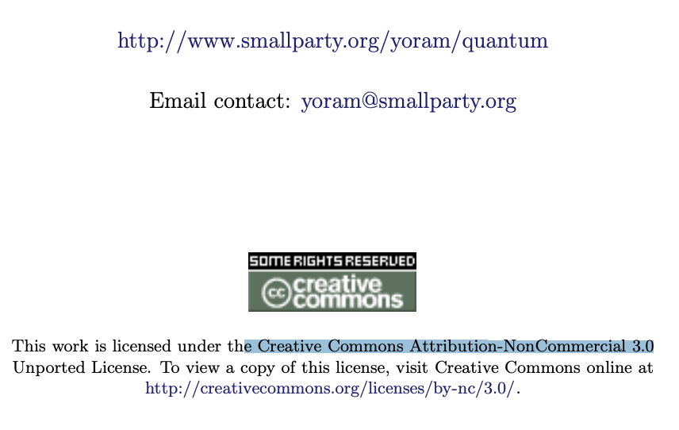

```{r, include=FALSE}
knitr::opts_chunk$set(echo = TRUE)
```

#### Download,  access and run project_setup.R ####

(Note: we ultimately can do this in main, but this is a bridge)


```{r download-project-setup}
library(here)


library(devtools)
tryCatch(
  {
     download.file(url = "https://raw.githubusercontent.com/daaronr/dr-rstuff/master/functions/project_setup.R", destfile = here("code", "project_setupX.R"))
  },  error = function(e) {
  print("you are not online, so we can't download")
  }
)

tryCatch(
  file.rename(here("code", "project_setupX.R"), here("code", "project_setup.R"))
)
```

```{r run-project-setup}

source(here("code", "project_setup.R"))

```


```{r install,  echo = FALSE, include=FALSE}
library(png)
library(grid)
```

```{r, include=FALSE}
#install.packages("webshot")
webshot::install_phantomjs()

```

```{r, eval=FALSE}
install.packages("bookdown")

# or the development version
# devtools::install_github("rstudio/bookdown")
```

<!-- Download 'backup' bibtex file from dropbox (synced with Zotero), do the rename workaround -->


<!-- note installing packages is mainly removed because this is done in baseoptions.R -->

```{r, include=FALSE }
# automatically create a bib database for R packages
knitr::write_bib(c(
  .packages(), 'bookdown', 'knitr', 'rmarkdown'
), 'packages.bib')
```

```{r somefunctions, include=FALSE}

#possibly move these to a separate file

#multi-output text color
#https://dr-harper.github.io/rmarkdown-cookbook/changing-font-colour.html#multi-output-text-colour
#We can then use the code as an inline R expression format_with_col("my text", "red")

format_with_col = function(x, color){
  if(knitr::is_latex_output())
    paste("\\textcolor{",color,"}{",x,"}",sep="")
  else if(knitr::is_html_output())
    paste("<font color='",color,"'>",x,"</font>",sep="")
  else
    x
}

```

```{r html, include=FALSE}
# globally set chunk options
knitr::opts_chunk$set(fig.align='center', out.width='80%')

my_output <- knitr::opts_knit$get("rmarkdown.pandoc.to")

```


<!---
Can define text blocks here, refer to them again and again if desired
To add to ELE:
1. zip all content in '_book' folder
2. drag into VLE site
  - on prompt, create file resource
3. edit settings
  - right click and unzip
  - double-click starting file
  - set as main file
  - save
Now it is only accessible within the university login
-->


# Notes for (Beem101 Microeconomics) students; overview {-#note}

**Notes by instructor [David Reinstein](davidreinstein.wordpress.com/)**

```{r  fig.cap = 'Famous photograph by Ansel Adams, who loved black and white photography, colorised using Jason Antic\'s de-oldify', out.width='50%', fig.asp=.4, fig.align='center',  echo = FALSE}
 knitr::include_graphics("picsfigs/ansel_halfdome_coloronly.png")
```


## Reading and using this web-book {-}

```{block2,  type='note'}

This web book is designed to be read on on a computer or a tablet (an iPad works well, I imagine other tablets will also work). But it is not designed for a mobile phone. Nor is it easy to 'printed out and read', or read on an e-reader (Kindle etc) in its current format. There are a lot of 'folds' that need to be opened to get the most out of this.  I am working on making it available as a pdf, but this will take some time to do. 

```  


## Focus and style of this module {-#focus}

<!--
*Note: [In the next section](#outline), I give a brief---and then a descriptive---outline of the 'story of this module' and the we will consider... and why these are interesting.*
-->

\

**This is...**

1. a **Microeconomics** module.  We will learn and use maths and rigorous logic to consider deep questions of:
- Individual preferences, choices and optimization subject to constraints
- How individuals interact with one another, and the consequences of this (Game theory and mechanism design/agency problems)
- "Markets", prices, and "welfare" (how much value is created, who gets what, how do we consider these outcomes as a society)
- Psychological influences on the above, and limits to optimization (Behavioral Economics)

\


2. a  **Selective and bespoke** module

We will not cover 'all of Microeconomics'.  I will **focus on a limited set of concepts, models and application**s (and academic articles) that I hope you will find most interesting and useful.

We will skip many major important topics. But that's OK. We will learn tools, 'modes of thinking', and 'modes of proving results' that should strengthen your brain muscles and help you understand a much wider body of material.

- I often focus on models with 'surprising' or 'counter-intuitive' results. If you can explain the logic behind these (as well as the maths), you have achieved an understanding beyond a layman's intuition.

- I will try to incorporate a small set *applications* that are particularly relevant to your careers and your research interests.
,
<div class="marginnote">
I may also try to incorporate data, statistics/empirical modeling, and 'computer coding' because these will be super-important in your career.
</div>

*Please give me feedback on what you are interested in.*


3. an **Inquisitive module**: we ask **the 'how?', 'why?', 'so what?', and 'is this reasonable?'** ... of the models and concepts

When studying Economics, I often saw models presented, with strong assumptions, without any explanation of what these were for and how they could be justified. In this module we will always be skeptical and carefully ask 'what is the purpose' of each model and concept.

<div class="marginnote">
For example, 'what does it mean to say that something is a mixed-strategy Nash equilibrium?' ... Do we expect people to actually randomise in this way?
</div>


## Level of this module {-#level}

This module is adapted to students from a variety of backgrounds.


For students interested in pursuing a PhD in Economics, and interested in research:

- We will cover some approaches and relevant building blocks, and I will point you to relevant materials for further enrichment
- I will incorporate content from academic literature ('articles in peer reviewed journals') and sophisticated research considerations
- I will incorporate my own research, research methods, and 'really getting our hands dirty' in digging into research questions, building theoretical (maths) models, and even perhaps experiments, coding, and data analysis.
- We will discuss *your* proposed research, relate microeconomic theory and models to this, and bring this into coursework
- I will try to help you 'think, research and write' like a good economist. (See my [Writing and research guide here](https://daaronr.github.io/writing_econ_research/about-this-work.html)).

\

*However, please note that will not fully prepare you for doctoral study and academic research that requires advanced Microeconomics. MRes programmes and modules are better geared to this.*


\

For students coming from backgrounds with limited Economics training and limited abstract maths:

- I will explain most concepts 'from the ground up', or point you to what you will need to revise.

- I will present most material *also* at an intermediate level, using diagrams and simple intuition.

<div class="marginnote">
But note that you need to have SOME background in Economics to do well in this module. This is an MSc-level Economics module, after all.
</div>


\

For students who are not as fluent in English as they would like to be (perhaps many/most of our students):

- I will try to communicate clearly and at a reasonable pace, avoiding slang and using diagrams and maths to convey ideas

- Most of what I say in lectures/videos/tutorials is also in writing here in this web book (or in links)

- I will strongly encourage you to participate actively and try to help you improve your English communication skills.

- Interacting with  my [Writing and research guide here](https://daaronr.github.io/writing_econ_research/introduction.html) should also be helpful for this (and for your dissertation, if you will be writing one).


## Readings and resources {-#readings}

This module will use a variety of resources: I will guide you through this via the online text that you are reading now.. **Consider this the 'governing resource'.**

This draws heavily from several texts and other resources, **all of which are free and available online**. I will make it clear what come from where, and where you can find additional readings.

In particular:

1. "O-R": [Models in Microeconomic Theory, by Osborne and Rubinstein](https://www.openbookpublishers.com/product/1171)


```{r  fig.cap = '', out.width='50%', fig.asp=.4, fig.align='center',  echo = FALSE}
 knitr::include_graphics("picsfigs/models-text-cover.png")
```


> Our main aim is to give the reader an understanding of the concepts of model and equilibrium in microeconomic theory

This book is very precise, abstract (in a mathematical sense), and extremely well-written and full of wisdom and insight. It is *dense*; don 't worry if it takes you a long time to digest each concept (but if you get stuck, please do ask questions and try different approaches).  It is the most relevant (at least of these three) for further postgraduate/PhD study.

The authors claim 'the mathematics we use is elementary'. However, I think it contains a deep sort of maths that you will find challenging. As they say, 'many of the proofs involve sustained logical arguments'.


2. [Introduction to Economic Analysis version 2.1 by McAfee, Lewis, and Dale](https://www.scholars.northwestern.edu/en/publications/introduction-to-economic-analysis-v21)

This is a more traditional text, with more 'computational-style' problems. It covers a wider set of Economics concepts than the others.


3. "QMC": [Quantum Microeconomics with Calculus](http://www.smallparty.org/yoram/quantum/quantumcalc.pdf) by Yoram Baumann, the self-proclaimed 'World's First Standup Economist'

This is somewhat less rigorous than O-R, but it has its own strengths. It approaches the material in an unusual way, and covers some material that is non traditionally covered in Economics courses (and skips many core concepts).

As I am incorporating some material *directly* from these works, I include the licences below (in the fold).

```{block2,  type='fold'}

Osborne and Rubinstein: [creative CC BY-NC-ND 4.0](https://creativecommons.org/licenses/by/4.0/)


\

I could not find the license information for the McAfee et al text.

\

Baumann (QMC): Creative Commons Attribution-NonCommercial 3.0




```


- We also make use of academic articles and working papers as well as some of my own writings... these are mentioned below

\

### Other relevant resources {-#other-reseources}

**Simpler resources** (unfold if interested)


```{block2,  type='fold'}

- Varian, Hal R., Intermediate microeconomics: a modern approach. New York, NY: WW Norton & Company, 2010: Somewhat less formal than O-R but it also covers a wider set of material and computations.

- Intermediate Microeconomics and its Application (an Undergraduate text) by Nicholson and Snyder. We have used this for a good chunk of this module in past years. It is at a very basic level, in terms of the maths. Free online access to this text may be available through your university/library (this works at Exeter) via [www.vlebooks.com](https://www.vlebooks.com/)

- A free alternative, at a similar level: [Microeconomics an Open Text by Douglas Curtis and Ian Irvine](https://open.umn.edu/opentextbooks/textbooks/microeconomics-markets-methods-and-models)

-  Microeconomics by Hugh Gravelle and Ray Rees (version 3, widely available online for free):  A somewhat more advanced-intermediate-level text which I think you will find very useful; this is not yet officially Open-Source, but you can find it online for free (and the authors are OK with this, I have emailed them). Just do a web search for 'Gravelle and Rees Microeconomics' and you will find the pdf

```

\

**More rigorous, advanced and applied work will draw from**

- David Autor’s MIT Open Courseware “Microeconomic Theory and Public Policy”; [all the files for this course can be downloaded here](https://ocw.mit.edu/courses/economics/14-03-microeconomic-theory-and-public-policy-fall-2016/lecture-notes/); this will give you a flavor of the PhD level micro.

(License information in the fold)

```{block2,  type='fold'}
David Autor. 14.03 Microeconomic Theory and Public Policy. Fall 2016. Massachusetts Institute of Technology: MIT OpenCourseWare, https://ocw.mit.edu. License: Creative Commons BY-NC-SA.

```

\

**Also**

For maths, see also [Mathematical methods for economic theory](https://mjo.osborne.economics.utoronto.ca/index.php/tutorial/index/1/toc) ... also free online!

\


## About this web-book: the Governing Resource {-#this-book}

**Welcome to the exciting world of Microeconomics**

I wrote this web-book to outline all of the material you are responsible for,  and to give you more resources and insight than I can convey in the short  amount contact time that we have.   I *don't* mean you're simply responsible for material in these printed notes:  I mean that these notes will aim to *refer to* everything that you are responsible for.

This web-book is meant to be a complement to the texts and readings (and to  lectures/videos,  tutorials/problem sets and other material on the module web site) and to tie all of this together.

<!-- I am providing you these notes both as a complete file as well as divided by lecture week (approximately). Use either version.
-->

 I will try my best to stick to the structure outlined in this web-book.  However, things may adjust slightly as we go and I will need to make updates to this as we go along.  I will keep you informed of any changes via the ELE (VLE) forums and the ELE page in general.

<br> \bigskip

*Web-book versus slides?: (unfold)*

```{block2,  type='fold'}

At times I will present material using slides.  This web-book should include all of the slide material *plus* explanatory notes and enrichment material. (However, I left out some of the jokes.) I use some abbreviations before certain notes to help you understand how to digest this.  I will also  make the slides themselves available even though they are redundant– this web-book has everything that slides have.

```

<br> \bigskip


### 'Markers', abbreviations, and callouts/boxes {-#markers}

- OR:  Osborne and Rubinstein's [Models in Microeconomic Theory](https://www.openbookpublishers.com/product/1171)


- 'McDL' refers to the [McAfee, Dale and Lewis text](https://www.scholars.northwestern.edu/en/publications/introduction-to-economic-analysis-v2)

- 'QMC' refers to ['Quantum Microeconomics with Calculus'](http://www.smallparty.org/yoram/quantum/quantumcalc.pdf)  (Baumann)

- 'DA' refers to [David Autor's MIT open courseware notes for Microeconomic Theory and Public Policy](https://ocw.mit.edu/courses/economics/14-03-microeconomic-theory-and-public-policy-fall-2016/lecture-notes/)


<!--
- 'LC' indicates a lecturer comment I may make in lecture that you don't need to worry about (I meant to cut these but I sometimes forget to)

`r format_with_col("Text in this color usually refers to questions you should  try to answer on your own (and I sometimes provide suggested answers in a folding box or footnonte. Try to answer it yourself first.)","brown")`

`r format_with_col("Some text may be  given in gray to indicate that this is a side point or a discussion.","gray")`

-->

- **'Comprehension Q:'** A question you should be able to answer if you are following along.


\


**Margin notes:**

(Look on the right... $\rightarrow$)

<div class="marginnote">
These reflect brief comments, hints, side points, or reference links.

</div>


\

**Folding boxes:**

I will occasionally put additional material in boxes that can be unfolded. Sometimes I do this with "question and answer" so you've an opportunity to consider the answer before peeking. I also will do this with some material that involves a side conversation, or material that is very tangential, and would otherwise clutter up the text.

Look in the fold:

```{block2,  type='fold'}

Greetings from the fold! The weather is nice in here.
```

<!---
batch file: 'bash \$HOME/"Google Drive/exeter_teaching/be2024/compileslidesnotes.sh"'
-->


```{block2,  type='note'}

I will use these boxes for 'notes' expressing material that is important, but is somewhat 'aside' from the main content.
```

```{block2,  type='tip'}

This color of box is used for 'hints and tips'.

```

```{block2,  type='warning'}

Boxes like this indicate 'warnings' ... usually highlighting ways that students often *misunderstand* particular content.

```


\

### Leaving comments and asking questions *within this book* using Hypothes.is {-#hypoth}

As you read this book, you can

- put comments/question right in the text,

- see and respond to other's questions/comments (these should be highlighted in yellow and)

- see my answers and responses (I will periodically check this),

- leave comments and answer specific questions asked in the text, offering me valuable feedback.

You can do this using a browser tool called [hypothes.is](https://web.hypothes.is/) (you can go to their site to learn more about this tool).   Sign up for a [hypothes.is account](https://hypothes.is/signup) (this takes 2 minutes and it's free).

<div class="marginnote">

It will be better if you get an account that identifies you to me, so I can follow up with individual feedback and learn more about who you are. However, it's also fine if you want to make your account ID basically anonymous... or you could even get two accounts,  if you prefer.

You don't need to install anything. However, if you install the Hypothes.is plugin for your browser this will give you the additional ability to leave comments on other sites and start private groups.

</div>

**To add a comment or question**

After you've an account (and you are signed in), to add a comment or ask a question here, just:

1. Highlight some text


```{r  fig.cap = 'highlighting text', out.width='65%', fig.asp=.4, fig.align='center',  echo = FALSE}
 knitr::include_graphics("picsfigs/hyp_select.png")
```

2. Click the 'annotate' icon that comes up
3. Write your comment or question

- Write your question in the box (see icons to use math notation and other features)
- Please add the tag 'beem101' to help others search for this.
- Click 'post to public'


```{r  fig.cap = '', out.width='55%', fig.asp=.4, fig.align='center',  echo = FALSE}
 knitr::include_graphics("picsfigs/hyp_comment.png")
```

- I will periodically browse and respond.


\

**To view existing comments/questions from yourself and others**

- You should see these highlighted in yellow if you are signed in (I think), as well as with little markers with the number '1' on that sidebar


```{r  fig.cap = '', out.width='40%', fig.asp=.4, fig.align='center',  echo = FALSE}
 knitr::include_graphics("picsfigs/sidebar_hyp.png")
```


- If you click the 'eyeball' on the side you can turn this off and on
- If you click the 'paper' on the sidebar, you can open up and see the existing notes (and respond to them)


```{r  fig.cap = '', out.width='40%', fig.asp=.4, fig.align='center',  echo = FALSE}
 knitr::include_graphics("picsfigs/hyp_anot.png")
```

\

**Sometimes, in this web-book I will specifically ask you to give answers, suggestions, and feedback on specific questions**

I will write something in a box like the one below

```{block2,  type='inputq'}

Please let me know how Hypothesis is working for you by leaving a  Hypothes.is comment HERE.

```

This means I really want you to put a comment exactly at that point in the web-book, and I'll be watching for these.


### Some more cool things about this book {-}

Look at the icons that should appear on the top of the page:

```{r  fig.cap = '', out.width='75%', fig.asp=.4, fig.align='center',  echo = FALSE}
 knitr::include_graphics("picsfigs/top_icons.png")
```

\

These allow you to:

- Hide/show the outline bar
- Search the full text for a word
- Change the font style, color, and size
- Show keyboard shortcuts


```{r  fig.cap = 'For example, you can choose nighttime serif font', out.width='95%', fig.asp=.4, fig.align='center',  echo = FALSE}
 knitr::include_graphics("picsfigs/night_font.png")
```


### Tech details of this book ('do I call this 'collophon'?) {-#collophon}

I created this in Rmd (the 'R languages' 'markdown'), including some latex and html code too, with features adapted from the 'Tufte' package.

This is all put together by  Knitr and Bookdown using the 'Pandoc' conversion tool into an Html file which I'm hosting via Github pages for now. For details on how this works, I have a guide (to how I work in a similarly constructed 'bookdown') [HERE](https://daaronr.github.io/ea_giving_barriers/bookdown-appendix.html).

I'll occasionally use/show some R code; you should consider getting proficient in R and developing other 'data-sciencey' tech skills (things like R, Python, Stata, git, vim, shell scripts...)

Let me know if you want to look 'under the hood'...

```{block2,  type='fold'}

All source material and code can be accessed [on my Github repo](https://github.com/daaronr/micro-giving-pub)

```

## Welcome and introduction videos outlined {-#welcome-vids}

1. Welcome, introducing myself and the module

```{block2,  type='fold'}

- Welcome to this module
- I'm Dr. David Reinstein (feel free to call me Dr. Reinstein)

- My background
  - (grew up in USA:  New England/NY, in UK 14 years)
  - PhD in UC Berkeley, love California
  - Very interested and involved in research and it's application: behavioral economics, charitable giving and 'doing good', field experiments and data on individual decisions

```

\


What you will get out of this module and your Exeter experience: interaction (unfold)


```{block2,  type='fold'}


Not to hear what I have to say/write, but to

- Ask detailed questions in your own words and get answers, suggestions and feedback, with many followups

- Show your ideas and understanding and get my feedback (and possible 
recommendations/references )

- Be part of exciting discussions and problem-solving with me and with fellow students

- Work on a project to build your understanding, ability to apply concepts from the module, communication skills...  and to get feedback on your ideas ... helping you prepare for your dissertation and professional projects


Interact...

- In synchronous sessions and tutorials (and in comments on pre-record)
- On the ELE forum
- Within this web-book itself!
- In my office hours (or by appointment)
- Possible additional discussion groups and breakout rooms with your peers, which I will moderate
- Through your project and presentation (coursework), which I'll give you feedback on


```

\


3. The web book, the text book, and other resources

```{block2,  type='fold'}

Web book:

- Online, open-access
- Continually updated and adapted to your interests and ideas
- A variety of formats (text, expansions/links, math, Q\&A, data/code, video, interactive)
- You can ask questions and make comments *right in the book* using hypothes.is!!! (including with math notation)

\

ELE

- Organisational, parameters of the module
- Announcements and the 'forum'
- A variety of other tools and resources for interacting,
  - including possible collaborative wiki and note taking


\

The main textbook (mostly)

- Martin Osborne and Ariel Rubinstein: leading researchers, thinkers, and communicators in microeconomics, especially Game Theory and Behavioral Economics

- Online and open-source $\rightarrow$ at the core of a potential global conversation

- Very rigourous, formal and logical (including maths) but not too 'computational'

- Very good at explanations, examples, counter-examples, and motivation. The exercises are interesting applications in themselves!

- Considers the assumptions and the 'why carefully' ...
- not just the 'standard classical differentiable models' but 'behavioral economics' is considered throughout, and models relaxing the 'standard assumptions'

\

Other resources for interaction include...

- Hypothesis notes throughout the web
- Potential: Zoom, Teams, other 'live' tools
- Collaborative docs and wikis perhaps?


```


## Aside: A bit about me (Dr. David Reinstein), contact info {-#aboutme}

### Me {-#me}

[Dr. David Reinstein](davidreinstein.wordpress.com)

<center> *My name is David, but you can call me Dr. Reinstein.* </center>

- [My CV with links](https://daaronr.github.io/markdown-cv/)


\

#### Me cluttering up the WWW {-}


- [My main/older research (Wordpress) page](davidreinstein.wordpress.com/)


- [My Google scholar (research and publications) page](https://scholar.google.com/citations?user=ZGVPBmUAAAAJ&hl=en)


- [My Exeter page](http://business-school.exeter.ac.uk/about/people/profile/index.php?web_id=David_Reinstein)

- [Catalyst: Berkeley Initiative on Transparency in the Social Sciences](https://www.bitss.org/people/david-reinstein/)


Twitter: \@givingtools <a href="https://twitter.com/GivingTools?ref_src=twsrc%5Etfw" class="twitter-follow-button" data-show-count="false">Follow @GivingTools</a><script async src="https://platform.twitter.com/widgets.js" charset="utf-8"></script>: I mainly post about research into charitable giving and prosocial behavior, and about research tools and methods 

\

*Project pages*:

- [Innovations in fundraising: a collaborative project](innovationsinfundraising.org)


- (Give if you Win project page)[giveifyouwin.org]


- [My github repositories](https://github.com/daaronr)


\

**Other web books (in progress, feedback welcomed):**

[Barriers to effective giving (in preparation)](https://daaronr.github.io/ea_giving_barriers/index.html)


[Researching and writing for Economics students](https://daaronr.github.io/writing_econ_research/about-this-work.html)

```{block2,  type='tip'}
*You may find the above web book helpful in considering and writing your MSc dissertation!*
```


\


### Office hours: (TBD; see ELE) {-}

- Also by appointment (sign up [HERE](calendly.com/daaronr/phone-skype-etc-meeting-any-time)


Office: 1.39 Streatham (or online/remote, depending on Coronavirus situation)


<!---
Easy link to make appointments: https://calendly.com/daaronr/out-of-oh-mtg-need-to-confirm
-->


\
*My research interests:* Applied and empirical microeconomics across a broad range of issues, and the impacts on policy and on business and nonprofit innovation

- Charitable giving, other-regarding behaviour, effective altruism
- Price discrimination by income
- Impact of HE institution on income and life outcomes
- Communicating with policymakers, managers, entrepreneur; *Impact*
- Policy markets (mechanism design)
- Open science: data-sharing, meta-analysis and replication
- "Data science"


You can see some of my research on my [Google Scholar page](https://scholar.google.com/citations?user=ZGVPBmUAAAAJ&hl=en), and at the links below

\


\


### Contact information {-#contact-info}

Email: d.reinstein AT exeter.ac.uk, or daaronr AT gmail.com

Office hours: (TBD; see ELE)

- Also by appointment (sign up [HERE](calendly.com/daaronr/phone-skype-etc-meeting-any-time))

Office: 1.39 Streatham (or online/remote, depending on Coronavirus situation)


<!---
Easy link to make appointments: https://calendly.com/daaronr/out-of-oh-mtg-need-to-confirm
-->


## How to do well in this module {-#success-tip}

```{block2,  type='tip'}

1. Put in the work

- Read the handout and the suggested parts of the texts/readings x (as outlined in this handout); ask questions and make sure you understand the answers


- Do the problem set questions and practice exercises, the suggested questions in the web-book. Respond to the discussion questions and get feedback.

\

2. Learn from the 'ground up': You cannot 'skip' learning steps. If you do not understand the concept *behind* the concept being explained, go back and learn it.

2. Care about the *content*: Care about *actually* understanding this stuff. This will be rewarded. Don't try to game this. It's easier and better to just learn this stuff. Try to achieve *Real Understanding*: Be able to explain this stuff in your own words (in writing) and apply it to new situations

3. Interact and discuss: Peers, Forum, office hours (see above)


4. Be careful you know how to interpret the midterm exam instructions correctly, as well as the instructions for the project. Use your time wisely.


5. For the project: start writing and outlining as you begin and as you progress -- don't wait to write things down. Be in contact with me (and your fellow students) to continually discuss how this is going.


6. *Skills to hone and build.* Your success in this module will depend in large part on building and applying maths skills and tools, as well as strong reading/writing/logic and communication abilities. You should build the ability to comprehend and respond carefully and logically to nuanced questions, in careful writing, orally, in maths, and in diagrams. Be able to incorporate quantitative reasoning, logic, and the ability to understand and clearly express ideas, to correctly characterise and describe theories and evidence, and to apply learned principles to new situations.

```

```{block2,  type='tip'}

تحذير, 警报, ескерту, การเตือ, चेतावनीน

: Suggestion 5 above is especially relevant for non-native speakers of English.

```  

## See also: {-}


Some ['Fortune Cookie Wisdom'](#fortune) that may help you think about the material in this module, and Economics in general.

Although we are not focusing on 'market failure' in this module (BEEM101, 2020), there are some interesting examples I often discuss, of how these can lead to business opportunities. See this [supplement](#mkt-fail-bus)... and let me know your thoughts.

<script async src="https://www.googletagmanager.com/gtag/js?id=UA-148137970-5"></script>
<script>
  window.dataLayer = window.dataLayer || [];
  function gtag(){dataLayer.push(arguments);}
  gtag('js', new Date());

  gtag('config', 'UA-148137970-5');
</script>


<!--chapter:end:index.Rmd-->

# Outline and description of module {-#outline}

## Briefly {-}

- **Introduction, the meaning of models/theory** (about 5\% of module)

-  **Preferences and ‘choices subject to constraints’**....  basic Economic (and behavioural) models (about 20\% of module)

- **Decision-making under uncertainty**, and its implications for Finance. ($\approx$ 10\%)

- **Consumer and market demand and its properties**  (preferences and optimization leads to this) ($\approx$ 10\%)
<
- **Profit maximising price-setting firms** ... How (esp. monopoly) firms consider demand in making (esp. pricing \&  market segmentation) decisions to maximise profit. ... evidence on this. ($\approx$ 15\%)

- **Mid-term** examination about here

- **Game theory** : ‘Choices and outcomes in **strategic settings**', using the tools and language of Game Theory (and, time-permitting, bargaining theory, asymmetric information and ‘Principal-Agent’ models). Evidence. ($\approx$ 20-25\%)

- **Research/application skills** considering/discussing **'final project'**;  ... How to consider, asses, write about and use models and evidence... building and incorporating these into an applied or research topic. ($\approx$ 5\%)

- **Supplemental** material is provided, which we may discuss, time permitting; these may relate to your research project


\

### Motivation with puppets {-}


<iframe width="560" height="315" src="https://www.youtube.com/embed/92Y3oAe-iUE?start=1" frameborder="0" allow="accelerometer; autoplay; encrypted-media; gyroscope; picture-in-picture" allowfullscreen></iframe>


Some key questions and topics for this module (video notes below the fold):

```{block2,  type='fold'}

Key topics:

1. Preferences and choice

- Supermarket choice example; two 'decision modes'; business 'big data modeling' implications

2. Consumer demand

- Esp., how it responds to prices and income, and the implications of this.

3. Preferences and choices under (probablistic) uncertainty (building blocks for finance!)

- How do we value 'a bundle of possibilities' against another bundle ... and how do we choose among these?
  - Insurance, investments, life choices (university, job), consumer choices
  - 'Risk aversion' and the returns to risk

4. (Monopoly) firms: product offerings, pricing and segmentation

- How do they max (LR) profits in light of consumer choices?
- What are the implications of this for society?
- How can they 'do segmentation' to boost profits?
- What do they actually do? (Using data?)

5. Strategic interaction and game theory

- E.g., 'which side of the street to walk on?', 'how much to charge/produce if there is a competing firm?', 'should I ask my partner to marry me?', 'how much should a political campaign invest in advertising in a particular state/county?'


- Is there an advantage or disadvantage to 'being the first to make an offer' in bargaining?

- When should I wear a mask? What should we predict about 'who wears a mask' and what should increase or decrease this?
  - 'Other-regarding' preferences (BE) may enter here!

\

Throughout, but with supplements at the end:

- Behavioural economics
- Applications and evidence from the real world and the 'laboratory'
- Research and research skills (reading/writing, mathematical modeling, critical thinking, considering applications to the real world and to data, research integrity)

```


Note: contrast from previous years (unfold)

```{block2,  type='fold'}

The 'story of this module' (in the video and fold above) is modified from how I structured it in prior years. In contrast to the approach I'm taking now, Microeconomics is often taught in terms of:

1. 'building blocks of the market' on the consumer and producer side
2. putting this together to consider the market in 'general equilibrium' under perfect competition, and the welfare consequences of this
3. market failures and departures from perfect competition.

This year (in this web book) I'm taking a different path. We are focusing instead on the meaning, tools, and structure of decision-making and on how to consider and apply models. I will put a strong  emphasis on uncertainty, strategic interaction, and behavioral economics/psychology. There is *less* focus on welfare, market equilibrium, or the model of production.

```


## Planned syllabus, coverage (detailed) {-#coverage}


```{block2,  type='note'}

The planned module outline is below.

All timings are approximate and may need to be adjusted. Some material may be cut for time constraints.  Feel free to skip over the first time you read these notes; you may want to refer to this later. 

The relevant part of this outline will be repeated at the beginning of each section within this book. After I add the material to that section, I may remove it from this outline.


```


### Overview of module \& rules, discussion/background, [Economic models (\& maths tools), 'empirical' evidence](#intro)  ($\frac{1}{2}$ week) {-}


<div class="marginnote">
This content will take roughly half a week to cover, but we will return to it later.
</div>

- Coverage and notes: below (on the present page)
- [Models, meaning, metrics, maths revision](#intro)
- [Interactive exercises  ('problem set')](#intro-exercise)

\

### Sec. \@ref(pref-util-choice): [Preferences and utility; Choice](#pref-util-choice) (1.5 weeks) {-}

What can we reasonably say about 'what people prefer and choose'? How can we state this carefully and precisely? What are the implications of particular 'reasonable' assumptions? (How) can we consider this in terms of 'optimization'? How have Economists and decision-scientists considered these questions?

Note on mathematical precision (unfold)

```{block2,  type='fold'}

This precision is relevant for Behavioral Economics (a specialty of Ariel Rubinstein and an interest of mine).  The text involves behavioral economics throughout.
... also relevant for building empirical 'models of consumer choices and preferences' in business/consulting settings.

We approach this in an abstract and logically and mathematically-rigorous, but not highly 'computational' way. Even if you have taken Economics as an undergraduate, you may not have seen this approach.

We will not always be quite so mathematically rigorous throughout the module. However, I want to give you  a 'flavour' of this approach and, and the tools at the core of modern microeconomics (and the approach taught in PhD programmes).

```

**Readings: see sec.** \@ref(reading-prefs) 

##### [Interactive exercises: preferences](#pref-exc) ('problem set') {-}

##### [Interactive exercises: choice](#ex-choice) ('problem set') {-}


###  Sec. \@ref(uncertainty) [Preferences under uncertainty (and over time)](#uncertainty) (1 week) {-} 

<div class="marginnote">
 
Here we follow the order of O-R in covering preferences under uncertainty *before* consumer behavior and demand. 

</div>

- 'Expected Utility'
- Risk-aversion, finance and diversification
- time-preference and discounting (briefly)

With uncertainty (outcomes are unknown when choices are made, but we assume the *probabilities* of outcomes are known), again ...

> What can we reasonably say about 'what people prefer and choose'? How can we state this carefully and precisely? What are the implications of particular 'reasonable' assumptions? (How) can we consider this in terms of 'optimization'? How have Economists and decision-scientists considered these questions?


\

Applications (esp. to finance):

- How do we express and measure 'risk aversion'?
- How does this affect (financial, investment, insurance) choices?  Why does 'diversification improve outcomes for the risk-averse'?
- How does this affect asset prices (Stocks, bonds, etc.) with 'efficient markets' (this will be briefly defined)
- Behavioral Economics: the "Allais Paradox" (first treatment, time-permitting)


\

Brief (first) presentation:

- Preferences (and optimization over) assets and consumption over time; 'discounting'

\

**Main Readings:**

*Web book*, and also...

- O-R Chapter 3: "Preferences under Uncertainty"


*Feel free to skip the following* (unfold)

```{block2,  type='fold'}

Feel free to SKIP:

... the proof of propositions 3.2 ('Continuity and independence implies EU'). It's interesting but we can't cover everything.

If you don't understand the proof of prop. 3.3. (the equivalence of risk aversion and the concavity of the Bernoulli function) that's also OK.

```

- McDL: 13.3 on 'dynamic choice'

\

**Other resources/references** (unfold)


```{block2,  type='fold'}


- QMC: Ch 5, optimization and risk; selections (good discussion of diversification but doesn't use utility functions)

- DA: [Lecture Note 16: Uncertainty, Risk Preference, and Expected Utility Theory](https://ocw.mit.edu/courses/economics/14-03-microeconomic-theory-and-public-policy-fall-2016/lecture-notes/MIT14_03F16_lec16.pdf)

- NS: Ch 4 (not including 4a)

- McDL: Ch 13, section 4 'Risk Aversion'


\

Supplementary recommended readings:

- Holt, C., and S. Laury (2002), Risk Aversion and Incentive Effects, American Economic Review, v. 92 (5): 1644-1655.

- For a popular audience: Reinstein (2016) 'Should you hedge your bets on a Brexit?' [LINK](https://davidreinstein.wordpress.com/2016/06/19/should-you-hedge-your-bets-on-a-brexit/)

```

\

#### [Interactive exercises - uncertainty('problem set')](#ex-uncertainty)  {-}


### [Consumer preferences, indifference curves/sets](#consumer_pref) (0.5 weeks) {-}

- O-R Chapter 4, selected parts

<div class="marginnote">
Note this chapter covers only a simple 2-good example. If time permits, we will consider the properties of examples with "$N>2$ goods"; $N>2$ is necessary to consider reasonable substitution patterns between goods for many applications. You will also probably learn the N-good optimisation in your maths (optimisation techniques) module.
</div>

\


*Within O-R chapter 4, feel free to SKIP (unfold)*:

```{block2,  type='fold'}

*Feel free to skip*

- Section 4.6 "Differentiability" (just look at figure 4.5 to get the basic idea)

```

Further readings tbd.
\
<!--
- AUT: [Lecture 3 - Axioms of Consumer Preference and the Theory of
Choice](https://ocw.mit.edu/courses/economics/14-03-microeconomic-theory-and-public-policy-fall-2016/lecture-notes/MIT14_03F16_lec3.pdf) (note, slightly different notation)
    - Simpler treatment - NS: Ch 2
-->


\

### [Consumer behavior/Individual (and market) demand functions and their properties](#demand) (1 week) {-}

- Formal definition
- Derivation of individual 'demand' from individual optimization
- 'Comparative statics': responses to changes in price, income, etc.;
 <!--   - Application: The mysterious 'Giffen good' -->

- Elasticities
    - Application: empirical models
- Aggregation and 'market demand'
- Welfare and consumer surplus (brief)


**Main reading** (largely integrated into web book):

- O-R Chapter 5 (selections; see [below](#demand))

- Alternative treatments (see below)

- Supplementary but recommended readings (see below)

#### [Interactive exercises - consumer preferences, behavior, demand ('problem set')](#ex-cons-pref)  {-}

### Noting a major "skip" {-}

**Note here that we are SKIPPING several key topics in consumer demand (unfold)**

```{block2,  type='fold'}

- In the consumer behavior, we are skipping core topics including formal definitions of Hicksian demand, substitution and income effects, and the Slutsky decomposition.


These are important for characterizing the welfare effects of price changes and policy changes (including taxation), and for conceptualizing issues involving multiple constraints on consumer optimization (e.g., rationing). I will provide notes on these for anyone who is interested.

```


\

We are also skipping most of the 'production side' (skipped material in fold)

```{block2,  type='fold'}

- Production functions, firm optimisation

- Perfect competition/competitive equilibrium; short and long run

- Supply and demand systems

- General equilibrium and it's welfare properties

- Market failures, including externalities/public goods (although these come back as examples in our Game Theory discussion)

*We this skip these chapters in the text(s). So skip O-R chapter 6 and skip any material on this in the other texts.*

 (Or read it if you want to; you might find it useful in getting an overall picture, but it's up to you.)

```

<div class="marginnote">

To the extent that these are relevant to material we cover later, I will give you the 'short version' when it comes up.

</div>

\


### ['Monopolies and pricing of profit-maximizing price-setting firms' (especially monopolies)](#monop); [price discrimination/market segmentation](#pd) (1.5 weeks) {-}

How would a firm that knows all the stuff above about consumer demand set prices in order to maximise its profit? What if it can segment its customers into different ‘markets’ with distinct demand functions? What are the consequences of all of this for profit and welfare?

Today’s businesses, consultants, data analysts, and regulators are extremely interested in these questions. This is a very practical topic. We will consider it both from the theoretical optimization point view (while always gaining insights from the maths). We will also dig into “what do firms *actually* do in setting pricing” and “how can data be used to do this better?”

\

**Main reading**

- O-R ch. 7 "Monopoly"

We will focus on the (standard) profit-maximisation goal, although their discussion of other goals is interesting.

They define consumer and producer surplus here to give a brief treatment of the deadweight loss of monopoly.

They also have a very interesting treatment of the two main types of price discrimination; 'Implicit discrimination' foreshadows asymmetric information and agency problems.

<div class="marginnote">
There are various names of each of these ... I am familiar with "second degree  = self-selection" and "third degree or 'explicit segmentation'". They call the latter 'Implicit discrimination.
</div>


\

*Alternative treatments (unfold):*

```{block2,  type='fold'}

- McDL: Ch 15 -- Monopoly
- NS: 11.2-11.4
- QMC: Appendix A.1 - Monopoly - the vanilla version
```

\
*Supplementary recommended readings (unfold):*

```{block2,  type='fold'}

- Article: [Should we help companies tailor prices to your wage packet?](https://theconversation.com/should-we-help-companies-tailor-prices-to-your-wage-packet-47719)
- With accompanying [worked examples](https://docs.google.com/document/d/16jos_PT9w1wGpyD5A8ZiWJ9HW6kaLOJH6EWc_AYWnkk/pub)
- More advanced: 'The Government May Want to Encourage Price Discrimination by Income' [Linked here](https://davidreinstein.wordpress.com/research-and-publications/)

- Material from data science and industry pricing practice to be incorporated here; see "Marketing" chapter in [Business analytics with R](https://bookdown.org/jeffreytmonroe/business_analytics_with_r7/)


```

#### Interactive exercises ('problem set') (tbd; unfold for basic idea) {-}

```{block2,  type='fold'}

OR question 1, double marginalization (very relevant and interesting!)

OR question 5-7

Possible exercise involving data and 'choosing a firm's best price and segmentation'
```

<!--
- ** Imperfect competition (brief) ** (multiple firms with market power; esp Bertrand/Cournot models)
-->

### Notes: Mid-term examination, and a major "skip" {-}

**We will have a mid-term examination at this point in the module.** This examination will cover all of the material up to this point, but it will be more heavily-focused on the earlier material.

\

<div class="marginnote">
 Note that here we are largely skipping  'imperfect competition' and interactions between firms. We may come back to this briefly in our 'game theory' examples.

</div>


### [Strategic interactions: Game theory](#game_theory) (and evidence) (2 weeks) {-}

The outcomes we care about don't only depend on what *we choose*, but on what *others' choose* (and perhaps we can also influence the latter). How should we think about choices and outcomes in such settings? What will we predict will happen in single or repeated interactions, and what will affect these outcomes?

\

- Strategic interactions
- Stating the game in 'normal' form
- Dominance, iterated dominance, Rationalisability
- Best response functions, Nash equilibrium in pure and mixed strategies

- Extensive-form games; sequential and repeated games
- Backwards induction and Subgame Perfection (subgame-perfect Nash equilibrium)
- Infinitely or indefinitely repeated games
- Games of imperfect information
- Behavioral economics: transforming material payoffs into *true* payoffs
- Evidence on play in strategic situations, including in 'experiments'

- Time-permitting: Research applications, e.g., 'Marriage markets and Tinder; Losing Face', 'Fair trade and consumer altruism'

\

Here *the web-book* is a key resource.  We will incorporate material from:

- O-R Chapters 15-16
  - *Skip* sections 15.5 (Strictly competitive games), and 15.6 (Kantian equilibrium)
  - In chapter 16, we may or may not skip the formal depiction of extensive/sequential games; this depends on our timing

\
In addition to (some) of the Game Theory material covered in O-R:

- We will also focus on 'Dominant strategies', and 'Iterated-strict-dominance'. Compared to 'Nash equilibria', these are (IMHO) more justifiable as *predictors of choices* especially in one-shot games.
- We will consider games involving asymmetric information, especially 'signaling games'

\

*Alternative resources (unfold):*

```{block2,  type='fold'}

- QMC: Ch 9, 10, 12 (includes 'iterated dominance')
- McDL: Ch 16
- NS: Ch 5 (parts)
- Several additional concepts from handout, plus supplement on experiments

```
\

*Supplementary recommended readings (unfold):*

```{block2,  type='fold'}


- Spence, M. (1973): 'Job market signaling,'? The Quarterly Journal of Economics, vol. 87, pp. 355-374.

- 'Ten Little Treasures of Game Theory and Ten Intuitive Contradictions' Goeree and Holt, 2001

- Further readings tbd
```

\

### [Project, discussion of research](project) (1 week) {#proj-outline}

BEEM101: The majority of your mark for this module will be based on a project that you will do, and on your presentation of this project to me.


<!--  (I will also consider an empirical project if you can strongly connect it to the material taught in this module.) -->

For this project you will construct, evaluate and discuss one or more mathematical models dealing with a specific applied or theoretical economics research question. Ideally, this will be related to the work you intend to pursue for your MSc dissertation. You will be required to present and discuss this work in a short live session (10-15 minutes).

This project can be an individual project or done in a group of 2-3 people. If it is done as a group, each student will *also* be asked to present a single page outlining their own contribution to the project, and each will be required to present their work to me individually.

Further details and parameters will be given. In the final half week, we will discuss our projects.

\

*A key reading/resource*:

[Researching and writing for Economics students, by David Reinstein](https://daaronr.github.io/writing_econ_research/about-this-work.html)


\

### Supplement (optional): [Behavioural economics: Selected further concepts](#more_be) {-}

- Overview: Limits to cognition, willpower, self-interest, applications

- Time-inconsistent preferences ('hyperbolic' or $\beta$-$\delta$ discounting)

- Reference-dependent preferences and 'prospect theory' (also re-capping the Allais paradox)

- Evidence for these 'anomalies'
  - Aside on  the nature of credible evidence, replication and open-science

- Modeling charitable giving and 'other-regarding behavior'; departures from and barriers to 'effective altruism'


\

*Supplementary readings (unfold)*

```{block2,  type='fold'}


Supplementary reading: theory

(31 Jul 2020 note: This will be revised)

- Amos Tversky & Daniel Kahneman, 1979. "Prospect Theory: An Analysis of Decision under Risk" (*Seminal*)

\

Supplementary reading: applications and empirical work

- DellaVigna, Stefano. "Psychology and economics: Evidence from the field." Journal of Economic literature 47.2 (2009): 315-372.
- Benartzi, S. & Thaler, R.H., 2007. Heuristics and biases in retirement savings behavior. The journal of economic perspectives, pp.81-104.
- Farber, H., 2008. Reference-dependent preferences and labor supply: The case of New York City taxi drivers. The American Economic Review. Available at: http://www.ingentaconnect.com/content/aea/aer/2008/00000098/00000003/art00021 [Accessed November 19, 2015].

\

Other-regarding behavior and charitable giving:

- Kellner, Reinstein and Riener, 2016. [Conditional generosity and uncertain income: Field and lab evidence](https://dl.dropboxusercontent.com/u/91553/Giving_and_Probability.pdf)

- Material linked at [giveifyouwin.org](giveifyouwin.org) and  [innovationsinfundraising.org](innovationsinfundraising.org)
- [Increasing effective charitable giving: The puzzle, what we know, what we need to know next](https://daaronr.github.io/ea_giving_barriers/outline.html)

```


### [Supplement (optional): Asymmetric information (Moral hazard, adverse selection, signaling) and applications](#asymmetric) {-}

'Principal-agent' models to be integrated into lecture notes

- Moral hazard and incentives
- 'Lemons model'
- Hidden information about types/adverse-selection (time-permitting)
- 'Live research' application (time-permitting): Financial market micro-structure and government policy

\

*Readings (tbd, unfold):*

```{block2,  type='fold'}

- O-R Chapter 14 on a market with Asymmetric Information (a highly formal treatment of the adverse-selection context)

```


## Scheduled lectures/tutorials, rules for assesment: see ELE page and module descriptor {-}

```{block2,  type='fold'}
The assessment will be a combination of a midterm examination, and a project and presentation due by end of term.
```

<script async src="https://www.googletagmanager.com/gtag/js?id=UA-148137970-5"></script>
<script>
  window.dataLayer = window.dataLayer || [];
  function gtag(){dataLayer.push(arguments);}
  gtag('js', new Date());

  gtag('config', 'UA-148137970-5');
</script>


<!--chapter:end:outline.Rmd-->

# Models, maths, fundamentals {#intro}

This, combined with the above outline represents approximately half a week of material

## Key goals of this chunk: {-#intro-coverage}


Get a sense of, and be able to explain:


1. What Microeconomics is about and why it is useful
2. What the point of 'models' are
3. Some *applications* of these models
4. Some examples of microeconomic models and questions (should be largely revision)
    - Get your econ brain flowing
5. Discuss maths revision: know which maths you need to revise (if any)
6. Discuss 'empirical work' in Microeconomics, and how it connects to 'theory'


**Main reading for this chunk:** this web book

\
Readings on 'what is Economics', 'what are the purpose of Economic models', etc.: The readings below are each optional, but you must read at least some of these*

Unfold to see these...


```{block2,  type='fold'}


- [McDL'](https://www.scholars.northwestern.edu/en/publications/introduction-to-economic-analysis-v2)  Chapter 1. A very simple undergraduate discussion of 'what is Economics, what are models' etc. You probably already know this but take a look just in case.

- Friedman, Milton. "The methodology of positive economics." (1953): 259. *Classic but perhaps outdated*

- [Sugden, Robert. "Credible worlds: the status of theoretical models in economics." Journal of Economic Methodology 7.1 (2000): 1-31.](https://www.jstor.org/stable/40267405?seq=1)

- [Sugden, Robert; Sitzia, Stefania. "Implementing theoretical models in the laboratory, and what this can and cannot achieve."  Journal of Economic Methodology, Vol. 18, 2011, p. 323-343.](https://ueaeco.github.io/working-papers/papers/cbess/UEA-CBESS-11-08.pdf)


<div class="marginnote">
We will return to the issues of 'what and why models' throughout the module.
</div>

```

## Empirics, maths revision

<div class="marginnote">
Some of the maths you need will also be simultaneously covered in your Optimisation and Econometric modules, sometimes at a higher level.
</div>

We will use some maths in this module, and now would be a good time to revise some of this on your own.

Here are some key elements.

<!-- #TODO: link some revision material -->

1.  We will consider the use of microeconomics in **'empirical identification'** of effects using data.  [The mixtape, Scott Cunningham](http://scunning.com/cunningham_mixtape.pdf) pp 18-22, provides a good introduction to this

2.  So called 'pre-calculus' and general maths concepts including
- The symbolic language and notation of maths, summation and product operators
- Multivariate and univariate functions (and mappings), inverses of functions, implicit functions
  - Plotting these functions over their domain and range; the 'level sets' of multivariate functions
  - Specific functions including: Logarithms/exponential functions, quadratic and higher-order polynomial functions, 'min' and 'max' operators
- Limits, Geometric series


3. Some elements of basic calculus, including, perhaps

<div class="marginnote">
However, in general I'm not asking you to memorize sets of rules; I'll give hints to remind you of these rules on any examination.
</div>

```{block2,  type='tip'}

Some very simple math revision [HERE](https://recapexeter.cloud.panopto.eu/Panopto/Pages/Embed.aspx?id=e0866970-34e1-4aa5-8385-8c1ef8d75b1c&autoplay=false&offerviewer=true&showtitle=true&showbrand=false&start=0&interactivity=all), from my prior lecture. However, you will find better coverage of this at Khan Academy (free) and elsewhere.

```  

- Derivatives and their interpretations
  - As 'slopes'
  - Higher-order derivatives and cross-partials, relevance for 'minima and maxima' (optimization)
- Integrals and their interpretation
- 'Total differentiation' of a function
- Constrained optimization and (perhaps) the Lagrangian method (probably optional)
- The implicit function theorem (probably optional) and 'comparative statics'

3. Some elements of **Set theory**, including open and closed sets, subsets, ordered sets, unions and intersections

4. Basic ideas of probability and expectation

5. The logic and construction of formal definitions and proofs
- Proof by contradiction
- Proof by construction

<div class="marginnote">
The logic of definitions and proofs may be the most important concept for this module.
</div>


<!--
- Math revision concepts in

- [DA lecture 3](https://ocw.mit.edu/courses/economics/14-03-microeconomic-theory-and-public-policy-fall-2016/lecture-notes/MIT14_03F16_lec3MathTools.pdf); we may use some of this

- QMC 1.3 (some good stuff; don't worry too much about all the derivative rules)

-->

\

```{block2,  type='technote'}

Optional: I may also occasionally use matrix and vector notation, and combine this with calculus (see concepts such as the 'gradient' and 'Hessian matrix'). However, these will be provided as supplements; you shouldn't consider these to be required.

```


## What is Economics? {#whats-econ}

\
<div class="marginnote">
*Note: DR: It has changed. There are different views. Ask two economists, and you'll probably get at least three answers.*
</div>

```{block2,  type='inputq'}
What is Economics? Please propose a definition (from your head... give your own impression) as a comment HERE using Hypothes.is. Then unfold the box below to see some proposed definitions and ideas.
```

<div class="marginnote">
For help on using hypothes.is please see [ABOVE](#hypoth) or go to https://web.hypothes.is/.
</div>


```{block2,  type='fold'}

1. “Economics is the study of the allocation of scarce resources among alternative uses.”

2. “Economics is the study of mankind in the ordinary business of life.” Alfred Marshall

-- The first quote suggests an *approach* (*how* we do our research), the second suggests a *domain* (what we focus on).


Another famous quote:
“Economics never tells a man how he should act; it merely shows how a man must act if he wants to attain definite ends.” - Ludwig von Mises

```


### What is Microeconomics? {-}

One definition, not necessarily the correct one: "The study of the (economic) choices individuals and firms make and how these choices create markets."

<br> \bigskip


Largely, using theoretical and mathematical 'models' that depend on strong assumptions.

`r format_with_col("Comprehension Q: Consider some examples of 'relevant choices' for economic study. ","gray")`

```{block2,  type='inputq'}
Students: please propose some of these as a Hypothes.is comment HERE.
```


What sort of models are we talking about?...

<div class="marginnote">
To refresh your memory... you have probably seen some of these models before in your previous economics module. You should have some familiarity with the simple models of supply and demand curves yielding an equilibrium price and quantity. You may also have seen a models of trade, between two countries or two individuals, with only two goods, where for each good one has a 'comparative advantage'. Other models involve 'strategic' interactions bwtween a few 'players'. Others involve individual 'optimizing' choices. Still others involve firms and governments setting 'mechanisms' trying to induce particular choices by others.
</div>


Consider: Are they ‘fully realistic’? No. They are models, i.e., simplifications.

A huge body of work has gone into making these models more complex and ‘general'; some of the conclusions are preserved, others are weakened or reversed. But even these more general models are simplifications.

<div class="marginnote">
But I don't find it satisfactory if people respond to a meaningful criticism of a model and the way it is being applied with 'it's just a model, and all models are abstractions.' Specific critiques need to be dealt with directly.
</div>


### So why learn these models, if they are not realistic?

Consider the parable of the tortoise and the hare (Aesop)...

- [Original version, English translation](http://read.gov/aesop/025.html)
- [Merrie Melodies version](https://www.youtube.com/watch?v=LthoQPO6YLE)

\

```{r  fig.cap = '', out.width='55%', fig.asp=.4, fig.align='center',  echo = FALSE}
 knitr::include_graphics(file.path("picsfigs","tortoisehare.jpg"))
```


One might question the realism of this story:

- Can hares really speak?
- Is this a rabbit or a hare?
- What other animals were racing?


Okay, the story is not so realistic. However, it conveys an important message. Is this message in any way affected by the answers to the above questions?

The same can be asked about many criticisms of simple economic models. Of course one should always consider the applicability of particular models to real-world problems, and carefully consider whether the assumptions are reasonable and relevant, and whether the departures from these assumptions will lead to any different predictions. However, in considering the general insight conveyed by the model, some criticisms can merely be distracting. At the very least, we should not reject economic models simply because they are not fully realistic, just as we do not reject Aesop's fables because they involve talking animals. The idea of 'Ceteris paribus' (all other things being equal) can help us here.

\

**Again, so why learn these models?**

- They are a starting point
- They (sometimes) make concrete predictions you can test
- They may be useful for building insight, clear arguments, a way of thinking


- Discussion is framed around these models and they are seen as a 'baseline'
- You must understand the arguments and models to be able to effectively critique or extend them

<div class="marginnote">
For example, some critics of what they call 'neoliberal economics' can be misinformed about what it is. Their criticism can sound to us mainstream economists like someone who says 'cars are dangerous and should be banned because they go too fast and have no mechanism for stopping'.
</div>

## Economic Models {#econ-models}


See audio/slides, from 101:25 - [HERE](https://recapexeter.cloud.panopto.eu/Panopto/Pages/Viewer.aspx?id=9B44DE1E-2569-4076-9D7B-AACC0064717D#)

**Economic model:**

One definition:

> A simple theoretical description that captures the essentials of how the economy works.

<div class="marginnote">
For the material we cover in this module, this definition would only work if we interpret the term 'economy' very broadly.
</div>

\


**What is economic theory and what can it do?**

Unlike “theory” in some other social science disciplines, economic theory is mostly based on mathematical modelling and rigorous proof that certain conclusions or results can be derived from certain assumptions. But theory alone can say little about the real world.


<div class="marginnote">
For example, my impression is that in Psychology a 'theory' can represent broad descriptions and stories summarizing and providing a framework for understanding empirical evidence.
</div>


In Economic theory we can prove theorems, essentially the logic of 'if-then' statements... 'if one assumes the following preferences, the following choice is optimising', etc. However, here the realism of the *assumptions* is always in question; as caricatured in this [Twitter 'meme'](https://twitter.com/rethinkecon/status/1164477365243785216/photo/1).


```{block2,  type='note'}

In Economics: Models = Theory = Uses Mathematics... for the most part.

```

Again, 'economic theory' and models generally do not provide evidence about the real world, they just tell us things like

> if (i) people make choices exactly as specified by assumption *X*, (ii) their choices will be the same as if they made these according to assumption *Y*, (iii) and the outcomes will have the following relationship (e.g., quantity demanded sloping downward in prices), and vice-versa.

But this doesn't tell us that people *do* make choices as specified by assumption *X*. We are simply showing the mathematical equivalence of (i), (ii), and (iii).

<div class="marginnote">

I discuss this further:
- in my 'writing book' [here](https://daaronr.github.io/writing_econ_research/theory-modeling-empirical.html) and
- [here](https://daaronr.github.io/writing_econ_research/methods-fields.html)

</div>


### Differing views about models

There are **differing views** on the meaning, purpose, and use of economic models.

```{block2,  type='note'}

This discussion is rather abstract but important. These concerns and issues may make more sense as we get into considering specific models in detail. So we will try to come back to this.

```

<div class="marginnote">
We will return to this in our discussions, and again when we consider the use of experiments. See the suggested  readings/notes on readings.
</div>

```{block2,  type='note'}


**Source reading**: The discussion below is largely from [@Sugden2017] ["Credible worlds: the status of theoretical models in economics." Journal of Economic Methodology  (2010)](https://www.jstor.org/stable/40267405?seq=1)


Sugden's paper mentions two famous papers, one of which is (Nobel Laureate George) Akerlof's "the Market for Lemons" [@Akerlof1970]. It would be worth reading some of Akerlof's paper and seeing how much you can follow; it is rather accessible. We may return to this specific model of asymmetric information later in the module, and it could certainly be relevant for your project.


If you are interested, I will set up a wiki to engage in a group discussion of these articles.

```

\

The  *instrumentalist* view:


The Methodology of Positive Economics [@friedmanMethodologyPositiveEconomics1953]: the ultimate goal of theory is to "yield valid and meaningful ... predictions about phenomena not yet observed."


- “Simplicity” -- ‘the less initial knowledge needed to make a prediction'.

- “Fruitful” -- more precise predictions, for a wider range of situations


\


In contrast, the *'Fictionalist'* view  [@Sugden2017]:

> describes a fictional world that is credible or truthlike in something like the way that the events of a realistic novel are; the model connects with the real world by relations of similarity

\

*Some considerations:*

Are these models predictive? If not, are they useful?  

- There are arguments for modeling optimising behavior even if it is *not* predictive.  


- There is some evidence for near-optimisation in some settings, and that choices move in this direction.

- There is also evidence of 'predictable irrationality' (or 'bounded rationality); this motivates behavioural economics.  There is also some evidence for the following (unfold).

```{block2,  type='fold'}


1. Psychological costs/benefits relating to *outcomes other than their own final consumption*. People may care about

- others' consumption (altruism etc.),
- about the way they *make* the decision
- ... and about how close they come to certain goals (see 'reference points' and 'loss aversion').

2. People have self-control problems.  They also may realize their short-term choices are not in their lt interest, and try to constrain themselves.

2. It is mentally costly to carefully calculate the costs and benefits $\rightarrow$  'rational inattention'

- As a result, people may follow simple rules or 'heuristics' to make their decisions easier; e.g., 'work every day until I've earned  target income'.

```


### The PPF: a 'model' and a way of seeing things

```{block2,  type='note'}

At this point we consider a simple and specific model to fix ideas, to make things less abstract. The NS text brings up the production possibility frontier; this is a common example to start with, although by itself it could be argued that 'the insights gained are basically by assumption' ... there is not really an additional reasoning step. Perhaps a better depiction of this example is in [the Curtis and Irvine open access text](https://open.umn.edu/opentextbooks/textbooks/microeconomics-markets-methods-and-models), sections 1.3-1.5, where they consider two individuals with distinct production possibilities, and derive the 'aggregate' ppf, and show the gains to trade.

```

```{r  fig.cap = 'Production possibility frontier', out.height='75%', fig.asp=.4, fig.align='center',  echo = FALSE}
 knitr::include_graphics(file.path("picsfigs", "ppf_cc.png"))
```

<div class="marginnote">
PPF file source [LINK](https://commons.wikimedia.org/wiki/File:Production_Possibilities_Frontier_Curve.svg), User:Everlong, CC-BY-SA-3.0)
</div>

Above, we see a depiction of the "production possibility frontier". You may be familiar with this from your previous study. The PPF describes the maximum amount of one good that can be produced conditional on a certain quality of another good being produced.

According to  [@nicholsonIntermediateMicroeconomicsIts2007]

The PPF illustrates key principles:

1. Scarce Resources

2. Scarcity involves opportunity cost.

<div class="marginnote">
- The opportunity cost of a good is measured by the alternative uses that are foregone producing it.
- On the PPF above the opportunity cost of more guns is less butter.
- The opportunity cost of a choice is the foregone 'next best' opportunity from a choice.
- I may just call this ‘cost’
</div>

```{block2,  type='inputq'}

Can you think of an example that illustrates the distinction between what is commonly thought of as the  'cost' and the economists' definition of an 'opportunity cost'?

```


3.  Opportunity costs are (often) increasing.

-  What this means is that as you produce more of one good, its opportunity cost (in terms of the other good foregone) increases.

- The “law” of diminishing marginal returns.

<div class="marginnote">
I'm somewhat sceptical of this being a 'law'; there are certainly increasing returns in certain regions. However, you will see it again and again as it is a fairly standard assumption.
</div>

<br>

**However**

I'm not sure if I would call this a 'model'. It certainly provides a way of visualizing the trade-offs in an economy, and the way it is drawn embody certain assumptions.

<div class="marginnote">
This graphic has a mathematical representation which we will not cover now.
</div>

Consider: How could we make this a meaningful 'model with assumptions'?  *I could imagine it as below (unfold).*


```{block2,  type='fold'}

To make this more clearly a 'model with assumptions', let's assume an economy with

1. Two possible goods: food and clothing
2. A single input into the production process for either good labour (L)
3. The economy has a fixed supply of labour $\bar{L}$.
4. The production function for food is $F_f(L)$ and the production function for clothing is $F_c(L)$, with both 'strictly and continuously increasing in their argument'. All firms have these same production functions (this implies there are no spillovers/externalities between firms, and no complementarities between producing each good)

5. Both production functions exhibit diminishing returns to scale (we leave off the maths for how to precisely define this for now)

```


These assumptions in the fold above could be considered a 'model' of an economy. Note that not everything has been specified. E.g., we might ask: i.  How many firms are there? ii. How do the firms compete in output and input markets? iii. What exactly are these production functions?  There are also clearly unrealistic elements, e.g.: i. Only two goods, ii.  Only one input, iii.  No complementarities in production

Still, the assumptions given will yield a PPF with the shape above: the 'feasible production set' of the economy will have a particular shape. It's 'maximal elements' constitute the 'frontier' of this set, which will be:

- downward-sloping, because each unit of the input ($L$) used to produce clothing cannot be used to produce food, and

- concave (increasing opportunity costs), because of the diminishing returns to scale for each good ... as more labour is diverted to clothing away from food, it becomes less and less relatively productive.

This seems to convey an insight that 1. teaches us a way of thinking and 2. seems likely to carry over into more 'realistic' models. At the very least, it suggests that, under any economic system, there *may* be tradeoffs between how much of each good or service can be consumed. E.g., policymakers may need to consider 'should we have more health care or more non-health consumption', rather than simply saying 'we should provide the best health care that money can buy to everyone.'

<div class="marginnote">
One might at this point raise the 'paradox of analysis': we have stated a set of 'assumptions' and then noted what logically follows. But actually, the 'results' and the assumptions are basically logically equivalent. So have we simply defined the answer we wanted to get, i.e., circular reasoning? This is a deeply philosophical issue.
</div>

The '*increasing* opportunity costs' insight seems more fragile, more dependent on a fairly strong assumption. How do we know that there are diminishing returns to scale for each good? There are plausible reasons why it may be the opposite... returns to specialisation as an economy, etc.

Furthermore, the model at *this* level of simplicity cannot speak to a number of questions. E.g., without a sense of the market structure (how many firms and how do they compete), we do not know whether we will *attain* the PPF-- the economy may end up producing at the inferior point 'C', for example.

A 'simpler' model is not necessarily better, nor necessarily worse.

<div class="marginnote">
For comprehension: *Be sure you can draw the PPF; consider its slope and what it means*
</div>

### "Supply and demand functions", the "Marshallian cross", "equilibrium effects" {-}

Perhaps the most famous model from micro-economics is what is often called 'supply and demand', the 'Marshallian cross'.

<div class="marginnote">

I try to avoid the terms 'supply' or 'demand' because it confuses whether we are referring to:

1. Supply curves and demand curves (or functions) *or*
2. *Quantities* exchanged (in equilibrium quantity demanded will equal quantity supplied in each market.

</div>

Is this helpful in explaining the real world?

Does it make better predictions than other approaches might do in terms of... (for example)?

- The impact of taxes on prices and quantities exchanged?
- The response of oil prices to events like the Coronavirus pandemic?
- Whether a tradesperson would find it profitable to increase his or her price when she seems to be getting more orders than she can handle?


<div class="marginnote">
Of course the simple model predicts that she should raise her prices in this situation... so there should never be a 'shortage' unless prices are restrained. However, when I tried to hire a plumber in Exeter in 2017 I was repeatedly told 'everyone is too busy', not 'rates are very high these days'. What could explain this?
</div>


\

### Models applied in the context of "returns to university education" {-}

We may ask a question something like:

> Is it worth the cost and time for the typical US high-school student to enroll in university ('college')?


In the US private university tuitions run at over £40,000 per year (for a four-year course!) There is constant popular (and academic) discussion of this. See some links below the fold.


```{block2,  type='fold'}
- [Please stop asking whether college is worth it](https://www.forbes.com/sites/dereknewton/2018/12/16/please-stop-asking-whether-college-is-worth-it/)


- [Is your university degree barely worth the paper it’s written on? Discuss](https://www.theguardian.com/commentisfree/2018/mar/16/university-degree-measure-benefits-tuition-fees)


- [The case against education, Bryan Caplan; LSE review](https://blogs.lse.ac.uk/lsereviewofbooks/2018/05/30/book-review-the-case-against-education-why-the-education-system-is-a-waste-of-time-and-money-by-bryan-caplan/)

\

*Note: the above are popular accounts, not academic Economic peer-reviewed publications.*

For some fairly recent academic references, see (e.g.) [@Carneiro2011], papers cited wihin this, and papers citing it.  [Link to paper](https://www.ncbi.nlm.nih.gov/pmc/articles/PMC4126808/)

```


*Consider:*

1. How would you frame the above question, as an economist, in terms of things that can be defined and measured?

\

2. What does the answer to the question depend on, from an economics perspective?


This involves microeconomic concepts such as (unfold)


```{block2,  type='fold'}

- Returns to labour inputs in (competitive?) markets; human capital

- The role of skilled labor in the production function

- Asymmetric information over employee 'type' and 'signaling'

- Intertemporal substitution of consumption and 'discount rates'

Even framing the question requires microeconomics.

Consider: Social vs private returns. Is there a case for 'market failure' in the provision of education?

```

\


3. How would you measure this *empirically*? (some thoughts in the fold)


```{block2,  type='fold'}

Empirical 'identification' is very difficult. Suppose you simply compared the incomes of those who did and didn't go to university. These is a well known 'endogeneity' or 'omitted variable bias' problem here. It seems reasonable to think:

"...compared to those who did not go to university, those who went to university would have tended to earn more (and perhaps to be more socially productive) *even if they had not gone to university*."  So how can we identify the actual *effect* of university on their outcomes.

We have a set of other approaches that arguably allow us to answer this 'causal question'... see further discussions on 'causal inference', causal econometrics, and in 'empirical labor economics'.

These approaches generally involve either:

1. Very careful 'control strategies' to try to compare observably similar people who did or did not attend university *or*

1. Something approximately equivalent to a 'natural experiment' ('instrumental variables', lottery assignments, 'regression discontinuities', etc.)


```

\


### How to evaluate, asses, and test models? {-}

Unsurprisingly, there are a variety of opinions as to how to asses the value of a model. Some considerations include their 'elegance' (which is a bit vague), their 'insightfulness', 'how many predictions are generated from the fewest assumptions', the 'simplicity' of the model, and other somewhat-difficult to asses concerns.

As models are simplifications, it is not always clear what it would mean to 'test their validity' in terms of the real world.


We might consider two broad approaches:

1. Testing Assumptions: Examining the validity of *assumptions* upon which models are based. (Is it reasonable to assume that people are rational, that firms maximize profits etc.?)

2. Testing Predictions (of the models): Can the model accurately *predict* real-world events (in the context which it purports to?)  If the model predicts events well, then the theory is useful even if the assumption may not appear to be valid.

<div class="marginnote">
DR: But if the assumptions are substantially wrong, it may predict well in one particular case but not in general.
</div>
 

\

Consider: Should we ever 'test assumptions'? (Unfold)

```{block2,  type='fold'}

Some authors (e.g., the undergraduate textbook [@nicholsonIntermediateMicroeconomicsIts2007]) are somewhat dismissive of the idea of testing assumptions.  

However, there are many cases in which the *predictions* of the models are very hard to test; e.g., the impact of a radical change in government policy or the merger of the two largest firms.  On the other hand, in many cases the key assumptions entering into models, such as 'constant relative risk aversion' or 'geometric discounting' can be very credibly tested.  We can use existing micro data on thousands of household decisions, as well as experiments, to measure 'how close' behavior is to the assumption.

```

\


There is also substantial debate over what it means, and whether/when it is valuable to 'test an Economic model in the laboratory'.  See the discussion by [Sugden and Sitzia, 2011; "Implementing theoretical models in the laboratory, and what this can and cannot achieve."](https://ueaeco.github.io/working-papers/papers/cbess/UEA-CBESS-11-08.pdf)


## Aside: Empirical work/econometrics

I want you to have a sense of what this is, and how it connects to economic theory. This is relevant background for the present module, and extremely important for your later research/dissertation work (and it may give some perspective for other modules like Econometrics). I give a supplement on this which I highly recommend reading in supplement \@ref(empir-research) ['Empirical research'](#empir-research).


# Models: Interactive exercises  ('problem set'): {-#intro-exercise}

```{block2,  type='note'}

**Exercise:**

Form groups of 4-5 students. Arrange to meet (online or in person but safely socially distanced) to follow-up on this.

**Each student should:**

1. Identify a specific 'Microeconomic model' other than those discussed above. (Alternately, you can microeconomic framework or technique such as 'Rationalizability'; however, it should be a formal model expressed in maths of some form.). Characterise this in simple terms, if possible. 

2. Find an *academic economics* peer-reviewed paper in which this model is used, adapted, or discussed. Explain how it is used. (It might be used to make policy recommendations, to guide empirical work, or to aid our understanding of individual choices, interactions, and market outcomes.)

3. Identify the *assumptions* of this model. Do they seem reasonable?

4. What *predictions* does this model make (if any)? Do these seem reasonable?

5. Explain the strengths and limitations of this model, and the way it is used.


\

Exeter MSc students, 2020: Please add your answers to 1-5 to the your own personal Teams Class Notebook; only you and I can see this 


\

**As a group**

- Put together a list of all of the models/papers identified by each student

- Choose one of these models/papers, and work together to write a very brief explanation of points 1-5 above.

Share this in the Teams Class notebook. You can add it to:

- [Micro models applied to empirical work – various papers](https://universityofexeteruk.sharepoint.com/sites/Section_20BEEM101TERM1/_layouts/15/Doc.aspx?sourcedoc={565a25c8-1817-4845-b9a5-7ced66b92add}&action=edit&wd=target%28_Collaboration%20Space%2FModels%20applied%20to%20Empirical%20analysis.one%7Cf2ffd1f5-745d-4dd3-add5-fc0ec7ce79f1%2F%29&wdorigin=717)

- [List of models applied to 'policy' ... without data](https://universityofexeteruk.sharepoint.com/sites/Section_20BEEM101TERM1/_layouts/15/Doc.aspx?sourcedoc={565a25c8-1817-4845-b9a5-7ced66b92add}&action=edit&wd=target%28_Collaboration%20Space%2FModels%20applied%20to%20%27Policy%27.one%7C47496c9d-2a6a-4b96-8a35-c30039682b91%2F%29&wdorigin=717)

or to 

- [Other microeconomic models](https://universityofexeteruk.sharepoint.com/sites/Section_20BEEM101TERM1/_layouts/15/Doc.aspx?sourcedoc={565a25c8-1817-4845-b9a5-7ced66b92add}&action=edit&wd=target%28_Collaboration%20Space%2FOther%20microeconomic%20models.one%7Cce1d0e0f-39ac-47eb-959e-febb80c856a2%2F%29&wdorigin=717)

... as appropriate

We will discuss these in our synchronous sessions, time-permitting


```

<div class="marginnote">
DR #TODO: I intend to add a video here discussing this.
</div>
 

<script async src="https://www.googletagmanager.com/gtag/js?id=UA-148137970-5"></script>
<script>
  window.dataLayer = window.dataLayer || [];
  function gtag(){dataLayer.push(arguments);}
  gtag('js', new Date());

  gtag('config', 'UA-148137970-5');
</script>


<!--chapter:end:intro_models.Rmd-->

# Preferences, Utility and Choice {#pref-util-choice}

What can we reasonably say about 'what people prefer and choose'? How can we state this carefully and precisely? What are the implications of particular 'reasonable' assumptions? (How) can we consider this in terms of 'optimization'? How have Economists and decision-scientists considered these questions?


```{block2,  type='note'}

Digging deeply into the logic and justifications for these models of choice, and alternative frameworks, will be very relevant in considering Behavioral Economics (This is a specialty of Ariel Rubinstein, one of the O-R text's two authors, and also a research interest of mine). In fact, this text works behavioral economics in from the beginning.

This is also relevant for building empirical models such as 'models of consumer choices and preferences' in ways that are relevant to (e.g.) business-data-analytics consulting.

```


<!-- This will take at least two weeks to cover meaningfully. -->


```{block2,  type='note'}

We approach this in an abstract and logically and mathematically-rigorous, but not highly 'computational' way. Even if you have taken Economics as an undergraduate, you may not have seen this approach.

We will not always be quite so mathematically rigorous throughout the module. However, I want to at least give you some of these tools, and a 'flavour' of this approach, which characterises modern Microeconomics (and will be at the core of PhD modules).
```

## Key goals of this chunk

1. Understand ways preferences are formally modeled. Learn this notation and be able to construct and use these models
2. Consider the meaning and reasonableness of distinct assumptions over preferences
3. Gain some sense of the implications of these models and assumptions for deep questions of human behavior, as well as  practical applied questions
4. Learn how to construct and understand simple mathematical proofs involving preference relations


## Reading {#reading-prefs}

**Main reading** (largely integrated into web book):

- O-R Chapters 1-2 (we will focus on selected material as described in this web book, but feel free to read these chapters in their entirety if you find it interesting; it all may be useful for your project, dissertation, and future work and study)

*Note:* *Within O-R chapter 1, feel free to skip* the proof of propositions 1.1 ('representing preferences by utility functions') and 1.2 ('Preference relation not represented by utility function')


\

Alternative treatments for some of this material (read this if you need a different approach than the ones O-R are taking)... unfold

```{block2,  type='fold'}


- [McDL](https://www.kellogg.northwestern.edu/faculty/dale/ieav21.pdf): Ch 12, plus 'preference relations'

[Here](https://www.dropbox.com/s/tjs1l32at0dd1as/ieav21%20-dale%20micro.pdf?dl=0) is a version we can write dropbox notes in

- AUT: [Lecture 3 - Axioms of Consumer Preference and the Theory of
Choice](https://ocw.mit.edu/courses/economics/14-03-microeconomic-theory-and-public-policy-fall-2016/lecture-notes/MIT14_03F16_lec3.pdf) (note, slightly different notation)

- NS: Ch 2


```

### Readings: 'real research papers' {-#readings0}

Supplementary and conceptual readings (please read at least *some* of these):


- [Sugden, Robert. "Looking for a Psychology for the Inner Rational Agent." Social Theory and Practice 41, no. 4 (2015): 579-98.](http://www.jstor.org/stable/24575750).

- D. Colander 'Edgeworth's Hedonimeter and the Quest to Measure Utility'' Journal of Economic Perspectives, Spring 2007: 215-225.

- [‘Predicting Hunger: The Effects of Appetite and Delay on Choice’; Read and van Leeuwen, 1998](https://www.sciencedirect.com/science/article/pii/S0749597898928035) ... and related work... worth getting a sense of this, particularly in the context of the Sugden (2015) reading, such as [Kahneman and Richard H. Thaler. 2006. "Anomalies: Utility Maximization and Experienced Utility." Journal of Economic Perspectives, 20 (1): 221-234](https://pdfs.semanticscholar.org/2899/d2516fb877da40c4a7b95fe0b084a103b9bf.pdf)


### Interactive exercises ('problem set') {#pref-exc}

See below 

- [On preferences and utility](#prefs-ex)

- On Choice (tbd) 

### Content

```{block2,  type='note'}

This section will go through the relevant O-R text material and a bit more. However, you should read the relevant sections of O-R alongside this.

```


## Preferences {#preferences}


```{block2,  type='note'}

Note that this excerpts and mainly follows O-R chapter 1. I try to highlight the key points, explain them a bit more, and add some additional content that seems important. You must read that chapter (except for the sections I note you may skip) *along with* these notes. All quotes are from O-R unles otherwise noted.

```

```{block2,  type='warning'}

This section considers preferences *separately* from choices. Later, we will consider choices as potentially being made according to one's preferences subject to one's constraints.

However, behavioral economics also considers the possibility (and ways in which) individual might make *choices* that in fact to not optimise, even given their own preferences. 

```  


### Preamble


<div class="marginnote">
We now consider the very very fundamental building blocks behind the (in)famous 'neoclassical economics model.' If you accept these 'axioms' nearly everything flows from it! We will also consider alternative assumptions influenced by  behavioral economics.
</div>

### A 'motivating' exercise

<div class="marginnote">
Please feel free to type some thoughts in the Hypothes.is sidebar, to engage discussion on this.

You can find another 'idea-stimulating' exercise referenced in the O-R book, the questionnaire they give at [http://gametheory.tau.ac.il/exp11/](http://gametheory.tau.ac.il/exp11/). It's worth doing as they refer to it later in several parts of the book.

</div>


**Consider...**

<center>
<iframe width="560" height="315" src="https://www.youtube.com/embed/OuKv33TRRS4" frameborder="0" allow="accelerometer; autoplay; clipboard-write; encrypted-media; gyroscope; picture-in-picture" allowfullscreen></iframe>
</center>


```{block2,  type='inputq'}

Consider a decision you recently made?  Define this decision clearly; what were the options?  How do you think you decided among these options?

What did this depend on? Would other people in your place have made the same decision?

If you got amnesia and forgot what you decided and then were in the same situation again. Do you think you'd make the same decision?

```


\

<center>

```{r  fig.cap = 'Am I blowing your mind here?', out.width='50%', fig.asp=.4, fig.align='center',  echo = FALSE}
 knitr::include_graphics("picsfigs/mortys-mind-blower.png")
```

</center>

\

```{block2,  type='inputq'}
Next, suppose I asked you:   'State a rule that governs how people *do* make decisions'...

I want this rule to be both

1. Informative (it rules *out* at least some sets of choices) and

2. Predictive (people rarely if ever violate this rule).

```
\


Now suppose I asked an apparently similar question:

```{block2,  type='inputq'}

'State a rule that governs how people *should* make decisions'..


By 'should' I mean that *they will not regret having made decisions in this way.*


If people *did* follow these rules, what would this imply and predict?

```

\

Economists (and decision theorists/decision scientists) have specifically defined such rules in terms of 'axioms about preferences'

They have started from these 'reasonable axioms' and followed their logical implications for individual choices, individual responses to changes in prices and income, market prices and quantities and their responses, 'welfare' and inequality outcomes for entire economies, etc.

The 'Standard axioms' (imply that) choices can be expressed by 'individuals maximising *utility functions* subject to their *budget constraints*'.

This yields predictions for individual behavior, markets, etc. We will get to this.


```{block2,  type='note'}

We want to develop a model that can be used to show how we make choices or decisions.

In the (neo) classical economics framework, your (optimising) choices are determined by two things:

1. Preferences: what goods do you like?

2. Constraints: how much money do you have, what are the prices of the goods you buy?

```

\

`r format_with_col("Some more thoughts on 'why are we learning this strange stuff?' (unfold)", "green")`


```{block2,  type='fold'}

For the classical Economics model, the work on preferences seems (to me) mainly as largely a matter of 'finding a consistent justification for our models of utility and choice'. If you already find these models plausible, perhaps this is not so interesting.

However, I see these details as particularly relevant for a few reasons and in a few contexts.
  
**When we take a step back and look outside the classical model to consider:** 

**1. Group and 'social preferences'** including preferences over abstract quantities and contexts that nonetheless have real impact on decisions. For example, 'effective altruists' and social planners need to consider whether to support charities and policies that may 'bring more happy people into existence' against others that do more to 'improve the happiness of existing people'. The philosophical issue of "population ethics" (see., e.g., @blackorbyIntertemporalPopulationEthics1995, and the discussion in [this podcast](https://80000hours.org/podcast/episodes/hilary-greaves-global-priorities-institute/#transcript)) delves deeply into how preferences can be reasonably defined. ... and millions of dollars in donations are potentially at stake.

\

**2. 'Behavioral economics'** models that consider choices (and perhaps preferences) that are inconsistent in certain ways, and potential affected by 'frames'.

\

**3. Empirical approaches to modeling choices**, including some models such as 'tree-models', which may not be easily connected to the standard 'utility-maximizing' approach. 

\

**Also, this formality sharpens your mind**, and makes you better at logical argumentation in your research work, and perhaps also in things like computer programming


```


### Preferences: Notation, definition, explanation {#pref-def}

<center>

<iframe width="560" height="315" src="https://www.youtube.com/embed/VRUVwkSz50g" frameborder="0" allow="accelerometer; autoplay; clipboard-write; encrypted-media; gyroscope; picture-in-picture" allowfullscreen></iframe>

</center>


O-R give some background

> We follow the approach of almost all economic theory and characterize an individual by her preferences among the alternatives, without considering the origin of these preferences. 


<div class="marginnote">
And unlike many other texts, O-R *explain* that they are doing this, and, in the examples, give some indication of *why* this is relevant.
</div>


\

What sort of 'preferences' are we considering? Just 'ordinal' ones, at least for now:

> When we express preferences, we make statements like “I prefer a to b”, “I like a much better than b”, ...

> In this book [as is standard]  the model of preferences captures only statements of the first type... [the *ranking*]


\

> We can think of an individual’s preferences over a set of alternatives as encoding the answers to a questionnaire. For every pair $(x, y)$ of alternatives in the set,  the questionnaire asks the individual which of the following three statements fits best his attitude to the alternatives.

> 1. I prefer x to y.

> 2. I prefer y to x.

> 3. I regard x and y as equally desirable.

<div class="marginnote">
These will later be formally encoded as

1. $x \succ y$,

2. $y \succ x$ (or $x \prec y$),

and

3.  $x \sim y$, or equivalently, $y \sim x$ (formally: because 'equivalence operators are reflexive'),

... respectively. However, as O-R show, these can all in fact be denoted with the careful use of a single 'at least as good' operator.

</div>


\

O-R next discuss 'binary relations' and their properties.


> A binary relation on a set $X$ specifies, for each ordered pair $(x , y )$ of members of X , whether or not x relates to y in a certain way.


***

```{block2,  type='tip'}

This is getting abstract, and unless you've taken some 'pure maths' you may be a bit confused and overwhelmed here. In this case, I will try to help you: the folded content below is a question and answer on this with a student. Beware that this is a digression, so if you already know this stuff, you can skip it.

```


```{block2,  type='fold'}

**Q (from student whom I will call 'Sue'): Not sure the meaning of ‘binary relation’. Does it refer to relationships between two objects?**

**A: Yes, this is a pure maths concept.** Think of a 'binary relation' as a computer program that does the following...

1. You enter two objects (say 'peanut butter' and 'jelly')
2. It tells you 'yes, these objects are related' or 'no, they are not related'.

For example, we can apply the binary relationship '$R_s$: objects  go well together in a sandwich' to the above...

'Peanut butter' $R_s$ 'Jelly' $\rightarrow$ `true`

'Peanut butter' $R_s$ 'tuna fish' $\rightarrow$ `false`

\


Another binary relation could be '$R_l$: 'the first object is usually larger than the second one.'  Here we would have:

'Whale' $R_s$ 'Minnow' $\rightarrow$ `true`

'Minnow' $R_s$ 'Whale' $\rightarrow$ `false`


*Sue: Thank you! These examples are great!! I think they would be great to put in the web-book if you are planning to create one.*


<br>

>  For example, “acquaintance” is a binary relation on a set of people. For some pairs $(x , y )$ of people, the statement “x is acquainted with y ” is true, and for some pairs it is false.

(The English word 'acquaintance'  basically means 'has met' or 'knows').

```

\

Continuing with these questions and answers ... (unfold)

```{block2,  type='fold'}

**Q: What does the ‘acquaintance’ example mean?**

**A: To give more specific examples,** we could have, for $R_a$: 'is aquainted with':

\

The following claims seem reasonable for the real world: 
  
Sue $R_a$ "Sue's lecturer in the UK" $\rightarrow$ `true`

Sue $R_a$ "Sue's mother" $\rightarrow$ `true`

"Sue's mother" $R_a$ "Sue" $\rightarrow$ `true` (perhaps the acquaintance relationship is 'reflexive')

"Sue's mother" $R_a$ "Sue's lecturer in the UK" $\rightarrow$ `false`.

If so, this demonstrate that the real-world relationship 'is aquainted with' is not 'transitive'.


*Sue: I was not sure what 'aquaintance' meant in this example. Now I do understand!*

```

\

Another example of a binary relation (unfold Q&A)...


```{block2,  type='fold'}

> Another example of a binary relation is “smaller than” on the set of numbers. For some pairs $(x,y )$ of numbers, x is smaller than y, and for some it is not.

>  For a binary relation R, the expression $x R y$ means that x is related to y according to R. For any pair $(x, y)$ of members of X , the statement $x R y$ either holds or does not hold. For example, for the binary relation < on the set of numbers, we have $3 < 5$, but not $7<1$.

<br>

**Q: Given that R stands for relation, what does $xRy$ means? Does it mean the relationship between x and y?**

**A: It means 'x relates to y, by the relation R'.** If the relation R is 'greater than', then $xRy$ means '$x$ is greater than $y$'.

\

**Q: If so, what does yRx mean?**

**A: It means 'y relates to x' .... with the above example it means 'y is greater than x'.**

Sue: Aha!! I see.

```

***


O-R begin with the formal definition of 'at least as desirable as' (or 'seen as at least as good as'). In other words, 

"x is at least as desirable as y" is  denoted $x \succsim y$ 

> if the individual’s answer to the question regarding x and y is either “I prefer x to y” or “I regard x and y as equally desirable”. 


O-R show, that in fact, *all* of the preference relationships can be denoted with the careful use of the $\succsim$ operator. For example:

'Indifference': 

$$x \sim y \text{ if both } x \succsim y \text{ and } y \succsim x$$


and

'Strict preference' 


$$x \succ y \text{ if } x \succsim y \text{ but not } y \succsim x$$. 


<div class="marginnote">
Why? In pure maths, and perhaps in economic theory, they value stating a concept with the fewest and most 'primal' definitions possible. 

Technical note: This can help in proving properties of these objects and systems. By characterising something as the simplest mathematical object possible, we can apply all of the properties of that mathematical object that have been proven over the centuries.
</div>


```{block2,  type='inputq'}

Exercise: to be sure you understand these things, close your book/computer and try to reconstruct the construction of strict preferences or indifference from only the $\succsim$ operator. Can you give the intuition for this, explaining it clearly?

```  


\

Consider the 'Venn diagram' of preferences over x and y from the O-R text (O-R, page 5, fig. 1.1)

<div class="marginnote">
Note: Osborne and Rubinstein have requested that we not reprint any figures directly from their book.
</div>

<!--
<center> 
```{r  fig.cap = 'Venn diagram of possible preference relationships (from O-R)', out.width='900%', fig.asp=.7, fig.align='center',  echo = FALSE}
 knitr::include_graphics("picsfigs/pref-venn-or.png")
```
</center>
-->

Note that the set of preferences where 'x and y are equally desirable' is included in both the set 'x is at least as desirable as y' and the set 'y is at least as desirable as x'.


###  *Properties* of preferences (some standard assumptions; aka 'axioms')  {#pref-prop}

We consider some standard assumptions over preferences that, combined with some other assumptions,  will be  sufficient to justify using a 'utility function'. 


<div class="marginnote">

Other common assumptions (which we will return to when we consider [consumer preferences](#consumers_dmd): 

- 'More is Better' ('nonsatiation' or 'monotonicity') type of assumptions.

- ['Convex preferences,'](#convexity) 'diminishing marginal rates of substitution' or, in multiple dimensions, 'strict quasi-concavity', something you may come across in your maths/optimization module.

In general, axioms like these also stand directly behind 'revealed preference' methods for measuring how much people value nonmarket goods, like clean air and national parks.
</div>
 
<center>
<iframe width="560" height="315" src="https://www.youtube.com/embed/gIdGXHN5F2Y" frameborder="0" allow="accelerometer; autoplay; clipboard-write; encrypted-media; gyroscope; picture-in-picture" allowfullscreen></iframe>
</center> 

\

#### Completeness {-}


Completeness (informal definition): "Given two options, A and B, a person can state which option they prefer or whether they find both options equally attractive."

The following is `r format_with_col("forbidden","red")`: "I cannot choose between a ski holiday and a beach holiday, yet I am not indifferent between these."

```{r  fig.cap = '', out.width='50%', fig.asp=.4, fig.align='center',  echo = FALSE}
 knitr::include_graphics(file.path("picsfigs","donkeybales.jpeg"))
```

\

"Why *wouldn't* I be able to express a preference? (Consider this for a moment, and then unfold...)

```{block2,  type='fold'}

In the case above it seems strange to not be able to express a preference. But for other cases it may be extremely difficult or painful to compare two things. Imagine if you were asked to compare 'between 'never seeing your mother' or 'never seeing your father.' 

<div class="marginnote">
Alternately, imagine you are asked 'do you prefer a blargh-colored shirt or a fleem-colored shirt', where blargh and fleem are colors you have never heard of before.
</div>
 
In general, economists' standard approach assumes we have a consistent preference ranking over all possibilities, and choose accordingly.  

However, other social sciences see this differently.

```

<div class="marginnote">
Aside: Also 'forbidden' in the classical model: the *time* or *frame* in which I make the *decisions* must not affect my preferences (or choices). This will be relaxed when we discuss behavioral economics.
</div>

\

**Definition: Completeness** (From O-R)
  

<div class="marginnote">
Also please see my video above.
</div>
 

The property that for all alternatives $x$ and $y$ , distinct or not, either $x \succsim y$ or $y \succsim x$ (or both).   Even more formally (optional)...

```{block2,  type='def'}

**Definition (O-R): Complete binary relation**

A binary relation $R$ on the set $X$ is complete if for all members $x$ and $y$ of $X$, either $x R y$ or $y R x$ (or both).

```  

> A complete binary relation is, in particular, *reflexive*: for every $x \in X$ we have $x R x$.

\

In case you are confused, please unfold the Q & A below...


```{block2,  type='fold'}

**Q:	I am still confused with the concept of ‘reflexivity’ after reading these paragraphs. Does it mean all ‘x’ are the same**

  \

**A: Not exactly,** reflexivity is a property (a characteristic) of the *relation* $R$ (where this 'relation' could be 'greater than', 'smaller than', 'equal', 'having the same number of elements', 'preferred to', etc.), not the property of a 'mathematial object' itself.

Reflexivity  holds where an object always "relates to itself". For example, in standard maths the relationship  'greater than or equal to ($\geq$) is reflexive, while the relationship $\gt$ is *not* reflexive.  For any number $x$ the statement $x \geq x$ is true (e.g., $10 \geq 10$ is true because $10=10$). However, the statement $x>x$ is false ... obviously a number cannot be greater than itself! (Only the Red Queen can exceed her own greatness.)

Sue: Hmmmm, why is $10 \geq 10$ true??? How could 10 possibly be greater than 10? Shouldn't the only correct statement be 10 = 10?
  
DR: Because this is the 'greater than *or* equal to' sign. Of course '10 is greater than or equal to 10' because they are equal. Just as in computer programming, with an 'OR' operator the condition evaluates as true if either (or both) of the conditions are true.

Sue: Ooook, I think I understand it now. It makes sense to me when you linked it with computer programming; **but what is the point of the $\succsim$ sign? Couldn't the authors only use the $\geq$ sign?**

DR: This is in fact a notation from set theory. We are expressing preferences over objects which may not be representable by a single number.
 
\
  
  
Sue: ... **But then why 'completeness' automatically ensures the second property 'reflexivity'? **

DR:  The authors are saying that the first property of the binary relationship, 'completeness' automatically ensures the second property 'reflexivity'. Equivalently (contrapositive statement) "a relationship that is not reflexive can not be complete." 

But they have only *stated* that this is the case. **They have not PROVEN it.** We would have to look up a proof or try to construct it ourselves. They don't give the proof of this in the main text.

```

#### Transitivity {-}


> For a binary relation $\succ$ to correspond to a preference relation, we require not only that it be complete, but also that it be consistent in the sense that if $x \succsim y$ and $y \succsim z$ then $x \succsim z$. This property is called transitivity. (O-R)


Intuitively: Transitive preferences are 'internally consistent': If I prefer A to B, and prefer B to C, then I must prefer A to C.

\


Formally definition of 'transitive binary relation' (optional) 

```{block2,  type='def'}

**Definition: Transitive binary relation** [O-R]
  
A binary relation R on the set $X$ is transitive if for any members $x$ , $y$ , and $z$ of $X$ for which $x R y$ and $y R z$, we have $x R z$.

```

\

Let's explore this more simply in terms of *strict* preferences, the $\succ$ symbol.

Transitivity means:

$$ A \succ B \: and \: B \succ C \rightarrow A \succ C $$


- If I prefer an Apple to a Banana and a Banana to Cherry then I prefer an Apple to a Cherry.


- A similar idea holds if I am indifferent between one pair of these.  ($\sim$)

<div class="marginnote">
The transitivity of the 'indifference relation' $\sim$ is a general property of 'equivalence relations'. 
</div>


- ... this obviously extends to 'chains' combining these ... so

$$ A \succ B \:\: and \: \: B \sim C \rightarrow A \succ C $$
etc.

We may write this concisely as $A \succ B \sim C$.


```{block2,  type='tip'}

If this seems confusing it may be because it is *too* obvious (although behavioral and experimental economists claim to find violations of this, as we shall see).

```

\

*If you found someone who striclty preferred an apple to a bananas, a banana to a cherry, and a cherry to an apple,  you could make a lot of money out of them!.*

```{block2,  type='compq'}

Consider: How would you do this? (Unfold below for a description).

```  

```{block2,  type='fold'}

It works as follows (being a bit informal here):

0. Obtain (or borrow) an apple, a banana and a cherry.

1. Offer to give this person an apple in exchange for their banana plus a tiny little extra small unit of  banana (or 'money').

2. Next offer them a cherry for their apple plus a bit extra.

3. Next offer a banana for their cherry plus a bit extra.

... Keep repeating steps 1-3, until you've drained them of all of their resources.

```


<div class="marginnote">
DR #TODO: I intend to add a video here discussing this
</div>
 

\


\

*Violations of transitive preferences?* (Unfold)

```{block2,  type='fold'}

**Violations of transitivity? see...**

- Loomes, Graham, Chris Starmer, and Robert Sugden. "Observing violations of transitivity by experimental methods." Econometrica: Journal of the Econometric Society (1991): 425-439.

- Choi, Syngjoo, et al. "Who is (more) rational?." The American Economic Review 104.6 (2014): 1518-1550.

We will return to this after we consider *choice.*


```


<!--
Act this out? Make a video?
-->


<br> \bigskip

```{block2,  type='note'}

*Feel free to* **skip** the O-R discussion of symmetric and anti-symmetric relations, and also skip the discussion of symmetric/antisymmetric relations, if you want. 

It is fun, but it is *barely* used later in the text. 

```  

\

#### Continuity (for  preferences over certainties) {#continuity}

```{block2,  type='note'}
Note: I define continuous preferences here, while O-R do not define this until the chapter 'Consumer Preferences'. I'm not sure why they made that choice. Among other things, continuity is relevant for considering which preferences can be represented by a utility function. 

```  


What is continuity?  One definition:

Continuity: If $A \succ B$ and $C$ 'lies within an $\epsilon$ radius of $B$' then $A \succ C$.


More completely, O-R define continuity as:

```{block2,  type='def'}

The preference relation $\succsim$ on $\mathbb{R}^2_{+}$ is continuous if whenever $x \succ y$ there exists a number $\epsilon> 0$ such that for every bundle $a$ for which the distance
to $x$ is less than $\epsilon$ and every bundle $b$ for which the distance to $y$ is less
than  $\epsilon$  we have $a \succ b$ (where the distance between any bundles $(w_1, w_2)$
and $(z_1, z_2)$ is $\sqrt{|w_1 − z_1|^2 + |w_2 − z_2|^2}$
  
  
```  


<center>

Discussion of continuity, and sufficient conditions for a utility representation of preferences:

<iframe width="560" height="315" src="https://www.youtube.com/embed/972kOwZPnX8" frameborder="0" allow="accelerometer; autoplay; clipboard-write; encrypted-media; gyroscope; picture-in-picture" allowfullscreen></iframe>

</center>

\

### Possible preferences .. "Preference formation" {#pref-form}

We might derive preference relations from a few "basic considerations", perhaps reflecting how people describe their own preferences (and choices) in conversation.

<div class="marginnote">
These can be considered in terms of individual preferences, or, as we will see later, ways to express group-preferences or social preferences. This is considered the 'axiomatic approach'.
</div>


We will consider a few examples, some of which *do*  satisfy completeness and transitivity, and some of which do not satisfy one or both of these.

\


#### Value functions {-#value_function} 

O-R first consider a 'value function' "$v$ that attaches to each alternative a number" ... the preference relation here "is defined by $x \succsim y$  if and only if $v(x) \geq  v(y)$. 

<div class="marginnote">
This is close to the 'utility function' that we will discuss later. It is trivial to show that this is complete and transitive. (Can you show it?).
</div>

```{block2,  type='warning'}
*Do you know what 'if and only if' means?* This is important. (If you don't know, unfold below.)
```  


```{block2,  type='fold'}

"If and only if" is sometimes depicted as $\leftrightarrow$ (and abbreviated '*iff*').

When we say "statement A holds *if and only* statement B holds", we mean that whenever statement B holds statement A must hold, and also, whenever statement A holds statement B must hold. This also implies that if statement A *does not* hold, statement B *cannot hold* and vice versa. 

Another way of saying this is "statement A is a necessary and sufficient condition for statement B."

For example, in simple algebra we can assert (and prove):
  
> $x > y$ *if and only if* $2x > 2y$, i.e., 
> $x > y \leftrightarrow 2x > 2y$,

To prove the 'if and only if' relationship, you need to prove *both directions* of this relationship. For this example, I would need to show both:

1. $x > y \rightarrow 2x > 2y$ *and*
2. $2x > 2y \rightarrow x > y$. 


If you are struggling with this, you may find the [Khan academy Logic material helpful](https://www.khanacademy.org/test-prep/lsat/lsat-lessons/logic-toolbox-new/a/logic-toolbox--if-and-only-if), as well as more advanced treatments of hte logic of mathematical proofs.
```

\

\

#### Distance functions {-}


<center>

```{r fig.cap = 'American Gothic, by Grant Wood', out.width='50%', fig.asp=.4, fig.align='center', echo = FALSE}

knitr::include_graphics("picsfigs/american-gothic-painting.jpg")

```  
</center>

<center>

*Distance function is a type of value function* 

<iframe width="560" height="315" src="https://www.youtube.com/embed/n00-UUdOrSI" frameborder="0" allow="accelerometer; autoplay; clipboard-write; encrypted-media; gyroscope; picture-in-picture" allowfullscreen></iframe>
</center>

Maybe you have heard someone say something like:

> I know what I like; there is a perfect life for me. I simply want everything to look as close to this as possible. 

<div class="marginnote">
O-R: "One alternative is “ideal” for the individual; how much he likes every other alternative is determined by the distance of that alternative from the ideal, as given by a function $d$. "
</div>

This might be expressed as the preference relation $\succsim$ defined by

$$x \succsim y \: \leftrightarrow \: d(x) \leq d(y)$$

<div class="marginnote">

We will return to "distance functions" later. We are all familiar with the 'Euclidean distance' function... which happens to represent the actual straight-line distance between two physical objects in three dimensional space. However, there is no obvious single measure of the "distances between two bundles of goods and services, with many measurable attributes." This issue also comes up in analysis of real considering (e.g.) consumer preferences over different products a firm could manufacture.

</div>

Note that the above is, in fact a value function, with the 'value of alternative x' expressed as $v(x)=-d(x)$ 

<div class="marginnote">
Negative because 'the further from the ideal', the worse it is.
</div>


\

#### Lexicographic ('lex') preferences {-#lex-pref}

Remember the Blue Cat in the video? ... When he considered his preferences over the teas, he said:

> I care first and foremost about whether the tea box is rectangular. If several boxes are equally rectangular, then I care about which box is the most white.  If the boxes are equally white, then I care about which box is biggest.

This seems to be an example of what we call 'lexicographic preferences'. 

*Why are lexicographic preferences important*? (Think and unfold:)

```{block2,  type='fold'}

Ask people how they make their choices, particularly when they are shopping online. I bet that some people will describe a process of 'ruling out' one set of options after another. This is, in fact an optimal procedure for someone with lex preferences. This is *not optimal* for someone with the more standard preferences you may have seen in economics courses, someone who considers trade-offs between one attribute and another. 

The 'filtering' is also consistent with the standard way data is organised. Try to search for a product or service online (on Amazon, or Kayak): it is hard to *specify* your trade off between different characteristics, but it's easy to 'narrow things down' one category at a time.  

In business data science, some 'tree-based' models of choice implicitly assume lex preferences. Business marketers speak of 'hygiene factors'; if these are not achieved, the customer will walk away.

```


<div class="marginnote">
DR #TODO: I intend to add a video or audio content discussing the above, perhaps 'going online' or with a 'vox pop'.
</div>
 

\

As stated by O-R: 


> An individual has in mind two [or more] [complete](#Completeness) and [transitive](#Transitivity) binary relations, $\succsim_1$ and $\succsim_2$, each of which relates to one feature of the alternatives. For example, if $X$ is a set of computers, the features might be the size of the memory and the resolution of the screen. 
(O-R, p. 7)


<div class="marginnote">
DR Todo: I intend to add a video here discussing this with a numerical example
</div>

<div class="marginnote">
Lexicographic preferences can be applied to any number of features, but we will only consider two features here. 
</div>
 

> The individual gives priority to the first feature, breaking ties by the second feature. 
(O-R, p. 7)


> Formally, [for lexicographic preferences] the individual’s preference relation $\succsim$ is defined by $x \succsim y$ if:  

> (i) $x \succ_1 y$ or 

> (ii) $x \sim_1 y$ and $x \succsim_2 y$ .


*From now on, I may use the abbreviation 'lex preferences' to mean 'lexicographic preferences'.*

\

**Are lexicographic (lex) preferences complete?**

```{block2,  type='inputq'}
Consider how you might show whether they are or are not complete, and then unfold the box below.
```  


```{block2,  type='fold'}

> Its completeness follows from the completeness of $\succsim_1$ and $\succsim_2$. (O-R, p. 7)

-  If we suppose that the 'sub-preference orderings' $\succsim_1$ and $\succsim_2$ can be applied to these features of any alternative...

- then we can apply the procedure above to determine the overall preference ordering $\succsim$ between any two pairings.  

```

\

##### Are lex preferences transitive? {-}


<div class="marginnote">
DR Todo: I intend to add a video here covering this
</div>

> Suppose that $x \succsim y$ and $y \succsim z$. 

*To show transitivity by our definition*, we now need to show that this neccesarily implies that $x \succsim z$ holds. 

<div class="marginnote">

Also note that the above example happens to be perfectly general (we sometimes state this as 'without loss of generality' or 'WLOG'). As we have complete preferences, for any three options, it must be that you can choose labels for them x, y, and z, such that $x \succsim y$ and $y \succsim z$. 

</div>
 
\

There are (only) two possible cases:

<div class="marginnote">
Note that these are the *only* two possible cases. (We know this because case 2 is simply the 'negation' of case 1.  In standard logic either something is true, or it is not true). Thus if we can prove transitivity for both case 1 and case 2, we have proved it 'for all possible cases'. 
</div>
 
  
*Case 1: "The first feature is decisive when comparing $x$ and $y$: $x \succ_1 y$."*

*Case 2: "The first feature is *not* decisive when comparing $x$ and $y$..."*

\

**Considering Case 1**:

Given, by the above assumption, that $y \succsim z$, it must be that $y \succsim_1 z$ 

... i.e., y is "at least as good as z in its first feature" -- otherwise, according to our preferences, y could not be 'at least as good as z').


> so by the transitivity of $\succsim_1$ [which was part of the definition of lex preferences]... 

> we obtain ... $x \succ_1 z$ 

> and thus $x \succsim z$ 
\

Wait, why does  $x \succ_1 y$ combined with $y \succsim_1 z$  imply that  $x \succ_1 z$? (think, and then unfold).

```{block2,  type='fold'}

This seems intuitively obvious: if 'feature 1 of x is strictly better than feature 1 of y' and 'feature 1 of y is at least as good as feature 1 of z', then it should be that 'feature 1 of x is strictly better than feature 1 of z'. But if we are compulsive mathematicians, we would need to actually formally prove this, as Problem 1b requests.  

```

\


... And why does $x \succ_1 z$ imply that $x \succsim z$? (think, and then unfold)


```{block2,  type='fold'}

By condition (i) in the definition of lex preferences, if $x \succ_1 y$ then $x \succsim y$. (Obviously, as this is a general definition, it also applies if we swap z for y in this statement.)

```

\

..."but wait, why aren't you stating  $x \succsim z$ ('x is at least as good as z')... don't we know that $x \succ z$, ('x is strictly preferred to z')? (unfold)

```{block2,  type='fold'}

Three responses:
  
-  For this case, $x \succ z$ does not come directly out of the definition of lex preferences. (I think this could be derived, but we do not need to.)

- Our definition of transitivity involves the $\succsim$ operator, and not the $\succ$ operator; we need to prove it precisely as defined.

- Anyways, $x \succ y$ *implies* $x \succsim y$ (but not vice versa). $\succsim$ is the 'weaker' condition.  So if $x \succ y$ is a true statement then $x \succsim y$ is as well (always).

```

\

*Wait we are not done! We only proved this for one case; now we must consider the 'negation' of this case:*


**Considering Case 2... **:  "The first feature is *not* decisive when comparing $x$ and $y$: $x \sim_1 y$ 

...(and $x \succsim_2 y$ must hold as we assumed that $x \succsim y$ overall.)

Case 2 is further broken down into two comprehensive sub-cases, which I will call 2a and 2b.  Given that the first feature is not decisive for comparing x and y...

...then either the first feature is decisive when comparing y and z ('case 2a'), or it is not ('case 2b').

*Either... *

**2a:** $y \succ_1 z$ 

... then ...  "we obtain $x \succ_1 z$ and therefore $x \succsim z$."

<div class="marginnote">
O-R write  that this follows "from the transitivity of $\succ_1$".
I believe that here they mean we know that if $A \sim B$ and $B \succ C$ then $A \succ C$ by the property of these logical relations $\sim$ and $\succ$. 

Thus we must have that  $x \sim_1 y$ and $y \succ_1 z$ implies $z \succ_1 z$ 
</div>

*or*

**2b:** $y \sim_1 z$ 

implying that $y \succ_2 z$ for y to be preferred to z overall, as assumed. 

> By the transitivity of $\sim_1$ we obtain $x \sim_1 z$ ...

(recalling $x \sim_1 y$ is what defined case 2)...


> and by the transitivity of $\succsim_2$ we obtain $x \succsim_2 z$. Thus $x \succsim z$.

Thus we have shown, for all possible cases that, or lexicographic preferences $\succsim$ as defined [above](#lex-pref), $x \succsim y$ and $y \succsim z$, implying that these preferences are transitive. 

We can now write *quo erat demonstrandum* or 'Q.E.D', meaning 'what was to be demonstrated' [has been demonstrated]. This is sometimes expressed with the symbol

$$\blacksquare$$.

\

```{block2,  type='note'}

**Why did we do this??**
  
Gee, this took a long time. 

Was it a fun puzzle or a tedious chore? Why did I show you this?
  
(Unfold the box below for my thoughts on this.
```

```{block2,  type='fold'}


I think it is good for you to get a sense of what mathematical/theoretical economics proofs look like. It's good for improving the rigorous structure of your arguments in general. It may be helpful for future reading. It helps you be sure that you understand the concepts defined. 

\

Also, we learned a few concepts here in doing this. I would suggest that we learned things like...

- A proof can constructed by demonstrating that something must hold for all possible cases. We can do it by dividing up the space of all possible cases and showing it for each part of this space.

- The idea of "weaker and stronger conditions" (strict vs weak preference)

- How to use ‘general properties of mathematical objects’ (like the transitivity of the $\succsim$ operator) to construct proofs for specific cases.

- Mathematical and logical arguments often contain *many simple steps*, perhaps too many to keep in your head all at the same time. That's why it's important to write things down and not try to do everything in 'spoken form.'

However, as this is so time-consuming, and not always insightful, I won't drag you through all the proofs... only dip in occassionally.
  
```  

\

#### Unanimity rule {-#unanimity}


> The individual has in mind $n$ considerations, represented by the complete and transitive binary relations $\succsim_1, \succsim_2,..., \succsim_n$.

> For example, a parent  may take in account the preferences of her $n$ children. 

\

<div class="marginnote">
 
In the movie (and book) "Sophie's choice" a mother is asked to make a horrible choice [very disturbing clip here](https://www.youtube.com/embed/DZ9bht5H2p4?start=214). This may be a case in which we think preferences are not 'complete'; we cannot express preferences among our children's lives. 

</div>

\


Or, getting back to our basic idea, an individual may simply have preferences over $n$ characteristics of an outcome (or a product, or a bundle of products)

> Define the binary relation $\succsim$ by $x \succsim y$ if $x \succsim_i y$ for $i = 1,...,n$.

In other words, this may be is a person who says something like:

`r format_with_col("I only prefer a holiday in Jamaica to a holiday in France if Jamaica is better than France in all attributes (or vice-versa). Otherwise I can't say anything about it.", "gray")`

\

Or a group policy-maker who says (unfold):

```{block2,  type='fold'}

Group PM: "I can only state that we prefer the Conservatives' policy is better than the Liberals'  if it is better for everyone in our society (or vice-versa). Otherwise, we don't have a group preference."

In fact, these precise definitions of preferences, and their characteristics, are useful in considering the idea of 'public choice' and social welfare functions. We may derive things like 'impossibility theorems' that tell us the limits of what group-decision-making can accomplish.

O-R discuss this in chapter 20, 'Aggregating preferences', but we probably won't have time to cover it directly in this module.


  
```  

\ 

<!-- 
<center> 

<iframe width="560" height="315" src="https://www.youtube.com/embed/mGzBjTKaX1c?start=88" frameborder="0" allow="accelerometer; autoplay; encrypted-media; gyroscope; picture-in-picture" allowfullscreen></iframe>

Difficult choices: "We have to think about the rest of the family."

(Warning: the above video may be offensive to some people.)

</center>
-->

\


```{block2,  type='inputq'}

What properties does the 'Unanimity rule' preference relation have or not have? (Unfold)
```  

<center>

Unanimity rule, properties: 

<iframe width="560" height="315" src="https://www.youtube.com/embed/rwwc9BNbrSY" frameborder="0" allow="accelerometer; autoplay; clipboard-write; encrypted-media; gyroscope; picture-in-picture" allowfullscreen></iframe>

</center>

```{block2,  type='fold'}

> This binary relation is transitive but not necessarily complete. 

> Specifically, if two of the relations $\succsim_i$  disagree ($x \succsim_j y$ and $y \succsim_k x$, then $\succsim$ is not complete.

\
                                                            
How do we know it's transitive? (unfold next section)

```

```{block2,  type='fold'}

Informally 'If X is at least as good as Y in all aspects, and Y is at least as good Z in all aspects, then X is at least as good as Z in all aspects,                                  

\

How does the example in the prior fold show that it's not complete?  (unfold below)


```


<div class="marginnote">
DR Todo: I intend to add a video here discussing this
</div>

```{block2,  type='fold'}

If 'two of the relations disagree' when comparing any two elements in the choice set (x and y), then the condition 'x is at least as good as y in all aspects' does not hold, nor does 'y is at least as good as x in all aspects' hold. So the unanimity preference relation 'rule' does not state that either is preferred.

Maybe this is obvious when you think in the group context: If we can only make a decision if everyone agrees that one option is better than the other, there will be cases where we cannot say either way which is preferred.

```

\

The 'unanimity rule'-based preferences are not complete, which suggests this has limited use as a decision rule (when we get to actual 'choice'). 


\


'Majority rule' (read about this in O-R) solves this problem but brings another problem, which leads to the 'Condorcet paradox', also known as the 'voting paradox'.  After reading this in O-R, unfold below for an example of how this makes it difficult to clearly express 'public choice' through majority voting. 

```{block2,  type='fold'}

**Voting paradox example** 
  
Suppose we are trying to choose, as a society, between three options in our choice set $X$: a Green Park, Public Housing, or Private Housing.
  
\

Suppose we have a local council with one member from each party (representing equal-sized constituencies). Preferences of these groups are as follows (considering strict preferences; as O-R state, the preferences here are 'anti-symmetric'):

  \

Green party: Green Park $\succ$ Public housing $\succ$ Private housing \

Labour: Public housing $\succ$ Private Housing $\succ$ Green Park \

Conservatives: Private Housing $\succ$ Green Park $\succ$ Public housing \


\

Suppose we have a local council with one member of each party (representing equal-sized constituencies).

\

Which proposal would win if they voted on:
- a Green park versus Public housing?
- a Green Park versus Private housing?
- Private housing versus Public housing?


\

*Try each vote and see who wins*.

\


  
*Does a majority vote reveal a clear 'consistent social preference'?*

No, not here.


```


#### Are preferences transitive in the real world? {-}

In the [O-R questionnaire](http://gametheory.tau.ac.il/exp11/) they asked people to make 36 choices between pairs of alternatives taken from a set of 9 alternatives.

> Each alternative is a description of a vacation package with four parameters: the city, hotel quality, food quality, and price.

They varied the ordering of the description of these features.

```{block2,  type='note'}
You might want to do that survey now if you haven't done it yet, to understand what we are talking about.
```  

e.g., one choice could be between 

- "A weekend in Paris, with 4 star hotel, food quality 17, for 574 USD" versus 
- "A weekend in Berlin, with 5 star hotel, food quality 15, for 500 USD"

\

They found that 85% of the roughly 1300 showed at least one 'intransitivity', where their stated preferences implied "A is preferred to B", "B is preferred to C", and "C is preferred to A" for some combination of three alternatives. 

<div class="marginnote">
Or they simply reversed themselves, stating 'A is preferred to B' in one case and 'B is preferred to A' in another case. That is also a violation of transitivity, of course.
</div>

They also note that

> the order in which the features of the package are listed has an effect on the expressed preferences.

This is something we call a 'framing effect'; the way an option is stated affects people's choices (or stated preferences). 

<div class="marginnote">
This is a major discussion in behavioral economics. Framing effects include things like 'anchoring', 'halo effects', 'decoy effects', etc. (Look up what some of these mean if you are interestef). Framing effects might be interpreted as a violation of the idea of 'transitive preferences'. On the other hand, one  might  argue instead that 'the frame is itself a characteristic of the product.'

</div>
 
 
```{block2,  type='inputq'}

**Do the results of the O-R survey demonstrate that 'people frequently exhibit intransitive preferences'?** Consider why this may or may not be considered definitive evidence (and then unfold below for some suggestions.)
```  

\

```{block2,  type='fold'}

This may be *suggestive* evidence, but I don't think it should be considered definitive. 

One possible objection... These were 'hypothetical' questions; no one was actually making real choices here. In contrast, Economics research usually emphasizes real 'incentivised' choices, either in lab or field experiments or relying on 'observational' data. Thinking about these choices carefully is mentally costly. Respondents may not have put in the time to carefully consider these choices. 


```


## Utility functions {#util}


<center>

Video: "A utility function represents preferences"

<iframe width="560" height="315" src="https://www.youtube.com/embed/9TwugICeJfw" frameborder="0" allow="accelerometer; autoplay; clipboard-write; encrypted-media; gyroscope; picture-in-picture" allowfullscreen></iframe>

</center>

Recall, a ['value function'](#valfunc) simply assigns a real number to each alternative. A *Utility function* is simply a value function which 'represents preferences'. 

```{block2,  type='def'}

**Utility function** (O-R definition)

For any set $X$ and preference relation $\succsim$ on $X$, the function $u : X \rightarrow \mathbb{R}$ represents $\succsim$  if

$$x \succsim y \text{ if and only if } u(x) \geq u(y)$$
We say that $u$ is 'a utility function for $\succsim$.

```  

<div class="marginnote">
$u : X \rightarrow R$ means that the function $u$ takes any element in the set $X$ (perhaps each element is a combination of goods, services, and leisure time) and returns a real number.
</div>

\

```{block2,  type='inputq'}

To make this concrete...

Can you construct a utility function that 'represents' preferences $a \succ b \sim c \succ d$ on the set \{a,b,c,d\} (Unfold)
  
```  

```{block2,  type='fold'}

One such utility function (O-R page 9)
  
$u(a)=5$, 
$u(b)=u(c)=-1$, 
$u(d)=-17$.

Of course many other utility functions also represent these preferences. 

```
 
 \
 
#### Aside: 'what is utility' and what does it mean? {-}

`r format_with_col("There is some debate about the meaning and interpretation of utility, particularly in the Behavioural Economics literature ","RawSienna")` 

Although the NS text describes it as "The pleasure or satisfaction that people get from their economic activity" I think that most economists do *not* see it that way.

Perhaps the modern non-behavioral definition of utility would be 'the thing that drives choices, subject to constraints'.

So if utility is (at best) defined as 'the thing that people maximise', does it have any meaning, or does it simply lead to circular reasoning? 

```{block2,  type='inputq'}
What do you think?
```  

(My thoughts in the fold).

```{block2,  type='fold'}
My opinion is that there is some 'bite'. 

A defining feature of the standard Economics approach is that decisions are made as if all characteristics of outcomes can be compared and evaluated, thus we can reduce everything to a single dimension, 'utility', which is maximised. Other social sciences often reject this.
```


Also note that behavioral economics often separates preferences from choices, as in the O-R text, and some models even separate 'choice-utility' from 'realized utility.'  

\


**Consider: Measuring and comparing utilities** (unfold)

In general,  we don't imagine that we can somehow measure an individual's actual 'amount' of utility. To the extent that we can measure it at all, it is only inferred indirectly, from the *choices* people make.


<div class="marginnote">
 See  D. Colander 'Edgeworth's Hedonimeter and the Quest to Measure Utility'' Journal of Economic Perspectives, Spring 2007: 215-225 for a discussion of the history of this idea.
</div>


\

So utility is not 'directly observable and measurable'. 


<div class="marginnote">
Unlike midi-chlorians or thetans.
</div>


<br> \bigskip


Utility is seen to govern an individual's *choices* and thus only inferred indirectly, from the *choices* an people make.

\


**Consider: Revealed preference:** 

if Al buys a cat instead of a dog, and a dog was cheaper, we assume Al gets more utility from a cat


```{r  fig.cap = 'Al and his cat', out.width='40%', fig.asp=.4, fig.align='center',  echo = FALSE}
knitr::include_graphics("picsfigs/alscat.jpg")
```


Such methods are used to try to measure the value of goods that have no observed market price, for public policy choices.

<div class="marginnote">
E.g., If people drove 20km to go to parK B, they must value it at at least the cost of driving there.

If people pay £20k more for a house with a view of the lake (ceteris paribus), or in a neighborhood with better air quality...

</div>

\

This raises another issue: can we compare whether one person gets 'more' or 'less' utility than another? Can we know whether a policy can "increase one person's utility more than it decreases another person's utility"? These issues are considered in  modeling social welfare and social choices. 

<div class="marginnote">
 In more detailed discussions, we might speak of 'cardinal utility', 'ordinal utility'. 
</div>
 
Empirically, it is hard to imagine how these could be measured: if utility is only indirectly and partially observable through an individual's choices... when do we observe choices that trade off between one person and another in ways that reflect the 'sum of their utilities'? 

<div class="marginnote">
Never, I think. 
</div>
 
 

### When can utility functions 'represent preferences'? 

```{block2,  type='note'}

The rest of this section in O-R is highly abstract and I don't see many direct applications to practice. You can skip much of it, but please do cover the parts mentioned below.
```  

\

Here O-R give a fancy definition of 'maximal element with respect to $\succsim$' ... basically, the 'best or (at least tied-for-best) element in the set, considering these preferences.'

Similarly for the 'minimal' element.

\

O-R Lemma 1.1 ... in any 'nonempty finite set' there must be at least one minimal and at least one maximal element. This is pretty obvious and intuitive. 

Still, it is worth reading over the *proof* of this as it gives you an easy example of 'proof by induction'. The logic of 'proof by induction'... (to prove that something holds for a set of any countable size $N$):

1. Show statement X holds for the first element (here, for $n=1$)
2. Show that 'if X holds for any element $n-1$ it must also hold for element $n$'
3.  Putting 1 and 2 together, you now know that statement X must always hold (for any countable finite set of some size $N$). 'Just start with the first element and count up to N'. 

\

*Aside: is there a 'smallest interesting integer number'? Can you prove why or why not?*

```{block2,  type='fold'}
No, there cannot be, I can 'prove it'. Suppose there that $K$ were the 'smallest interesting integer'. But then integer $K-1$ would be the 'largest *non-interesting* number.' That fact alone should make it interesting! Therefore, there cannot be any smallest interesting integer!
  
(I think this passes for a joke in the maths community.)

```


\

The following proposition, and other propositions extending this, are  fundamental to the idea that we can conduct our economic analysis *as if* people actually consulted a utility function. 

```{block2,  type='def'}

Proposition (O-R 1.1): Every preference relation on a finite set can be represented by a utility function. 

```  

Note that this requires *a finite set*; this must involve a countable number of elements to choose among. It is not guaranteed (at least not without further conditions) for a preference relation on an infinite set. For example, the set of elements 'any real number between 0 and 10' is an infinite set. 

*You may skip the proof of this proposition, if you like.*

#### Examples: lexicographic preferences on a finite set {-} 

Lexicographic preference on a *finite* set (like the set of seats in a movie theatre) *can* be represented by a utility function,

Following O-R example 1.2:

- Suppose an individual prefers to sit as far back as possible (in the highest numbered 'row'). This is her first priority.
- Within any 'row' she prefers to sit as far to the left as possible (in the highest numbered 'column')

\

`r format_with_col("Please view figure 1.3 from O-R (page 12).","green")`

<div class="marginnote">
Osborne and Rubinstein have requested that we not reprint any figures directly from their book.
</div>
 

<!--
<center>


```{r  fig.cap = 'Cinema seats (from O-R)', out.width='50%', fig.asp=.27, fig.align='center',  echo = FALSE}

 knitr::include_graphics("picsfigs/or_cinema.png")


```
</center>
-->


```{block2,  type='inputq'}

Consider, how could you assign a utility function to these preferences?
  
```  


<div class="marginnote">
DR Todo: I hope to add a video here discussing this
</div>

```{block2,  type='fold'}

Just rank the seat preferences, and assign the lowest utility number to the least-preferred seat (most front and right). Then increase the utility by 1 as you move each seet to the left. Then start at the next row back, all the way to the right, adding 1 to the utility, etc. 
\

O-R give another (equivalent) utility function for this, noting that, for this example there are 40 rows of seats and 50 columns (50 seats per row).
  
$$u(x)=50 r(x) - c(x) + 1$$ 

where $r(x)$ is the row number and $c(x)$ the column number. 
(I'm not sure why they added the '+1', there is no need for a utility number to be positive.)
  
```

#### Allowing for infinite sets: *some* (but not all) preferences can be represented by a utility function {-}

There are 'important' economic theorems specifying 'sufficient conditions for preferences to be represented by a utility function'. We will consider this briefly.


'Continuous preferences' (defined [above](#continuity)) as well as completeness and transitivity  $\rightarrow$ a utility representation; these are jointly sufficient conditions for preferences to be represented by a utility function. Continuous preferences will also ensure continuous utility functions and allow us to discuss concepts such as 'marginal utility' and ensure and gradually sloping demand curves.

<center>
<iframe width="560" height="315" src="https://www.youtube.com/embed/9TwugICeJfw" frameborder="0" allow="accelerometer; autoplay; clipboard-write; encrypted-media; gyroscope; picture-in-picture" allowfullscreen></iframe>
</center>

<div class="marginnote">
Note that everywhere-differentiable utility functions are continuous.
</div>
 
However, 'lexicographic' preferences are not continuous and, on an infinite set, they cannot be represented by a utility function (see video below).


<center>
<iframe width="560" height="315" src="https://www.youtube.com/embed/yzxQ2JmJn7Y" frameborder="0" allow="accelerometer; autoplay; clipboard-write; encrypted-media; gyroscope; picture-in-picture" allowfullscreen></iframe>
</center>

\


\

For example, consider the infinite set $\mathbb{R}^+$, the set of all non-negative real numbers. This is a reasonable choice set to consider, perhaps, in some contexts. E.g., 'I may be able to consume any zero or positive amount of food' ( note we have not yet brought in *constraints*, we are just considering *preferences*). 

Suppose 'I always find more food at least as good as less food'. We could represent this preference as

> $x \succsim y$ if and only if $x \geq y$

This is easily represented by the utility function $u(x)=x$.

<div class="marginnote">
... or in fact, by any utility function which is an increasing function, such as $u(x)= x^2 + ln(x) + 108$
</div>
 
\

In contrast, consider lex preferences on an *infinite* set, the 'unit square", where the first priority is the first coordinate and the second priority is the second coordinate. This is like the 'movie theatre' example, except instead of specific seats, one can locate at any exact point in the square.

`r format_with_col("See O-R page 13, figure 1.4, for a depiction of  lex. preferences within in a square.", "green")`

<!-- <center> 
```{r  fig.cap = 'O-R: Lex. preferences withinin a square', out.width='100%', fig.asp=.4, fig.align='center',  echo = FALSE}

 knitr::include_graphics("picsfigs/lex_square.png")


```
</center>

-->

> so that, for example, $(0.3,0.1) \succsim  (0.2,0.9) \succsim  (0.2,0.8))$ 

O-R show and then 'prove' (alluding to a more general proof), that:

<div class="marginnote">
Notation: 
The '\{\}' enclose the definition of the set.
"$(x_1,x_2)$" means we are talking about sets of pairs of elements.
The colon (":") is read as 'such that'.
"$x_1,x_2 \in [0,1]$" means that each of these elements must be greater than or equal to 0, and less than or equal to 1. The brackets ("[]") specify a 'closed set' including these boundaries. 
</div>

> The (lexicographic) preference relation $\succsim$ on $\{(x_1,x_2) : x_1,x_2 \in [0,1]\}$ ....


> defined by $(x_1,x_2) \succ (y1, y2)$ if and only if either 
> (i) $x_1 > y_1$ or
> (ii) $x_1 = y_1$ and $x_2 > y_2$ is not represented by any utility functiom

<div class="marginnote">
 You may find it more worthwhile to 'try and fail' to give a utility function depicting such preferences. Of course, no matter how many times you fail, you have not proved that it is 'impossible'. But it may help you gain intuition. 
</div>

You can skip the  proof that follows this. 

### An increasing function of a ('regular'\*) utility function represents the same preferences


<div class="marginnote">
O-R say 'Increasing function of a utility function is a utility function'. But it's more than this. It is the *same utility function*, yielding the same choices.

\* Note that I say 'regular utility function'. When we consider uncertainty in the 'expected utility' framework, this will not hold with respect to 'increasing transformations' of the functions we will be dealing with, only with respect to 'affine (linear) transformations'.
</div>

\

<center>


<iframe width="560" height="315" src="https://www.youtube.com/embed/rV290xiqQzQ?start=11" frameborder="0" allow="accelerometer; autoplay; clipboard-write; encrypted-media; gyroscope; picture-in-picture" allowfullscreen></iframe>
</center>  


...**Or dropbox link** [HERE](https://www.dropbox.com/s/1glvwv4359ew9jm/util_functions_monot_transforms_sun_effects.mp4?dl=0) 

Wherein I explain

- 'A utility function rationalizes preferences'
- 'What aspects of preferences/utility are observable'
- An 'increasing function' (monotonic transformation) of a utility function, some examples

\*


<div class="marginnote">
\* Note in the above video I equivocated over whether unanimity preferences can be represented by a utility function. Such preference are *not complete*, so they cannot be fully represented: where one bundle is better by one criteria and another by a different criteria, we cannot assign utility numbers to either of these bundles. 
</div>
 


This is pretty important because it gives us a sense of how closely we might be able to identify a utility function. As O-R note: 

> if the function $u(x,y)$ represents a given preference relation then so does the function $3u(x,y) −7$ [for example]

This means that even if we knew a persons' preferences, we wouldn't know whether the utility function was "actually" $U(Apples, Bananas) = A + B^2$  or $U(Apples, Bananas) = 4(A + B^2)^3 + 37$ etc. These utility functions express the same preferences. 


In general:

<div class="marginnote">

The notation here is a bit loose perhaps? 
When we say $x \in X$ we are considering elements $x$ that may have multiple components... $x$ may be a bundle of goods and services, etc., so $u(x)$ may be a function of several variables.
</div>
 

```{block2,  type='def'}
O-R Proposition 1.3: 

Let $f : \mathbb{R}  \rightarrow \mathbb{R}$ be an increasing function (\*). If $u$ represents the preference relation $\succsim$  on $X$ , then so does the function $w$ defined by $w(x) = f(u(x))$ for all $x \in X$.

```  

\

The proof is pretty quick and reasonable:

```{block2,  type='def'}

$w(x) \geq w (y)$ means is the same thing as saying $f(u(x)) \geq f(u(y))$, by the above definition. 

Because $f$ is an *increasing function* (\*), $f(u(x)) \geq f(u(y))$ holds if and only if $u(x) \geq u(y)$.
  
$u(x) \geq u(y)$ is true if and only if $x \succsim y$, by the definition of utility functions 'representing preferences.'
 
```  

<div class="marginnote">
\* An *increasing function* is simply a function that increases in its arguments. By definition, $f$ is an increasing function if and only if $f(a)>f(b)$ whenever $a>b$.
</div>
 

```{block2,  type='tip'}

At this point, you may want to work through the exercises on [preferences and utility](#ex-pref-util). (But not the exercises on choice just yet.)

```  

## Choice {#choice}


```{block2,  type='note'}

Note that this follows much of O-R chapter 2. You must read that chapter *along with* these notes. All quotes are from O-R unless otherwise noted.

```

### Choice and rational choice 

> Recall ... a preference relation refers only to the individual's mental attitude, not to the choices she may make. In this chapter, we describe a concept of choice, independently of preferences. (O-R, p. 17)

<div class="marginnote">

The separation of Preferences and Choice in their text, into separate concepts and chapters, is a bit unusual. I suspect that this reflects how these are often separated in Behavioral Economics; unlike in classical Economics, choices might *not* simply optimise with respect to an individual's preferences (and 'experienced' utility). 

</div>

#### Choice problems, choice functions {-}
 
```{block2,  type='def'}

> Given a set $X$, a choice problem for $X$ is a nonempty subset of $X$...

> and a choice function for $X$ associates with every choice problem $A \in X$ a single member of $A$ (the member chosen).

(O-R, def 2.1)

```  

This is 'dense language'. In more plain English, a 'choice problem' is a subset of alternatives (perhaps those alternatives which are 'feasible' for the individual to choose among).

A 'choice function' specifies 'for any given (sub)set of alternatives, which one will be chosen'?

\

#### Rationality defined {-}

O-R loosely define a rational individual as an individual who:

- has a [preference relation (as defined above)](#pref-def) over (any) set $X$,
- is aware of the set of possible alternatives (whenever she needs to choose), and
- always "chooses an alternative that is best according to her preference relation over the set of possible alternatives".

<div class="marginnote">
 But this allows *any* set of preferences; even 'preference for apparent pain'. This is perhaps a 'weak' definition of rationality.
</div>


<div class="marginnote">
TODO: I intend to include a video here 
</div>

\

**Let's call this rational individual 'Ratchell'**.

\


#### Utility-maximizing choice {-}

If... 

1. Ratchell's preferences can be *[represented](#util) by* the utility function* $u$ and 

2. he is rational in the sense defined above (he chooses the 'best feasible option' according to his preferences) ...

...then his 'choice function' will solve the 'problem' 

$$ max\{u(x): x \in A\}$$.

We read this as "he chooses x to maximize the utility function $u(x)$ under the constraint that $x$ is in the 'feasible' set $A$." \* 

<div class="marginnote">
\* Set $A$:  This may be the set of all alternatives Ratchell can afford to buy given his wealth, or the set of combination of goods and liesure time he can consume given his productivity and the prices he faces in the market, etc. 
</div>


Utility (simple definition)
:     "The pleasure or satisfaction that people get from their economic activity."
:     Alt: The thing that people maximise when making economic decisions


<div class="marginnote">
There is some debate about the meaning and interpretation of utility, particularly in the Behavioural Economics literature.

A defining feature of the standard Economics approach is that decisions are made as if all characteristics of outcomes can be compared and evaluated, thus we can reduce everything to a single dimension, 'utility', which is maximised.
</div>
 
\


#### Utility from two goods (simpler digression) {-}

Stepping away from O-R now, we may specify a "utility function" of two goods (or aggregations of goods) $X$ and $Y$. 

```{block2,  type='tip'}
This may be familiar from your undergraduate work. If so, you can skip this sub-section and go directly to ['rationalising choice'](#rat-choice)

``` 

$$Utility = U(X,Y; other)$$

We can get a lot of insight from considering models of an individual's preferences over only two goods. These two 'goods' could represent, for example:

- Leisure and 'goods consumption'

- Food and non-food

- Coffee and tea (holding all else constant)


\

```{block2,  type='note'}
Empirical aside:  can we 'aggregate goods' in this way?  (Unfold below)
```

```{block2,  type='fold'}
E.g., considering a 3-good case... do the preferences of bananas vs apples depend on the *composition* of the (e.g.) housing services bundle, or only on some aggregated measure of 'housing sevices'. In estimating demand systems and considering price elasticities we may want/need to make such assumptions. (See, e.g., 'nested logit' models.)
```


<br> \bigskip

Recall $U(X,Y)$ expresses a *function* with two *arguments*, X and Y.

$U(X,Y)$ must take *some* value for every positive value of X and Y.

In  *general* a function of X and Y might increase or decrease in either X or Y, or increase over some ranges and decrease over other ranges of these two arguments.

<br> \bigskip

For example, consider the function 'altitude of land in Britain as a function of degrees longitude and latitude'.

$U(X,Y)$ expresses a *general* function; I haven't specified *what* this function is.

E.g., it could be $U(X,Y)=\sqrt(XY)$.

Individuals' utility functions may differ, of course.

<!--
todo: add detail here
-->

\


### Rationalizing choice {#rat-choice}
 
We are not saying people *actually* consult a utility function or maximize a preference relation. That would be a dumb thing to say. We are considering that 'people behave as if they are maximizing utility functions'; this is (basically) equivalent to saying "people choose based on preferences that satisfy the above assumptions."

\

So, what do we really mean? We might consider whether people's choices are 'rationalizable'... whether their choices *might* be explainable by choosing according to a (transitive) preference relation (or maximizing a utility function.)

\

<center>
Defining 'a rationalizable choice function':

<iframe width="560" height="315" src="https://www.youtube.com/embed/1JEht-HGPtA" frameborder="0" allow="accelerometer; autoplay; clipboard-write; encrypted-media; gyroscope; picture-in-picture" allowfullscreen></iframe>
</center>
\

OR's definition:

<div class="marginnote">
Note: this definition of rationalizability is distinct from the one I will present when considering game theory. I will give that one a different name.
</div>


> A choice function is *rationalizable* if there is a preference relation such that for every choice problem the alternative specified by the choice function is the best alternative according to the preference relation.
 

Remember: a *choice function* assigns a choice to every set of alternatives.  For example, suppose the following three alternatives are potentially under consideration... $X = \{a,b,c\}$:

a: an apple and a carrot
b: an apple (and no carrot)
c: three apples, four carrots, and a spiderman costume

There are four possible 'non-trivial' choice sets among these alternatives (unfold):

```{block2,  type='fold'}

1. $\{a,b\}$: Choose between 'an apple and a carrot' and 'only an apple'
2. $\{a,c\}$: Choose between '1 apple and 1 carrot' and '3 apples, 4 carrots, and 1 spiderman costume' 
3. $\{b,c\}$: ...
4. $\{a,b,c\}$: Choose between  '1 apple and 1 carrot', '1 apple and no carrot', and '3 apples, 4 carrots, and 1 spiderman costume'
```

\

A choice function must assign an individual's choice to any of the above choice sets. For example it might assign 

- $\{a,b\} \rightarrow a$
- $\{a,c\} \rightarrow c$
- $\{b,c\} \rightarrow b$
- $\{a,b,c\} \rightarrow a$

Could this (above) be 'rationalised' by any preferences? (Unfold)

```{block2,  type='fold'}
No it can not! See O-R example 3.1 for a further discussion.

```

In fact, in observed data, people seem to often make choices with intransitivities. 

There are other 'choice rules' that we might imagine people use that also cannot be rationalised by any preferences. For example (O-R 2.3), ... suppose... 


<div class="marginnote">
DR Todo: I hope to add a video here discussing this
</div>

>  From any set A of available alternatives, the individual chooses a median alternative.

This example relates to a proposed 'middle-choice' norm in behavioral economics. (Unfold...)

```{block2,  type='fold'}
It is at least folk wisdom that customers tend to choose 'middle choices' (e.g., a 'medium Coke') among a set of alternatives. Note that this means that even unchosen 'irrelevant alternatives' may affect their behavior. 

E.g., if offered
"Set S": {10ml, 50ml, 100ml} this person chooses 50ml. 

But if offered
"Set L"  {50ml, 100ml, 200ml}, this person chooses 100ml.

But the 50ml and 100ml were available in both sets S and L. In this hypothetical example, the 'irrelevant alternative' caused their choice to change!
  
```

As O-R show (Example 2.2., p 19), this choice function *cannot* be rationalised (unless we re-define the choices in terms of their position, see O-R discussion.)

\

Is *this* rationalizable? :

> The waiter informs him ... he may have either broiled salmon at 2.50 USD or steak at 4.00 USD. ... he elects the salmon. Soon after the waiter returns from the kitchen ... to  tell him that fried snails and frog’s legs are [also available] for 4.50 USD  each. ... his response is “Splendid, I’ll change my order to steak”.

<div class="marginnote">
This comes from Luce (1957) [@luceTheoryIndividualChoice1957], as cited by O-R.
</div>
 


O-R (Ex 2.3) explain why this seemingly perverse behavior *could* be rationalizable, because of the *information conveyed*.

\

<div class="marginnote">
 
O-R's example '2.4 Partygoer' is also interesting; I think the point here is that in a social setting these alternatives cannot be depicted simply as discrete options. The 'offers made and accepted' is part of the value of each alternative.

This translation from straightforward payoffs to payoffs that depend on the nature of the strategic interaction is explored in my paper 'Losing Face' [@gallLosingFace2020] (as well as in much previous work; I'm just self-promoting here).

</div>
<!-- TODO: empirical evidence here -->

\

#### Property $\alpha$ {-}

<center>

Property alpha defined:

<iframe width="560" height="315" src="https://www.youtube.com/embed/eJhr93R1tO4" frameborder="0" allow="accelerometer; autoplay; clipboard-write; encrypted-media; gyroscope; picture-in-picture" allowfullscreen></iframe>

</center>
  


The above 'violations' and the discussion of 'irrelevant alternatives' relate to what O-R refer to as:

```{block2,  type='def'}

**Property $\alpha$ **: 
  
> Given a set X, a choice function $c$ for $X$ satisfies property $\alpha$ if ...

> for any sets $A$ and $B$ with $B  \subset A \subseteq X$ and $c(A) \in B$ we have $c(B) = c(A)$.

```  

\

*Explaining the above notation:*

"a choice function $c$ for $X$": a function $c$ that takes any of the choice sets made from the elements of $X$ as an argument, and outputs the choice made.

\


"for any sets $A$ and $B$ with $B  \subset A \subseteq X$": For any choice sets where $B$ is a 'proper subset of $A$'... 
    - "proper subset"... meaning that set $A$ has all the elements that set $B$ has, and $A$ also has at least one more element.

<div class="marginnote">
For example,  B: {fish, giraffe}, is a *proper subset of* A: {fish, giraffe, turnip}.
</div>

"$A \subseteq X$":  $A$ is subset of $X$... it contains none, some or all of the elements in $X$ (but $A$ doesn't contain any elements that are *not* in $X$)

"... and $c(A) \in B$:" Where the choice made when presented with set $A$ is also part of choice set $B$.
\

"... we have $c(B) = c(A)$":  the same element must then be chosen when presented with sets $A$ or $B$.

\

*In other words*: Property-$\alpha$ requires that if you make a particular choice (say 'fish') from a larger menu ($A$) you must also choose 'fish' when you are given a reduced version of that menu. 

Going in the other direction... Suppose  I choose 'fish' from a small menu ($B$). Next I am presented a menu  $A$ that includes all of menu $B$ plus (e.g.) some 'dairy choices'. Property $\alpha$ says that if I don't choose any of the new 'dairy choices' on this larger menu, I must continue to choose the fish. The 'irrelevant alternatives' can not affect my choice.

\

```{block2,  type='def'}
O-R  Proposition 2.1: 
  
> Every rationalizable choice function satisfies property $\alpha$.

```  

If (A) a choice function is rationalizable then (B) it must satisfy property $\alpha$. $(A) \rightarrow (B)$. 

<!-- 
By the standard rules of logic (which are based on set theory, by the way) $(A) \rightarrow (B) \leftrightarrow \: \text{'not' } (A) \rightarrow \text{'not' } (B)$.

What this means: if a choice function *does not* satisfy property $\alpha$ (if irrelevant alternatives *do* impact choices), then it *is not* rationalizable. 

<div class="marginnote">
This does *not* imply that satisfying property-$\alpha$ implies, by itself, that a choice function *is* rationalizable.  Property-$\alpha$ is a 'necessary but not sufficient condition' for rationalizability.

</div>
 
-->

<center>

Proof (sorry, a bit long-winded):

<iframe width="560" height="315" src="https://www.youtube.com/embed/2lXRgpBi4IA" frameborder="0" allow="accelerometer; autoplay; clipboard-write; encrypted-media; gyroscope; picture-in-picture" allowfullscreen></iframe>

</center>

\

### Satisficing

People may say they choose by "choosing the first option that meets a level that is 'good enough', and then I quit". O-R formalise this in their section 2.4. This choice procedure *is* rationalizable (You can skim this, you don't need to do the proof.) 

<div class="marginnote">
This should not be confused with 'search models' and the ['optimal stopping problem'](https://en.wikipedia.org/wiki/Optimal_stopping). We are not considering search costs here.
</div>
 
### The 'Money pump' argument 

One argument for why choices must reflect transitive preferences is that "behavior that is inconsistent with rationality could produce
choices that harm the individual" (O-R, p. 23). Perhaps we should imagine that biological evolution would have 'weeded out' such individuals, or that their parents would teach them to do otherwise. 


\

Consider:

\

```{block2,  type='inputq'}

If you found someone who strictly preferred a apple to a bananas, a banana to a cherry, and a cherry to an apple,  you could make a lot of money out of them. How would you illustrate this?


```  

<div class="marginnote">
This is easiest to illustrate if we allow these goods to be non-discrete and assume 'more is always better'... this is a bit of a fudge, but it's OK.
</div>
 
Unfold for a simple depiction
```{block2,  type='fold'}
It works as follows:


0. Obtain (or borrow) an apple, a banana and a cherry.

1. Offer to give this person an apple in exchange for their banana plus a tiny little extra small unit of  banana (or 'money').

2. Next offer them a cherry for their apple plus a bit extra.

3. Next offer a banana for their cherry plus a bit extra.

... Keep repeating steps 1-3, until you've drained all of their resources.


```

\

O-R present this slightly more formally (you can skip the formality if you like).


```{block2,  type='supplement'}

**An interesting video discussing this**

[Becoming a money pump, Nick Chater, Warwick business school](https://view.vzaar.com/1387870/video)

An interesting discussion of 'money pumps' (and 'Dutch books') in terms of preferences and financial markets. I've seen this chocolate beverage argument presented for why people should not have 'wide zones of indifference'.

```


### Framing and 'decoy options'  

O-R next present a case where a third 'decoy' option has a substantial affect on people's choices, even though people rarely choose it!

The standard story: "A" is better than "B" in one dimension, but worse in another dimension; people are evenly split between A and B. 

However, if a third alternative "C" is added to the choice set, and C is 'worse in all ways than B' (but still better than A in some ways). Now people tend to choose B.

This 'decoy effect' (aka, "asymmetrically dominated choice", aka "the attraction effect" ) is widely discussed in behavioral economics and marketing. 

Dan Ariely gives a presentation on this below; see also [this article](https://theconversation.com/the-decoy-effect-how-you-are-influenced-to-choose-without-really-knowing-it-111259#:~:text=The%20decoy%20effect%20is%20defined,or%20%E2%80%9Casymmetric%20dominance%20effect%E2%80%9D) in 'The Conversation'. 

<iframe width="560" height="315" src="https://www.youtube.com/embed/xOhb4LwAaJk" frameborder="0" allow="accelerometer; autoplay; encrypted-media; gyroscope; picture-in-picture" allowfullscreen>
</iframe>

\

O-R next discuss 'framing effects' in the context of roulette wheel choices; people make distinct choices in choice problems that are *identical, other than the way that they are described.*

<div class="marginnote">
The 'decoy effect' is (arguably) not a framing effect, because the choice set is actually changing. 

We will come back to framing effects when we consider decisions about uncertainty, and the idea of 'loss aversion'.

</div>
 
Clearly these cannot reflect rationalizable preferences unless we make the *description* part of the preference itself. 


\

# Exercises: Preferences, utility and choice ('problem set'): {-#prefs-ex}


## Exercises: Preferences and utility {-#ex-pref-util}

We will also have a discussion and writing exercise (time permitting) on the realism of particular assumptions and on 'observing preferences and observing violations of transitivity'.

<!-- #TODO: plan this -->

### (Highly optional): Properties of binary relations -   O-R problem 1a.  {-#or_p1}

The problem begins... 


> Assume that $\succsim$ is a preference relation. ... 


```{block2,  type='def'}
**Defining 'strictly preferred to' "$\succ$":**

$x \succ y$ 
  
  if $x \succsim y$ and not $y \succsim x$.

```  
...


Please read O-R (p. 13) for the full problem description. 

<div class="marginnote">
Osborne and Rubinstein have requested that we not post their problem sets (neither questions nor answers) directly on the web. I will engage with students on these directly.
</div>

\

Think about this and give it a try. You can skip the 'antisymmetric' part.  I will share a suggested answer.


<div class="marginnote">
I assign this problem to give you a sense of:

- 'How the $\succ$ operator is defined based on the $\succsim$ operator' (as previously asserted)

- What proofs look like using these operators.

Consider this optional... but at least worth having a quick look at to *understand* the proof. 
</div>


<!-- 

```{block2,  type='fold'}

Transitivity: Assume $x \succ y$ and $y \succ z$. 
*To show transitivity of the $\succ$ operator, we simply need to show that this implies that $x \succ z$.

\


By the above definition of $\succ$, this implies that:
  
1.  $x \succsim y$ is true, and 
2.  $y \succsim z$ is true

but

- $y \succsim x$ is *false*, and 
- $z \succsim y$ is also.
\


We've already shown that $\succsim$ is transitive. Given this  transitivity, we know that points 1 and 2 above imply that $x \succsim z$.

\

*Remember, we are trying to show that $x \succ z$.* To show this, by our definition of $\succ$ we need to show that:

A. $x \succsim z$ (as we have just done) *and*

B. ... show that $z \succsim x$ does NOT hold (which we show now...) 

Let's consider the thing we are trying to disprove, and show that it cannot hold. If, indeed $z \succsim x$ then the transitivity of $\succsim$ would imply that $z \succsim y$ (because point 1 above noted that $x \succsim y$). But this would contradict $y \succ z$, as assumed. 

Thus, $z \succsim x$ can NOT hold. 

Hence, we have shown points A and B, thus showing that 

$$x \succ y \text{and} y \succ z \rightarrow   z \succ x$$, 
thus showing the transitivity of $\succ$.

```

You can skip 1b, if you like.

-->


### Shepard Scale and Penrose stairs (O-R problem 6) {-}


```{r  fig.cap = 'MC Escher:  Penrose stairs', out.width='50%', fig.asp=.4, fig.align='center',  echo = FALSE}

 

```


... See O-R chapter 1 problem 6, page 14.


(The video [HERE](http://techchannel.att.com/play-video.cfm/2011/10/10/AT&T-Archives-A-Pair-of-Paradoxes) combines these examples.)

<!--

> Shepard scale and Escher. Listen to the Shepard scale and look at a picture of Penrose stairs. 

> The lithograph Ascending and descending by M. C. Escher is a rendering of Penrose stairs.) Explain the connection between these two examples and the concept of transitivity.

-->


Think about the question they ask, and write a short answer. We will discuss this.  I give an answer and discussion in the video below.

<center>
<iframe width="560" height="315" src="https://www.youtube.com/embed/XItTRwCah3s" frameborder="0" allow="accelerometer; autoplay; clipboard-write; encrypted-media; gyroscope; picture-in-picture" allowfullscreen></iframe>
</center>


<!-- 
```{block2,  type='fold'}

> The Shepard scale consists of a sequence $x_1, x_2, ...$ of sounds. For every value of $t$ , the sound $x_t$ appears to be higher than $x_{t−1}. 

Consider the binary relation $H$ loosely defined as "$A H B$ if and only if $A$ appears to be a higher note than $B$"
  
> However, $x_T = x_1$ for some value of T. [for some value in the sequence that comes later than the first one; $T>1$]

> Thus the binary relation $H$ defined by $x_t H x_{t−1}$ for all $t$ is not transitive. 


> Similarly, Penrose stairs consist of a sequence $x_1, x_2,...$ such that each step $x_t$ appears to be higher than $x_{t−1}, but $x_T = x_1$ for some value of $T$.

> For an explanation of the Shepard scale, see [HERE](https://www.youtube.com/watch?v=LVWTQcZbLgY).

```
-->


### Representations with additive utility [O-R 9b] {-#ex-add-util}


<center>

Apartment building preferences:

<iframe width="560" height="315" src="https://www.youtube.com/embed/fq0a7Tptpls" frameborder="0" allow="accelerometer; autoplay; clipboard-write; encrypted-media; gyroscope; picture-in-picture" allowfullscreen></iframe>

\

Follow-up point:

<iframe width="560" height="315" src="https://www.youtube.com/embed/U7lq1ooQ0uI" frameborder="0" allow="accelerometer; autoplay; clipboard-write; encrypted-media; gyroscope; picture-in-picture" allowfullscreen></iframe>

</center> 

<div class="marginnote">
Exeter students: Or see recording of online tutorial (no students on screen/audio) [HERE](https://web.microsoftstream.com/video/266cc9f9-2526-4124-89ed-e31b98e9b067)

</div>
 


\

> An individual has preferences over the set of units 

<!-- in an apartment building. He prefers a unit with 5 rooms on floor 12 to one with 4 rooms on floor 20, one with 4 rooms on floor 5 to one with 2 rooms on floor 12, and one with 2 rooms on floor 20 to one with 5 rooms on floor
-->

(Not assigned, but maybe helpful ... Part A: "Show that the individual’s preference are consistent with a preference relation.")

```{block2,  type='fold'}
We want preference relations that lead to the *strict preferences* stated in the problem....
 
$$(5, 12) \succ (4, 20)$$
$$(4, 5) \succ (2, 12)$$
and 
$$(2, 20) \succ (5,5)$$
  
Where the first element in each pairing  is 'rooms' and the second element is 'floor'.

Recall the $\succ$  meaning 'strictly preferred' is defined as
$A \succ B$ if  $A \succsim B$ but not  $B \succsim A$.

\

OK, we could merely restate the preferences above. But perhaps we want to generalise. 

One preference relation (but not the only one) over all pairs $(r,l)$ that is consistent with the preferences given above is defined by

 
$(r,l) \succsim (r′,l′)$ if and only if either

 

1. $r \geq r′$ and $(r,l) \neq (5,5)$, or

2. $(r′,l′) = (5,5)$.


\

Why the "and $(r,l) \neq (5,5)$" in point 1?

Considering the $(2, 20) \succ (5,5)$ preference ... try the above rule applied in both directions:
 
First, is (2, 20) weakly preferred to  (5,5)?


1. $r ≥ r′$ and $(r,l) \neq  (5,5)$ $\rightarrow$ FALSE (because $r<r'$), so go to step 2 (interpret the 'or' as an 'inclusive or')

2. $(r′,l′) = (5,5)$. $\rightarrow$  TRUE
 
As "1 or 2" is TRUE, the conditions hold, so (2, 20) is weakly preferred to  (5,5).

\

Next, is (5, 5) NOT weakly preferred to (2,20)? ... now let (5,5) be (r,l) and 2,20 be (r',l')

 

1. $r ≥ r′$ and $(r,l) \neq  (5,5)$ $\rightarrow$ FALSE ... because now (r,l) is (5,5) ... so go to the second condition... 
 
2. $(r′,l′) = (5,5)$. $\rightarrow$  FALSE 
 
So (5, 5) is NOT weakly preferred to (2,20).

 
 \
 
Thus, as we have th
... (2,20) weakly preferred to (5,5)
... (5,5) not weakly preferred to (2,20)
We thus have (2,20) strictly preferred to (5,5).
 
But note how the "and $(r,l) \neq (5,5)$" condition above was needed ... if it weren't there, we would have concluded a weak preference in both directions (implying indifference).

```


\

Try part B... here we consider whether this person's preferences can be represented by a utility function that is *additive* in the number of rooms and the floor.  I.e., a utility function that is the sum of two functions, one that is a function of the floor ($\ell$), and another that is a function of the number of rooms (r). For example $r^2 + exp(l)$ is the sum of the functions $f(r)=r^2$ and $g(\ell)= exp(\ell)$.

It turns out that it *cannot* be represented by a utility function that is additive in this way...

\


<!-- 
> B. Show that the individual’s preference relation cannot be represented by a function $u$ with $u(x) = f(r(x))+g(\ell(x))$

for functions $f$ and $g$, where $r(x)$ is the number of rooms and $\ell(x)$ is the floor for any unit $x$.

--> 

(Note that the given the $r$ and $\ell$ functions simply identify the number of rooms and the floor of a unit, they are not 'really' functions.)

Think about it, try it; we will discuss the answer in some detail.

<!--
```{block2,  type='fold'}

> If there is a utility representation of this form, then it satisfies [all of the following]

$$f (5) + g (12) > f (4) + g (20)$$ 
  
$$f (4) + g (5) > f (2) + g (12)$$
  
$$f (2) + g (20) > f (5) + g (5)$$
  
Can all of this be possible at the same time? How would you check this? (think, and then unfold below)
  
```
\

```{block2,  type='fold'}

If each of these three inequalities hold, then the *sum* of all the terms on the left of these must exceed the sum of all the terms on the right of these.

So add up the right and left sides: 
  
$$f (5) + g (12) + f (4) + g (5) + f (2) + g (20) > f (4) + g (20) + f (2) + g (12) f (5) + g (5) $$.

\

But look closely: the left and right sides are the same (just in a different order). If we cancel them out we get $0 >0$, a contradiction. This proves that if a utility function is to represent these preferences, is *cannot be additive in the two characteristics*.

\

We might have thought of this earlier: The characteristics of the 'preferred' apartments are the same, in total, as the characteristics of the less-preferred apartments. They are just combined in different ways. So the *ways they are combined* must matter to this utility function. It cannot simply add up a separate function of each characteristic. 

By the way, one reason I showed you this is because this 'add up the inequalities on both sides' check, for 'proof by contradiction' comes up a bit in simple proofs in microeconomics. (I have seen it, e.g., in the 'mechanism design/principle-agent' stuff).

I also think it is good to think about 'what sort of (utility) function can represent a particular relationship'. That should come up again in your work, study, and research. 

```

-->


### Some easier exercises (from Varian's intermediate text)

i. What does it mean to say that a function, $u(x_1; x_2)$ represents a consumer’s preferences over bundles of $x_1$ and $x_2$?

```{block2,  type='fold'}

Answer: A utility function $u$ represents a consumer’s preferences, $\succsim$, over bundles X and Y , if $u(X) \geq u(Y)$ if and only if $X \succsim Y$. I.e. whenever bundle $X$ is (weakly) preferred to bundle $Y$, u assigns a higher number to $X$ than it does to $Y$ (and vice-versa)
,
```

\
ii.  What assumptions do we need to make so that preferences can be represented by a utility function?

```{block2,  type='fold'}

Answer: If the choice set is finite (i.e., it contains some finite number of bundles to choose from, e.g., 100 bundles) and preferences are complete, transitive, and reflexive, then there exists a utility function that can represent the consumer’s preferences.

\

If the choice set is infinite (e.g.,$\{x_1,x_2\} \in \mathbb{R^2_{+}}$) we also need to assume preferences are *[continuous](#continuity)*.
```


## Exercises: Choice {-#ex-choice}

Please be sure you can do all the 'comprehension questions' throughout section \@ref(choice) above. Note that some of O-R's  exercises for this are too mathematical for this module/for my taste.

\

### OR chapter 2 Exercise 6 "Caring up to a limit"


\

### OR chapter 2 Exercise 8 "Money pump"


\


### O-R ex. 2.3 

> The waiter informs him ... he may have either broiled salmon at 2.50 USD or steak at 4.00 USD. ... he elects the salmon. Soon after the waiter returns from the kitchen ... to  tell him that fried snails and frog’s legs are [also available] for 4.50 USD  each. ... his response is “Splendid, I’ll change my order to steak”.

Explain in your own words, and using the formal language of preferences and choices, why this seemingly perverse behavior *could* or *could not* be rationalizable. Does it depend on how we define the goods in the choice set?

\

<div class="marginnote">
A discussion of an aside question [HERE](https://www.youtube.com/watch?v=sKe66Bh0v20): what if my choices are influenced by a freind's choice. Could this be rationalisable?
</div>
 


### Exercise: Decoy effect (Attraction effect)


<center>
Attraction effect: example

<iframe width="560" height="315" src="https://www.youtube.com/embed/OPcaGTyB44E" frameborder="0" allow="accelerometer; autoplay; clipboard-write; encrypted-media; gyroscope; picture-in-picture" allowfullscreen></iframe>
</center>


Formally depict a choice function representing the 'decoy effect’ (aka, “asymmetrically dominated choice”, aka “the attraction effect"  ).


- What is (some of the) the evidence for this? (give a very brief description, with some citations, explaining what the authors do and what they find)

- Can these be rationalised by a preference relation? Explain why or why not. 


<!--chapter:end:pref_util_choice.Rmd-->

# Preferences under uncertainty (and over time) {#uncertainty}


'Expected Utility';  risk-aversion, finance and diversification; time-preference and discounting


```{block2,  type='note'}


This material is largely drawn from O-R Chapter 3, but I also consult a number of other sources as well as my own notes. You are advised to read most of this O-R chapter along with this web-book. But please see my [notes below](#unc-readings) on what you can skip.
```

<div class="marginnote">

Here we follow the order of O-R in covering preferences under uncertainty *before* consumer behavior and demand. Either ordering is possible, but the idea is to fully cover the 'primitives' of the model before considering it's implications.

</div>

## Introduction


Our previous discussion:  Choices with *known* consequences


`r format_with_col("But in the real world many important economic decisions involve uncertainty.","gray")`

<br> 

Here: Choices with *unknown* consequences (but known *probabilities* of each outcome)

<div class="marginnote">
Adv: In the real world, people may also make choices in contexts with unknown probabilities; this is called 'ambiguity' or 'Knightian uncertainty'. This is out of the scope of this module. (But this is the sort of extension that may motivate a good project).
</div>

How can we consider this in a choice (or utility-maximisation) framework?

The standard framework for this involves maximising 'expected utility'.


```{block2,  type='warning'}
Making choices to maximise expected utility is *not* the same as making choices to maximise expected monetary outcomes. This is one of the main points here.

Do not get this mixed up! You must understand this distinction to consider yourself an 'intermediate microeconomist' or better.

```


```{block2,  type='note'}

**Some summary notes**

Previously described utility functions: predict choices under certainty. They made no predictions for choices with uncertain probabilistic outcomes! In principle, we could allow any preferences over these 'lotteries', making no restrictions ... each lottery might be valued by an individual in *any way*. 

\

We will focus on the 'Expected utility' model of preferences.

True, people don't "maximise expected monetary value": they tend to be risk-averse.
n *Expected Utility* (EU) framework, as defined below, allows for risk-aversion or any other attitude towards risky *outcomes*. 

\

But EU *does* make some meaningful (and perhaps unrealistic) restrictions on preferences and choices, as the Allais paradox indicates.  

```

\

### Main Readings {-#unc-readings}

*Web book*, and also...

- O-R Chapter 3: "Preferences under Uncertainty"


*Feel free to skip the following* (unfold)

```{block2,  type='fold'}

Feel free to SKIP:

... the proof of propositions 3.2 ('Continuity and independence implies EU'). It's interesting but we can't cover everything.

If you don't understand the proof of prop. 3.3. (the equivalence of risk aversion and the concavity of the Bernoulli function) that's also OK.

```

- McDL: 13.3 on 'dynamic choice'

\

**Other resources/references** (unfold)


```{block2,  type='fold'}

- QMC: Ch 5, optimization and risk; selections (good discussion of diversification but doesn't use utility functions)

- DA: [Lecture Note 16: Uncertainty, Risk Preference, and Expected Utility Theory](https://ocw.mit.edu/courses/economics/14-03-microeconomic-theory-and-public-policy-fall-2016/lecture-notes/MIT14_03F16_lec16.pdf)

- NS: Ch 4 (not including 4a)

- McDL: Ch 13, section 4 'Risk Aversion'


\

Supplementary recommended readings:

- Holt, C., and S. Laury (2002), Risk Aversion and Incentive Effects, American Economic Review, v. 92 (5): 1644-1655.

- To add: other work on measuring risk aversion and the reliability of distinct measures

- For a popular audience: Reinstein (2016) 'Should you hedge your bets on a Brexit?' [LINK](https://davidreinstein.wordpress.com/2016/06/19/should-you-hedge-your-bets-on-a-brexit/)

```

\

## Probability concepts and notation (including sums and integrals): a quick review

```{block2,  type='note'}

You must understand the logic and notation of probability to understand this (and much more material in your degree). If you already know this stuff, feel free to skip/skim.

```

Probability (informal definition)
:     The relative frequency with which an event occurs, or can be expected to occur.

- Always between 0 and 1


<div class="marginnote">

Note, there are some debates, e.g., between 'Bayesians' and 'Frequentists' over the meaning of probability.

</div>

<div class="inputq">
Q: If $p$ is the probability an event occurs, what is the probability this event does *not* occur?
</div>

```{block2,  type='fold'}
Ans: $1-p$

If you didn't find this obvious, I would suggest seriously revising simple probability, perhaps using the Khan academy materials.

```

\

<div class="marginnote">
Some of the discussion of these  probability basics comes from Anne Greenbaum Wash U notes)
</div>

### Discrete Random Variables

```{block2,  type='note'}

The O-R chapter on uncertainty considers only discrete 'lotteries' ... those with a finite number of prizes. However, outcomes described by continuous random variables will likely come up in other material, and these are extremely important for Finance, as well as for Econometrics and many other fields.

```

A discrete random variable $X$ takes on values $x_i$ with probability $p_i$,
$i=1, \ldots, m$, where $\sum_{i=1}^{m} p_i = 1$.


<div class="marginnote">
For example, the outcome of a lottery ticket that pays a prize of £100 with probability $\frac{1}{2}$, a prize of £10 with probability $\frac{1}{10}$, and nothing (£0) with the remaining $\frac{4}{10}$ ... can be naturally expressed as a discrete random variable.
</div>


<br> <br> \bigskip

The *expected value* (EV) of a discrete random variable $X$ is defined as

$$E(X) \equiv \langle X \rangle = \sum_{i=1}^m p_i x_i$$

...also called the *mean* of the random variable $X$, denoted as $\mu$.

\

`r format_with_col("Also see the 'variance' and other 'moments'.","gray")`

<br> <br> \bigskip


### Continuous Random Variables

A 'continuous random variable' takes on any of an infinite number of values within a range.

An example: the possible exact duration of rainfall (in hours, seconds, milliseconds....) to fall on Exeter in Summer 2025 is most naturally expressed as a continuous random variable.

<div class="marginnote">

If you are not familiar with this concept, you should try to understand it, at least for your studies in general; consult Khan academy and other tutorials. This is a very important concept but takes some time to fully comprehend.

</div>


If it has no 'mass points'then we can only express the probability of it falling *within* an interval.

"Mass points" explained (unfold)

```{block2,  type='fold'}
A "mass point" would describe a specific exact value of a continuous variable that occurs with a positive probability.

With rainfall and with most naturally occuring phenomena it is hard to imagine that this is possible.

But for 'measured rainfall' we might expect that there is a positive probability of 'zero measured rainfall'.

Perhaps in the context of income it's reasonable to expect substantial 'mass points' at round numbers … e.g., many people may earn exactly £50,000 per year.


```


\

*Cumulative distribution function*:

$$ F(x) \equiv \mbox{Prob}(X < x ),$$

This is essentially a function that specifies "the probability of random variable $X$ falling (at or) below some level x."

E.g., $F_r(103.4) =  \mbox{Prob}(X < 103.4 )$...

"the probability of 103.4 hours or fewer of rainfall ($X$) in Exeter for Summer 2025".


\


The *probability density function* (pdf).

$$ f (x)\,dx \equiv \mbox{Prob}( X \in [ x, x+\,dx ] ) = F(x+\,dx ) - F(x) .$$

\

This function is not really interpretable on its own. You might be tempted to read it as 'the probability of exactly a certain value, such as 'exactly 103.4 hours of rainfall', but this would be incorrect (unless we have mass points).  It is best thought of as the 'rate of change' of the CDF, as the limit of the difference in the CDF function for each small interval.

Letting $dx \rightarrow 0$:

$$ f (x) = F' (x) ,~~~F(x) = \int_{- \infty}^{x} f (t)\,dt .$$

\
The 'standard normal density function' is depicted below:
```{r}

curve(dnorm(x),
      xlim = c(-3.5, 3.5),
      ylab = "Density", 
      main = "Standard Normal Density Function") 

```

If a variable has this (or any) probability distribution, we can determine the probability that it falls in any particular region by computing the *area under the curve* between these regions, i.e., computing the integral between these regions. 

<div class="marginnote">
For some distributions, like the normal distribution or the uniform distribution, we can compute all of these 'analytically', i.e., we have a formula.  In other cases we will need to 'simulate' these through a process of drawing random numbers.
</div>
 
\

Below [(link here)](https://bookdown.org/machar1991/ITER/2-pt.html), a very useful review of probability theory that also shows you how to compute and plot these using the `R` language.

<div class="marginnote">
You don't need to learn how to compute these in `R` for this module, but it may aid your understanding, and may be helpful for your future work. 

This material is from the web version of 'Introduction to Econometrics with R', 
Christoph Hanck, Martin Arnold, Alexander Gerber and Martin Schmelzer
</div>
   
```{r}
knitr::include_url("https://bookdown.org/machar1991/ITER/2-1-random-variables-and-probability-distributions.html#probability-distributions-of-discrete-random-variables")
```


The expected value  (EV) of a continuous random variable $X$ is then defined by
$$ E(X) = \int_{- \infty}^{\infty} x f (x)\,dx .$$


<br> <br> \bigskip

Note that by definition, $\int_{- \infty}^{\infty} f (x)\,dx = 1$.


\

Expected value
:     The 'average outcome' of an uncertain variable (general definition)

<br> <br> \bigskip

:     The average monetary (or goods) payoff from an uncertain gamble

<br> <br> \bigskip

:     The sum of the value at each possible outcome, weighted by the probability that outcome will occur

```{block2,  type='technote'}

When outcomes are in a continuous space, e.g., the returns to a stock can take any of an infinite number of possible values, the expected value becomes a definite integral rather than a sum.

```

This is *NOT* the same as expected utility (coming up); people don't necessary choose the investment with the highest expected value!

## "Lotteries"

O-R, p. 31:

> An alternative in the set involves randomness regarding the consequence it yields. We refer to these alternatives as lotteries. For example, a raffle ticket that yields a car with probability 0.001 and nothing otherwise is a lottery. A vacation on which you will experience grey weather with probability 0.3 and sunshine with probability 0.7 can be thought of as a lottery as well.


\

### Formal definition of Lotteries (from O-R), explanation

<center>
Uncertainty, lotteries, and O-R notation:

<iframe width="560" height="315" src="https://www.youtube.com/embed/R7cQYVTYMVA" frameborder="0" allow="accelerometer; autoplay; clipboard-write; encrypted-media; gyroscope; picture-in-picture" allowfullscreen></iframe>

</center>

<div class="marginnote">
In other texts you may see these  referred to as "simple gambles".
</div>


> Let $Z$ be a set (of prizes).

$Z$ could be a list of amounts, say $\{0,10,100\}$ or a list of bundles of goods, say {(nothing),(apple and carrot), (two carrots)}.


> A lottery over $Z$ is a function $p : Z \rightarrow \mathbb{R}$...
> that assigns a positive number (probability) $p(z)$ to a finite number of members of $Z$ and $0$ to all other members,

Simplifying this, the probability function $p$ 'tells you the probability of each outcome ($z$) among the set of possible outcomes ($Z$)' for this lottery.  

> with $\sum_{z \in Z} p(z) = 1$.

(Unfold for further explanation of this)
```{block2,  type='fold'}

The sum of the probabilities of each possible outcome must be 1... 'one of the possibilities must happen'.  (Note that this also implies that no individual probability can exceed 1, so $0 \leq p(z) 1$ for all 'possibilities' $z$.)

```

\

> We denote the set of all lotteries over $Z$ by $L(Z)$

(Unfold)
```{block2,  type='fold'}

For the example I give above, this means $L(Z)$ is 'any possible lottery with some  some probability of "apple and carrot", some probability of "two carrots", and (the remaining) probability of "nothing". Each of these probabilities could be anything between 0 and 1.

```

>  the lottery that yields the prize $z$ with probability 1 by [z]

<div class="marginnote">
$[z]$ represents a trivial case (sometimes called a 'degenerate' lottery). A 'certainty' is also a lottery, by this definition.
</div>


> and the lottery that yields the prize $z_k$ with probability $\alpha_k$ for $k = 1,..., K$

<div class="marginnote">
I.e., each prize $z_k$ occurs with probability  $\alpha_k$ ... so  $z_1$ occurs with probability  $\alpha_1$, etc.
</div>

> by $\alpha_1 \cdot z_1 \oplus \alpha_2\cdot z_2 \oplus ··· \oplus \alpha_K \cdot z_K$

\

This is a very handy notation but it needs some explanation (unfold).

```{block2,  type='fold'}

We are trying to concisely depict a lottery with K possible outcomes (where K can be any number). Each of these possibile outcomes is indicated by $z_1$, $z_2$, ... etc., all the way up to $z_K$.

Each of these possibities has some probability of occuring. We denote these possibilities by $\alpha_1$ for outcome $z_1$, $\alpha_2$ for outcome $z_2$, etc.

E.g., for a two-outcome lottery, rather than writing 'a lottery where outcome $z_1$ occurs with probability $\alpha_1$, $z_2$ occurs with probability $\alpha_2$, etc., we can simply write it as $\alpha_1 \cdot z_1 \oplus \alpha_2\cdot z_2$. Here the $\oplus$ means 'and also outcome...' and the $\cdot$ means 'with probability'.

```


```{block2,  type='inputq'}
How would you use this notation to depict "a lottery with a 1/3 probability of an outcome with value 10, and a 2/3 probability of an outcome with value 100"?
```

```{block2,  type='fold'}

$10 \cdot \frac{1}{3} \oplus 100\cdot \frac{2}{3}$

```

\

```{block2,  type='inputq'}

Consider the diagrams in figure 3.1 in O-R. Can you explain what the points depicted mean? Could you depict the lottery $\frac{3}{4} \cdot z_1 \oplus \frac{1}{4}\cdot z_2 \oplus 0\cdot z_3$ in a 3-D diagram similar to figure 3.1b? (by the way, this is called a 'probability simplex').

```

<div class="marginnote">
(Possible video here)
</div>
 

## Preferences over lotteries

We now have the tools consider the question that motivated this: how might an individual choose among a set of uncertain choices, and what can we say about this?

Formally, what are the "preferences over the set of lotteries $L(Z)$” and “what restrictions over these preferences seem reasonable”?


```{block2,  type='note'}

Please learn the precise definitions of these concepts from the O-R text, whether or not I spell them out here.
```  

<div class="marginnote">
DR Todo: I intend to add a video here discussing this... I want to convey why the 'Expected Utility framework' is not obvious.
</div>

\

O-R consider some 'examples' of preferences (or categories of preferences) over these lotteries that may seem rather extreme;

<div class="marginnote">

We might instead consider these as "simple decision rules" or "heuristics" rather than actual preferences. Behavioral economics considers that people may adopt such simplifying rules instead of maximizing perfectly in the complete set of alternatives, particularly because such maximization is mentally costly.

Of course it is doubtful that anyone completely has these preferences or follows these rules all the time. Still, it is instructive to consider what doing so would mean. It's worth reading these definitions carefully, and then we can consider how these diverge from the "expected utility" framework we will discuss in a moment.

</div>

- **Ex. 3.1 "A pessimist"**: Essentially, someone whose preferences among these lotteries simply depends on "which one has the worst possible outcome ($w(p)$) that is least bad". (Where 'worst' is according to some particular ranking... which can have any form.)

- **Ex 3.2 "good and bad"**: This person divides all possible outcomes into "good outcomes" and "bad outcomes" (in some particular way...there are many possibilities for doing this.)  They simply prefer the lottery which has the highest probability of a "good" outcome (or conversely the lowest probability of a bad outcome).

<div class="marginnote">
TODO: I intend to include a video here discussing the 'good and bad' preference. 
</div>


- **Ex 3.3 minimizing options**:  This person doesn't actually care about the content of any of the outcomes; they simpler prefer the lottery with the fewest possible outcomes.


<div class="marginnote">
This seems to me to be a sort of 'opposite extreme' to the pessimistic preference.  While the pessimist is extremely sensitive to the very worst thing, the "good and bad" person is insensitive to whether the "good things" are 'really good or just OK'  or whether  the bad things" are really bad or just a bit mediocre.
</div>

## Properties of preferences (O-R 3.2.1)

<div class="marginnote">
These properties will justify EU preferences. If you like, you may want to jump down to [Expected utility](#expected-util) first, and come back here, or watch [this video](https://youtu.be/VjnOWik5nbU)
</div>
 

```{block2,  type='note'}

**Some notation: **

Lotteries $L(Z)$ involve possible outcomes drawn from the 'prize space' $Z$. E.g., a lottery could be a 0.25 chance of each of outcomes 0, 10, 100, and 1000, drawn from the 'prize space' $\mathbb{R}^{+}$, the space of positive real numbers.


$E(p)$ denotes (basically) the expected monetary value of the lottery.


O-R use brackets to denote a 'certain outcome', 

e.g., $[b]$ represents 'outcome $b$ occuring with probablity one.'

```  


<div class="marginnote">
TODO: I intend to include a video here going over the formal notation and understanding of  each of these properties.
</div>

\

**Continuity of VnM preferences** 

"Some probablistic mix of a great thing and a terrible thing will be as good as an OK thing"


```{block2,  type='note'}
Note that this is distinct from the continuity of preferences over certainties [defined in the previous section](#continuity) 
```  

```{block2,  type='def'}

More formally (from O-R): 
  
> For any set $Z$ of prizes, a preference relation $\succsim$ over $L(Z)$ is continuous if for
any three prizes a, b, and c in $Z$ such that $[a] \succ [b] \succ [c]$ there is a number
$\alpha$ with $0 < \alpha < 1$ such that $[b] \sim  \alpha \cdot a \oplus (1 − \alpha) \cdot c$. 

```  


\

```{r  fig.cap = '', out.height='20%', fig.asp=.4, fig.align='center',  echo = FALSE}
 knitr::include_graphics(file.path("picsfigs","continuity_scribble.png"))
```


- Counterexample: Pessimistic preferences are *not continuous* (counterexamples help illustrate the 'bite' of a property)

<div class="marginnote">
Note that this definition of continuity is remeniscent but not identical to the definition of continuity for preferences over certain outcomes, which you may have seen before, and which we will return to in the next chapter. One difference is that here we are not considering making a bundle that is itself similar to bundle $b$, but we are considering a probablistic conbination of two other bundles, a and b.
</div>
 


\

**Def: Compound lotteries**

- Important;  might be considered an 'algebra of finance'...
- a distributed format
- 'sum product of x across all lotteries $p_1...p_k$'

\

**Def: Independence**

"If I prefer a particular (certain) $A$ over a particular lottery $B$, I also prefer to increase the probability of A over B... in a 'compound lottery'"

- Counterexamples: pessimistic preferences, 'minimizing options'
- Note how, in this case, a property over $\succsim$ extends to $\succ$

<div class="marginnote">
Independence and pessimistic preferences are relevant to 'population ethics' and 'effective altruism' and 'other-regarding preferences', and 'social welfare functions/social preferences'. E.g., sometimes we must decide between 'making a big positive difference with a high probability' (e.g., providing bednets to prevent malaria) and 'making an extremely large positive difference with a very small probability' (e.g., building a system to block an asteroid from destroying the earth).
</div>

<center>

<iframe width="560" height="315" src="https://www.youtube.com/embed/Mv4j9v-apEE" frameborder="0" allow="accelerometer; autoplay; clipboard-write; encrypted-media; gyroscope; picture-in-picture" allowfullscreen></iframe>

Explaining 'independence' property of preferences over lotteries; quick overview of O-R notation
</center> 

\


<center>

<iframe width="560" height="315" src="https://www.youtube.com/embed/kRFzZPuKy7E" frameborder="0" allow="accelerometer; autoplay; clipboard-write; encrypted-media; gyroscope; picture-in-picture" allowfullscreen></iframe>

Further explanation ... why is this property called 'independence'?
</center> 


\


**Def: Monotonicity of VnM preferences**

"A lottery (between two things) gets better as the better thing gets more likely"

- Independence implies monotonicity; a fairly easy and cool proof.


## Expected utility {#expected-util}

<center>
<iframe width="560" height="315" src="https://www.youtube.com/embed/VjnOWik5nbU" frameborder="0" allow="accelerometer; autoplay; clipboard-write; encrypted-media; gyroscope; picture-in-picture" allowfullscreen></iframe>
</center>

Expected Utility is the 'most commonly assumed' framework in economic theory. We will consider certain “axioms” that seem reasonable, particularly the ‘independence’ axiom. We can formally prove that "if people’s preferences obey these axioms, then their preferences must be 'consistent with expected utility'".

<div class="marginnote">
Again, this method...
- Define axioms that seem reasonable
- prove what this implies (in terms of 'maximizing behavior')
...
is sometimes called "normative Economics".  But this is confusing as "normative" is also used to refer to several other things. I hate that word!

</div>

However, Expected Utility preferences (choices) rules out some stated preferences (and choices) that seem common. We will see this in the [“Allais Paradox”](#allais), for example.


\

**Under this framework**

When evaluating alternatives (or, if optimising, when making choices) involving uncertainty, she does **not** (necessarily) maximise expected monetary value.

Instead, she maximises 'Expected Utility' (EU): the sum of her (VNM) valuations '$v(\cdot)$' under each outcome weighted by the *probability* of each outcome. (O-R refer to this as the *Bernoulli function*.) 

<div class="marginnote">

I use the $v(\cdot)$ function notation rather than $u(\cdot)$ to differentiate the utility over a lottery in the EU framework ($U$) from the utility of one possible outcome of that lottery ($v$). However, in the EU framework we see that that the EU of a 'degenerate lottery' containing  outcome $z$ with probability 1 is simply $U(p) = p_z \times v(z) = 1 \times v(z)$.

</div>
 


... I.e., she chooses to maximise the value of her $v(z)$ function under each outcome $z$ weighted by the probability of each outcome $p_z$.

<div class="marginnote">

While I describe a set of countable alternatives, O-R define the below over the more general idea of a 'set of lotteries $L(Z)$ over prizes $Z$'.

</div>

\

```{block2,  type='def'}

**Definitions:**
  
Remember, each lottery $p$ is a set of probabilities over each possible alternative. With a finite set of $n$ alternatives $z_1, z_2, ...,z_n$ we have probabilities $p_1, p_2, ..., p_n$ over each.

Consider the "Expected Utility" function $U$. This has a particular form. It is defined over each lottery $p$ as:

$$U(p)= \sum_{i=1}^{n}p_i v(z_i)$$.

Where $v(\cdot)$ is a 'value function' (aka 'sub-utility function', aka 'Bernoulli function').

\

If an individual's preferences (choices) are 'consistent with this',

- so she always prefers (chooses) the lottery with the highest value of the above sum,

- for some specific $v$ function (which is the same $v$ function across lotteries, of course),

... then we say she has 'Expected utility' ('EU', or von-Neumann Morganstern) preferences (if she *chooses* according to these preferences, she is an 'EU maximizer').

```

\

Note that the above does not specify *what* the $v$ function must be. Obviously this may differ across individuals.

\

When we dealt with certainties, utility was 'ordinal'. All we could say or know is whether “A yielded more utility than B or vice versa”.

However, if we assume EU preferences and focus on the $v$ function, now the *magnitude* of the difference matters. Furthermore, it is now meaningful to consider the "curvature" of this $v$ function in a single good which we could just call ‘wealth’.


\

*Unfold for a further discussion of this; which may make more sense after reading further*

```{block2,  type='fold'}

With uncertainty, linear (affine) transformations of the $v$ function represent the same preferences and thus lead to the same behaviour; nonlinear monotonic transformations may not.

\

Formally, if the VNM utility function $v(\cdot)$ represents a set of preferences, the VNM utility function $w(\cdot)$ represents the same preferences if and only if, for some scalar $\alpha$ and some scalar $\beta>0$

$$w(g) = \alpha + \beta v(g).$$

\
Note that when we were choosing between two goods under certainty,
the *level* of total utility didn't really matter, only the relative utilities. Now that we are considering gambles, the overall utility level matters, because we need to consider the extent of the tradeoff between 'rich and poor' states.

```

\

By varying the $v(\cdot)$ function we can vary what we will define as  the '[risk preference](#risk-pref)'; ...Risk-loving, risk neutral, and risk averse individuals can all be seen as maximizing EU, as discussed [below](#eu-risk).


```{block2,  type='tip'}

Although O-R cover the Allais paradox next, I think it may be easier to understand after considering EU and risk preferences. Thus I consider it [further down](#allais) and again when we consider behavioral economics, time permitting. 
```  

\

## Risk preferences {#risk-pref}

 
Consider the choice between two gambles and one 'certainty':

1. Earn £1,000,000 with probability 0.1 \& zero with prob. 0.9
2. Earn £100,000 with probability 1/2 \& £50,000 with prob. 1/2
3. Earn £75,000 for certain

<br>  \bigskip

```{block2,  type='inputq'}

Consider: which do you think you would choose? What would you predict others will choose, and why? Are any of these 'clearly better' than any other?
```

\

The decision among such lotteries depends on an individual's preferences, in particular, her 'risk preferences'. We divide up the space of possible preferences with the following definitions...

\


**Definitions (loose):**

1. Risk Neutrality: a *Risk-neutral* person always chooses the option with the highest *expected monetary value*

<div class="marginnote">
Expected monetary value: the probability-weighted sum of the monetary outcomes. E.g., above, choice 2 as an expected monetary value of £100,000 $\times \frac{1}{2}$ +  £50,000  $\times \frac{1}{2} = $ £75,000.
</div>

```{block2,  type='inputq'}

Consider: what sort of $v$ function, a function of monetary income, would have the property that

.... it implies that the expected utility (the probability-weighted sum of the $v$ terms) of a  gamble is always higher when the expected monetary value of this gamble is higher?

```

```{block2,  type='fold'}

Answer: Such a $v$ function must be linear (or affine);

it must take the form $v(y)= a + by$ for some $b>0$.

Can you prove this?
```


\


<br>

2. Risk-Averse: a *risk-averse* person will always prefer a 'sure thing' over a 'gamble with the same expected monetary value'

- She will always prefer gambles with less risk, holding the expected value constant
- She will always reject 'fair gambles' (see below) and prefer certainties
- To accept a (fair) gamble, she must expect a 'risk-premium'

\
<!---
```{r  fig.cap = '', out.width='70%', fig.asp=.4, fig.align='center',  echo = FALSE}
 knitr::include_graphics(file.path("picsfigs","weirdalscissors.jpg"))
```
-->


3. A *Risk-lover* will always choose fair gambles over certainties, and sometimes choose a gamble that is unfair against her.

\

```{block2,  type='def'}

**Formal definitions of risk preferences from O-R** (emphasis added):
  
Recall that lotteries $L(Z)$ involve possible outcomes drawn from the 'prize space' of positive real numbers. E.g., a lottery could be a 0.25 chance of each of outcomes 0, 10, 100, and 1000.
  
> If $Z = \mathbb{R}^{+}$ 
> a preference relation  on the set $L(Z)$ of lotteries over $Z$ 
> is **risk-averse** if $[E(p)] \succsim p$ for every lottery $p \in L(Z)$

Recall  '$[E(p)]$' denotes (basically) the expected monetary value of the lottery occuring with probability 1, a weighted sum or integral, formally $E(p) = \sum_{z \in Z} p(z)z$ 
<div class="marginnote">
Of course it doesn't have to be 'monetary value' ... it could equivalently be a measure of the size of a bundle of goods.
</div>
 

So this defines *risk averse* as 'weakly preferring a certainty to a lottery with the same expected monetary value'  

  
>  is **strictly risk-averse** if $[E(p)] \succ p$ for every lottery $p \i L(Z)$ that involves more than one prize, 

> and is **risk-neutral** if $[E(p)] \sim p$ for every lottery $p \in L(Z)$, 
  
```

### Risk preferences and EU {-#eu-risk}

Imagine the realised utility $v(y)$ that arises from the consumption chosen with wealth $y$. H$.
ere we will express this as the (similar concept) 'indirect utility function' $V(y)

<div class="marginnote">

This is referred to as a 'indirect utility function', and sometimes written in capitals as $V(y)$: an indirect utility function maps the utility that can be attained (assuming optimal choices) as we shift an individual's wealth (and prices).

TODO: link notes on this

</div>

- This should be increasing (because of nonsatiation, 'more preferred to less'), thus (assuming differentiability) $V^\prime (y)>0$

- But it may increase at a *decreasing* rate, implying $V^{\prime \prime}(y)< 0$

This second assumption, called *diminishing marginal utility*,  will imply 'risk aversion'! (This is a 'sufficient condition').

If the person is 'risk-neutral', it must be linear, thus $V(y) = a + by$, thus $V^{\prime \prime}(y)=0$

<br>

```{block2,  type='note'}

Add: formal statement and proof that risk aversion depends on the concavity of Bernoulli (value) function $v(\cdot)$, (Prop 3.3 in O-R)
```  


```{block2,  type='tip'}

For a very simple explanation of the relationship between the concavity of  the utility function and risk preference, and a discussion of 'why people buy insurance' ... see any of the many videos online, like [This one by Ronald Moy](https://www.youtube.com/watch?v=tCreeXzCNRc)

```  


<br> 

### Further intuition and discussion {-}

Coming back to the choice between two gambles and one 'certainty':

1. $Y_1$: £1,000,000 with probability 0.1 and zero with prob. 0.9
2. $Y_2$: £100,000 with probability 0.5 and £50,000 with prob. 0.5
3. $Y_3$: £75,000 for certain

\


Considering each *outcome* from any of these...

we know $u(1,000,000) > u(100,000) > u(75,000)> u(50,000) > u(0)$...

but now the *size of the difference* in these utilities matters for your decision!


<br> 

- Consider Y1 vs Y3: Is 1 million 'more than ten times as good (utility-wise) as 75k?'

- Y2 v Y3: Relative to 75k, does an additional 25k yield a utility gain worth the (equally probable) loss of 25k?

\


**Illustration:** Why the 'size of the difference in u(y) matters' when dealing with uncertainty.

Suppose there is Open Enrollment in Oxford, Bristol, Plymouth.

$\rightarrow$ Here I only need to know the *ranking* of utilities of each to know your choices.

- If you choose Oxford over Bristol, even though Oxford costs more, I can infer that for you $u(Oxford)>u(Bristol)$

<br> 

Now, in contrast suppose there is a "Lottery policy", which is:

> A. Rank Oxford over Bristol and you have a 25\% chance of getting into either, and a 50\% chance of Plymouth.

> B. Rank Bristol highest and you have a 100\% chance of getting into Bristol.

\


```{block2,  type='inputq'}

Now, suppose that I know that your preferences are  Oxford $\succ$ Bristol $\succ$ Plymouth.

Do I now know whether you will choose A or B? What would it depend on?

```  

\

```{block2,  type='fold'}

No. I don't know if you will choose A or B; I would need to know the *strength* of your preferences.

```


<br> 

```{block2,  type='inputq'}

So, which tells me more about your preferences: your choices under Open Enrollment or your choices under the Lottery policy?
  
```  

```{block2,  type='fold'}

Your choices under the Lottery policy can be more informative. 

\

If I observe that you choose 'option A' under the Lottery policy I have learned *more* about your utility than I learned under Open Enrollment.

I have learned that your preference for Oxford over Bristol is  "stronger" than your preference for Bristol over Plymouth.

```


### Intuition for 'risk aversion iff concave value function $v(\cdot)$' {-}

Risk aversion is defined (at least one definition) as being unwilling to take any "fair gambles" (gambles with an expected monetary value of zero) not even small ones.  A risk averse person would never be willing to take on an equal probability of gaining a certain amount and losing that same amount.  If they are "globally risk-averse" this holds no matter what level of income/wealth they start at, and no matter how large or small this amount is.

\

If the value function is strictly concave that means it is 'everywhere increasing at a decreasing rate'.  This means that, starting from a single point the rate of increase above this point is always lower than the rate of decrease below this point.  A small loss is always at least somewhat more costly than a small gain of an equal monetary value. 

\

Thus a risk-averse person would reject such gambles.

\

### Graphical illustration of "risk aversion $\leftrightarrow$ the value function $v(\cdot)$ is concave" {-}

**How to illustrate this:**

<div class="marginnote">
TODO: I intend to include a video here 
</div>

- Show: $EU(gamble) = (1-p)u(x_{low}) + pu(x_{high}) < u(EV(x)) = u((1-p)x_{low} + px_{high})$

Draw a diagonal line between $u(x_{low})$ and $u(x_{high})$; the Expected Utility is in between these.

To find this expected utility: 

1. Go horizontal distance $p$ of the way between $x_{low}$ and $x_{high}$
2. Project up to the diagonal for the 'average of functions (EU)'

<div class="marginnote">

This is a mathematical/graphical property we can easily prove.

Intuition: The slope of a line tells me 'rise for a given run', the 'expectation' calculation is a linear function, so the slope is constant
and the 'share of the rise' simply projects up from the 'share of the run'
</div>
 


- Compare this to the vertical height of utililty function at same point $(1-p)x_{low} + px_{high}$

\


The result that the EV of the gamble is less than the EV of the certainty is actually a special case of *Jensen's inequality* (unfold if you are interested )

```{block2,  type='fold'}

For a strictly concave function $f(\cdot)$ and for constant $t \in [0,1]$

$$f(tx_1+(1-t)x_2) > tf(x_1)+(1-t)f(x_2)$$ ...

extended to expected values for a random variable $X$ ...

$$f(E(X)) > E(f(X))$$

```


```{r  fig.cap = '', out.height='35%', fig.asp=.4, fig.align='center',  echo = FALSE}
 knitr::include_graphics(file.path("picsfigs","riskaversion1.png"))
```

*Note: You start with \$35k*

```{r  fig.cap = '', out.height='35%', fig.asp=.4, fig.align='center',  echo = FALSE}
 knitr::include_graphics(file.path("picsfigs","riskaversion2.png"))
```


```{r  fig.cap = '', out.height='35%', fig.asp=.4, fig.align='center',  echo = FALSE}
 knitr::include_graphics(file.path("picsfigs","riskaversion3.png"))
```


```{r  fig.cap = '', out.height='85%', fig.asp=.4, fig.align='center',  echo = FALSE}
 knitr::include_graphics(file.path("picsfigs","riskaversion4.png"))
```


```{r  fig.cap = '', out.height='85%', fig.asp=.4, fig.align='center',  echo = FALSE}
 knitr::include_graphics(file.path("picsfigs","riskaversion5a.png"))
```

\


## Allais paradox; considering other (non-EU) frameworks {#allais}

<!-- #TODO (Content to be added here, drawing both from O-R and from my previous notes) -->


### Simple depiction of Allais paradox {-}

Consider: 

**Scenario 2. Which would you choose?**

- Gamble A: an 89\% chance of winning £1 million, a 10\% chance of winning £5 million, and a 1\% chance of winning nothing.
- Gamble B: £1 million with certainty.

\

```{block2,  type='inputq'}

Write down (in Hypothesis): which would you choose?

```  

<!--#TODO: add a survey link -->


\hrulefill

\

**Scenario 2. Which would you choose?**

- Gamble C: an 89\% chance of winning nothing and an 11\% chance of winning £ 1 million.
- Gamble D: a 90\% chance of winning nothing and a 10\% chance of winning £5 million.

\


```{block2,  type='inputq'}

Write down (in Hypothesis): which would you choose?

```  

\

Many people choose B over A and choose D over C. But look what this implies!!:

$$B \succ A $$

$$ £ 1m \cdot 1\succ  £ 1m \cdot 0.89 \oplus £ 5m \cdot 0.1 \oplus £0 \cdot 0.01$$

\

At the same time...

$$D \succ C $$

$$(£ 0 \cdot 0.9 \oplus  £ 5m \cdot 0.10) \succ (£ 0 \cdot 0.89 \oplus £ 1m \cdot 0.11) $$

i.e.,

$$ £ 1m \succ  (£ 1m \cdot 0.89 \oplus £ 5m \cdot 0.1 \oplus £0 \cdot 0.01)$$
\


*But this contradicts Expected Utility maximization:*

If $B \succ A$ then $EU(A) > EU(B)$

- $\rightarrow u(1m) > 0.89 \: u(1m) + 0.1 \: u(5m) + 0.01 \: u(0)$
- $\rightarrow$ $0.11 \: u(1m) >  0.1 u(5m) + 0.01 \: u(0)$

\

Yet if $D \succ C$ then $EU(D)>EU(C)$

- $\rightarrow 0.9 \: u(0) + 0.1 u(5m) > 0.89 \: u(0) + 0.11 \: u(1m)$
- Implying $0.1 \: u(5m) + 0.01 \: u(0) > 0.11 \: u(1m)$
- Contradicting the above!

\


*More intuitively, note there is a 'reversal':*

In choosing B over A you gave up a 10\% chance of £5000 to get a 1\% greater chance of £1000 \
... but in choosing D over C you gave up a 1\% greater chance of £1000 to get a 10\% change of £5000


For EU mazimization it shouldn't matter that 'for the remaining 89\% of the time A differs from C'.... (unfold)

```{block2,  type='fold'}

This is an 'independent state of the world'; it should have no impact on your decisions for the remaining 11\% of the time.  Remember the 'independence property'?

By this logic, the fact that there is a 10\% chance that a meteor destroys England on Friday should not affect my choice \

of whether to go to a fancy restaurant or get a simple curry on Friday in the 90\% probability case that England is *not* hit.

```

\

**Explaining it again with pie charts...**

```{r  fig.cap = '', out.width='85%', fig.asp=.4, fig.align='center',  echo = FALSE}
 knitr::include_graphics(file.path("picsfigs", "allaispies.png"))
```

\

A is D plus an additional  89\% chance of £1m


B is C plus an additional 89\% chance of £1m


So "A and B" are "D and C" with **additional 89\% chance of £ 1m**


\

EU is *additive*: $\rightarrow$: \footnotesize{choice for *remaining* 11\% state ignores **difference**

By the EU calculation I make choices over which I prefer for the (remaining)
 11% of the time without considering what happens 89% of the time. 'Independent states of the world'.

\


**SO WHY do people choose B over A and D over C?**

One theory: People may maximize something like EU but they get the probabilities wrong.  They overweight small probabilities.

- $\rightarrow$  Gamble A: the 1\% chance of 0 is treated as larger?

\

```{block2,  type='note'}
Another theory: 
People do *not* choose in a way that could be characterised as maximizing the probability-weighted sum of a value function over outcomes. They do not do anything that could be depicted as EU maximization. Instead, the assess gambles using other criteria, perhaps framing 'reference points', and 'gains and losses' relative to this reference point. We will (time permitting) return to this in our discussion of 'prospect theory' when we consider Behavioral Economics. 
```  


\

## Experimental measures of risk attitudes

Economists try to measure people's level of risk aversion in various ways.

We try to measure 'revealed preferences' from real-world choices. E.g., what premium are people willing to pay to buy insurance for various things,  how much premium do they demand for taking on risky investments (with the same expected monetary values), and how much more do they have to be paid (on average) in jobs with variable compensation?

<br> <br> \bigskip

We also run *experiments* with real or hypothetical payoffs to measure this.


<div class="marginnote">

Although it is widely used, the validity of the Holt and Laury method is disputed, and there are alternatives. (Add/link discussion here)

</div>


One technique is the Holt and Laury (2002) risk elicitation task:

```{r  fig.cap = '', out.width='70%', fig.asp=.4, fig.align='center',  echo = FALSE}
 knitr::include_graphics(file.path("picsfigs","holtlaurie.png"))
```

`r format_with_col("Asked to choose one in each row (A or B)","gray")`

- Consider, when would you choose A and when would you choose B?

<br> <br> \bigskip

```{r  fig.cap = '', out.width='90%', fig.asp=.4, fig.align='center',  echo = FALSE}
 knitr::include_graphics(file.path("picsfigs","holtlauriedetail.png"))
```

At what point do people switch from choosing the safe to choosing the risky lottery?

This is a measure of their risk-aversion.  A risk-neutral person would switch to B on the fifth choice.
The later you switch, the more risk averse you reveal yourself to be.

\

```{r  fig.cap = '', out.width='50%', fig.asp=.4, fig.align='center',  echo = FALSE}
 knitr::include_graphics(file.path("picsfigs","holtlauryresults.png"))
```

Above: Results for different 'stake sizes'. Most people are risk-averse.  People switch to the risky option later when stakes are higher.

\

```{block2,  type='note'}

**However**, although it has been the most widely used procedure, the Holt and Laury task has been widely criticized, both on theoretical and empirical grounds. There are a variety of proposed  risk elicitation methods, as explored by @crosettoTheoreticalExperimentalAppraisal2016 and @charnessExperimentalMethodsEliciting2013.

It is not clear whether these 'do a good job'. According to [Charness et al, 2020](https://link.springer.com/article/10.1007/s11166-020-09325-6) [@charnessMeasuresRiskAttitude2020].


>...  these measures have some predictive power on behavior in experimental settings, and that the most complex procedure (TCN) is outperformed by simpler procedures. Finally, we find no correlation between field behavior and measures of risk attitude. This finding is confirmed for all of the implemented measures, either simple or complex.

However, the Charness et al 'correlation' results appear largely underpowered.  

Other work finds that simple survey measures do a better job of predicting real world risk-taking behavior [@beauchampPsychometricEmpiricalProperties2017; @lonnqvistMeasuringIndividualRisk2015].


```  


## Applications (esp. to finance):

- How do we express and measure 'risk aversion'?

- How does this affect (financial, investment, insurance) choices?  Why does 'diversification improve outcomes for the risk-averse'?


- How does this affect asset prices (Stocks, bonds, etc.) with 'efficient markets' (this will be briefly defined)

<!-- ### Insurance {-}

(Content to be added)

--> 

### Benefits of diversification {-}

<div class="marginnote">
Content to be added here.
</div>
 
See also QMC, chapters 5-6 for a fairly nontechnical and intuitive explanation

Diversification: Buying multiple assets (with risks that are not perfectly correlated with one another)

- "Putting your eggs in multiple baskets" tends to reduce risk, holding expected monetary value of profit (return) sconstant!

\

### Illustration: Binomial distribution {-}

- Suppose I have £ 1000, and I can bet on fair coin flips. My returns will then have what we call a “binomial distribution”.

\

Consider an illustration of binomial distributions

- If I bet all £ 1000 in a single flip, there is a 50\% chance I will lose my entire investment.
- If I bet £ 500 on two flips, there is only a 25% chance I will lose my entire investment (also reduces chance of doubling by 25\%).
    - The expected value is the same (0); thus this is better if you are risk averse.


<!--#TODO: put in a shiny example here illustrating this -->

"Less risky": B and A overlap with 0.5 probability; the remaining 50\% of time A's outcomes are more extreme. So it is less risky in a very general sense.

- If I bet £ 100 each in ten flips,  there is a 38\% chance that I will lose 20\% or more of my investment.
- If instead, I bet it on 1000 coin flips, betting £ 1 on each, there is only 6.00\% chance I will lose 5% of my investment or more, and only 1/10th of 1\% chance that I will lose 10\% of my investment or more.

\

You can check this, e.g., [here](https://shiny.rit.albany.edu/stat/binomial/)

```{r knitrapp}
knitr::include_app("https://shiny.rit.albany.edu/stat/binomial/",
height = "600px")
```

<br> 

*Result*: The more I can do this “diversification”, the less risk I face.

<br> 


*Note*: For simplicity, these examples have a 'fair coin flip', zero expected-return investment.


\

But you might be wondering: 'why invest at all? 


```{block2,  type='fold'}

Answer: Because this principle also applies to 'unfair coin flips'.


\

E.g., investments in the stock market are more profitable on average than money under the mattress

Each £1 invested in shares has a higher expected return, but also a higher risk.
 However by spreading across *many different* assets we can reduce this risk, as seen above, maintaining the same expected returns. 

\

```


\

### Asset pricing and the CAPM (basic characterization) {-}


```{r  fig.cap = 'Figure reprinted from Nicholson and Snyder, 2010', out.width='85%', fig.asp=.4, fig.align='center',  echo = FALSE}

knitr::include_graphics(file.path("picsfigs", "marketriskline.png"))

```


Market line
:     Shows the relationship between risk and annual returns that an investor can achieve by mixing financial assets.

`r format_with_col("Note typo in diagram: 'risk assets' should be 'risky'","gray")`

`r format_with_col("With efficient markets, line depicts 'best mix': proportional to the total 'market basket', plus borrowing/lending at the 'risk-free rate'","gray")`

\

```{r  fig.cap = 'Figure reprinted from Nicholson and Snyder, 2010', out.width='85%', fig.asp=.4, fig.align='center',  echo = FALSE}
 knitr::include_graphics(file.path("picsfigs", "investorchoices.png"))
```

People may have  different preferences for risk versus *expected* (average) return

(Risk' is the overall variance around the average)

The above assumes 'optimal diversification': no one chooses points *below* market line

\

#### Extension: "Capital asset pricing model" (CAPM) {-}

(*More content/reading to be added here.*)

<!-- #TODO -->

This is the  leading 'baseline' model in finance.

It assumes (or in fact, derives that) investors optimally diversify.

\

Thus assets are priced based only on 'risk that cannot be diversified away from', which is called 'market risk'.

\

Holding the expected value of dividends constant, assets with higher market risk are less desirable, thus priced lower, and get higher returns

The trade-off between this risk and return has a linear relationship, and it has a  slope called  'Beta'.

<div class="marginnote">
Confusing matters further, in some discussions, the measure of the market risk itself is referred to as “Beta”.

You will also hear "Alpha" referred to, representing the intercept and and to depict the excess return of an asset over and above what would be predicted by its market risk.  People who claim to be able to beat the markets will flex about their ‘high Alpha’. But maybe they are just lucky.
</div>
 

\

- Typical boring economist's investment advice: diversify to mimic the 'market basket', choose funds with low fees

This doesn't make you a hit at parties :(

\

```{block2,  type='tip'}

See also QMC, chapters 5-6 for a fairly nontechnical and intuitive explanation.

```  

\

## Options contracts

<div class="marginnote">
The content in this section is largely drawn from Nicholson and Snyder, "Intermediate Microeconomics and Its Application", 2010, Cengage.
</div>
 

Option contract

:     Financial contract offering the right (but not the obligation) to buy or sell an asset over a specified period (at a certain price).


<br> 

Attributes of options:

1. Specification of transaction: what is bought/sold, how many units maximum, at what price, etc
2. Period the option may be exercised (from when until when)
3. Price of the option

\

### Price of options determined by {-}

1. Expected value of underlying transaction (e.g., for a call option, expected future share price minus strike price)

2. Variability of the value of the transaction

Option G (a 'call option'): Right to buy Google share at £500 (£500 'strike price') in December 2020

- Worth more the higher the current share price

- If $P_{google}< £500$ currently, then option G is worth more the higher the expected *variability* in $P_{google}$
    - Variability can only help the option-holder:
    - price increase helps her
    - if price falls below £ 500, she doesn't need to exercise the option

```{block2,  type='warning'}

If you didn't read this you probably would have guessed the opposite. Common sense does not get you everywhere, and definitely not a good mark on exams. I *particularly* want you to understand those results that are *not* common sense.

```  


3. Duration: the longer the better -- a longer duration brings a greater chance that the price will rise above strike price (£500)

Note that the results for 'right to sell = call options' are similar, just replace the words 'buy' with 'sell' and reverse the directions ('rise' with 'fall), etc.


\

```{block2,  type='note'}

Classic economist's argument: you should 'bet against yourself' to minimise risk; but this might give you bad incentives to perform. See column about this [HERE](http://www.marketplace.org/2008/08/11/business/hedging-your-bets-hard-times) ... "Hedging your bets in hard times"]

```
\


\

**Extension: "Capital asset pricing model" (CAPM)**

This is the  leading 'baseline' model in finance.

It assumes (or in fact, derives that) investors optimally diversify.

<br> <br> \bigskip

Thus assets are priced based only on 'risk that cannot be diversified away from' ('market risk')

<br> <br> \bigskip

Holding the expected value of dividends constant, assets with higher market risk are less desirable, thus priced lower, and get higher returns

The trade-off between this risk and return has a linear relationship with slope 'Beta'

<br> <br> \bigskip

- Typical boring economist's investment advice: diversify to mimic the 'market basket', choose funds with low fees

This doesn't make you a hit at parties :(

\

## Measures of risk preferences, further characterizations {risk_measures}

- CARA, CRRA

- Certainty equivalent

<div class="marginnote">
Content to be added here, drawing from McDL section 13.4.
</div>

\

### Local measures of risk-aversion {-}

- Coefficient of *absolute* risk aversion in income or weath $m$: $A(m) \equiv -\frac{u''(m)}{u'(m)}$

Note this is preserved under an affine transformation, it is only affected by things that affect *preferences* (see indifference curves), not by 'the same preferences represented by a different utility function'. 

Note that the value of this measure itself may be constant, decreasing, increasing in income...


\

I say 'local' because these measures need not be constant. However, using differential equations we can derive a 'constant absolute risk aversion' utility function, also known as 'Exponential utility'

$$u(m) = 1 - exp(-\alpha m)$$
\


<br> 

- Coefficient of *relative* risk aversion: $$R(m) \equiv mA(m)=-\frac{mu''(m)}{u'(m)}$$


This need not be constant in income. It is only constant if utility is of the 'isoelastic' form

$$u(w) = \frac{m^{1- \rho} - 1}{1-\rho}$$ 

... Note that *for the above utility function* $R(m) = \rho$ (and this it is constant).

<div class="marginnote">
Note that these ideas are also relevant to intertemporal substitution and to social welfare functions. The way we depict utility and preferences over time is similar to the way we depict preferences over uncertainty. This sometimes makes it hard to separate the two in empirical studies and applied questions.
</div>
 

**For these measures** 

RRA (ARA) constant $\rightarrow$ constant fraction of portfolio (number of dollars) held in risky asset as wealth increases.

\


These measures are discussed very neatly in the video below, giving some specific parametric examples.  However, he never explains exactly what the 'units' here are. What exactly do $A(W)$ and $R(W)$ measure?

<center> 

<iframe width="560" height="315" src="https://www.youtube.com/embed/1kU4pvdIdT4" frameborder="0" allow="accelerometer; autoplay; clipboard-write; encrypted-media; gyroscope; picture-in-picture" allowfullscreen></iframe>

</center> 

### 'Prudence'  {-}

```{block2,  type='inputq'}

Does 'risk aversion' imply that it will be beneficial to lay aside more savings if you are facing greater risk, i.e., outcomes with greater variance? Why or why not?
  
```  


```{block2,  type='fold'}

Surprisingly, it does not imply this; it can go either way. Why? 
  
Consider the case with two state of the world, "good and bad". Imagine each occur with some probability, perhaps $\frac{1}{2}$.

Consider two people, Sam and Rick, with the same expected value income of 50 'next year'. Suppose both have the exact same risk-averse utility function.  

However, Rick faces a much greater variance of income than Sam. Suppose Rick gets income 10 half the time and 90 half the time, while Sam gets 40 half the time and 60 half the time. 

Now suppose each is considering how much of "this year's" income to lay aside for next year, at the cost of less pleasure this year. (I may not  have covered utility across time and discounting yet, but I think you will get the idea.)

Who will find it more important to put aside money, Sam or Rick? ... think and unfold. 

```

```{block2,  type='fold'}

The answer:  not enough information to say either way.

With  diminishing returns to income (each year)...

- For the 50% 'bad state of the world' (where they have a lower income), the additional savings is more valuable to Rick than to Sam, as increasing from 10 to 11 (say) yields more utility gain than increasing from 40 to 41.
 
- However, for the 50% 'good' state of the world, the additional savings is *less* valuable to Rick than to Sam, as an increase from 90 to 91 is worth *less* utility than an increase from 60 to 61. 

So we don't know without more information about their value functions.

```


\


Economists have a particular definition of something called "Prudence". 

<div class="marginnote">

This is something economists do. We take a normal word and we define it with a particular mathematical meaning that may or may not agree with most people's common sense of that word is.

</div>

We define someone as *prudent* if they are risk-averse *and* if $v'''(y)<0$.  That's right, even the *third derivative* matters, and has an interpretation!

\

Prudence implies that risk is less painful at higher incomes. This implies that I will *save more* when facing greater risk. 

\

That might seem the obvious choice to you, in spite of the above discussion. If so, congratulations on knowing the sign of the third derivative of your value function!


\


## Time preferences and discounting {#time-pref}

(To be added, partly from McDL: 13.3 on ‘dynamic choice’)

# Exercises - uncertainty, finance, time preferences ('problem set')  {-#ex-uncertainty}

Tbd; some possibilities in the fold.

```{block2,  type='fold'}

O-R Q2: "A parent"

O-R Q7: "Additional lottery"

O-R Q8: "Casino"

O-R Q9: "Insurance"

- Proof-based problem

- Example-based problem (lotteries, insurance, investment)

- Allais Paradox question

- Potentially: data/code based simulation

- Discussion/explanation question

```


<!--chapter:end:uncertainty.Rmd-->

# Consumer preferences, constraints and choice, demand functions {#consumers_dmd}

## Consumer preferences, indifference curves/sets (0.5 weeks) {#consumer_pref}

We will cover most of O-R chapter 4, but we will skip section 4.6 (differentiability)

### "Bundles of goods" (O-R 4.1) 

Let's consider two goods only, for now.


```{block2,  type='def'}

In O-R notation:

> The set of alternatives is $X = \mathbb{R}_+^2$. 

> A member of X is called a 'bundle'.

```  

We can consider these bundles as 'vectors' (from linear algebra) with the corresponding operations.  For example, let bundle $x = (x_1, x_2)$. If $\lambda$ is a positive number, we have $\lambda x = (\lambda x_1, \lambda x_2)$. 

We can depict these bundles graphically as vectors (or points) in 2-d space. 

We will later consider 'convex combinations' of particular bundles x and y: $\lambda x + (1- \lambda) y$, for $0 \leq \lambda \leq 1$; all such convex combinations lie on the line segment connecting points x and y.


\

### Preferences over bundles, indifference sets (indifference curves) (O-R 4.2 and supplements) 

```{r  fig.cap = 'From Nicholson and Snyder 2010', out.width='80%', fig.asp=.4, fig.align='center',  echo = FALSE}
 knitr::include_graphics(file.path("picsfigs","moreisbetter.png"))
```

If 'more is preferred to less', we know that all of the points in the darker region are preferred to all of the points in the lighter region. But how can we compare the "?" areas? Which are preferred? This will depend on how an individual weighs tradeoffs between X and Y. 

\

$\rightarrow$  We can  depict this using *Indifference Curves* (indifference sets).

O-R:

> The indifference set for the preference relation $\succsim$ and bundle $a$ is $\{y ∈ X : y \sim a\}$

Read this as 'all y in the choice set X that are seen as equally good as bundle a'.

\

Indifference curve (simpler definition, using utility) 
:     A curve that shows all the combinations of goods or services that provide the same level of utility. (Source: Nicholson and Snyder, 2010)

\

Formally (for 2 goods), the set of pairs of ${x,y}$ such that $U(X,Y)=c$ for some constant c.

Autor:

> Define a level of utility say $U(x) = U$. Then, the indifference curve for U, $IC(U)$ is the locus of consumption bundles that generate utility level U for utility function $U(x)$.


```{r  fig.cap = '', out.width='55%', fig.asp=.4, fig.align='center',  echo = FALSE}

knitr::include_graphics(file.path("picsfigs","indifcurves_util_together.jpg"))

```


Consider the above diagram.
<div class="marginnote">
[Credit: www2.econ.iastate.edu].
</div>

Think of this as a map with a projection above it.

- How far East you go on this map determines how much of the x good is consumed

- How far North you go determines how much of the Y good is consumed.

- How 'high' is the projected image... determines how much utility is obtained from this combination of goods X and Y.

<div class="marginnote">
Hmm... If we think of this as a traveler who loves 'getting high', and  'consumes' by riving East or North, and his utility is his altitude, maybe that helps.
</div>


```{r  fig.cap = '', out.width='70%', fig.asp=.4, fig.align='center',  echo = FALSE}

 knitr::include_graphics(file.path("picsfigs","indif_utility_2_400.jpg"))

```

The above diagram also includes color to depict the utility level, like a 'heat map'. <div class="marginnote">
This diagram is from a very useful resource from MIT, [Frank's Economics on the web](http://web.mit.edu/11.203/www/econ/).]
</div>

### Examples of preferences (over 2 goods) {#example-prefs}

#### Simpler Definitions: Perfect substitutes and complements {-#perfect-sub-comp}

Perfect substitutes 

:     Goods A and B are Perfect Substitutes when an individual's utility is linear in these goods

: when she is always willing to trade off A for B at a fixed rate (not necessarily 1 for 1!)

\

Formally, in O-R 'Example 4.1: constant tradeoff' (for two goods)

> ... $v_i$ is the [numeric] value she assigns to a unit of good $i$ [here, for $i = 1,2$]

> [This preference relation] is defined by ...  $x \succsim y$ if $v_1 x_1 + v_2 x_2 ≥ v_1 y_1 + v_2 y_2$. 

<div class="marginnote">
Obviously this $\succsim$ is represented by the utility function $u(x_1, x_2) = v_1 x_1 + v_2 x_2$.
</div>


\


Perfect complements

:     Goods A and B are Perfect Complements when an individual only gains utility from (more) A if she also consumes a defined (additional) amount of B, and vice-versa

<br> \bigskip

These goods are 'enjoyed only in fixed proportions'. E.g., left and right shoes (1:1) bicycle frames and wheels (1:2) or, perhaps, baking powder and flour (1:40) for someone who only eats soda bread.

<div class="warning">
These are not the same as the 'complements' and 'substitutes' in demand functions which we may see  later, referring to the impact of changing prices.
</div>

\

### Properties: Monotonicity {#monotonicity}

Read O-R section 4.3.

```{block2,  type='tip'}
Know how to define, test, and compare at least two 'monotonicity-type' assumptions, e.g., Monotonicity vs Strong Monotonicity; see O-R p. 49.

Know how monotonicity rules out 'bliss points'
``` 

\

<center>


[See McDL on 'Bliss points'](https://saylordotorg.github.io/text_introduction-to-economic-analysis/s13-04-examples.html)
</center>


<div class="marginnote">
Note that what McDL  refer to as 'Isoquants' is a general term for a 'level set.' Indifference curves are a 'level set for utility' (if we have a utility representation).
</div>


\


```{block2,  type='note'}

Monotonicity (essentially) yields 'optimizing consumers spend all their wealth over the relevant lifetime'. It enables:

- Easier computation of optimization problems (with an equality rather than an inequality constraint
)
- Easier and the 'comparative statics' of these optimization problems

- The derivation of results from ['adding up restriction']{#aggregation}
```

```{block2,  type='inputq'}

Explain the examples in the O-R table:

- How do we know that 'constant tradeoff preferences' exhibit monotononicity?
   
- Explain/prove that 'complementary goods' do not exhibit strong monotonicity.
   
- Prove that lexicographic preferences have *strong* monotonicity

```  

\


### Properties: Continuity - discussed [in a previous section](#continuity)

\

### Properties: Convexity (skipping the proofs) {#convexity}

Read O-R section 4.5, skipping the proofs, if you like.


```{block2,  type='def'}

**(weak) Convexity** (O-R definition)

> $\succsim$ on $\mathbf{R}^2_+$ is convex if $a \succsim b \rightarrow \lambda a + (1 − \lambda)b \succsim b$ for all $\lambda \in (0,1)$

\

**Strict Convexity** of $\succsim$ (O-R definition)
...

> if $a \succsim b$ and $a \neq b \rightarrow \lambda a + (1 − \lambda)b \succ b$ for all $\lambda \in (0,1)$

```  

Simply, weak convexity implies that convex combinations of two distinct bundles, one at least as good as the other, is at least as good as the 'weakly worse' bundle. 

Strict convexity implies that this convex combination is *strictly preferred* to the 'weakly worse' worse bundle. 

Note that as $\succsim$ also holds (in both directions) for two bundles where $a \sim b$, weak (strict) convexity implies that a convex combination of such bundles will also be at least as good as (better than) either bundle. 

<div class="marginnote">
Reading tip: when we make an mathematical statement and put  multiple things in parentheses, you can read this sentence either 'reading everything in parentheses' or 'reading none of the parentheses'.

\

E.g., "In (New) York people should (not) drive on the left side of the road."

</div>


\

An equivalent definition involving 'upper contour sets' 

```{block2,  type='fold'}

(proved equivalent in O-R proposition 4.2):


> $\succsim$ convex if and only if for all $x^ {\ast} \in X$ the
set $\{x \in X : x \succsim x^{\ast}\}$ ...  is convex.
 
\

In other words, it is the same as saying 

'the set of all bundles at least as good as some bundle' ... (which we call the 'upper contour set') is a convex set.seed(

A 'convex set' is a set that is 'closed under convex combinations', i.e., it contains  all of its convex combinations. For any two elements in a convex set, the convex combination of these elements is in the set as well. 

<div class="marginnote">
Pretty easy to visualise for a set in 2 or 3 dimensional space ... but much harder when we go to higher dimensions. Yet most of the proofs will indeed generalise to higher dimensions. Remember, when we are dealing with real-world products and bundles, we are dealing with many important dimensions. E.g., a box of cereal could be considered to be described by a vector (or list) of characteristics, including, sweetness, saltiness, crunch, calories, carbohydrates, etc.... all of which a consumer may care about
</div>
 
```      


\


```{r block05, fig.cap = 'Convex preferences - from McDL', out.width='60%', fig.asp=.6, fig.align='center', echo = FALSE}

 knitr::include_graphics(file.path("picsfigs","mcdl_convex_pref_indif.png"))

```

Be sure you understand the difference between the definition of convexity and strict convexity here.

***

<center>

Convexity: 

<iframe width="560" height="315" src="https://www.youtube.com/embed/zG5bAx1A_M0" frameborder="0" allow="accelerometer; autoplay; clipboard-write; encrypted-media; gyroscope; picture-in-picture" allowfullscreen></iframe>

</center>

***

```{block2,  type='warning'}

> A preference relation on  $R^2_+$ that is represented by a (quasi)-concave [utility] function is convex.

It will also have convex indifference curves, implying that the 'weakly preffered to sets' are convex. 

Make sure you don't get this confused.

See O-R proposition 4.3 and its proof.
```

\

> The convexity of a strongly monotone preference relation is connected with the property known as decreasing marginal rate of substitution. (O-R)

<div class="marginnote">
Please see the O-R numerical/parametric example offering insight into this, beginning "consider three bundles." If time permits I'll make a quick video on this.
</div>
 

\

```{block2,  type='note'}

Convexity of preferences will ensure 'well behaved consumer responses', including demand responses to price (i.e., 'demand curves'). Without convexity we may see abrupt and discontinuous shifts in the quantity of a good demanded in response to (small) changes in price.

```


```{block2,  type='inputq'}
Convexity is a convenient assumption, but not one that is reasonable in all cases. Can you give some insight as to why not, and give some examples of cases where the indifference curves between two goods may fail to be convex ... and may be concave, at least within certain regions?
```

```{block2,  type='fold'}
Consider 'substitute goods' like

A. petrol (gasoline) versus B. diesel, or

A. scuba equipment versus B. skiing gear.

In these cases is easy to see why I may prefer 'a lot of A or B' over 'a medium amount of A and B', and my willingness to give up a good might *decrease* rather than increase as I have more of that good.

```

\

**How to show (mathematically) that preferences (and indifference curves are convex)?** 

```{block2,  type='fold'}

The answers [here](#https://www.quora.com/How-can-I-mathematically-prove-that-indifference-curves-are-convex-shaped-with-derivatives)

... by Abrink and Teytelboym appear correct. However, I do not want to get into this computational issue in this module. (However, it is covered in the 'optimisation' module).

 
```


\

#### More general concept: [quasiconcavity (optional, linked as supplement)](#quasi-conc)   {-}

This is the 'preferred assumption' which resembles convexity, but has several advantages as a concept. For example, it doesn't require differentiable preferences, and its properties are not affected by monotonic transformations of utility functions. This is the concept that you might be taught in a PhD or MRes module. I think it may also have some value in understanding optimization problems in general, which is an important part of research and industry and finance, I believe.  [Linked as supplement here](#quasi-conc).

\

### (Differentiability: mainly skip) {-}

```{block2,  type='note'}
You can skip O-R's discussion of  differentiability.

However,  do have a look at O-R figure 4.5  to get a sense of what differentiability  means for indifference curves (indifference sets).

```


```{block2,  type='inputq'}

^[Image source: SilverStar at English Wikipedia, CC BY-SA 3.0 <http://creativecommons.org/licenses/by-sa/3.0/>, via Wikimedia Commons]


1. What do these indifference curves depict?
   
2. What might be a functional (utility) form consistent with these indifference curves?  

3. Are these preferences 'everywhere differentiable'? Explain why or why not.

4. Give a real-world example of a case where such preferences might be relevant.
   
```  

\

### Applications: Product positioning, marketing

<!-- I hope to add more content to be added here, including applications directly from the private sector.
-->

Do people have a preference for balance? (Convex indifference curves)?

Naive argument?: If market research suggests that a broad group are indifferent between two options A and C, maybe they strictly prefer G  $\rightarrow$ a possible *niche* for a new profitable product ?

<br>

```{block2,  type='inputq'}

But what may be a critique, exception to this logic, e.g., for a particular food?

```


```{block2,  type='fold'}

-  Convex preferences, 'preferring mixtures' is a very strong assumption, unlikely to hold everywhere, or for actual *mixtures*.   I may be indifferent between liver and custard, but it doesn't mean that I prefer liver-flavoured custard, nor even necessarily equal amounts of liver and custard side by side.


- Producing an 'intermediate' attribute may be more costly; it may be easy to make crunchy but low-taste cereal or tasty but low-crunch cereal, but expensive to make a cereal with both attributes.

E.g., it's hard to make a car that is spacious *and* fast.

```

\

**Utility/indifference curves: Also a framework for marketing analysis**

```{block2,  type='note'}

The utility and indifference curve construct may seem highly theoretical. Indeed, these models were developed largely to address big questions like 'who gains from trade?'  Still, it helps organise thinking and analysis for at least some managers and marketing groups.  According to Nicholson and Snyder (2010) Marriot hotel used focus groups to 'construct (multidimensional) indifference curves' to consider their ideal product positioning.

I have seen a similar presentation for other hotels presented at [Behavioural boozeonomics](https://www.meetup.com/London-behavioural-comms-monthly-informal-drinks/) in London.

This may also provide a structure to guide data-driven 'searches for the next best product'.
```


\

One (often survey-based) approach to this is called 'conjoint analysis' or 'conjoint modeling'.  Consider: How would the assumptions of this approach, as described below, translate into microeconomic assumptions about choices and preferences? *Note: the site below states things in loose terms, for those without Economics training.*


```{r}
knitr::include_url("https://www.qresearchsoftware.com/conjoint-analysis-the-basics")
```


\


## Consumer behavior/Individual (and market) demand functions and their properties (1 week) {#demand}

Main reading:
- O-R Chapter 5 (selections as outlined below)

Feel free to skip (unfold):

```{block2,  type='fold'}

You may skip the first part of O-R section 5.5 on 'rationalizing a demand function.'

However, make sure you *do read* the discussion of 'the weak axiom of revealed preferences' (WARP). This relates to some of the supplementary readings/exercises.

```


\

*Alternative treatments: (Unfold)*


```{block2,  type='fold'}

- DA: [Lecture Note 6 – Demand Functions: Income Effects, Substitution Effects, and Labor Supply](https://ocw.mit.edu/courses/economics/14-03-microeconomic-theory-and-public-policy-fall-2016/lecture-notes/MIT14_03F16_lec6.pdf), esp. sections 1-3

- McDL:  3.1 (elasticity), parts of Ch 12; Warning: this book's treatment of consumer surplus seems to be incorrect (or at least vastly oversimplified) from my PoV

- QMC: Chapter 17 (elasticities -- very clear treatment, Chapter 18 (supply and demand details)

```

\

Individual choices: supplementary recommended readings

<div class="marginnote">
As noted before:

- You don't need to read all of these

- But you must read *some* of these... in terms of marking, you may need some themes to discuss in open answer questions on the midterm exam, for example.

</div>


```{block2,  type='fold'}

- Loomes, Graham, Chris Starmer, and Robert Sugden, 1991. "Observing Violations of Transitivity by Experimental Methods". [jstor link](https://www.jstor.org/stable/2938263?seq=1#metadata_info_tab_contents) [@societyObservingViolationsTransitivity2014]

- Choi, Syngjoo, et al. "Who is (more) rational?." The American Economic Review 104.6 (2014): 1518-1550.a.

- Waldfogel, Joel. "The deadweight loss of Christmas." The American Economic Review 83.5 (1993): 1328-1336. [@waldfogelDeadweightLossChristmas1993]

- [Reinstein, David. "The Economics of the Gift." (2014; working paper and chapter in Gift Giving and the'embedded' Economy in the Ancient World, F Carlà, M Gori - 2014).](https://core.ac.uk/download/pdf/74369736.pdf) [@Reinstein2014]

```
\

<div class="marginnote">
**I intend to  more content here **
</div>


\


### Choices are subject to constraints {-}

You cannot spend more than your (lifetime) income/wealth $\rightarrow$ *budget constraint* (and 'budget sets').

<div class="marginnote">
There are also other potential constraints on consumption, such as a leisure time constraint and legal constraints.
</div>


Consider the budget line given in figure 5.1 in O-R.


<!--
```{r  fig.cap = 'Budget constraint for two goods', out.width='80%', fig.asp=.4, fig.align='center',  echo = FALSE}

knitr::include_graphics(file.path("picsfigs","budgetconstraint.png"))

```
-->

Budget constraint for two goods, slope $-p_x/p_y$


<div class="marginnote">
Only two goods?  For example, think 'food' and 'nonfood'.
</div>


#### Budget constraint algebra (simple) {-}

<div class="marginnote">
*I realise this may be trivial for many of you, but others will find this a helpful refresher. If it is obvious, feel free to skip ahead.
</div>


If I spend all my wealth (which I should do over a 'relevant lifetime' given monotonic preferences), then, if there are only two goods $x_1$ and $x_2$ to choose from, with prices $p_1$ and $p_2$ respectively ...:

\


Expenditure on $x_1$ + Expenditure on $x_2$ = wealth ($w$)

\

$$p_1 x_1 + p_2 x_2 = w $$


<br> \bigskip


To see how $x_1$ trades off against $x_2$, rearrange this to:

\

$$w =  \frac{w}{p_2} -\frac{p_1}{p_2}x_1$$

- Intercept:  $\frac{w}{P_2}$, i.e., amount of $x_2$ you can buy if you only buy $x_2$

- Slope: $-\frac{p_1}{p_2}$, i.e.,  how much $x_2$ you must give up to get another unit of $x_1$


<br>

*Notes and intuition* (unfold if you want more explanation)

```{block2,  type='fold'}

The slope $-\frac{p_1}{p_2}$: How much $x_2$ I must sacrifice to get another unit of $x_1$, expressed as a negative number. (Strictly speaking, the slope is how much $x_2$ you *get* when you get another $x_1$, but since this is negative we see that you 'get a negative amount', i.e., give up some amount of $x_2$.)

To get another unit of $x_1$ it costs me $p_1 x_1$, so the more costly is $x_1$ the *more* $x_2$ I must give up.

For each unit of $x_2$ I give up I save $p_2$, so the more costly is $x_2$ the more I can save by giving up 1 unit of it, thus, the less I need to sacrifice of $x_2$ to get another unit of $x_1$.

```

\


#### Budget sets (O-R 5.1, formal presentation); normalization {-}

```{block2,  type='def'}

O-R definition (for two goods)

> ... the budget set of a consumer with wealth $w$ when the prices are ($p_1, p 2$) is

$$B((p_1, p 2), w) = \{(x_1,x_2) \in X : p_1 x_1 + p_2 x_2 \leq w \}$$

(Note that the part after the colon ($p_1 x_1 + p_2 x_2 \leq w$) is referred to as the 'budget constraint')/
  \

>   The set $\{(x_1,x_2) \in X : p_1 x_1 + p_2 x_2 = w \}$ is the consumer’s budget line

```

\

O-R continue:

> Geometrically, a budget set is a triangle like the one in Figure 5.1. Note that multiplying wealth and prices by the same positive number does not change the set:

> $B((\lambda p_1,\lambda p_2), \lambda w) = B((p_1, p_2), w)$ for any $\lambda > 0$,

> because the inequalities $\lambda p_1 x_1 + \lambda p_2 x_2 \leq \lambda w$ and $p_1 x 1 + p_2 x_2 \leq w$ that define these sets are equivalent

Multiply all prices and income by the same amount, and the *budget constraint is unchanged.*

This will imply that we can simplify any such maximization problem by "normalizing" the budget constraint so that one good simply has price equal to one.  (But if this is an applied problem, we should remember to convert it back into the actual prices.)


<div class="marginnote">
Also:  As the budget constraints are unchanged when all prices and wealth are increased by the same proportion, neither will be the choices made; thus demand functions are "homogenous of degree zero". (We'll come back to this.)

I hope to make a video of this here.
</div>

\

**"Every budget set is convex"** (\*)

As O-R show algebraically (for two goods, but this would extend to $n$ goods)...

- if any two bundles $a$ and $b$ are both within a particular budget set, a third bundle that is a "convex combination" of these two bundles will also be in this budget set.

<div class="marginnote">

\* This holds as a result of constant linear pricing; in the proof you see this is used.  With complicated (e.g., nonlinear) pricing, budget constraints may not have this property. Perhaps it is reasonable to assume that a 'standard small consumer' faces constant prices for many goods. On the other hand, we can think of all sorts of exceptions, where you get a discount if you buy in bulk and also note that you cannot buy, e.g., "one third of a car."  With nonlinear budget constraints  optimization problems become much more mathematically "interesting".
</div>

\

What's a "convex combination"? (unfold)

```{block2,  type='fold'}

Essentially this is just a fancy economics word for "shares of two things adding to one".

It is simply some (non-negative) share of the first bundle and one minus this share of the second bundle.  E.g., 100% of the  first bundle and none of the second bundle, or 50% of each bundle, or 25% of the first bundle and 75% of the second bundle. (Obviously this could be extended to to multiple bundles too.)

Think also about 'dividing up two bundles'. We see  that if there are two bundles out there and one person takes a convex combination of these that is convex, what remains is also a convex combination of these.

\

Formally the convex combinations of bundles $A$ and $B$ (where A and B are vectors) are simply $\delta A + (1-\delta) B$, where $0 \leq \delta \leq 1$. (This can be extended to convex combinations of several bundles to consider a 'convex hull', and each bundle can have as many elements as desired.)

\

Consider of any two bundles A and B, each with two elements, plotted on the coordinate plane. Any convex combination of A and B is a  points on the straight line connecting A and B.  Thus the line connecting A and B contains *all* such convex combinations. Each particular convex combination $delta A + (1-\delta) B$ will be the point$\delta$ share of the distances between A and B. 

\

We could use this to demonstrate "gains to trade". Suppose two people with the same preferences, each with a distinct bundle (at a point other than the one where their MRS are the same). They can divide up these bundles among each other, one taking a convex combination of the bundles, and the other taking the remainder, which is also a convex combination.

 See [THIS SUPPLEMENT](#gain-to-trade) for more detail.
   
   
```


### Individual (consumer) demand functions (Marshallian demand) - first pass {-}

```{block2,  type='def'}

O-R:

> A demand function is a function $x$ that assigns to each budget set one of its members.

> Define $x((p_1, p_2), w )$ to be the bundle assigned to the budget set $B((p_1, p_2), w)$.

(It is easy to imagine extending this to a case with many goods to choose from, rather than just two.)

```

\

```{block2,  type='inputq'}
O-R present 'individual demand functions' *before* presenting the optimisation problem. This is unusual... why do they do this?

They highlight that the demand function does not *need* to arise from an optimization process (as we describe below)... it merely maps from the budget set to a particular choice.

This can arise as a result of a simple rule or "heuristic" such as "spend equal amount of income on each good". Behavioral economics considers the implications of decisions made on the basis of such heuristics.
```

<div class="marginnote">
These demand functions are stated as a function of the  budget set, or more simply, as functions of price and wealth (or income).

These are referred to as the "Marshallian demand functions" after the great Alfred Marshall.  These are the demand functions that we may actually be able to observe in the real world.

[There are another type of demand functions  that have very interesting properties for theory and welfare analysis called "Hicksian demand functions" or "compensated demand functions"](#hicksian).  These take prices and *utility* as the arguments.  We will not cover these in 2020  because of time constraints.

</div>

\

### Rational consumer and his/her optimisation problem {-}

We started with an individual's preferences, one of the baseline elements of the neoclassical model. Under some conditions these can be described by utility functions,  which we may consider as 'mountains'  with levels sets depicted by indifference curves.

So, we have a way of depicting what people prefer,  but this doesn't tell us what people will *choose* to consume (and firms to produce).

We next introduced the second fundamental element of the neoclassical model, constraints, in particular, the budget constraint.

We put these together to describe the consumer's problem: maximizing her utility subject to her budget constraints.  This is depicted in figure  below for the two-good case.
<div class="marginnote">
Image Source: https://courses.byui.edu/econ_150/econ_150_old_site/lesson_05.htm
</div>


(Or see O-R fig 5.3)


```{r  fig.cap = '', out.width='75%', fig.asp=.4, fig.align='center',  echo = FALSE}
 knitr::include_graphics(file.path("picsfigs","crop-byui-5-2_Indifference_Curves_08.png"))
```

Imagine that you are this consumer with these preferences and this budget constraint. You can choose any point at or below the straight blue line, as it is on or below your budget constraint. You want to get to the highest indifference curve, to attain the most utility.

```{block2,  type='inputq'}

How do we know point B is suboptimal (i.e., not optimal)? What about point D? What about points between A and B?

```


```{block2,  type='note'}

Again, this is material that you will have seen before if you have studied Economics. Feel free to skip this if you remember it all; the O-R text gives a concise explanation.

As this is a bit remedial I will not cover it in detail. I suggest the [Khan academy videos/materials here](https://www.khanacademy.org/economics-finance-domain/microeconomics/choices-opp-cost-tutorial/utility-maximization-with-indifference-curves/v/optimal-point-on-budget-line) if you need revision.
```

<br> \bigskip

We can demonstrate that you will choose point A, yielding utility $100$. What is special about point A?

It's the point of *tangency* between the budget constraint and an indifference *curve*. It's also (not a coincidence) the point where the slopes are equal. At this point (but not in general!) we have that  "Slope of budget constraint = slope of indifference curve".

<div class="marginnote">
Recall that the  $\leftrightarrow$ symbol means 'if  and only if', i.e., the  object on the right-hand side implies the object on the left-hand side, and vice versa. In  some contexts this means a 'necessary and sufficient condition',  but here it is just basically a definition.
</div>

\

### Marginal rates of substitution {-}

O-R section 5.4 'Differentiable preferences'


```{block2,  type='note'}
Note that O-R use the notation

$v_1(z)$ and $v_2(z)$ to represent "the consumer’s valuations
of small changes in the amounts of the goods she consumes away from z". They refer to the consumer's 'local valuations at z' (remember that $z$ is a bundle of goods).

This is usually referred to as the *marginal utility*; the partial derivative of the utility function with respect to each argument (each good or service), at a particular point (bundle), say $z = (x_1, x_2)$:

$$mu_1(z) \equiv \frac{d}{d x_1} u(x_1, x_2)$$

```

\

```{block2,  type='def'}

O-R define the "marginal rate of substitution at $z$ ... $MRS(z)$" as $v_1(z)/v_2(z)$

Assume bundle $z$ contains elements $x_1$ and $x_2$. Relating this to a more standard notation:

$$MRS(z) = MRS(x_1,x_2) = v_1(x_1,x_2)/v_2(x_1,x_2)=\frac{mu_1(x_1,x_2)}{mu_2(x_1, x_2)}$$

```


```{block2,  type='note'}
I prefer to define and think of the MRS as

> Starting from a particular point ($x_1', x_2'$) how much $x_2$ would I be willing to give up to get a unit of $x_1$'? (As this 'unit size' converges to 0, as we are considering a point slope here. )

Or starting from a particular point ... if I gained a tiny tiny  unit of $x_1$ how much $x_2$ would I have to give up to hold my utility constant?

I loosely derive the 'ratio of the marginal utilities' from this definition [BELOW](#mrsinsight), offering some insight.

```

\

Above, at an optimal interior consumption choice, we had that the  "slope of budget constraint = slope of indifference curve"... at least that's what it looked like.

\


This is equivalent to "the point or bundle (which we will call $x^{\ast}$) where the price ratio equals the marginal rate of substitution", i.e., the point $x^{\ast} \equiv (x_1^{\ast},x_2^{\ast})$ where

$$p_1/p_2 = MRS(x^{\ast}) = MU_1(x^{\ast})/MU_2(x^{\ast}) =v_1(x^{\ast})/v_2(x^{\ast}) $$ holds.

\
<!--
*Note on why the negative signs 'cancel out:*
```{block2,  type='fold'}

Recall that the  slopes of the budget line and the slope of the relevant indifference curve are actually negative. However, recall that we usually state the MRS as the *absolute value* of this, so it is positive, and thus we similarly multiply the slope of the  budget constraint by negative one. As you know, multiplying both sides of a (nonzero) equation by negative one leaves the solution unchanged. More simply, where both slopes are negative, 'the slopes are equal' is the same as saying 'the absolute value of the slopes are equal.

```

-->

```{block2,  type='warning'}

Warning:  Recall that the marginal rate of substitution may vary everywhere along an indifference curve (remember the idea of satiation and diminishing MRS).

Unfold for further explanation...
```


```{block2,  type='fold'}

It is a function of the *point* it is evaluated, i.e., $MRS = MRS(x_1, x_2)$. It is only at the *point where the consumer is optimizing* that these slopes *must* be equal.

\

They can also be equal at some other suboptimal points, where she is not spending all of her income... (e.g., perhaps point D in the above figure).

Where she is consuming some of every good, this is a *necessary* condition for such a point to represent an optimal consumption choice, but it may not be a sufficient condition.  May also be optimal for her to consume *none*  of certain goods,  in which case this condition  will not hold. We return to this later.

```

\

#### At an optimal 'interior' consumption choice (with strict convexity, see above note and discussion of 'corners' [below](#corners)) {-}

- Consume all of income (locate *on* budget line; follows from 'more is better')

- The "Psychic tradeoff" (MRS) equals the market tradeoff ($p_X/p_Y$)


Intuition: If I can give up X for Y in the market (buy less X, get more Y) at a certain rate, and the *benefit* I get from doing this is at a different rate, I can make myself better off.

Thus the original point could not have been optimal!

{width=20%}


<div class="marginnote">

If this is not clear to you, try to think about this carefully. This is a key insight in microeconomics, a sort of 'marginality' argument/'proof  by contradiction'. that will come back later.
</div>


### Very simple example, for intuition {-}


```{block2,  type='fold'}


Suppose that at the consumption bundle you choose, your MRS = 1. To remain indifferent, you would be willing to give up 1 hamburger to get 1 soda.

Suppose the price of soda is £1 and the price of a hamburger is £2. $\rightarrow$ Price ratio: $P_S/P_B = 1/2$

Thus if you buy one less hamburger you can buy two more sodas.
Thus if you give up one hamburger, you can get one more soda to keep you indifferent *plus* an additional soda.
This means you would be better off; thus the original bundle *wasn't* optimal.

Practice question: in which direction would you adjust this bundle if the price of a soda was £2 and a hamburger was £1?

```


\

More extended example... (unfold)

```{block2,  type='fold'}
E.g., if I can give up one glass of wine and gain two beers (i.e., because wine is twice as costly), and (given my proposed consumption of wine and beer) I get the same value from each glass of wine or beer, I can give up this glass of wine, gain two beers, and make myself 'one unit' better off, at the margin.


On the other hand, if I can give up one glass of wine and gain two beers (i.e., because wine is twice as costly), and (given my proposed consumption of wine and beer) I get the four times as much value from each glass of wine as each beer, I can give up two beers, gain a wine (which I value at four beers) and make myself 'two units' better off, at the margin.

However, I can *not* apply this argument to a point where I am consuming *only* wine... I cannot consume less than no beer (although some nights I wish I could have done). We return to this point [below](corners)
```

\


### More insight into MRS  {-#mrsinsight}

Recall $u=u(x_1, x_2)$.

$$U_1(x_1,x_2) \equiv MU_{x_1}(x_1,x_2)$$

\

*Derivative with respect to $x_1$: rate that utility increases if we add a little $x_1$, holding $x_2$ constant.*

Similarly for $MU_{x_2}$.


<br> \bigskip

As noted (and we can derive this), the MRS at a point is the ratio of these marginal utilities.

MRS: 'how much $x_2$ would I be willing to give up to get a unit of $x_1$'?

<br> \bigskip

Ans: Depends on marginal benefit of each ... we can show $MRS(x_1,x_2)=\frac{MU_{x_1}}{MU_{x_2}}$


```{block2,  type='note'}

*Mathy intuition:*

The more valuable a little more X is to me at that point -- the higher is $MU_{x_1}$ -- the more $x_2@ I am willing to give up to get it. That is why $MU_{x_1}$ is in the numerator.

The more valuable a bit more $x_2$ is at that point -- the higher is $MU_{x_2}$ -- the less $x_2$ I am willing to give up to get a bit more $x_1$. That is why $MU_{x_2}$ is in the denominator.

```

\


The 'first order change in utility' (or 'total differential'), considering 'small changes in $x_1$ and $x_2$, $d_{x_1}$ and $d_{x_2}$ is:

$$ dU  = \frac{\partial U}{\partial x_1}d_{x_1} + \frac{\partial U}{\partial x_2}d_{x_2}$$
$$ = MU_{x_1}d_{x_1} + MU_{x_2}d_{x_2}$$

... Where  $\frac{\partial U}{\partial x_1}$ refers to the partial derivative of $U(x_1,x_2)$ with respect to $x_1$, and similarly for $x_2$, i.e., the marginal utility.

\


Essentially, for very small changes in X and Y;  this approximates the total change in utility. It's a 'linear projection'.

Setting it equal to 0 and rearranging yields the rate, at the margin, one is willing to give up $x_2$ for $x_1$:

$$dU  = MU_{x_1}d_{x_1} + MU_{x_2}d_{x_2} = 0 $$

Rearranging...

$$\frac{dx_2}{dx_1}=-\frac{MU_{x_1}}{MU_{x_2}}$$

<div class="marginnote">
**Tech note**:  This is a simple case of the implicit function theorem. Essentially $U(x_1,x_2)=c$ defines an implicit function $x_2(x_1)$, whose slope is the negative of the ratio of the derivatives.
</div>


<br>

Rearranging the utility maximising condition yields further intuition:

$$\frac{P_X}{P_Y} = MRS(z^*) = \frac{MU_X(z^*)}{MU_Y(z^*)}$$

(at each interior consumption point $X>0$, $Y>0$)

$$\frac{MU_X}{P_X} = \frac{MU_Y}{P_Y}.$$


<br> \bigskip

I.e., the same 'bang for each buck'.

*Note:* If this didn't hold true and you were spending on both goods, you would be paying 'more per util' for one good than the other, and thus should reallocate to that other good.

\


### Note on 'corner solutions' {#corners}

The above 'bang for the buck' condition applies to any *interior* solution

- If you are consuming both goods and optimising, $P_{x_1}/P_{x_2} = MRS = MU_{x_1}/MU_{x_2}$ must hold

- This is a "necessary but not sufficient condition", sufficient if there is a diminishing MRS everywhere.

But you might consume *none* of some good (say $x_1$):

If even with *no*  $x_1$  we still have $MU_{x_1}/P_{x_1} <MU_{x_2}/P_{x_2}$

- i.e., the marginal utility of the first unit of $x_1$ is less than that of $x_2$.


The same condition applies to each good you are consuming a positive amount of.


```{r  fig.cap = 'From Autor notes', out.width='100%', fig.asp=.5, fig.align='center',  echo = FALSE}
 knitr::include_graphics(file.path("picsfigs","goodwedontbuy.png"))
```


\

### Some 'popular' forms for utility functions, and their properties; computation


#### Cobb-Douglas general form  {-#cobbdoug}

$$U(X,Y)=X^aY^b$$

where a, b are positive constants


<br> \bigskip


This is *"homothetic"* ... what does this mean? (unfold)

```{block2,  type='fold'}

Homothetic: MRS constant along a ray through the origin.

$\rightarrow$  It can be represented by an HD1 utility function. This ties down 'income effects' in a boring way: consumption of each good expands proportionally in income.


...So the poor man just buys a tiny amount of *foies gras* and jumps in his tiny money bin.


{width=30%}

Thus if everyone has these preferences th  impact of one consumer's income increasing by £1 million is the same as 1 million consumers gaining £1. This (possibly dubious) assumption underlies 'representative consumer' models.


\

A more formal and complete explanation of Homothetic preferences:

<center>
<iframe width="450" height="280" src="https://www.youtube.com/embed/1wBTqaQ9f4I" frameborder="0" allow="accelerometer; autoplay; clipboard-write; encrypted-media; gyroscope; picture-in-picture" allowfullscreen>
</iframe>
</center>
```


<br> \bigskip


$$MU_X=\frac{\partial U}{\partial X} = aX^{a-1}Y^b$$
$$MU_Y=\frac{\partial U}{\partial Y} = bX^{a}Y^b-1$$

<br> \bigskip


Taking the ratio of these yields

$$MRS = \frac{a}{b}\frac{Y}{X}$$


<br> \bigskip


So only the *ratio* Y/X affects the MRS; double both, MRS is the same.


<br> \bigskip


<div class="marginnote">
 Another relevant example: 'Constant Elasticity of Substitution preferences'.
</div>


#### A non-homothetic (here, 'Quasilinear') example {-#quasilinear}


$$U(X,Y)=X+ln(Y)$$


Here Y has a diminishing MU, but for X MU is constant


$$\frac{MU_X}{MU_Y}= \frac{1}{1/Y}=Y$$

So the MRS diminishes as Y decreases (as we go 'down the indifference curve' ... this is what we confusingly call diminishing MRS), but it is independent of the amount of X consumed.

```{block2,  type='inputq'}

So, if we double both then what happens?

```

```{block2,  type='fold'}
Ans: MRS doubles]

```
\

This represents *Quasilinear* preferences:

```{r  fig.cap = '', out.width='50%', fig.asp=.4, fig.align='center',  echo = FALSE}
 knitr::include_graphics(file.path("picsfigs","Quasilinear_utility.png"))
```

These are particularly relevant with three or more goods.

More generally, quasilinear utility satisfies $U=x_1+f(x_2,...,x_n)$; i.e., it is linear in one 'numeraire' good $x_1$.\* 

<div class="marginnote">
\* I discuss a numeraire price in [this video](https://www.youtube.com/watch?v=HAA0Q_3YoSc).

</div>
 

Here, the amount of the 'non-numeraire goods' consumed adjust to match the price ratio but *don't* depend on the income.

We imagine that 'the tradeoff between these goods is the same for people of all income levels'.

E.g., in principal-agent analysis we can then ignore the question 'but won't the preference for leisure change when people are richer'?

*Mathy intuition:* if the 'Y' goods $(x2,..., xn)$ have more MU consume them 'first', until their MU diminishes to that of the numeraire, then consume X.


### Rationalizing a demand function (Skip O-R section 5.5) {#}

<!-- (Brief comments here) -->


## Properties of (Marshallian) demand functions {#demand-prop}

```{block2,  type='note'}

This material is presented at a less advanced level than the previous material. I imagine for many of you, this will be revision, and feel free to skim it or skip it.

More advanced material is considered [below

```

Previously, we considered how consumption choices determined by utility functions/indifference curves and budget constraints.  We can now consider how an individual's choice of a good  varies with  each element of her budget constraint:  for income and the price of each good.


```{block2,  type='warning'}

The notation has changed here, to some extent.

```

<div class="marginnote">
 The OR notation is difficult to adapt here. I try to keep notation constant as much as possible. However, this could be seen as a good thing to get used to: in reading various papers in Economics, authors will use a variety of labels for variables and formats.
 </div>


We will refer to her 'quantity demanded of good X' function (or more simply, her 'demand function') as follows:


<br> <br> \bigskip

$$Quantity \: of \: X \: demanded = d_x(P_X, P_Y, I; preferences)$$

\

### Homogeneity {-}

Homogenous (of degree zero) (demand) function
:      A function whose outcome value does not change when *all* arguments are changed *proportionally* is *homogenous of degree zero*


 

<br>

$d_X(P_X,P_Y,I)$ is homogenous of degree zero in its arguments.


<br>


Multiply all prices and income by the same amount, and the *budget constraint is unchanged.*  Thus (as preferences have not changed) consumption choices should not change either.

-  E.g., the budget constraint $P_X X + P_Y Y = I$ is the same as the budget constraint $2P_X X + 2P_Y Y = 2I$


<!-- *Intuition for this (unfold if desired):* -->


<div class="marginnote">
This relates to the puzzle of 'why should monetary policy and inflation have any real effect on the economy?'
</div>


<center>
*I discuss this in the context of a 'numeraire price' below:*

<iframe width="560" height="315" src="https://www.youtube.com/embed/HAA0Q_3YoSc" frameborder="0" allow="accelerometer; autoplay; clipboard-write; encrypted-media; gyroscope; picture-in-picture" allowfullscreen></iframe>

</center>

\


### Response to income changes

```{block2,  type='inputq'}

Q: What happens to the quantity purchased of some good as an individual's income increases?

```

\

```{block2,  type='fold'}

A: It depends on the preferences (i.e, the utility function, i.e., the relative curvature of the indifference curve at various points).

This defines whether the good is "normal" or "inferior."

Whether it is normal or inferior depends on your preferences and the change in the slope of the indifference curves with higher income/utility, as we see below.)

```
\


<br>

#### Defining a normal and inferior good {-}

Normal good
:     A good that is bought in *greater* quantities as income increases.

Inferior good
:     A good that is bought in *smaller* quantities as income increases.

\

```{r  fig.cap = '', out.width='70%', fig.asp=.4, fig.align='center',  echo = FALSE}
 knitr::include_graphics(file.path("picsfigs","normalgood.png"))
```


<div class="marginnote">
For a simple powerpoint supplement on this, see   [here](https://www.dropbox.com/s/qhsl6qey0wjcfe5/utility_demand_supplement.pptx?dl=0)

(download and use 'presentation mode')
</div>


<!--
```{r  fig.cap = '', out.width='70%', fig.asp=.4, fig.align='center',  echo = FALSE}
 knitr::include_graphics(file.path("picsfigs","inferiorgood.png"))
```

-->

*Consider:* Here we see more income $\rightarrow$ less expenditure on Z! (Not just 'a lesser share' but actually *less*.)

This is because the *shape* of the indifference curves changes at higher incomes in this example.
When people have a lot to spend, they want to spend it on Y and not on Z. (Again *in this example*, not in general.)

Consider, if you won the lottery how much pot noodle would you buy? Pot noodle may be like good Z  in this example.

<br>

Thinking in 3d: 'as you walk up this hill, its ridge gradually moves to the west'.

```{block2,  type='note'}

To be precise, this is *not* about wealthy people being different than poor people
nor that their taste 'changes' when they become wealthy.

We are considering the same person with higher income,
and thus the potential to choose a different bundle of goods.

Empirically, these are hard to distinguish, however.

```
\

```{block2,  type='inputq'}
Consider: all goods cannot be inferior. Why not?
```

```{block2,  type='fold'}
There are 'adding up' conditions.

You always spend all of your income. Thus, if as your income increases, you spend less on some subset of goods,
you *must* spend more on the remaining goods.

```


### Response to (own) price changes (limited coverage) {#price_changes}

```{block2,  type='inputq'}

What happens to an individual's demand for a good as the price of this good rises, in our model? (I.e., if people are optimizing and their preferences obey all of the above axioms.)

```

```{block2,  type='fold'}

You might have thought that when price rises quantity demanded falls, and vice versa, the so-called "iron law of demand".

However, we cannot derive this from our model and in fact, when price rises, an optimizing  consumer might  demand more of this good or less of this good, we do not know!

If the good is *inferior* (as defined above) there will be  two  countervailing effects:

1. "Substitution effect":  Is a good (say, good 'X', on the X-axis) becomes more expensive, the budget line rotates (inward), and the point of tangency (where the price ratio equals the marginal rate of substitution) on *any* indifference curve moves towards a point with less of good X.  In other words, 'along a particular indifference curve'  the individual "substitutes away" from X as it becomes more expensive.

2. "Income effect": As X becomes more expensive, the individual's budget set is restricted. The individual is "poorer in a sense".  If X is an inferior good (in this region), this consumer, being 'poorer'  chooses consume *more* of the good, all else equal.

If the second effect outweighs the first we have the surprising result that , and we label such a good a "Giffen good".

```

To cover this in more detail, we would need to define another concept called "Hicksian demand" (see [supplement](#dual)).


### Complements/substitutes; response to (other) price changes (limited coverage) {#price_changes}

## Consumer surplus (brief and incomplete treatment)

Consumer surplus (Undergraduate definition: Nicholson and Snyder)
:     The extra value individuals receive from consuming a good over what they pay for it.

<br> \bigskip

- What people would be willing to pay for the *right* to consume a good *at its current price* rather than not being able to buy it at all.\*

<div class="marginnote">
In other words, if you said to a consumer 'this product will stop being produced/offered  unless you pay us enough money',  this is the maximum amount the consumer would be willing to pay to keep the product on the market,  at its current price.
 </div>


- The area between the demand curve and the market price

- A measure of consumer welfare, useful for policy analysis (unfold for some policy applications)


```{block2,  type='fold'}

Policy, e.g.,

- Impact of a tax or subsidy

- Impact of allowing firms to merge

- Impact of allowing a new form of price discrimination via (e.g.) 'internet cookies'

This concept can also be applied to measuring the value added by the introduction of a new good. This is useful to know for policy, particular in formulating subsidies for R\&D and in adjusting the CPI. It also could be used to compute damages in court cases where a firm is accused of stifling innovation.

```


\

```{r  fig.cap = 'Source: Nicholson and Snyder, 2010', out.width='80%', fig.asp=.5, fig.align='center',  echo = FALSE}
 knitr::include_graphics(file.path("picsfigs","cons_surplus.png"))
```


\

Also... This can be applied to the individual or market demand curve to obtain individual or total consumer surplus (although there are some technical issues with the latter).

\


```{block2,  type='technote'}

**Warning: The above is not precisely correct,** it is an 'undergraduate simplification'.  This measure of of consumer surplus is not a great measure of welfare changes in response to changes in prices (or taxes). Some issues in the fold below.

Other measures of changes in consumer welfare include 'equivalent variation' and 'compensating variation' (neither of which we will have time to cover in 2020).

```

```{block2,  type='fold'}


1. Income effects: If we are using an individual demand curve ... The consumer's Marshallian ('regular') demand response as the price changes reflects both *income and substitution effects*.

To determine either:

- the amount a consumer would be willing to pay to avoid a price change', *equivalent variation*,  or

- 'the amount a consumer would need to be compensated to be no worse off after a price change', the *compensating variation*

... we would need to know her 'Hicksian' or 'utility-compensated' demand curve; this is difficult or impossible to estimate.

\

2. Aggregation: To get consumer surplus we want to sum the value *each* consumer gets from each unit. Suppose, as we derive/assume under perfect competition, firms are pricing at the marginal cost of the final unit produced. Assume that cost varies over time, so we observe shifts in the supply curve, tracing out points on the demand curve. This allows us to estimate a market demand curve. But this demand curve (inverted) only tells us the *last* consumer's value of (willingness-to pay for) the final unit produced. We don't know how other consumers valued each of these units.

```


With a linear demand curve this is a triangle, which has an area that is easy to compute. More generally, this is a 'definite integral'.


<br> \bigskip


$$\int_{0}^{q^\ast}p(q)-p^\ast dq $$

(where $p(q)$ is the inverse demand.

<br> \bigskip

For welfare calculations, we often want to know 'how does this integral change as we adjust some parameter'?

$\rightarrow$ See the [(more general version of) the Leibniz rule for differentiating integrals.](https://brilliant.org/wiki/differentiate-through-the-integral/), related to the 'Fundamental theorem of calculus'.


<br> \bigskip

## Market demand (function) (brief and incomplete treatment)  {#mktdemand}

Market demand (or better, 'market quantity demanded')
:     The total quantity of a good or service demanded by all potential buyers

- This just sums the individual quantities demanded (at a given price)


<br> \bigskip


Market demand curve
:     Relationship between total quantity demanded of a good and its price, ceteris paribus

- Sum the individual demand curves ('horizontally' ... quantities demanded at each price)


<div class="marginnote">
Image source: McAfee et al, Introduction to Economic Analysis v. 2.1, chapter 2.3
</div>
 
```{r  fig.cap = 'McAfee et al: Individual demand aggregates to market demand', out.width='70%', fig.asp=.4, fig.align='center',  echo = FALSE}
 knitr::include_graphics(file.path("picsfigs","individual_to_mkt_dmd-mcafee.png"))
```

<!--
LC: Illustrate 'sums horizontally' on visualiser if possible*
-->


Some of our previous results about individual demand also hold for market demand, while others do not, or only if we make restrictive assumptions.


\

Shifts in the market demand curve are caused by similar things that cause individual demand curve shifts

- Increases in overall income (for normal goods)
- Reduced prices of complements, increased price of substitute goods
- Change in tastes

```{block2,  type='technote'}
However, the aggregate income does not have a single effect; it cannot be easily reduced to a single variable here. You can only express the demand curve as a function of aggregate income under restrictive assumptions. In general, it depends *who* gets this income. (See 'aggregation issues').
```

(In addition, the market demand curve could shift out if more consumers enter the market, e.g., because of demographic change.)

\

**A random example:**

- 2008: 'Gas prices forcing demand for SUVs to plummet' [LINK](http://www.thehour.com/wilton/article/Gas-prices-forcing-demand-for-SUVs-to-plummet-8257785.php)

- 2015: 'Economy, gas prices drive demand for SUVs, high-end cars' [LINK](http://www.sj-r.com/article/20150809/NEWS/150809569)

## Elasticities

<div class="marginnote">
This is a fundamental mathematics concept that comes from Physics;  it's not just for Economics.
</div>
 

- the change in quantity demanded of oranges when the price of oranges rises or
- the change in quantity demanded of apple juice when the price of apple juice rises?

`r format_with_col("(Or the response to changes in the price of a related good, or to income.)","gray")`

Difficulty: These things are measured in different *units* and the prices have different starting values.

<br> \bigskip

**Elasticity:** the measure of the \% change in one variable brought about by a 1\% change in another variable.

- a *unitless* measure; will be the same no matter how these variables are measured.

`r format_with_col("Think of *responsiveness* when talking about elasticity. Actually it's a measure from physics having to do with rubber bands, they tell me.","gray")`


```{block2,  type='note'}

Strictly speaking we are talking about the limit of these responses, i.e., derivatives. \

The elasticity is basically the derivative of $ln(y)$ with respect to $ln(x)$; useful to know if you want to run a regression computing an elasticity, or if you want to interpret such a regression.

Actually, this, and its subtleties and interpretations is one of the *most* important things to comprehend for empirical work!!

```

<br> \bigskip

- If a 5\% fall in the price of oranges typically results in a 10\% increase in quantity bought,
- we say that each percent fall in the price of oranges leads to an increase in sales of about 2 percent.
- I.e., the ‘‘elasticity’’ of orange sales with respect to price is about 2,

*Note that elasticities may not be constant*; they may depend on the starting point;  e.g., linear demand implies a different price elasticity at each point.

\

### Elasticities more precisely {-}

- calculate in terms of derivatives

- estimated using log transformations\* 

<div class="marginnote">
But see Santos-Silva’s 2006 warning about this.

</div>
 

\

### Price elasticity of demand

**Price elasticity of demand:**

$$e_{Q_d,p} = \frac{percent \ change \ in \ Q_d}{percent \ change \ in \ p} $$
$$  = \frac{\Delta Q_d}{Q_d}/\frac{\Delta p}{p}$$

This should always be negative (except for Giffen goods).

It is a *unitless measure* related to the slope of the demand curve.

It is *very* important for price-setting firms (more on this later).


\

**From Nicholson and Snyder, 2010 (footnote):**

If demand happens to take the 'constant elasticity' form $Q = ap^b$ where $b<0$, the price elasticity of demand is $b$.

<div class="marginnote">
The constant-elasticity form is derived from the 'constant elasticity' using the method of 'ordinary differential equations'.
</div>
 

- This elasticity is the same everywhere along such a demand curve.

- Taking logarithms of this yields $ln(q) = ln(a) + b ln(p)$

- note that elasticities are often estimated by regressing logs on logs


```{r  fig.cap = '', out.width='85%', fig.asp=.4, fig.align='center',  echo = FALSE}
 knitr::include_graphics(file.path("picsfigs","elasticities_are_logs_post.png"))
```

\


```{block2,  type='digression'}

**However**

> Indeed, one important implication of Jensen’s inequality is that the standard practice of interpreting the parameters of log-linearized models estimated by ordinary least squares (OLS) as elasticities can be highly misleading in the presence of heteroskedasticity.

- Santos-Silva and Tenreyro, 2006, 'the Log of Gravity'.

```


### Examples from the headlines {-}

[India’s Hike Messenger takes aim at WhatsApp](https://www.ft.com/content/2665c794-76a0-11e6-b60a-de4532d5ea35)

> “Reliance ended up showing that there is elasticity in the market. If you drop prices, people will come on board,” he said.

\

['Next' to add more space despite retail sales ‘moving backwards’](https://www.ft.com/content/932927d8-266c-3559-b87a-8d3efb07d5e1)


> The retailer does not expect any impact from the drop in sterling since the Brexit vote to kick in until at least the Spring of 2017, as it had hedged some of its foreign-currency exposures in advance. Still, it expects expenses to rise by up to 5 per cent next year.

> 'The last time we had to increase prices (which was in 2010 when cotton prices soared) we estimated that price elasticity was around 1.1. If that remains the case today, a retail selling price increase of 5% would result in a fall in unit sales of -5.5% and a fall in like for like sales value of between -0.5% to -1.0%. In the scheme of things, we think that this drag on sales is manageable and less damaging than taking a significant hit to margin.'


\

### Properties of price elasticity of demand

- Goods with many close substitutes at a similar price will be highly elastic
-  with few substitutes ...  inelastic
- Typically: more elastic in the *long run* than the short run. `r format_with_col("Q : why?","blue")`

```{block2,  type='fold'}
Ans: Over time, consumers can adjust to price changes by changing their consumption patterns. E.g., if petrol gets more expensive I can switch to a hybrid or electric car, or a bicycle.
```


<br>

<!---
Todo: give more explanation here
-->

We refer to price elasticities with the following terminology:

$e_{Q,p}$ | $abs(e_{Q,p})$ | Term         |
|-----------|-------------|--------------|
| $< -1$    | $>1$        | Elastic      |
| $= -1$    | $=1$        | Unit Elastic |
| $> -1$    | $<1$        | Inelastic    |


<div class="marginnote">
Note that sometimes elasticities are expressed in absolute value terms (a positive number). It should be clear from the context.
</div>


\

Consider an individual's  expenditure on a product.

The total expenditure (the firm's revenue from this): price $\times$ quantity


By taking the *total differential* of this  and recalling the 'multiplication rule' of derivatives...

$$E = p(q)q  = pq(p)$$
$$dE = pq'(p)dp+q(p)dp$$
$$dE/E = \frac{pq'(p)dp}{pq} +\frac{q(p)dp}{pq}$$
$$dE/E = \frac{q'(p)dp}{q} +\frac{dp}{p}$$

\

We have that for *small changes* in price, the percent *change* in total expenditure is:

**percent change in price + percent change in quantity**

\

As $e_{Q,P}$ tells you the percent change in quantity for each (small) percentage change in price, we can use this to determine the change in expenditure for a small change in price.

\

*Considering very small increases in a good's price:*


-   If the (individual's) demand is *price-elastic*,  quantity will decrease by a *larger* percentage than price increased.  Thus her expenditure (on this good) will *decline*.

-   If the (individual's) demand is *price-inelastic*,  quantity will decrease by a *smaller* percentage than price increased.  Thus her expenditure (on this good) will *increase *.

-   If the (individual's) demand is *unit-elastic* (with respect to price),  quantity will decrease by a *the same* percentage as price increased.  Thus her expenditure (on this good) will *be unchanged*.

<br>


#### Example and algebra... {-}

If price rises by 20\% and quantity demanded falls by 20\% what happens to revenue?

\

Suppose p=10 and q=10 so TR=100. Then when p=12 and q=8 TR=96. Huh? Price increased by 20\% and quantity decreased by 20\% so shouldn't TR be unchanged?  No! This only works for small changes.

\


TR is unchanged when $p \times q$ stays the same. With a change in each $\delta p$ and $\delta q$, the new revenue is

$(p+\delta p)(q+\delta q) = pq+\delta p q + \delta q p + \delta p \delta q$.

\

This is the same as before if $pq=pq+\delta p q + \delta q p + \delta p \delta q$, i.e., if

$\delta p q + \delta q p + \delta p \delta q=0$, i.e., if

$\delta p q + \delta p \delta q =-\delta q p$, i.e., if

$\delta p q/p + \delta p \delta q/p =-\delta q$, i.e., if

$\delta p/ \delta q (q/p) + \delta p /p =-1$, i.e., if

$-e_p +  \delta p /p = -1$

In the limit, as  $\delta p$ goes to zero, this gives us that 'unit elasticity means a small change in quantity leads to no change in revenue.'


\

**Important question/result**

```{block2,  type='inputq'}
Q: Suppose a firm is setting its price and selling to only one individual , and facing no  competitors. It should basically never want to set its price at a point where demand is inelastic. Why not?

```

```{block2,  type='fold'}

Ans: If it were at such a point, it could raise its price and its revenue would increase and costs would decline  (because it would be selling fewer products but for greater total revenue.)

\
A caveat is that it might do this for a long term strategic advantage; e.g., to gain customer loyalty and market share, intending to take its profits later.  We come back to a related point later in the context of monopoly pricing.
```


\

 \

<div class="marginnote">
Image source: Nicholson and Snyder, 2010
</div>
 


## Income elasticity of demand; Normal, luxury, and inferior goods {#income-elast}

Income elasticity of demand
:      \% change in quantity demanded of a good in response to 1\% change in income (approximately).


$$e_{Q_d,I} = \frac{percent \ change \ in \ Q_d}{percent \ change \ in \ I} $$
$$  = \frac{\Delta Q_d}{Q_d}/\frac{\Delta I}{I}$$
\


<br> \bigskip

**Normal goods:** $e_{Q,I} > 0$

\


**Inferior goods:** $e_{Q,I} < 0$

\


**Luxury goods:** $e_{Q,I} > 1$


\


E.g., cocaine is a luxury good, if, when I win £1000 in the lottery, I will increase my consumption of cocaine by *more* than £1000 ...
 (assuming, as in classical models, that I treat all sources of income the same...


```{block2,  type='inputq'}
Q: Is a luxury good a normal good?
```  
```{block2,  type='fold'}
Ans: Yes (do you know why?)
```

<br>


```{block2,  type='inputq'}
Why is it that not every good can have an income elasticity of demand greater than 1?
Can every good have an income elasticity of demand less than 1?
```


### Some real-world discussion of this {-}

<!---
Todo: give more explanation here
-->

[Prof. Muellbauer letter to FT](https://www.ft.com/content/4ea79d96-a4d6-11e5-a91e-162b86790c58)

> Sir, Professor Gordon Gemmill (Letters, December 14), surprisingly for a trained economist, assumes an income elasticity of demand of zero for housing: that is, that people do not demand more and better housing as they become richer. Nowhere in the world is this the case! My own empirical work demonstrates that around two-thirds of the rise in UK house prices, corrected for general inflation, since 1980 is because supply is not keeping up with income and population growth. Other drivers do exist ... The price effects of extra supply take time to build up. I agree on that. But just imagine what would happen if we did nothing more than we are now doing: population and income growth would drive prices even higher even though we already hold the record for rises in house prices since 1970 among the group of seven leading high-income countries. We need to build far more housing, in the right locations. And we need to start now.
> -  Prof John Muellbauer Nuffield College, Oxford, UK


- Cross-price elasticity of demand (read about this in one of the suggested texts please)


```{block2,  type='inputq'}
Look up: what are some *real-world* price and income elasticity estimates? How were these derived?
Enter this as a hypothesis comment.
   
```  

\


## More formal statements of properties of Marshallian demand {#formal_demand}

<div class="marginnote">
Source: Preston, 2006; https://www.ucl.ac.uk/~uctp100/g021/g021lect.pdf; notation changed.
</div>


Note: *bold* means 'vectors'.

\


Budget set

$$B=\{\mathbf{q} \in R^n_{+}|\mathbf{p'q} \leq I \}$$

Slopes $dq_i/dq_j|_B = -p_j/p_i$.
in
Consumer chooses $\mathbf{x}(\mathbf{p},I)\in B$; Marshallian demands.

\
The graph of $x_i(\mathbf{p},I)$ in $y$ is the 'Engel curve'.

\

*Total budget (income) elasticity:*

$$\eta_i \equiv \frac{\partial x_i}{\partial I} / \frac{x_i}{I}  = \frac{\partial ln(q_i)}{\partial ln(I)} $$

'By what percentage does consumption of i change as income changes by a small percent?'

- $\eta_i > 0$ $\rightarrow$ 'normal good', otherwise 'inferior'

\

Applying this to 'budget shares': $s_i \equiv p_i x_i/I$... noting these must add up to one: $\sum_{i=1..n}s_i=1$

- $\eta_i > 1$ $\rightarrow$ 'luxury' (budget share rises in income), otherwise 'neccessity'

\


```{block2,  type='inputq'}

Can you write the 'own price elasticity' in this notation?
   
```  

```{block2,  type='fold'}
$\epsilon_i \equiv \frac{\partial x_i}{\partial p_j} / \frac{x_i}{p_j} $

```

\


## Adding-up ('aggregation') etc {#aggregation}

If an individual 'always spends all her income' then this equality must hold everywhere.  This implies a set of relationships:

- between how things *change* in response to income and price...
  -as one spends more on one good she must spend less on another

- between *shares* of expenditure and how these change.


Rewriting the budget constraint with the Marshallian demands vector $\mathbf{x}$, and imposing budget-balance (which can be proved must hold for an optimising consumer given local nonsatiation):

$$\mathbf{p'x}(\mathbf{p},I) = I$$

\


<div class="marginnote">
TODO: I hope to include a video here
</div>

Differentiating this wrt $I$ yields **Engel aggregation**:

$$\sum_i p_i \frac{\partial x_i}{\partial I} =\sum_i \frac{p_i x_i}{I} \frac{\frac{\partial x_i}{\partial I}}{\frac{x_i}{I}} =\sum_i s_i\eta_i = 1$$

$\rightarrow$ Sum (over all goods) of 'budget share' $\times$ 'income elasticity' must add up to one.

\

Thus not all goods can be inferior ($\epsilon_i < 0$); these must be balanced by normal goods (including some luxuries, to get the average above one.)

\

Also not all goods can be luxuries ($\epsilon_i > 1$) and not all goods can be necessities ($\epsilon_i < 1$). These must balance each other out, in an expenditure-weighted sense.
\

Differentiating the 'demand budget constraint wrt some price $p_i$ yields *Cournot aggregation*:

(rem: product rule here, carried through sums )

$$x_j + \sum_i p_i \frac{\partial x_i}{\partial p_j} = 0 \rightarrow$$
The marginal change in expenditure as $j$'s price changes sums the amount of $j$ originally purchased and the sum of the prices of other goods times their responses to the price change in j.

Next we multiply this by the price of j and divide by income $I$ to get (bunch of steps here:)

$$ -s_j = \sum s_i \epsilon_{ij} $$

The budget share on j plus the sum of the budget shares of other goods multiplied by the cross-price elasticities must add up to 0. ... as the price of j increases the price-weighted consumption shares must decrease.  So, e.g., all goods cannot be Giffen.

\

## Enrichment, further material to consider

1. To consider **constrained optimization** (with many goods) using the Lagrangian method  see [THIS supplement](#lagrange) (based on David Autor's notes)

2. The dual 'minimization problem' and 'Hicksian demand' are discussed [HERE](#dual). For a simpler treatment, please see QMC Chapter 20.3\*. 

<div class="marginnote">
Recall: QMC refers to ['Quantum Microeconomics with Calculus'](http://www.smallparty.org/yoram/quantum/quantumcalc.pdf) by Yoram Baumann 
</div>
 

### Further doctoral-prep concepts {-#docprep}

*Some examples of things you may need to learn and use for a PhD micro module, (although only a small subset of economists actually use this in their research!). You will not be directly examined on this in the present module. Some of these are covered or touched on in O-R*

```{block2,  type='fold'}

Another taste, nice [UCLA notes here](http://www.econ.ucla.edu/iobara/LecturePreferenceandUtility201A.pdf)

\

As noted, standard utility functions are defined up to 'monotonic transformations'. We can derive proofs of the invariance of the implied preferences to these.

\


What conditions on a (multivariate) utility function ensure it exhibits the equivalent of a *diminishing marginal rates of substitution*?
    - Something called 'quasi-concavity', equivalent to 'having convex upper contour sets'


Representation of the MRS between all goods as a matrix, depicting the properties of this

- Strict quasi-concavity takes the place of DMRS in ensuring 'simple optimisation conditions'


\


**Several topics that we have skipped**

- Formal definitions of Hicksian (compensated) demand functions

- Substitution and income effects

- Deriving and using the Slutsky decomposition relating Marshallian and Hicksian demand, -  a set of other exact relationships between functions that come out of the consumer's minimisation and equivalent maximisation problem


<div class="marginnote">
Some of these concepts are important for characterizing the welfare effects of price changes and policy changes (including taxation), and for conceptualizing issues involving multiple constraints on consumer optimization (e.g., rationing). I will provide notes on these for anyone who is interested.
</div>

- Aggregation of individual demand functions into 'market demand', and the properties of this

```


# Exercises: Consumer preferences and behavior/demand ('problem set') {-#ex-cons-pref}

**O-R chapter 4**
   
**Q1a:** 

> Describe the following  preference relation  formally, giving a utility function that represents the preferences if possible.

> Draw some representative indifference sets, and determine whether he preferences are monotone, continuous, and convex.


> a. The consumer prefers the bundle $(x_1,x_2)$ to the bundle $(y_1, y_2)$ if and only if $(x_1,x_2)$ is further from (0,0) than is (y1, y2), where the distance between the $(z_1, z_2)$ and $(z_1' , z_2')$ is $\sqrt{(z_1 − z_1')^2 + (z_2 − z_2')^2}$ (the 'Euclidean distance norm').  

\

**Q2.** ... as in Q1 but for... 

> a. $max\{x_1, x_2\}$

(skip b)

> c. $log(x_1 + 1) + log(x_2 + 1)$


\

**Q4**  Quasilinear preferences. 

> A preference relation is represented by a utility function of the form $u(x_1,x_2) = x_2 + g(x_1)$, where $g$ is a continuous increasing function.

a. How does each indifference set for this preference relation relate geometrically to the other indifference sets?


\


**O-R chapter 5**

**Problem 2: Cobb-Douglas preferences**

> A consumer’s preference relation is represented
by the utility function $x_1^\alpha x_2 ^{1−\alpha}$ where $0 < \alpha < 1$. 

> These preferences are convex and differentiable. Show that for all prices and wealth levels the consumer spends the fraction $\alpha of his budget on good 1.

\


**Problem 5 (introduces the 'expenditure function'; challenging)**


> A consumer’s preference relation is monotone, continuous, and convex.

> Let $x^{\ast} = (x_1^{\ast},x_2^{\ast})$ be a bundle. 

> For any pair $(p_1, p_2)$ of  prices, let $e((p_1, p_2), x^{\ast}) be the smallest wealth that allows the consumer to purchase a bundle that is at least as good for him as $x^{\ast}$:

$$e((p_1, p_2), x^{\ast}) = \min_{(x1,x2)}\{p_1 x_1 + p_2 x_2 : (x_1,x_2) \succsim (x_1^{\ast}, x_2^{\ast})\}$$.

(See Figure 5.9 in O-R)


> a. Show that the function $e$ is increasing in $p_1$ (and $p_2$).

> b. Show that for all $\lambda > 0$ and every pair $(p_1, p_2)$ of prices we have 

$e \big((\lambda p_1, \lambda p_2), x^{\ast}\big) = \lambda  e\big((p_1, p_2),x_\{ast}\big).$

(In other words, show that if prices of all goods double, the minimum expenditure to maintain the original utility must double.)

\


- Problems 8-9 (re-)introduce 'time preferences'


\

Possible further questions tbd (unfold for possibilities)

```{block2,  type='fold'}


- Business case study/investigation: modeling 'which (sorts of) new product will consumers prefer?'

- Finding departures from the WARP in real data

\
```


<!--chapter:end:consumers_pref_demand.Rmd-->

# (Monopoly) Firms' optimization and pricing, price-discrimination {#monop-firm-opt}

<div class="marginnote">
**I plan to add a great deal of content here.**
</div>


## Readings:

### Textbook reading {-}

- O-R chapter 7 (you can skip the discussion of monopolists that maximise something *other than* profit)


Notes on O-R chapter:

```{block2,  type='fold'}

We will focus on the (standard) profit-maximisation goal, although their discussion of other goals is interesting.

They define consumer and producer surplus here to give a brief treatment of the deadweight loss of monopoly.

They also have a very interesting treatment of the two main types of price discrimination; 'Implicit discrimination' foreshadows asymmetric information and agency problems.

There are various names of each of these ... I am familiar with "second degree  = self-selection" and "third degree or 'explicit segmentation'". They call the latter 'Implicit discrimination.

```


\

*Alternative textbook treatments (unfold):*

<div class="marginnote">
The notes in this book may draw from some of these alternate texts
</div>

```{block2,  type='fold'}

- [McAfee and Lewis](https://open.umn.edu/opentextbooks/textbooks/introduction-to-economic-analysis)
[Chapter 15: Monopoly](https://saylordotorg.github.io/text_introduction-to-economic-analysis/s16-monopoly.html)
- NS: 11.2-11.4
- QMC: Appendix A.1 - Monopoly - the vanilla version

```

\


### Price discrimination in the media and public debate {-}

[Moneybox](https://itunes.apple.com/us/podcast/money-box/id263570678?mt=2&i=1000379397237)

<div class="marginnote">
This podcast contains many mis-statements; can you identify them?
</div>


- Article: [Should we help companies tailor prices to your wage packet?](https://theconversation.com/should-we-help-companies-tailor-prices-to-your-wage-packet-47719)
  - With accompanying [worked examples](https://docs.google.com/document/d/16jos_PT9w1wGpyD5A8ZiWJ9HW6kaLOJH6EWc_AYWnkk/pub)

- Somewhat more advanced: 'The Government May Want to Encourage Price Discrimination by Income' [Linked here](https://davidreinstein.wordpress.com/research-and-publications/)

- Teaching discussion; insightful [@Marsden2011]

\


### Material from data science and industry pricing practice {-}

See "Marketing" chapter in [Business analytics with R](https://bookdown.org/jeffreytmonroe/business_analytics_with_r7/)


### Peer-reviewed academic work {-}

Recent theoretical microeconomic analyses and characterizations of the welfare consequences of "third-degree" price discrimination:

[@aguirreMonopolyPriceDiscrimination2010; @bergemannLimitsPriceDiscrimination2015; @cowanThirdDegreePriceDiscrimination2012; @varianPriceDiscriminationSocial1985]

\

Empirical analyses of price discrimination:

[@Courty2012; @Kiser1998]
\

## Monopoly profit-maximisation: simple (undergraduate-level) take:

A Monopoly is a single firm operating in a market without competition. Such a firm may incur an *Economic Profit*; a Monopoly situation can only be sustained by some [barriers to entry](#barriers), discussed below.

\


A monopoly firm, like all firms, will set it's quantity $Q$ to maximize it's profits $\pi(Q) \equiv QP(Q)-C(Q)$ where $P(Q)$ is the inverse demand (the maximum price that can be charged if a firm wants to sell quantity $Q$), and $C(Q)$ is the cost of producing $Q$.

Under standard simple conditions, if the monopoly can only charge a single price, this  leads to the monopoly maximising it's profit by producing $Q$ such that $MR(Q) = MC(Q)$ (assuming $P>AC$).


Intuition:  the 'volume' benefit of increasing $Q$ is countered by

- Greater cost (producing more always costs more)
- The need to reduce price (on all units) to get people to buy it

\

### Graphically: Monopoly profit-max {-}


<div class="marginnote">
Add graphical depiction here
</div>


<!--
```{r  fig.cap = '', out.width='60%', fig.asp=.4, fig.align='center',  echo = FALSE}
 knitr::include_graphics(file.path("picsfigs","monopprofit1.png"))
```

\

```{r  fig.cap = '', out.width='60%', fig.asp=.4, fig.align='center',  echo = FALSE}
 knitr::include_graphics(file.path("picsfigs","monopprofit2.png"))
```
-->


```{block2,  type='note'}
Recall that a firm's revenue is Price $\times$ Quantity. This is depicted as a rectangle corresponding to a specific point on the demand curve facing the firm. \

The firm's *profit* is this revenue less average cost. \
MR tells you how the 'revenue rectangle' will increase (or decrease) with another unit. MC tells you the *cost* of this additional unit. \
Where MR>MC, increasing quantity a little bit increases revenue more than costs, thus increasing profit.
```

This is depicted in the figures below:

\

<div class="marginnote">
Add graphical depiction here
</div>

<!--
```{r  fig.cap = '', out.width='60%', fig.asp=.4, fig.align='center',  echo = FALSE}
 knitr::include_graphics(file.path("picsfigs","monopprofit3.png"))
```
-->

<div class="marginnote">
**I will add a great deal of content here.**
</div>
 


```{block2,  type='warning'}
Be careful here: \
The price the monopoly can get at quantity $Q^*$ is $P^*$  \
... to see the price charged you need to 'project up' to the *demand* curve NOT the MR curve.
```

\
<!--
```{r  fig.cap = '', out.width='60%', fig.asp=.4, fig.align='center',  echo = FALSE}
 knitr::include_graphics(file.path("picsfigs","monopprofit4.png"))
```
-->

Again, remember that revenue is $P^*Q^*$ but costs at $Q^*$ are $Q^* \times AC$ \
 so profit is $(P^*-AC)Q^*$. \


<div class="marginnote">
Add graphical depiction here
</div>

<!--
```{r  fig.cap = '', out.width='50%', fig.asp=.6, fig.align='center',  echo = FALSE}
 knitr::include_graphics(file.path("picsfigs","monopprofitmax.png"))
```

-->


### 'No supply curve for a monopoly'

A  'Supply curve': maps from p to q (and usually vice-versa) for a firm or industry


This is not *affected* by demand, only by the costs and number of firms


<br>


In contrast:

A monopoly *chooses* price (thus also choosing quantity it can sell) where $MR(q)=mc(q)$

- But MR(q) depends on the demand curve slope/curvature at q,

- so if demand curve changes it will affect the supply/pricing decision


## Monopolistic market, profit-maximization: O-R formal depiction and advanced insights

```{block2,  type='note'}
Content to be included/summarised here from O-R 7.1-7.2
```

## Monopolies and 'allocative inefficiency' {#monop-inef}

```{block2,  type='note'}

Recall from your previous studies, the model of 'perfect competition':

Free entry and exit - $\rightarrow$ zero long-run economic profit

Many many tiny firms $\rightarrow$ firms are price takers.

$\rightarrow$ price = marginal cost, and in the long run $p=ATC$ and firms produce at $min(AC)$

Similar conditions for input markets (e.g., capital and labor).

This, in combination with firms and consumer's optimizing behavior, and several other assumed conditions (such as diminishing returns to scale) yielded the 'fundamental welfare theorems'. Under the first welfare theorem, free exchange and markets 'in equilibrium' lead to a Pareto-efficient outcome.

These were extreme assumptions; perhaps only a theoretical ideal.


\

In contrast, firms with market power might maximize their profits by setting $p>mc$.

A 'permanent unregulated monopoly firm' is the opposite extreme: A single firm, No possibility of competing firms entering, and no competitive or legal constraints on price.


```

<br>


<div class="marginnote">
There are a variety of *market structures* we might consider that fall in between the extremes of perfect competition and monopoly. These include 'oligopoly' and 'monopolistic competition'. The field of Industrial Organization focuses on these models of market structure  and their implications for pricing, welfare, innovation, and more
</div>


\

### The deadweight loss of monopoly: simple discussion {-#dwl-simple}


*Criticisms of monopoly:*

1. Monopolies produce too little output, the standard 'deadweight loss triangle'. This leads to *allocative inefficiency* (i.e., top-level inefficiency, i.e., the wrong mix of goods is being produced; too little of the monopolized good and too much of other goods).

2. There is a redistribution of wealth from consumers to owners of monopoly.

(But the latter could be counterbalanced by government redistribution; so maybe we shouldn't consider it a strike against monopoly?)


\

Compared to perfect competition, a monopoly typically produces less output and charges a higher price

- Some of the consumer surplus under perfect competition is transferred to the monopolist.

- There is also a deadweight loss under monopoly, as depicted below. This 'deadweight' is lost to society--- no one gets it. It represents net value that *could* be generated but is *not* generated.

\


```{r  fig.cap = 'Source: McAfee et al. ', out.width='85%', fig.asp=.6, fig.align='center',  echo = FALSE}
 knitr::include_graphics(file.path("picsfigs","dwl_monop_mcafee_explanation.png"))
```

\

<div class="marginnote">
*Be sure you understand and can depict*

The difference in monopoly vs perfect competitive quantity \
... difference in price \
... difference in consumer surplus \
... difference in firm profit or producer surplus

</div>
 


\
<!--
```{r  fig.cap = '', out.width='65%', fig.asp=.4, fig.align='center',  echo = FALSE}
 knitr::include_graphics(file.path("picsfigs","dwl2.png"))
```

\
-->

*Note:* The differences mentioned (costs, transfers) refer to the monopoly outcomes *relative to perfect competition*.

\
<!--
```{r  fig.cap = '', out.width='80%', fig.asp=.4, fig.align='center',  echo = FALSE}
 knitr::include_graphics(file.path("picsfigs","dwl3.png"))
```

-->

\

### Aside: Types of inefficiency; simple definitions {-}

We refer to underprovision of monopoly as a departure from '**allocative inefficiency**' AKA '**top-level inefficiency'**.

\

Essentially, from the point of view of the entire economy: 
  
1. If we could produce more of one good without producing less of any other good (i.e., we are below the 'production possibility frontier' (PPF)), perhaps because we are misallocating inputs to different production processes (e.g., capital and labor) ... this is called **Productive inefficiency**

<div class="marginnote">
Here 'goods' includes all things that people value, including services, environmental amenities, leisure time, etc. 
</div>
 

2. Suppose the economy is producing the combination of goods yielding 'point Z on the PPF.'  However, suppose that given the combination of goods produced Z, and the distribution of these goods to consumers we could *reallocate* these.  (E.g., have person 1 trade good $z_1$ to person 2 in  exchange for some of good $z_2$). Suppose that this reallocation would  to make at least one person better off without making anyone worse off (a Pareto imrovement). Then the original point (before any such reallocation) was not Pareto Optimal; it suffered from **Exchange inefficiency**.


3. Suppose  the economy is producing at 'Point X on the PPF' and there is no Exchange inefficiency. However, we are producing the 'wrong goods': we  could make a Pareto improvement by producing 'more of one good and less of another' (and allocating these to consumers).  We call this **'top-level inefficiency'** or **'allocative inefficiency'**. The DWL of monopoly leads to allocative inefficiency: too little of the monopolized good will be produced relative to other goods. (The remaining productive resources will presumably be used towards non-monopolized goods, and these will be relatively over-produced.)


\

### Other social costs and benefits of monopoly? {#other-costs=monop -}

Some argue the deadweight loss (DWL) above *understates* the true harm of monopoly. This is controversial. These arguments include...

- 'Secure' monopolies don't innovate as much, and spend wastefully (leading to productive inefficiency)?

- Monopolies may expend wasteful resources (lobbying, threats, lawsuits...) to preserve barriers to entry

Thus the above monopoly profits may turn into *further* deadweight losses!

On the other side, some people argue monopolies tend not to persist in the long run, are disciplined by *potential* entry, and have *greater* incentives to innovate.


\

Empirically, the magnitude of the social cost of monopoly is an open question. Estimates range from 0.5\% of GDP to 5\% of GDP

## Barriers to entry {#barriers}

If a monopoly firm is earning 'economic profits' (profits in excess of the normal risk-adjusted returns to capital), other firms will want to enter the industry.  Thus,  for the monopoly to persist there must be "barriers to entry".

```{block2,  type='inputq'}

What are some 'Technical barriers to entry'?

What are some 'Legal barriers to entry'? Explain.

What other barriers might exist?
```

\

**Technical barriers to entry**

```{block2,  type='fold'}


**1. Increasing returns to scale / Diminishing average cost over a broad range of output**  $\rightarrow$ 'a natural monopoly'

Here multiple firms producing separately are in fact *less efficient*, as they cannot produce the lowest cost.

\

**2. Special knowledge of a low-cost method of production, or a key resource**


<div class="marginnote">
\* However some argue that there will simply be a limited "rent" derived from this new production process, and it will not constitute a barrier to entry. How would you make such a case?
</div>

\

3. A limited market scale with fixed costs and 'indivisibilities.' E.g., demand for a particular river crossing may be such that it could support a single ferry operator making a profit, but not two ferry operators. Here there might be a 'first-mover advantage'.

```

\

```{block2,  type='fold'}

** Legal barriers to entry**

- Patents and copyrights
- Exclusive franchise or license (granted by government, by another firm, by a university)
- Government support for a dominant firm, discouraging/forbidding others

```

\

**Other proposed barriers: the threat of 'predation'**

```{block2,  type='fold'}

Economists have debated whether "predatory practices" could allow a firm to retain monopoly power. For example, a firm might commit "if any other firms enter we will reduce our prices far below cost." Perhaps this would scare away other firms from entering.

\

However, this might not be a "credible threat"; if another firm *did* enter, the would-be-monopolist might not find it profitable to retaliate in this way. This is an open question; the game theoretic prediction depends on the assumptions made.

```


\

... from the 2016 Massachusetts ballot initiative:


```{r  fig.cap = '', out.width='40%', fig.asp=.4, fig.align='center',  echo = FALSE}
 knitr::include_graphics(file.path("picsfigs","gaming_open.png"))
```

<div class="marginnote">
Ballot measure: is this establishing a legal barrier to entry?

</div>


## Price discrimination/market segmentation {#pd}


### The basics

```{block2,  type='note'}
Note: This is largely undergraduate material -- I plan to update and supplementing this soon with more formal material from O-R and elsewhere, and  some applied material from data science and business

```

Price Discrimination

:      The practice of firms offering different prices to different consumers

- Or different prices for slightly different *products* or quantities,
    - where the difference in price does *not* merely reflect cost difference,
    - with the goal of distinguishing consumers' *willingness to pay* (WTP).


*Note: This includes 'volume discounts', or offering an 'all you can eat' plan alongside a per-unit plan*

\

```{r  fig.cap = '', out.width='40%', fig.asp=.4, fig.align='center',  echo = FALSE}
 knitr::include_graphics(file.path("picsfigs","exeter_picturehouse.png"))
```

Why such a complicated price list?

\

#### Why do firms price discriminate? {-}

**It can increase profit...**  by 'extracting more surplus' from consumers


In general, for a monopoly firm, the ability to identify consumers based on their WTP and charge distinct prices *will* increase profit.

However, it may increase or decrease *social* (consumer+producer) surplus. Consumer surplus itself may increase or decrease.

\

#### Uniform pricing (what we were previously considering... the usual analysis) {-}

Offering a single price for a good for all consumers is known as 'uniform pricing'.

\

This does not deal with differences amongst consumers. It may ''force the firm to target a particular group'', such as the wealthy, reducing its total sales.

Under monopoly, uniform pricing leads to a deadweight loss, as we have already seen:


```{r  fig.cap = 'Source: McAfee et al. ', out.width='50%', fig.asp=.5, fig.align='center',  echo = FALSE}
 knitr::include_graphics(file.path("picsfigs","dwl_monop_mcafee.png"))
```
\

However, price discrimination holds the potential to increase profit (it will, in general, increase profit). It might also reduce the deadweight loss, i.e., increase total welfare. If price discrimination is 'Perfect' then it *will* boost total welfare, as suggested in the illustration below (see Saylor academy [First-Degree Price Discrimination: Personalized Pricing](https://saylordotorg.github.io/text_developing-new-products-and-services/s05-02-first-degree-price-discriminat.html) for an interesting discussion, but see margin note.\*) 

<div class="marginnote">
**Note**: I would say that an auction *might* lead to outcomes resembling perfect price discrimination, where the seller captures most of the consumers' valuations. But this is a whole field of study, 'Auction theory', which engages the issues of Asymmetric information and Mechanism design (principle/agent models).
</div>


```{r  fig.cap = 'Source: Saylor Academy', out.width='80%', fig.asp=.8, fig.align='center',  echo = FALSE}
 knitr::include_graphics(file.path("picsfigs","saylor_single_price.png"))
```

\

```{r  fig.cap = 'Source: Saylor Academy', out.width='80%', fig.asp=.8, fig.align='center',  echo = FALSE}
 knitr::include_graphics(file.path("picsfigs","saylor_ppd_auction.png"))
```


\

**But if it is not 'perfect', price discrimination can reduce (or increase) welfare...**

\

```{block2,  type='inputq'}

Price discrimination may seem counter-intuitive: ‘how can offering some consumers lower prices increase profit?’

```  


```{block2,  type='fold'}

- Higher prices increase your profit per unit, but at a higher price you will sell fewer units. The more you charge the less you sell.

- Some groups of ‘less keen’ consumers are very sensitive to the price, and they will buy very little at a high price, so a lower price would be more profitable.

- Some groups of ‘more keen’ consumers will buy a lot even at a high price. They are less ‘price-sensitive’, so you want to charge them more.

```


\

### The three types of price discrimination {-}

1. Individual-based (First degree; at best 'perfect')


Note that 'targeting a price at each consumer' may be done on the internet or on a discretionary basis by an individual seller.  But this alone does not imply Perfect price discrimination.

'Perfect' means the seller exactly predicts and charges each consumer her exact valuation! It's basically a theoretical ideal.


<br> 


2. Self-selection (Second degree)


For 'self-selection' or 'second-degree price discrimination... we can imagine that  the firm doesn't know each consumer's valuations.  Or, perhaps the firm is not allowed to 'discriminate' by charging different prices to different people.

\

Instead, it sells different bundles, quantities or qualities of products to get high and low-value consumers to separate themselves...
 E.g., first-class seats.

<br> 


```{block2,  type='note'}

 To fully analyse these problems we need to know the techniques of 'mechanism design under asymmetric information'; we will touch on this later in the module, time permitting, and cover a brief version of it here, following the O-R notes.

There are some interesting results, such as 'the firm finds it optimal to make the low(er)-valuing type/types' bundle smaller or lower-quality than would be efficient (called quality or quantity distortion), while the higher-valuing type gets a 'rent' (consumer surplus).

```


<br> <br> \bigskip


3. Group-based (Third degree; 'market separation')


Here the firm finds something identifiable and inherent about the consumer  that is indicative of her likely valuations (and price-sensitivity). \
It might be her age, nationality, student-status, or even perhaps her income.


\

## First-degree and/or 'perfect' price discrimination

- The firm can offer each individual a different price for each unit they purchase.

- Assuming you know what the consumer is willing to pay, you can make the *highest possible profit*; that is called ‘perfect’ price discrimination.


<br> <br> \bigskip


Perfect price discrimination
:     Charging each consumer (for each unit) the *maximum* he or she would be willing to pay, i.e., her valuation


<br> 


Here the monopolist would extract *all the available surplus*; no consumer surplus remains.

Because the monopolists extracts *all* the possible surplus, this is efficient!  This holds because the monopolist captures:

$\max$(total value of good - cost) $\rightarrow$ max(CS+PS)

\

But perfect PD is a rare/impossible extreme: requires mind reading.

A possible close example: a website targets an individualised price to each consumer, based on clues like time-of-day, web clicks, cookie data, IP location. But even this is not really *perfect* price discrimination:
Here, the seller does not really know exactly what the consumer is willing to pay; he is using broad clues.

<div class="marginnote">
See Shiller, B. R. (2013, or updated version). First degree price discrimination using big data.
</div>

\

<div class="marginnote">
Add graphical depiction here 
</div>
 

<!-- 
```{r  fig.cap = '', out.width='70%', fig.asp=.4, fig.align='center',  echo = FALSE}
 knitr::include_graphics(file.path("picsfigs","ppd3.png"))
```

\


```{r  fig.cap = '', out.width='70%', fig.asp=.4, fig.align='center',  echo = FALSE}
 knitr::include_graphics(file.path("picsfigs","ppd4.png"))
```

\


```{r  fig.cap = '', out.width='70%', fig.asp=.4, fig.align='center',  echo = FALSE}
 knitr::include_graphics(file.path("picsfigs","ppd5.png"))
```
-->

\

## Second-degree price discrimination

```{block2,  type='note'}
Although it involves concepts from asymmetric information (which we have not yet covered and is only included as a supplement), this is nicely addressed in O-R section 7.4. I will add more material here as well.

Please read this section (and further material which I will provide).
```


Here the firm is unable to differentiate between consumers explicitly.  Instead it offers various varieties and bundles. It uses variations in quality/quantity to get consumers to "self-select."

\

Some examples:

- Quality- Transport- Different classes, Supermarkets- budget products

- Quantity- Supermarkets- Larger quantities at lower prices per unit; i.e., 'nonlinear pricing'


\

Consider...

**Quantity**

An 8 ounce cup of coffee for £1.60 vs. 16 ounces for £2.00

- 20 p per oz vs. 12.5p per oz.  (with linear pricing there would be the same price of 15p/oz.)

\

$\rightarrow$  Result: with 2 prices monopoly can get 'high value' consumers to buy/get more in total without losing 'low-value' consumers


\


**Quality**

The calculations are similar when we consider variations in quality:

An airline doesn't know whom the high-valuation flyers are (willingness-to-pay, 'wtp' for travel *itself* varies)

But it may know on *average* that flyers with higher wtp for travel *also* value comfort more. Thus:

- Make second-class seats very uncomfortable, first-class luxurious, and charge more for first-class seats

- Can get consumers with higher values for travel *and* comfort to pay more

- ...without losing lower-valuing customers


\

### The 'self-selection' problem {-}

Train companies must price first and second class such that consumers will self-select.

- If first class is too expensive then the high valuing group will not choose first class

- If second-class is too cheap, both the high and low groups will choose second class

- But if second class is too expensive, the low groups will not buy a ticket.


\

```{r  fig.cap = '', out.width='50%', fig.asp=.4, fig.align='center',  echo = FALSE}
 knitr::include_graphics(file.path("picsfigs","thirdclasscarriage.jpg"))
```

<div class="marginnote">
The Third-Class Carriage is a c. 1862–1864 oil on canvas painting by Honoré Daumier
</div>
 

```{block2,  type='digression'}

Jules Dupuit’s 1849 comments of the railroad industry in France:

> It is not because of the few thousand francs which have to be spent to put a roof over the third-class carriages or to upholster the third class seats that some company or other has open carriages with wooden benches. What the company is trying to do is to prevent the passengers who pay the second class fare from traveling third class; it hits the poor, not because it wants to hurt them, but to frighten the rich.

(Indirect source: 'Quantum Microeconomics')

```


<br>


There is typically lots of discussion of this in the media, see e.g.,  [THIS](https://www.1843magazine.com/ideas/the-daily/why-companies-make-their-products-worse) article in The Economist

\

## Third-degree price discrimination (3dpd) / Market separation

Third-degree price discrimination/Market-separation
:    The practice of charging different prices to different groups that can be identified

Here, the firm can differentiate *groups of consumers* or 'local markets', not individuals.

Each group has a different willingness to pay *on average*.

\

$\rightarrow$ Offer lower prices to lower-valuing groups, higher prices to higher-valuing groups.

\

**Example:** Students and old-age-pensioners may face lower prices for transport, food and other goods; as they have a lower willingness to pay for these

Remember: this is *not* done out of charity but to boost profits.

\

### Pricing under 3dpd/market separation (calculations/graphical depiction) {-}

Each group or market has it's own demand $\rightarrow$ marginal revenue curve

- So set an optimising price quantity *separately* for each group.

- E.g., a discount for the elderly, higher price for the middle-aged

- Or a lower price in Portugal than in Germany

```{r  fig.cap = '', out.width='50%', fig.asp=.4, fig.align='center',  echo = FALSE}
 knitr::include_graphics(file.path("picsfigs", "discounts.png"))
```

\
<!-- 
```{r  fig.cap = '', out.width='60%', fig.asp=.4, fig.align='center',  echo = FALSE}
 knitr::include_graphics(file.path("picsfigs","3dpd.png"))
```

\

```{r  fig.cap = '', out.width='60%', fig.asp=.4, fig.align='center',  echo = FALSE}
 knitr::include_graphics(file.path("picsfigs","3dpd.png"))
```
-->

<div class="marginnote">
Add graphical depiction here 
</div>
 


\
*A pretty good numerical example is given in slides 6-8* [HERE](http://people.hss.caltech.edu/~mshum/ec105/matt9.pdf)

\

Another depiction, adding demand curves (they call it 'average revenue'):


```{r  fig.cap = '', out.width='85%', fig.asp=.4, fig.align='center',  echo = FALSE}
 knitr::include_graphics(file.path("picsfigs","Price-discrimination-SNP2.png"))
```

\

## Who benefits from 3DPD?

- Consumers *in identifiable group* with lower wtp face lower prices, thus they benefit

- Consumers *in identifiable group* with higher wtp face higher prices, thus they lose

- Firms can charge higher prices to high-wtp group without losing low-wtp group $\rightarrow$ increase profit


<br> <br> \bigskip


Net welfare result: theoretically uncertain. This is a nuanced point, but I think you are up to the challenge! This is *not* covered in the NS text, but I give several explanations and references.


\

**For consumers:**

```{r  fig.cap = '', out.width='60%', fig.asp=.4, fig.align='center',  echo = FALSE}
 knitr::include_graphics(file.path("picsfigs","pdwelfare.png"))
```

\

```{r  fig.cap = '', out.width='55%', fig.asp=.4, fig.align='center',  echo = FALSE}
 knitr::include_graphics(file.path("picsfigs","pdwelfareoverall.png"))
```


\


### Why is the benefit uncertain? {-}

**Exchange efficiency**

When groups can be identified as 'low and high valuation'

- the high-valuation groups get charged more, and thus consume less

- low-valuation groups get charged less, and consume more

$\rightarrow$ Exchange efficiency: *given what is produced*, PD causes it to be consumed by people who value it relatively less!

\

**Top-level efficiency; amount produced**

On the other hand, PD could lead more to be produced/consumed (but not necessarily) of the otherwise underproduced 'monopolised' good (remember the general DWL of monopoly).

$\rightarrow$ top-level (allocative) efficiency may increase (or decrease).

\

E.g., suppose that with a 'uniform price' only the wealthy went to a restaurant...

- after PD (early-bird discounts, OAP discounts, benefits discounts) the low-income may also dine in the restaurant

- $\rightarrow$ more value is produced

\

Considering the two effects on efficiency just described ... one (Exchange efficiency) is negative and the other (Top-level) may be positive or negative. If the latter is positive (if production increases with PD) the effects trade off one another. Because the 'Exchange efficiency effect' is negative, the quantity produced *must* increase after PD for it to be beneficial. But this quantity increase is a necessary but not a sufficient condition; this effect also must be large enough to *outweigh* the exchange-efficiency effect.

\


## Arbitrage ...  can foil price discrimination

If, e.g., elderly who get discounts could sell the products to the middle-aged...

- Then middle-aged would always ask them to do this, never pay high prices

- Firm could no longer profit from this

- Similar issues with quantity discounts, or 'web cookie' personalised pricing

<br> <br> \bigskip

So PD only 'works' for goods that are hard to trade, like haircuts...

or where purchases are frequent and low-value, and resale markets are difficult

(The above issues are sometimes referred to as 'transactions costs'.)

```{block2,  type='warning'}
When I ask about the welfare effect of price discrimination, students often mention arbitrage in this discussion. However, the potential for arbitrage doesn't make price discrimination *inefficient*, it just makes it *ineffectual* and makes firms not want to bother.

```

This yields another mechanism design 'hidden information' 'principal-agent problem'


<!--chapter:end:monop_price.Rmd-->

# Strategic interactions: Game theory {#game_theory}


```{block2,  type='note'}
**I will add a great deal of content here.**
```


<!--chapter:end:game_theory.Rmd-->

# Beem101: Project, discussion of research {#project}


```{block2,  type='note'}
**I am filling this in below; I'll let you know when this is finalised (which should be soon).**
```

## Description from ELE page:

60% of mark: "Final project and presentation"

Several options (to be explained):  all will ask you to 'explain, assess and apply microeconomic theory'

The project must *not* principally involve material covered in the midterm (and obviously please do not copy content from the lecture materials/web book/textbooks): it must involve Game Theory and/or enrichment/supplemental topics.


- All projects must include and explain some formal economic modeling (with maths), showing your understanding and insight. In other words, you *must* demonstrate your understanding of Microeconomics and your ability to apply it in some way,

- All projects must cite and explain at least 2 peer-reviewed academic Economics articles (and perhaps more).

- Ideally, these projects will relate to your proposed dissertation (if your programme requires you to do one), or to your career goals

\


- To be submitted by 8 December (this is subject to confirmation)

- Written length: approximately 8-15 pages (this is flexible; group projects may longer than this)

- Spoken presentation (with slides if desired): 10 minutes plus 5 minutes discussion and feedback.

- Presentations to be scheduled and take place (online or in person if health conditions permit) by 11 December or earlier (subject to confirmation)


## Option 1: Game Theory: Characterization and analysis of a real-world situation/problem/issue

## Option 2: Asymmetric information/agency theory/mechanism design: Characterization and analysis of a real-world situation/problem/issue

## Option 3: Application of economic theory to (observational) empirical work (econometric/statistical analysis)

Econometricians collect and use data, and seek to 'identify' particular parameters and relationships, often seeking 'causal inference'.
Consider a *particular* empirical question or policy issue (in Economics or an adjacent area). Conduct a brief survey to identify and characterise the work that has been done in this area. (But please do not go into too much detail in writing about this, if it does not relate to microeconomic theory). You may want to focus on a small number of papers.

Explain how microeconomic theory *influences* the statistical/econometric framing and analysis of this question, and the interpretation of the results. What theoretical models (e.g., of consumer and firm choices, government policy goals, strategic interactions, asymmetric information, institutions and market structures) do they use to 'motivate' their question and justify their empirical econometric approach. Specify and explain these models carefully. Consider how these inform the authors empirical analysis. (E.g., the authors may justify their analysis by stating 'this technique identifies the following parameter under the assumptions of the XXX model'.)

Explain and critique the authors claims and justifications. If possible, consider the *difference* between the approaches of several authors, contrasting and evaluating their claims and arguments.


(If you like, you can use this as an opportunity to propose and present your *own actual* analysis of data, although this is not necessary).

## Option 4: Comparison of 'Economic experiment' designs (lab or field experiments) guided by Microeconomic theory


## Option 5: Explanation of another 'advanced concept' in Microeconomic theory (not covered in midterm), application to a real-world situation/problem/issue (or a deep theoretical question involving human values and behavior)

In the notes and readings I mention 'enrichment' and 'advanced' concepts. If you choose this option, your project should explore one of these concepts further. For the concept you choose, please present the formal models clearly and explain these 'in your own words'. Discuss the insights these models provide. Discuss the differing approaches and 'controversies' surrounding these models. Provide and explain an example of how this concept applies (and perhaps 'how it has been applied by researchers') to either a  real-world situation/problem/issue, or to a 'deep question informing our understanding of human values and behavior, and aggregate social and market outcomes'.

## Other options:  You can propose another project that doesn't exactly fit into the categories above. BUT ...

If you do so, please do so by early November, and obtain my tentative approval. I want to make sure that all projects achieve the goals of demonstrating your understanding and ability to apply Microeconomics. So be careful.


<!--chapter:end:project.Rmd-->

# Supplement - Behavioural economics: Selected further concepts  {#more_be}

```{block2,  type='note'}

**Note for 2020-2021:** As Exeter has retained the Msc module in Behavioural Economics, this content will not be a core part of the module.

```
```


<!-- ## Prospect theory {#prospect}

## Time-inconsistent preferences

-->

<!--chapter:end:more_be.Rmd-->

# Supplements/appendix {#supplements}


## Supplement: Fortune Cookie Wisdom {#fortune}

Here are some broad lessons that I hope you take away from this module, And that will help you throughout... I will come back to these.

```{r  fig.cap = '', out.width='50%', fig.asp=.4, fig.align='center',  echo = FALSE}
 knitr::include_graphics(file.path("picsfigs","fortunecookieyoda.jpg"))
```

\textrm{Economists do not know everything: We know very little but we have thought through many arguments}

*It may seem like we have the answers, but this is only where we have asked the questions very carefully*

***

\textrm{Most non-economists do not fully understand these arguments, and they make mistakes, and they worry.}

- But sometimes ignorance is bliss.

*Examples:* Sunk-cost fallacy, gains to trade/comparative advantage, opportunity cost,
free-riding/prisoners' dilemma, double-marginalization,'raise price to raise profit', etc.

<!--
Todo: add in-document links to the above
-->

I've had many discussions about these things with my non-economist wife. Some of them make her more sanguine and content; other stress her out.

***

\textrm{Humans are not like billiard balls, universal rules are hard to come by.}

We are building models based on very precisely defined assumptions, usually assuming things like a 'single representative consumer'. These models are seductive and very helpful for clearly conveying insights.

However, when it comes to applying these things to the real world, or testing these models, be careful;  people may differ and they may change and they may have multiple motives.


<!---
\
-->


## Supplement: market imperfections can suggest business opportunities {#mkt-fail-bus}

**A major theme in Economics is: Markets work well but not perfectly. Imperfections in existing markets $\rightarrow$ opportunities.** \

\

Audio/slide presentations

[HERE](https://recapexeter.cloud.panopto.eu/Panopto/Pages/Embed.aspx?id=9b44de1e-2569-4076-9d7b-aacc0064717d&autoplay=false&offerviewer=true&showtitle=true&showbrand=false&start=0&interactivity=al), starting at 44:20, ending about 51:30.

<iframe src="https://recapexeter.cloud.panopto.eu/Panopto/Pages/Embed.aspx?id=9b44de1e-2569-4076-9d7b-aacc0064717d&autoplay=false&offerviewer=true&showtitle=true&showbrand=false&start=0&interactivity=all" height="405" width="720" style="border: 1px solid #464646;" allowfullscreen allow="autoplay">
</iframe>

- Or starting at 31:00 [HERE](https://recapexeter.cloud.panopto.eu/Panopto/Pages/Embed.aspx?id=e0866970-34e1-4aa5-8385-8c1ef8d75b1c&autoplay=false&offerviewer=true&showtitle=true&showbrand=false&start=0&interactivity=all):

\

Although we are not focusing on 'market failure' in this module (BEEM101, 2020)...

I don't want you to go away thinking that economists believe, 'markets solve everything, markets yield the best of all possible worlds'.  The simplest models do aim to show the conditions under which this holds, but that is not a good characterization of most economic work. Most economists recognize the existence of market failures, and I believe that most recognize the usefulness of government intervention in many cases. Difference of opinion mainly arise over the prevalence of these market failures, and the extent to which government can do a good job of fixing them, or ends up making things worse.

I'm not telling you what *you* need to believe, I just don't want you to have a false impression of mainstream Economics.


I also believe that these apparent imperfections or market failures actually can lead to opportunities to create value and profit. Things that were once market failures might be solved by technology or new  frameworks.

<br>\bigskip

Here are some possible examples.
\


*Imperfection:* Inefficient monopoly markups for information goods \


$\rightarrow$ 'All you can eat'  $\rightarrow$ `r format_with_col("Spotify, Netflix, Kindle Unlimited","blue")` \
\

`r format_with_col("When people who value certain goods which could be shared with them at no cost, are nonetheless priced out of this market, this represents an inefficiency. The only price per unit that will lead to the efficient amount of consumption Would here be a zero price. However, firms and content providers cannot stay in business with zero prices. On the other hand, if they can get a good signal of what people would be willing to pay for 'all-you-can-eat' And then charges this to them as a subscription fee, Those consumers who subscribe will then consume the efficient amount. This represents an example of a two-part tariff, a form of price discrimination which may actually increase welfare. We will learn more about price discrimination later.","gray")`


Free-riding on public goods \

$\rightarrow$ `r format_with_col("Disneyworld, resorts","ForestGreen")` \


\
`r format_with_col("We will see that markets will not provide the efficient amount of certain goods that are non-rival and non-excludable. However (as for the information goods case), 4 large enough territory some of these things like fireworks can essentially be made excludable. Disney World has fireworks every night, and they own such a large property that they can exclude people from coming anywhere near where the fireworks are being shown, so it would be hard to free ride.  They then charge an admission fee to 'be inside of Disney World' and then they want to make the experience of being inside Disney World as nice as possible, so they produce a great deal of what would otherwise be considered public goods.","gray")`


Imperfection: Lack of information about 'experience goods', lack of trust in one-shot-interactions\


$\rightarrow$ `r format_with_col("Uber, AirBnb","ForestGreen")` \

\

Another potential market failure comes from Asymmetric information (we won't cover this in detail); consumers may not know the quality of a product until after they have purchased it. In some cases, this means no one may be able to sell a certain product because consumers will not trust its quality, the so-called 'lemons problem' or 'adverse selection'. Reputation systems, particular those developed on Internet sites like Uber and Air B&B, can help reduce this problem and create new markets (and profit for themselves).

***


Shyness and fear of 'losing face' \


$\rightarrow$ `r format_with_col("Tinder","ForestGreen")`


Perhaps two people want to work together, or socialize or romance each other. However they may both be afraid of the consequences of being rejected. Even though both would like to be 'partnered', neither will make an overture to the other because the risks seem too high.

A third-party intermediary, man or machine,  could be set up to only share information about 'Mutual matches'. Once again, this will create fruitful transactions and the intermediary may be also be able to profit.

`r format_with_col("If you're interested, see my research on this","gray")` [here](https://www.dropbox.com/s/tx4yfun1ctxuezw/LosingFace.pdf?dl=0), presentation slides [here](http://wp.me/aZhn3-c8), my research page is [here](https://wordpress.com/page/davidreinstein.wordpress.com/18).

<br> \bigskip


Asymmetric information, adverse selection  \


$\rightarrow$ `r format_with_col("NHS, 'Obamacare'","ForestGreen")`

This one *is* a government intervention, obviously. However, private corporations are very deeply involved in these markets and healthcare systems; even in the UK, where healthcare Is perhaps more Directly provided by the government than anywhere else in the world, there are private providers like BUPA.

Insurance markets can fail because of a problem of 'adverse selection'. A given set of insurance policies will tend to be more attractive to those people who envision their at more risk; in the context of health insurance, more likely to become sick and require hospitalization. Because of this, insurance companies will need to charge rates that reflect risks for the less healthy population. Because of this, healthier people may be 'priced out of the market', i.e., prefer to not obtain insurance. This may be inefficient because Even these healthy people may be 'risk-averse', and would benefit from purchasing 'actuarially fair insurance' (We will define these terms later).

There is a strong case to be made that a mandate to purchase insurance (or system of fines and subsidies) can improve overall outcomes in these situations. This is the logic behind several healthcare systems and proposals, including the USA Affordable Care Act passed under the Obama administration, and some aspects of the Netherlands' system as well.

<br> \bigskip

*Note:* Firms themselves do not typically use markets: if we look inside the firm and see all sorts of mechanisms to correct or circumvent internal markets. Understanding when and why firms do this, and the trade-offs involved, can help you be a better manager. For example, when should you 'outsource' and when should you keep a task in house? When should you offer employees very strong incentives and when should you just tell them what to do?


**Major theme: Markets work well but not perfectly. Imperfections in existing markets $\rightarrow$ opportunities.** \


I don't want you to go away thinking that economists believe, 'markets solve everything, markets yield the best of all possible worlds'.  The simplest models do aim to show the conditions under which this holds, but that is not a good characterization of most economic work. Most economists recognize the existence of market failures, and I believe that most recognize the usefulness of government intervention in many cases. Difference of opinion mainly arise over the prevalence of these market failures, and the extent to which government can do a good job of fixing them, or ends up making things worse.

I'm not telling you what *you* need to believe, I just don't want you to have a false impression of mainstream Economics.


As I also mentioned, these apparent imperfections or market failures actually can lead to opportunities to create value and profit. Things that were once market failures might be solved by technology or new  frameworks.

<br>\bigskip

Here are some possible examples.
\


*Imperfection:* Inefficient monopoly markups for information goods \


$\rightarrow$ 'All you can eat'  $\rightarrow$ `r format_with_col("Spotify, Netflix, Kindle Unlimited","blue")` \
\

`r format_with_col("When people who value certain goods which could be shared with them at no cost, are nonetheless priced out of this market, this represents an inefficiency. The only price per unit that will lead to the efficient amount of consumption Would here be a zero price. However, firms and content providers cannot stay in business with zero prices. On the other hand, if they can get a good signal of what people would be willing to pay for 'all-you-can-eat' And then charges this to them as a subscription fee, Those consumers who subscribe will then consume the efficient amount. This represents an example of a two-part tariff, a form of price discrimination which may actually increase welfare. We will learn more about price discrimination later.","gray")`


Free-riding on public goods \

$\rightarrow$ `r format_with_col("Disneyworld, resorts","ForestGreen")` \


\
`r format_with_col("We will see that markets will not provide the efficient amount of certain goods that are non-rival and non-excludable. However (as for the information goods case), 4 large enough territory some of these things like fireworks can essentially be made excludable. Disney World has fireworks every night, and they own such a large property that they can exclude people from coming anywhere near where the fireworks are being shown, so it would be hard to free ride.  They then charge an admission fee to 'be inside of Disney World' and then they want to make the experience of being inside Disney World as nice as possible, so they produce a great deal of what would otherwise be considered public goods.","gray")`


Imperfection: Lack of information about 'experience goods', lack of trust in one-shot-interactions\


$\rightarrow$ `r format_with_col("Uber, AirBnb","ForestGreen")` \

\

Another potential market failure comes from Asymmetric information (we won't cover this in detail); consumers may not know the quality of a product until after they have purchased it. In some cases, this means no one may be able to sell a certain product because consumers will not trust its quality, the so-called 'lemons problem' or 'adverse selection'. Reputation systems, particular those developed on Internet sites like Uber and Air B&B, can help reduce this problem and create new markets (and profit for themselves).

***


Shyness and fear of 'losing face' \


$\rightarrow$ `r format_with_col("Tinder","ForestGreen")`


Perhaps two people want to work together, or socialize or romance each other. However they may both be afraid of the consequences of being rejected. Even though both would like to be 'partnered', neither will make an overture to the other because the risks seem too high.

A third-party intermediary, man or machine,  could be set up to only share information about 'Mutual matches'. Once again, this will create fruitful transactions and the intermediary may be also be able to profit.

`r format_with_col("If you're interested, see my research on this","gray")` [here](https://www.dropbox.com/s/tx4yfun1ctxuezw/LosingFace.pdf?dl=0), presentation slides [here](http://wp.me/aZhn3-c8), my research page is [here](https://wordpress.com/page/davidreinstein.wordpress.com/18).

<br> \bigskip


Asymmetric information, adverse selection  \


$\rightarrow$ `r format_with_col("NHS, 'Obamacare'","ForestGreen")`

This one *is* a government intervention, obviously. However, private corporations are very deeply involved in these markets and healthcare systems; even in the UK, where healthcare Is perhaps more Directly provided by the government than anywhere else in the world, there are private providers like BUPA.

Insurance markets can fail because of a problem of 'adverse selection'. A given set of insurance policies will tend to be more attractive to those people who envision their at more risk; in the context of health insurance, more likely to become sick and require hospitalization. Because of this, insurance companies will need to charge rates that reflect risks for the less healthy population. Because of this, healthier people may be 'priced out of the market', i.e., prefer to not obtain insurance. This may be inefficient because Even these healthy people may be 'risk-averse', and would benefit from purchasing 'actuarially fair insurance' (We will define these terms later).

There is a strong case to be made that a mandate to purchase insurance (or system of fines and subsidies) can improve overall outcomes in these situations. This is the logic behind several healthcare systems and proposals, including the USA Affordable Care Act passed under the Obama administration, and some aspects of the Netherlands' system as well.

<br> \bigskip

*Note:* Firms themselves do not typically use markets: if we look inside the firm and see all sorts of mechanisms to correct or circumvent internal markets. Understanding when and why firms do this, and the trade-offs involved, can help you be a better manager. For example, when should you 'outsource' and when should you keep a task in house? When should you offer employees very strong incentives and when should you just tell them what to do?

## Supplement: is Microeconomics applicable to nature... outside of humans?


>Studies of honeybees have found that they generally do not gather all of the nectar in a particular flower before moving on.

```{r  fig.cap = '', out.width='50%', fig.asp=.4, fig.align='center',  echo = FALSE}
 knitr::include_graphics("picsfigs/buzbee.jpg")
```


`r format_with_col("Why not?","Brown")`

`r format_with_col(" What key features do modern human economies have that 'animal economies' don't have? Largely: trade, prices, specialisation, free choice vs instinct.","RawSienna")`


```{r  fig.cap = '', out.width='1.8in', fig.asp=.4, fig.align='center',  echo = FALSE}
 knitr::include_graphics("picsfigs/bumblebeearticle.png")
```

\

The economics of trade may also apply to the natural world in certain ways.

```{r  fig.cap = '', out.width='50%', fig.asp=.4, fig.align='center',  echo = FALSE}
 knitr::include_graphics("picsfigs/antaphid.jpg")
```


`r format_with_col(" Above, we see the working of ant-aphid symbiosis, a form of mutualism. Relevant to the 'conditions necessary for trade to occur'? The ants 'farm' the aphids, who secrete nice substances. In return the ants protect the aphids and only sometimes eat them.","RawSienna")`


<script async src="https://www.googletagmanager.com/gtag/js?id=UA-148137970-5"></script>
<script>
  window.dataLayer = window.dataLayer || [];
  function gtag(){dataLayer.push(arguments);}
  gtag('js', new Date());

  gtag('config', 'UA-148137970-5');
</script>


## Supplement: Empirical research {#empir-research}

```{block2,  type='note'}

See an earlier lecture video below, starting at about 1:37:30.

<iframe src="https://recapexeter.cloud.panopto.eu/Panopto/Pages/Embed.aspx?id=e0866970-34e1-4aa5-8385-8c1ef8d75b1c&autoplay=false&offerviewer=true&showtitle=true&showbrand=false&start=0&interactivity=all" height="405" width="720" style="border: 1px solid #464646;" allowfullscreen allow="autoplay"></iframe>
```


Empirical research

:     Uses evidence from the *real world*, i.e., observation, to answer questions (rather than introspection and theory)


<br> \bigskip

Econometrics
:     The 'science' of using data to answer economic questions
:     Uses statistical tools and often economic theory


<br> \bigskip

Micro-data
:     Data where the unit of observation is an individual, household, firm, etc.
:     `r format_with_col("(Contrasts from macro-data, data on aggregates like GDP, inflation, etc.)","gray")`

See, e.g.,

- [Euro-stat microdata](https://www.eui.eu/Research/Library/ResearchGuides/Economics/Statistics/DataPortal/EurostatPublicUse)

- [Data on individual donations (at the donor level) from a large scale field experiment (Karlan and List) downloadable HERE](https://dataverse.harvard.edu/dataset.xhtml?persistentId=doi%3A10.7910/DVN/27853)

- [Price and product data on gluten-free bread at the supermarket level](https://dataverse.harvard.edu/dataset.xhtml?persistentId=doi%3A10.7910/DVN/27853s)

\

'Macro-data'

This is contrasted from 'Macro-data' which is aggregated/averaged in some way (e.g., at the country-level or industry-level)

E.g.,

- [Computer penetration and income by year and Chinese province](https://figshare.com/articles/Data_for_Does_Computer_Penetration_Increase_Rural_Residents_Income_An_Empirical_Study_from_China/8963063)

- [Suicide, mental health, and GDP by country and year](https://figshare.com/articles/Suicide_mental_health_economic_statistics/7239857)

\
Econometrics often has a different focus and different methodology than 'regular statistics'. Econometrics has taken on a larger role in economics over the past 40 years, because of greater data availability and computing power.  Most published papers in economics now involve some econometric analysis.","RawSienna")`

Throughout the module we will come back to the discussion of empirical work, testing, measuring, and estimating.


### Empirical meta-example

Suppose we are trying to estimate the market demand curve; suppose we hypothesize that this demand curve is a linear function.
(I.e., suppose we assume that quantity demanded is a linear function of price).

$$Q_d = a-bp$$

Suppose we know that price is changing because of cost changes, shifts in supply curve, or the firm experimenting.

`r format_with_col(" Otherwise the problem is poorly identified, as demand and supply will jointly determine price","RawSienna")`

We observe price and quantity data for a period where *ceteris paribus* is reasonable, such as the data below^[From https://medium.com/teconomics-blog/how-to-get-the-price-right-9fda84a33fe5; see article for explanation on why this is 'residual' price and quantity, if you are interested.]


```{r  fig.cap = '', out.width='70%', fig.asp=.4, fig.align='center',  echo = FALSE}
 knitr::include_graphics("picsfigs/demanddata.png")
```

We try to fit the 'best' line through these points (minimizing the distances between the line and the points, or minimizing the 'error' of this predicted quantity).  We estimate the demand curve's slope and intercept. We can use this to make inferences.

This line will never fit exactly, because of unobserved differences, nonlinear demand, measurement error, randomness in behaviour.

But this fitted line is *only* meaningful if we are observing shifts in the *supply curve and not the demand curve*! `r format_with_col("(Can you explain why?)","blue")`

\


**Some more in-depth discussions of estimating demand and/or supply curves:**

[From Econometric online text,  Shalabh, IIT Kanpur](\href{)http://home.iitk.ac.in/~shalab/econometrics/Chapter17-Econometrics-SimultaneousEquationsModels.pdf)


[Notes on estimating these models in R using 2sls](http://rstudio-pubs-static.s3.amazonaws.com/195495_d47be7c818424a3c9bfa5452dd17c6c6.html)

\

### Ceteris paribus

> All [most] economic theories employ the assumption that 'other things are held constant.'

- In above data/figure, demand may differ between weeks/stores, weather may change, etc.
- 'the points may lie on several different demand curves, and attempting to force them into a single curve would be a mistake.'
    - $\rightarrow$ We would like to carefully 'control' for other observable factors

 `r format_with_col("May also use flexible functions permitting heterogeneity -- differing *slopes","RawSienna")`.*

We can never control for everything or know 'true' functional form. Sadly, all *empirical* work involves imperfect compromises.

But happily there are ways to test and validate the estimates, e.g., see how well they predict future outcomes.


### Exogenous and endogenous variables

Suppose a model of supply and demand with 'exogenous shifters':

- $W$ is an external or *exogenous* variable that increases the quantity demanded at any price
    - E.g., the amount of a windfall tax rebate, boosting net income

- $Z$ is an *exogenous* variable that makes production more costly, increasing the price firms require to supply a particular quantity
    - E.g., the level of the minimum wage, or e.g., energy prices

\

<br> \bigskip


We can then write the supply and demand model as:
$$Q=-P+W$$
$$P=Q+Z$$

- P and Q are the *endogenous* variables
    - Don't ask 'how does P change in Q?'
- W and Z are the *exogenous* variables
    - If we know W and Z we can solve for the equilibrium Q and P
    - Can observe how this equilibrium responds to shifts in Q and P


### More advanced material on causal inference

-[The mixtape, Scott Cunningham](http://scunning.com/cunningham_mixtape.pdf) pp 18-22, and more

- Autor, MIT 'Microeconomic theory and public policy', [lecture 2](https://ocw.mit.edu/courses/economics/14-03-microeconomic-theory-and-public-policy-fall-2016/lecture-notes/MIT14_03F16_lec2.pdf)


`r format_with_col("We now consider the very very fundamental building blocks behind the (in)famous 'neoclassical economics model.' Accept these 'axioms and nearly everything flows from it!","gray")`


## Supplement: Gains to voluntary trade {#gain-to-trade}


Indifference curves and 'convex combinations' give us insight into why people trade with one another. It may seem obvious but historically and even in the present, some people see trade as a zero-sum game, with a winner and a loser.  But if this were the case, why would both parties sometimes consent to making such a trade?

Considering [figure to be added]
 , an individual is ok with giving up soda for hamburgers or vice/versa *along* her indifference curve. A trade that put her *above* the IC makes her 'strictly' better off.

*So consider if one individual had allocation D and another allocation A, and they had the same preferences.*

```{block2,  type='inputqn'}
What trade could they make to make each of them better off?
```


\

 Note that a straight line between these two points describes the combinations of
'shares of bundles A and D adding up to 1' (e.g., 1/3 of D and 2/3 of A) or 'trading a fraction of bundle D for the same fraction of bundle A, and vice versa.'

E.g., a 50-50 split of each bundle yields, in this case, (6+2)/2 = 4 hamburgers and (2+6)/2=4 soft drinks.

```{block2,  type='note'}

Note that the line between two bundles depicts all 'convex combinations' of these $\alpha$ of D and $1-\alpha$ of A, where $\alpha \in (0,1)$.

In normal-speak, a partial share of each bundle.

We can see that with the same DMRS for both, trades along this line make both better off; the *points* they would trade to depends on their bargaining power. They might also trade in a way that puts one below this line but still above the original indifference curve.

```

<div class="marginnote">
For an alternative depiction using indifference curves, where preference differ but allocations are the same, see the online text [HERE](https://2012books.lardbucket.org/books/microeconomics-principles-v1.0/s10-03-indifference-curve-analysis-an.html#:~:text=An%20indifference%20curve%20shows%20combinations,tangent%20to%20the%20budget%20line) under 'Case in Point: Preferences Prevail in P.O.W. Camps'

\

However, trade between two individuals is better illustrated using an "Edgeworth box", see, e.g., the explanation [HERE on economicsdiscussion.net](https://www.economicsdiscussion.net/essays/economics/exchange-between-two-individuals-gain-from-trade/1207).
</div>


## Supplement: Quasiconcavity (of utility function/preferences) {#quasi-conc}

This is the 'preferred assumption' which resembles convexity, but has several advantages as a concept. For example, it doesn't require differentiable preferences, and its properties are not affected by monotonic transformations of utility functions. This is the concept that you might be taught in a PhD module. I think it may also have some value in understanding optimization problems in general, which is an important part of research and industry and finance, I believe.


More formal concept: (strictly) convex preferences $\Leftrightarrow$  (strictly) **'quasiconcave' utility function**, allowing 'n goods':

This essentially means that for a 'convex combination' of any two bundles $\mathbf{A}=(X_A,Y_A)$ and $\mathbf{D}=(X_D,Y_D)$

$$U(\alpha\mathbf{A}+(1-\alpha)\mathbf{D})\geq\alpha U(\mathbf{A}) + (1-\alpha)U(\mathbf{D})$$

where $0<\alpha<1$.

<div class="marginnote">
 Note the switch to a 'weak inequality' here for quasiconcavity, strict for 'strict quasiconcavity'*)
</div>

\

E.g. (with two goods),


$$U(\alpha X_A + (1-\alpha)X_D,\alpha Y_A + (1-\alpha)Y_D) \geq $$

$$\alpha(U((X_A,Y_A)) + (1-\alpha)(U(X_D,Y_D)$$

where $0<\alpha<1$.

\

We also describe it as having 'a convex upper contour set': the set of all bundles strictly preferred to a particular bundle is a 'convex set', implying it contains all convex combinations of elements of this set.

\

One reason economists like this 'quasiconcavity' is because it rules out the 'false summits',
the local, but not global optima, so we only need to use the first-order conditions to find the optima.

<div class="marginnote">

But is this '[looking under the streetlight](https://en.wikipedia.org/wiki/Streetlight_effect) to find our keys' or is it truly without loss of generality?

</div>


\

Without quasiconcavity there may also be no demand *function* only a *demand correspondence*: at a given price and income there may be more than one optimising choice!

```{block2,  type='inputq'}
Can you illustrate this with 'double-humped' indifference curves?
```

\


Gravelle and Reese appendix, on constrained optimisation (unfold)

```{block2,  type='fold'}

> A local maximum is always a global maximum if (a) the objective function is quasiconcave, and (b) the feasible set is convex.

It will also tend to rule out 'sharp jumps' in response to price changes, so we can look smoothly at 'comparitive statics.'

Note that 'quasiconcavity' does not require differentiability.

Furthermore, unlike properties like 'diminishing marginal rates of substitution' this is preserved under a 'monotonic transformation' (stretching). This means it is called an 'ordinal property'.  Essentially, quasiconcave utility functions yields indifference curves that are 'convex to the origin'.

All relevant properties of utility functions are unchanged by such monotonic transformations, including the MRS. This is well-illustrated in Autor's reading (Lecture 3, pp 11-14)

```

## Supplement: Constrained optimization (with many goods), Lagrangian method {#lagrange}

The constrained problem is equivalent to optimising a single unconstrained 'Lagrangian' function.

\

See Autor notes ([Lecture 4: Theory of Choice and Individual Demand](https://dspace.mit.edu/bitstream/handle/1721.1/109484/14-03-fall-2010/contents/lecture-notes/MIT14_03F10_lec04.pdf))

- This yields the above optimisation (first-order) conditions

- but only where solutions are positive; there are additional non-negativity constraints,
    - $\rightarrow$ should use Kuhn-Tucker 'complementary slackness' conditions;
    - however, if an unconstrained problem yields a solution that doesn't violate the contraint, we can ignore it.

```{r  fig.cap = 'From Autor notes', out.width='90%', fig.asp=.4, fig.align='center',  echo = FALSE}

 knitr::include_graphics(file.path("picsfigs","consumerlagrangian.png"))
```

```{r  fig.cap = '', out.width='90%', fig.asp=.4, fig.align='center',  echo = FALSE}
 knitr::include_graphics(file.path("picsfigs","solutioninngoods.png"))
```

We could have derived this without the Lagrangian, simply substituting in the constraint for one good:

$$x=\frac{I-yp_y- ....}{p_x}$$ ... subtracting the expense on all other goods.

And then solving this unconstrained problem. Taking the derivative of the solved optimum this with respect to the income term $I$ will give us a similar expression as $\lambda$, expressing the 'shadow value'... the increase in utility for an increase in income.

\

The conditions for an optimum can also be written in vector notation as:


$$\nabla U(\mathbf{x^\ast})= \lambda\mathbf{p}$$


The 'gradient vector' of the partial derivatives of utility wrt each element of $x$, evaluated at the optimum will be proportional to the vector of prices.

When two vectors $\mathbf{A}$ and $\mathbf{B}$ are in the same direction, i.e., $\mathbf{A}=c\mathbf{B}$, no matter their length, the *planes* perpendicular to this vector are the same plane. (And all vectors *along* those planes are perpendicular to vectors $\mathbf{A}$ and $\mathbf{B}$).


\

This implies that at optimum 'the rate of increase in utility is greatest in the direction of the vector tangent to the budget line (plane)'...

Which tells us that the plane tangent to the '(multi-dimensional) indifference surface' at this point is the budget plane.


## Supplement: Primal and dual of demand (max and min), Hicksian demand, Identities, Slutskly equation {#dual}

### Primal and dual -- functions and relationships (doctoral prep):

```{r  fig.cap = '', out.width='75%', fig.asp=.4, fig.align='center',  echo = FALSE}
 knitr::include_graphics(file.path("picsfigs","axioms.png"))
```


<br> <br> \bigskip


Indirect utility function: the (max) utility you can get as a function of your income and prevailing prices.

$$V(p_x,p_y,I_0)=max_{x,y}U(x,y) \text{ s.t. }  p_xx+p_yy\leq I$$

Here this is the *max* and not the *argmax* ... it's the actual *utility* level not the consumption level(s). (The consumption levels are the *Marshallian* demand.)

*We can find by solving for the utility-maximising choices, and then plugging these in to compute the utility from these.*


<br> <br> \bigskip


Expenditure function: How much income you need to to get a certain utility given prevailing prices.


$$E(p_x,p_y,U_0)=min(p_xx+p_yy) \text{ s.t. } U(x,y) \geq U_0$$

*Min* and not *argmin* ... the expenditure amount

\

Hicksian (compensated) Demand for X: The amount of X I consume in a 'minimising expenditure' bundle that yields some level of utility ($U_0$)

\

With two goods, x and y, the Hicksian demand for x is the first, 'x' element of the below ('Hicksian demand vector x,y')

$$h_{x,y}(p_x,p_y,U_0)=arg\min_{x,y} (p_xx+p_yy) \text{ s.t. } U(x,y) \geq U_0$$


*Note:*
These functions are actually used in 'structural' estimates of demand used in merger analysis, pricing, litigation consulting, etc.

\
These are 'inverses' of one another.

This is  because 'Maximise utility s.t. a budget constraint' is sort of equivalent to 'minimise expenditure s.t. attaining a particular level of utility'


<br> <br> \bigskip

### Expenditure and Indirect utility identities {-}

Look:


$$V\Big(p_x,p_y,E(p_x,p_y,U_0)\Big)=U_0$$


'My utility when I have enough income (expenditure) to give me utility $U_0$ ... is $U_0$'


<br> <br> \bigskip


*And*

$$E\Big(p_x,p_y,V(p_x,p_y,I_0)\Big)=I_0$$


'The amount I need to spend to get the utility I can achieve with income $I_0$ is $I_0$'


### Hicksian (compensated) and Marshallian (regular) identities {-#hicksian}


$$h_x(p_x,p_y,U_0)=d_x(p_x,p_y,E(p_x,p_y,U_0))$$


'The amount of X I consume that yields $U_0$ at the lowest cost...

is the amount of X I would consume if I had the income that allowed me to get utility $U_0$.'


<br> <br> \bigskip


Totally differentiating these equalities allows us to relate the compensated and uncompensated *responses* to price changes.

\


The proof of Roy's identity is rather involved and uses the envelope theorem. However, I always thought I saw some intuition for it, if we rearrange it.

```{block2,  type='technote'}

What is the [Envelope theorem](https://mjo.osborne.economics.utoronto.ca/index.php/tutorial/index/1/mee/t)?


```


\

How much does utility decrease when good X becomes more expensive by $\epsilon$, i.e., what is $\frac{\partial V}{\partial p_x}$?

Well, from our initial consumption point we now lose  $d_X \times \epsilon$ in spending power. The marginal deteriment of that to our utility is the same as if we had lost this in income, which hurts us at rate $\frac{\partial V}{\partial I}$.

But why is it OK to consider this 'from the initial consumption point' and not also consider the adjustment to this? I believe that comes from the Envelope theorem.

<br> <br> \bigskip

Intuition for Sheppard's Lemma is easier.  How much more do we need to spend to get the same utility if $p_x$ rises?

We must spend, at the margin, at a rate equal to our previous consumption of $x$, $h_x$. Again, we don't need to consider the adjustment to the consumption bundle in answering this *particular* question because of the envelope theorem.


## Intuition from the 'Slutsky equation'


$$\frac{\partial d_x}{\partial p_x}= \frac{\partial h_x}{\partial p_x} - \frac{\partial d_x}{\partial I}x$$


<br> <br> \bigskip


At the margin, the change in demand for X in response to a change in its price sums:

- The compensated change in demand (the first term); the marginal substitution effect
- the income effect multiplied by the amount of X consumed
    - because a price increase in X reduces 'remaining income' proportionally to how much X is consumed

<br> <br> \bigskip

A similar result applies to a change in *another* good's price, with similar intuition


### References {-}

<!--chapter:end:supplements.Rmd-->

# Supplement: Asymmetric information (optional) {#asymmetric}


* Market failures: Asymmetric information** (Moral hazard, adverse selection, signaling)


Broadly, asymmetric information is a situation in which one party to a transaction has more information than the other party.


<!-- See separate notes on VLE -->

Brief summary below


## Principal-Agent Problem

A principal “hires” an agent to perform some task, and the agent has private information, either about her actions or her type.

- Employer-employee relationship:

- Employer (principal); employee (agent)

- A worker has full information about whether she is working hard (action) or her job skills (type).

- How does an employer monitor/influence effort?  How does a potential employee signal their high-quality or low-quality type?

\

**Moral hazard** problem occurs when an agent’s action is private information

- Offering incentives may be costly (because of limited liability, risk aversion, and difficulties in writing contracts)

**Hidden information** ('privacy') problem occurs when an agent’s type is private information.

- 'Lemons problem' $\rightarrow$ potential **Adverse selection** and/or closing down of markets

- Principal/agent $\rightarrow$ 'distorted' output or quality for 'less favored' type to reduce 'information rent' for 'better' type

<div class="marginnote">
Also, if the Agent moves first (instead of the Principal), this can lead to a 'signaling game', which we will not cover here. See 'the signaling benefit of education.
</div>


\

Automobile insurance

- When selling a policy the company does not know whether you are a high risk or low risk driver (adverse selection)

- Since you are insured you are less careful (moral hazard)

## Moral hazard: Basic principles

1. If 'effort' (or honesty) is unobserved or un-enforceable, principal (P) must offer incentives based on *observed performance* or *output* of the agent.

2. If output has (uncontrollable) *random component*, rewarding output shifts risk to the *agent* (A).

- If A is more risk-averse than P, if compensation must be tied to output $\rightarrow$ inefficient risk-bearing.

- Because of the cost of paying a 'risk premium' to A $\rightarrow$ P may demand less effort than is efficient

3. Otherwise, if P \& A have the same risk-attitude, P can 'sell the profits to A' $\rightarrow$ efficiency

- But not if A has 'limited liability' $\rightarrow$ inefficiency:
    - P can only 'reward' A not 'punish' her $\rightarrow$ costly $\rightarrow$ demand less effort

*See 'more formal moral hazard notes' (VLE) and Flowchart if interested*


## Lemons problem

*Where sellers know more about the value of used cars than buyers, some sales that would be mutually beneficial will not take place.*


Easiest model:

- Car quality $x$ distributed $x \sim U(0,1)$.

- Buyer values at $\frac{3}{2}x$, seller values it at $x$ (so efficiency requires trade!)

- Seller proposes 'tioli' price $p$


$\rightarrow$ Seller must choose $p \geq x$ $\rightarrow E(x|p)=\frac{1}{2}x$ $\rightarrow$ Buyer anticipates value $\frac{3}{2}\frac{1}{2}p=\frac{3}{4}p$

Buyer never accepts any price $\rightarrow$ market closes down


<!-- *See slightly more fleshed-out (VLE) if interested* -->


## To learn this material fully (and to be prepared to answer an exam question), please also read:

- ['Privacy'/Hidden Information](https://www.dropbox.com/s/mdit2mvjnln2bt2/beem101_adapt_hidden_info_slides_ho.pdf?dl=0) and suggested accompanying readings esp. from Laffont and Martimort.

- [Lemons/Adverse Selection](https://www.dropbox.com/s/wxymi69prteh3lb/notes_on_akerlof_09.pdf?dl=0)

You can also learn more about moral hazard [here](https://www.dropbox.com/s/qiraup69bcgum1m/1_MH1_2013_proofskim.pdf?dl=0) and more simply [here](https://www.dropbox.com/s/vvloducyvufdmlq/1e%20-%20easy%20Moral%20hazard%20background.pptx?dl=0) but it is unlikely to be on the final exam (for 2019-20)


<!--chapter:end:supp_asym_info.Rmd-->

