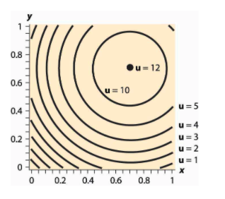

# Consumer preferences, constraints and choice, demand functions {#consumers_dmd}

## Consumer preferences, indifference curves/sets (0.5 weeks) {#consumer_pref}

We will cover most of O-R chapter 4, but we will skip section 4.6 (differentiability)

### "Bundles of goods" (O-R 4.1) 

Let's consider two goods only, for now.


```{block2,  type='def'}

In O-R notation:

> The set of alternatives is $X = \mathbb{R}_+^2$. 

> A member of X is called a 'bundle'.

```  

We can consider these bundles as 'vectors' (from linear algebra) with the corresponding operations.  For example, let bundle $x = (x_1, x_2)$. If $\lambda$ is a positive number, we have $\lambda x = (\lambda x_1, \lambda x_2)$. 

We can depict these bundles graphically as vectors (or points) in 2-d space. 

We will later consider 'convex combinations' of particular bundles x and y: $\lambda x + (1- \lambda) y$, for $0 \leq \lambda \leq 1$; all such convex combinations lie on the line segment connecting points x and y.


\

### Preferences over bundles, indifference sets (indifference curves) (O-R 4.2 and supplements) 

```{r  fig.cap = 'From Nicholson and Snyder 2010', out.width='80%', fig.asp=.4, fig.align='center',  echo = FALSE}
 knitr::include_graphics(file.path("picsfigs","moreisbetter.png"))
```

If 'more is preferred to less', we know that all of the points in the darker region are preferred to all of the points in the lighter region. But how can we compare the "?" areas? Which are preferred? This will depend on how an individual weighs tradeoffs between X and Y. 

\

$\rightarrow$  We can  depict this using *Indifference Curves* (indifference sets).

O-R:

> The indifference set for the preference relation $\succsim$ and bundle $a$ is $\{y ∈ X : y \sim a\}$

Read this as 'all y in the choice set X that are seen as equally good as bundle a'.

\

Indifference curve (simpler definition, using utility) 
:     A curve that shows all the combinations of goods or services that provide the same level of utility. (Source: Nicholson and Snyder, 2010)

\

Formally (for 2 goods), the set of pairs of ${x,y}$ such that $U(X,Y)=c$ for some constant c.

Autor:

> Define a level of utility say $U(x) = U$. Then, the indifference curve for U, $IC(U)$ is the locus of consumption bundles that generate utility level U for utility function $U(x)$.


```{r  fig.cap = '', out.width='55%', fig.asp=.4, fig.align='center',  echo = FALSE}

knitr::include_graphics(file.path("picsfigs","indifcurves_util_together.jpg"))

```


Consider the above diagram.
<div class="marginnote">
[Credit: www2.econ.iastate.edu].
</div>

Think of this as a map with a projection above it.

- How far East you go on this map determines how much of the x good is consumed

- How far North you go determines how much of the Y good is consumed.

- How 'high' is the projected image... determines how much utility is obtained from this combination of goods X and Y.

<div class="marginnote">
Hmm... If we think of this as a traveler who loves 'getting high', and  'consumes' by riving East or North, and his utility is his altitude, maybe that helps.
</div>


```{r  fig.cap = '', out.width='70%', fig.asp=.4, fig.align='center',  echo = FALSE}

 knitr::include_graphics(file.path("picsfigs","indif_utility_2_400.jpg"))

```

The above diagram also includes color to depict the utility level, like a 'heat map'. <div class="marginnote">
This diagram is from a very useful resource from MIT, [Frank's Economics on the web](http://web.mit.edu/11.203/www/econ/).]
</div>

### Examples of preferences (over 2 goods) {#example-prefs}

#### Simpler Definitions: Perfect substitutes and complements {-#perfect-sub-comp}

Perfect substitutes 

:     Goods A and B are Perfect Substitutes when an individual's utility is linear in these goods

: when she is always willing to trade off A for B at a fixed rate (not necessarily 1 for 1!)

\

Formally, in O-R 'Example 4.1: constant tradeoff' (for two goods)

> ... $v_i$ is the [numeric] value she assigns to a unit of good $i$ [here, for $i = 1,2$]

> [This preference relation] is defined by ...  $x \succsim y$ if $v_1 x_1 + v_2 x_2 ≥ v_1 y_1 + v_2 y_2$. 

<div class="marginnote">
Obviously this $\succsim$ is represented by the utility function $u(x_1, x_2) = v_1 x_1 + v_2 x_2$.
</div>


\


Perfect complements

:     Goods A and B are Perfect Complements when an individual only gains utility from (more) A if she also consumes a defined (additional) amount of B, and vice-versa

<br> \bigskip

These goods are 'enjoyed only in fixed proportions'. E.g., left and right shoes (1:1) bicycle frames and wheels (1:2) or, perhaps, baking powder and flour (1:40) for someone who only eats soda bread.

<div class="warning">
These are not the same as the 'complements' and 'substitutes' in demand functions which we may see  later, referring to the impact of changing prices.
</div>

\

### Properties: Monotonicity {#monotonicity}

Read O-R section 4.3.

```{block2,  type='tip'}
Know how to define, test, and compare at least two 'monotonicity-type' assumptions, e.g., Monotonicity vs Strong Monotonicity; see O-R p. 49.

Know how monotonicity rules out 'bliss points'
``` 

\

<center>


[See McDL on 'Bliss points'](https://saylordotorg.github.io/text_introduction-to-economic-analysis/s13-04-examples.html)
</center>


<div class="marginnote">
Note that what McDL  refer to as 'Isoquants' is a general term for a 'level set.' Indifference curves are a 'level set for utility' (if we have a utility representation).
</div>


\


```{block2,  type='note'}

Monotonicity (essentially) yields 'optimizing consumers spend all their wealth over the relevant lifetime'. It enables:

- Easier computation of optimization problems (with an equality rather than an inequality constraint
)
- Easier and the 'comparative statics' of these optimization problems

- The derivation of results from ['adding up restriction']{#aggregation}
```

```{block2,  type='inputq'}

Explain the examples in the O-R table:

- How do we know that 'constant tradeoff preferences' exhibit monotononicity?
   
- Explain/prove that 'complementary goods' do not exhibit strong monotonicity.
   
- Prove that lexicographic preferences have *strong* monotonicity

```  

\


### Properties: Continuity - discussed [in a previous section](#continuity)

\

### Properties: Convexity (skipping the proofs) {#convexity}

Read O-R section 4.5, skipping the proofs, if you like.


```{block2,  type='def'}

**(weak) Convexity** (O-R definition)

> $\succsim$ on $\mathbf{R}^2_+$ is convex if $a \succsim b \rightarrow \lambda a + (1 − \lambda)b \succsim b$ for all $\lambda \in (0,1)$

\

**Strict Convexity** of $\succsim$ (O-R definition)
...

> if $a \succsim b$ and $a \neq b \rightarrow \lambda a + (1 − \lambda)b \succ b$ for all $\lambda \in (0,1)$

```  

Simply, weak convexity implies that convex combinations of two distinct bundles, one at least as good as the other, is at least as good as the 'weakly worse' bundle. 

Strict convexity implies that this convex combination is *strictly preferred* to the 'weakly worse' worse bundle. 

Note that as $\succsim$ also holds (in both directions) for two bundles where $a \sim b$, weak (strict) convexity implies that a convex combination of such bundles will also be at least as good as (better than) either bundle. 

<div class="marginnote">
Reading tip: when we make an mathematical statement and put  multiple things in parentheses, you can read this sentence either 'reading everything in parentheses' or 'reading none of the parentheses'.

\

E.g., "In (New) York people should (not) drive on the left side of the road."

</div>


\

An equivalent definition involving 'upper contour sets' 

```{block2,  type='fold'}

(proved equivalent in O-R proposition 4.2):


> $\succsim$ convex if and only if for all $x^ {\ast} \in X$ the
set $\{x \in X : x \succsim x^{\ast}\}$ ...  is convex.
 
\

In other words, it is the same as saying 

'the set of all bundles at least as good as some bundle' ... (which we call the 'upper contour set') is a convex set.seed(

A 'convex set' is a set that is 'closed under convex combinations', i.e., it contains  all of its convex combinations. For any two elements in a convex set, the convex combination of these elements is in the set as well. 

<div class="marginnote">
Pretty easy to visualise for a set in 2 or 3 dimensional space ... but much harder when we go to higher dimensions. Yet most of the proofs will indeed generalise to higher dimensions. Remember, when we are dealing with real-world products and bundles, we are dealing with many important dimensions. E.g., a box of cereal could be considered to be described by a vector (or list) of characteristics, including, sweetness, saltiness, crunch, calories, carbohydrates, etc.... all of which a consumer may care about
</div>
 
```      


\


```{r block05, fig.cap = 'Convex preferences - from McDL', out.width='60%', fig.asp=.6, fig.align='center', echo = FALSE}

 knitr::include_graphics(file.path("picsfigs","mcdl_convex_pref_indif.png"))

```

Be sure you understand the difference between the definition of convexity and strict convexity here.

***

<center>

Convexity: 

<iframe width="560" height="315" src="https://www.youtube.com/embed/zG5bAx1A_M0" frameborder="0" allow="accelerometer; autoplay; clipboard-write; encrypted-media; gyroscope; picture-in-picture" allowfullscreen></iframe>

</center>

***

```{block2,  type='warning'}

> A preference relation on  $R^2_+$ that is represented by a (quasi)-concave [utility] function is convex.

It will also have convex indifference curves, implying that the 'weakly preffered to sets' are convex. 

Make sure you don't get this confused.

See O-R proposition 4.3 and its proof.
```

\

> The convexity of a strongly monotone preference relation is connected with the property known as decreasing marginal rate of substitution. (O-R)

<div class="marginnote">
Please see the O-R numerical/parametric example offering insight into this, beginning "consider three bundles." If time permits I'll make a quick video on this.
</div>
 

\

```{block2,  type='note'}

Convexity of preferences will ensure 'well behaved consumer responses', including demand responses to price (i.e., 'demand curves'). Without convexity we may see abrupt and discontinuous shifts in the quantity of a good demanded in response to (small) changes in price.

```


```{block2,  type='inputq'}
Convexity is a convenient assumption, but not one that is reasonable in all cases. Can you give some insight as to why not, and give some examples of cases where the indifference curves between two goods may fail to be convex ... and may be concave, at least within certain regions?
```

```{block2,  type='fold'}
Consider 'substitute goods' like

A. petrol (gasoline) versus B. diesel, or

A. scuba equipment versus B. skiing gear.

In these cases is easy to see why I may prefer 'a lot of A or B' over 'a medium amount of A and B', and my willingness to give up a good might *decrease* rather than increase as I have more of that good.

```

\

**How to show (mathematically) that preferences (and indifference curves are convex)?** 

```{block2,  type='fold'}

The answers [here](#https://www.quora.com/How-can-I-mathematically-prove-that-indifference-curves-are-convex-shaped-with-derivatives)

... by Abrink and Teytelboym appear correct. However, I do not want to get into this computational issue in this module. (However, it is covered in the 'optimisation' module).

 
```


\

#### More general concept: [quasiconcavity (optional, linked as supplement)](#quasi-conc)   {-}

This is the 'preferred assumption' which resembles convexity, but has several advantages as a concept. For example, it doesn't require differentiable preferences, and its properties are not affected by monotonic transformations of utility functions. This is the concept that you might be taught in a PhD or MRes module. I think it may also have some value in understanding optimization problems in general, which is an important part of research and industry and finance, I believe.  [Linked as supplement here](#quasi-conc).

\

### (Differentiability: mainly skip) {-}

```{block2,  type='note'}
You can skip O-R's discussion of  differentiability.

However,  do have a look at O-R figure 4.5  to get a sense of what differentiability  means for indifference curves (indifference sets).

```


```{block2,  type='inputq'}

^[Image source: SilverStar at English Wikipedia, CC BY-SA 3.0 <http://creativecommons.org/licenses/by-sa/3.0/>, via Wikimedia Commons]


1. What do these indifference curves depict?
   
2. What might be a functional (utility) form consistent with these indifference curves?  

3. Are these preferences 'everywhere differentiable'? Explain why or why not.

4. Give a real-world example of a case where such preferences might be relevant.
   
```  

\

### Applications: Product positioning, marketing

<!-- I hope to add more content to be added here, including applications directly from the private sector.
-->

Do people have a preference for balance? (Convex indifference curves)?

Naive argument?: If market research suggests that a broad group are indifferent between two options A and C, maybe they strictly prefer G  $\rightarrow$ a possible *niche* for a new profitable product ?

<br>

```{block2,  type='inputq'}

But what may be a critique, exception to this logic, e.g., for a particular food?

```


```{block2,  type='fold'}

-  Convex preferences, 'preferring mixtures' is a very strong assumption, unlikely to hold everywhere, or for actual *mixtures*.   I may be indifferent between liver and custard, but it doesn't mean that I prefer liver-flavoured custard, nor even necessarily equal amounts of liver and custard side by side.


- Producing an 'intermediate' attribute may be more costly; it may be easy to make crunchy but low-taste cereal or tasty but low-crunch cereal, but expensive to make a cereal with both attributes.

E.g., it's hard to make a car that is spacious *and* fast.

```

\

**Utility/indifference curves: Also a framework for marketing analysis**

```{block2,  type='note'}

The utility and indifference curve construct may seem highly theoretical. Indeed, these models were developed largely to address big questions like 'who gains from trade?'  Still, it helps organise thinking and analysis for at least some managers and marketing groups.  According to Nicholson and Snyder (2010) Marriot hotel used focus groups to 'construct (multidimensional) indifference curves' to consider their ideal product positioning.

I have seen a similar presentation for other hotels presented at [Behavioural boozeonomics](https://www.meetup.com/London-behavioural-comms-monthly-informal-drinks/) in London.

This may also provide a structure to guide data-driven 'searches for the next best product'.
```


\

One (often survey-based) approach to this is called 'conjoint analysis' or 'conjoint modeling'.  Consider: How would the assumptions of this approach, as described below, translate into microeconomic assumptions about choices and preferences? *Note: the site below states things in loose terms, for those without Economics training.*


```{r}
knitr::include_url("https://www.qresearchsoftware.com/conjoint-analysis-the-basics")
```


\


## Consumer behavior/Individual (and market) demand functions and their properties (1 week) {#demand}

Main reading:

- O-R Chapter 5 (selections as outlined below)

Feel free to skip (unfold):

```{block2,  type='fold'}

You may skip the first part of O-R section 5.5 on 'rationalizing a demand function.'

However, make sure you *do read* the discussion of 'the weak axiom of revealed preferences' (WARP). This relates to some of the supplementary readings/exercises.

```


\

*Alternative treatments: (Unfold)*


```{block2,  type='fold'}

- DA: [Lecture Note 6 – Demand Functions: Income Effects, Substitution Effects, and Labor Supply](https://ocw.mit.edu/courses/economics/14-03-microeconomic-theory-and-public-policy-fall-2016/lecture-notes/MIT14_03F16_lec6.pdf), esp. sections 1-3

- McDL:  3.1 (elasticity), parts of Ch 12; Warning: this book's treatment of consumer surplus seems to be incorrect (or at least vastly oversimplified) from my PoV

- QMC: Chapter 17 (elasticities -- very clear treatment, Chapter 18 (supply and demand details)

```

\

Individual choices: supplementary recommended readings

<div class="marginnote">

As noted before:

- You don't need to read all of these

- But you should read *some* of these... in terms of marking, you may need some themes to discuss in open answer questions on the midterm exam, for example.

</div>


```{block2,  type='fold'}

- Loomes, Graham, Chris Starmer, and Robert Sugden, 1991. "Observing Violations of Transitivity by Experimental Methods". [jstor link](https://www.jstor.org/stable/2938263?seq=1#metadata_info_tab_contents) [@societyObservingViolationsTransitivity2014]

- Choi, Syngjoo, et al. "Who is (more) rational?." The American Economic Review 104.6 (2014): 1518-1550.a.

- Waldfogel, Joel. "The deadweight loss of Christmas." The American Economic Review 83.5 (1993): 1328-1336. [@waldfogelDeadweightLossChristmas1993]

- [Reinstein, David. "The Economics of the Gift." (2014; working paper and chapter in Gift Giving and the'embedded' Economy in the Ancient World, F Carlà, M Gori - 2014).](https://core.ac.uk/download/pdf/74369736.pdf) [@Reinstein2014]

```
\

<!--I intend to  more content here -->


\


### Choices are subject to constraints {#constraints}

You cannot spend more than your (lifetime) income or wealth $\rightarrow$ *budget constraints* (and 'budget sets').

<div class="marginnote">
There are also other potential constraints on consumption, such as a leisure time constraint and legal constraints.
</div>


Consider the budget line given in figure 5.1 in O-R.


<!--
```{r  fig.cap = 'Budget constraint for two goods', out.width='80%', fig.asp=.4, fig.align='center',  echo = FALSE}

knitr::include_graphics(file.path("picsfigs","budgetconstraint.png"))

```
-->

Budget constraint for two goods, slope  $-p_{x_1}/p_{x_2}$


<div class="marginnote">
Only two goods?  For example, think 'food' and 'nonfood'.
</div>

\


#### Budget constraint algebra (simple) {-}

<div class="marginnote">
*I realise this may be trivial for many of you, but others will find this a helpful refresher. If it is obvious, feel free to skip ahead.
</div>


If I spend all my wealth (which I should do over a 'relevant lifetime' given monotonic preferences), then, if there are only two goods $x_1$ and $x_2$ to choose from, with prices $p_1$ and $p_2$ respectively ...:

\


Expenditure on $x_1$ + Expenditure on $x_2$ = wealth ($w$)


$$p_1 x_1 + p_2 x_2 = w $$


<br> 


To see how $x_1$ trades off against $x_2$, rearrange this to:

$$w =  \frac{w}{p_2} -\frac{p_1}{p_2}x_1$$

- Intercept:  $\frac{w}{P_2}$, i.e., amount of $x_2$ you can buy if you only buy $x_2$

- Slope: $-\frac{p_1}{p_2}$, i.e.,  how much $x_2$ you must give up to get another unit of $x_1$


<br>

*Notes and intuition* (unfold if you want more explanation)

```{block2,  type='fold'}

The slope $-\frac{p_1}{p_2}$: How much $x_2$ I must sacrifice to get another unit of $x_1$, expressed as a negative number. (Strictly speaking, the slope is how much $x_2$ you *get* when you get another $x_1$, but since this is negative we see that you 'get a negative amount', i.e., give up some amount of $x_2$.)

To get another unit of $x_1$ it costs me $p_1 x_1$, so the more costly is $x_1$ the *more* $x_2$ I must give up.

For each unit of $x_2$ I give up I save $p_2$, so the more costly is $x_2$ the more I can save by giving up 1 unit of it, thus, the less I need to sacrifice of $x_2$ to get another unit of $x_1$.

```

<div class="marginnote">
O-R also refer to a different way of presenting the consumer's environment: 

> Rather than assuming that the consumer can purchase the goods at given prices using his wealth, assume that he initially owns a bundle $e$ and can exchange goods at the fixed rate of one unit of good 1 for $\beta$ units of
good 2.

This presentation helps us consider the welfare properties of exchange economies under different conditions and 'initial allocations'. However, we will not be covering this here. 
</div>
 

\


#### Budget sets (O-R 5.1, formal presentation); normalization {-}

```{block2,  type='def'}

O-R definition (for two goods)

> ... the budget set of a consumer with wealth $w$ when the prices are ($p_1, p 2$) is

$$B((p_1, p 2), w) = \{(x_1,x_2) \in X : p_1 x_1 + p_2 x_2 \leq w \}$$

(Note that the part after the colon ($p_1 x_1 + p_2 x_2 \leq w$) is referred to as the 'budget constraint')

>   The set $\{(x_1,x_2) \in X : p_1 x_1 + p_2 x_2 = w \}$ is the consumer’s budget line

```

\

O-R continue:

> Geometrically, a budget set is a triangle like the one in Figure 5.1. Note that multiplying wealth and prices by the same positive number does not change the set:

> $B((\lambda p_1,\lambda p_2), \lambda w) = B((p_1, p_2), w)$ for any $\lambda > 0$,

> because the inequalities $\lambda p_1 x_1 + \lambda p_2 x_2 \leq \lambda w$ and $p_1 x 1 + p_2 x_2 \leq w$ that define these sets are equivalent


\

Multiply all prices and income by the same amount, and the *budget constraint is unchanged.* This will imply that we can simplify any such maximization problem by "normalizing" the budget constraint so that one good simply has price equal to one.  (But if this is an applied problem, we should remember to convert it back into the actual prices.) (See my ['numeraire good' video](https://www.youtube.com/watch?v=HAA0Q_3YoS).)


<div class="marginnote">

Also:  As the budget constraints are unchanged when all prices and wealth are increased by the same proportion, neither will be the choices made; thus demand functions must be "homogenous of degree zero", as noted below. 
</div>

<!-- I hope to make a video of this here.-->

\

**"Every budget set is convex"** (\*)

As O-R show algebraically (for two goods, but this would extend to $n$ goods)...

- if any two bundles $a$ and $b$ are both within a particular budget set, a third bundle that is a "convex combination" of these two bundles will also be in this budget set.

<div class="marginnote">

\* This holds as a result of constant linear pricing; in the proof you see this is used.  With complicated (e.g., nonlinear) pricing, or subsidies that only apply to certain units (recall 'eat out to help out'?) budget constraints may not have this property. Perhaps it is reasonable to assume that a 'standard small consumer' faces constant prices for many goods. On the other hand, we can think of all sorts of exceptions, where you get a discount if you buy in bulk and also note that you cannot buy, e.g., "one third of a car."  With nonlinear budget constraints  optimization problems become much more mathematically "interesting".
</div>

\

What's a "convex combination"? (unfold)

```{block2,  type='fold'}

Essentially this is just a fancy economics word for "shares of two things adding to one".

It is simply some (non-negative) share of the first bundle and one minus this share of the second bundle.  E.g., 100% of the  first bundle and none of the second bundle, or 50% of each bundle, or 25% of the first bundle and 75% of the second bundle. (Obviously this could be extended to to multiple bundles too.)

Think also about 'dividing up two bundles'. We see  that if there are two bundles out there and one person takes a convex combination of these that is convex, what remains is also a convex combination of these.

\

Formally the convex combinations of bundles $A$ and $B$ (where A and B are vectors) are simply $\delta A + (1-\delta) B$, where $0 \leq \delta \leq 1$. (This can be extended to convex combinations of several bundles to consider a 'convex hull', and each bundle can have as many elements as desired.)

\

Consider of any two bundles A and B, each with two elements, plotted on the coordinate plane. Any convex combination of A and B is a  points on the straight line connecting A and B.  Thus the line connecting A and B contains *all* such convex combinations. Each particular convex combination $delta A + (1-\delta) B$ will be the point$\delta$ share of the distances between A and B. 

\

We could use this to demonstrate "gains to trade". Suppose two people with the same preferences, each with a distinct bundle (at a point other than the one where their MRS are the same). They can divide up these bundles among each other, one taking a convex combination of the bundles, and the other taking the remainder, which is also a convex combination.

 See [THIS SUPPLEMENT](#gain-to-trade) for more detail.
   
   
```


\

### Individual (consumer) demand functions (Marshallian demand) - first pass {#demand1}

```{block2,  type='def'}

O-R:

> A demand function is a function $x$ that assigns to each budget set one of its members.

> Define $x((p_1, p_2), w)$ to be the bundle assigned to the budget set $B((p_1, p_2), w)$.

(It is easy to imagine extending this to a case with many goods to choose from, rather than just two.)

```


O-R note that if you multiply all prices and wealth by some positive constant $\lambda$, the budget set is unchanged; thus the demand function is also unchanged, 

<div class="marginnote">
As the demand function is (stated above to be) a function of the budget set, and nothing else, (at least holding preferences constant), if the 'budget set as an argument' is unchanged, the output must not change.

Considering $x(p_1, p_2, w)$ as a simple function of three arguments, this implies it has the mathematical property 'homogenous of degree zero'. A function is 'homogenous of degree $n$' when multiplying all of its inputs by some number $\lambda$ causes the output to be multiplied by $\lambda^{n}$. ... Here, Hd-0, so $\lambda^{0} = 1$ .... i.e., the output is unchanged.
</div>

\

```{block2,  type='inputq'}
O-R present 'individual demand functions' *before* presenting the optimisation problem. This is unusual... why do they do this?

```


```{block2,  type='fold'}
They highlight that the demand function does not *need* to arise from an optimization process (as we describe below)... it merely maps from the budget set to a particular choice.

This can arise as a result of a simple rule or "heuristic" such as "spend equal amount of income on each good". Behavioral economics considers the implications of decisions made on the basis of such heuristics.

```

\

Types of demand functions: Marshallian and Hicksian... 

```{block2,  type='fold'}
These demand functions are stated as a function of the  budget set, or more simply, as functions of price and wealth (or income).

These are referred to as the "Marshallian demand functions" after the great Alfred Marshall.  These are the demand functions that we may actually be able to observe in the real world.

[There are another type of demand functions that have very interesting properties for theory and welfare analysis called "Hicksian demand functions" or "compensated demand functions"](#hicksian). These take prices and *utility* as the arguments.  We will not cover these in 2020 because of time constraints. But as an Economist you should have some familiarity with this.

```

\

### Rational consumer and his/her optimisation problem {#rat-opt}

We started with an individual's preferences, one of the base elements of the neoclassical model. Under some conditions these can be described by utility functions,  which we may consider as 'mountains'  with levels sets depicted by indifference curves.

So, we have a way of depicting what people prefer,  but this doesn't tell us what people will *choose* to consume (and firms to produce).

We next introduced the second fundamental element of the neoclassical model, constraints, in particular, the budget constraint.

We put these together to describe the consumer's problem: maximizing her utility subject to her budget constraints.  This is depicted in figure below for the two-good case.

<div class="marginnote">
Image Source: https://courses.byui.edu/econ_150/econ_150_old_site/lesson_05.htm
</div>


(Or see O-R fig 5.3)


```{r  fig.cap = '', out.width='75%', fig.asp=.4, fig.align='center',  echo = FALSE}
 knitr::include_graphics(file.path("picsfigs","crop-byui-5-2_Indifference_Curves_08.png"))
```

Imagine that you are this consumer with these preferences and this budget constraint. You can choose any point at or below the straight blue line, as it is on or below your budget constraint. You want to get to the highest indifference curve, to attain the most utility.

\

```{block2,  type='inputq'}

How do we know point B is suboptimal (i.e., not optimal)? What about point D? What about points between A and B? How do such points compare with point B?

```

```{block2,  type='fold'}
We can see B is suboptimal as it is on a lower indifference curve than A, but both are on the same budget line. Same for D. 

In fact, if we assumed even *weak monotonicity* we would already know that point A was preferred to point D. 

Points between A and B are also below the '$U=100$' indifference curve... again, with weak (or strict) monotonicity these must be inferior to point A (but superior to point B). 

```

\


```{block2,  type='note'}

Again, this is material that you will have seen before if you have studied Economics. Feel free to skip this if you remember it all; the O-R text gives a concise explanation.

As this is a bit remedial I will not cover it in detail. I suggest the [Khan academy videos/materials here](https://www.khanacademy.org/economics-finance-domain/microeconomics/choices-opp-cost-tutorial/utility-maximization-with-indifference-curves/v/optimal-point-on-budget-line) if you need revision.
```

<br> \bigskip

We can demonstrate that you will choose point A, yielding utility $100$. What is special about point A?

It's the point of *tangency* between the budget constraint and an indifference *curve*. It's also (not a coincidence) the point where the slopes are equal. At this point (but not in general!) we have that  "Slope of budget constraint = slope of indifference curve".

<!-- <div class="marginnote">
Recall that the  $\leftrightarrow$ symbol means 'if  and only if', i.e., the  object on the right-hand side implies the object on the left-hand side, and vice versa. In  some contexts this means a 'necessary and sufficient condition',  but here it is just basically a definition.
</div>
-->

\

### Marginal rates of substitution {-}

O-R section 5.4 'Differentiable preferences'


```{block2,  type='note'}
Note that O-R use the notation

$v_1(z)$ and $v_2(z)$ to represent "the consumer’s valuations
of small changes in the amounts of the goods she consumes away from z". They refer to the consumer's 'local valuations at z' (remember that $z$ is a bundle of goods).

This is usually referred to as the *marginal utility*; the partial derivative of the utility function with respect to each argument (each good or service), at a particular point (bundle), say $z = (x_1, x_2)$:

$$mu_1(z) \equiv \frac{d}{d x_1} u(x_1, x_2)$$

```

\

```{block2,  type='def'}

O-R define the "marginal rate of substitution at $z$ ... $MRS(z)$" as $v_1(z)/v_2(z)$

Assume bundle $z$ contains elements $x_1$ and $x_2$. Relating this to a more standard notation:

$$MRS(z) = MRS(x_1,x_2) = v_1(x_1,x_2)/v_2(x_1,x_2)=\frac{mu_1(x_1,x_2)}{mu_2(x_1, x_2)}$$

```


```{block2,  type='note'}
I prefer to define and think of the MRS as

> Starting from a particular point ($x_1', x_2'$) how much $x_2$ would I be willing to give up to get a unit of $x_1$'? (As this 'unit size' converges to 0, as we are considering a point slope here. )

Or starting from a particular point ... if I gained a tiny tiny  unit of $x_1$ how much $x_2$ would I have to give up to hold my utility constant?

I loosely derive the 'ratio of the marginal utilities' from this definition [BELOW](#mrsinsight), offering some insight.

```

\

Above, at an optimal interior consumption choice, we had that the  "slope of budget constraint = slope of indifference curve"... at least that's what it looked like.

\


This is equivalent to "the point or bundle (which we will call $x^{\ast}$) where the price ratio equals the marginal rate of substitution", i.e., the point $x^{\ast} \equiv (x_1^{\ast},x_2^{\ast})$ where

$$p_1/p_2 = MRS(x^{\ast}) = MU_1(x^{\ast})/MU_2(x^{\ast}) =v_1(x^{\ast})/v_2(x^{\ast}) $$ holds.

\
<!--
*Note on why the negative signs 'cancel out:*
```{block2,  type='fold'}

Recall that the  slopes of the budget line and the slope of the relevant indifference curve are actually negative. However, recall that we usually state the MRS as the *absolute value* of this, so it is positive, and thus we similarly multiply the slope of the  budget constraint by negative one. As you know, multiplying both sides of a (nonzero) equation by negative one leaves the solution unchanged. More simply, where both slopes are negative, 'the slopes are equal' is the same as saying 'the absolute value of the slopes are equal.

```

-->

```{block2,  type='warning'}

Warning:  Recall that the marginal rate of substitution may vary everywhere along an indifference curve (remember the idea of satiation and diminishing MRS).

Unfold for further explanation...
```


```{block2,  type='fold'}

It is a function of the *point* it is evaluated, i.e., $MRS = MRS(x_1, x_2)$. It is only at the *point where the consumer is optimizing* that these slopes *must* be equal.

\

They can also be equal at some other suboptimal points, where she is not spending all of her income... (e.g., perhaps point D in the above figure).

Where she is consuming some of every good, this is a *necessary* condition for such a point to represent an optimal consumption choice, but it may not be a sufficient condition.  May also be optimal for her to consume *none*  of certain goods,  in which case this condition  will not hold. We return to this later.

```

\

#### At an optimal 'interior' consumption choice (with strict convexity, see above note and discussion of 'corners' [below](#corners)) {-}

- Consume all of income (locate *on* budget line; follows from 'more is better')

- The "Psychic tradeoff" (MRS) equals the market tradeoff ($p_X/p_Y$)


Intuition: If I can give up X for Y in the market (buy less X, get more Y) at a certain rate, and the *benefit* I get from doing this is at a different rate, I can make myself better off.

Thus the original point could not have been optimal!

{width=20%}


<div class="marginnote">

If this is not clear to you, try to think about this carefully. This is a key insight in microeconomics, a sort of 'marginality' argument/'proof  by contradiction'. that will come back later.
</div>


### Very simple example, for intuition {-}


```{block2,  type='fold'}


Suppose that at the consumption bundle you choose, your MRS = 1. To remain indifferent, you would be willing to give up 1 hamburger to get 1 soda.

Suppose the price of soda is £1 and the price of a hamburger is £2. $\rightarrow$ Price ratio: $P_S/P_B = 1/2$

Thus if you buy one less hamburger you can buy two more sodas.
Thus if you give up one hamburger, you can get one more soda to keep you indifferent *plus* an additional soda.
This means you would be better off; thus the original bundle *wasn't* optimal.

Practice question: in which direction would you adjust this bundle if the price of a soda was £2 and a hamburger was £1?

```


\

More extended example... (unfold)

```{block2,  type='fold'}
E.g., if I can give up one glass of wine and gain two beers (i.e., because wine is twice as costly), and (given my proposed consumption of wine and beer) I get the same value from each glass of wine or beer, I can give up this glass of wine, gain two beers, and make myself 'one unit' better off, at the margin.


On the other hand, if I can give up one glass of wine and gain two beers (i.e., because wine is twice as costly), and (given my proposed consumption of wine and beer) I get the four times as much value from each glass of wine as each beer, I can give up two beers, gain a wine (which I value at four beers) and make myself 'two units' better off, at the margin.

However, I can *not* apply this argument to a point where I am consuming *only* wine... I cannot consume less than no beer (although some nights I wish I could have done). We return to this point [below](corners)
```

\


### More insight into MRS  {-#mrsinsight}

Recall $u=u(x_1, x_2)$.

$$U_1(x_1,x_2) \equiv MU_{x_1}(x_1,x_2)$$

\

*Derivative with respect to $x_1$: rate that utility increases if we add a little $x_1$, holding $x_2$ constant.*

Similarly for $MU_{x_2}$.


<br> \bigskip

As noted (and we can derive this), the MRS at a point is the ratio of these marginal utilities.

MRS: 'how much $x_2$ would I be willing to give up to get a unit of $x_1$'?

<br> \bigskip

Ans: Depends on marginal benefit of each ... we can show $MRS(x_1,x_2)=\frac{MU_{x_1}}{MU_{x_2}}$


```{block2,  type='note'}

*Mathy intuition:*

The more valuable a little more X is to me at that point -- the higher is $MU_{x_1}$ -- the more $x_2$ I am willing to give up to get it. That is why $MU_{x_1}$ is in the numerator.

The more valuable a bit more $x_2$ is at that point -- the higher is $MU_{x_2}$ -- the less $x_2$ I am willing to give up to get a bit more $x_1$. That is why $MU_{x_2}$ is in the denominator.

```

\


The 'first order change in utility' (or 'total differential'), considering 'small changes in $x_1$ and $x_2$, $d_{x_1}$ and $d_{x_2}$ is:

$$ dU  = \frac{\partial U}{\partial x_1}d_{x_1} + \frac{\partial U}{\partial x_2}d_{x_2}$$
$$ = MU_{x_1}d_{x_1} + MU_{x_2}d_{x_2}$$

... Where  $\frac{\partial U}{\partial x_1}$ refers to the partial derivative of $U(x_1,x_2)$ with respect to $x_1$, and similarly for $x_2$, i.e., the marginal utility.

\


Essentially, for very small changes in X and Y;  this approximates the total change in utility. It's a 'linear projection'.

Setting it equal to 0 and rearranging yields the rate, at the margin, one is willing to give up $x_2$ for $x_1$:

$$dU  = MU_{x_1}d_{x_1} + MU_{x_2}d_{x_2} = 0 $$

Rearranging...

$$\frac{dx_2}{dx_1}=-\frac{MU_{x_1}}{MU_{x_2}}$$

<div class="marginnote">
**Tech note**:  This is a simple case of the implicit function theorem. Essentially $U(x_1,x_2)=c$ defines an implicit function $x_2(x_1)$, whose slope is the negative of the ratio of the derivatives.
</div>


<br>

Rearranging the utility maximising condition yields further intuition:

$$\frac{P_X}{P_Y} = MRS(z^*) = \frac{MU_X(z^*)}{MU_Y(z^*)}$$

(at each interior consumption point $X>0$, $Y>0$)

$$\frac{MU_X}{P_X} = \frac{MU_Y}{P_Y}.$$


<br> \bigskip

I.e., the same 'bang for each buck'.

*Note:* If this didn't hold true and you were spending on both goods, you would be paying 'more per util' for one good than the other, and thus should reallocate to that other good.

\


### Note on 'corner solutions' {#corners}

The above 'bang for the buck' condition applies to any *interior* solution

- If you are consuming both goods and optimising, $P_{x_1}/P_{x_2} = MRS = MU_{x_1}/MU_{x_2}$ must hold

- This is a "necessary but not sufficient condition", sufficient if there is a diminishing MRS everywhere.

But you might consume *none* of some good (say $x_1$):

If even with *no*  $x_1$  we still have $MU_{x_1}/P_{x_1} <MU_{x_2}/P_{x_2}$

- i.e., the marginal utility of the first unit of $x_1$ is less than that of $x_2$.


The same condition applies to each good you are consuming a positive amount of.


```{r  fig.cap = 'From Autor notes', out.width='100%', fig.asp=.5, fig.align='center',  echo = FALSE}
 knitr::include_graphics(file.path("picsfigs","goodwedontbuy.png"))
```

\

### Overview: Solution to consumer's problem {#cons-solution}

#### General solution (two goods) {-}

O-R (proposition 5.1) present the basic results for the *solution to a consumer's problem* (at least for two goods):

> [Consider] a preference relation on $\mathbf{R}_+^2$ and a budget set

> a. If the preference relation is continuous then the consumer’s problem has a solution.

By this they mean, that 'there is a highest point in this set'. They cite a 'standard mathematical result'. 

<div class="marginnote">
This seems obvious; at first glance you might think 'every set must have a minimal and maximal element'. 

But then, think about the set "numbers that are strictly below 10". Is there a largest number in this set? (No, there isn't.) 
</div>
 

> b. If the preference relation is strictly convex then the consumer’s problem has at most one solution.

The proof of this is pretty neat!

```{block2,  type='fold'}

First they 'assume the negation of b holds' ... and look for a contradiction: 
   
> Assume that distinct bundles $a$ and $b$ are both solutions to a consumer’s problem. 


> Then the bundle $(a +b)/2$ is in the budget set (which is convex); by the strict convexity of the preference relation this bundle is strictly preferred to both $a$ and $b$.

So, 'if there are two optimal distinct bundles, there must be an even better bundle.' Thus, a contradiction... so the negation of b cannot hold... there cannot be two distinct optimal bundles. 

```


> c. If the preference relation is monotone then any solution of the consumer’s problem is on the budget line

(This one seems pretty obvious, skip the proof)

\

#### Solution with monotone, convex, and differentiable preference relation (two goods)

O-R summarize this nicely, allowing for the possibility of corner solutions"


> Assume that a consumer has a monotone, convex, and differentiable preference relation on $\mathbf{R}_+^2$. If $x^{\ast}$ is a solution of the consumer’s problem for $(p_1, p_2, w)$ then

> a. $x_1^{\ast}> 0$ and $x_2 > 0$ $\rightarrow MRS(x^{\ast}) = p_1/p_2$

> b. $x_1^{\ast} = 0 \rightarrow MRS(x^{\ast}) \leq p_1/p_2$

> c. $x_2^{\ast} = 0 \rightarrow MRS(x^{\ast}) \geq p_1/p_2$

```{block2,  type='inputq'}

Consider each case for a-c, depicting these graphically. (See, e.g., O-R example 5.8)

```  

\

### Some 'popular' forms for utility functions, and their properties; computation {#util-forms}


#### Cobb-Douglas general form  {-#cobbdoug}

$$U(X,Y)=X^aY^b$$

where a, b are positive constants


<br> 


This is *"homothetic"* ... what does this mean? (unfold)

```{block2,  type='fold'}

Homothetic: MRS constant along a ray through the origin.

$\rightarrow$  It can be represented by an HD1 utility function. This ties down 'income effects' in a boring way: consumption of each good expands proportionally in income.


...So the poor man just buys a tiny amount of *foies gras* and jumps in his tiny money bin.


{width=30%}

Thus if everyone has these preferences th  impact of one consumer's income increasing by £1 million is the same as 1 million consumers gaining £1. This (possibly dubious) assumption underlies 'representative consumer' models.


\

A more formal and complete explanation of Homothetic preferences:

<center>
<iframe width="450" height="280" src="https://www.youtube.com/embed/1wBTqaQ9f4I" frameborder="0" allow="accelerometer; autoplay; clipboard-write; encrypted-media; gyroscope; picture-in-picture" allowfullscreen>
</iframe>
</center>
```


<br> \bigskip


$$MU_X=\frac{\partial U}{\partial X} = aX^{a-1}Y^b$$
$$MU_Y=\frac{\partial U}{\partial Y} = bX^{a}Y^b-1$$

<br> \bigskip


Taking the ratio of these yields

$$MRS = \frac{a}{b}\frac{Y}{X}$$


<br> \bigskip


So only the *ratio* Y/X affects the MRS; double both, MRS is the same.


<br> \bigskip


<div class="marginnote">
 Another relevant example: 'Constant Elasticity of Substitution preferences'.
</div>


#### A non-homothetic (here, 'Quasilinear') example {-#quasilinear}


$$U(X,Y)=X+ln(Y)$$


Here $Y$ has a diminishing MU, but for $X$ MU is constant


$$\frac{MU_X}{MU_Y}= \frac{1}{1/Y}=Y$$

So the MRS diminishes as $Y$ decreases (as we go 'down the indifference curve' ... this is what we confusingly call diminishing MRS), but it is independent of the amount of $X$ consumed.

```{block2,  type='inputq'}

So, if we double both then what happens?

```

```{block2,  type='fold'}
Ans: MRS doubles

```
\

This represents *Quasilinear* preferences:

```{r  fig.cap = '', out.width='50%', fig.asp=.4, fig.align='center',  echo = FALSE}
 knitr::include_graphics(file.path("picsfigs","Quasilinear_utility.png"))
```

These are particularly relevant with three or more goods.

More generally, quasilinear utility satisfies $U=x_1+f(x_2,...,x_n)$; i.e., it is linear in one 'numeraire' good $x_1$.\* 

<div class="marginnote">
\* I discuss a numeraire price in [this video](https://www.youtube.com/watch?v=HAA0Q_3YoSc).

</div>
 

Here, the amount of the 'non-numeraire goods' consumed adjust to match the price ratio but *don't* depend on the income.

We imagine that 'the tradeoff between these goods is the same for people of all income levels'.

E.g., in principal-agent analysis we can then ignore the question 'but won't the preference for leisure change when people are richer'?

*Mathy intuition:* if the 'Y' goods $(x2,..., xn)$ have more MU consume them 'first', until their MU diminishes to that of the numeraire, then consume X.


### Rationalizing a demand function (Skip O-R section 5.5) {#}

We already considered 'rationalizability of a choice function' ... so I won't cover this special case.

<!-- (Brief comments here) -->


### (Weak axiom of) Revealed Preference {#warp}

```{block2,  type='note'}

Content to be added here, largely from pages 67-68 of O-R

```  

## Properties of (Marshallian) demand functions {#demand-prop}

```{block2,  type='note'}

This material is presented at a less advanced level than the previous material. I imagine for many of you, this will be revision, and feel free to skim it or skip it.

More advanced material is considered [below

```

Previously, we considered how consumption choices determined by utility functions/indifference curves and budget constraints.  We can now consider how an individual's choice of a good  varies with  each element of her budget constraint:  for income and the price of each good.


```{block2,  type='warning'}

The notation has changed here, to some extent.

```

<div class="marginnote">
 The OR notation is difficult to adapt here. I try to keep notation constant as much as possible. However, this could be seen as a good thing to get used to: in reading various papers in Economics, authors will use a variety of labels for variables and formats.
 </div>


We will refer to her 'quantity demanded of good X' function (or more simply, her 'demand function') as follows:


<br> <br> \bigskip

$$Quantity \: of \: X \: demanded = d_x(P_X, P_Y, I; preferences)$$

\

### Homogeneity {-}

Homogenous (of degree zero) (demand) function
:      A function whose outcome value does not change when *all* arguments are changed *proportionally* is *homogenous of degree zero*


 

<br>

$d_X(P_X,P_Y,I)$ is homogenous of degree zero in its arguments.


<br>


Multiply all prices and income by the same amount, and the *budget constraint is unchanged.*  Thus (as preferences have not changed) consumption choices should not change either.

-  E.g., the budget constraint $P_X X + P_Y Y = I$ is the same as the budget constraint $2P_X X + 2P_Y Y = 2I$


<!-- *Intuition for this (unfold if desired):* -->


<div class="marginnote">
This relates to the puzzle of 'why should monetary policy and inflation have any real effect on the economy?'
</div>


<center>
*I discuss this in the context of a 'numeraire price' below:*

<iframe width="560" height="315" src="https://www.youtube.com/embed/HAA0Q_3YoSc" frameborder="0" allow="accelerometer; autoplay; clipboard-write; encrypted-media; gyroscope; picture-in-picture" allowfullscreen></iframe>

</center>

\


### Response to income changes

```{block2,  type='inputq'}

Q: What happens to the quantity purchased of some good as an individual's income increases?

```

\

```{block2,  type='fold'}

A: It depends on the preferences (i.e, the utility function, i.e., the relative curvature of the indifference curve at various points).

This defines whether the good is "normal" or "inferior."

Whether it is normal or inferior depends on your preferences and the change in the slope of the indifference curves with higher income/utility, as we see below.)

```
\


<br>

#### Defining a normal and inferior good {-}

Normal good
:     A good that is bought in *greater* quantities as income increases.

Inferior good
:     A good that is bought in *smaller* quantities as income increases.

\

```{r  fig.cap = '', out.width='70%', fig.asp=.4, fig.align='center',  echo = FALSE}
 knitr::include_graphics(file.path("picsfigs","normalgood.png"))
```


<div class="marginnote">
For a simple powerpoint supplement on this, see   [here](https://www.dropbox.com/s/qhsl6qey0wjcfe5/utility_demand_supplement.pptx?dl=0)

(download and use 'presentation mode')
</div>


<!--
```{r  fig.cap = '', out.width='70%', fig.asp=.4, fig.align='center',  echo = FALSE}
 knitr::include_graphics(file.path("picsfigs","inferiorgood.png"))
```

-->

*Consider:* Here we see more income $\rightarrow$ less expenditure on Z! (Not just 'a lesser share' but actually *less*.)

This is because the *shape* of the indifference curves changes at higher incomes in this example.
When people have a lot to spend, they want to spend it on Y and not on Z. (Again *in this example*, not in general.)

Consider, if you won the lottery how much pot noodle would you buy? Pot noodle may be like good Z  in this example.

<br>

Thinking in 3d: 'as you walk up this hill, its ridge gradually moves to the west'.

```{block2,  type='note'}

To be precise, this is *not* about wealthy people being different than poor people
nor that their taste 'changes' when they become wealthy.

We are considering the same person with higher income,
and thus the potential to choose a different bundle of goods.

Empirically, these are hard to distinguish, however.

```
\

```{block2,  type='inputq'}
Consider: all goods cannot be inferior. Why not?
```

```{block2,  type='fold'}
There are 'adding up' conditions.

You always spend all of your income. Thus, if as your income increases, you spend less on some subset of goods,
you *must* spend more on the remaining goods.

```


### Response to (own) price changes (limited coverage) {#price_changes}

```{block2,  type='inputq'}

What happens to an individual's demand for a good as the price of this good rises, in our model? (I.e., if people are optimizing and their preferences obey all of the above axioms.)

```

```{block2,  type='fold'}

You might have thought that when price rises quantity demanded falls, and vice versa, the so-called "iron law of demand".

However, we cannot derive this from our model and in fact, when price rises, an optimizing  consumer might  demand more of this good or less of this good, we do not know!

If the good is *inferior* (as defined above) there will be  two  countervailing effects:

1. "Substitution effect":  Is a good (say, good 'X', on the X-axis) becomes more expensive, the budget line rotates (inward), and the point of tangency (where the price ratio equals the marginal rate of substitution) on *any* indifference curve moves towards a point with less of good X.  In other words, 'along a particular indifference curve'  the individual "substitutes away" from X as it becomes more expensive.

2. "Income effect": As X becomes more expensive, the individual's budget set is restricted. The individual is "poorer in a sense".  If X is an inferior good (in this region), this consumer, being 'poorer'  chooses consume *more* of the good, all else equal.

If the second effect outweighs the first we have the surprising result that , and we label such a good a "Giffen good".

```

To cover this in more detail, we would need to define another concept called "Hicksian demand" (see [supplement](#dual)).


### Complements/substitutes; response to (other) price changes (limited coverage) {#price_changes}

## Consumer surplus (brief and incomplete treatment)

Consumer surplus (Undergraduate definition: Nicholson and Snyder)
:     The extra value individuals receive from consuming a good over what they pay for it.

<br> \bigskip

- What people would be willing to pay for the *right* to consume a good *at its current price* rather than not being able to buy it at all.\*

<div class="marginnote">
In other words, if you said to a consumer 'this product will stop being produced/offered  unless you pay us enough money',  this is the maximum amount the consumer would be willing to pay to keep the product on the market,  at its current price.
 </div>


- The area between the demand curve and the market price

- A measure of consumer welfare, useful for policy analysis (unfold for some policy applications)


```{block2,  type='fold'}

Policy, e.g.,

- Impact of a tax or subsidy

- Impact of allowing firms to merge

- Impact of allowing a new form of price discrimination via (e.g.) 'internet cookies'

This concept can also be applied to measuring the value added by the introduction of a new good. This is useful to know for policy, particular in formulating subsidies for R\&D and in adjusting the CPI. It also could be used to compute damages in court cases where a firm is accused of stifling innovation.

```


\

```{r  fig.cap = 'Source: Nicholson and Snyder, 2010', out.width='80%', fig.asp=.5, fig.align='center',  echo = FALSE}
 knitr::include_graphics(file.path("picsfigs","cons_surplus.png"))
```


\

Also... This can be applied to the individual or market demand curve to obtain individual or total consumer surplus (although there are some technical issues with the latter).

\


```{block2,  type='technote'}

**Warning: The above is not precisely correct,** it is an 'undergraduate simplification'.  This measure of of consumer surplus is not a great measure of welfare changes in response to changes in prices (or taxes). Some issues in the fold below.

Other measures of changes in consumer welfare include 'equivalent variation' and 'compensating variation' (neither of which we will have time to cover in 2020).

```

```{block2,  type='fold'}


1. Income effects: If we are using an individual demand curve ... The consumer's Marshallian ('regular') demand response as the price changes reflects both *income and substitution effects*.

To determine either:

- the amount a consumer would be willing to pay to avoid a price change', *equivalent variation*,  or

- 'the amount a consumer would need to be compensated to be no worse off after a price change', the *compensating variation*

... we would need to know her 'Hicksian' or 'utility-compensated' demand curve; this is difficult or impossible to estimate.

\

2. Aggregation: To get consumer surplus we want to sum the value *each* consumer gets from each unit. Suppose, as we derive/assume under perfect competition, firms are pricing at the marginal cost of the final unit produced. Assume that cost varies over time, so we observe shifts in the supply curve, tracing out points on the demand curve. This allows us to estimate a market demand curve. But this demand curve (inverted) only tells us the *last* consumer's value of (willingness-to pay for) the final unit produced. We don't know how other consumers valued each of these units.

```


With a linear demand curve this is a triangle, which has an area that is easy to compute. More generally, this is a 'definite integral'.


<br> \bigskip


$$\int_{0}^{q^\ast}p(q)-p^\ast dq $$

(where $p(q)$ is the inverse demand.

<br> \bigskip

For welfare calculations, we often want to know 'how does this integral change as we adjust some parameter'?

$\rightarrow$ See the [(more general version of) the Leibniz rule for differentiating integrals.](https://brilliant.org/wiki/differentiate-through-the-integral/), related to the 'Fundamental theorem of calculus'.


<br> \bigskip

## Market demand (function) (brief and incomplete treatment)  {#mktdemand}

Market demand (or better, 'market quantity demanded')
:     The total quantity of a good or service demanded by all potential buyers

- This just sums the individual quantities demanded (at a given price)


<br> \bigskip


Market demand curve
:     Relationship between total quantity demanded of a good and its price, ceteris paribus

- Sum the individual demand curves ('horizontally' ... quantities demanded at each price)


<div class="marginnote">
Image source: McAfee et al, Introduction to Economic Analysis v. 2.1, chapter 2.3
</div>
 
```{r  fig.cap = 'McAfee et al: Individual demand aggregates to market demand', out.width='70%', fig.asp=.4, fig.align='center',  echo = FALSE}
 knitr::include_graphics(file.path("picsfigs","individual_to_mkt_dmd-mcafee.png"))
```

<!--
LC: Illustrate 'sums horizontally' on visualiser if possible*
-->


Some of our previous results about individual demand also hold for market demand, while others do not, or only if we make restrictive assumptions.


\

Shifts in the market demand curve are caused by similar things that cause individual demand curve shifts

- Increases in overall income (for normal goods)
- Reduced prices of complements, increased price of substitute goods
- Change in tastes

```{block2,  type='technote'}
However, the aggregate income does not have a single effect; it cannot be easily reduced to a single variable here. You can only express the demand curve as a function of aggregate income under restrictive assumptions. In general, it depends *who* gets this income. (See 'aggregation issues').
```

(In addition, the market demand curve could shift out if more consumers enter the market, e.g., because of demographic change.)

\

**A random example:**

- 2008: 'Gas prices forcing demand for SUVs to plummet' [LINK](http://www.thehour.com/wilton/article/Gas-prices-forcing-demand-for-SUVs-to-plummet-8257785.php)

- 2015: 'Economy, gas prices drive demand for SUVs, high-end cars' [LINK](http://www.sj-r.com/article/20150809/NEWS/150809569)

## Elasticities

<div class="marginnote">
This is a fundamental mathematics concept that comes from Physics;  it's not just for Economics.
</div>
 

- the change in quantity demanded of oranges when the price of oranges rises or
- the change in quantity demanded of apple juice when the price of apple juice rises?

`r format_with_col("(Or the response to changes in the price of a related good, or to income.)","gray")`

Difficulty: These things are measured in different *units* and the prices have different starting values.

<br> \bigskip

**Elasticity:** the measure of the \% change in one variable brought about by a 1\% change in another variable.

- a *unitless* measure; will be the same no matter how these variables are measured.

`r format_with_col("Think of *responsiveness* when talking about elasticity. Actually it's a measure from physics having to do with rubber bands, they tell me.","gray")`


```{block2,  type='note'}

Strictly speaking we are talking about the limit of these responses, i.e., derivatives. \

The elasticity is basically the derivative of $ln(y)$ with respect to $ln(x)$; useful to know if you want to run a regression computing an elasticity, or if you want to interpret such a regression.

Actually, this, and its subtleties and interpretations is one of the *most* important things to comprehend for empirical work!!

```

<br> \bigskip

- If a 5\% fall in the price of oranges typically results in a 10\% increase in quantity bought,
- we say that each percent fall in the price of oranges leads to an increase in sales of about 2 percent.
- I.e., the ‘‘elasticity’’ of orange sales with respect to price is about 2,

*Note that elasticities may not be constant*; they may depend on the starting point;  e.g., linear demand implies a different price elasticity at each point.

\

### Elasticities more precisely {-}

- calculate in terms of derivatives

- estimated using log transformations\* 

<div class="marginnote">
But see Santos-Silva’s 2006 warning about this.

</div>
 

\

### Price elasticity of demand

**Price elasticity of demand:**

$$e_{Q_d,p} = \frac{percent \ change \ in \ Q_d}{percent \ change \ in \ p} $$
$$  = \frac{\Delta Q_d}{Q_d}/\frac{\Delta p}{p}$$

This should always be negative (except for Giffen goods).

It is a *unitless measure* related to the slope of the demand curve.

It is *very* important for price-setting firms (more on this later).


\

**From Nicholson and Snyder, 2010 (footnote):**

If demand happens to take the 'constant elasticity' form $Q = ap^b$ where $b<0$, the price elasticity of demand is $b$.

<div class="marginnote">
The constant-elasticity form is derived from the 'constant elasticity' using the method of 'ordinary differential equations'.
</div>
 

- This elasticity is the same everywhere along such a demand curve.

- Taking logarithms of this yields $ln(q) = ln(a) + b ln(p)$

- note that elasticities are often estimated by regressing logs on logs


```{r  fig.cap = '', out.width='85%', fig.asp=.4, fig.align='center',  echo = FALSE}
 knitr::include_graphics(file.path("picsfigs","elasticities_are_logs_post.png"))
```

\


```{block2,  type='digression'}

**However**

> Indeed, one important implication of Jensen’s inequality is that the standard practice of interpreting the parameters of log-linearized models estimated by ordinary least squares (OLS) as elasticities can be highly misleading in the presence of heteroskedasticity.

- Santos-Silva and Tenreyro, 2006, 'the Log of Gravity'.

```


### Examples from the headlines {-}

[India’s Hike Messenger takes aim at WhatsApp](https://www.ft.com/content/2665c794-76a0-11e6-b60a-de4532d5ea35)

> “Reliance ended up showing that there is elasticity in the market. If you drop prices, people will come on board,” he said.

\

['Next' to add more space despite retail sales ‘moving backwards’](https://www.ft.com/content/932927d8-266c-3559-b87a-8d3efb07d5e1)


> The retailer does not expect any impact from the drop in sterling since the Brexit vote to kick in until at least the Spring of 2017, as it had hedged some of its foreign-currency exposures in advance. Still, it expects expenses to rise by up to 5 per cent next year.

> 'The last time we had to increase prices (which was in 2010 when cotton prices soared) we estimated that price elasticity was around 1.1. If that remains the case today, a retail selling price increase of 5% would result in a fall in unit sales of -5.5% and a fall in like for like sales value of between -0.5% to -1.0%. In the scheme of things, we think that this drag on sales is manageable and less damaging than taking a significant hit to margin.'


\

### Properties of price elasticity of demand 

- Goods with many close substitutes at a similar price will be highly elastic
-  with few substitutes ...  inelastic
- Typically: more elastic in the *long run* than the short run. `r format_with_col("Q : why?","blue")`

```{block2,  type='fold'}
Ans: Over time, consumers can adjust to price changes by changing their consumption patterns. E.g., if petrol gets more expensive I can switch to a hybrid or electric car, or a bicycle.
```


<br>

<!---
Todo: give more explanation here
-->

We refer to price elasticities with the following terminology:

$e_{Q,p}$ | $abs(e_{Q,p})$ | Term         |
|-----------|-------------|--------------|
| $< -1$    | $>1$        | Elastic      |
| $= -1$    | $=1$        | Unit Elastic |
| $> -1$    | $<1$        | Inelastic    |


<div class="marginnote">
Note that sometimes elasticities are expressed in absolute value terms (a positive number). It should be clear from the context.
</div>


\

Consider an individual's  expenditure on a product.

The total expenditure (the firm's revenue from this): price $\times$ quantity


By taking the *total differential* of this  and recalling the 'multiplication rule' of derivatives...

$$E = p(q)q  = pq(p)$$
$$dE = pq'(p)dp+q(p)dp$$
$$dE/E = \frac{pq'(p)dp}{pq} +\frac{q(p)dp}{pq}$$
$$dE/E = \frac{q'(p)dp}{q} +\frac{dp}{p}$$

\

We have that for *small changes* in price, the percent *change* in total expenditure is:

**percent change in price + percent change in quantity**

\

As $e_{Q,P}$ tells you the percent change in quantity for each (small) percentage change in price, we can use this to determine the change in expenditure for a small change in price.

\

*Considering very small increases in a good's price:*


-   If the (individual's) demand is *price-elastic*,  quantity will decrease by a *larger* percentage than price increased.  Thus her expenditure (on this good) will *decline*.

-   If the (individual's) demand is *price-inelastic*,  quantity will decrease by a *smaller* percentage than price increased.  Thus her expenditure (on this good) will *increase *.

-   If the (individual's) demand is *unit-elastic* (with respect to price),  quantity will decrease by a *the same* percentage as price increased.  Thus her expenditure (on this good) will *be unchanged*.

<br>


#### Example and algebra... {-}

If price rises by 20\% and quantity demanded falls by 20\% what happens to revenue?

\

Suppose $p=10$ and $q=10$ so $TR=100$. Then when p=12 and q=8 TR=96. Huh? Price increased by 20\% and quantity decreased by 20\% so shouldn't TR be unchanged?  No! This only works for small changes.

\


TR is unchanged when $p \times q$ stays the same. With a change in each $\delta p$ and $\delta q$, the new revenue is

$(p+\delta p)(q+\delta q) = pq+\delta p q + \delta q p + \delta p \delta q$.

\

This is the same as before if $pq=pq+\delta p q + \delta q p + \delta p \delta q$, i.e., if

$\delta p q + \delta q p + \delta p \delta q=0$, i.e., if

$\delta p q + \delta p \delta q =-\delta q p$, i.e., if

$\delta p q/p + \delta p \delta q/p =-\delta q$, i.e., if

$\delta p/ \delta q (q/p) + \delta p /p =-1$, i.e., if

$-e_p +  \delta p /p = -1$

In the limit, as  $\delta p$ goes to zero, this gives us that 'unit elasticity means a small change in quantity leads to no change in revenue.'


\

**Important question/result**

```{block2,  type='inputq'}
Q: Suppose a firm is setting its price and selling to only one individual , and facing no  competitors. It should basically never want to set its price at a point where demand is inelastic. Why not?

```

```{block2,  type='fold'}

Ans: If it were at such a point, it could raise its price and its revenue would increase and costs would decline  (because it would be selling fewer products but for greater total revenue.)

\
A caveat is that it might do this for a long term strategic advantage; e.g., to gain customer loyalty and market share, intending to take its profits later.  We come back to a related point later in the context of monopoly pricing.
```


\

 \

<div class="marginnote">
Image source: Nicholson and Snyder, 2010
</div>
 

## Income elasticity of demand; Normal, luxury, and inferior goods {#income-elast}

Income elasticity of demand
:      \% change in quantity demanded of a good in response to 1\% change in income (approximately).


$$e_{Q_d,I} = \frac{percent \ change \ in \ Q_d}{percent \ change \ in \ I} $$
$$  = \frac{\Delta Q_d}{Q_d}/\frac{\Delta I}{I}$$
\


<br> \bigskip

**Normal goods:** $e_{Q,I} > 0$

\


**Inferior goods:** $e_{Q,I} < 0$

\


**Luxury goods:** $e_{Q,I} > 1$


\


E.g., cocaine is a luxury good, if, when I win £1000 in the lottery, I will increase my consumption of cocaine by *more* than £1000 ...
 (assuming, as in classical models, that I treat all sources of income the same...


```{block2,  type='inputq'}
Q: Is a luxury good a normal good?
```  
```{block2,  type='fold'}
Ans: Yes (do you know why?)
```

<br>


```{block2,  type='inputq'}
Why is it that not every good can have an income elasticity of demand greater than 1?
Can every good have an income elasticity of demand less than 1?
```


### Some real-world discussion of this {-}

<!---
Todo: give more explanation here
-->

[Prof. Muellbauer letter to FT](https://www.ft.com/content/4ea79d96-a4d6-11e5-a91e-162b86790c58)

> Sir, Professor Gordon Gemmill (Letters, December 14), surprisingly for a trained economist, assumes an income elasticity of demand of zero for housing: that is, that people do not demand more and better housing as they become richer. Nowhere in the world is this the case! My own empirical work demonstrates that around two-thirds of the rise in UK house prices, corrected for general inflation, since 1980 is because supply is not keeping up with income and population growth. Other drivers do exist ... The price effects of extra supply take time to build up. I agree on that. But just imagine what would happen if we did nothing more than we are now doing: population and income growth would drive prices even higher even though we already hold the record for rises in house prices since 1970 among the group of seven leading high-income countries. We need to build far more housing, in the right locations. And we need to start now.
> -  Prof John Muellbauer Nuffield College, Oxford, UK


- Cross-price elasticity of demand (read about this in one of the suggested texts please)


```{block2,  type='inputq'}
Look up: what are some *real-world* price and income elasticity estimates? How were these derived?
Enter this as a hypothesis comment.
   
```  

\


## More formal statements of properties of Marshallian demand {#formal_demand}

<div class="marginnote">
Source: Preston, 2006; https://www.ucl.ac.uk/~uctp100/g021/g021lect.pdf; notation changed.
</div>


Note: *bold* means 'vectors'.

\


Budget set

$$B=\{\mathbf{q} \in R^n_{+}|\mathbf{p'q} \leq I \}$$

Slopes $dq_i/dq_j|_B = -p_j/p_i$.
in
Consumer chooses $\mathbf{x}(\mathbf{p},I)\in B$; Marshallian demands.

\
The graph of $x_i(\mathbf{p},I)$ in $y$ is the 'Engel curve'.

\

*Total budget (income) elasticity:*

$$\eta_i \equiv \frac{\partial x_i}{\partial I} / \frac{x_i}{I}  = \frac{\partial ln(q_i)}{\partial ln(I)} $$

'By what percentage does consumption of i change as income changes by a small percent?'

- $\eta_i > 0$ $\rightarrow$ 'normal good', otherwise 'inferior'

\

Applying this to 'budget shares': $s_i \equiv p_i x_i/I$... noting these must add up to one: $\sum_{i=1..n}s_i=1$

- $\eta_i > 1$ $\rightarrow$ 'luxury' (budget share rises in income), otherwise 'neccessity'

\


```{block2,  type='inputq'}

Can you write the 'own price elasticity' in this notation?
   
```  

```{block2,  type='fold'}
$\epsilon_i \equiv \frac{\partial x_i}{\partial p_j} / \frac{x_i}{p_j} $

```

\


## Adding-up ('aggregation') etc {#aggregation}

If an individual 'always spends all her income' then this equality must hold everywhere.  This implies a set of relationships:

- between how things *change* in response to income and price...
  -as one spends more on one good she must spend less on another

- between *shares* of expenditure and how these change.


Rewriting the budget constraint with the Marshallian demands vector $\mathbf{x}$, and imposing budget-balance (which can be proved must hold for an optimising consumer given local nonsatiation):

$$\mathbf{p'x}(\mathbf{p},I) = I$$

\


<div class="marginnote">
TODO: I hope to include a video here
</div>

Differentiating this wrt $I$ yields **Engel aggregation**:

$$\sum_i p_i \frac{\partial x_i}{\partial I} =\sum_i \frac{p_i x_i}{I} \frac{\frac{\partial x_i}{\partial I}}{\frac{x_i}{I}} =\sum_i s_i\eta_i = 1$$

$\rightarrow$ Sum (over all goods) of 'budget share' $\times$ 'income elasticity' must add up to one.

\

Thus not all goods can be inferior ($\epsilon_i < 0$); these must be balanced by normal goods (including some luxuries, to get the average above one.)

\

Also not all goods can be luxuries ($\epsilon_i > 1$) and not all goods can be necessities ($\epsilon_i < 1$). These must balance each other out, in an expenditure-weighted sense.
\

Differentiating the 'demand budget constraint wrt some price $p_i$ yields *Cournot aggregation*:

(rem: product rule here, carried through sums )

$$x_j + \sum_i p_i \frac{\partial x_i}{\partial p_j} = 0 \rightarrow$$
The marginal change in expenditure as $j$'s price changes sums the amount of $j$ originally purchased and the sum of the prices of other goods times their responses to the price change in j.

Next we multiply this by the price of j and divide by income $I$ to get (bunch of steps here:)

$$ -s_j = \sum s_i \epsilon_{ij} $$

The budget share on j plus the sum of the budget shares of other goods multiplied by the cross-price elasticities must add up to 0. ... as the price of j increases the price-weighted consumption shares must decrease.  So, e.g., all goods cannot be Giffen.

\

## Enrichment, further material to consider

1. To consider **constrained optimization** (with many goods) using the Lagrangian method  see [THIS supplement](#lagrange) (based on David Autor's notes)

2. The dual 'minimization problem' and 'Hicksian demand' are discussed [HERE](#dual). For a simpler treatment, please see QMC Chapter 20.3\*. 

<div class="marginnote">
Recall: QMC refers to ['Quantum Microeconomics with Calculus'](http://www.smallparty.org/yoram/quantum/quantumcalc.pdf) by Yoram Baumann 
</div>
 

### Further doctoral-prep concepts {-#docprep}

*Some examples of things you may need to learn and use for a PhD micro module, (although only a small subset of economists actually use this in their research!). You will not be directly examined on this in the present module. Some of these are covered or touched on in O-R*

```{block2,  type='fold'}

Another taste, nice [UCLA notes here](http://www.econ.ucla.edu/iobara/LecturePreferenceandUtility201A.pdf)

\

As noted, standard utility functions are defined up to 'monotonic transformations'. We can derive proofs of the invariance of the implied preferences to these.

\


What conditions on a (multivariate) utility function ensure it exhibits the equivalent of a *diminishing marginal rates of substitution*?
    - Something called 'quasi-concavity', equivalent to 'having convex upper contour sets'


Representation of the MRS between all goods as a matrix, depicting the properties of this

- Strict quasi-concavity takes the place of DMRS in ensuring 'simple optimisation conditions'


\


**Several topics that we have skipped**

- Formal definitions of Hicksian (compensated) demand functions

- Substitution and income effects

- Deriving and using the Slutsky decomposition relating Marshallian and Hicksian demand, -  a set of other exact relationships between functions that come out of the consumer's minimisation and equivalent maximisation problem


<div class="marginnote">
Some of these concepts are important for characterizing the welfare effects of price changes and policy changes (including taxation), and for conceptualizing issues involving multiple constraints on consumer optimization (e.g., rationing). I will provide notes on these for anyone who is interested.
</div>

- Aggregation of individual demand functions into 'market demand', and the properties of this

```


# Exercises: Consumer preferences and behavior/demand ('problem set') {-#ex-cons-pref}

**O-R chapter 4**
   
**Q1a:** 

> Describe the following  preference relation  formally, giving a utility function that represents the preferences if possible.

> Draw some representative indifference sets, and determine whether he preferences are monotone, continuous, and convex.


> a. The consumer prefers the bundle $(x_1,x_2)$ to the bundle $(y_1, y_2)$ if and only if $(x_1,x_2)$ is further from (0,0) than is (y1, y2), where the distance between the $(z_1, z_2)$ and $(z_1' , z_2')$ is $\sqrt{(z_1 − z_1')^2 + (z_2 − z_2')^2}$ (the 'Euclidean distance norm').  

\

**Q2.** ... as in Q1 but for... 

> a. $max\{x_1, x_2\}$

(skip b)

> c. $log(x_1 + 1) + log(x_2 + 1)$


\

**Q4**  Quasilinear preferences. 

> A preference relation is represented by a utility function of the form $u(x_1,x_2) = x_2 + g(x_1)$, where $g$ is a continuous increasing function.

a. How does each indifference set for this preference relation relate geometrically to the other indifference sets?


\


**O-R chapter 5**

**Problem 2: Cobb-Douglas preferences**

> A consumer’s preference relation is represented
by the utility function $x_1^\alpha x_2 ^{1−\alpha}$ where $0 < \alpha < 1$. 

> These preferences are convex and differentiable. Show that for all prices and wealth levels the consumer spends the fraction $\alpha of his budget on good 1.

\


**Problem 5 (introduces the 'expenditure function'; challenging)**


> A consumer’s preference relation is monotone, continuous, and convex.

> Let $x^{\ast} = (x_1^{\ast},x_2^{\ast})$ be a bundle. 

> For any pair $(p_1, p_2)$ of  prices, let $e((p_1, p_2), x^{\ast}) be the smallest wealth that allows the consumer to purchase a bundle that is at least as good for him as $x^{\ast}$:

$$e((p_1, p_2), x^{\ast}) = \min_{(x1,x2)}\{p_1 x_1 + p_2 x_2 : (x_1,x_2) \succsim (x_1^{\ast}, x_2^{\ast})\}$$.

(See Figure 5.9 in O-R)


> a. Show that the function $e$ is increasing in $p_1$ (and $p_2$).


Unfold a hint:

```{block2,  type='fold'}

Hint ... start of answer: 
   
> Let $Y = \{x \in X : x \succsim x^{\ast} \}$. (The set of all bundles that are 'at least as good' as $x^{\ast}$).

> Let $a$ be a bundle that is least expensive in $Y$ for the price vector $(p_1 +\epsilon , p_2)$, where $\epsilon>0$.


```

<!-- rem to correct the geq to a gt in answer key --> 

> b. Show that for all $\lambda > 0$ and every pair $(p_1, p_2)$ of prices we have 

$e \big((\lambda p_1, \lambda p_2), x^{\ast}\big) = \lambda  e\big((p_1, p_2),x_\{ast}\big).$

(In other words, show that if prices of all goods double, the minimum expenditure to maintain the original utility must double.)

\


- Problems 8-9 (re-)introduce 'time preferences'


\

Possible further questions tbd (unfold for possibilities)

```{block2,  type='fold'}

- Business case study/investigation: modeling 'which (sorts of) new product will consumers prefer?'

- Finding departures from the WARP in real data

\
```


