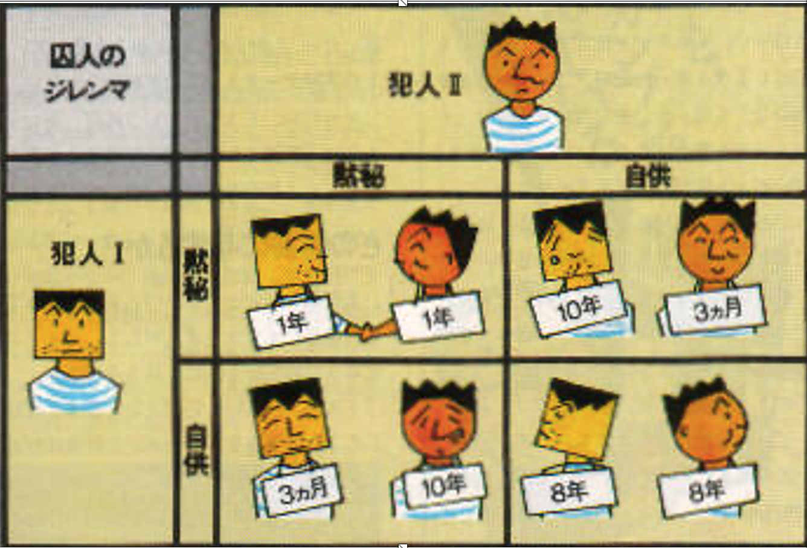
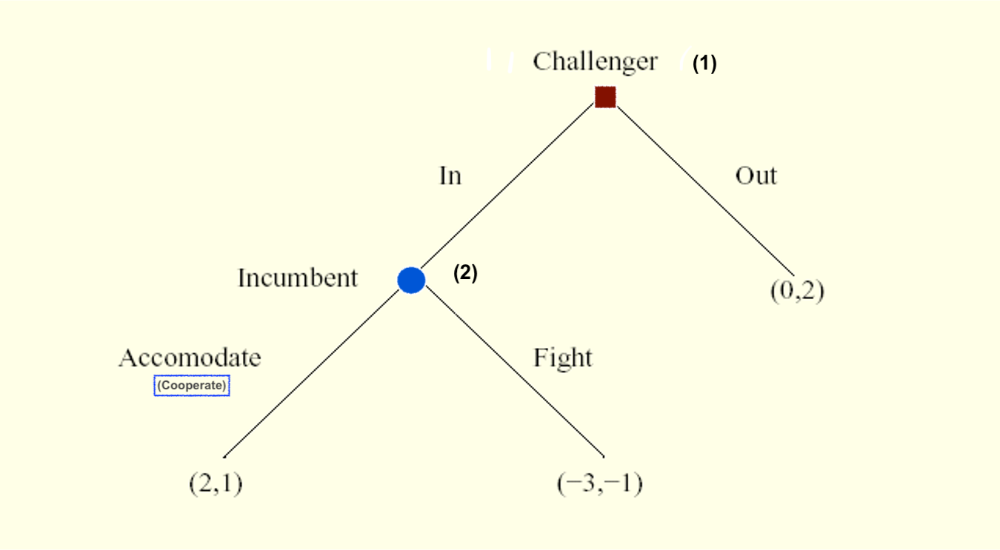
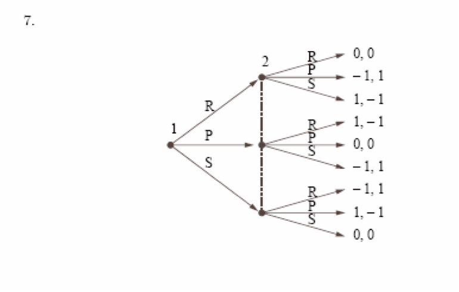
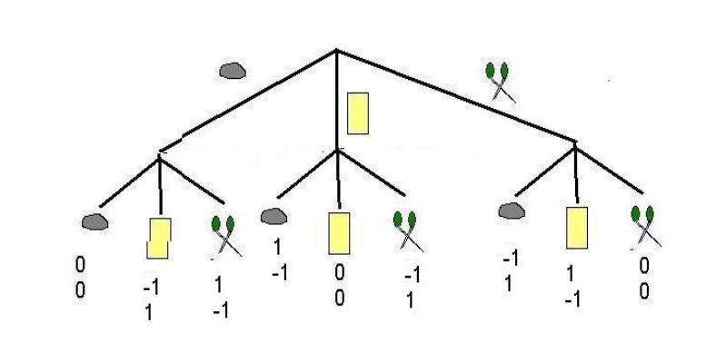
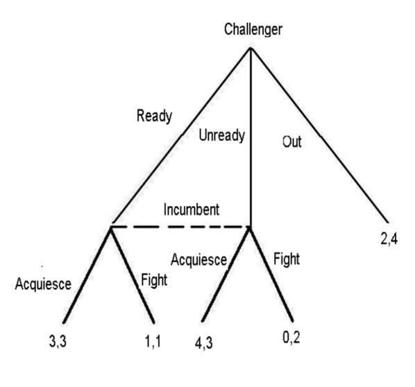

# Strategic interactions: Game theory; discussion and overview {-#game_theory}

## Some video lectures covering much of the material in the next sections, but less formally

*Note: These videos might only be available to Exeter students*


1. Brief introduction to game theory

<iframe src="https://recapexeter.cloud.panopto.eu/Panopto/Pages/Embed.aspx?id=a8bd9bbe-e71f-4738-b7e9-a99b0074c45e&autoplay=false&offerviewer=true&showtitle=true&showbrand=false&start=5175&interactivity=all" height="405" width="720" style="border: 1px solid #464646;" allowfullscreen allow="autoplay"></iframe>

(Starting at 1:26:15)

2. Most of the material (notes/board based)

<iframe src="https://recapexeter.cloud.panopto.eu/Panopto/Pages/Embed.aspx?id=cf89257b-3a36-431a-93d8-ab0600751ac8&autoplay=false&offerviewer=true&showtitle=true&showbrand=false&start=1090&interactivity=all" height="405" width="720" style="border: 1px solid #464646;" allowfullscreen allow="autoplay"></iframe>


- [More slide-based version of the above](https://recapexeter.cloud.panopto.eu/Panopto/Pages/Viewer.aspx?id=43b7a9ad-c1ac-4c5e-9a4d-a9a20074e11a)
\

3. Backwards induction, games with infitite action spaces, discussion of laboratory experiments

<iframe src="https://recapexeter.cloud.panopto.eu/Panopto/Pages/Embed.aspx?id=530c2fa2-bcab-4c01-8422-a9a70074db6d&autoplay=false&offerviewer=true&showtitle=true&showbrand=false&start=0&interactivity=all" height="405" width="720" style="border: 1px solid #464646;" allowfullscreen allow="autoplay"></iframe>

\


## Suggested readings

See [outline](#game_outline) ...

<div class="marginnote">

1 Dec 2020: I've added in some additional suggested readings and articles that may be helpful for your project.

</div>


## Introduction

We considered decisions under 'natural' uncertainty (known probability distributions), considering preferences and choices, and concepts such as 'expected utility' and 'risk aversion'.


\

Much of microeconomics also considers the prices and outcomes in markets with many individual consumers and firms. We consider concepts such as (Walrasian) equilibrium.

\

Now we also want to consider  $\rightarrow$  *Strategic* uncertainty: one "agent's" best choice may depend on what others choose, but each agent may be unsure about what others will choose.

\

Furthermore, we may have interactions among only a small number of agents, so (unlike in large markets) each agent's choice may affect the payoffs of other agents (and, in sequential games, may influence their choices).

\

$\rightarrow$ **Game Theory** is one of the the main approaches that Economists (and others) use to consider such situations, and what choices might be made.

\

Is game theory useful???

Some people [seem to think so](https://www.linkedin.com/posts/eyal-winter-739b6b44_if-you-have-economics-students-who-complain-activity-6595028520324472832-dbJa/?fbclid=IwAR2K_dmkK7vazjZa6GRa3ZtSMWXhgLE30Fe0wzZ1ezPzNibYG7_Q5hn5jog):

```{r  fig.cap = '', out.width='50%', fig.asp=.4, fig.align='center',  echo = FALSE}
 knitr::include_graphics(file.path("picsfigs","winter_claims_gametheory_useful.png"))

```

\


### Basic concepts (strategic interaction, elements of a game))


In 'large markets with many small players': Each individual (consumer, firm, etc) takes all others' choices as given

- market price, demand curve, etc.

<<br> \bigskip

Now: Consider 'strategic interaction'

- My best choice may depend on your choice
    - And vice versa

- Sequential games: My earlier choices may change your later choices


### Some examples


`r format_with_col("Is it better to get lunch at Comida or Pret?","blue")`

\

<div class="marginnote">
2020-21 Exeter students: if this were a normal year this question qould make more sense.
</div>

<br>

- What if your friends are going to Comida?


<br>

- What if everyone and her cousin are going to Comida, so the queue is miles long?


<br>

\

`r format_with_col("What should Tim Cook charge for his new Iphone?","blue")`


<br>


- Does it depend on whether Samsung and LG...


... Sell their phones for £200, or £1000, or go out of business?


\


```{block2,  type='inputq'}

Find a situation in business, government, fiction, history or your own life  where one party's optimal choice depends on what another party does.


*Write it down*, give a 1-sentence explanation of why it involves 'strategic dependence'


```


Some possible examples:

```{block2,  type='fold'}

Life:

- Ask out your crush or not?


<br> \bigskip


Politics:

- Country makes war or peace? Soldiers fight or run away?

- Run for office or not? Party contests a seat? If so, how much to spend on campaign?


<br> \bigskip


Standard Economics:

- Amount to bid at a first-price auction?

- Whether Firezza pizza opens a new branch in Exeter, and where?

- How hard to work towards a promotion at your job?


Very interesting problems, does Econ and Game Theory have the solutions?

```


### What game theory can do (wet blanket) {-}


```{r  fig.cap = '', out.width='30%', fig.asp=.3, fig.align='center',  echo = FALSE}
 knitr::include_graphics(file.path("picsfigs","Eeyore_Pink.jpg"))
```

Game theory gives us a language and framework for analyzing strategic situations

The 'solution concepts' can be said to make ' predictions' under given assumptions.  The idea of 'equilibrium' is defined as a baseline.
\

Dr. Reinstein says: Sometimes overrated as a tool for predicting how people/firms will actually behave.

\


- It often makes multiple predictions, or predicts 'mixed strategies' (randomisation).

- Real-world and experimental choices are often/arguably predicted poorly by classical game theory.

- For example, standard game theory says chess has a pre-determined outcome and is a bit boring (ok, you may agree about the latter).

```{block2,  type='technote'}

Adv: But there are complicating issues making it difficult to asses the 'predictions' of game theory.

Particularly because monetary payoff may not be the same as utility payoffs ... this can make real-world predictions unclear.

Particularly if there are social preferences or fairness preferences. \


We also see failures to coordinate,
failure to take higher-order cognitive steps,
and preferences over the *manner decisions are made*.
These make Game Theoretic predictions difficult.

```


# Strategic games {#strat-games}

## Elements of a game {-}

**A 'strategic game'** (also called a 'normal-form game, I believe') must specify

1. Players,

2. Actions these players may choose, and

3. Payoffs resulting from the combination of players' choices

*Important note on interpretation of payoffs/preferences in game theory (unfold):*

```{block2,  type='fold'}


The 'utility' (payoff) to each player arising from the combination of each player's strategies (and chance) in the game

- May include both 'money earned' and other considerations; all this is summarised in the payoff numbers

- The goal of each player is to obtain the largest payoff that she can obtain (not just to 'win')

Note: E.g., each player prefers to get 2 in *utility* and have the other player get 8 than for both to get 1

Note: In this context it is typically not helpful to complain 'I don't think players will maximise their payoffs, because they also care about how others do, etc.' Whatever it is they care about can be expressed in the theoretical payoffs.\

However, these concerns are relevant to experiments that may incorrectly assume participants are maximising only their monetary payoffs.\


Also, there are also certain kinds of 'psychological' motivations that cannot be modeled in a straightforward way by payoffs. (see 'psychological games').

```

Main point: the payoffs depicted in a game should *include* psychological and fairness concerns.

I discuss this further in the supplement on behavioral economics and 'psychological payoffs' [here](#psych-payoffs).

<div class="marginnote">

[A Public Dilemma: Cooperation with Large
Stakes and a Large Audience](http://repository.essex.ac.uk/9979/1/dp617.pdf) ... offers an excellent example of how to apply this.

Game theoretical analysis of a game show game 'Golden Balls'; great use of game theory considering social preferences, applied to an empirical analysis. I have some slideson this [here](https://www.dropbox.com/s/zjpys23uyoblqr0/notesonbelotforclass_handout.pdf?dl=0).

</div>


\

<center>

**The game of 'chicken':**


```{r  fig.cap = '', out.width='50%', fig.asp=.4, fig.align='center',  echo = FALSE}
 knitr::include_graphics("picsfigs/chicken.png")
```

<iframe width="800" height="600" src="https://www.youtube.com/embed/u7hZ9jKrwvo" frameborder="0" allow="accelerometer; autoplay; encrypted-media; gyroscope; picture-in-picture" allowfullscreen></iframe>

</center>


\
```{block2,  type='inputq'}
1.  *Who are the players in Chicken?*

2. What are the actions (pure strategies) in Chicken?

3. What are the payoffs in Chicken?
```

```{block2,  type='fold'}

1.   The north-facing car 'North' and 2. the south-facing car 'South'

2.  For both N and S, two actions -- Pull-off, Straight.

3. Payoffs are a function of the action profile, discussed below
```

\

*Payoffs in 'Chicken'; what makes a game a 'game of Chicken?'*


- Both pull-off $\rightarrow$  Tie


- N Straight, S pulls off $\rightarrow$ N 'wins', S 'loses'

- N pulls off, S straight $\rightarrow$ N 'loses', S 'wins'


- Both straight $\rightarrow$ crash


\

*To meaningfully convey this game* (at least according to its standard characterization in Economics) payoffs must follow: Win $\succ$ tie  $\succ$ lose $\succ$ crash

\


Here is an example of payoffs that capture the essential strategic considerations in 'Chicken'.

*Payoffs are written as a matrix below: by convention, the 'Row' player's payoffs are specified first in each cell, followed by the Column player's payoffs*


```{r, echo=FALSE,message=FALSE}

library(magrittr)
library(kableExtra)

# Define Variables
W=1
L=-1
T=0
C=-10

# Assign Pairs
pair <- function(x,y) sprintf("(%d,%d)", x,y)
all_pairs <- c(pair(T,T), pair(W,L), pair(L,W), pair(C,C))
payoff.mat <- matrix(all_pairs, nrow=2)
dimnames(payoff.mat) <- c(rep(list(c("Pull off","Straight")), 2))
results = "asis"

# Plot
payoff.mat %>% kable() %>% kable_styling()


```


Note that what will matter are the *relative payoffs* and not the absolute levels... (at least, if we ignore 'mixed strategies' for now).

<div class="marginnote">
For another example of a game or 'category of 2x2 games', please see the famous [Prisoners' dillemma](#pd-normal), depicted below.
</div>


\


**O-R define the strategic game as a formal mathematical object:**

<div class="marginnote">

Remember that formal mathematical definitions help us avoid ambiguity, and allow us to use the 'general tools of maths' to construct proofs. E.g., 'fixed point theorems' can be applied to prove the existence of an equilibrium in some cases.

</div>


> A strategic game$\langle N , (A^i)_{i \in N}, (\succsim^i)_{i \in N} \rangle$ consists of

> players: a set $N = \{1,..., n\}$

(However, we will mostly consider 2-player games)

> actions: for each player $i \in N$ , a set $A_i$ of actions

This action set may be discrete (e.g., $A_i = \{Yes. No\}$) or continuous (e.g., a firm may choose a positive quantity $q$, so  $A_i = q \in R_+$).

\

> preferences: for each player $i \in N$, a preference relation $\succsim^i$ over the set $A = \times_{i \in N} A^i$ of action profiles.

I.e., each player has preferences over the 'outcome' of the game, the combination of actions chosen by each player (referred to as an 'action profile').

<div class="marginnote">
I believe the $\times_{i \in N}$ sign represents the 'Cartesian product', i.e., the set of all combinations of one of each element.

Note that preferences are defined *directly* over the set of action profiles, unlike in market models.
</div>


> A function $u_i : A \rightarrow  R$ that represents $\succsim^i$  is a payoff function for player $i$.

\

The 'Strategic game' form is typically used to depict simultaneous games; where all players make their choice at the same time (or if not at the same time, no players know the choices made by other players when their choices are made), with 'complete information' (all players know whom they are playing against, and what these players' payoffs are.)

\

With only two players and a finite number of actions, these games are often displayed using a matrix, such as (again) for the 'Chicken' game below.

\

```{r  fig.cap = 'A matrix depicting players actions and payoffs in the Chicken game', out.width='60%', fig.asp=.6, fig.align='center',  echo = FALSE}

 knitr::include_graphics("picsfigs/chicken-matrix.png")

```

\

In contrast, the *Extensive game* form is typically used to depict a game involving a (finite or infinite) *sequence* of choices made by players; we will return to this further below. Extensive-form games with a finite number of actions are often depicted using 'game trees', as in the 'simplified ultimatum game' below.

<div class="marginnote">
However, technically both simultaneous and sequential games can be depicted in either strategic form or extensive form. For an example, see the [prisoners dilemma depiction](#pd-normal) below.
</div>


```{r  fig.cap = 'Game tree - Simplified Ultimatum Game' , out.width='60%', fig.asp=.6, fig.align='center',  echo = FALSE}

 knitr::include_graphics("picsfigs/ultsimple.png")

```
\


## 'Individual optimization considerations'; best responses, 'rationalizability'


```{block2,  type='note'}

Note: O-R jump right into the definition of Nash Equilibrium (NE) at this point. I prefer to first introduce individual optimization and strategic considerations (unfold discussion of why). I introduce these concepts somewhat less formally than the O-R depict NE (but of course we *could* depict rationalizability more formally; I will give you some 'taste' of this).

In the fold below, I discuss this issue further.


```

```{block2,  type='fold'}

Nash Equilibrium (NE) does not automatically arise from players' optimization (nor from players' optimization under "common knowledge of rationality" which we will get to soon). Nash Equilibrium (NE) simply represents a "stable point" from which no player would want to 'deviate unilaterally'; however there multiple equilibria (or no 'pure strategy equilibrium'), and, particularly in the absence of communication, players may fail to coordinate on an equilibrium. Both may regret their actions, each having thought the other player would have made a different choice.

\

I prefer to begin by thinking about each individual player strategic considerations, and then to introduce the idea of 'Rationalizability' in a strategic context (calculated through 'iterated strict dominance', and potentially justified in a situation of 'common knowledge of rationality'. There are some connections between NE and Rationalizability; e.g., where there is a unique rationalizable outcome, it also represents a unique Nash Equilibrium. But they are fundamentally different concepts: Rationalizability represents the consequence of players optimizing, while NE simply represents a 'stable point'.

In Osborne and Rubinstein's 1994 text, 'A Course in Game Theory', they note:

> If the game is a one-shot event in which all players choose their actions simultaneously then it is not clear how each player can know the other players' equilibrium actions ... [as in NE... thus we consider solution concepts] In which players' believes about each other's actions are not assume to be correct but are constrained by considerations of rationality...

```


### Common knowledge

- What all players know, and
- all players know that all other players know,
- and all players know that all other players know that all other players know,
- and all players know that all other players know that all other players know that all other players know,

 etc.

*Note:* We always assume that the rules of the game are common knowledge.

\


Why is common knowledge important?


{width=80%}

Among other things, you may be stuck on an island 'with 100 blue-eyed people, 100 brown-eyed people, and the Guru'... (unfold if you like puzzles!)

```{block2,  type='fold'}

- [XKCD_link](https://xkcd.com/blue_eyes.html "puzzle")
- [XKCD solution link](https://xkcd.com/solution.html "solution" )
- [Rob Heaton version, more violent](http://robertheaton.com/2014/01/06/how-to-win-at-dinner-party-the-blue-eyed-islanders/ "puzzle and solution")
- [Ted-ed video](http://ed.ted.com/lessons/the-famously-difficult-green-eyed-logic-puzzle-alex-gendler)

\

Warning: this puzzle will do your head in

\


\

There is an island with 1000 people.
- 100 of them have blue eyes, 900 have brown eyes
- There are no reflective surfaces


By custom or law:

> He who knows own eye colour must commit suicide the next day in the town square
>  No one can discuss another person's eye colour.

Now an American tourist visits, and says "It’s so nice to see one or more people with blue eyes in this part of the world”.

<br> \bigskip


Q: *What effect, if any, does this faux pas have on the island?*


<br> \bigskip


Ans: If his statement is 'common knowledge' then all 100 blue-eyed people will kill themselves on day 100 after the speech!

```


\

A's *Best Response* (BR) to strategy *S*:

:     a strategy for player A that gives her the highest payoff of all her possible strategies, given that the other player(s) play *S*

\

<div class="marginnote">

Note: The BR is a function of the others' strategies *S*; it may take a different value for each strategy the others play.

</div>


\


### Dominant, dominated strategies and rationalizability

<div class="marginnote">

Again, iterated strict dominance and rationalizability are NOT covered in the O-R text, but I want you to learn it.  As a prediction it is much easier to justify than Nash Equilibrium.

</div>

<br> \bigskip

Dominant strategy
:     A single strategy that is a best response to *any* of the other player’s strategies.

- A simple prediction: a 'rational' player will play a dominant strategy, if she has one.

\

Dominated strategy
:     Strategy A is dominated by strategy B if B yields higher payoffs for *any* of the other player’s strategies

- A simple prediction: a rational player will *never* play a dominated strategy

*Why?*: because a dominated strategy  cannot be optimal for *any* belief about what the other player(s) will do


<br> \bigskip

```{block2,  type='note'}

With only two strategies to choose among these concepts are the same.

With more than two, if there is a Dominant strategy this means that all other strategies are dominated by it. We see this in examples below.

```

\

```{block2,  type='inputq'}

What is the prediction of 'players play dominant strategies' in the Prisoner's dilemma"

```


```{r  fig.cap = '', out.width='55%', fig.asp=.4, fig.align='center',  echo = FALSE}
 knitr::include_graphics(file.path("picsfigs","pd_normal.png"))
```

Here it clearly predicts that both will confess. However, in some other games this concept may have no clear prediction.

<div class="marginnote">
Food for thought: if a player's Best response is unaffected by the other player's best response, is this really a game with "strategic interaction"?

Perhaps the Prisoner's Dillemma, arguably the most famous game, and one that dramatically illustrates the potential for group interest to depart from individual interest...  is a very boring game; if it's even meaningfully a game.  Whatever you choose has no bearing on whatever my best choice might be!
</div>


\

```{r  fig.cap = '', out.width='65%', fig.asp=.4, fig.align='center',  echo = FALSE}
 knitr::include_graphics(file.path("picsfigs","matrixforISD.png"))
```


<div class="inputq">

What does 'players play dominant strategies' predict above? What about 'players never play dominated strategies'?

</div>

\


### Rationalisability/ Iterated strict dominance

Extending this ...

**Rationality assumption:** the players are rational.

We know rational players will not play dominated strategies
The players *themselves* know this.

<br> \bigskip

**Common Knowledge of Rationality assumption:**

The players know all other players are rational. The players know all players know all players are rational.  The players know (all players know … ad infinitum) all players are rational.

- Thus the players know what the other players will never do, and eliminate these from consideration
- The players will not play a strategy if another strategy is always better against this reduced set of possibilities
- Etc.

This process is called 'Iterated Strict Dominance' (ISD) We will call strategies that survive ISD **'rationalizable' strategies**.

Rationalizability has a somewhat different conceptual justification than ISD, but they are closely related.

<div class="marginnote">
There are differences between 'rationalizable' and 'survives ISD' but for our purposes these are basically the same. At least in a finite strategic game (a finite number of actions), the set of (actions leading to) outcomes that survive ISD is the set of profiles of rationalizable actions.
</div>

A formal definition of rationalizability (From O-R 1994, p. 54):

```{block2,  type='fold'}

> An action $a_i \in A_i$ is *rationalizable* in the strategic game $\langle N, (A_i), (u_i)\rangle$

(this notation is similar to our notation, except that they are using a utility function $u_i$ to depict preferences)

> if for each $j \in N$ there is a set $Z_j \subseteq A_j$ such that

(a subset of the action space for *each* player... think of)

> $a_i \in Z_i$

($i$'s own action is in this set)

> [and] every action $a_j \in Z_j$ is a best response to a belief $\mu_j(a_j)$ whose support is a subset of $Z_{-j}$.

(The action is a best response to some belief about other players' actions ... where these actions are themselves best responses to some belief about other players' actions, where these actions are themselves...)

```


\

ISD example; may yield a unique prediction:


```{r  fig.cap = '', out.width='70%', fig.asp=.4, fig.align='center',  echo = FALSE}
 knitr::include_graphics(file.path("picsfigs","matrixforISD.png"))
```


```{r  fig.cap = '', out.width='50%', fig.asp=.4, fig.align='center',  echo = FALSE}
 knitr::include_graphics(file.path("picsfigs","isd1.png"))
```

```{r  fig.cap = '', out.width='50%', fig.asp=.4, fig.align='center',  echo = FALSE}
 knitr::include_graphics(file.path("picsfigs","isd2.png"))
```


```{r  fig.cap = '', out.width='50%', fig.asp=.4, fig.align='center',  echo = FALSE}
 knitr::include_graphics(file.path("picsfigs","isd3.png"))
```


\

However, there may be *no* dominated strategies, or there may be *some*, but still ISD may leave many possibilities:

```{r  fig.cap = '', out.width='40%', fig.asp=.3, fig.align='center',  echo = FALSE}
 knitr::include_graphics(file.path("picsfigs","bossmall.png"))
```


\

## Nash equilibrium {#ne-strategic}

> according to which a profile of actions is stable if no individual wants to deviate from her action given the other individuals’ actions


<div class="marginnote">
Compare to 'market equilibrium': given the equilibrium price and quantity, no market participant has an incentive to change his or her behaviour.
</div>


<br> \bigskip

### NE: Simple definition and discussion

```{block2,  type='note'}

I present a basic undergraduate-level explanation of this here. If this is already familiar an obvious to you, you may skip this and go right to the O-R reading.

If you are *not* familiar with this, you may find it helpful to read first before digging into the formal presentation.

```


Nash equilibrium (NE)
:     A set of *strategies*, one for each player, that are best responses against one another


- If I play my BR to your chosen strategy and you're playing your BR to mine, neither of us has an incentive to deviate --- an equilibrium.

- All games have at least one Nash equilibrium
    - But it may be an equilibrium in 'mixed strategies' (involving randomisation)

- Caveat: we might not expect such play to actually occur (particularly not in one-shot games)

<div class="marginnote">
 In fact, two-player games will have an *odd* number of equilibria, at least if we include 'mixed strategy Nash Equilibria'; you can see this by looking at the crosses of the BR functions
</div>

### NE: Formal depiction

From O-R:


```{block2,  type='def'}

> In a strategic game $\langle N , (A^i)_{i \in N}, (\succsim^i)_{i \in N} \rangle$

> an action profile $a = (a^i) \in A$

(profile of actions: one action chosen for each player $i$)

>  is a Nash equilibrium if for every player $i \in N$ we have

> $(a^i, a^{−i}) \succsim^i (x^i , a^{−i})$ for all $x^i \in A_i$$


*Note*: $a^{−i}$ denotes 'the action chosen by all players other than player $i$'.

> where $(x^i , a^{−i})$ denotes the action profile that differs from $a$ only in that the action of individual $i$ is $x^i$ rather than $a^i$.

```

Thus, again, in the above definition,each player's action in action profile $a$ is a best response to the other players' actions ... because no other choice would make player $i$ better off, given what the others choose.

\

O-R similarly define a NE in terms of 'each player best responding' ... defining  $BR(a^{−i}) as "the set of player $i$’s best responses to $a^{-1}$ and "action profile $a$ is a Nash equilibrium if and only if $a^i \in BR(a^{−i})$ for each player $i$.

\

```{block2,  type='warning'}

For a NE:

1. These need not be *strict* best responses; each player may have more than one best response to the other players' choices in this strategy profile... all that it requires is that $a^i$  is among the best responses.


2. We do not ask 'If I changed my response and others correspondingly also changd their responses would I be better off'? (That would be closer to the Kantian equilibrium concept discussed in O-R). We just ask "if I change my response can I do better, given what others are doing." If the answer is 'no', then I am best responding. If the answer is 'no' for all players, then all are best responding to each other, and this profile is a Nash equilibrium.

3. Remember that a Nash equilibrium is a property of an  *action profile* (or a 'strategy profile'), with one action or strategy for each player. It is not, strictly speaking, a property of an outcome nor a property of a set of payoffs. We can state "the payoffs consistent with Nash equilibrium are" ... But we shouldn't state "the Nash equilibrium is that each player gets payoffs 10".


```


\

### Note on O-R characterization of 'Nash equilibrium' {#note-ne}

O-R define a "Nash Equilibrium in a strategic game" as involving 'pure strategies' only. No player is randomizing.

Going with this definition, they state:

>  some strategic games do not have a Nash equilibrium.

This contrasts with the definition I have seen previously. In most text, Nash equilibrium is define to allow either mixed or pure strategies.

\

They later define "Mixed strategy equilibrium" and they note (but do not prove here):

> every game in which each player’s set of actions is finite has a mixed strategy equilibrium.

As I said, I am more familiar with the definition of NE to include mixed strategies, does the above statement could be modified to be: "every game in which each player’s set of actions is finite has a Nash equilibrium, which may be in mixed strategies".

By the way, even among infinite games, a Nash equilibrium (or "mixed strategy equilibrium") is guaranteed to exist so long as the strategy sets are ["compact"](http://www-math.mit.edu/~djk/calculus_beginners/chapter16/section02.html) and the payoff functions are continuous.


```{r  fig.cap = 'Can you guess which game this depicts?', out.width='50%', fig.asp=.4, fig.align='center',  echo = FALSE}



```

\

## Examples of strategic games


Please consider all of the examples in O-R section 15.2-15.3, at least insofar as you find these interesting.

*These illustrate an array of interesting and fundamental concepts*:

\

We see:

-  Games where the NE (and indeed the unique rationalisable strategies) defy both intuition and 'actual play in experiments', and where the NE does *not* maximise the player's payoffs \*  -- (Traveler's dillemma, Prisoners' dillemma, price and quantity setting, see also the ['Keynsian Beauty contest'](https://web.stanford.edu/~niederle/GuessingGames.pdf) or problem 5 in O-R) ...

<div class="marginnote">
\* Although, as I mention elsewhere, in any interactive experiment it is hard to rule out that 'social preferences' may drive the results. We can only control the financial payoffs; we don't know what the "true payoffs" are if players care about other players or about fairness etc.
</div>

- Games with infinite strategy spaces (Traveller's game, Auctions, Location games, Price and quantity-setting games,... )

- Finite (matrix) games (Bach or Stravinsky, all the other ones where a matrix is displayed)

- Coordination games (Bach or Stravinsky, Coordination game)\*

- Anti-coordination games (Odds or evens, Matching pennies)

<div class="marginnote">

'Bach or Stravinsky' is usually called the 'Battle of the Sexes', and the choices are 'Ballet' (preferred by the 'Wife') and 'Boxing' ('Husband's' preference). Personally, I find this much easier to remember. If we want to subvert the stereotype here, We could think of the ballet as being extremely violent and the boxing match as a boxing match fought with feathers and balloons.

</div>


- Games where actions are 'strategic complements' (e.g., *Effort game*)

- Games where actions are 'strategic substitutes' (e.g., *Cournot quantity-setting game*)

\

These also present strategic insights at the core of several theory-heavy applied fields, such as

- Auction Theory: *First-price and Second-price auctions*

- Industrial Organization (firm strategy and antitrust): *Location game* (aka 'Hotelling model'), *Quantity-setting* (Cournot), *Price Setting* (Bertrand), War of attrition (presented later)

- Development economics and the study of cooperation: *Effort Game*,


*Other examples are given in the practice problems; these involve legitimately interesting and relevant examples, not simply 'busy work'*

\

```{block2,  type='note'}

Note that I skip several sections of O-R here,  for time considerations. I skip:

- Existence of a Nash equilibrium (see also my note [above](#note-ne) on O-R's unusual terminology). You may nonetheless find this worth reading, particularly if you love maths. The definition and discussion of 'supermodular games' is also fairly relevant; it comes up a bit in the literature.

- Strictly competitive games (i.e., 'zero sum games') ... have a look at the definition at least

- Kantian equilibrium (a very interesting non-standard concept!)

```


## Mixed strategy (Nash) equilibrium of strategic games

### Simple presentation

```{block2,  type='note'}

I present a basic undergraduate-level explanation of this here. If this is already familiar an obvious to you, you may skip this and go right to the O-R discussion of mixed strategy equilibrium. However, if you are *not* familiar with this, you may find it helpful to read first before digging into the formal presentation.

```

\

*Note*: I use the terminology of 'pure and mixed strategies' (slightly different from O-R) here

Pure strategy
:     Consists of a single action played with certainty

<br> \bigskip

Mixed strategy
:     Assigns a probability to each possible action

<br> \bigskip

*Remember: as claimed [above](#note-ne), in finite games (and a wide class of infinite games) there is always at least one NE. If there is no pure strategy NE, there will be a NE in mixed strategies.*

\

### Matching pennies: mixed strategies {-}

**Intuition**

If you choose heads/tails half the time then I'm indifferent between heads or tails. Thus, choosing 'heads' half the time is *among* my best responses.

If I choose heads half the time then you're indifferent between heads/tails. Thus choosing heads half the time is *among* your best responses

So, technically, each of us choosing heads half the time is a NE.

<div class="marginnote">
But it is called a 'weak' NE because either of us would do no *worse* if he deviated alone.
</div>

\

### Battle of sexes: mixed strategies {-}

<center>

BEEM101 students can access my chalkboard discussion of this in the video below:

<iframe width="640" height="360" src="https://web.microsoftstream.com/embed/video/9f835e1c-bd24-48f1-b9ff-d3ea55bf6721?autoplay=false&amp;showinfo=true" allowfullscreen style="border:none;"></iframe>

</center>

\


```{r  fig.cap = 'Image source: Nicholson and Snyder', out.width='70%', fig.asp=.4, fig.align='center',  echo = FALSE}
 knitr::include_graphics(file.path("picsfigs","bosmatrix.png"))
```

*Note:* Wife wants to end up at the same place as her husband but doesn’t know where he is going.\

- If she believes that he will always go to the ballet she should always go to the ballet.\

- If she believes he will always go boxing, she should go boxing.\

- What other beliefs may she have?

We want to derive the best response functions, and find the intersection(s) of these.

Let $h$ represent the probability husband chooses Ballet


```{r  fig.cap = 'Source: Nicholson and Snyder', out.width='75%', fig.asp=.4, fig.align='center',  echo = FALSE}
 knitr::include_graphics(file.path("picsfigs","bosmatrix.png"))
```
\

**Wife's BR:**

- Wife chooses Ballet iff her Expected payoff of Ballet > Expected payoff of Boxing

<br> \bigskip


I.e., $2h > 1- h$, i.e, $h > 1/3$

Thus, wife goes to Ballet if she believes husband goes to Ballet more than 1/3 of the time

- If she thinks he goes below 1/3 of the time she goes to Boxing

- If she thinks he goes *exactly* 1/3 of the time she is indifferent


\

```{r  fig.cap = '', out.width='70%', fig.asp=.4, fig.align='center',  echo = FALSE}
 knitr::include_graphics(file.path("picsfigs","wife_br.png"))
```

*Note:* This plots the value of w that best responds to h;\ the probability the wife goes Ballet given the probability the husband goes Boxing.

\

Let $w$ denote the probability wife chooses Ballet

\

**Husband's BR:**

<br> \bigskip


Husband chooses Ballet iff his Expected payoff of Ballet > Expected payoff of Boxing

$$1w > 2- 2w$$, i.e., $$w > 2/3$$ ... for these payoffs


Thus, husband goes to Ballet if he believes wife goes Ballet more than 2/3 of the time

- If he thinks she goes less than 2/3 of the time he goes to Boxing

- If she thinks he goes *exactly* 2/3 of the time he is indifferent


```{block2,  type='technote'}
 Note that now that we are considering mixed strategies the ratios of the payoffs may matter in computing the equilibrium mixing probabilities, and not only 'which is larger'. Recall that this also was the case when we considered expected utility over uncertain outcomes.

```

\


```{r  fig.cap = '', out.width='70%', fig.asp=.4, fig.align='center',  echo = FALSE}
 knitr::include_graphics(file.path("picsfigs","wh_br.png"))
```


```{r  fig.cap = '', out.width='70%', fig.asp=.4, fig.align='center',  echo = FALSE}
 knitr::include_graphics(file.path("picsfigs","bos_3_eq.png"))
```


*Shortcut to computing this:* only someone who is indifferent will randomise. (Otherwise they must strictly prefer one or the other action, so 'mixing these' cannot be optimal.)

\

Above, $h=1/3$ makes wife indifferent, $w=2/3$ makes husband indifferent


\

### What's all this rot? {-}

Do people really "randomize their choices"?

```{r  fig.cap = '', out.width='50%', fig.asp=.5, fig.align='center',  echo = FALSE}
 knitr::include_graphics("picsfigs/doctors_mixing_cartoon.png")
```


\


Mixed strategies are not about 'being unpredictable', in spite of what some texts say ; these are one-shot games!

\


Some texts and authors make this point about 'unpredictability' but others disagree (including myself). Making sure that it is impossible to predict your later play from your previous is only important if you are playing the same game repeatedly, and being observed.

\

```{block2,  type='note'}

It makes a bit more sense if we think about 'populations.

Suppose in a population 1/3 of men go to Ballet and 2/3 of women go to Ballet:
... these ratios are 'stable'; no reason for systematic changes.
On the other hand, if men always went to boxing and women to ballet this is not stable. A husband would be better off going to ballet ... so the ratios should change over time.

This interpretation is presented and defended in more detail in O-R sections 15.7 and 15.8.

```

\

### Computing payoffs with mixing {-}

Remember, formally, a  NE specifies *strategies* (strategy 'profiles') not payoffs

In the BOS the pure strategy equilibria were

- i. Husband: Boxing, Wife: Boxing
- ii. Husband: Ballet, Wife: Ballet

\

The mixed-strategy NE was:

-  iii. Husband: go Ballet with probability h=1/3, Wife: Go Ballet with prob w=2/3.

The *payoffs* to these were, respectively

i. Husband: 2, Wife: 1

ii. Husband: 1, Wife: 2

iii. ... ??

\

Payoff to the mixed strategy:

Payoffs are utilities: thus under the Expected Utility model we sum the utility of each outcome $\times$ probability of that outcome

- Prob(Both go Ballet) = $w \times h = \frac{2}{3} \times \frac{1}{3} = \frac{2}{9}$
- Prob(Both go Boxing) = $(1-w)(1-h) = \frac{1}{3} \times \frac{2}{3} = \frac{2}{9}$
- Prob(Wife Ballet, Husband Boxing) = $w(1-h) = \frac{2}{3} \times \frac{2}{3} = \frac{4}{9}$
- Prob(Wife Boxing, Husband Ballet) = $(1-w)(h) = \frac{1}{3} \times \frac{1}{3} = \frac{1}{9}$

<br> \bigskip

Thus, under the mixed strategy NE play:

$$U_{husb} =  \frac{2}{9} \times 1 +  \frac{2}{9} \times 2 +  \frac{4}{9} \times 0 + \frac{1}{9} \times 0 = \frac{6}{9} = \frac{2}{3}$$
$$U_{wife} = \frac{2}{3}$$

(The wife's payoffs can be  inferred from symmetry of problem, or they can be similarly calculated.)


\


### Mixed Strategy: More formal presentation {#formal-mix}


*I love O-R's motivation for this* ... it makes a lot more sense than the usual characterisation of mixing (as well as for Nash Equilibrium)

Considering (e.g.) the Matching Pennies game (look it up to get this in your head)...

> from time to time, an individual is drawn randomly from each population and these two individuals play the game.

Some share of individuals in each population choose each action.

> We are interested in steady states in which each individual’s belief
about the distribution of actions in the other population is correct (perhaps because of his long experience playing the game) and each individual chooses his best action given these beliefs.

Note...\*

<div class="marginnote">

\* But note this need not be a 'strictly' best action ... there may be a tie. In fact, in any 'Mixed strategy equilibrium', all players who are mixing (equivalently, all 'populations in a certain role' where some share of the population chooses a certain action) ... each player must be *indifferent* between the actions she mixes among, given what other players are doing.
</div>


If the game has no (pure strategy) NE then "no configuration of choices in which all members of each population choose the same action is stable".

In 'Matching Pennies', if exactly half of all players in the population (on either side ... the game is symmetric) play 'Heads' this is "stable"; no player can do any better by changing her choice.\*

\

Formally (O-R definition)

```{block2,  type='def'}

> Given a strategic game ... a *mixed strategy* for player $i$ is
a probability distribution over $A_i$.


> A mixed strategy $\alpha_i$ that is concentrated on one action (i.e. $\alpha^i(a^i) = 1$ for some $a^i \in A^i$) is a *pure strategy*

```

With countable actions a mixed strategy $\alpha_i$ of player $i$ assigns a probability $\alpha^i(a^i)$ to each possible action.  O-R's preferred interpretation ... "$\alpha^i(a^i)$ as the proportion of population $i$ that chooses the action $a_i$."

\

O-R point out that the standard interpretation of this involves EU preferences. Thus

> we specify the preferences of each player $i$ in a strategic game by giving a Bernoulli function $u_i$ whose expected value represents the player’s preferences over lotteries over action profiles...


\

To avoid the use of integrals, O-R define the *mixed strategy equilibrium* here for finite or countably infinite games only:

```{block2,  type='def'}

> Let  $G = \langle N, (A^i)_{i \in N}, (u^i) i \in N \rangle$ ...

> a  profile $(\alpha^i$)_{i \in N}$

(Remember -- this assigns a probability to each action ... for each player)

> is a *mixed strategy equilibrium* of $G$ if ... [for every player and every action $a_i$ assigned positive probability]

> $i$’s expected payoff...  from $a_i$ given $\alpha^{−i}$

(rem: $\alpha^{−i}$ is the strategy of all other players)

> is at least as high as his expected payoff from $x_i$ given $\alpha^{-i}$ for any $x^i \in A^i$.

```

... so every action played with positive probability in a *mixed strategy equilibrium* must be at least as good as any other action given the actions of others.  This also accords with the 'population interpretation': every individual in the population must be happy with her action choice.

\


### Example: War of attrition \* {-}


<div class="marginnote">
I will add some discussion here.
</div>

This is a very important concept across a wide range of domains from biology to business strategy to law and politics.

\


## Supplement: Finding NE in continuous games; example -- the 'Tragedy of the commons'


```{block2,  type='note'}

A general method for finding NE for continuous games with differentiable payoffs, finding NE:

1. Write down payoff functions. (Differentiable? If not it becomes more difficult.)

2. Maximize each player’s payoff with respect to own strategy; the other player's payoff are a fixed 'parameter' here $\rightarrow$ Players' best-response functions.

3. Look for intersection(s) $\rightarrow$ Nash equilibrium (equilibria)

```


<div class="marginnote">
Source: https://www3.nd.edu/~tjohns20/gametheory_SP13/slides3.pdf}
</div>


<br>  \bigskip


With two players:

$$s_i^\ast=B_i(B_-i(s_i^\ast))$$

If the game is symmetric this is a 'fixed point'.


\

### Tragedy of the Commons example

Shepherds A and B raise $s_A$ and $s_B$ sheep, respectively, in the same meadow

- More sheep graze $\rightarrow$ the less grass for each, thus less wool/milk/meat per sheep

Benefit from each sheep raised: $120-s_A-s_B$

\

Total benefit from raising $s_A$ and $s_B$ sheep:

- Shepherd A:	$s_A(120-s_A-s_B)$
- Shepherd B:	$s_B(120-s_A-s_B)$

\
Marginal benefit of 'me adding' another sheep:

- Shepherd A:	$120-2s_A-s_B$
- Shepherd B:	$120-s_A-2s_B$


\

For simplicity, assume zero marginal cost. Set the marginal benefit equal to the marginal cost (here zero)

- Shepherd A:	$120-2s_A-s_B = 0$
- Shepherd B:	$120-s_A-2s_B = 0$

Rearrange the above to solve for the best response functions

- Shepherd A:	 $s_A = 60-\frac{1}{2} s_B$
- Shepherd B:	 $s_B = 60-\frac{1}{2} s_A$

\


Solve for the Nash equilibrium:

$$s_A = 60-\frac{1}{2} s_B$$

\

Plug this value of $s_A$ into the BRF for B and solve for $s_B$, then for $s_A$

$$s_B = 60-\frac{1}{2} s_A = 60 - \frac{1}{2}(60-\frac{1}{2} s_B)$$

$s_A* = s_B* = 40$


\

<div class="marginnote">
Image source: Nicholson and Snyder, 2012
</div>


```{r  fig.cap = '', out.width='80%', fig.asp=.4, fig.align='center',  echo = FALSE}
 knitr::include_graphics(file.path("picsfigs","brsheep.png"))
```

- Shepherd A:	 $s_A = 60-\frac{1}{2} s_B$

- Shepherd B:	 $s_B = 60-\frac{1}{2} s_A$
- $\rightarrow s_A* = s_B* = 40$


\

**Why the “Tragedy” of the Commons?**

*Some examples...*


- Firms choose a price or quantity of a product, or a level of R\&D, etc.
- Households voluntarily contribute to a local public good (e.g., neighborhood watch), or choose how many fish to catch from the shared pond
- Nations decide how large an army to build

$\rightarrow$ Payoff functions, continuous 'best response functions'; rather than a payoff matrix


\


To maximise *total* payoffs we set $S=s_A+s_B$ to maximise
$$S\times(120-S)$$

Concave problem, set first-derivative to zero:
$$120 - 2S = 0 \rightarrow S^*=60$$

\

Leading to total payoff $60 \times (120 - 60) = 3600$.
- If they split this evenly (each graze 30), they get 1800 each.
- This is the 'continuous' action analogy of the Prisoner's dilemma

- If split evenly (each graze 30), get 1800 each.
- This is the 'continuous' action analogue of Prisoner's dilemma

\


Note that both the PD and the above 'tragedy of the commons' game illustrate a similar point:  *Individuals acting in their own private interest may end up each doing worse off than if they could cooperate or collude.*

\

*Sadly, this problem (literally!) is still relevant.*  See, e.g., ["Morocco: Managing the 'commons' Livestock and Pasture Development Project in the Eastern Region"]({http://www.ifad.org/evaluation/public_html/eksyst/doc/profile/pn/morocco.htm)


```{r  fig.cap = '', out.width='70%', fig.asp=.4, fig.align='center',  echo = FALSE}
 knitr::include_graphics(file.path("picsfigs","moroccansheep.jpg"))
```

\

### Again -- "Strategic complements" and "strategic substitutes"


The slope of these 'best response functions' tells you whether the two players 'choice variables' (above, sheep) are **Strategic complements** or **Strategic substitutes**.


(Of course, we can also have 'strategic heterogeneity'... strategic substitutes starting from some points, some combinations of strategies in the 'strategy space'  strategic complements starting from other points.)


"Continuous Action" games  allow us to see how the equilibrium shifts as we change one 'parameter'. E.g., increase A's benefit per sheep .We call this 'comparative statics analysis'. Further discussion...

```{block2,  type='fold'}


Comparative statics can be applied more generally and even in much more abstract games and situations. Sometimes we can derive comparative statics properties of equilibria (or "monotone comparative statics" where we do not allow jumps between equilibria) even when we cannot solve for the equilibria themselves!

```


## Supplement: Prisoners’ Dillemma in Normal and extensive form {#pd-normal}

*The original story*:

> Two individuals are arrested for a crime.  They both know that they can only be convicted for a lesser crime, for which they get 2 years in jail. DA (Chief Crown Prosecutor) puts them in separate rooms and offers each the same deal. If you confess and your partner stays quiet you will only get 1 year in jail and they will get 10 years.

If you both confess you will each get 3 years.

\


What would you do? What would most people do? What does game theory predict?

<br> \bigskip

Which *outcome* is *definitely NOT* Pareto-optimal (for the prisoners)?

<div class="marginnote">
Image source: Nicholson and Snyder, 2012
</div>


```{r  fig.cap = 'Prisoners dillemma -- one set of payoffs', out.width='65%', fig.asp=.4, fig.align='center',  echo = FALSE}

knitr::include_graphics(file.path("picsfigs","pd_normal.png"))

```

- Normal form payoff matrix (also called 'matrix form')

- Payoff convention: listed in the order (row's payoffs, column's payoffs)

<br> \bigskip

**A Prisoner's Dilemma be like** \*

<div class="marginnote">
\* Note to non-native-English speakers... I am shamelessly pandering to the youth here by trying to use their jargon. 'Be like' is not proper usage in the Queen's English.
</div>


Two Players: (A and B, row and column, whatever)


Strategies (Actions): 'Cooperate' (C) or defect (D)


In normal form:


```{r, echo=FALSE,message=FALSE}

# Define Variables

# Assign Pairs
pair <- function(x,y) sprintf("(%s,%s)", x,y)
all_pairs <- c(pair("R","R"), pair("T","S"), pair("S","T"), pair("P","P"))
payoff.mat <- matrix(all_pairs, nrow=2)
dimnames(payoff.mat) <- c(rep(list(c("Cooperate","Defect")), 2))
results = "asis"

# Plot
payoff.mat %>% kable() %>%kable_styling()

```

To be a prisoner's dilemma game the payoffs must satisfy $T > R > P > S$

I.e., Temptation $>$ Reward $>$ Punishment $>$ Sucker

\


### The Prisoners’ Dilemma: Extensive form {#pd-extensive}

We can depict the same game in another format which we call the 'extensive form':

```{r  fig.cap = '', out.width='85%', fig.asp=.4, fig.align='center',  echo = FALSE}

knitr::include_graphics(file.path("picsfigs","pd_extensive.png"))

```

\

Above: the oval (usually this is given as dashed lines) depict the  'information set'/

Sequential move games *without* knowledge of previous moves are essentially equivalent to simultaneous move games.
Here, B may 'move second' but he doesn't know A's move (in the graphic above, he doesn't know "which side he is on"), so it's as if this is simultaneous.

\

Order only matters if you observe the earlier action.


## How do you solve a problem like multiple-equilibria?

<br> \bigskip


Above (BOS), there are three equilibria: both play Boxing, both play Ballet, and the mixed strategy

- Are any of these more reasonable as predicted outcomes?

\


### In-class experiment: BOS \& coordination; need 2 volunteers {-}

```{r  fig.cap = '', out.width='70%', fig.asp=.4, fig.align='center',  echo = FALSE}
 knitr::include_graphics(file.path("picsfigs","BOS_inlecture.png"))
```

\

'The Big Game'


```{r  fig.cap = '', out.width='75%', fig.asp=.4, fig.align='center',  echo = FALSE}
 knitr::include_graphics(file.path("picsfigs","coordgame_inlecture.png"))
```


**Outcomes**


**Recent year (2016)**


|         | Share chose | .. squared | Pay if match | E(Pay) |
|:-------:|:-----------:|:----------:|:------------:|:------:|
|    1    |     0.26    |    .068    |       2      |  0.52  |
|    2    |     0.21    |    .044    |       2      |   .42  |
|    3    |     0.11    |    .012    |       1      |   .11  |
|    4    |     0.16    |    .026    |       2      |   .32  |
|    5    |     0.26    |    .068    |       2      |   .52  |
| Wtd avg |     0.22    |    0.05    |              |  0.42  |


\


### Multiple equilibrium and refinements {-}

We refer to *refinement criteria* and *focal points*. For example...

1. 'Choose the equilibrium with the highest payoffs for both?'  In BOS this rules out mixing (payoffs 2/3, 2/3 for h,w respectively).
But it doesn't say whether we should predict Box, Box (payoffs 2,1) or Ballet, Ballet (payoffs 1,2)

2. Choose the 'symmetric equilibrium?' ... here, mixing

3. Choose the one that seems like a 'focal point'? (remember the 'big game')


\


### Is there a focal point? {-}

*In-lecture 'experiment':*

A year after graduating you come back for Alumni Weekend.  You are supposed to meet the veterans of this module for a night of festivities but can’t remember where or when. The internet does not exist.

- Where do you go?  Students: write it down on a piece of paper  Now type what you wrote in to the chat window

- What if you are meeting for a reunion in New York City, and no one has internet or phone access? Where do you go?  Write it down.  Type it into the chat window.


# Extensive form games (and sequential games) {#extensive}

Any game can be modeled as either a Strategic (AKA 'normal form') game or as an *Extensive Game* (AKA 'Extensive Form'). A key difference: in Strategic games we simply consider a set of actions or strategies, while in Extensive games we map  a "history", and we may consider the "sub-games" starting at any point in this history.

For situations that occur with sequential moves over time, where players alternate making choices, it may be simplest to depict these using a "game tree" such as the one below for the 'entry game' (formally an 'arborescence' with 'nodes and branches') and simpler to think of these as extensive form games.

\

<center>

{ width=80% }

</center>


*Note: Game trees can also depict simultaneous choices or a mix of simultaneous and sequential choices.*:


```{block2,  type='fold'}

The sequentiality of the choice only matters if the later mover is observing the previous decision. Thus, we can depict an "as if simultaneous" choice  by "connecting the information set" in a game tree.

See, for example, the 'Rock paper scissors' (anticoordination) simultaneous game below:



\

More graphically:


The dashed line indicates 'at the  time that player to his choosing rocks paper or scissors, she does not know whether player one has chosen rocks paper or scissors').

\

But we could also have 'sequential rocks paper scissors', perhaps a dumb game:





```


<!-- Add: example of a  complicated sequential game  depicted in a matrix -->
\

So, we can depict games in either format: the Strategic form (which we formally defined in the last section) or the Extensive form, as is convenient.\*

<div class="marginnote">
\* Note that it is easy to depict and to analyze most extensive form games with a game tree  and concepts such as "backwards induction".  However the formal representation of extensive form games is somewhat cumbersome, but we nonetheless introduce it below,  along with formal concepts such as subgame perfection.
</div>


<div class="marginnote">

'Complete contingent strategies':

“Imagine a player wishes to leave explicit instructions to some
agent” concerning how to play on his/her behalf.

– Note: This is not the same as a *commitment*.

</div>


However there is an important difference in the analysis of extensive form and strategic games. Some strategies may prescribe actions that may be optimal responses to another player's strategy if we 'start from the beginning' (or from an earlier stage of the game); however, if we were to actually reach the part of the game that prescribes such an action,  the action would no longer be optimal.  we may want to rule out such strategies involving "incredible threats" or "time inconsistent behavior". The Strategic form does not consider the sequence of the game, so it cannot address this; here we need the Extensive Form.


<div class="marginnote">

There may be other important differences in the analysis of the Extensive vs. Strategic representations of the games.  The Extensive form also makes it easier to consider imperfect and incomplete information; where earlier actions are not observed by later players, and where there are random components to payoffs.

\

The Extensive form (and tree depiction)  did make it convenient for me to consider the 'information sets at the end of the game'  and to depict payoffs adjusted for 'Losing Face' in a fancy game where  payoffs depend on information sets themselves. [@gallLosingFace2020]

</div>

```{block2,  type='note'}

O-R depict extensive games and subgame perfection (subgame perfect equilibrium) rather formally, with somewhat cumbersome notation.   We will cover most of this [below](#ext-formal).

But first, I present a simple depiction.

```


## Extensive form and subgame perfection: simple depiction {#repeated-games}

How does the Battle of Sexes game change if Wife chooses first, Husband observes her choice, and then he chooses

```{block2,  type='inputq'}

What do you think will happen?

- A. Wife: Ballet, Husband: Box
- B. Wife: Ballet, Husband: Ballet
- C. Wife: Box, Husband: Ballet
- D. Wife: Box, Husband: Box

```


```{r  fig.cap = '', out.width='70%', fig.asp=.4, fig.align='center',  echo = FALSE}

knitr::include_graphics(file.path("picsfigs","BOS_sequential.png"))

```

*Remember, it's a one-shot game ... unrealistic within a marriage of course*


- The wife has two strategies: Ballet or Boxing
- The husband has four contingent strategies, but we focus on what he will do in each of his two possible 'decision nodes'


*Here we see there is a 'first-mover advantage'.* (Unfold)

```{block2,  type='fold'}

It is better to be the first-mover than the second mover in such a game. If we switched the order, the wife would likely become better off and the husband worse off.

We see a very similar strategic concern in other contexts, including 'which firm enters a market first'. Suppose that if two firms are in a market there will be a price war with consumers as well as a bidding up of input prices and salaries,  and both will lose money. Perhaps by being the first firm to enter I 'scare off the other firm' and I can keep the profits. The other firm may 'threaten to enter' but that would seem to be a non-credible threat! On the other hand, suppose that I know that if I enter first the other firm can 'learn from my mistakes' and free-ride off my innovation. Here we would have a 'second-mover advantage'; but in such a game a BWI may lead to the outcome 'neither firm enters'!

```

\

These concerns also apply to politics, and the games can of course include multiple players ...

```{block2,  type='inputq'}

Can you think of some examples?

```

```{block2,  type='fold'}

Some example from  2018... can you think of comparable examples from today?

- Cameron's decision to allow a referendum, followed by politician's (Boris etc) decisions to choose a side?

- May's negotiations with the EU (Barnier), followed by the parliament's 'meaningful vote', followed by ??

- US Supreme court fight over Brett Kavanaugh, the sequential decisions of the last 'swing' senators

-  [UCU decision to declare and continue a strike, USS decision to award pay increases commensurate with inflation](https://exeterucu.wordpress.com/2019/10/26/strike-ballots-letter-to-students/)

```

\


Proper subgame (informal definition)

:     Part of the game tree including an initial decision not connected to another (in an oval or dashed lines) and everything branching out below it.

- I.e., each 'game' starting from a point where a player knows where he is (knows previous choices).\*

<div class="marginnote">

As noted earlier, if we want to consider imperfect information we may want to consider 'informations sets', and we can connect several nodes to indicate 'the player doesn't know at which node she is, because she doesn't know what the previous player(s) did

</div>


```{block2,  type='note'}

We can derive the *outcomes consistent with* SPNE via backwards induction.

Essentially, SPNE simply requires that each players (choose strategies that specify) would act optimally at each of the point they might find themselves... i.e., at each of the decision nodes in the extensive form 'game tree.'

```

\

*Is 'backwards induction' enough?*`

```{block2,  type='fold'}

To some extent this is the all of finite extensive games

BUT:

- Yields no prediction with indifference,

- No prediction with an infinite/indefinite horizon
- Unclear what it predicts with imperfect information.


BWI is similar to an iterated dominance prediction, where a player only plays actions that are dominant in each subgame, but in what sense is does it yield an equilibrium?

So maybe we need further concepts such as 'subgame perfection'

```
\


Subgame-Perfect Nash Equilibrium (SPNE)
:     Strategies that form a Nash equilibrium on every proper subgame.

You can solve for the *outcomes consistent with this with 'backwards induction' (BWI)

Solve for best move for last decision node (proper subgame)

- Given these, solve for best response for previous decision node

- Etc.

\

Example: BWI for *Sequential* Battle of the Sexes


```{r  fig.cap = '', out.width='50%', fig.asp=.4, fig.align='center',  echo = FALSE}
 knitr::include_graphics(file.path("picsfigs","bosbwi1.png"))
```


```{r  fig.cap = '', out.width='50%', fig.asp=.4, fig.align='center',  echo = FALSE}
 knitr::include_graphics(file.path("picsfigs","bosbwi2.png"))
```

Note that the SPNE in a sequential game always involves 'best responses'. I think this makes SPNE more credible as a prediction in sequential games than "NE in simultaneous games", as we don't require coordination.


\

```{r  fig.cap = '', out.width='45%', fig.asp=.4, fig.align='center',  echo = FALSE}
 knitr::include_graphics(file.path("picsfigs","bosbwi1.png"))
```
\

*Next we can formally the specify (SP)NE strategies for the above game:*

NE, not SP: \{Wife: Boxing; Husband: Boxing, Boxing\}

\

SPNE:  \{Wife: Ballet; Husband: Ballet, Boxing\}


*(reading Husband's decision nodes left to right; please specify this)*


\


**It can get fancier**

```{r  fig.cap = '', out.width='70%', fig.asp=.4, fig.align='center',  echo = FALSE}
 knitr::include_graphics(file.path("picsfigs","longgamework_randompayoffs_noul.png"))
```


<div class="marginnote">

*Note: you can 'build these games' at this on \url{http://gte.csc.liv.ac.uk/gte/builder/} if you like*

</div>

\

In 'normal' (matrix form), stating complete contingent strategies:

```{r  longgame-matrix, fig.cap = '', out.width='50%', fig.asp=.4, fig.align='center',  echo = FALSE}

 knitr::include_graphics(file.path("picsfigs","longgame_matrix_full.png"))

```


<br> \bigskip

And the 'abbreviated strategies'; leaving out decision nodes ruled out by a player's own previous choices as specified in the strategy:

```{r , fig.cap = '', out.width='70%', fig.asp=.4, fig.align='center',  echo = FALSE}
 knitr::include_graphics(file.path("picsfigs","longgame_matrix_abbrev.png"))
```


\

```{r  fig.cap = '', out.width='50%', fig.asp=.4, fig.align='center',  echo = FALSE}
 knitr::include_graphics(file.path("picsfigs","longgamework_randompayoffs_ul.png"))
```

The SPNE; 'state the complete contingent strategies'

A: S1, N3, N5

B: s2, n4, n6

<br> \bigskip


Where actions are stated in the order of the decision nodes for each player.


```{r, out.width='50%'}

knitr::include_url("http://gte.csc.liv.ac.uk/gte/builder/")

```


## 'Repeated games' ... a form of sequential games (simple depiction)

One form of sequential game is called a "repeated game"

Repeated game: A simultaneous 'stage' game that is played some finite or infinite (or indefinite) number of times. The payoffs are the sum of the payoffs in each "stage game" (with possible discounting to reflect time preferences).


### Definite time horizon {-}

- Is there a way in which we can sustain cooperation in a finitely repeated Prisoners’ Dilemma?
    - No.


\

Suppose we repeat the Prisoners’ Dilemma a finite (T) number of times, e.g., 10 times.

<br> <br> \bigskip


What is the outcome consistent with subgame perfect equilibrium?

Via Backwards Induction (BWI) :
    - In period 10 (period T) both players confess as it's the dominant strategy
    - In period 9 (period T-1)
        - Knowing period 10 (period T) decision is unaffected by earlier moves, players confess in period 9 (their dominant strategy)
    - ... etc, all the way back to period 1


<br> <br> \bigskip
Thus each player will Confess in every period.  Not possible to sustain cooperation.


### Trigger strategies

Trigger strategy
:     Strategy in a repeated game where one player stops cooperating in order to punish another player for not cooperating.


Grim trigger strategy
:     If the other player fails to cooperate in one period, play the (undominated) action that makes her worse off in all later periods


### Repeated Games: Indefinite or infinite time horizon

- Game is played repeated for a potentially infinite number of periods
- But there is a 'discount factor' $g$
    - $g$ may represent the 'probability the game is repeated another time'

<div class="marginnote">

Note: With an infinitely-repeated game with no discounting, payoffs would be potentially infinite, making it hard to decipher. It's realistic to imagine people discount the future, and we don't know how long these repeated interactions last; people die, move away, etc.

</div>

\

<div class="marginnote">

*At this point it is worth a quick revision of what 'discount factors' mean.* This is a basic concept in Economics and Finance. I discuss this in a prior section [on 'time preferences'](#time-pref), but it is more fully discussed elsewhere. In particular, see  McDL: 13.3 on ‘dynamic choice’.

\

Note that there are some debates over whether it makes sense to 'discount utility'... we can see this discounting as simply an easy notation in these repeated games.

</div>


\


**Indefinitely repeated Prisoners' Dilemma**

Consider the following trigger strategy (for both players):

- Stay silent as long as the other player stays silent.
- If one player confesses, both players will confess from them on.
- Is this a SPNE?
    - In each subgame after someone confesses, we play confess in all stage games (forever on), which we know is a NE
    - What about periods where no one has confessed (yet)?


How do we know both players playing 'confess forever' is a SPNE?

Starting in any subgame, knowing the other player will confess, I will want to confess (for that period's payoffs).

I also know that given his strategy, playing 'silent' in  this period will not have any impact on my later payoffs.

\


The payoff from staying Silent (cooperating) each period is:

$$-2 \times (1 + g + g^2 + g^3 + ...  )$$


The payoff from Confessing right away (after which both players Confess always) is:

$$ -1 + -3 \times (g + g^2 + g^3 + ... ) $$

<br> <br> \bigskip

Formula for a geometric series (where $0<g<1$): $g + g^2 +  g^3 + g^4 ... = g/(1-g)$

```{block2,  type='note'}

The standard derivation of this is pretty neat; if you are not familiar, the Khan Academy (as usual) presents a pretty good explanation of this [HERE](https://www.khanacademy.org/math/ap-calculus-bc/bc-series-new/bc-10-2/a/proof-of-infinite-geometric-series-formula)

This formula is an important one in Economics (and beyond), particularly for discounting a constant stream of payoffs, e.g., stock dividends

```
\

Thus cooperation in a single period is 'weakly preferred' (at least as good) if

$$(-2) \times (1 + g + g^2 + g^3 +... ) \geq (-1) + -3 \times (g + g^2 + g^3 + ...)$$

<br> <br> \bigskip

$$g + g^2 + g^3 + ... \geq 1$$\*

<div class="marginnote">

\* Intuition for the second formula: left side is loss of future payoffs (-3 vs -2 forever from next period).

The right side is gain in that period (get -1 rather than -2))

</div>
\

$$g/(1-g) \geq 1$$

\

$$g \geq \frac{1}{2}$$


<br> <br> \bigskip


So, cooperation can be sustained as long as the probability of play continuing is high enough; here, above 1/2.


<div class="marginnote">
1. Just because it can be sustained doesn't mean it will be; there are other Subgame-Perfect Nash equilibria, including 'always confess'.

2. This setup is directly applied to the case of 'a cartel' of firms tacitly or overtly colluding to sustain high prices!

</div>


## Extensive games (formal, following O-R) {#ext-formal}


<center>

{ width=50% }
</center>


Introducing 'histories' (O-R), considering the figure above:

> We refer to each sequence of actions as a history. In [the entry game] there are five histories. The initial node [red square] represents the null history: no action has yet been chosen.

> The node shown by a small [blue] disk represents the history (In).

> Each of the three other histories, (In, Accomodate), (In,Fight), and (Out), leads to an endpoint of the game. We refer to these histories as terminal, and to the other histories, after which a player has to choose an action, as nonterminal.


\


O-R's formal definition:

<div class="marginnote">
Warning, much of this may seem obvious and excessively mathematically formal. This comes from wanting to define every concept from the simplest possible set of axioms.
</div>


```{block2,  type='def'}

> A (finite horizon) extensive game  $\langle N, H, P, (\succsim^i)_{i \in N} \rangle$  has the following components.

Note that the 'action sets' for each player are replaced by histories (H) and player functions (P).  The histories will contain and specify actions.

> Players: A set of players N = {1,...,n}. [as in strategic games]

\

> **Histories**

> A set H of histories, each of which is a finite sequence of actions. The empty history, $\emptyset$, is in $H$,

$\emptyset$ is the 'null history' ... 'nothing has happened yet'

> ... and if $(a_1,a_2,...,a_t) \in  H$ then also $(a_1,a_2,...,a_{t−1}) \in H$

In other words, the set of histories $H$ is the sets of all possible 'specifications of points' we could get to in the process of playing the game ... so if we can get to a later point in a sequence we can get to an earlier point.

> (We use the notation ($h, a_1,...,a_t$) for the history that starts with the history $h$ and continues with the actions $a_1,...,a_t)$.

> A history $h \in H$ is terminal if there is no $x$ such that $(h, x) \in H$.

I.e.,  if there is no sequence with all of the elements in $h$ and also additional elements. "Nothing more can happen... thus we are at the end point."

> The set of terminal histories is denoted $Z$.

\

> **Player function**

> A function $P : H \backslash Z \rightarrow N$ , the player function, which assigns a player to each nonterminal history (the player who moves after the history).

In other words 'whose turn is it?' or 'who has the move?'.

("$H \backslash Z$"  is set theory notation for all elements of set $H$ that are not in set $Z$.)

\

> **Preferences**

> For each player $i \in N$, a preference relation $\succsim^i$ over $Z$.

This is nearly as in the strategic, but now preferences are over 'terminal histories'. A combination of strategies for each player will lead to a unique terminal history.

```

\

O-R:

> ... capturing a situation in which every player, when choosing an action, knows all actions previously chosen. For this reason, the model is usually called an extensive game with perfect information.


If some earlier actions were *not* observed by other players later in the game, we would need to specify what the player knows using the terminology of "information sets". If time permits, we will return to this in section \@ref{incomp-info}.

\

**For the entry game we have:**

Players:
$N=\{1,2\}$ (or $N= \{\text{Challenger}, \text{Incumbent}\}$)

\

Set of histories:
$H =\{\emptyset,(Out),(In),(In,Cooperate),(In,Fight)\}$

Note that, e.g., '(Out, Cooperate)' is *not* a history in the set, as, if the first player does not enter, the second player does not ever 'have the turn to act'.

\

Terminal histories: $Z =\{(Out),(In,Cooperate),(In, Fight)\}$


\

Player functions ... who 'has the move': $P(\emptyset)= 1$ and $P(\text{In})=2$.

I.e., player 1 (challenger) moves first, i.e., after no previous actions. After history 'In' then player 2 (incumbent) 'has the move'.

\

Preferences over histories (over the outcomes of histories):

$(In, Cooperate) \succ^1 (Out) \succ^1 (In, Fight)$ (for player 1, the challenger)

$(Out) \succ^2 (In, Cooperate) \succ^2 (In, Fight)$ (for player 2, the incumbent)

\

**Strategies**

> a player’s strategy specifies the action she chooses for every history after which she moves, even histories that do not occur if she follows her strategy.

<div class="marginnote">

We can also display an 'abbreviated form'; figure \@ref(longgame-matrix)  vs. \@ref(longgame-matrix-abbrev) illustrates the difference.

</div>


Formally (O-R):

```{block2,  type='def'}

> A strategy of player $i$ .... is  a function that assigns to every [nonterminal] history $h \in H \backslash Z$ for which $P(h) = i$

(...wherever 'player $i$ has the move after the history $h$')

> an action in $\{x: (h,x) \in H\}$, the set of actions available to her after $h$.

('$(h,x)$' denotes the history with a sequence of actions $h$ followed by one more action $x$. Yes this is cumbersome.)

```


 \

A 'strategy profile' is a collection of strategies, one for each player. "Each strategy profile generates a unique terminal history."


Formally:

```{block2,  type='def'}

> Let $s$ be a strategy profile for the extensive game ...

> The terminal history generated by $s$ is $(a_1,...,a_T)$

> where $a_1 = s^{P(\emptyset)}(\emptyset)$

'$a_1$', the 'first action in the history', is the action specified in the strategy ($s$) ...

chosen by the 'player who has the move after the null history' (${P(\emptyset)}$)

...that is specified to be played after the null history (hence the $\emptyset$ argument in $s^{P(\emptyset)}(\emptyset)$.

\

> and $a_{t+1} = s^{P(a_1,...,a_t)}(a_1, ... , a_t )$ for $t = 1,... , T − 1$

Which is the action specified in the strategy for the player who 'has the move' after every other history prior to the terminal history.


```

### Formal: 'Regular' Nash Equilibrium for the Extensive game

Formal (O-R) definition:

```{block2,  type='def'}

> Let $\Gamma = \langle N, H, P, (\succsim^i)_{i \in N} \rangle$

(... now defined as a single mathematical object).

Let $z(\sigma)$ represent the 'terminal history generated by some strategy profile $\sigma$' (remember, a strategy profile specifies one complete contingent strategy for each player)...

\

Then:

> A strategy profile $s$ is a Nash equilibrium of game $\Gamma$ if for every player $i \in N$ we have

$$z(s) \succsim^i z(s^{−i}, r^i) \text{ for every strategy } r^i \text{ of player } i$$


I.e., given the other player's strategies ($s^{−i}$) that form part of this profile, the strategy chosen by $i$ is yields an outcome that is at least as good for $i$ as any other outcome.

\

Note $z(s^{−i}, r^i)$ means the profile combining the strategies chosen by each *other* player ($s^{−i}$) with the strategy we are considering for $i$ ($r^i$).

```

\

For example, in the entry game, the profile of strategies $(Out, Fight)$ is (one of two) Nash Equilibria. This holds even though 'Fight' is *not* an optimal action for  for the incumbent in the case we actually *get* to this point (i.e., after the competitor chooses 'In'.).  Against the strategy of 'Out', the strategy "Fight" yields as high a payoff as does her only other strategy ('Cooperate').

\

But perhaps this doesn't seem like a reasonable prediction to make; perhaps not even an important 'stable' equilibrium....

\

"...subgame perfect equilibrium, by contrast, requires that each player’s strategy is optimal, given the other players’ strategies, after *every possible history, whether or not the history occurs if the players follow their strategies.*" (O-R, emphasis added).

\

### Formal: Subgame perfect equilibrium

First we define 'the terminal history extending $h$...' (O-R). This is notationally complicated, but it is fairly simple when you look at some of the examples provided. Basically, this 'terminal history extending h generated by $s$' just specifies the outcome that is reached "if $h$ occurs and then the players choose the actions specified by [their strategies] $s$."


<div class="marginnote">
A slightly simpler definition, used in some texts, refers to 'continuation strategies'.
</div>

Formally:


```{block2,  type='def'}

> The *terminal history extending h generated by $s$*, denoted $z(h,s)$, is $(h, a_1,..., a_T)$

> where $a_1 =s^{P(h)}(h)$ and $a_{t+1} = s^{P(h, a_1,...,a_t)}(h,a_1,...,a_t)$ for $t = 1,...,T−1$.

```

\

And finally, the formal definition of the Subgame perfect [Nash] equilibrium (SPNE); essentially requiring that a strategy prescribes actions that are optimal *after every history*.


```{block2,  type='def'}

...

> A strategy profile ... is a *subgame perfect equilibrium* of $\Gamma$ if for every player ...  and every nonterminal history $h$ for which $P(h) = i$ we have


$$z(h,s) \succsim^i z(h,(s^{−i}, r^i)) \text{ for every strategy } r^i \text{of player} i$$

... (with definitions as above)

```

<div class="marginnote">
As O-R note, "every subgame perfect equilibrium is a Nash equilibrium, but some Nash equilibria are not subgame perfect equilibria."

Subgame perfection is referred to as a 'refinement' of the Nash equilibrium; an additional requirement that allows us to 'rule out' some strategy profiles as unreasonable by this criterion.
</div>


#### Ultimatum game (O-R example 16.1) {-}

This is a widely-considered game, often taken to model bargaining between two people, as we see in the later discussion of the TIOLI bargaining game.

*Some notes:*

```{block2,  type='fold'}

As described, there are *several* Nash equilibria but only two that are subgame perfect... i.e., where player 2 would actually wish to follow-through on her strategy at all points.

\

Here 'indivisible' makes the discussion easier. If we had the good to allocate being expressed as real numbers,the only SPNE would have player 1 offering 0, and player 2 accepting every offer. But this might seem weird because after being offered 0, player 2's decision to choose 'Yes' is only a weak preference.

\

The *situation* of an ultimatum game is tested in economic experiments. However, here fairness preferences may be in play and thus we do not know what the players true preferences are. Thus we are in a sense jointly testing each player's fairness (or other regarding  or social) preferences as well as her strategic decision making.

```


\

#### Centipede game {-}

Maybe it's good to think of as 'alternating buying rounds of drinks at a pub' ... or 'exchanging birthday presents year after year', or 'babysitting for each other'... but where some additional value is gained each time by one guy in excess of the cost to the other guy. E.g., in the drinks case, you are saving the cost of waiting in a queue. As for gifts, this is a hotly debated point: do gifts add net value than their cost?\*

<div class="marginnote">
\*See, e.g., . [@listDeadweightLossChristmas1998; @Reinstein2014; @waldfogelDeadweightLossChristmas1993]
</div>


<!-- Add link to gift discussion here -->

\


```{r  fig.cap = '6-period Centipede game, from O-R', out.width='50%', fig.asp=.4, fig.align='center',  echo = FALSE}

knitr::include_graphics("picsfigs/or-6-per-centipede.png")

```


Players: 1, 2

- They alternate making decision to 'stop the game ($S$) or continue ($C$)'

- The game lasts at most $2T$ periods... if no one stops it

- After every period whenever a player choose to continue (C ), she loses $1 and the other player gains $2.


There are many Nash equilibria, but all have the outcome $S0$: player 1 stops immediately. However, the 'complete contingent strategies'  differ among these NE.

> player 1 chooses $S$ at the start of the game and player 2 chooses $S$ after the history $(C)$, but after longer histories each player’s strategy may choose either $C$ or $S$.


> ... given that player 1 intends to stop the game immediately, player 2 is indifferent between all her strategies.


> However, the game has a unique subgame perfect equilibrium, in which each player chooses S whenever she moves.


<div class="marginnote">
I need to think about this more, not sure I get the point they are making here.
</div>

This can be found through backwards induction. In the following subsection O-R make a big deal about how the fully contingent 'strategies', which are more elaborate than 'plans of action'  are meaningful because


>  a pair of strategies in the centipede game, and in other extensive games in which players move more than once, is more than a pair of plans of action; it embodies also an analysis of the game that contains the beliefs of the players about what would happen after any history.

\

```{block2,  type='note'}

This game (see discussion of experimental evidence) also illustrates the idea that being able to solve for the SPNE doesn't necessarily help me play better. Even leaving aside social/fairness preferences here, if you think that the other player will *not* use backwards induction, you might be better off choosing 'continue', at least in the earlier stages.

Another thing to think about: suppose we have a long Centipede game. Suppose I move second, and I've observed the first player choosing 'Continue'. Is it *then* still  reasonable to assume the other player uses backwards induction and maximizes her payoff, or should I adjust my assumptions and my calculations?

```

\


```{block2,  type='note'}

I think you may want to skip, for now, the formal definition of backward induction and the proof of its equivalence to SPE. This seems rather too abstract: I don't see the relevance of this for game theory applications.

```


### Bargaining

Here O-R present and discuss some of the key models in the field of Bargaining theory.  This is well-worth a read, and very relevant to 'applied theoretical questions' (is that an oxymoron?).

It is striking to see how the outcome consistent with SPNE of wach of the setups varies dramatically depending on what seem like small changes in the setup.

#### Take it or leave it (ultimatum game) {-}

#### Finite horizon with alternating offers {-}

#### Infinite horizon with one-sided offers {-}

#### Infinite horizon with one-sided offers and discounting {-}


\

Key idea behind the proof of O-R Prop 16.7:

```{block2,  type='fold'}

"M" is the supremum (think 'maximum' for now) of player 2's payoffs can get in any SPNE.

- This means that if player 1 offers $\beta \times M + \epsilon$  (where $\beta$ is the discounting, e is a 'very small number) in any period, then player 2 will accept the offer...
    - because the most she will get if she waits is to get (less than) M next period, which is worth (less than) $\beta \times M$ to her now, because of discounting


So in any SPNE player 2 plays 'accept' after any history where she has been offered any amount greater than $\beta \times M$
	So player 2's payoffs cannot be strictly greater than $\beta \times M$ in any SPNE


But if she cannot get more than $\beta \times M$ in any SPNE that means that this "$\beta \times M$" is the most she can get, so player 1 only needs to offer $\beta \times beta \times M$...	But then she can not get more than $\beta \times beta \times M$, so player 1 only needs to offer $\beta \times beta \times beta \times M$... etc


More formally, ., the 'supremum' of her payoffs must be $\beta \times M$, but this 'supremum' is defined as M. So $\beta \times M=M$ must hold. It can only hold if $M=0$.


Intuition -- in period $t$ you only need to offer her $\beta \times$ 'the most she could get if she rejects' in period t+1; but if she rejects, then the remaining game (in period $t+1$) is identical to the game now (in period t), so you need to offer her some amount so that 'the discounted value of the amount is the same as the amount itself'... this is only the case if the amount is 0


```

#### Infinite horizon with alternating offers and discounting {-}

```{block2,  type='note'}


**I hope to add a more content here, especially  discussing the O-R text**

```


# Incomplete/Imperfect information (time permitting) {#incomp-info}

General progression through a game theory module or text: 

```{block2,  type='fold'}

> As we consider progressively richer games, we progressively strengthen
> the equilibrium concept, in order to rule out implausible equilibria
> in the richer games that would survive if we applied equilibrium
> concepts suitable for simpler games (Gibbons, p. 173)

Nash Equilibrium (NE)$\ \mathbf{\rightarrow }$ subgame-perfect NE (SPNE)
\mathbf{\rightarrow }$ Bayesian NE $\mathbf{\rightarrow }$ Weak
Sequential Equilibrium

Static games of perfect information $\mathbf{\rightarrow }$ dynamic
games of perfect (or 'some imperfect') information
$\mathbf{\rightarrow }$ static games of imperfect information
$\mathbf{\rightarrow }$

dynamic games of imperfect information

```

\

We previously considered games were played was essentially simultaneous or entirely sequential. The important issue was whether or not a player knew the other players choice when making her choice (and potentially being able to revise for choice in light of this; see 'subgame perfection').

We assumed each player knew whom she would potentially be playing with, what her own payoffs were, and what the other players' payoffs were.

\

We will now relax some of these assumptions to consider a wider class of interesting and relevant games. The notes below are less formal to allow us to get a taste of this material and the insights.


\

**We will allow for:**

**1. (Asymmetric) "incomplete information" or (nature/chance); uncertainty about STATES:** One or more players may not know for sure what the payoffs of other players are,\* or (more or less equivalently) "who" the player she is facing is. However this is not blind "I do not know anything" uncertainty.\*\*

<div class="marginnote">
\* Or even she may be unaware of her own payoffs; There are even situations in which other players might know more about player's payoff than the player herself (see for example models, in a slightly different context of "informed principals").

\** The latter is  sometimes called 'ambiguity' or 'Knightian uncertainty'. 
</div>

Players know the probability of each type of payoffs, i., the distribution that the payoffs (or player types) are drawn from. This is often modeled in an extensive form or three form by having an initial player called "nature" who simply makes a random choice.

\

If we assume this is simple symmetric randomness, where All players are equally informed at all points in time, this can basically be encapsulated in our previous frameworks; simply replacing payoffs with expected payoffs.

Instead, we focus on cases where, at a certain point in time, one player knows more than the other player about the random realisation.

\

**2. 'Imperfect' information about (some) previous moves (actions); uncertainty about ACTIONS**

We have seen sequential games where players know all previous moves, i.e. they know "where in the game tree" they are when they make their choices. This was our standard extensive game. We have also seen that simultaneous games are equivalent to sequential games were no player is aware of the choices other players have made when they make their own choices. 

Below, we will consider the case where some previous choices may be known while others are not. 

\

We can depict "what a player knows when she made her choice" with the use of "information sets" also related to "information partitions", described in the next subsection. In the tree diagrams these are usually depicted by connecting decision nodes (points where a player 'has the move') to one another with solid or dashed lines.

We may also consider 'uncertainty about *states*' with information partitions, if we use the aforementioned notation with the "nature" player.

## Information sets (and 'partitions')


An **information set** for a player is a collection of decision nodes
satisfying:\*

<div class="marginnote">
\*"An information partition is an allocation of each non-terminal node of the tree to an information set."
</div>
 

i. The player has the move at every node in an information set


ii. When the play of the game reaches a node in the information set, the
player with the move does not know what node within the information set has (or
has not) been reached


- The Player can not distinguish between nodes connected by an information set ...  because he/she doesn't know what decisions were taken previously (by
another player or by "nature")

- A player can't play a different strategy for different nodes connected by an information set

### Examples in tree form

**Example: 'Rocks/Paper/Scissor' in extensive form, with variations.**

**Traditional RPS:**

<center>


</center>

*Intuition*: what are the NE?

This is a simultaneous 'strictly competitive' game.  This is an
'anti-coordination' game.

There can be no pure strategy NE.

If player 1 puts $\frac{1}{3}$ probability on each player 2 is neutral
between each action.. If player 2 puts $\frac{1}{3}$ probability on
each (of R, P, S) player 1 is neutral between each action.  Thus this is
a NE, although there may other NE as well (I don't think there are, but
it is worth checking), using the techniques for simultaneous games we
learned previously.

\


**RPS where player 1 is very slow at making a fist:**

<center>


</center>


*Intuition*: What will occur?

If player 1 plays rock 2 will play paper and win, yielding payoffs of
0,1.

So player 1 probably won't want to play rock.

But what will player 1 want to play? Paper or scissors?

If player 1 plays scissors or paper player 2 will not know which is
played, and might play scissors ('if not rock'), so as to either win or
tie (but never lose).

But knowing this, player 1 might play scissors -- but then 2 would want
to play rock, which would mean 1 would want to play paper, which would
mean 2 would want to play scissors, which would mean 1 would want to
play scissors \... etc.

There would seem to be no pure strategy prediction here. 

But there may be a mixed strategy NE in this '*subgame'.*


## Bayesian games (incomplete information, informal)

There is something uncertain, chosen by 'nature or chance' that affect the payoffs of one or more players (resulting from certain combinations of actions); typically we refer to this in terms of "types of players" where each type has a different set of payoffs that results from a certain profile of actions.

There are "common prior beliefs about types": All players know the payoffs of each type and the probability of each type occurring. Furthermore, we typically assume all players know that all players know this, etc. (common knowledge).

However, one (or more) may know *for certain* which type she (or another player) is while other players may only know what the prior probabilities of this were. 

E.g., perhaps we both know that there is a 25% chance that the player you will fight against will be *strong* (perhaps we can think of 1/4 of the 'general population'). However, I know for certain whether I am strong or weak, while you do not know this, at the time you make your choice.\*\*

<div class="marginnote">
\*\* I am strong, by the way, not physically, but emotionally. 
</div>
 

### Bayesian Nash equilibrium (BNE; informal definition)

> A BNE is a set of strategies, one for each **type of** player such that **no type has an incentive to change his or her strategies given the beliefs about the types and what other types are doing.**

[See this 'sourced' video for a simple description, definition and numerical examples](https://youtu.be/AzN-eV_Na10)

E.g., fighting an opponent of unknown strength; Cournot competition between firms with unknown cost functions.

### Example: Asymmetric information Cournot

<div class="marginnote">

This is a good example to start with but actually it is somewhat less interesting than other examples. This is because the payoffs for the 'player with known costs' actually don't *directly* depend on the type of 'unknown cost player' player you are facing. They only depend on the strategy (here quantity) chosen by this player. So it simply becomes a sort of "average across the best responses to the quantity provided by each type you might be facing".

A game like the *yield-fight* game (or equivalently, a simultaneous entry game) may be more interesting in this regard. 
</div>
 

"Sourced" videos (unfold)

```{block2,  type='fold'}

The video [HERE](https://youtu.be/HicUuUXAI00) presents a version of this game plugging in some specific numbers for certain parameters such as the probability of each type and the proportional cost for the low vs high type (1/2 in each case).

Sometimes playing your numbers make it easier to see the problem behind the notation and certainly easier to solve. However the limitation is that if you plug in specific numbers you can't then look at "comparative statics" you cannot see how the results change as we *adjust* these parameters.


The video is correct but it is very slow (watch at 1.5 speed at least) and takes too many steps.  He would be better off if he simply focused on the marginal revenue equals marginal cost condition and wouldn't have  to solve the problem for the low and high type separately.
```

**Motivation**:

Two firms choose quantities at the same time.  One firm does not know whether the other firm is high or low cost, both know their own costs.  Demand is linear, marginal costs are constant.


\


*Q: How would you model this?*

\

$$
\begin{aligned}
P(Q) =a-Q=a-q_{1}-q_{2} \\
c_{1}(q_{1}) =cq_{1} \\
c_{2}(q_{2}) =c_{2}\cdot q_{2} \\
\text{Where} \text{: } \\
c_{2} =C_{H}\text{ with probability }\theta \\
c_{2} =C_{L}\text{ with probability }1-\theta
\end{aligned}
$$


**Players:** Firms 1 and 2\*

<div class="marginnote">
\* Alternatively, we can model this letting 'Nature' randomly choose 2's type, if we want to use the extensive form/game tree).
</div>

\

**Actions: **Choose a quantity ($q_{1}$ and $q_{2}$)


Actions by types: $1$ chooses $q_{1}$

Player $2$, type $c_{H}$ chooses $q_{2}(c_{H})$

Player $2$, type $c_{L}$ chooses $q_{2}(c_{L})$

\

**Payoffs:**

$$\pi _{k}=q_{k}\cdot p(Q)=q_{k}\cdot (a-q_{1}-q_{2}-c_{k})\text{ for }k\in
\{1,2\}$$

\

**States:** Firm 2's marginal cost $c_{2}\in \{C_{H,}C_{L}\}$ where $C_{L}<C_{H}$

\

**Information structure**

$2$ knows $c_{2}$

$1$ has 'beliefs' that assign $P(c_{2}=C_{H})=\theta$, $P(c_{2}=C_{L})=1-\theta$

*Note*: In these games, beliefs always correspond to the correct (correctly computed) probabilities given the information at hand. 

Looking ahead... 

```{block2,  type='fold'}

In sequential games, as information is revealed, we will need to consider 'correct Bayesian updating', and we will look For "equilibrium assessments" combining strategies and beliefs at each node for each player...

where these beliefs at every point are consistent with the strategies chosen by each player (type of player) at each decision node.
```
 

**Best Responses**

Note: These will yield a NE strategy profile, a BNE outcome where these
intersect,

Firm 2:

$q_{2}^{\ast }(c_{t})$ solves $$\begin{aligned}
\max_{q_{2}}\text{ }[(a-q_{1}^{\ast }-q_{2})-C_{t}]q_{2}\text{ for }t \in
\{H,L\} \\
s.t.\text{ }q_{2} >0\end{aligned}$$


```{block2,  type='inputq'}

Q: Explain intuitively what firm 1 will do as a 'best response' \...

```  


```{block2,  type='fold'}

A: Firm 1 will set quantity to optimize its expected profit, knowing
that there is some probability it will face a high-cost competitor, and
some probability it will face a low cost competitor. The optimal
quantity will be somewhere in between, in this case, in fact the
weighted average of the optimal quantities in each case.
```


Firm 1:

$q_{1}^{\ast }$ solves $$\begin{aligned}
\max_{q_{1}}\text{ }\left\{ 
\begin{array}{c}
\theta \lbrack a-q_{1}-q_{2}^{\ast }(C_{H})-c]q_{1}\text{ } \\ 
+(1-\theta )[a-q_{1}-q_{2}^{\ast }(C_{L})-c]q_{1}%
\end{array}%
\right\}  \\
s.t.q_{1} >0\end{aligned}$$

*Q: How to solve these for BR's?*

*A: Solve for first order-conditions (set first derivative equal to
zero).  This is a necessary condition for an interior optimum, though
not sufficient. We want the 'choice variable' on the left hand side
only, as a function of the parameters and the other firm's choice.*

FOC's:

$$q_{2}^{\ast }(C_{t})=\frac{a-q_{1}^{\ast }-C_{t}}{2}\text{ for }t=L,H 
\tag{1 \ 2}$$

$$q_{1}^{\ast }=\frac{\theta \lbrack a-q_{2}^{\ast }(C_{H})-c]+(1-\theta
)[a-q_{2}^{\ast }(C_{L})-c]}{2}  \tag{3}$$

**Note***: *This assumes the parameters are such that both quantities
are positive.  Actually, we *do* have to worry about 'corner solutions'
here -- the high cost firm may not produce -- but we ignore this for
now.

*Q: How to solve these for BNE quantities?*

*A: We need to solve this system of equations, substituting one
player-type's optimum into the others to find a 'fixed point.'*

*Q: What will these BNE quantities be a function of?*

*A:They will be a function of the parameters (*$\theta ,c,C_{H},C_{L}$
*).  They will \*not\* be a function of the other player-type's
quantities!*

We solve this by substituting equation 3 ($q_{1}^{\ast }$) into
equations 1 & 2, and then substituting each of these
($q_{2}^{\ast }(C_{L})$ and $%
q_{2}^{\ast }(C_{H})$) into equation 3.  

This yields: $$\begin{aligned}
q_{2}^{\ast }(C_{H}) =\frac{a-2C_{H}+C}{3}+\frac{1-\theta }{6}(C_{H}-C_{L})
\\
q_{2}^{\ast }(C_{L}) =\frac{a-2C_{L}+C}{3}-\frac{\theta }{6}(C_{H}-C_{L})\end{aligned}$$

\

*Question: What is interesting about these BNE outcomes (outputs)?*

-   The output for the high-cost type is *higher* than the high-cost
    type's output in the complete information case (i.e., in the case   where player 1 knew 2's cost). Remember, this complete informationoutput was $q_{i}^{\ast }=\frac{a-2c_{i}+c_{j}}{3}$ where $c_{i}$
    was own and $c_{j}$ was the other firm's cost.

-   Similarly, the output for the low-cost type is *lower* than the
    low-cost type's output in the complete information case.

-   For both types the BNE output involves not only the cost of the player's type, but the cost of the player's other type!  Note that this was *not* true for the BR functions! 
    
\
    

*Why?*

A: Your optimal output depends not only on your own costs but on your
expectation of the other player's output, and thus on how the other
player will react to what it *thinks* are your costs!  

Firm $2$ will produce less when its costs are high than when they are
low, ceterus paribus.  However, if firm 1 is not sure firm 2's costs are
high, firm $1$ doesn't know how much firm 2 will limit its output and
thus 1 will not increase its output as much as it would if it *knew*
firm 2's costs were high.  Firm 2 knows this, and thus does not limit
its output as much.  This second effect -- the response to firm $1$'s
lack of information, is described by the second additive terms in the
above\...

\

```{block2,  type='note'}

We see this insight even more dramatically in the [fight/yield game depicted here](https://web.sgh.waw.pl/~mlewan1/Site/GT_files/ps2solution.pdf). In this case, there can be an equilibrium where the 'weak' player chooses 'fight', even though it could never be an equilibrium for her to do so in a game with complete and perfect information.

```  
\


*Q: What did we forget to compute?*

Firm 1's BNE strategy (action):
$$q_{1}^{\ast }=\frac{a-2c+\theta C_{H}+(1-\theta )C_{L}}{3}$$

Note, this is like a response based on 'average' $c_{2}$, i.e., $\theta
C_{H}+(1-\theta )C_{L}$. This is a special case: equivalence does not always hold!

### Example: 'fight or yield'/simultaneous entry

In the above example only a *single* player's payoffs (to particular combinations of actions) depended on the uncertainty (i.e., on the type of this same player, Firm 2). Thus we simply needed to 

- figure out what 'the best response of each type of Firm 2 was'

- figure out what Firm 1's best response was to 'the response of the average of Firm 2's responses'

... and find an intersection.

\

However, we could let both players payoffs depend on this uncertainty, say, on "one player's type'. This brings an additional (interesting) strategic concern.

Consider a game where both players A and B can choose 'Fight' (Enter) or 'Yield' (Don't Enter). Player B may be of the Weak or Strong type. Only B knows her own type but both know the specific probability, say $\alpha$, that A's will be weak and some probability A's are strong.\*

<div class="marginnote">
This could be likened to a game where firms may enter a market and if both enter only the stronger firm will survive.
</div>
 
- Suppose that when both yield the payoffs are zero for both. 

- When A fights and B yields (or vice versa) the fighter gets $2$ and the yielder gets zero. 

- When both fight then the 'winner' depends on whether B is strong.
    - If B is strong then she wins and gains $1$, while A gets $-1$
    - If B is weak then she loses and gets $-1$, while A gets $1$

(Note that I assumed that there is some value lost in the fighting.)

\

*If my payoff to a particular action profile depends on your type,* then if a particular action (say 'Fight') is more likely to come from your 'strong type' than your 'weak type', I need to take that into consideration in my response!  And remember, this is still a *simultaneous* game.

<div class="marginnote">

In general we speak of similar concepts like the 'acceptance curse' in dating:

> Chade (2006) explored a search
and matching environment where participants observe noisy signals of their partners’ types. He notes an “acceptance curse” resembling the winner’s curse from auction theory: a partner’s acceptance decision reveals information about their type. 

- [@gallLosingFace2020]

... implying that 'the person who accepts your offer' is an average of 'a worse type' than the average person. (Sorry, this sounds harsh).

</div>
 

If B only fights when she is strong and not when she is weak (i.e., if only strong B-types fight) 

- 'A playing against someone who fights means his playing against someone who is strong' and

- 'A playing against someone who does not fight means his playing against someone who is weak'.

So for A, playing fight means:
- $\alpha$ share of the time facing a strong opponent, who fights (and thus losing, getting -1), and 
- $1-\alpha$ share of the time facing a weak opponent, who Yields  (and thus gaining +2)


\

On the other hand if B 'always fights' (whether strong or weak), then for A, playing fight means:

- $\alpha$ share of the time facing a strong opponent, who fights (and thus losing, getting -1 payoff), 

- $1-\alpha$ share of the time facing a weak opponent (and thus winning, getting +1 payoff) 

\

An example of this game, with slightly different payoffs, deriving the equilibrium under two possible cases is given in [these notes](https://web.sgh.waw.pl/~mlewan1/Site/GT_files/ps2solution.pdf)


## Extensive Games with Imperfect information

Some notes [here](https://www.dropbox.com/s/1o4rr6chbxnlast/05_BWI_SPNEd_cut_HO_wanskey.pdf?dl=0); some notation comes from a different Osborne text, as well as a text by Watson


### Motivation: Sequential Rationality

Example: entry game, Challenger who may be ready or unready and Incumbent

<center>


</center>

 Note: no proper subgames (remember, a subgame must begin at a singleton information set)

So SPNE is the same as NE here.

**Strategic form:**


<!--
$$\begin{tabular}{ccc}
& \textbf{A} & \textbf{F} \\ 
\textbf{R} & 3,\underline{3} & 1,1 \\ 
\textbf{U} & \underline{\textit{4}},\underline{3} & 0,2 \\ 
\textbf{O} & 2,\underline{4} & \underline{\textit{2,4}}%
\end{tabular}%$$

--> 

There are two NE here: {Unready,Acquiesce} and {Out,Fight}?.

Are they both reasonable?

Subgame perfection doesn't eliminate either (no proper subgames).

But we know it is suboptimal for the incumbent to fight once the
challenger has entered, whether or not the challenger is prepared.  So
'fight' wouldn't seem to be a good strategy ever, and thus {Out,Fight}
depends on an incredible threat.

*We could add a requirement:*

**Optimal at each information set (**Sequential Rationality**):** Each
player's strategy is optimal (for at least some node in the information
set) whenever she has to move.

I.e., each player's strategy must be optimal at each of her information
sets.

The strategy 'Fight' is not optimal at each information set here -- it
is not optimal for the incumbent to fight at the incumbent's information
set (when he has the move, i.e., after some form of entry), niether
whether he is at the node following Unready nor whether he is at the
node following Ready

Thus, only the NE strategy profile {Unready,Acquiesce} meets the
requirement of optimality at each information set in the game above.

### Motivation: Consistency of Beliefs


<center>


</center>
Strategic form:


\

Now the incumbent prefers to fight if the challenger enters unready, but
prefers to acquiese if the challenger enters ready.  So there is no
clear optimal move at this information set -- it depends whether the
challenger prepared.

So, is Out, Fight a reasonable equilibrium?

Perhaps if the incumbent thinks 'any challenger who enters will not
prepare.'

At this node (following Unready) the action 'Fight' is optimal.

Thus the requirement of 'optimality at each information set' does not
rule anything out here.


Note that whether fight is 'optimal' depends on the incumbent's
**beliefs** (about out-of-equilibrium play)!

### Definitions: Beliefs, sequential equilibrium, assesments

**Rem:** In the static game beliefs were 'correct' in equilibrium.

For extensive game this is less clearly defined -- some nodes are never reached, so there is no obvious 'correct' belief if those nodes were
reached!

$\mathbf{\Longrightarrow }$*We will define equilibrium in terms of pairs
(assesments): Strategy profiles & Collections of beliefs*

\

**Beliefs**

At an information set with more than one history (element/node) the
player who has the move 'forms a belief over the histories' (previous
moves; including moves by nature).

At each information set a *belief* assigns a probability to each
possible history,

\...or assigns a probability distribution over all the possible
histories (in an infinite strategy set game)..
\

**Belief System**

A *belief system* is a collection of *beliefs*, one for each information
set of each player.

\

**Assessment**

An *assessment* pairs a profile of strategies and a belief system.


\

### Equilibrium Concept: Weak sequential equilibrium 


<div class="marginnote">

WSE is 'almost' the same as Perfect Bayesian Equilibrium, the more familiar concept, perhaps. There are small difference between PBE and WSE but I will not
    discuss them here.
</div>
\


An assesment is a *WSE* if it meets two requirements

*Requirement 1***-- Sequentially rationality:** Each strategy is
optimal for each player when he has the move given his belief (and the
other players' subsequent prescribed 'continuation' strategies)

*Requirement 2 --* ** Consistency of Beliefs with Strategies:** Each player's belief is consistent with the strategy profile (this will be made more specific later)..

*Sequential rationality* rules out off-the-equilibrium-path behavior
that is 'suboptimal' (given consistent beliefs and given the other
player's subsequent prescribed strategies)

\
**MORE CONTENT TO BE ADDED HERE SOON** 

\

### Most famous case: (Spence) signaling model

Some notes [HERE](https://www.dropbox.com/s/9ztajxsf8izodnr/09-10_PBE_notesA.pdf?dl=0) to be adapted when I have time.

\

# Suggested exercises {-#gt_strat_ex}

## Strategic games

Nearly all the exercises are interesting. Some suggestions:

### 1. Centipede game ... {-}

- Note that considering social preferences this is used to consider 'trust and trustworthiness'

- Note that even though this is a sequential game it can be modeled as a strategic game (strategic form)

Hint:

```{block2,  type='fold'}

Let the players’ sets of actions be $A1 = \{1,3,5,...,99,\infty\}$ and $A2 = $\{2,4,6,...,100,\infty\}$, where the action $t$ means stop at period $t$ and the action $\infty$ means "never stop."

```

### 3. War of attrition {-}

### 5. Guessing two-thirds of the average {-}

<div class="marginnote">
I discuss a similar game [here](https://web.microsoftstream.com/video/9f835e1c-bd24-48f1-b9ff-d3ea55bf6721?st=2400) at about 40:00, accessible to BEEM101 students only. I am slightly imprecise here, but I convey the intuition for why this is a unique strategy that survives Iterated Strict Dominance.
</div>


AKA the 'beauty contest'


### 6. "Cheap talk" {-}

Note that 'cheap talk' is a big topic in game theory.

### 8. All pay auction {-}

There has been some literature arguing that such auctions could have certain benefits in fundraising for charity/public goods, at least relative to 'standard charity auctions'.

### 9. Another version of the location game {-}

This relates to Public Choice and Political Science; see the 'Median Voter Theorem'

### 11. Contribution game {-}

Very relevant to public goods, cooperation, and Public Economics

### 15. Hawk or dove {-}

A model from biology (I think) that is applied widely, e.g., to competition between firms


## Extensive games

### OR-1: Trust game {-}

<div class="marginnote">
This setup is used (even more often than Centipede) in the social preferences literature to measure 'trust and trustworthiness'. But note that the payoffs in a game we model should *include* any social preferences (unlike you are asked to do in this problem).

</div>

### OR-4: Comparative statics {-}

### OR-5:  Auctions {-}

### OR-6: Solomon's mechanism {-}

<div class="marginnote">

This relates a bit to the field of 'mechanism design'... we see this procedure didn't require King Solomon to even *know* which player was the 'true owner'... thus this 'works' even under asymmetric information.

</div>

### OR-8: Race {-}

### OR-10: Implementation {-}

<div class="marginnote">
Again, this touches on 'mechanism design'
</div>


