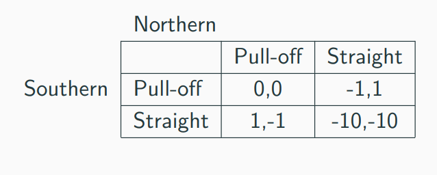

# Strategic interactions: Game theory; discussion and overview {-#game_theory}

## Some video lectures covering much of the material in the next sections, but less formally

*Note: These videos might only be available to Exeter students*


1. Brief introduction to game theory

<iframe src="https://recapexeter.cloud.panopto.eu/Panopto/Pages/Embed.aspx?id=a8bd9bbe-e71f-4738-b7e9-a99b0074c45e&autoplay=false&offerviewer=true&showtitle=true&showbrand=false&start=5175&interactivity=all" height="405" width="720" style="border: 1px solid #464646;" allowfullscreen allow="autoplay"></iframe>

(Starting at 1:26:15)

2. Most of the material (notes/board based)

<iframe src="https://recapexeter.cloud.panopto.eu/Panopto/Pages/Embed.aspx?id=cf89257b-3a36-431a-93d8-ab0600751ac8&autoplay=false&offerviewer=true&showtitle=true&showbrand=false&start=1090&interactivity=all" height="405" width="720" style="border: 1px solid #464646;" allowfullscreen allow="autoplay"></iframe>


- [More slide-based version of the above](https://recapexeter.cloud.panopto.eu/Panopto/Pages/Viewer.aspx?id=43b7a9ad-c1ac-4c5e-9a4d-a9a20074e11a)
\

3. Backwards induction, games with infitite action spaces, discussion of laboratory experiments

<iframe src="https://recapexeter.cloud.panopto.eu/Panopto/Pages/Embed.aspx?id=530c2fa2-bcab-4c01-8422-a9a70074db6d&autoplay=false&offerviewer=true&showtitle=true&showbrand=false&start=0&interactivity=all" height="405" width="720" style="border: 1px solid #464646;" allowfullscreen allow="autoplay"></iframe>

\


## Introduction

We considered decisions under 'natural' uncertainty (known probability distributions), considering preferences and choices, and concepts such as 'expected utility' and 'risk aversion'.


\

Much of microeconomics also considers the prices and outcomes in markets with many individual consumers and firms. We consider concepts such as (Walrasian) equilibrium.

\

Now we also want to consider  $\rightarrow$  *Strategic* uncertainty: one "agent's" best choice may depend on what others choose, but each agent may be unsure about what others will choose.

\

Furthermore, we may have interactions among only a small number of agents, so (unlike in large markets) each agent's choice may affect the payoffs of other agents (and, in sequential games, may influence their choices).

\

$\rightarrow$ **Game Theory** is one of the the main approaches that Economists (and others) use to consider such situations, and what choices might be made.

\

Is game theory useful???

Some people [seem to think so](https://www.linkedin.com/posts/eyal-winter-739b6b44_if-you-have-economics-students-who-complain-activity-6595028520324472832-dbJa/?fbclid=IwAR2K_dmkK7vazjZa6GRa3ZtSMWXhgLE30Fe0wzZ1ezPzNibYG7_Q5hn5jog):

```{r  fig.cap = '', out.width='50%', fig.asp=.4, fig.align='center',  echo = FALSE}
 knitr::include_graphics(file.path("picsfigs","winter_claims_gametheory_useful.png"))

```

\


### Basic concepts (strategic interaction, elements of a game))


In 'large markets with many small players': Each individual (consumer, firm, etc) takes all others' choices as given

- market price, demand curve, etc.

<<br> \bigskip

Now: Consider 'strategic interaction'

- My best choice may depend on your choice
    - And vice versa

- Sequential games: My earlier choices may change your later choices


### Some examples


`r format_with_col("Is it better to get lunch at Comida or Pret?","blue")`

\

<div class="marginnote">
2020-21 Exeter students: if this were a normal year this question qould make more sense.
</div>

<br>

- What if your friends are going to Comida?


<br>

- What if everyone and her cousin are going to Comida, so the queue is miles long?


<br>

\

`r format_with_col("What should Tim Cook charge for his new Iphone?","blue")`


<br>


- Does it depend on whether Samsung and LG...


... Sell their phones for £200, or £1000, or go out of business?


\


```{block2,  type='inputq'}

Find a situation in business, government, fiction, history or your own life  where one party's optimal choice depends on what another party does.


*Write it down*, give a 1-sentence explanation of why it involves 'strategic dependence'


```


Some possible examples:

```{block2,  type='fold'}

Life:

- Ask out your crush or not?


<br> \bigskip


Politics:

- Country makes war or peace? Soldiers fight or run away?

- Run for office or not? Party contests a seat? If so, how much to spend on campaign?


<br> \bigskip


Standard Economics:

- Amount to bid at a first-price auction?

- Whether Firezza pizza opens a new branch in Exeter, and where?

- How hard to work towards a promotion at your job?


Very interesting problems, does Econ and Game Theory have the solutions?

```


### What game theory can do (wet blanket) {-}


```{r  fig.cap = '', out.width='30%', fig.asp=.3, fig.align='center',  echo = FALSE}
 knitr::include_graphics(file.path("picsfigs","Eeyore_Pink.jpg"))
```

Game theory gives us a language and framework for analyzing strategic situations

The 'solution concepts' can be said to make ' predictions' under given assumptions.  The idea of 'equilibrium' is defined as a baseline.
\

Dr. Reinstein says: Sometimes overrated as a tool for predicting how people/firms will actually behave.

\


- It often makes multiple predictions, or predicts 'mixed strategies' (randomisation).

- Real-world and experimental choices are often/arguably predicted poorly by classical game theory.

- For example, standard game theory says chess has a pre-determined outcome and is a bit boring (ok, you may agree about the latter).

```{block2,  type='technote'}

Adv: But there are complicating issues making it difficult to asses the 'predictions' of game theory.

Particularly because monetary payoff may not be the same as utility payoffs ... this can make real-world predictions unclear.

Particularly if there are social preferences or fairness preferences. \


We also see failures to coordinate,
failure to take higher-order cognitive steps,
and preferences over the *manner decisions are made*.
These make Game Theoretic predictions difficult.

```


# Strategic games {#strat-games}

## Elements of a game {-}

**A 'strategic game'** (also called a 'normal-form game, I believe') must specify

1. Players,

2. Actions these players may choose, and

3. Payoffs resulting from the combination of players' choices

*Important note on interpretation of payoffs/preferences in game theory:*

```{block2,  type='fold'}


The 'utility' (payoff) to each player arising from the combination of each player's strategies (and chance) in the game

- May include both 'money earned' and other considerations; all this is summarised in the payoff numbers

- The goal of each player is to obtain the largest payoff that she can obtain (not just to 'win')

Note: E.g., each player prefers to get 2 in *utility* and have the other player get 8 than for both to get 1

Note: In this context it is typically not helpful to complain 'I don't think players will maximise their payoffs, because they also care about how others do, etc.' Whatever it is they care about can be expressed in the theoretical payoffs.\

However, these concerns are relevant to experiments that may incorrectly assume participants are maximising only their monetary payoffs.\


Also, there are also certain kinds of 'psychological' motivations that cannot be modeled in a straightforward way by payoffs. (see 'psychological games').
```


<center>

The game of 'chicken':


```{r  fig.cap = '', out.width='50%', fig.asp=.4, fig.align='center',  echo = FALSE}
 knitr::include_graphics("picsfigs/chicken.png")
```

<iframe width="800" height="600" src="https://www.youtube.com/embed/u7hZ9jKrwvo" frameborder="0" allow="accelerometer; autoplay; encrypted-media; gyroscope; picture-in-picture" allowfullscreen></iframe>

</center>


\
```{block2,  type='inputq'}
1.  *Who are the players in Chicken?*

2. What are the actions (pure strategies) in Chicken?

3. What are the payoffs in Chicken?
```

```{block2,  type='fold'}

1.   The north-facing car 'North' and 2. the south-facing car 'South'

2.  For both N and S, two actions -- Pull-off, Straight.

3. Payoffs are a function of the action profile, discussed below
```

*Payoffs in 'Chicken'; what makes a game a 'game of Chicken?'*


- Both pull-off $\rightarrow$  Tie


- N Straight, S pulls off $\rightarrow$ N 'wins', S 'loses'

- N pulls off, S straight $\rightarrow$ N 'loses', S 'wins'


- Both straight $\rightarrow$ crash


\

*To meaningfully convey this game* (at least according to its standard characterization in Economics) payoffs must follow: Win $\succ$ tie  $\succ$ lose $\succ$ crash

\


Here is an example of payoffs that capture the essential strategic considerations in 'Chicken'.

*Payoffs are written as a matrix below: by convention, the 'Row' player's payoffs are specified first in each cell, followed by the Column player's payoffs*


```{r, echo=FALSE,message=FALSE}

library(magrittr)
library(kableExtra)

# Define Variables
W=1
L=-1
T=0
C=-10

# Assign Pairs
pair <- function(x,y) sprintf("(%d,%d)", x,y)
all_pairs <- c(pair(T,T), pair(W,L), pair(L,W), pair(C,C))
payoff.mat <- matrix(all_pairs, nrow=2)
dimnames(payoff.mat) <- c(rep(list(c("Pull off","Straight")), 2))
results = "asis"

# Plot
payoff.mat %>% kable() %>% kable_styling()


```


Note that what will matter are the *relative payoffs* and not the absolute levels... (at least, if we ignore 'mixed strategies' for now).

*For another example of a game or 'category of 2x2 games', please see the famous [Prisoners' dillemma](#pd-normal), depicted below.


\


**O-R define the strategic game as a formal mathematical object:**

<div class="marginnote">

Remember that formal mathematical definitions help us avoid ambiguity, and allow us to use the 'general tools of maths' to construct proofs. E.g., 'fixed point theorems' can be applied to prove the existence of an equilibrium in some cases.

</div>


> A strategic game$\langle N , (A^i)_{i \in N}, (\succsim^i) i \in N \rangle$ consists of

> players: a set $N = \{1,..., n\}$

(However, we will mostly consider 2-player games)

> actions: for each player $i \in N$ , a set $A_i$ of actions

This action set may be discrete (e.g., $A_i = \{Yes. No\}$) or continuous (e.g., a firm may choose a positive quantity $q$, so  $A_i = q \in R_+$).

\

> preferences: for each player $i \in N$, a preference relation $\succsim^i$ over the set $A = \times_{i \in N} A^i$ of action profiles.

I.e., each player has preferences over the 'outcome' of the game, the combination of actions chosen by each player (referred to as an 'action profile').

<div class="marginnote">
I believe the $\times_{i \in N}$ sign represents the 'Cartesian product', i.e., the set of all combinations of one of each element.

Note that preferences are defined *directly* over the set of action profiles, unlike in market models.
</div>


> A function $u_i : A \righttarrow  R$ that represents $\succsim^i$  is a payoff function for player $i$.

\

The 'Strategic game' form is typically used to depict simultaneous games; where all players make their choice at the same time (or if not at the same time, no players know the choices made by other players when their choices are made), with 'complete information' (all players know whom they are playing against, and what these players' payoffs are.)

\

With only two players and a finite number of actions, these games are often displayed using a matrix, such as (again) for the 'Chicken' game below.

\

```{r  fig.cap = 'A matrix depicting players actions and payoffs in the Chicken game', out.width='30%', fig.asp=.4, fig.align='center',  echo = FALSE}

 

```

\

In contrast, the *Extensive game* form is typically used to depict a game involving a (finite or infinite) *sequence* of choices made by players; we will return to this further below. Extensive-form games with a finite number of actions are often depicted using 'game trees', as in the 'simplified ultimatum game' below.

<div class="marginnote">
However, technically both simultaneous and sequential games can be depicted in either strategic form or extensive form. For an example, see the [prisoners dilemma depiction](#pd-normal) below.
</div>


```{r  fig.cap = 'Game tree - Simplified Ultimatum Game' , out.width='60%', fig.asp=.6, fig.align='center',  echo = FALSE}

 knitr::include_graphics("picsfigs/ultsimple.png")

```
\


## 'Individual optimization considerations'; best responses, 'rationalizability'


```{block2,  type='note'}

Note: O-R jump right into the definition of Nash Equilibrium (NE) at this point. I prefer to first introduce individual optimization and strategic considerations (unfold discussion of why). I introduce these concepts somewhat less formally than the O-R depict NE (but of course we *could* depict rationalizability more formally; I will give you some 'taste' of this).

In the fold below, I discuss this issue further.


```

```{block2,  type='fold'}

Nash Equilibrium (NE) does not automatically arise from players' optimization (nor from players' optimization under "common knowledge of rationality" which we will get to soon). Nash Equilibrium (NE) simply represents a "stable point" from which no player would want to 'deviate unilaterally'; however there multiple equilibria (or no 'pure strategy equilibrium'), and, particularly in the absence of communication, players may fail to coordinate on an equilibrium. Both may regret their actions, each having thought the other player would have made a different choice.

\

I prefer to begin by thinking about each individual player strategic considerations, and then to introduce the idea of 'Rationalizability' in a strategic context (calculated through 'iterated strict dominance', and potentially justified in a situation of 'common knowledge of rationality'. There are some connections between NE and Rationalizability; e.g., where there is a unique rationalizable outcome, it also represents a unique Nash Equilibrium. But they are fundamentally different concepts: Rationalizability represents the consequence of players optimizing, while NE simply represents a 'stable point'.

In Osborne and Rubinstein's 1994 text, 'A Course in Game Theory', they note:

> If the game is a one-shot event in which all players choose their actions simultaneously then it is not clear how each player can know the other players' equilibrium actions ... [as in NE... thus we consider solution concepts] In which players' believes about each other's actions are not assume to be correct but are constrained by considerations of rationality...

```


### Common knowledge

- What all players know, and
- all players know that all other players know,
- and all players know that all other players know that all other players know,
- and all players know that all other players know that all other players know that all other players know,

 etc.

*Note:* We always assume that the rules of the game are common knowledge.

\


Why is common knowledge important?


{width=80%}

Among other things, you may be stuck on an island 'with 100 blue-eyed people, 100 brown-eyed people, and the Guru'... (unfold if you like puzzles!)

```{block2,  type='fold'}

- [XKCD_link](https://xkcd.com/blue_eyes.html "puzzle")
- [XKCD solution link](https://xkcd.com/solution.html "solution" )
- [Rob Heaton version, more violent](http://robertheaton.com/2014/01/06/how-to-win-at-dinner-party-the-blue-eyed-islanders/ "puzzle and solution")
- [Ted-ed video](http://ed.ted.com/lessons/the-famously-difficult-green-eyed-logic-puzzle-alex-gendler)

\

Warning: this puzzle will do your head in

\


\

There is an island with 1000 people.
- 100 of them have blue eyes, 900 have brown eyes
- There are no reflective surfaces


By custom or law:

> He who knows own eye colour must commit suicide the next day in the town square
>  No one can discuss another person's eye colour.

Now an American tourist visits, and says "It’s so nice to see one or more people with blue eyes in this part of the world”.

<br> \bigskip


Q: *What effect, if any, does this faux pas have on the island?*


<br> \bigskip


Ans: If his statement is 'common knowledge' then all 100 blue-eyed people will kill themselves on day 100 after the speech.!

```


\

A's *Best Response* (BR) to strategy *S*:

:     a strategy for player A that gives her the highest payoff of all her possible strategies, given that the other player(s) play *S*

\

<div class="marginnote">

Note: The BR is a function of the others' strategies *S*; it may take a different value for each strategy the others play.

</div>


\


### Dominant, dominated strategies and rationalizability

<div class="marginnote">

Again, iterated strict dominance and rationalizability are NOT covered in the O-R text, but I want you to learn it.  As a prediction it is much easier to justify than Nash Equilibrium.

</div>

<br> \bigskip

Dominant strategy
:     A single strategy that is a best response to *any* of the other player’s strategies.

- A simple prediction: a 'rational' player will play a dominant strategy, if she has one.

\

Dominated strategy
:     Strategy A is dominated by strategy B if B yields higher payoffs for *any* of the other player’s strategies

- A simple prediction: a rational player will *never* play a dominated strategy

*Why?*: because a dominated strategy  cannot be optimal for *any* belief about what the other player(s) will do


<br> \bigskip

```{block2,  type='note'}

With only two strategies to choose among these concepts are the same.

With more than two, if there is a Dominant strategy this means that all other strategies are dominated by it. We see this in examples below.

```

\

```{block2,  type='inputq'}

What is the prediction of 'players play dominant strategies' in the Prisoner's dilemma"

```


```{r  fig.cap = '', out.width='55%', fig.asp=.4, fig.align='center',  echo = FALSE}
 knitr::include_graphics(file.path("picsfigs","pd_normal.png"))
```

Here it clearly predicts that both will confess. However, in some other games this concept may have no clear prediction.

<div class="marginnote">
Food for thought: if a player's Best response is unaffected by the other player's best response, is this really a game with "strategic interaction"?

Perhaps the Prisoner's Dillemma, arguably the most famous game, and one that dramatically illustrates the potential for group interest to depart from individual interest...  is a very boring game; if it's even meaningfully a game.  Whatever you choose has no bearing on whatever my best choice might be!
</div>


\

```{r  fig.cap = '', out.width='65%', fig.asp=.4, fig.align='center',  echo = FALSE}
 knitr::include_graphics(file.path("picsfigs","matrixforISD.png"))
```


<div class="inputq">

What does 'players play dominant strategies' predict above? What about 'players never play dominated strategies'?

</div>

\


### Rationalisability/ Iterated strict dominance

Extending this ...

**Rationality assumption:** the players are rational.

We know rational players will not play dominated strategies
The players *themselves* know this.

<br> \bigskip

**Common Knowledge of Rationality assumption:**

The players know all other players are rational. The players know all players know all players are rational.  The players know (all players know … ad infinitum) all players are rational.

- Thus the players know what the other players will never do, and eliminate these from consideration
- The players will not play a strategy if another strategy is always better against this reduced set of possibilities
- Etc.

This process is called 'Iterated Strict Dominance' (ISD) We will call strategies that survive ISD **'rationalizable' strategies**.

Rationalizability has a somewhat different conceptual justification than ISD, but they are closely related.

<div class="marginnote">
There are differences between 'rationalizable' and 'survives ISD' but for our purposes these are basically the same. At least in a finite strategic game (a finite number of actions), the set of (actions leading to) outcomes that survive ISD is the set of profiles of rationalizable actions.
</div>

A formal definition of rationalizability (From O-R 1994, p. 61):

```{block2,  type='fold'}

> An action $a_i \in A_i$ is *rationalizable* in the strategic game $\langle N, (A_i), (u_i)\rangle$

(this notation is similar to our notation, except that they are using a utility function $u_i$ to depict preferences)

> if for each $j \in N$ there is a set $Z_j \subseteq A_j$ such that

(a subset of the action space for *each* player... think of)

> $a_i \in Z_i$

($i$'s own action is in this set)

> [and] every action $a_j \in Z_j$ is a best response to a belief $\mu_j(a_j)$ whose support is a subset of $Z_{-j}$.

(Every player's action is a best response to some belief about other players' actions ... where these actions are themselves best responses to some belief about other players' actions, etc.)

```


\

ISD example; may yield a unique prediction:


```{r  fig.cap = '', out.width='70%', fig.asp=.4, fig.align='center',  echo = FALSE}
 knitr::include_graphics(file.path("picsfigs","matrixforISD.png"))
```


```{r  fig.cap = '', out.width='50%', fig.asp=.4, fig.align='center',  echo = FALSE}
 knitr::include_graphics(file.path("picsfigs","isd1.png"))
```

```{r  fig.cap = '', out.width='50%', fig.asp=.4, fig.align='center',  echo = FALSE}
 knitr::include_graphics(file.path("picsfigs","isd2.png"))
```


```{r  fig.cap = '', out.width='50%', fig.asp=.4, fig.align='center',  echo = FALSE}
 knitr::include_graphics(file.path("picsfigs","isd3.png"))
```


\

However, there may be *no* dominated strategies, or there may be *some*, but still ISD may leave many possibilities:

```{r  fig.cap = '', out.width='60%', fig.asp=.4, fig.align='center',  echo = FALSE}
 knitr::include_graphics(file.path("picsfigs","bossmall.png"))
```


\

## Nash equilibrium {#ne-strategic}

> according to which a profile of actions is stable if no individual wants to deviate from her action given the other individuals’ actions


<div class="marginnote">
Compare to 'market equilibrium': given the equilibrium price and quantity, no market participant has an incentive to change his or her behaviour.
</div>


<br> \bigskip

### NE: Simple definition and discussion

```{block2,  type='note'}

I present a basic undergraduate-level explanation of this here. If this is already familiar an obvious to you, you may skip this and go right to the O-R reading. 

If you are *not* familiar with this, you may find it helpful to read first before digging into the formal presentation.

```  


Nash equilibrium (NE)
:     A set of *strategies*, one for each player, that are best responses against one another


- If I play my BR to your chosen strategy and you're playing your BR to mine, neither of us has an incentive to deviate --- an equilibrium.

- All games have at least one Nash equilibrium
    - But it may be an equilibrium in 'mixed strategies' (involving randomisation)

- Caveat: we might not expect such play to actually occur (particularly not in one-shot games)

<div class="marginnote">
 In fact, two-player games will have an *odd* number of equilibria, at least if we include 'mixed strategy Nash Equilibria'; you can see this by looking at the crosses of the BR functions
</div>

### NE: Formal depiction

From O-R:

```{block2,  type='def'}

> In a strategic game $\langle N , (A^i)_{i \in N}, (\succsim^i) i \in N \rangle$

> an action profile $a = (a^i) \in A$

(profile of actions: one action chosen for each player $i$)

>  is a Nash equilibrium if for every player $i \in N$ we have

> $(a^i, a^{−i}) \succsim^i (x^i , a^{−i}) for all $x^i \in A_i$$


*Note*: $a^{−i}$ denotes 'the action chosen by all players other than player $i$'.

> where $(x^i , a^{−i})$ denotes the action profile that differs from $a$ only in that the action of individual $i$ is $x^i$ rather than $a^i$.

```

Thus, again, in the above definition,each player's action in action profile $a$ is a best response to the other players' actions ... because no other choice would make player $i$ better off, given what the others choose.

\

O-R similarly define a NE in terms of 'each player best responding' ... defining  $BR(a^{−i}) as "the set of player $i$’s best responses to $a^{-1}$ and "action profile $a$ is a Nash equilibrium if and only if $a^i \in BR(a^{−i})$ for each player $i$.

\

```{block2,  type='warning'}

For a NE:

1. These need not be *strict* best responses; each player may have more than one best response to the other players' choices in this strategy profile... all that it requires is that $a^i$  is among the best responses.


2. We do not ask 'If I changed my response and others correspondingly also changd their responses would I be better off'? (That would be closer to the Kantian equilibrium concept discussed in O-R). We just ask "if I change my response can I do better, given what others are doing." If the answer is 'no', then I am best responding. If the answer is 'no' for all players, then all are best responding to each other, and this profile is a Nash equilibrium.

3. Remember that a Nash equilibrium is a property of an  *action profile* (or a 'strategy profile'), with one action or strategy for each player. It is not, strictly speaking, a property of an outcome nor a property of a set of payoffs. We can state "the payoffs consistent with Nash equilibrium are" ... But we shouldn't state "the Nash equilibrium is that each player gets payoffs 10".


```


\

### Note on O-R characterization of 'Nash equilibrium' {#note-ne}

O-R define a "Nash Equilibrium in a strategic game" as involving 'pure strategies' only. No player is randomizing.

Going with this definition, they state:

>  some strategic games do not have a Nash equilibrium.

This contrasts with the definition I have seen previously. In most text, Nash equilibrium is define to allow either mixed or pure strategies.

\

They later define "Mixed strategy equilibrium" and they note (but do not prove here):

> every game in which each player’s set of actions is finite has a mixed strategy equilibrium.

As I said, I am more familiar with the definition of NE to include mixed strategies, does the above statement could be modified to be: "every game in which each player’s set of actions is finite has a Nash equilibrium, which may be in mixed strategies".

By the way, even among infinite games, a Nash equilibrium (or "mixed strategy equilibrium") is guaranteed to exist so long as the strategy sets are ["compact"](http://www-math.mit.edu/~djk/calculus_beginners/chapter16/section02.html) and the payoff functions are continuous.


## Examples of strategic games

Please consider all of the examples in section 15.2-15.3, at least insofar as you find these interesting.

*These illustrate an array of interesting and fundamental concepts*:

\

We see:

-  Games where the NE (and indeed the unique rationalisable strategies) defy both intuition and 'actual play in experiments', and where the NE does *not* maximise the player's payoffs \*  -- (Traveler's dillemma, Prisoners' dillemma, price and quantity setting, see also the ['Keynsian Beauty contest'](https://web.stanford.edu/~niederle/GuessingGames.pdf)) ...

<div class="marginnote">
Although, as I mention elsewhere, in any interactive experiment it is hard to rule out that 'social preferences' may drive the results. We can only control the financial payoffs; we don't know what the "true payoffs" are if players care about other players or about fairness etc.
</div>

- Games with infinite strategy spaces (Traveller's game, Auctions, Location games, Price and quantity-setting games,... )

- Finite (matrix) games (Bach or Stravinsky, all the other ones where a matrix is displayed)

- Coordination games (Bach or Stravinsky, Coordination game)\*

- Anti-coordination games (Odds or evens, Matching pennies)

<div class="marginnote">

'Bach or Stravinsky' is usually called the 'Battle of the Sexes', and the choices are 'Ballet' (preferred by the 'Wife') and 'Boxing' ('Husband's' preference). Personally, I find this much easier to remember. If we want to subvert the stereotype here, We could think of the ballet as being extremely violent and the boxing match as a boxing match fought with feathers and balloons.

</div>


- Games where actions are 'strategic complements' (e.g., *Effort game*)

- Games where actions are 'strategic substitutes' (e.g., *Cournot quantity-setting game*)

\

These also present strategic insights at the core of several theory-heavy applied fields, such as

- Auction Theory: *First-price and Second-price auctions*

- Industrial Organization (firm strategy and antitrust): *Location game* (aka 'Hotelling model'), *Quantity-setting* (Cournot), *Price Setting* (Bertrand), War of attrition (presented later)

- Development economics and the study of cooperation: *Effort Game*, 


*Other examples are given in the practice problems; these involve legitimately interesting and relevant examples, not simply 'busy work'*

\

```{block2,  type='note'}

Note that I skip several sections of O-R here,  for time considerations. I skip:

- Existence of a Nash equilibrium (see also my note [above](#note-ne) on O-R's unusual terminology). You may nonetheless find this worth reading, particularly if you love maths. The definition and discussion of 'supermodular games' is also fairly relevant; it comes up a bit in the literature.

- Strictly competitive games (i.e., 'zero sum games') ... have a look at the definition at least

- Kantian equilibrium (a very interesting non-standard concept!)

```


## Mixed strategy (Nash) equilibrium of strategic games

### Simple presentation

```{block2,  type='note'}

I present a basic undergraduate-level explanation of this here. If this is already familiar an obvious to you, you may skip this and go right to the O-R discussion of mixed strategy equilibrium. However, if you are *not* familiar with this, you may find it helpful to read first before digging into the formal presentation.

```  

\

*Note*: I use the terminology of 'pure and mixed strategies' (slightly different from O-R) here

Pure strategy
:     Consists of a single action played with certainty

<br> \bigskip

Mixed strategy
:     Assigns a probability to each possible action

<br> \bigskip

*Remember: as claimed [above](#note-ne), in finite games (and a wide class of infinite games) there is always at least one NE. If there is no pure strategy NE, there will be a NE in mixed strategies.*

\

### Matching pennies: mixed strategies {-}

**Intuition**

If you choose heads/tails half the time then I'm indifferent between heads or tails. Thus, choosing 'heads' half the time is *among* my best responses.

If I choose heads half the time then you're indifferent between heads/tails. Thus choosing heads half the time is *among* your best responses

So, technically, each of us choosing heads half the time is a NE. 

<div class="marginnote">
But it is called a 'weak' NE because either of us would do no *worse* if he deviated alone.
</div>
 
\

### Battle of sexes: mixed strategies {-}

```{r  fig.cap = 'Image source: Nicholson and Snyder', out.width='70%', fig.asp=.4, fig.align='center',  echo = FALSE}
 knitr::include_graphics(file.path("picsfigs","bosmatrix.png"))
```

*Note:* Wife wants to end up at the same place as her husband but doesn’t know where he is going.\

- If she believes that he will always go to the ballet she should always go to the ballet.\

- If she believes he will always go boxing, she should go boxing.\

- What other beliefs may she have?

We want to derive the best response functions, and find the intersection(s) of these.

Let $h$ represent the probability husband chooses Ballet


```{r  fig.cap = 'Source: Nicholson and Snyder', out.width='75%', fig.asp=.4, fig.align='center',  echo = FALSE}
 knitr::include_graphics(file.path("picsfigs","bosmatrix.png"))
```
\

**Wife's BR:**

- Wife chooses Ballet iff her Expected payoff of Ballet > Expected payoff of Boxing

<br> \bigskip


I.e., $2h > 1- h$, i.e, $h > 1/3$

Thus, wife goes to Ballet if she believes husband goes to Ballet more than 1/3 of the time

- If she thinks he goes below 1/3 of the time she goes to Boxing

- If she thinks he goes *exactly* 1/3 of the time she is indifferent


\

```{r  fig.cap = '', out.width='70%', fig.asp=.4, fig.align='center',  echo = FALSE}
 knitr::include_graphics(file.path("picsfigs","wife_br.png"))
```

*Note:* This plots the value of w that best responds to h;\ the probability the wife goes Ballet given the probability the husband goes Boxing.

\

Let $w$ denote the probability wife chooses Ballet

\

**Husband's BR:**

<br> \bigskip


Husband chooses Ballet iff his Expected payoff of Ballet > Expected payoff of Boxing

$$1w > 2- 2w$$, i.e., $$w > 2/3$$ ... for these payoffs


Thus, husband goes to Ballet if he believes wife goes Ballet more than 2/3 of the time

- If he thinks she goes less than 2/3 of the time he goes to Boxing

- If she thinks he goes *exactly* 2/3 of the time he is indifferent


```{block2,  type='technote'}
 Note that now that we are considering mixed strategies the ratios of the payoffs may matter in computing the equilibrium mixing probabilities, and not only 'which is larger'. Recall that this also was the case when we considered expected utility over uncertain outcomes.

```

\


```{r  fig.cap = '', out.width='70%', fig.asp=.4, fig.align='center',  echo = FALSE}
 knitr::include_graphics(file.path("picsfigs","wh_br.png"))
```


```{r  fig.cap = '', out.width='70%', fig.asp=.4, fig.align='center',  echo = FALSE}
 knitr::include_graphics(file.path("picsfigs","bos_3_eq.png"))
```


*Shortcut to computing this:* only someone who is indifferent will randomise. (Otherwise they must strictly prefer one or the other action, so 'mixing these' cannot be optimal.)

\

Above, $h=1/3$ makes wife indifferent, $w=2/3$ makes husband indifferent


\


### What's all this rot? {-}

Mixed strategies are not about 'being unpredictable', in spite of what some texts say ; these are one-shot games!

\


Some texts and authors make this point about 'unpredictability' but others disagree (including myself). Making sure that it is impossible to predict your later play from your previous is only important if you are playing the same game repeatedly, and being observed.

\

```{block2,  type='note'}

It makes a bit more sense if we think about 'populations.

Suppose in a population 1/3 of men go to Ballet and 2/3 of women go to Ballet:
... these ratios are 'stable'; no reason for systematic changes.
On the other hand, if men always went to boxing and women to ballet this is not stable. A husband would be better off going to ballet ... so the ratios should change over time.

This interpretation is presented and defended in more detail in O-R sections 15.7 and 15.8.

```

\

### Computing payoffs with mixing {-}

Remember, formally, a  NE specifies *strategies* (strategy 'profiles') not payoffs

In the BOS the pure strategy equilibria were

- i. Husband: Boxing, Wife: Boxing
- ii. Husband: Ballet, Wife: Ballet

\

The mixed-strategy NE was:

-  iii. Husband: go Ballet with probability h=1/3, Wife: Go Ballet with prob w=2/3.

The *payoffs* to these were, respectively

i. Husband: 2, Wife: 1

ii. Husband: 1, Wife: 2

iii. ... ??

\

Payoff to the mixed strategy:

Payoffs are utilities: thus under the Expected Utility model we sum the utility of each outcome $\times$ probability of that outcome

- Prob(Both go Ballet) = $w \times h = \frac{2}{3} \times \frac{1}{3} = \frac{2}{9}$
- Prob(Both go Boxing) = $(1-w)(1-h) = \frac{1}{3} \times \frac{2}{3} = \frac{2}{9}$
- Prob(Wife Ballet, Husband Boxing) = $w(1-h) = \frac{2}{3} \times \frac{2}{3} = \frac{4}{9}$
- Prob(Wife Boxing, Husband Ballet) = $(1-w)(h) = \frac{1}{3} \times \frac{1}{3} = \frac{1}{9}$

<br> \bigskip

Thus, under the mixed strategy NE play:

$$U_{husb} =  \frac{2}{9} \times 1 +  \frac{2}{9} \times 2 +  \frac{4}{9} \times 0 + \frac{1}{9} \times 0 = \frac{6}{9} = \frac{2}{3}$$
$$U_{wife} = \frac{2}{3}$$

(The wife's payoffs can be  inferred from symmetry of problem, or they can be similarly calculated.)


\


### More formal presentation {#formal-mix}


<div class="marginnote">
I will add some discussion here.
</div>
 

### Example: War of attrition {-}

This is a very important concept across a wide range of domains from biology to business strategy to law and politics.

<div class="marginnote">
I will add some discussion here.
</div>


## Supplement: Prisoners’ Dillemma in Normal and extensive form {#pd-normal}

*The original story*:

> Two individuals are arrested for a crime.  They both know that they can only be convicted for a lesser crime, for which they get 2 years in jail. DA (Chief Crown Prosecutor) puts them in separate rooms and offers each the same deal. If you confess and your partner stays quiet you will only get 1 year in jail and they will get 10 years.

If you both confess you will each get 3 years.

\


What would you do? What would most people do? What does game theory predict?

<br> \bigskip

Which *outcome* is *definitely NOT* Pareto-optimal (for the prisoners)?

<div class="marginnote">
Image source: Nicholson and Snyder, 2012
</div>


```{r  fig.cap = 'Prisoners dillemma -- one set of payoffs', out.width='65%', fig.asp=.4, fig.align='center',  echo = FALSE}

knitr::include_graphics(file.path("picsfigs","pd_normal.png"))

```

- Normal form payoff matrix (also called 'matrix form')

- Payoff convention: listed in the order (row's payoffs, column's payoffs)

<br> \bigskip

**A Prisoner's Dilemma be like** \*

<div class="marginnote">
\* Note to non-native-English speakers... I am shamelessly pandering to the youth here by trying to use their jargon. 'Be like' is not proper usage in the Queen's English.
</div>


Two Players: (A and B, row and column, whatever)


Strategies (Actions): 'Cooperate' (C) or defect (D)


In normal form:


```{r, echo=FALSE,message=FALSE}

# Define Variables

# Assign Pairs
pair <- function(x,y) sprintf("(%s,%s)", x,y)
all_pairs <- c(pair("R","R"), pair("T","S"), pair("S","T"), pair("P","P"))
payoff.mat <- matrix(all_pairs, nrow=2)
dimnames(payoff.mat) <- c(rep(list(c("Cooperate","Defect")), 2))
results = "asis"

# Plot
payoff.mat %>% kable() %>%kable_styling()

```

To be a prisoner's dilemma game the payoffs must satisfy $T > R > P > S$

I.e., Temptation $>$ Reward $>$ Punishment $>$ Sucker

\


### The Prisoners’ Dilemma: Extensive form {#pd-extensive}

We can depict the same game in another format which we call the 'extensive form':

```{r  fig.cap = '', out.width='85%', fig.asp=.4, fig.align='center',  echo = FALSE}
 knitr::include_graphics(file.path("picsfigs","pd_extensive.png"))
```

\
Above: the oval (usually this is given as dashed lines) depict the  'information set'/

Sequential moves games *without* knowledge of previous moves are essentially equivalent to simultaneous move games.
Here, B may 'move second' but he doesn't know A's move (in the graphic above, he doesn't know "which side he is on"), so it's as if this is simultaneous.

\

Order only matters if you observe the earlier action.

# Extensive form games (and sequential games) {#extensive}


```{block2,  type='note'}


**I will add a great deal of content here.**

```

