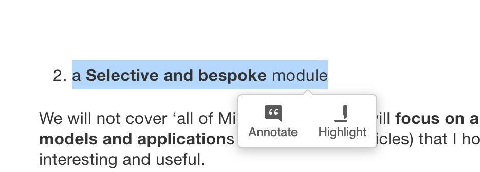
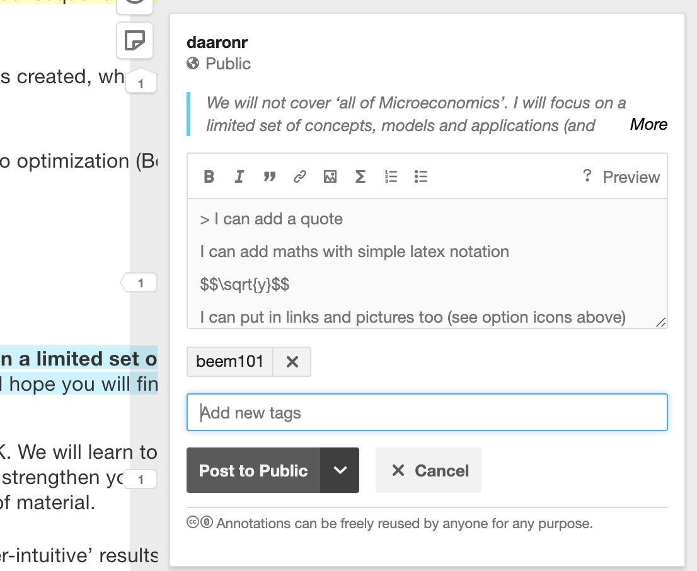

```{r, include=FALSE}
knitr::opts_chunk$set(echo = TRUE)
```

#### Download,  access and run project_setup.R ####

(Note: we ultimately can do this in main, but this is a bridge)


```{r download-project-setup}
library(here)


library(devtools)
tryCatch(
  {
     download.file(url = "https://raw.githubusercontent.com/daaronr/dr-rstuff/master/functions/project_setup.R", destfile = here("code", "project_setupX.R"))
  },  error = function(e) {
  print("you are not online, so we can't download")
  }
)

tryCatch(
  file.rename(here("code", "project_setupX.R"), here("code", "project_setup.R"))
)
```

```{r run-project-setup}

source(here("code", "project_setup.R"))

```


```{r install,  echo = FALSE, include=FALSE}
library(png)
library(grid)
```

```{r, include=FALSE}
#install.packages("webshot")
webshot::install_phantomjs()

```

```{r, eval=FALSE}
install.packages("bookdown")

# or the development version
# devtools::install_github("rstudio/bookdown")
```

<!-- Download 'backup' bibtex file from dropbox (synced with Zotero), do the rename workaround -->


<!-- note installing packages is mainly removed because this is done in baseoptions.R -->

```{r, include=FALSE }
# automatically create a bib database for R packages
knitr::write_bib(c(
  .packages(), 'bookdown', 'knitr', 'rmarkdown'
), 'packages.bib')
```

```{r somefunctions, include=FALSE}

#possibly move these to a separate file

#multi-output text color
#https://dr-harper.github.io/rmarkdown-cookbook/changing-font-colour.html#multi-output-text-colour
#We can then use the code as an inline R expression format_with_col("my text", "red")

format_with_col = function(x, color){
  if(knitr::is_latex_output())
    paste("\\textcolor{",color,"}{",x,"}",sep="")
  else if(knitr::is_html_output())
    paste("<font color='",color,"'>",x,"</font>",sep="")
  else
    x
}

```

```{r html, include=FALSE}
# globally set chunk options
knitr::opts_chunk$set(fig.align='center', out.width='80%')

my_output <- knitr::opts_knit$get("rmarkdown.pandoc.to")

```


<!---
Can define text blocks here, refer to them again and again if desired
To add to ELE:
1. zip all content in '_book' folder
2. drag into VLE site
  - on prompt, create file resource
3. edit settings
  - right click and unzip
  - double-click starting file
  - set as main file
  - save
Now it is only accessible within the university login
-->


# Notes for Beem101 Microeconomics students; overview {-#note}

**Notes by instructor [David Reinstein](davidreinstein.wordpress.com/)**

## Focus and style of this module {-#focus}

*Note: [In the next section](#outline), I give a brief---and then a descriptive---outline of the 'story of this module' and the we will consider... and why these are interesting.*

\

**This is...**

1. a **Microeconomics** module.  We will learn and use maths and rigorous logic to consider deep questions of:
- Individual preferences, choices and optimization subject to constraints
- How individuals interact with one another, and the consequences of this (Game theory and mechanism design/agency problems)
- "Markets", prices, and "welfare" (how much value is created, who gets what, how do we consider these outcomes as a society)
- Psychological influences on the above, and limits to optimization (Behavioral Economics)

\


2. a  **Selective and bespoke** module

We will not cover 'all of Microeconomics'.  I will **focus on a limited set of concepts, models and application**s (and academic articles) that I hope you will find most interesting and useful.

We will skip many major important topics. But that's OK. We will learn tools, 'modes of thinking', and 'modes of proving results' that should strengthen your brain muscles and help you understand a much wider body of material.

- I often focus on models with 'surprising' or 'counter-intuitive' results. If you can explain the logic behind these (as well as the maths), you have achieved an understanding beyond a layman's intuition.

- I will try to incorporate a small set *applications* that are particularly relevant to your careers and your research interests.
,
<div class="marginnote">
I may also try to incorporate data, statistics/empirical modeling, and 'computer coding' because these will be super-important in your career.
</div>

*Please give me feedback on what you are interested in.*


3. an **Inquisitive module**: we ask **the 'how?', 'why?', 'so what?', and 'is this reasonable?'** ... of the models and concepts

When studying Economics, I often saw models presented, with strong assumptions, without any explanation of what these were for and how they could be justified. In this module we will always be skeptical and carefully ask 'what is the purpose' of each model and concept.

<div class="marginnote">
For example, 'what does it mean to say that something is a mixed-strategy Nash equilibrium?' ... Do we expect people to actually randomise in this way?
</div>


## Level of this module {-#level}

This module is adapted to students from a variety of backgrounds.


For students interested in pursuing a PhD in Economics, and interested in research:

- We will cover some approaches and relevant building blocks, and I will point you to relevant materials for further enrichment

- I will incorporate content from academic literature ('articles in peer reviewed journals') and sophisticated research considerations

- I will incorporate my own research, research methods, and 'really getting our hands dirty' in digging into research questions, building theoretical (maths) models, and even perhaps experiments, coding, and data analysis.

- We will discuss *your* proposed research, relate microeconomic theory and models to this, and bring this into coursework

- I will try to help you 'think, research and write' like a good economist. (See my [Writing and research guide here](https://daaronr.github.io/writing_econ_research/about-this-work.html).

\

*However, please note that will not fully prepare you for doctoral study and academic research that requires advanced Microeconomics. MRes programmes and modules are better geared to this.*


\

For students coming from backgrounds with limited Economics training and limited abstract maths:

- I will explain most concepts 'from the ground up', or point you to what you will need to revise.

- I will present most material *also* at an intermediate level, using diagrams and simple intuition.

<div class="marginnote">
But note that you need to have SOME background in Economics to do well in this module. This is an MSc-level Economics module, after all.
</div>


\

For students who are not as fluent in English as they would like to be (perhaps many/most of our students):

- I will try to communicate clearly and at a reasonable pace, avoiding slang and using diagrams and maths to convey ideas

- Most of what I say in lectures/videos/tutorials is also in writing here in this web book (or in links)

- I will strongly encourage you to participate actively and try to help you improve your English communication skills.

- Interacting with  my [Writing and research guide here](https://daaronr.github.io/writing_econ_research/introduction.html) should also be helpful for this (and for your dissertation, if you will be writing one).


## Readings and resources {-#readings}

This module will use a variety of resources: I will guide you through this via the online text that you are reading now.. **Consider this the 'governing resource'.**

This draws heavily from several texts and other resources, **all of which are free and available online**. I will make it clear what come from where, and where you can find additional readings.

In particular:

1. "O-R": [Models in Microeconomic Theory, by Osborne and Rubinstein](https://www.openbookpublishers.com/product/1171)


```{r  fig.cap = '', out.width='50%', fig.asp=.4, fig.align='center',  echo = FALSE}
 knitr::include_graphics("picsfigs/models-text-cover.png")
```


> Our main aim is to give the reader an understanding of the concepts of model and equilibrium in microeconomic theory

This book is very precise, abstract (in a mathematical sense), and extremely well-written and full of wisdom and insight. It is *dense*; don 't worry if it takes you a long time to digest each concept (but if you get stuck, please do ask questions and try different approaches).  It is the most relevant (at least of these three) for further postgraduate/PhD study.

The authors claim 'the mathematics we use is elementary'. However, I think it contains a deep sort of maths that you will find challenging. As they say, 'many of the proofs involve sustained logical arguments'.


2. [Introduction to Economic Analysis version 2.1 by McAfee, Lewis, and Dale]](https://www.scholars.northwestern.edu/en/publications/introduction-to-economic-analysis-v21)

This is a more traditional text, with more 'computational-style' problems. It covers a wider set of Economics concepts than the others.


3. "QMC": [Quantum Microeconomics with Calculus](http://www.smallparty.org/yoram/quantum/quantumcalc.pdf) by Yoram Baumann, the self-proclaimed 'World's First Standup Economist'

This is somewhat less rigorous than O-R, but it has its own strengths. It approaches the material in an unusual way, and covers some material that is non traditionally covered in Economics courses (and skips many core concepts).

As I am incorporating some material *directly* from these works, I include the licences below (in the fold).

```{block2,  type='fold'}
Paste licenses here.

```

\

### Other relevant resources {-#other-reseources}

**Simpler resources**

- Varian, Hal R., Intermediate microeconomics: a modern approach. New York, NY: WW Norton & Company, 2010: Somewhat less formal than O-R but it also covers a wider set of material and computations.

- Intermediate Microeconomics and its Application (an Undergraduate text) by Nicholson and Snyder. We have used this for a good chunk of this module in past years. It is at a very basic level, in terms of the maths

Free online access to this text may be available through your university/library (this works at Exeter) via [www.vlebooks.com](https://www.vlebooks.com/)

 - A free alternative, at a similar level: [Microeconomics an Open Text by Douglas Curtis and Ian Irvine](https://open.umn.edu/opentextbooks/textbooks/microeconomics-markets-methods-and-models)

-  Microeconomics by Hugh Gravelle and Ray Rees (version 3, widely available online for free):  A somewhat more advanced-intermediate-level text which I think you will find very useful; this is not yet officially Open-Source, but you can find it online for free (and the authors are OK with this, I have emailed them). Just do a web search for 'Gravelle and Rees Microeconomics' and you will find the pdf


\

**More rigorous, advanced and applied work will draw from**

- David Autor’s MIT Open Courseware “Microeconomic Theory and Public Policy”; [all the files for this course can be downloaded here)[https://ocw.mit.edu/courses/economics/14-03-microeconomic-theory-and-public-policy-fall-2016/lecture-notes/] this will give you a flavor of the PhD level micro
- David Autor. 14.03 Microeconomic Theory and Public Policy. Fall 2016. Massachusetts Institute of Technology: MIT OpenCourseWare, https://ocw.mit.edu. License: Creative Commons BY-NC-SA.


**Also**

For maths, see also [Mathematical methods for economic theory](https://mjo.osborne.economics.utoronto.ca/index.php/tutorial/index/1/toc) ... also free online!

\


- Academic articles and working papers as well as  some of my own writings... these are mentioned below


## About this web-book: the Governing Resource {-#this-book}

**Welcome to the exciting world of Microeconomics**

I wrote this web-book to outline all of the material you are responsible for,  and to give you more resources and insight than I can convey in the short  amount contact time that we have.   I *don't* mean you're simply responsible for material in these printed notes:  I mean that these notes will aim to *refer to* everything that you are responsible for.

This web-book is meant to be a complement to the texts and readings (and to the lectures/videos,  tutorials/problem sets and other material on the ELE) and to tie all of this together.

<!-- I am providing you these notes both as a complete file as well as divided by lecture week (approximately). Use either version.
-->

 I will try my best to stick to the structure outlined in this web-book.  However, things may adjust slightly as we go and I will need to make updates to this as we go along.  I will keep you informed of any changes via the ELE (VLE) forums and the ELE page in general.

<br> \bigskip

*Web-book versus slides?: (unfold)*

```{block2,  type='fold'}

At times I will present material using slides.  This web-book should include all of the slide material *plus* explanatory notes and enrichment material. (However, I left out some of the jokes.) I use some abbreviations before certain notes to help you understand how to digest this.  I will also  make the slides themselves available even though they are redundant– this web-book has everything that slides have.

```

<br> \bigskip


### 'Markers', abbreviations, and callouts/boxes {-#markers}

- OR:  Osborne and Rubinstein's [Models in Microeconomic Theory]((https://www.openbookpublishers.com/product/1171)


- 'McDL' refers to the [McAfee, Dale and Lewis text](https://www.scholars.northwestern.edu/en/publications/introduction-to-economic-analysis-v2)

- 'QMC' refers to ['Quantum Microeconomics with Calculus'](http://www.smallparty.org/yoram/quantum/quantumcalc.pdf)  (Baumann)

- 'NS'  refers to the Nicholson and Snyder text (usually chapters/numbering from the 12th edition is referenced;  if you're using an earlier edition, make sure the content corresponds)

- 'DA' refers to [David Autor's MIT open courseware notes for Microeconomic Theory and Public Policy](https://ocw.mit.edu/courses/economics/14-03-microeconomic-theory-and-public-policy-fall-2016/lecture-notes/)


<!--
- 'LC' indicates a lecturer comment I may make in lecture that you don't need to worry about (I meant to cut these but I sometimes forget to)

`r format_with_col("Text in this color usually refers to questions you should  try to answer on your own (and I sometimes provide suggested answers in a folding box or footnonte. Try to answer it yourself first.)","brown")`

`r format_with_col("Some text may be  given in gray to indicate that this is a side point or a discussion.","gray")`

-->

- **'Comprehension Q:'** A question you should be able to answer if you are following along.


\


**Margin notes:**

(Look on the right... $\rightarrow$)

<div class="marginnote">
These reflect brief comments, hints, side points, or reference links.

</div>


\

**Folding boxes:**

I will occasionally put additional material in boxes that can be unfolded. Sometimes I do this with "question and answer" so you've an opportunity to consider the answer before peeking. I also will do this with some material that involves a side conversation, or material that is very tangential, and would otherwise clutter up the text.

Look in the fold:

```{block2,  type='fold'}

Greetings from the fold! The weather is nice in here.
```

<!---
batch file: 'bash \$HOME/"Google Drive/exeter_teaching/be2024/compileslidesnotes.sh"'
-->


```{block2,  type='note'}

I will use these boxes for 'notes' expressing material that is important, but is somewhat 'aside' from the main content.
```

```{block2,  type='tip'}

This color of box is used for 'hints and tips'.

```

```{block2,  type='warning'}

Boxes like this indicate 'warnings' ... usually highlighting ways that students often *misunderstand* particular content.

```


\

### Leaving comments and asking questions *within this book* using Hypothes.is {-#hypoth}

As you read this book, you can

- put comments/question right in the text,

- see and respond to other's questions/comments (these should be highlighted in yellow and)

- see my answers and responses (I will periodically check this),

- leave comments and answer specific questions asked in the text, offering me valuable feedback.

You can do this using a browser tool called [hypothes.is](https://web.hypothes.is/) (you can go to their site to learn more about this tool).   Sign up for a [hypothes.is account](https://hypothes.is/signup) (this takes 2 minutes and it's free).

<div class="marginnote">

It will be better if you get an account that identifies you to me, so I can follow up with individual feedback and learn more about who you are. However, it's also fine if you want to make your account ID basically anonymous... or you could even get two accounts,  if you prefer.

You don't need to install anything. However, if you install the Hypothes.is plugin for your browser this will give you the additional ability to leave comments on other sites and start private groups.

</div>

**To add a comment or question**

After you've an account (and you are signed in), to add a comment or ask a question here, just:

1. Highlight some text

\


```{r  fig.cap = 'highlighting text', out.width='65%', fig.asp=.4, fig.align='center',  echo = FALSE}
 
```

\

2. Click the 'annotate' icon that comes up

3. Write your comment or question

- Write your question in the box (see icons to use math notation and other features)

- Please add the tag 'beem101' to help others search for this.

- Click 'post to public'

\

```{r  fig.cap = '', out.width='55%', fig.asp=.4, fig.align='center',  echo = FALSE}
 
```

\

- I will periodically browse and respond.


\

**To view existing comments/questions from yourself and others**

- You should see these highlighted in yellow if you are signed in (I think), as well as with little markers with the number '1' on that sidebar


```{r  fig.cap = '', out.width='40%', fig.asp=.4, fig.align='center',  echo = FALSE}
 knitr::include_graphics("picsfigs/sidebar_hyp.png")
```


- If you click the 'eyeball' on the side you can turn this off and on

- If you click the 'paper' on the sidebar, you can open up and see the existing notes (and respond to them)

\

```{r  fig.cap = '', out.width='40%', fig.asp=.4, fig.align='center',  echo = FALSE}
 knitr::include_graphics("picsfigs/hyp_anot.png")
```

\

**Sometimes, in this web-book I will specifically ask you to give answers, suggestions, and feedback on specific questions**

I will write something in a box like the one below

```{block2,  type='inputq'}

Please let me know how Hypothesis is working for you by leaving a  Hypothes.is comment HERE.

```

This means I really want you to put a comment exactly at that point in the web-book, and I'll be watching for these.


### Some more cool things about this book {-}

Look at the icons that should appear on the top of the page:

```{r  fig.cap = '', out.width='75%', fig.asp=.4, fig.align='center',  echo = FALSE}
 knitr::include_graphics("picsfigs/top_icons.png")
```

\

These allow you to:

- Hide/show the outline bar
- Search the full text for a word
- Change the font style, color, and size
- Show keyboard shortcuts


```{r  fig.cap = 'For example, you can choose nighttime serif font', out.width='95%', fig.asp=.4, fig.align='center',  echo = FALSE}
 knitr::include_graphics("picsfigs/night_font.png")
```


### Tech details of this book ('do I call this 'collophon'?) {-#collophon}

I created this in Rmd (the 'R languages' 'markdown'), including some latex and html code too, with features adapted from the 'Tufte' package.

This is all put together by  Knitr and Bookdown using the 'Pandoc' conversion tool into an Html file which I'm hosting via Github pages for now. For details on how this works, I have a guide (to how I work in a similarly constructed 'bookdown') [HERE](https://daaronr.github.io/ea_giving_barriers/bookdown-appendix.html).

I'll occasionally use/show some R code; you should consider getting proficient in R and developing other 'data-sciencey' tech skills (things like R, Python, Stata, git, vim, shell scripts...)

Let me know if you want to look 'under the hood'...

```{block2,  type='fold'}

All source material and code can be accessed [on my Github repo](https://github.com/daaronr/micro-giving-pub)

```

## Welcome and introduction videos outlined {-#welcome-vids}

1. Hello, introducing myself and the module

```{block2,  type='fold'}

- Welcome to Exeter
- My background
  - (grew up in USA:  New England/NY, in UK 14 years)
  - PhD in UC Berkeley, love California
  - Very interested and involved in research and it's application: behavioral economics, charitable giving and 'doing good', field experiments and data on individual decisions

- What you will get out of this module and your Exeter experience: interaction

Not to hear what I have to say/write, but to
  - Ask detailed questions in your own words and get answers, suggestions and feedback, with many followups
  - Show your ideas and understanding and get my feedback (and possible recommendations/references )
  - Be part of exciting discussions and problem-solving with me and with fellow students
  - Work on a project to build your understanding, ability to apply concepts from the module, communication skills...  and to get feedback on your ideas ... helping you prepare for your dissertation and professional projects


Interact...

- In synchronous sessions and tutorials (and in comments on pre-record)
- On the ELE forum
- Within the web-book itself!
- In my office hours (or by appointment)
- Possible additional discussion groups and breakout rooms with your peers, which I will moderate
- Through your project and presentation (coursework), which I'll give you feedback on


Next videos:

What you will learn and why it matters,
the resources for this module, especially an ‘interactive web-book’ and the Open-Access Osborne & Rubinstein
Please get in touch and contact me (or write on the student forum in this ELE) to tell me (and your classmates) about yourself and your interests, and to ask any questions


```

\


3. The web book, the text book, and other resources

```{block2,  type='fold'}

Web book:

- Online, open-access
- Continually updated and adapted to your interests and ideas
- A variety of formats (text, expansions/links, math, Q\&A, data/code, video, interactive)
- You can ask questions and make comments *right in the book* using hypothes.is!!! (including with math notation)

\

ELE

- Organisational, parameters of the module
- Announcements and the 'forum'
- A variety of other tools and resources for interacting,
  - including possible collaborative wiki and note taking


\

The main textbook

- Martin Osborne and Ariel Rubinstein: leading researchers, thinkers, and communicators in microeconomics, especially Game Theory and Behavioral Economics

- Online and open-source $\rightarrow$ at the core of a potential global conversation

- Very rigourous, formal and logical (including maths) but not too 'computational'

- Very good at explanations, examples, counter-examples, and motivation. The exercises are interesting applications in themselves!

- Considers the assumptions and the 'why carefully' ...
- not just the 'standard classical differentiable models' but 'behavioral economics' is considered throughout, and models relaxing the 'standard assumptions'

\

Other resources for interaction include...

- Hypothesis notes throughout the web
- Potential: Zoom, Teams, other 'live' tools
- Collaborative docs and wikis perhaps?


```


## Aside: A bit about me (Dr. David Reinstein), contact info {-#aboutme}

### Me {-#me}

[Dr. David Reinstein](davidreinstein.wordpress.com)

<center> *My name is David, but you can call me Dr. Reinstein.* </center>

- [My CV with links](https://daaronr.github.io/markdown-cv/)


\

**Me cluttering up the WWW**


- [My main research (Wordpress) page](davidreinstein.wordpress.com/)


- [My Google scholar (research and publications) page](https://scholar.google.com/citations?user=ZGVPBmUAAAAJ&hl=en)


- [My Exeter page](http://business-school.exeter.ac.uk/about/people/profile/index.php?web_id=David_Reinstein)

- [Catalyst: Berkeley Initiative on Transparency in the Social Sciences](https://www.bitss.org/people/david-reinstein/)


Twitter: @givingtools <a href="https://twitter.com/GivingTools?ref_src=twsrc%5Etfw" class="twitter-follow-button" data-show-count="false">Follow @GivingTools</a><script async src="https://platform.twitter.com/widgets.js" charset="utf-8"></script>

\

*Project pages*:

- [Innovations in fundraising: a collaborative project](innovationsinfundraising.org)


- (Give if you Win project page)[giveifyouwin.org]


- [My github repositories](https://github.com/daaronr)


\

**Other web books (in progress, feedback welcomed):**

[Barriers to effective giving (in preparation)](https://daaronr.github.io/ea_giving_barriers/index.html)


[Researching and writing for Economics students](https://daaronr.github.io/writing_econ_research/about-this-work.html)

```{block2,  type='tip'}
*You may find the above web book helpful in considering and writing your MSc dissertation!*
```


\


Office hours: (TBD; see ELE)

- Also by appointment (sign up [HERE](calendly.com/daaronr/phone-skype-etc-meeting-any-time)


Office: 1.39 Streatham (or online/remote, depending on Coronavirus situation)


<!---
Easy link to make appointments: https://calendly.com/daaronr/out-of-oh-mtg-need-to-confirm
-->


\
*My research interests:* Applied and empirical microeconomics across a broad range of issues, and the impacts on policy and on business and nonprofit innovation

- Charitable giving, other-regarding behaviour, effective altruism
- Price discrimination by income
- Impact of HE institution on income and life outcomes
- Communicating with policymakers, managers, entrepreneur; *Impact*
- Policy markets (mechanism design)
- Open science: data-sharing, meta-analysis and replication
- "Data science"


You can see some of my research on my [Google Scholar page](https://scholar.google.com/citations?user=ZGVPBmUAAAAJ&hl=en), and at the links below

\


**Me cluttering up the WWW**


- [My main research (Wordpress) page](davidreinstein.wordpress.com/)


- [My Google scholar (research and publications) page](https://scholar.google.com/citations?user=ZGVPBmUAAAAJ&hl=en)


- [My Exeter page](http://business-school.exeter.ac.uk/about/people/profile/index.php?web_id=David_Reinstein)

- [Catalyst: Berkeley Initiative on Transparency in the Social Sciences](https://www.bitss.org/people/david-reinstein/)


Twitter: \@givingtools <a href="https://twitter.com/GivingTools?ref_src=twsrc%5Etfw" class="twitter-follow-button" data-show-count="false">Follow @GivingTools</a><script async src="https://platform.twitter.com/widgets.js" charset="utf-8"></script>

\

*Project pages*:

- [Innovations in fundraising: a collaborative project](innovationsinfundraising.org)


- [Give if you Win project page](giveifyouwin.org)


- [My github repositories](https://github.com/daaronr)


\

**Other web books (in progress, feedback welcomed):**

[Barriers to effective giving (in preparation)(https://daaronr.github.io/ea_giving_barriers/index.html)


[Researching and writing for Economics students](https://daaronr.github.io/writing_econ_research/about-this-work.html)

```{block2,  type='tip'}
*You may find the above web book helpful in considering and writing your MSc dissertation!*
```

\


### Contact information {-#contact-info}

Email: d.reinstein AT exeter.ac.uk, or daaronr AT gmail.com

Office hours: (TBD; see ELE)

- Also by appointment (sign up [HERE](calendly.com/daaronr/phone-skype-etc-meeting-any-time)

Office: 1.39 Streatham (or online/remote, depending on Coronavirus situation)


<!---
Easy link to make appointments: https://calendly.com/daaronr/out-of-oh-mtg-need-to-confirm
-->


## How to do well in this module {-#success-tip}

```{block2,  type='tip'}

1. Put in the work

- Read the handout and the suggested parts of the texts/readings x (as outlined in this handout); ask questions and make sure you understand the answers


- Do the problem set questions and practice exercises, the suggested questions in the web-book. Respond to the discussion questions and get feedback.

\

2. Learn from the 'ground up': You cannot 'skip' learning steps. If you do not understand the concept *behind* the concept being explained, go back and learn it.

2. Care about the *content*: Care about *actually* understanding this stuff. This will be rewarded. Don't try to game this. It's easier and better to just learn this stuff. Try to achieve *Real Understanding*: Be able to explain this stuff in your own words (in writing) and apply it to new situations

3. Interact and discuss: Peers, Forum, office hours (see above)


4. Be careful you know how to interpret the midterm exam instructions correctly, as well as the instructions for the project. Use your time wisely.


5. For the project: start writing and outlining as you begin and as you progress -- don't wait to write things down. Be in contact with me (and your fellow students) to continually discuss how this is going.


6. *Skills to hone and build.* Your success in this module will depend in large part on building and applying maths skills and tools, as well as strong reading/writing/logic and communication abilities. You should build the ability to comprehend and respond carefully and logically to nuanced questions, in careful writing, orally, in maths, and in diagrams. Be able to incorporate quantitative reasoning, logic, and the ability to understand and clearly express ideas, to correctly characterise and describe theories and evidence, and to apply learned principles to new situations.

```

<div class="marginnote">

تحذير, 警报, ескерту, การเตือ, चेतावनीน: Suggestion 4 is especially relevant for non-native speakers of English.

</div>

## See also: {-}


Some ['Fortune Cookie Wisdom'](#fortune) that may help you think about the material in this module, and Economics in general.

Although we are not focusing on 'market failure' in this module (BEEM101, 2020), there are some interesting examples I often discuss, of how these can lead to business opportunities. See this [supplement](#mkt-fail-bus)... and let me know your thoughts.

<script async src="https://www.googletagmanager.com/gtag/js?id=UA-148137970-5"></script>
<script>
  window.dataLayer = window.dataLayer || [];
  function gtag(){dataLayer.push(arguments);}
  gtag('js', new Date());

  gtag('config', 'UA-148137970-5');
</script>


