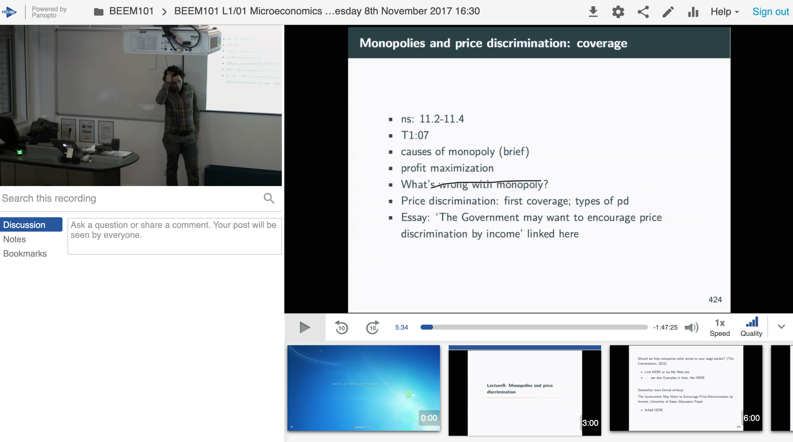

# (Monopoly) Firms' optimization and pricing, price-discrimination {#monop-firm-opt}

<div class="marginnote">
**I plan to add a great deal of content here.**
</div>

***

**University of Exeter students**: You can find a simple video presentation of many of these concepts from my 2018 lecture below:

<center>



[LINK to 2018 monopoly/PD lectures: less technical, uses graphical slides](https://recapexeter.cloud.panopto.eu/Panopto/Pages/Viewer.aspx?id=11a18c54-93c9-422e-9968-acb0a76cc899)

</center>


***
## Readings: {-}

### Textbook reading {-}

- O-R chapter 7 (you can skip the discussion of monopolists that maximise something *other than* profit)

- Consult [McAfee and Lewis](https://open.umn.edu/opentextbooks/textbooks/introduction-to-economic-analysis)
[Chapter 15: Monopoly](https://saylordotorg.github.io/text_introduction-to-economic-analysis/s16-monopoly.html) on the 'Lerner index' (or 'Lerner Markup Rule'). Note: the pdf version of this text is easier to read than the html version.

\

Notes on O-R chapter:

```{block2,  type='fold'}

We will focus on the (standard) profit-maximisation goal, although their discussion of other goals is interesting.

They define consumer and producer surplus here to give a brief treatment of the deadweight loss of monopoly.

They also have a very interesting treatment of the two main types of price discrimination; 'Implicit discrimination' foreshadows asymmetric information and agency problems.

There are various names of each of these ... I am familiar with "second degree  = self-selection" and "third degree or 'explicit segmentation'". They call the latter 'Implicit discrimination.

```


\

*Alternative textbook treatments (unfold):*

<div class="marginnote">
The notes in this book may draw from some of these alternate texts
</div>

```{block2,  type='fold'}

- NS: 11.2-11.4
- QMC: Appendix A.1 - Monopoly - the vanilla version

```

\


### Price discrimination in the media and public debate {-}

*Some interesting content to bring these concepts alive*


```{block2,  type='fold'}

[Moneybox (fixed link)](http://www.bbc.co.uk/programmes/b086kf1b)

<div class="marginnote">
This podcast contains many mis-statements; can you identify them?
</div>

```

\

*Some of my own non-technical writing on price discrimination:*

```{block2,  type='fold'}

- Article: [Should we help companies tailor prices to your wage packet?](https://theconversation.com/should-we-help-companies-tailor-prices-to-your-wage-packet-47719)
  - With accompanying [worked examples](https://docs.google.com/document/d/16jos_PT9w1wGpyD5A8ZiWJ9HW6kaLOJH6EWc_AYWnkk/pub)

- Somewhat more advanced: 'The Government May Want to Encourage Price Discrimination by Income' [Linked here](https://davidreinstein.wordpress.com/research-and-publications/)

```

- Teaching discussion; insightful: [@Marsden2011]

\


### Material from data science and industry pricing practice {-}

<div class="marginnote">
I want to add more here
</div>

```{block2,  type='fold'}

 
See "Marketing" chapter in [Business analytics with R](https://bookdown.org/jeffreytmonroe/business_analytics_with_r7/) (Note, this needs some clarification)

```

\

### Peer-reviewed academic work {-}

Recent theoretical microeconomic analyses and characterizations of the welfare consequences of "third-degree" price discrimination:

[@aguirreMonopolyPriceDiscrimination2010; @bergemannLimitsPriceDiscrimination2015; @cowanThirdDegreePriceDiscrimination2012; @varianPriceDiscriminationSocial1985]

\

Empirical analyses of price discrimination:

[@Courty2012; @Kiser1998]
\


## Why study the monopoly?

A *monopoly* is a single firm operating in a market without competition. 

Although this is an extreme situation (the opposite extreme to 'perfect competition'), we focus on this because:

- The mathematics of the quantity/pricing choices are easy to interpret, and relevant to other environments. 

<div class="marginnote">
E.g., the optimization is equivalent to the case of 'monopolistic competition', which is sometimes argued to be the most realistic benchmark framework. In 'monopolistic competition', each firm has a somewhat differentiated product (or 'location') and faces a downward sloping demand for its own product.  However, with monopolistic competition, unlike under monopoly, as more firms selling related products enter, each firm's profit dissipates to zero.
</div>
 
- It provides a simple example of the "deadweight" welfare loss from firms with market power reducing their supply in order to keep up prices.

- We can most simply percent models of price discrimination and segmentation, which is a highly relevant business practice (and may face similar concerns in other competitive environments like monopolistic competition)

- Monopolies (or near-monopolies) certainly do exist and have always existed in some industries ... And perhaps these are growing even more important (consider the "big 4 tech firms")

\

## Monopoly profit-maximisation: simple (undergraduate-level) take:

As noted, a *monopoly* is a single firm operating in a market without competition. 

\


Such a firm may gain an *Economic Profit* \*.

<div class="marginnote">
An economic profit is the revenue minus costs, where the costs *include* normal returns to the capital invested in the project. You should be clear on this basic and fundamental (undergraduate) concept.
 </div>


\

A monopoly situation can only be sustained by some [barriers to entry](#barriers), discussed below.

\


A monopoly firm, like all firms, will set it's quantity $Q$ to maximize it's profits $\pi(Q) \equiv QP(Q)-C(Q)$ where $P(Q)$ is the inverse demand (the maximum price that can be charged if a firm wants to sell quantity $Q$), and $C(Q)$ is the cost of producing $Q$. 

\

Under standard simple conditions (discussed below), if the monopoly can only charge a single price, this  leads to the monopoly maximising it's profit by producing $Q$ such that $MR(Q) = MC(Q)$ (assuming $P>AC$).

This is because under these simple conditions, we simply need to take the 'first order condition' ... i.e., to find the profit-maximising quantity $$argmax_{Q} \Big(QP(Q)-C(Q)\Big),$$
we simply find the unique point where the slope in $Q$ (the derivative) is zero, so $$P(Q)+QP'(Q) - C'(Q) = 0,$$ i.e., 
$$P(Q)+QP'(Q) =  C'(Q)$$, i.e., again, $MR(Q) = MC(Q)$. 


\

Marginal revenue is the rate at which revenue $QP(Q)$ changes in quantity, which is thus $P(Q)+QP'(Q)$. 


For a small increase in $Q$: 

- The rectangle of revenue increases proportionally to the current price, 
- but it decreases at rate $P'(Q)$ as price must decrease to sell the next unit, and this price decrease reduces revenue in proportion to the current quantity $Q$. For my money, this example offers the most intuitive example of the product rule for derivatives. 

\

Intuition:  the 'volume' benefit of increasing $Q$ is countered by

1. a greater cost (producing more always costs more) and
2. the need to reduce price (on all units) to get people to buy it.

\

For a linear demand curve the marginal revenue will have a slope of twice of the inverse demand curve, and the same intercept (see computation below). See [HERE](https://youtu.be/IEjcTLPtTIY) for a very simple and clear depiction of monopoly profit maximization with a linear demand curve (and only a bit of oversimplification.)


```{block2,  type='fold'}

Suppose $Q = \alpha - \frac{1}{\beta} P$, so 
$P = \alpha\beta - \beta Q$
  
Then revenue is $PQ = \alpha\beta Q - \beta Q^2$ so
$MR =  \alpha\beta - 2\beta Q$, as noted, twice the slope of the inverse demand curve

```


\


### Graphically: Monopoly profit-max 

<center>

*Marginal cost, demand, marginal revenue, and quantity of a monopoly producer* 


{width=50%}

</center>

<div class="marginnote">
Image source: [McDL](https://saylordotorg.github.io/text_introduction-to-economic-analysis/s16-monopoly.html)
</div>
 


<!--
```{r  fig.cap = '', out.width='60%', fig.asp=.4, fig.align='center',  echo = FALSE}
 knitr::include_graphics(file.path("picsfigs","monopprofit1.png"))
```

\

```{r  fig.cap = '', out.width='60%', fig.asp=.4, fig.align='center',  echo = FALSE}
 knitr::include_graphics(file.path("picsfigs","monopprofit2.png"))
```
-->


```{block2,  type='note'}
Recall that a firm's revenue is Price $\times$ Quantity. This is depicted as a rectangle corresponding to a specific point on the demand curve facing the firm. \

The firm's *profit* is this revenue less average cost. \

MR tells you how the 'revenue rectangle' will increase (or decrease) with another unit. MC tells you the *cost* of this additional unit. \

Where MR>MC, increasing quantity a little bit increases revenue more than costs, thus increasing profit.
```


\

This is depicted in the figures below:

\

<div class="marginnote">
Image source: [Wikimedia commons](https://commons.wikimedia.org/wiki/File:Imperfect_competition_in_the_short_run.svg)
</div>

```{r  fig.cap = 'Monopoly pricing and profits', out.width='60%', fig.asp=.4, fig.align='center',  echo = FALSE}

knitr::include_graphics(file.path("picsfigs","wiki_File_Imperfect_competition_in_the_short_run.png"))

```


```{block2,  type='warning'}
*Be careful here:* \

The price the monopoly can get at quantity $Q^*$ is $P^*$  \
... to see the price charged you need to 'project up' to the *demand* curve NOT the MR curve.
```

\
<!--
```{r  fig.cap = '', out.width='60%', fig.asp=.4, fig.align='center',  echo = FALSE}
 knitr::include_graphics(file.path("picsfigs","monopprofit4.png"))
```
-->

Again, remember that revenue is $P^*Q^*$ but costs at $Q^*$ are $Q^* \times AC$ \
 so profit is $(P^*-AC)Q^*$. \


<!--
<div class="marginnote">
Add graphical depiction here
</div>

```{r  fig.cap = '', out.width='50%', fig.asp=.6, fig.align='center',  echo = FALSE}
 knitr::include_graphics(file.path("picsfigs","monopprofitmax.png"))
```

-->

\

### 'There is no supply curve for a monopoly!'

A  'Supply curve': maps from p to q (and usually vice-versa) for a firm or industry. This is not *affected* by demand, only by the costs and number of firms.


<br>


*In contrast:*

A monopoly *chooses* price (thus also choosing quantity it can sell) where $MR(q)=mc(q)$.

- But $MR(q)$ depends on the demand curve slope/curvature at $q$,
- so if the demand curve changes it will affect the supply/pricing decision!


## Monopolistic market, profit-maximization: O-R formal depiction and advanced insights

<div class="marginnote">
Content to be included/summarised here from O-R 7.1-7.2
</div>

O-R formally define a monopolistic market.  Their definition and approach is unusual because:

<div class="marginnote">
Note that they are defining the 'primitives' of such a market in a way that allows one to apply rigorous math proofs and (potentially) define an 'equilibrium'.
</div>

1. They incorporate, from the beginning, a demand function $q_i(p_i)$ for each 'segment' $i$ ... allowing for the possibility of price discrimination (something which we will focus on).

2. They let the producer have a 'preference' ($\succsim$), which may incorporate both profit and quantities sold in each segment. We will not focus on this: we will focus on the standard profit-maximisation goal. 

<div class="marginnote">
This second point is very interesting, but we've no time to address it now. 
</div>
 

```{block2,  type='def'}

**Monopolistic market** 

> A monopolistic market $\langle (q_i)^k_i=1, C, \succsim  \rangle$  for a single good has the following components:
```

\


They are just specifying the 'objects defining a monopolistic market' here; they have not told us what these things are yet.

<div class="marginnote">
Note that we are focusing on a producer of a *single* good; more complex cases could involve multiple goods with production synergies, strategic bundling, etc.
</div>
 
  
```{block2,  type='def'}

OR continue: 
  
> **Demand** 

> The function $q_i$, the demand function in segment $i$, associates with every price $p_i$ for segment $i$ the total amount $q_i(p_i)$ of the good demanded in that segment.
```

\

They note that these demand functions are 'decreasing' functions: for higher values of the argument, the output of the function is *not* higher. In other words, we are considering demand functions that are decreasing, or at least not increasing, in price.\* 

<div class="marginnote">
 This rules out the 'Giffen' good.
</div>
 

```{block2,  type='def'}

OR: 
  
> **Producer**
> A single producer, called a monopolist, characterized by a cost function $C$ that is continuous and convex and satisfies $C(0) = 0$, 


> and a preference relation $\succsim$ over pairs $((y_1,... , y_k), \pi)$, where $y_i$ is the quantity sold in segment $i$ for $i = 1,..., k$ and $\pi$ is the producer’s profit

```   

\

Note that cost increases in output at an increasing rate; this is a fairly restrictive assumption, and it rules out the 'natural monopoly' case.  They also assume that the cost of producing 0 is 0, which seems natural.

\

### Profit maximization and marginal revenue 


O-R Essentially restate the analysis we presented above, however they are slightly more formal, and they consider an interesting wrinkle: marginal revenue *need not be decreasing* in quantity.


\
O-R definitions ... 

> Let $\langle (q_i)^k_i=1, C, \succsim  \rangle$ be a uniform-price monopolistic market.

...we refer to 'uniform pricing', because here (as above) we are considering only a single price for the market as a whole. We discuss [below](#arbitrage) why price discrimination my not always be possible, for legal or practical reasons. 

\

> Define the total demand function $Q$ by $Q(p)=\sum_{i=1}^k q_i(p)$

... simply summing the quantity demanded at a certain price across all segments 1 through k. 

\

O-R Define marginal revenue essentially as above,
 
> $MR(y) = [P(y)y]' = P(y) + P'(y)y$, where P is the inverse of Q.

giving additional intuition ... 

> If the function P is decreasing, ...

(i.e., if the demand curve slopes downwards)

> ..we have $MR(y) ≤ P(y)$ for all y. [Because] selling an additional unit of the good increases revenue by approximately $P(y)$ but also causes a reduction in the price of all $y$ units sold.

<div class="marginnote">
I restate this point because it's just that important.
</div>

\

They next make an interesting point which I have not seen noted before:

> Usually the function MR is assumed to be decreasing, but this property does not follow from the assumptions we have made. The derivative of $MR$ at $y$ is $2P′(y) + P′′(y)y$

<div class="marginnote">
Of course the MR is itself the derivative of the revenue function, so here we are considering the *derivative of a derivative*.  I.e., the derivative of $P(y) + P'(y)$ with respect to $Y$ ... and thus considering, 'Is the rate at which revenue *increases* in output decreasing as output increases, so additional units of output add less to revenue than earlier units? This was the case in all the graphs depicted above, but it need not hold in general. 
</div>
 

> so that if $P′′(y)$ is positive and large enough, the derivative is positive even if $P$ is decreasing.

We assumed above that price is decreasing in quantity (only ruling out 'Giffen goods'). Thus as the quantity increases the *benefit* of an additional unit of increase in quantity (holding price constant) must be smaller, because you are charging a lower price. This by itself would point to a declining MR. 

\

However, for every increase in quantity the price must fall somewhat, which itself reduces revenue. The necessary marginal drop in price $P'(y)$ need not be constant, it may be increasing or decreasing, i.e., $P′′(y)$ may be positive or negative in any region. Thus, it's possible that for increases in quantity from a *larger* starting quantity, the necessary reduction in price is relatively much *smaller* than it was when increasing quantity from a smaller base, leading to a lower loss of revenue than before, and even outweighing the effect in the previous paragraph. 


This is illustrated in O-R example 7.1, depicting three consumers with 'maximum willingness to pay' of 10, 6, and 5, respectively:

| y 	| p 	| rev(y) 	| mr(y) 	|
|-	|-	|-	|-	|
| 1 	| 10 	| 10 	| 10 	|
| 2 	| 6 	| 12 	| 2 	|
| 3 	| 5 	| 15 	| 3 	|


\

Above, we see that increasing the quantity $y$ from 1 to 2 requires reducing price from £10 to £6, and thus increasing revenue by only £2. However, increasing the quantity from 2 to 3 requires reducing price by only £1 further, and thus increasing revenue by £3. Although the latter price decrease 'operates on more prior units' (2 rather than 1), it is a much smaller price decrease (£1 reduction rather than a £4 reduction), outweighing the 'volume effect'.  

\

The fact that $MR$ need not be everywhere downward sloping means that the $MR(y)=MC(y)$ condition for profit maximizing output $y$ is a necessary condition but not a sufficient condition.\*

<div class="marginnote">
\* This is not a 'corner solution' issue: it is not even sufficient for an *interior* optimum, with a positive output. Furthermore, this is not because of regions of decreasing marginal costs; it is not sufficient even if MC are constant or rising everywhere.
</div>

O-R illustrate this point in Figure 7.1. *Have a look*. 

\

### "Lerner markup rule" -- an additional insight {#lerner}

From McDL:

> We can rearrange the monopoly pricing formula to produce an additional insight.

(Going back to our earlier notation...)

A profit-maximizing monopolist must set $Q$ (if positive) such that: 

$$P(Q)+QP'(Q) =  C'(Q).$$
Rearrange this to consider the 'markup over marginal cost':

$$P(Q) -  C'(Q) = -QP'(Q),$$
and now as the 'markup as a fraction of the price charged', the so-called 'Lerner Index':

$$\frac{P(Q) -  C'(Q)}{P(Q)} = -\frac{QP'(Q)}{P(Q)}=\frac{1}{\epsilon} ,$$

The right hand side of this is simply the 'inverse price elasticity' $\frac{1}{\epsilon}$.

Derivation:

```{block2,  type='fold'}

Take the inverse of the second term

$\frac{1}{-\frac{QP'(Q)}{P(Q)}}$
$=-\frac{\frac{1}{Q}{\frac{P'(Q)}{P(Q)}}$
$=-\frac{\frac{1}{Q}}{\frac{\frac{dP}{dQ}}{P(Q)}}$
$=-\frac{\frac{dQ}{Q}}{\frac{dP}{P}}$
$=\epsilon$

```

> this formula provides a measure of the deviation from competition, and in particular says that the deviation from competition is small when the elasticity of demand is large, and vice versa.

> ... If demand is very elastic, the effect of monopoly on prices is quite limited. In contrast, if the demand is relatively inelastic, monopolies will increase prices by a large margin.

\


This is also a formula firms might directly use ... if they knew their marginal cost and, more challengingly, if they knew the price elasticity of demand over its entire range. In the real world, firms do sometimes use 'markup rules' for pricing.  

According to McDL: 

> This formula is sometimes used to justify a “fixed markup policy,” which means a company adds a constant percentage markup to its products. This is an ill-advised policy not justified by the formula, because the formula suggests a markup which depends on the demand for the product in question and thus not a fixed markup for all products a company produces.

\

Some more insights from McDL:

```{block2,  type='fold'}

> Marginal cost will always be at least zero or larger.... Thus, the price-cost margin is no greater than one, and as a result, a monopolist produces in the elastic portion of demand.

DR: Note that I emphasze at great length that a monopolist will never price in the inelastic portion of the demand curve it faces, and I try to give lots of insight into this. 

> One implication c ...  if demand is everywhere inelastic (e.g. $p(q) = q−a$ for $a>1$), the optimal monopoly quantity is essentially zero, and in any event would be no more than one molecule of the product.


```

## Monopolies and 'allocative inefficiency' {#monop-inef}

O-R: 

> Since $MR(y)  < P(y)$ for all $y$, an implication of Proposition 7.1 [$MR(y^{\ast})=MC(y^{\ast})$] is that the price charged by a profit-maximizing producer in a uniform-price monopolistic market is greater than the marginal cost at this output.

This leads to an inefficiency: 

> the cost of production of another unit of the good is less than the price that some buyers are willing to pay for the good. The monopolist does not produce the extra unit because he takes into account that the price reduction necessary to sell the extra unit will affect all the other units, too, causing his profit to fall.

\


```{block2,  type='note'}

Recall from your previous studies, the model of 'perfect competition':

Free entry and exit - $\rightarrow$ zero long-run economic profit

Many many tiny firms $\rightarrow$ firms are price takers.

$\rightarrow$ price = marginal cost, and in the long run $p=ATC$ and firms produce at $min(AC)$

Similar conditions for input markets (e.g., capital and labor).

This, in combination with firms and consumer's optimizing behavior, and several other assumed conditions (such as diminishing returns to scale) yielded the 'fundamental welfare theorems'. Under the first welfare theorem, free exchange and markets 'in equilibrium' lead to a Pareto-efficient outcome.

These were extreme assumptions; perhaps only a theoretical ideal.


\

In contrast, firms with market power might maximize their profits by setting $p>mc$.

A 'permanent unregulated monopoly firm' is the opposite extreme: A single firm, No possibility of competing firms entering, and no competitive or legal constraints on price.


```

<br>


<div class="marginnote">
There are a variety of *market structures* we might consider that fall in between the extremes of perfect competition and monopoly. These include 'oligopoly' and 'monopolistic competition'. The field of Industrial Organization focuses on these models of market structure  and their implications for pricing, welfare, innovation, and more
</div>


\

### The deadweight loss of monopoly: simple discussion {#dwl-simple}


*Criticisms of monopoly:*

1. Monopolies produce too little output, the standard 'deadweight loss triangle'. This leads to *allocative inefficiency* (i.e., top-level inefficiency, i.e., the wrong mix of goods is being produced; too little of the monopolized good and too much of other goods).

2. There is a redistribution of wealth from consumers to owners of monopoly.

(But the latter could be counterbalanced by government redistribution; so maybe we shouldn't consider it a strike against monopoly?)


\

Compared to perfect competition, a monopoly typically produces less output and charges a higher price

- Some of the consumer surplus under perfect competition is transferred to the monopolist.

- There is also a deadweight loss under monopoly, as depicted below. This 'deadweight' is lost to society--- no one gets it. It represents net value that *could* be generated but is *not* generated.

\


```{r  fig.cap = 'Source: McAfee et al. ', out.width='95%', fig.asp=.7, fig.align='center',  echo = FALSE}
 knitr::include_graphics(file.path("picsfigs","dwl_monop_mcafee_explanation.png"))
```

\

<div class="marginnote">
*Be sure you understand and can depict*

The difference in monopoly vs perfect competitive quantity \
... difference in price \
... difference in consumer surplus \
... difference in firm profit or producer surplus

</div>
 


\
<!--
```{r  fig.cap = '', out.width='65%', fig.asp=.4, fig.align='center',  echo = FALSE}
 knitr::include_graphics(file.path("picsfigs","dwl2.png"))
```

\
-->

*Note:* The differences mentioned (costs, transfers) refer to the monopoly outcomes *relative to perfect competition*.

\
<!--
```{r  fig.cap = '', out.width='80%', fig.asp=.4, fig.align='center',  echo = FALSE}
 knitr::include_graphics(file.path("picsfigs","dwl3.png"))
```

-->

```{block2,  type='note'}

2020 BEEM101 students: For time concerns, I am not going to focus on the measures of the welfare cost or deadweight loss of monopoly, nor on the potential regulatory responses to reduce these costs. These are certainly important for economic policymaking, however. The stereotypical free-market economist is thought to argue that 'price ceilings are always harmful'; this is not necessarily the case. 

```  

\

### Aside: Types of inefficiency; simple definitions {-}

We refer to underprovision of monopoly as a departure from '**allocative inefficiency**' AKA '**top-level inefficiency'**.

\

Essentially, from the point of view of the entire economy: 
  
1. If we could produce more of one good without producing less of any other good (i.e., we are below the 'production possibility frontier' (PPF)), perhaps because we are misallocating inputs to different production processes (e.g., capital and labor) ... this is called **Productive inefficiency**

<div class="marginnote">
Here 'goods' includes all things that people value, including services, environmental amenities, leisure time, etc. 
</div>
 

2. Suppose the economy is producing the combination of goods yielding 'point Z on the PPF.'  However, suppose that given the combination of goods produced Z, and the distribution of these goods to consumers we could *reallocate* these.  (E.g., have person 1 trade good $z_1$ to person 2 in  exchange for some of good $z_2$). Suppose that this reallocation would  to make at least one person better off without making anyone worse off (a Pareto imrovement). Then the original point (before any such reallocation) was not Pareto Optimal; it suffered from **Exchange inefficiency**.


3. Suppose the economy is producing at 'Point X on the PPF' and there is no Exchange inefficiency. However, we are producing the 'wrong goods': we  could make a Pareto improvement by producing 'more of one good and less of another' (and allocating these to consumers).  We call this **'top-level inefficiency'** or **'allocative inefficiency'**. The DWL of monopoly leads to allocative inefficiency: too little of the monopolized good will be produced relative to other goods. (The remaining productive resources will presumably be used towards non-monopolized goods, and these will be relatively over-produced.)


\

### Other potential social costs and benefits of monopoly {#other_costs_monop}

Some argue the deadweight loss (DWL) above *understates* the true harm of monopoly. This is controversial. These arguments include...

- 'Secure' monopolies don't innovate as much, and spend wastefully (leading to productive inefficiency)?

- Monopolies may expend wasteful resources (lobbying, threats, lawsuits...) to preserve barriers to entry

Thus the above monopoly profits may turn into *further* deadweight losses!

On the other side, some people argue monopolies tend not to persist in the long run, are disciplined by *potential* entry, and have *greater* incentives to innovate.


\

Empirically, the magnitude of the social cost of monopoly is an open question. Estimates range from 0.5\% of GDP to 5\% of GDP

\


#### The double marginalisation problem {-#double-marg}

Note that if a monopoly firm buys its inputs from a supplier who is also a single-price monopolist, the welfare cost is compounded. There are then 'two markups' leading to even more inefficiency.

<center>

A simple depiction of the double-marginalisation problem.

<iframe width="560" height="315" src="https://www.youtube.com/embed/-uN--rvaGA4" frameborder="0" allow="accelerometer; autoplay; clipboard-write; encrypted-media; gyroscope; picture-in-picture" allowfullscreen></iframe>

</center> 

Another simple presentation for the case of linear demand can be found [HERE](http://web.mit.edu/rpindyck/www/Courses/VS_11.pdf) on pages 1-6. 

This is an argument for letting firms merge with their upstream supplier.  

We return to this in the exercises. 

\

```{block2,  type='inputq'}
*Consider also:* if a firm allows an 'upstream division' to charge a price for inputs to a 'downstream division' and the latter sets prices and quantities for retail sales... and both divisions 'keep their surpluses'... will this boost the firm's profits?
```  

```{block2,  type='fold'}

This is called 'transfer pricing'. It may offer incentives to efficiently cut costs. However, by doing this, the firm may end up recreating the double-marginalisation problem, leading to inefficiency and lower profits. There is a tradeoff.
```

## Barriers to entry {#barriers}

If a monopoly firm is earning 'economic profits' (profits in excess of the normal risk-adjusted returns to capital), other firms will want to enter the industry.  Thus,  for the monopoly to persist there must be "barriers to entry".

```{block2,  type='inputq'}

What are some 'Technical barriers to entry'?

What are some 'Legal barriers to entry'? Explain.

What other barriers might exist?
```

\

**Technical barriers to entry**

```{block2,  type='fold'}


**1. Increasing returns to scale / Diminishing average cost over a broad range of output**  $\rightarrow$ 'a natural monopoly'

Here multiple firms producing separately are in fact *less efficient*, as they cannot produce the lowest cost.

\

**2. Special knowledge of a low-cost method of production, or a key resource**


<div class="marginnote">
\* However some argue that there will simply be a limited "rent" derived from this new production process, and it will not constitute a barrier to entry. How would you make such a case?
</div>

\

3. A limited market scale with fixed costs and 'indivisibilities.' E.g., demand for a particular river crossing may be such that it could support a single ferry operator making a profit, but not two ferry operators. Here there might be a 'first-mover advantage'.

```

\

```{block2,  type='fold'}

** Legal barriers to entry**

- Patents and copyrights
- Exclusive franchise or license (granted by government, by another firm, by a university)
- Government support for a dominant firm, discouraging/forbidding others

```

\

**Other proposed barriers: the threat of 'predation'**

```{block2,  type='fold'}

Economists have debated whether "predatory practices" could allow a firm to retain monopoly power. For example, a firm might commit "if any other firms enter we will reduce our prices far below cost." Perhaps this would scare away other firms from entering.

\

However, this might not be a "credible threat"; if another firm *did* enter, the would-be-monopolist might not find it profitable to retaliate in this way. This is an open question; the game theoretic prediction depends on the assumptions made.

```


\

... from the 2016 Massachusetts ballot initiative:


```{r  fig.cap = '', out.width='40%', fig.asp=.4, fig.align='center',  echo = FALSE}
 knitr::include_graphics(file.path("picsfigs","gaming_open.png"))
```

<div class="marginnote">
Ballot measure: is this establishing a legal barrier to entry?

</div>


## Price discrimination/market segmentation {#pd}


### The basics

```{block2,  type='note'}

Note: This is largely undergraduate material -- I plan to update and supplement this soon with more formal material from O-R and elsewhere, and with some applied material from data science and business

```

Price Discrimination

:      The practice of firms offering different prices to different consumers

- Or different prices for slightly different *products* or quantities,
    - where the difference in price does *not* merely reflect cost difference,
    - with the goal of distinguishing consumers' *willingness to pay* (WTP).


*Note: This includes 'volume discounts', or offering an 'all you can eat' plan alongside a per-unit plan*

\

```{r  fig.cap = '', out.width='40%', fig.asp=.4, fig.align='center',  echo = FALSE}
 knitr::include_graphics(file.path("picsfigs","exeter_picturehouse.png"))
```

Why such a complicated price list?

\

#### Why do firms price discriminate? {-}

**It can increase profit...**  by 'extracting more surplus' from consumers


In general, for a monopoly firm, the ability to identify consumers based on their WTP and charge distinct prices *will* increase profit.

However, it may increase or decrease *social* (consumer+producer) surplus. Consumer surplus itself may increase or decrease.

\

#### Uniform pricing (what we were previously considering... the usual analysis) {-}

Offering a single price for a good for all consumers is known as 'uniform pricing'.

\

This does not deal with differences amongst consumers. It may ''force the firm to target a particular group'', such as the wealthy, reducing its total sales.

Under monopoly, uniform pricing leads to a deadweight loss, as we have already seen:


```{r  fig.cap = 'Source: McAfee et al. ', out.width='50%', fig.asp=.5, fig.align='center',  echo = FALSE}
 knitr::include_graphics(file.path("picsfigs","dwl_monop_mcafee.png"))
```
\

However, price discrimination holds the potential to increase profit (it will, in general, increase profit). It might also reduce the deadweight loss, i.e., increase total welfare. If price discrimination is 'Perfect' then it *will* boost total welfare, as suggested in the illustration below (see Saylor academy [First-Degree Price Discrimination: Personalized Pricing](https://saylordotorg.github.io/text_developing-new-products-and-services/s05-02-first-degree-price-discriminat.html) for an interesting discussion, but see margin note.\*) 

<div class="marginnote">
**Note**: I would say that an auction *might* lead to outcomes resembling perfect price discrimination, where the seller captures most of the consumers' valuations. But this is a whole field of study, 'Auction theory', which engages the issues of Asymmetric information and Mechanism design (principle/agent models).
</div>


```{r  fig.cap = 'Source: Saylor Academy', out.width='80%', fig.asp=.8, fig.align='center',  echo = FALSE}
 knitr::include_graphics(file.path("picsfigs","saylor_single_price.png"))
```

\

```{r  fig.cap = 'Source: Saylor Academy', out.width='80%', fig.asp=.8, fig.align='center',  echo = FALSE}
 knitr::include_graphics(file.path("picsfigs","saylor_ppd_auction.png"))
```


\

**But if it is not 'perfect', price discrimination can reduce (or increase) welfare...**

\

```{block2,  type='inputq'}

Price discrimination may seem counter-intuitive: ‘how can offering some consumers lower prices increase profit?’

```  


```{block2,  type='fold'}

- Higher prices increase your profit per unit, but at a higher price you will sell fewer units. The more you charge the less you sell.

- Some groups of ‘less keen’ consumers are very sensitive to the price, and they will buy very little at a high price, so a lower price would be more profitable.

- Some groups of ‘more keen’ consumers will buy a lot even at a high price. They are less ‘price-sensitive’, so you want to charge them more.

```


\

### The three types of price discrimination {-}

1. Individual-based (First degree; at best 'perfect')


Note that 'targeting a price at each consumer' may be done on the internet or on a discretionary basis by an individual seller.  But this alone does not imply Perfect price discrimination.

'Perfect' means the seller exactly predicts and charges each consumer her exact valuation! It's basically a theoretical ideal.


<br> 


2. Self-selection (Second degree)


For 'self-selection' or 'second-degree price discrimination... we can imagine that  the firm doesn't know each consumer's valuations.  Or, perhaps the firm is not allowed to 'discriminate' by charging different prices to different people.

\

Instead, it sells different bundles, quantities or qualities of products to get high and low-value consumers to separate themselves...
 E.g., first-class seats.

<br> 


```{block2,  type='note'}

 To fully analyse these problems we need to know the techniques of 'mechanism design under asymmetric information'; we will touch on this later in the module, time permitting, and cover a brief version of it here, following the O-R notes.

There are some interesting results, such as 'the firm finds it optimal to make the low(er)-valuing type/types' bundle smaller or lower-quality than would be efficient (called quality or quantity distortion), while the higher-valuing type gets a 'rent' (consumer surplus).

```


 \ 


3. Group-based (Third degree; 'market separation')


Here the firm finds something identifiable and inherent about the consumer  that is indicative of her likely valuations (and price-sensitivity). \
It might be her age, nationality, student-status, or even perhaps her income.


\

## First-degree and/or 'perfect' price discrimination


<center>

Is this perfect price discrimination or something else?

<iframe width="800" height="500" src="https://www.youtube.com/embed/tXpx21Uf7hs" frameborder="0" allow="accelerometer; autoplay; clipboard-write; encrypted-media; gyroscope; picture-in-picture" allowfullscreen></iframe>

</center>


- The firm can offer each individual a different price for each unit they purchase.

- Assuming you know what the consumer is willing to pay, you can make the *highest possible profit*; that is called ‘perfect’ price discrimination.


<br> 


Perfect price discrimination
:     Charging each consumer (for each unit) the *maximum* he or she would be willing to pay, i.e., her valuation


<br> 


Here the monopolist would extract *all the available surplus*; no consumer surplus remains.

Because the monopolists extracts *all* the possible surplus, this is efficient!  This holds because the monopolist captures:

$\max$(total value of good - cost) $\rightarrow$ max(CS+PS)

\

But perfect PD is a rare/impossible extreme: requires mind reading.

A possible close example: a website targets an individualised price to each consumer, based on clues like time-of-day, web clicks, cookie data, IP location. But even this is not really *perfect* price discrimination:
Here, the seller does not really know exactly what the consumer is willing to pay; he is using broad clues.

<div class="marginnote">
See Shiller, B. R. (2013, or updated version). First degree price discrimination using big data.
</div>

\

<div class="marginnote">
Add graphical depiction here 
</div>
 

<!-- 
```{r  fig.cap = '', out.width='70%', fig.asp=.4, fig.align='center',  echo = FALSE}
 knitr::include_graphics(file.path("picsfigs","ppd3.png"))
```

\


```{r  fig.cap = '', out.width='70%', fig.asp=.4, fig.align='center',  echo = FALSE}
 knitr::include_graphics(file.path("picsfigs","ppd4.png"))
```

\


```{r  fig.cap = '', out.width='70%', fig.asp=.4, fig.align='center',  echo = FALSE}
 knitr::include_graphics(file.path("picsfigs","ppd5.png"))
```
-->

\

## Second-degree price discrimination


<div class="marginnote">
**More to be added here**
</div>
 
 
```{block2,  type='note'}
Although it involves concepts from asymmetric information (which we have not yet covered and is only included as a supplement), this is nicely addressed in O-R section 7.4. I will add more material here as well.

Please read this section (and further material which I will provide).
```


Here the firm is unable to differentiate between consumers explicitly.  Instead it offers various varieties and bundles. It uses variations in quality/quantity to get consumers to "self-select."

\

Some examples:

- Quality- Transport- Different classes, Supermarkets- budget products

- Quantity- Supermarkets- Larger quantities at lower prices per unit; i.e., 'nonlinear pricing'


\

Consider...

**Quantity**

An 8 ounce cup of coffee for £1.60 vs. 16 ounces for £2.00

- 20 p per oz vs. 12.5p per oz.  (with linear pricing there would be the same price of 15p/oz.)

\

$\rightarrow$  Result: with 2 prices monopoly can get 'high value' consumers to buy/get more in total without losing 'low-value' consumers


\


**Quality**

The calculations are similar when we consider variations in quality:

An airline doesn't know whom the high-valuation flyers are (willingness-to-pay, 'wtp' for travel *itself* varies)

But it may know on *average* that flyers with higher wtp for travel *also* value comfort more. Thus:

- Make second-class seats very uncomfortable, first-class luxurious, and charge more for first-class seats

- Can get consumers with higher values for travel *and* comfort to pay more

- ...without losing lower-valuing customers


\

### The 'self-selection' problem {-}

Train companies must price first and second class such that consumers will self-select.

- If first class is too expensive then the high valuing group will not choose first class

- If second-class is too cheap, both the high and low groups will choose second class

- But if second class is too expensive, the low groups will not buy a ticket.


\

```{r  fig.cap = '', out.width='50%', fig.asp=.4, fig.align='center',  echo = FALSE}
 knitr::include_graphics(file.path("picsfigs","thirdclasscarriage.jpg"))
```

<div class="marginnote">
The Third-Class Carriage is a c. 1862–1864 oil on canvas painting by Honoré Daumier
</div>
 

```{block2,  type='digression'}

Jules Dupuit’s 1849 comments of the railroad industry in France:

> It is not because of the few thousand francs which have to be spent to put a roof over the third-class carriages or to upholster the third class seats that some company or other has open carriages with wooden benches. What the company is trying to do is to prevent the passengers who pay the second class fare from traveling third class; it hits the poor, not because it wants to hurt them, but to frighten the rich.

(Indirect source: 'Quantum Microeconomics')

```


<br>


There is typically lots of discussion of this in the media, see e.g.,  [THIS](https://www.1843magazine.com/ideas/the-daily/why-companies-make-their-products-worse) article in The Economist

\

## Third-degree price discrimination (3dpd) / Market separation


<center>
<iframe width="900" height="600" src="https://www.youtube.com/embed/3BAjYreCko8" frameborder="0" allow="accelerometer; autoplay; clipboard-write; encrypted-media; gyroscope; picture-in-picture" allowfullscreen></iframe>


What kind of price discrimination is this? Should it be legal?
</center>


Third-degree price discrimination/Market-separation
:    The practice of charging different prices to different groups that can be identified

Here, the firm can differentiate *groups of consumers* or 'local markets', not individuals.

Each group has a different willingness to pay *on average*.

\

$\rightarrow$ Offer lower prices to lower-valuing groups, higher prices to higher-valuing groups.

\

**Example:** Students and old-age-pensioners may face lower prices for transport, food and other goods; as they have a lower willingness to pay for these

Remember: this is *not* done out of charity but to boost profits.

\

### Pricing under 3dpd/market separation (calculations/graphical depiction) {-}

Each group or market has it's own demand $\rightarrow$ marginal revenue curve

- So set an optimising price quantity *separately* for each group.

- E.g., a discount for the elderly, higher price for the middle-aged

- Or a lower price in Portugal than in Germany

```{r  fig.cap = '', out.width='50%', fig.asp=.4, fig.align='center',  echo = FALSE}
 knitr::include_graphics(file.path("picsfigs", "discounts.png"))
```

\
<!-- 
```{r  fig.cap = '', out.width='60%', fig.asp=.4, fig.align='center',  echo = FALSE}
 knitr::include_graphics(file.path("picsfigs","3dpd.png"))
```

\

```{r  fig.cap = '', out.width='60%', fig.asp=.4, fig.align='center',  echo = FALSE}
 knitr::include_graphics(file.path("picsfigs","3dpd.png"))
```
-->

<div class="marginnote">
Add graphical depiction here 
</div>
 


\
*A pretty good numerical example is given in slides 6-8* [HERE](http://people.hss.caltech.edu/~mshum/ec105/matt9.pdf)

\

Another depiction, adding demand curves (they call it 'average revenue'):


```{r  fig.cap = '', out.width='85%', fig.asp=.4, fig.align='center',  echo = FALSE}
 knitr::include_graphics(file.path("picsfigs","Price-discrimination-SNP2.png"))
```

\

## Who benefits from 3DPD?

- Consumers *in identifiable group* with lower wtp face lower prices, thus they benefit

- Consumers *in identifiable group* with higher wtp face higher prices, thus they lose

- Firms can charge higher prices to high-wtp group without losing low-wtp group $\rightarrow$ increase profit


 \ 


Net welfare result: theoretically uncertain. This is a nuanced point, but I think you are up to the challenge! This is *not* covered in most of the textbooks, but I give several explanations and references.


\

**For consumers:**

```{r  fig.cap = '', out.width='60%', fig.asp=.4, fig.align='center',  echo = FALSE}
 knitr::include_graphics(file.path("picsfigs","pdwelfare.png"))
```

\

```{r  fig.cap = '', out.width='55%', fig.asp=.4, fig.align='center',  echo = FALSE}
 knitr::include_graphics(file.path("picsfigs","pdwelfareoverall.png"))
```


\


### Why is the benefit uncertain? {-}

**Exchange efficiency**

When groups can be identified as 'low and high valuation'

- the high-valuation groups get charged more, and thus consume less

- low-valuation groups get charged less, and consume more

$\rightarrow$ Exchange efficiency: *given what is produced*, PD causes it to be consumed by people who value it relatively less!

\

**Top-level efficiency; amount produced**

On the other hand, PD could lead more to be produced/consumed (but not necessarily) of the otherwise underproduced 'monopolised' good (remember the general DWL of monopoly).

$\rightarrow$ top-level (allocative) efficiency may increase (or decrease).

\

E.g., suppose that with a 'uniform price' only the wealthy went to a restaurant...

- after PD (early-bird discounts, OAP discounts, benefits discounts) the low-income may also dine in the restaurant

- $\rightarrow$ more value is produced

\

Considering the two effects on efficiency just described ... one (Exchange efficiency) is negative and the other (Top-level) may be positive or negative. If the latter is positive (if production increases with PD) the effects trade off one another. Because the 'Exchange efficiency effect' is negative, the quantity produced *must* increase after PD for it to be beneficial. But this quantity increase is a necessary but not a sufficient condition; this effect also must be large enough to *outweigh* the exchange-efficiency effect.

\


## Arbitrage ...  can foil price discrimination {#arbitrage}

If, e.g., elderly who get discounts could sell the products to the middle-aged...

- Then middle-aged would always ask them to do this, never pay high prices

- Firm could no longer profit from this

- Similar issues with quantity discounts, or 'web cookie' personalised pricing

\ 

So PD only 'works' for goods that are hard to trade, like haircuts...

or where purchases are frequent and low-value, and resale markets are difficult

(The above issues are sometimes referred to as 'transactions costs'.)

```{block2,  type='warning'}
When I ask about the welfare effect of price discrimination, students often mention arbitrage in this discussion. However, the potential for arbitrage doesn't make price discrimination *inefficient*, it just makes it *ineffectual* and makes firms not want to bother.

```

This yields another mechanism design 'hidden information' 'principal-agent problem'


# Exercises: Pricing/monopoly/price-discrimination (simpler) 

```{block2,  type='note'}

Exeter BEEM101 students: please do these exercises *before* the midterm
```  

## OR 7.1: Double Margins (all parts)


## Welfare loss of monopoly: Discussion question from a prior exam

- Depict and discuss the welfare costs of monopoly power as a 'market failure'. What are some factors that may lead estimates of these costs to be higher or lower?

**Solution help:** 

```{block2,  type='fold'}

See especially the section [The deadweight loss of monopoly](#dwl-monop) and accompanying discussion in the NS text. 
  
You should identify the DWL of monopoly as a reduction in top-level (allocative) efficiency. Please discuss this clearly and in your own words, showing your understanding.

```
\

- Will price discrimination reduce or increase the welfare cost of monopoly. Discuss.

**Solution help:** 

```{block2,  type='fold'}

'Perfect' price discrimination reduces the welfare loss, but is a theoretical ideal, not a realistic real-world practice. See [here](#fdpd); illustrate this in a simple diagram.

2dpd and 3dpd may increase or reduce the welfare cost of monopoly (i.e., reduce or increase welfare relative to a single-price monopoly). There is a tradeoff between a reduction in exchange efficiency and a *possible* increase in output which would imply an increase in alloctive efficiency. See extensive discussion of [3dpd here](#pd3d) and in linked readings. State and explain this in your own words.

```

# Exercises: Price discrimination and segmentation, 'pricing mechanisms'; intro to strategic interaction

```{block2,  type='note'}

Exeter BEEM101 students: These will be covered *after* the midterm
```  
