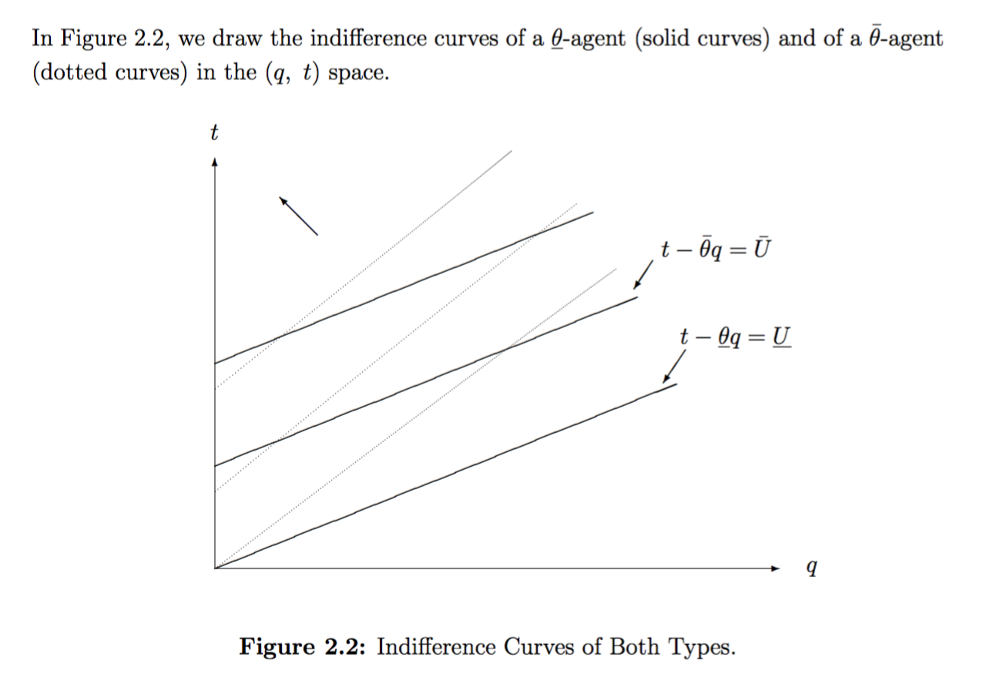

# Supplement: Asymmetric information (optional) {#asymmetric}


* Market failures: Asymmetric information** (Moral hazard, adverse selection, signaling)


Broadly, asymmetric information is a situation in which one party to a transaction has more information than the other party.


<!-- See separate notes on VLE -->

Brief summary below


## Principal-Agent Problem {#pa-problem}

A principal “hires” an agent to perform some task, and the agent has private information, either about her actions or her type.

- Employer-employee relationship:

- Employer (principal); employee (agent)

- A worker has full information about whether she is working hard (action) or her job skills (type).

- How does an employer monitor/influence effort?  How does a potential employee signal their high-quality or low-quality type?

\

**Moral hazard** problem occurs when an agent’s action is private information

- Offering incentives may be costly (because of limited liability, risk aversion, and difficulties in writing contracts)

**Hidden information** ('privacy') problem occurs when an agent’s type is private information.

- 'Lemons problem' $\rightarrow$ potential **Adverse selection** and/or closing down of markets

- Principal/agent $\rightarrow$ 'distorted' output or quality for 'less favored' type to reduce 'information rent' for 'better' type

<div class="marginnote">
Also, if the Agent moves first (instead of the Principal), this can lead to a 'signaling game', which we will not cover here. See 'the signaling benefit of education.
</div>


\

Automobile insurance

- When selling a policy the company does not know whether you are a high risk or low risk driver (adverse selection)

- Since you are insured you are less careful (moral hazard)

## Moral hazard: Basic principles

1. If 'effort' (or honesty) is unobserved or un-enforceable, principal (P) must offer incentives based on *observed performance* or *output* of the agent.

2. If output has (uncontrollable) *random component*, rewarding output shifts risk to the *agent* (A).

- If A is more risk-averse than P, if compensation must be tied to output $\rightarrow$ inefficient risk-bearing.

- Because of the cost of paying a 'risk premium' to A $\rightarrow$ P may demand less effort than is efficient

3. Otherwise, if P \& A have the same risk-attitude, P can 'sell the profits to A' $\rightarrow$ efficiency

- But not if A has 'limited liability' $\rightarrow$ inefficiency:
    - P can only 'reward' A not 'punish' her $\rightarrow$ costly $\rightarrow$ demand less effort

*See 'more formal moral hazard notes' (VLE) and Flowchart if interested*


## Lemons problem

*Where sellers know more about the value of used cars than buyers, some sales that would be mutually beneficial will not take place.*


Easiest model:

- Car quality $x$ distributed $x \sim U(0,1)$.

- Buyer values at $\frac{3}{2}x$, seller values it at $x$ (so efficiency requires trade!)

- Seller proposes 'tioli' price $p$


$\rightarrow$ Seller must choose $p \geq x$ $\rightarrow E(x|p)=\frac{1}{2}x$ $\rightarrow$ Buyer anticipates value $\frac{3}{2}\frac{1}{2}p=\frac{3}{4}p$

Buyer never accepts any price $\rightarrow$ market closes down


<!-- *See slightly more fleshed-out (VLE) if interested* -->


## To learn this material fully (and to be prepared to answer an exam question), please also read:

- ['Privacy'/Hidden Information](https://www.dropbox.com/s/mdit2mvjnln2bt2/beem101_adapt_hidden_info_slides_ho.pdf?dl=0) and suggested accompanying readings esp. from Laffont and Martimort.

- [Lemons/Adverse Selection](https://www.dropbox.com/s/wxymi69prteh3lb/notes_on_akerlof_09.pdf?dl=0)

You can also learn more about moral hazard [here](https://www.dropbox.com/s/qiraup69bcgum1m/1_MH1_2013_proofskim.pdf?dl=0) and more simply [here](https://www.dropbox.com/s/vvloducyvufdmlq/1e%20-%20easy%20Moral%20hazard%20background.pptx?dl=0) but it is unlikely to be on the final exam (for 2019-20)


## Supplement: Hidden information: adapted full presentation {#hidden-info}

Material comes largely from Laffont and Martimort ch. 2

<div class="marginnote">
 : The (2001 edition) of the Laffont and Martimort text appears to be
online for free. Look up “THE THEORY OF INCENTIVES I : THE
PRINCIPAL-AGENT MODEL” and you will probably find it.

The key sections to read are ’2.2 The Basic Model’ through 2.7.3
’Shut-down policy’.

This is also partially covered, with a different approach, in the NS
text section ’Adverse Selection: Consumer’s Private Information about
Valuation’
</div>

### Introduction: Adverse Selection (Hidden information) and screening

This involves the optimal design of incentives when the agent has
private information on an *unchosen* variable that affects the payoffs.

However, the identical model describes second-degree price discrimination, setting a menu of prices and quantities/qualities and getting consumers to self select.

\

[Motivational example:  ‘Pursuit of Happyness](http://www.youtube.com/watch?v=_xcZTtlGweQ)

Discuss:

```{block2,  type='fold'}


Why would Dean Witter make the internship unpaid? What kind of a person
would take such an internship?

Why would firm give such a huge return to its brokers?

What are the inefficiencies associated with this?

Who is bearing the risk?

```

#### Examples {-}

**Firms, production...**

 Firm hires employee of unknown skill or unknown intrinsic
motivation 

 A landlord delegates the cultivation of land with unknown
productivity to a tenant-farmer 

 Government (or firm) procurement from (or regulation of) monopoly
firm w/unknown marginal. cost (e.g., NHS services)

... Or
within a firm (see theory of the firm) 


 Investor delegates management of his portfolio 

\

**‘Consumption-side’...**

- Firm sells good to consumer w/ unknown value (2nd degree price discrim.)

- Housemates decide which level of TV plan to buy (public good, mechanism
design problem)

- Insurance company sells policy to individual of unknown health status

\

#### Key features: {-}

The principal would want to reach *allocative efficiency*, if he could extract all the surplus... i.e., the proper matching of social marginal cost and marginal
benefit ...

\

... but, where there is *hidden information*, this conflicts with the
incentive compatibility constraints of the agent 

\

... the principal may set a separate contract for each type, and hopes
they will ‘self-select’ (this is called *screening*)...


\

This leads to a second best set of contracts that reduces allocative
efficiency to minimize the *information rents* paid to agents.

\

**Example [“Listen to the market, hear the best policy decision, but don’t always choose it” by Reinstein and Song (2019)](https://ore.exeter.ac.uk/repository/handle/10871/36180)**

```{block2,  type='fold'}


**Abstract:**
  
Policymakers often consider policies with (a) uncertain social benefits and (b) uncertain impacts on the value of private assets; we characterize six ways (a) and (b) may be inter-related. Where investors have private information over (b), policymakers may attempt to learn this through the response of asset markets to proposed policies. However, where this information is concentrated, an informed trader may profitably hide his information and “manipulate” the market. We show that it is nonetheless generically optimal for policymakers to listen and respond to asset markets, but under specified conditions they must commit (e.g., through “political capital”) to sometimes pursuing a policy even when the expected welfare effects are negative. Surprisingly, allowing traders to short-sell can make it easier for policymakers to induce truth-telling actions.


```


### A Basic parametric model (two types)

Principal delegates production to agent:
$q$ units.

U(Principal)= $S(q)$

Where $S(0)=0$ , 
$S^{\prime }(0)>\bar{\theta}>0$ , and 
$S^{\prime \prime }(.)<0$ 

\

Fixed cost $F$ (which can basically be ignored)

Marginal cost $\theta\in\{\underline{\theta},\bar{\theta}\}$

, where
$\underline{\theta}<\bar{\theta}$ .

U(agent) $ = t - \theta q$ 

(This is just her payment, net of costs).

Total cost of production of $q$ units is given
by

$$ C(q,\theta)  =F+\theta q$$
$$\theta  \in\{\bar{\theta},\underline{\theta}\}$$

<div class="marginnote">
Image source: Laffont and Martimort
</div>
 


Note that these are steeper for the higher cost agent as producing more
is more costly for her.


#### A Contract {-}

P offers a “take it or leave it” (TIOLI) contract to A

Contract: a quantity $q$ and a payment $t$ corresponding to each
quantity.


### Full information/first-best case

#### Principal’s objective; full information case {-}

$$\begin{aligned}
\max E(\Pi )=\Pi =\max_{q_{lc},q_{hc}}E(S(q)-t(q)) \\
\\
\text{s.t. } t_{lc}-\underline{\theta } q_{lc} \geq 0 \:\:\:\:\:\:\:\: [PC_{FB,lc}]\\
\text{and } \\
t_{hc}-\bar{\theta} q_{hc} \geq 0 \:\:\:\:\:\:\:\: [PC_{FB,hc}]\\
\\
\text{for }\theta  \in \{\underline{\theta },\bar{\theta}\}\text{, }q\in
\{q_{lc},q_{hc}\}
\end{aligned}$$


Participation constraint only; separate contract to each type – no need for self-selection because $P$ can discriminate (assuming this is legally possible!).

\

#### Considerations {-}

Must induce (each type of) $A$ to accept contract

No reason to overcompensate $A$ $\Longrightarrow$ Constraint binds
$\Longrightarrow $

$t = \theta q$ $\Longrightarrow$ Maximize $S(q)-\theta q$

$\Longrightarrow q^{FB}(\theta)$ solves $S^{\prime }(q^{FB})=\theta$ for
each type, (from strict concavity of $S$)

#### Optimal first-best contracts {-}

$\Longrightarrow$ Optimal contracts $C^{FB}=\{q^{FB}(\theta)$,
$t=F+q^{FB}(\theta)\times\theta \}$; for
$\theta \in \{\underline{\theta }$, $\bar{\theta}\}$.

In other words $t_{lc}=F+q^{FB}_{lc}\underline{\theta}$ and
$q_{lc}=q^{FB}_{lc}$

and $t_{hc}=F+q^{FB}_{hc}\bar{\theta}$ and $q_{hc}=q^{FB}_{hc}$

<!--

-->


### *Incomplete* information contracts 

*Principal’s beliefs*: type $\underline{\theta }$ with probability $v$,
type $\bar{\theta}$ with probability $1-v$.

$P$ offers contracts
$\mathbf{C}^{SB}=\{(q_{lc},t_{lc}),(q_{hc},t_{hc})\}$

Each contract is implicitly supposed to attract a particular type of
agent (self-selection).

\


#### Cannot achieve first-best (not at the same cost) {-}

$\mathbf{C}^{FB}$ cannot be implemented here.

\

*Sketch of proof*: Under $\mathbf{C}^{FB}$, both types of agent will strictly
prefer to accept the contract $\{q_{hc}^{FB},t_{hc}=F+q_{hc}^{FB}\bar{\theta}\}$. 

This is not optimal for the principal if agent is of type $\underline{\theta}$.

\

Note: $q_{hc}^{FB}\bar{\theta}-q_{hc}^{FB}\underline{\theta }=(\bar{\theta}-\underline{\theta })q_{hc}^{FB}>0$, so low-cost type’s IC constraint not met at $\mathbf{C}^{FB}$.

\

#### IC and PC Constraints {-}

A set of contracts $\{(q_{lc},t_{lc}),(q_{hc},t_{hc})\}$
is incentive compatible for type
$\underline{\theta}$ if:

$$t_{lc}-\underline{\theta }q_{lc}\geq t_{hc}-\underline{\theta }q_{hc}
\tag{IC(\underline{$\theta $})}$$

Similarly, a set of contracts
$\{(q_{lc},t_{lc}),(q_{hc},t_{hc})$ is incentive compatible
for type $\bar{\theta}$ if:

$$t_{hc}-\bar{\theta}q_{hc}\geq t_{lc}-\bar{\theta}q_{lc}
\tag{IC($\bar{\theta}$)}  \label{IC2}$$

\ 

Thus ... 

The corresponding participation constraints are simply that the
contracts yield non-negative utility (reservation wage assumed to be
$0$):

$$t_{lc}-\underline{\theta }q_{lc}\geq 0 \tag{PC($\underline{\theta }$)}$$

$$t_{hc}-\bar{\theta}q_{hc}\geq 0  \tag{PC($\bar{\theta}$)}$$

#### Important Special Cases

Bunching/pooling: Single contract for both types. Incentive
constraints trivially satisfied, and the PC of the $\underline{\theta }$
type is weaker than for the $\bar{\theta}$ type. So we only need to
check one constraint for this type of contract.

Shut Down: A $\{0,0\}$ contract for high type and a regular
contract for the low cost type. This implicitly involves a shut down of
the high cost type.

Low cost type will produce at least as much.

Adding up IC($\underline{\theta }$) and
IC($\bar{\theta}$):

$$\begin{aligned}
(t_{hc}+t_{lc})-\bar{\theta}q_{hc}-\underline{\theta }q_{lc} &\geq
&(t_{hc}+t_{lc})-\bar{\theta}q_{lc}-\underline{\theta }q_{hc}
\\
-\underline{\theta }q_{lc}+\bar{\theta}q_{lc} &\geq &-\underline{\theta }q_{hc}+\bar{\theta}q_{hc} \\
(\bar{\theta}-\underline{\theta })q_{lc} &\geq &(\bar{\theta}-\underline{\theta })q_{hc} \\
q_{lc} &\geq &q_{hc}\end{aligned}$$

#### Information rents {-}

The low-cost type must receive a positive surplus – an information rent’
(in an interior, separating contract)
\

**Proof**

Sketch: The low-cost type can always mimic the high-cost type and
earn a surplus ($\Delta \theta q_{hc}$ below) – we need to give her at
least this in order to 'be herself'.

$q_{hc},q_{lc}>0$

$\mathbf{\Longrightarrow }u(\bar{\theta},q_{hc})=t_{hc}-\bar{\theta}q_{hc}\geq 0$ needed
to satisfy the high-cost type’s PC

$\Longrightarrow$

\

If low type accepts this (‘lies’), she gets

$$\begin{aligned}
u(\underline{\theta },q_{hc}) &=&t_{hc}-\underline{\theta }q_{hc}=\text{ }t_{hc}-\bar{\theta}q_{hc}+\Delta \theta q_{hc} \\
 &=&u(\bar{\theta},q_{hc})+\Delta \theta q_{hc}>0 \\
\text{Where } \ \ \ \Delta \theta &\equiv &\bar{\theta}-\underline{\theta }\end{aligned}$$

Thus a positive surplus is needed to prevent ‘mimicry,’ i.e.,
$u(\underline{\theta },q_{lc})\geq u(\underline{\theta },q_{hc})>0$

\

#### If P wanted to implement ‘first-best outputs...’ {-}


<div class="marginnote">
Image source: Laffont and Martimort
</div>


... it costs more than with full-info; indifference curve goes through
’C’ & B\* $\rightarrow$ rent $\Delta \theta \bar{q}^{\ast}$.

\

#### P’s Optimization Problem (interior, separating) {-}

$$\begin{aligned}
&&\max_{q_{hc},t_{hc},q_{lc},t_{lc}}v[S(q_{lc})-t_{lc}]+(1-v)[S(q_{hc})-t_{hc}]
\\
&&s.t.\text{ }IC(\underline{\theta })\text{, }IC(\bar{\theta})\text{, }PC(\underline{\theta })\text{, and }PC(\bar{\theta})\end{aligned}$$

I.e. (writing this in terms of the net utilities of the
agents) $u_{lc}$ and $u_{hc}$)
$$\max_{(q_{lc},t_{lc}),(q_{hc},t_{hc})}v[S(q_{lc})-\underline{\theta }q_{lc}]+(1-v)[S(q_{hc})-\bar{\theta}q_{hc}]-[vu_{lc}+(1-v)u_{hc}]
\notag$$

Subject to

$$\begin{aligned}
u_{lc} &\geq &u_{hc}+\Delta \theta q_{hc} \\
u_{hc} &\geq &u_{lc}-\Delta \theta q_{lc} \\
u_{lc} &\geq &0 \\
u_{hc} &\geq &0\end{aligned}$$


$$\begin{aligned}
PC(\underline{\theta }) &:&t_{lc}-\underline{\theta }q_{lc}\equiv u_{lc}\geq 0 \\
PC(\bar{\theta}) &:&t_{hc}-\bar{\theta}q_{hc}\equiv u_{hc}\geq 0 \\
IC\underline{(\theta )} &\text{:}&t_{lc}-\underline{\theta }q_{lc}\geq
t_{hc}-\underline{\theta }q_{hc}\text{; } \\
&\mathbf{\Longrightarrow }&u_{lc}\geq u_{hc}+\Delta \theta q_{hc} \\
IC(\bar{\theta}) &:&t_{hc}-\bar{\theta}q_{hc}\geq t_{lc}-\bar{\theta}q_{lc}
\\
&\mathbf{\Longrightarrow }&\text{ }u_{hc}\geq u_{lc}-\Delta \theta
q_{lc}\end{aligned}$$

\

#### Which constraints *do* bind? {-}

...We can thus ‘substitute them in’, and simplify the problem.


$PC(\bar{\theta})$ is a binding constraint

Proof (by contradiction): 

```{block2,  type='fold'}


Suppose we have a contract meeting all the constraints, where
 $u_{hc}>0$ . Then  $P$  could lower  $u_{hc}$ by $\varepsilon$, increase $P$ ’s expected surplus, and the high-cost type would still participate.

$PC(\underline{\theta })$ doesn’t bind (information rent).

$P$ could also lower $u_{lc}$ by the same
$\varepsilon$
  
```

\

**$IC(\underline{\theta })$ and $IC(\bar{\theta})$.** 

$IC(\underline{\theta })$ is a binding constraint

Proof (by contradiction): 

```{block2,  type='fold'}

If not, i.e.,
if $u_{lc}>u_{hc}+\Delta \theta q_{hc}$, $P$ could lower $u_{lc}$, doing better and still satisfying the relevant constraints:

$IC(\underline{\theta })$ would continue to hold if it didn’t bind
before.

$IC(\bar{\theta})$ is *relaxed* (*less* incentive for high-cost
type to ‘fake it’).

$PC(\underline{\theta })$ would continue to hold because it didn’t
bind before– remember we showed an ‘information rent.’

$PC(\bar{\theta})$  is unaffected.
```

\

*Thus we know $PC(\bar{\theta})$ and $IC(\underline{\theta})$ bind,*

$\Longrightarrow$Any optimal contract must have $u_{hc}=0$, i.e., $t_{hc}-\bar{\theta}q_{hc}=0~$ $\mathbf{\Longrightarrow }t_{hc}=\bar{\theta}q_{hc}$

\

and $u_{lc}=u_{hc}+\Delta \theta q_{hc}$, 

i.e., $t_{lc}-\underline{\theta }q_{lc}=0+\Delta \theta q_{hc}$

$\mathbf{\Longrightarrow }t_{lc}=\underline{\theta }q_{lc}+\Delta
\theta q_{hc}$

#### Which constraints *do not* bind? {-}

$PC(\underline{\theta})$ does not bind (information rent) – so we
can ignore it.  

$IC(\bar{\theta})$ is redundant: $$IC(\bar{\theta}): u_{hc}\geq u_{lc}-\Delta \theta q_{lc}$$


```{block2,  type='fold'}

$$\begin{aligned}
u_{hc}  = t_{hc}-\bar{\theta}q_{hc}=0\text{ {since} }PC(\bar{\theta}) \text{ {  binds.}} \\
\text{{  Recalling }} $u_{lc}=u_{hc}+\Delta \theta q_{hc}$ \text{{  we have}} \\
\u_{lc}-\Delta \theta q_{lc}  = u_{hc}+\Delta \theta q_{hc}-\Delta \theta q_{lc} \\
 u_{lc}-\Delta \theta q_{lc}  = u_{hc}+\Delta \theta (q_{hc}-q_{lc}) \\
= 0+\Delta \theta (q_{hc}-q_{lc})\leq 0 \\
\text{{  since }}q_{hc}  \leq  q_{lc}\text{ {  (shown earlier)}} \\
  \mathbf{\Longrightarrow } u_{hc}\geq u_{lc}-\Delta \theta q_{lc}
\end{aligned}$$

So $IC(\bar{\theta})$ holds as a result of the other
constraints, it is redundant. 

If $q_{hc}<q_{lc}$, which we will see later, then
 $u_{hc}>u_{lc}-\Delta \theta q_{lc}$, $IC(\bar{\theta})$
does not ‘bind.’

```

\

**Solving...**

$\Longrightarrow$ Optimization problem:

$$\begin{aligned}
&&\max_{q_{lc},q_{hc}}E(\Pi ) \\
&=&\max_{q_{lc},q_{hc}}E(S(q)-t(q)) \\
&=&\max_{q_{lc},q_{hc}}v\times \lbrack
S(q_{lc})-t_{lc}]+(1-v)[S(q_{hc})-t_{hc}]\text{ } \\
&&\text{{  s.t. PC & IC constraints}}\end{aligned}$$

$$\max_{q_{lc},q_{hc}}v[S(q_{lc})-\underline{\theta }\underline{q}-\Delta
\theta q_{hc}]+(1-v)[S(q_{hc})-\bar{\theta}q_{hc}]$$

$$\max_{q_{lc},q_{hc}}\Pi =\max_{q_{lc},q_{hc}}~v\times \lbrack S(q_{lc})-\underline{\theta }q_{lc}-\Delta \theta q_{hc}]+(1-v)[S(q_{hc})-\bar{\theta}q_{hc}]$$

Given that this is a concave problem, and assuming that the optimum is interior, the first order conditions are necessary and sufficient for the optimum:

$$\begin{aligned}
\frac{\partial \Pi }{\partial q_{lc}} &=&v\times \lbrack S^{\prime }(q_{lc})-\underline{\theta }]=0 \\
 &\mathbf{\Longrightarrow }&S^{\prime }(q_{lc}^{SB})=\underline{\theta } \\
 &\mathbf{\Longrightarrow }&q_{lc}^{SB}=q_{lc}^{\ast }\text{...}\mathbf{\Longrightarrow }\text{{  'efficient lc output'}}\end{aligned}$$

\

#### High-cost type’s output distorted downwards {-}

$$\begin{aligned}
\frac{\partial \Pi }{\partial q_{hc}} &=&(1-v)[S^{\prime }(q_{hc}^{SB})-\bar{\theta}]-v\Delta \theta =0 \\
 S^{\prime }(q_{hc}^{SB}) &=&\bar{\theta}+\frac{v}{(1-v)}\Delta \theta
\text{ ...}\mathbf{\Longrightarrow }q_{hc}^{SB}<q_{hc}^{\ast }\end{aligned}$$

The optimal second-best contract thus offers the low cost type the first best quantity while it distorts the quantity of the high cost agent downward to minimize information rents. 

This distortion increases in $\frac{v}{(1-v)}$---the odds of a low-cost type – and in $\Delta\theta$---the cost difference. 

This also implies $q_{hc}^{SB}<q_{hc}^{\ast }<q_{lc}^{\ast }=q_{lc}^{SB}$ as claimed before, so
$IC(\bar{\theta})$ holds with inequality.

\
**‘Second-best’ contracts** 


<div class="marginnote">
Image source: Laffont and Martimort
</div>


\

#### But is it worth doing? {-}

Profit:

$$E[\Pi ^{SB}]=v[S(q_{lc}^{\ast })-\underline{\theta }q_{lc}^{\ast }-\Delta
\theta q_{hc}^{\ast }]+(1-v)[S(q_{hc}^{SB})-\bar{\theta}q_{hc}^{SB}]$$

There is a cost to inducing $q_{hc}^{SB}$and
$q_{lc}^{SB}>q_{hc}^{SB}$.

- Fixed (we ignore here)and marginal costs of output 

- Information rents to low-cost type ($\Delta \theta
q_{hc}^{SB} $)

- (Other un-modeled costs, e.g., menu costs, psychological
factors)

\


#### Alternative I – Bunching/pooling: {-}

Maximize s.t. $PC(\bar{\theta})$ only, which binds.


$\Longrightarrow t^{pool}-\bar{\theta}q\equiv u_{hc}^{pool}=0$

$\mathbf{\Longrightarrow}t^{pool}=\bar{\theta}q$

(Class question: why?)

#### Solving pooling case {-}

$$\begin{aligned}
E[\Pi ^{Pool}] &=&S(q^{Pool})-t^{pool}=S(q^{Pool})-\bar{\theta}q^{pool} \\
q^{pool} &=&\max_{q}S(q)-\bar{\theta}q \\
&\mathbf{\Longrightarrow }&S^{\prime }(q^{Pool})=\bar{\theta} \\
&\mathbf{\Longrightarrow }&q^{pool}=q_{hc}^{\ast } \\
&\mathbf{\Longrightarrow }&t^{pool}=\bar{\theta}q_{hc}^{\ast } \\
&\mathbf{\Longrightarrow }&E[\Pi ^{pool}]=S(q_{hc}^{\ast })-\bar{\theta}q_{hc}^{\ast } \\
u_{lc} &=&\Delta \bar{\theta}q_{hc}^{\ast }\end{aligned}$$

#### Optimal pooling strategy {-}

The optimal pooling strategy has both agents producing at the
level that is technically efficient for the high-cost type. 

The high cost type will get no surplus, but the low-cost type gets
a rent $\Delta \bar{\theta}q_{hc}^{\ast }$.

$\Delta \bar{\theta}q_{hc}^{\ast }$ versus $\Delta \theta
q_{hc}^{SB}$)!

\

#### Alternative II – ‘Shut down’ high-cost type (or both types) {-}

<div class="marginnote">
This resembles the classic “screening” contract; greater reward for higher effort means the average level of those who will accept the contract is higher! ... See 156-159 in Milgrom and Roberts 
</div>
 

Maximize s.t. $PC(\underline{\theta })$ only, which binds. At this contract the high-cost type will not want to participate. 

$\Longrightarrow t^{shut}-\underline{\theta}q^{shut}\equiv u_{lc}^{shut}=0$

$\mathbf{\Longrightarrow}t^{shut}=\underline{\theta}q^{shut}$

$$\begin{aligned}
E[\Pi ^{shut}]  = v\times \left( S(q^{shut})-t^{shut}\right) =v\times \left(
S(q^{shut})-\underline{\theta }q^{shut}\right) \\
 q^{shut}  = \max_{q}v\times \left( S(q)-\underline{\theta }q\right)
\notag \\
  \mathbf{\Longrightarrow } S^{\prime }(q^{shut})=\underline{\theta }
\notag \\
  \mathbf{\Longrightarrow } q^{shut}=q_{lc}^{\ast }  \notag \\
  \mathbf{\Longrightarrow } t^{shut}=\underline{\theta }q_{lc}^{\ast }
\notag \\
  \mathbf{\Longrightarrow } E[\Pi ^{shut}]=v\times \left(
S(q_{lc}^{\ast })-\underline{\theta }q_{lc}^{\ast }\right)  \notag\end{aligned}$$

$P$ will get her to produce at her technically efficient level,
and $P$ will take all the rent.

#### Caveat: shut-down implied by a negative solution to the previous problem! {-}

Remember the FOC for the high-cost type’s ‘SB’ output:

$$S^{\prime }(q_{hc}^{SB})=\bar{\theta}+[\frac{v}{(1-v)}\Delta \theta \text{ }]$$

\

But if the latter effect is large enough, this may have no
positive solution.  The first unit of the high-cost type’s output may be
too costly in net. 

$q_{hc}^{SB}=0$ would be optimal, ‘shutting down’ the high-cost
type.

$q_{hc}^{SB}=0$ will also imply no rent for the low-cost type
(remember, the rent was $\Delta \theta q_{hc}$).

*Thus the ‘shut down’ strategy need not be checked separately in the
continuous differentiable concave case (unless you are asked to do
so).*

\

#### Comparing alternatives – Interior-separating, pooling, shut-down one, shut down all {-}

$$\begin{aligned}
E[\Pi ^{SB}]  = v[S(q_{lc}^{\ast })-\underline{\theta }q_{lc}^{\ast }-\Delta
\theta q_{hc}^{\ast }]+(1-v)[S(q_{hc}^{SB})-\bar{\theta}q_{hc}^{SB}] \\
E[\Pi ^{Pool}]  = S(q_{hc}^{\ast })-\bar{\theta}q_{hc}^{\ast } \\
E[\Pi ^{shut}]  = v\left( S(q_{lc}^{\ast })-\underline{\theta }q_{lc}^{\ast
}\right) \\
E[\Pi ^{shut~all}]  = 0\end{aligned}$$

\

In general, all of these possibilities should be compared.

In a very general case (although not given the assumptions here),
any of the four could be the optimal one. 

<div class="marginnote">
Note, the ‘shut all’ is not optimal given our assumptions above unless we add a fixed cost
$F$ to all the other alternative policies, or have positive
reservation wages; Pooling also will not be optimal here, although it
can if we allow different functional assumptions; see below.\]
</div>
 
Note: These comparisons will be easier to make in a parametric or
numerical case.

\

For example, for $P$ to prefer to have
both types of agent produce different positive output over only having
the low-cost type produce, we require: 

$$\begin{aligned}
E[\Pi ^{SB}]  > E[\Pi ^{shut}]\Longleftrightarrow \\
v[S(q_{lc}^{\ast })-\underline{\theta }q_{lc}^{\ast }-\Delta \theta
q_{hc}^{\ast }]+(1-v)[S(q_{hc}^{SB})-\bar{\theta}q_{hc}^{SB}]  >  \\
v\left( S(q_{lc}^{\ast })-\underline{\theta }q_{lc}^{\ast }\right)
 \Longleftrightarrow   \\
(1-v)[S(q_{hc}^{SB})-\bar{\theta}q_{hc}^{SB}]  > v\Delta \theta q_{hc}^{\ast
}\end{aligned}$$

I.e., the expected benefit of the high-cost type’s output must
exceed the resulting information rent paid to the low-cost type.

\

$$(1-v)[S(q_{hc}^{SB})-\bar{\theta}q_{hc}^{SB}]>v\Delta \theta q_{hc}^{\ast }$$

The relative advantage of writing a contract that only the low-cost type will sign increases as:

The difference in costs increases.

Low-cost types become more likely.

The value of additional output decreases.

Comparing the pooling and shutting-down possibilities:

$$\begin{aligned}
E[\Pi ^{shut}]  > E[\Pi ^{Pool}] \\
 \Longleftrightarrow  v\left( S(q_{lc}^{\ast })-\underline{\theta }q_{lc}^{\ast }\right) >\left( S(q_{hc}^{\ast })-\bar{\theta}q_{hc}^{\ast
}\right)\end{aligned}$$

The ‘net value’ generated by a low-cost type (weighted by the
probability that a low-cost type is drawn) must exceed the ‘net value’
generated by a high cost type.

$$\begin{aligned}
E[\Pi ^{SB}]  > E[\Pi ^{pool}] \\
v[S(q_{lc}^{\ast })-\underline{\theta }q_{lc}^{\ast }-\Delta \theta
q_{hc}^{\ast }]+(1-v)[S(q_{hc}^{SB})-\bar{\theta}q_{hc}^{SB}]
 > S(q_{hc}^{\ast })-\bar{\theta}q_{hc}^{\ast }\end{aligned}$$

$P$ pays a rent to the low-cost type (a larger rent than in the
pooling case), and gets less production from the high-cost type
(‘distortion’). However, $P$ gets a higher output from the
low-cost type under the ‘SB’ contract than under the pooling
contract.

It appears unclear which contract $P$ prefers. It
will depend on the probability of a low-cost type, the relative costs of
the two types, and the value of additional output (the
$S(\cdot )$ function). BUT with the conditions as given, we
know pooling on a positive output will never be optimal! (see below)

#### Proof of no pooling {-}

**Proof by contradiction**

We compared
$v[S(q_{lc}^{\ast })-\underline{\theta }q_{lc}^{\ast }-\Delta \theta q_{hc}^{\ast }]+(1-v)[S(q_{hc}^{SB})-\bar{\theta}q_{hc}^{SB}]$ and
$S(q_{hc}^{\ast })-\bar{\theta}q_{hc}^{\ast }$, a messy
comparison. But, we need only show that the pooling contract can never
be optimal, i.e.., show that if P is ‘pooling on positive output,’ then
he could do better.

\

$E[\Pi
^{pool}]=S(q_{hc}^{\ast })-\bar{\theta}q_{hc}^{\ast }$. But to
this single contract
$\{q_{hc}^{\ast },\bar{\theta}q_{hc}^{\ast }\}$, P could
introduce a second contract $q_{lc}=q_{hc}^{\ast
}+\varepsilon $ and reward anyone who takes it an additional
$\underline{\theta }\varepsilon $.  By convention, the
low-cost type will take this contract (because she is indifferent and P
wants her to, as we will see), . Thus, P is better off
doing so (note, payoffs will only vary when a low-cost type arises) as
long as $s(q_{hc}^{\ast
}+\varepsilon)-s(q_{hc}^{\ast})>\underline{\theta}\varepsilon$  for
some small $\varepsilon $, i.e., as long as
$s^{\prime }(q_{hc}^{\ast })>\underline{\theta }$(as long
as $s^{\prime }$ is continuous, as assumed).  

$s^{\prime }(q_{hc}^{\ast })=\bar{\theta}>\underline{\theta }$.
Hence, $s^{\prime }(q_{hc}^{\ast })>\underline{\theta }$,
and the principal can improve on a pooling contract.

\

*However*, pooling may be optimal under other functional
assumptions, e.g., if there is a ‘menu cost’ to adding an item on the
contract.

\

### Overall results (Important!)

$$t_{lc}=\underline{\theta }q_{lc}+\Delta \theta q_{hc};\;\;\;t_{hc}=\bar{\theta}q_{hc}.$$

The efficient type gets a positive information rent, given by
$u_{lc}=\Delta \theta q_{hc}$

 Output distortion of inefficient type:

$$S^{\prime }(q_{hc})=\bar{\theta}+\frac{v}{1-v}\Delta \theta.$$

$q_{lc}=q_{lc}^{FB}$

\

Thus under asymmetric information, the optimal menu of contracts entails:

1. No output distortion of the low cost type, thus
$q_{lc}=q_{lc}^{FB}$

2. Downward output distortion of inefficient type: 

$$S^{\prime }(q_{hc})=\bar{\theta}+\frac{v}{1-v}\Delta \theta .$$

‘by making the high-cost agent produce less, and paying him less,
we make his target output less attractive to the low cost agent’

\

3. Only efficient type gets a positive information rent, given
by $u_{lc}=\Delta \theta q_{hc}$.

4. Second best transfers are given by 

$$t_{lc}=\underline{\theta }q_{lc}+\Delta \theta q_{hc};\;\;\;t_{hc}=\bar{\theta}q_{hc}.$$

#### Remember: {-}

-   Differences from moral hazard

-   Which agent’s PC constraint binds, and why?

-   Which agent’s IC constraint binds, and why?

-   Which quantity is “distorted” ?

-   What is an “information rent” and who will get one?

-   When does the principal want to meet these constraints (interior,
    separating equilibrium)?

[^1]: “Proofs ” largely follow Salanie Ch. 2.
