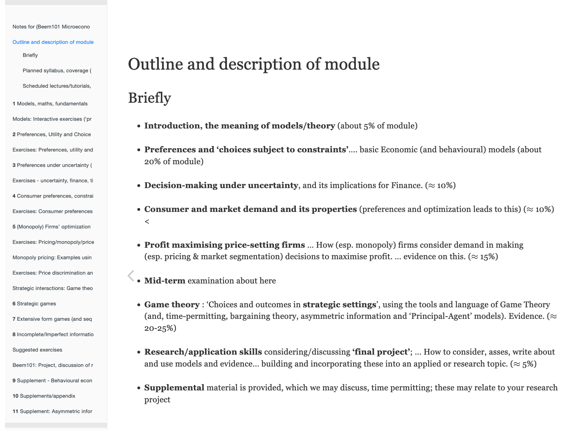

# Existing resources, programs, examples

## Reading syllabi/curated/outlines

### Rhys-Bernard: [reading syllabus - An introduction to global priorities research for economists](https://forum.effectivealtruism.org/posts/dia3NcGCqLXhWmsaX/an-introduction-to-global-priorities-research-for-economists)



### Trammel: "Economic theory and Global Prioritization' &#x20;





## "Web books" and content

### Reinstein (Exeter Msc)  Microeconomics - touches on EA and related 'decision theory' fundamentals; want to adapt



Reply.png>)

## Other lists of syllabi and resources

David Rhys-Bernard curated Pablo Stafforini's list (below), adding to it further.


**David Reinstein:** I took a quick look at the syllabi below. Some seem to be analytically rigorous, and some seem to engage empirical economics and social science (especially measuring the impact of poverty interventions).

_However,_&#x20;

* I did not see any that focused rigorously (with maths) on engaging Economic theory, Decision Science, or Econometrics/measurement/quant stuff
* I found mostly 'themes and reading lists'; no 'web book/textbook' yet&#x20;


****




